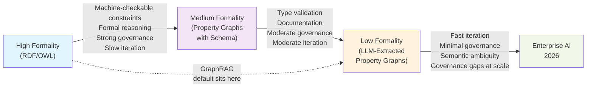

2026 Edition

# Knowledge Graphs, Ontologies & GraphRAG

RDF | OWL | Property Graphs | Semantic Layers  —  Grounding, Reasoning & Governance

A comprehensive study of enterprise knowledge architectures — modeling approaches, AI grounding, multi-hop reasoning, semantic retrieval, governance, and GraphRAG comparisons.

**Data Architects Knowledge Engineers**

**AI Engineers Ontologists Platform Teams Governance Teams**

**Solution Architects**

Covers: Knowledge Graphs  •  Ontologies & Semantic Standards  •  Property Graphs  •  Semantic Layers

Enterprise Modeling  •  AI Grounding & Multi-Hop Reasoning  •  Governance  •  GraphRAG vs. Traditional Architectures

Enterprise Knowledge Architectures — Research Report  |  Confidential CONFIDENTIAL — For Internal Use Only

Published June 2026

## Table of Contents

|**Executive Summary**|**3**|
|---|---|
|**The Knowledge Architecture Landscape**|**5**|
|**1 — Knowledge Graphs**|**7**|
|**2 — Ontologies, RDF & OWL**|**10**|
|**3 — Property Graphs**|**13**|
|**4 — Semantic Layers**|**16**|
|**Enterprise Knowledge Modeling**|**19**|
|**AI Grounding**|**22**|

## Executive Summary

**Key Finding:** Enterprise knowledge architecture has bifurcated into two traditions that are now converging under AI pressure: the semantic web tradition (RDF/OWL/ontologies — formal, reasoning-capable, governance-friendly, but operationally heavy) and the property graph tradition (Neo4j-style — flexible, developer-friendly, fast to build, but historically lighter on formal semantics). GraphRAG has not resolved this divide — most GraphRAG implementations use property graphs with informal, LLM-extracted schemas, inheriting property graphs' agility but also their historical weaknesses in governance and formal reasoning, at exactly the moment those weaknesses matter most for enterprise AI accountability.

This report examines enterprise knowledge architecture across four foundational components — knowledge graphs as a general concept, the formal ontology/RDF/OWL tradition, the property graph tradition, and semantic layers as the governed business-metric interface — before turning to five cross-cutting investigation areas: how enterprises actually model knowledge in practice, how knowledge architectures ground AI systems, how multi-hop reasoning works and where it breaks down, how semantic retrieval combines with (and differs from) traditional search, and what governance for knowledge architectures requires that traditional data governance does not. The report closes with a detailed comparison of GraphRAG against traditional knowledge architectures — not as a replacement decision, but as an analysis of when each is appropriate and how they can coexist.

The central tension running through this report is between formality and agility. Formal ontologies (RDF/OWL) provide machine-checkable semantics, standardized reasoning, and strong governance hooks — at the cost of significant upfront design investment and slower iteration. Property graphs and LLM-extracted GraphRAG schemas provide rapid iteration and natural-language-friendly construction — at the cost of semantic ambiguity, weaker formal guarantees, and governance gaps that compound as the graph grows. Enterprises building knowledge architecture for AI in 2026 are, in effect, choosing a point on this spectrum for each use case — and increasingly, discovering that different use cases within the same organization warrant different points, requiring architectures that can host both.

### Six Critical Findings

#### 1. The 'Knowledge Graph' Label Now Covers Two Architecturally Distinct Things

When practitioners say 'knowledge graph' in 2026, they may mean either a formally-specified RDF/OWL graph with class hierarchies and machine-checkable constraints (the semantic web tradition's descendant), or a property graph with an informally-defined, often LLM-extracted schema of entity and relationship types (the GraphRAG-era default). These have substantially different operational properties, and conflating them — common in vendor marketing and informal discussion — leads to mismatched expectations, particularly around governance and reasoning capability.

#### 2. RDF/OWL's Formal Reasoning Capability Remains Underused in AI Contexts

OWL's description-logic-based reasoning (inferring new facts from explicit ones via formal rules) is one of the most differentiated capabilities the semantic web tradition offers — and one of the least exploited in current GraphRAG/AI architectures, which predominantly use graphs for retrieval (finding relevant nodes/edges to include in an LLM prompt) rather than for reasoning (deriving new facts the graph doesn't explicitly contain). This represents both a missed opportunity and, in domains with established OWL ontologies (life sciences, financial taxonomies), an underused asset.

#### 3. Property Graphs Have Won the AI-Era Adoption Battle, But Not on Technical Merit Alone

Property graphs (Neo4j, and graph capabilities within vector databases) dominate new GraphRAG implementations — driven less by property graphs being technically superior for the reasoning tasks AI applications need, and more by Cypher/GQL's approachability for developers without semantic web backgrounds, and by the natural fit between LLM-extracted entities/relationships and property graphs' flexible, schema-light structure. This adoption pattern has consequences (Section 3) for governance and reasoning capability that often aren't apparent until a knowledge graph matures beyond its initial use case.

#### 4. Semantic Layers Are Becoming the De Facto Bridge Between Formal and Informal Knowledge

Semantic layers (Section 4) — originally designed to solve metric definition drift in BI (companion Architecture Evolution report, Section 7) — are increasingly serving a second function: providing a governed vocabulary layer that can sit above either a formal ontology or an informal property graph, giving AI systems a consistent interface regardless of which underlying knowledge representation is used. This positions semantic layers as a practical integration point for the formality/agility tension described above, even though semantic layers themselves don't resolve that tension within the knowledge graph layer itself.

#### 5. Multi-Hop Reasoning Quality Depends More on Graph Construction Quality Than on Traversal Algorithm Choice

A substantial amount of GraphRAG evaluation focuses on retrieval/traversal algorithms (which paths to explore, how many hops, how to rank results) — but this report's analysis finds that errors in graph construction (entity resolution errors, incomplete relationship extraction, ontology gaps) degrade multi-hop reasoning quality far more than traversal algorithm choice, because traversal algorithms operate on whatever graph exists — a well-tuned traversal over a poorly-constructed graph still produces poor results, while even simple traversal over a well-constructed graph performs reasonably.

#### 6. Knowledge Governance Is the Least Mature Governance Domain Examined Across This Report Series

Compared to data governance (mature, established practices), AI governance (developing, per the companion Operational Excellence report's Part 16), and lineage (mapped in the companion Lineage Systems report), knowledge governance — who can modify an ontology or schema, how entity resolution disputes are adjudicated, how classification propagates to derived graph structures — has the least established practice and tooling. This is a direct consequence of knowledge graphs' rapid, AI-driven adoption (companion Architecture Evolution report, Section 6) outpacing governance practice development, mirroring the pattern by which data lakes outpaced governance in the 2010s (companion Architecture Evolution report, Section 2) — with similar 'swamp'-like risk for ungoverned knowledge graphs.

## The Knowledge Architecture Landscape

The table below provides a navigational overview of the four foundational components examined in this report, positioning each along the formality/agility spectrum and noting its primary enterprise role. Detailed analysis of each follows in the numbered sections.

|**#**|**Component**|**Formality Position**|**Primary Enterprise Role**|**AI-Era Trajectory**|
|---|---|---|---|---|
|1|Knowledge Graphs (general concept)|Spans the spectrum — umbrella term|Entity/relationship representation for search, reasoning, and AI grounding|Rapidly accelerating; increasingly synonymous with GraphRAG infrastructure|
|2|Ontologies, RDF & OWL|Most formal — machine-checkable semantics, description logic|Domain modeling with formal constraints and inference, regulatory taxonomies|Underused in AI contexts relative to capability; pockets of strong adoption (life sciences, finance)|
|3|Property Graphs|Less formal — flexible schema, developer-centric query languages|Application-embedded graphs, GraphRAG entity/relationship stores|Dominant for new GraphRAG builds; governance/reasoning gaps emerging as scale increases|
|4|Semantic Layers|Governance layer above either formal or informal knowledge|Governed business vocabulary; increasingly the AI-agent data interface|Expanding role as the integration point between knowledge representations and AI consumers|

*Table 1: The Knowledge Architecture Landscape*

### The Formality/Agility Spectrum

Most discussions of knowledge graphs present RDF/OWL and property graphs as competing technology choices — but they are better understood as occupying different points on a spectrum of formality versus agility, with real tradeoffs at each point rather than one being categorically superior:

The formality/agility spectrum is defined by:

- **High formality (RDF/OWL):** classes and relationships are explicitly typed with machine-checkable constraints; reasoners can derive new facts and detect inconsistencies; changes to the ontology require careful review since they affect what can be validly asserted — strong governance properties, slower iteration

- **Medium formality (property graphs with enforced schema):** node/relationship types are defined and can be constrained (e.g., Neo4j schema constraints), but without OWL's formal reasoning — types are documentation and validation, not inference triggers — moderate governance, moderate iteration speed

- **Low formality (property graphs with LLM-extracted, informal schema):** entity and relationship types emerge from extraction prompts rather than upfront design; new types can appear as new documents are processed without explicit schema changes — fast iteration, minimal governance unless explicitly added

- **The GraphRAG default sits at the low-formality end** of this spectrum — which explains both its rapid adoption (low barrier to getting started) and the governance/reasoning gaps that emerge as these graphs scale into enterprise-critical infrastructure (a trajectory this report examines in detail in Sections 1, 3, and the Knowledge Governance section)

**How to Read This Report:** Sections 1-4 examine each foundational component on its own terms — what it is, why it exists, and its operational characteristics. The five investigation sections that follow (Enterprise Knowledge Modeling through Knowledge Governance) are cross-cutting — each draws on multiple foundational components and examines how they interact in practice. The closing GraphRAG comparison section synthesizes both into a structured decision framework.

## Knowledge Graphs

The umbrella concept — entities, relationships, and the structures built from them

### What a Knowledge Graph Is — and Why the Definition Matters

A knowledge graph represents entities (people, organizations, products, documents, concepts) as nodes and relationships between them as edges, typically with properties attached to both. This definition is intentionally broad — broad enough to encompass Google's original Knowledge Graph (2012), enterprise RDF triple stores with formal ontologies, Neo4j property graphs embedded in applications, and the entity/relationship graphs constructed by GraphRAG pipelines from unstructured documents. The breadth of the term is itself a source of confusion in enterprise contexts: a stakeholder asking 'do we have a knowledge graph' may receive a 'yes' that refers to any of these substantially different things, with substantially different capabilities.

### The Two Historical Traditions, Briefly Revisited

As discussed in the companion Architecture Evolution report's Section 6, knowledge graphs have two distinct emergence stories. The semantic web tradition (2000s-2010s, RDF/OWL/SPARQL) emphasized formal semantics and reasoning, with adoption concentrated in life sciences, financial taxonomies, and government data exchange. The AI/GraphRAG-driven second wave (2022-2024) emphasized retrieval for LLM grounding, with adoption driven by RAG's multi-hop reasoning limitations. This report's Sections 2 and 3 examine each tradition's current technology in depth; this section focuses on what's common across both — the properties any knowledge graph has regardless of which tradition produced it.

### Core Architectural Properties Common to All Knowledge Graphs

#### Entity Resolution as a Continuous Process

Any knowledge graph drawing from multiple sources (or even a single source over time) must determine when two references — 'Acme Corp' in one document, 'Acme Corporation' in another — refer to the same real-world entity. This is not a one-time setup task but a continuous process as new data arrives, and entity resolution errors (over-merging distinct entities, or under-merging the same entity into duplicates) are the most common source of knowledge graph quality degradation regardless of whether the graph is RDF-based or a property graph.

#### Schema as a Spectrum, Not a Binary

Even 'schema-less' property graphs have an implicit schema — the set of node labels and relationship types actually in use. The question is not whether a schema exists but how explicitly it's defined, how strictly it's enforced, and how it evolves. RDF/OWL makes schema maximally explicit (Section 2); LLM-extracted property graphs make it maximally implicit (Section 3) — but both have a schema in the sense that matters for querying and governance: a defined (if differently-defined) vocabulary of types.

#### Traversal as the Fundamental Operation

Whether via SPARQL (RDF) or Cypher/GQL (property graphs), the fundamental operation a knowledge graph supports that distinguishes it from tabular/document storage is traversal — following relationships from a starting entity to discover connected entities, potentially many hops away. This is the capability that directly addresses RAG's multi-hop reasoning limitation (this report's Multi-Hop Reasoning section) and is common to all knowledge graph implementations regardless of formality.

#### Provenance as an Architectural Afterthought (Across Both Traditions)

As discussed in the companion Lineage Systems report's Section 6, knowledge lineage — tracing which sources produced which graph elements — is underdeveloped across the knowledge graph landscape generally, not specifically a property-graph or GraphRAG weakness. Even mature RDF/OWL implementations with formal ontologies frequently lack systematic provenance tracking for individual triples, though the W3C PROV standard (mentioned in the companion Lineage Systems report) originated specifically to address this within the semantic web tradition — its limited adoption reflects a broader pattern of provenance being treated as optional rather than foundational.

### Why Enterprise Adoption Accelerated: The AI Grounding Connection

The single most significant driver of knowledge graph adoption from 2022 onward is AI grounding — providing LLMs with structured, relationship-aware context that pure vector retrieval (companion Architecture Evolution report, Section 9) cannot provide. This connection is examined in depth in the AI Grounding section of this report, but its effect on adoption patterns is worth noting here: organizations that had previously evaluated and declined knowledge graph investment (finding the ontology design and entity resolution effort difficult to justify against unclear ROI) revisited that decision once GraphRAG provided a concrete, measurable use case — improved RAG answer quality for relationship-dependent questions. This shift in justification (from 'better enterprise search' to 'better AI grounding') has shaped which knowledge graph technologies gained traction (Section 3's property graphs, more so than Section 2's formal ontologies, for the reasons discussed in that section).

**Framing for the Rest of This Report:** 'Knowledge graph' as a category is best understood not as a single technology choice but as a design space defined by where an implementation sits on the formality/agility spectrum (this report's Executive Summary) and how rigorously it addresses entity resolution, schema evolution, and provenance — properties that matter regardless of formality level but that are addressed very differently by RDF/OWL-based (Section 2) versus property-graph-based (Section 3) implementations.

## Ontologies, RDF & OWL

Formal semantics, machine-checkable constraints, and description-logic reasoning

### The Semantic Web Stack

RDF (Resource Description Framework), OWL (Web Ontology Language), and SPARQL (the query language) form a layered stack standardized by the W3C. RDF provides the basic data model — facts expressed as subject-predicate-object triples (e.g., 'Company A — supplies — Product B'). OWL builds on RDF to define ontologies — formal specifications of classes, properties, and the logical relationships between them (e.g., 'every Supplier must supply at least one Product', 'a Subsidiary is a type of Company', 'if A supplies B and B is a component of C, then A indirectly supplies C'). SPARQL queries RDF data, including data that's only implicitly true via OWL's logical rules — a SPARQL query can return facts that were never explicitly asserted but that follow logically from what was asserted plus the ontology's rules.

### What an Ontology Provides That a Plain Schema Doesn't

#### Class Hierarchies with Inheritance

An ontology can define that 'Subsidiary' is a subclass of 'Company', meaning every constraint and property that applies to Companies automatically applies to Subsidiaries — without needing to redefine those constraints. This is similar to object-oriented inheritance but applied to data semantics rather than code.

#### Formal Constraints (Restrictions)

OWL can express constraints like 'a Drug must have exactly one active ingredient' or 'a Transaction's amount must be a positive number' as formal axioms — and a reasoner can check whether actual data satisfies these constraints, flagging inconsistencies that violate the ontology's rules. This provides a form of automated data quality checking that's derived directly from the domain model, rather than separately-maintained validation rules.

#### Inference (Deriving New Facts)

Given the asserted facts 'Company A is a Subsidiary of Company B' and an ontology axiom 'Subsidiary relationships are transitive', a reasoner can infer 'Company A is (transitively) a Subsidiary of Company C' if Company B is itself a Subsidiary of Company C — without this fact ever being explicitly stated. This inference capability is OWL's most distinctive feature relative to property graphs, and the one most directly relevant to multi-hop reasoning (this report's dedicated section).

#### Interoperability via Shared Vocabularies

Because RDF/OWL are W3C standards with established upper ontologies (e.g., FIBO — Financial Industry Business Ontology) and patterns for linking to external vocabularies (linked data), organizations in domains with established ontologies can align their internal knowledge graphs with industry-standard vocabularies — enabling a degree of semantic interoperability with external parties (regulators, partners, data providers) that proprietary property graph schemas don't provide.

### Why Adoption Has Remained Concentrated

Despite these capabilities, RDF/OWL adoption has remained concentrated in specific domains rather than achieving the broad enterprise adoption that property graphs have seen in the GraphRAG era. The reasons are structural rather than purely technical:

- **Ontology design requires specialized expertise and significant upfront investment:** building a useful OWL ontology requires both domain expertise and formal logic/ontology engineering skills — a combination that's rare, and the upfront design effort (with long-lasting consequences, as discussed in the companion Architecture Evolution report's Section 6) is difficult to justify without a domain where the formal reasoning capability has clear, demonstrable value

- **SPARQL's learning curve relative to SQL or Cypher:** SPARQL's syntax and the triple-based data model it queries are less immediately familiar to engineers with SQL or property-graph backgrounds than Cypher/GQL (Section 3), which deliberately echo SQL's pattern-matching style — a practical adoption barrier independent of SPARQL's actual expressiveness

- **Reasoning performance tradeoffs:** OWL reasoning (especially for more expressive OWL profiles) can have meaningful query-time performance costs, requiring careful choices about which inferences to materialize in advance versus compute at query time — a performance engineering concern that doesn't have a direct analog in property graphs, where there's no reasoning layer to optimize

- **The domains where formal reasoning has clearest value are inherently narrower:** life sciences (drug interactions, gene ontologies), financial regulatory taxonomies (FIBO), and government/defense data exchange standards all involve domains with genuinely complex, formally-specifiable rule systems where inference provides clear value — but most enterprise knowledge (organizational structure, product catalogs, customer relationships) doesn't have comparably rich formal rule systems, reducing the relative value of OWL's reasoning capability for these more common use cases

### RDF/OWL in the AI Era: An Underused Asset

For organizations in domains with existing OWL ontologies (life sciences, financial services), the AI era presents an underexplored opportunity: these ontologies already encode formal domain knowledge that could ground AI systems with stronger guarantees than LLM-extracted property graphs provide — an OWL reasoner can guarantee that an inferred relationship follows logically from explicit facts plus formal rules, whereas an LLM-extracted relationship has no such guarantee (it reflects what the extraction model inferred from text, which may or may not be logically sound). However, as noted in this report's Executive Summary, current GraphRAG implementations predominantly use graphs for retrieval rather than reasoning — meaning even organizations with existing OWL ontologies often build separate, informal property graphs for their GraphRAG implementations rather than leveraging existing formal ontologies, missing an opportunity to combine GraphRAG's retrieval-for-LLM-grounding pattern with OWL's formal-reasoning guarantees.

**Practical Guidance:** Organizations in domains with existing OWL ontologies should evaluate whether GraphRAG implementations can query the existing ontology (via SPARQL, potentially with a translation layer making this accessible to LLM-based agents) rather than constructing a separate, informal property graph from scratch — this preserves the formal reasoning guarantees the ontology provides while extending it to AI grounding use cases. Organizations without existing ontologies should not treat 'build an OWL ontology' as a prerequisite for GraphRAG — the upfront investment is substantial and the property-graph approach (Section 3) is appropriate for domains without pre-existing formal rule systems to encode.

## Property Graphs

The flexible, developer-friendly default for GraphRAG-era knowledge graphs

### The Property Graph Data Model

Property graphs represent entities as nodes (each with a label indicating its type, e.g., 'Company', 'Person', 'Product') and relationships as directed, typed edges (e.g., 'SUPPLIES', 'EMPLOYS') — with both nodes and edges able to carry arbitrary key-value properties (e.g., a 'Company' node might have 'founded_year', 'headquarters_location' properties). This is structurally similar to RDF's subject-predicate-object model but with two practical differences: properties attach directly to nodes and edges (rather than being expressed as additional triples), and there's no equivalent to OWL's formal class hierarchy and constraint system as a built-in feature — though schema constraints can be added (discussed below).

### Why Property Graphs Won the GraphRAG Era

#### Query Language Approachability

Cypher (Neo4j) and its successor GQL (now an ISO standard, with multiple vendors implementing it) use SQL-like, pattern-matching syntax that's significantly more approachable for engineers without semantic web backgrounds than SPARQL — a query like 'MATCH (a:Company)-[:SUPPLIES]->(b:Product) RETURN a, b' is readable to most developers with SQL experience in a way SPARQL's triple-pattern syntax often isn't initially.

#### Natural Fit for LLM-Extracted Schemas

When an LLM extracts entities and relationships from unstructured text (the core GraphRAG construction step), the output naturally takes the form 'Entity X, Entity Y, relationship type Z between them' — which maps directly onto property graph nodes/edges without requiring the extraction process to also produce formal class hierarchies, restrictions, or other OWL constructs. The property graph model's lower formal overhead matches the informal nature of LLM extraction output.

#### Integration with Vector Search

Major property graph platforms (Neo4j with vector indexes, and vector databases adding graph capabilities) have converged toward combined vector+graph querying within a single system — directly supporting the GraphRAG pattern of 'vector search to find relevant starting entities, then graph traversal from those entities' within one platform, reducing the architectural complexity of combining separate vector and graph systems.

#### Ecosystem Momentum from Application Development

Property graphs (particularly Neo4j) had an established presence in application development (recommendation engines, fraud detection, social networks) before the GraphRAG wave — providing existing operational expertise, tooling, and vendor relationships that many enterprises could extend to GraphRAG use cases, versus RDF/OWL's more specialized and less common existing footprint outside specific domains (Section 2).

### The Schema Spectrum Within Property Graphs

Property graphs are often described as 'schema-less', but in practice implementations span a spectrum:

- **Fully informal (most common in early GraphRAG implementations):** node labels and relationship types emerge directly from LLM extraction with no predefined vocabulary — the same underlying concept might be labeled 'Organization' in one extraction batch and 'Company' in another, depending on prompt variations or model non-determinism, leading to schema fragmentation that's only discovered when queries fail to match expected patterns

- **Constrained/validated schema:** Neo4j and other property graph databases support schema constraints (e.g., uniqueness constraints, required properties, node label and relationship type validation) — applying these requires an explicit schema definition step that many GraphRAG implementations skip in early phases but increasingly adopt as graphs mature, since constraint violations surface schema fragmentation issues that would otherwise accumulate silently

- **Schema with formal documentation but no enforcement:** an intermediate pattern where a schema is documented (e.g., 'these are the valid node labels and relationship types, with these expected properties') for human and LLM-extraction-prompt reference, but not technically enforced by the database — providing some of the governance benefit of explicit schema (a documented vocabulary that extraction prompts can be guided to use) without the operational overhead of enforcement, though without enforcement, drift between the documented schema and actual graph contents can still occur

- **OWL-equivalent formal constraints layered on a property graph:** some implementations layer formal validation (similar in spirit to OWL restrictions, though using property-graph-specific tooling rather than OWL itself) on top of a property graph — this is less common but represents a hybrid point on the formality spectrum, gaining some of Section 2's governance benefits without adopting the full RDF/OWL stack

### Where Property Graphs' Flexibility Becomes a Liability

The same flexibility that makes property graphs easy to start with creates compounding issues as graphs scale — directly connecting to this report's findings on knowledge governance (its own dedicated section) and the companion Architecture Evolution report's discussion of knowledge graph failure modes:

- **Schema fragmentation compounds silently:** without enforced schema, semantically-equivalent concepts (e.g., 'Organization' vs. 'Company' vs. 'Business') can coexist as distinct node labels indefinitely — queries written against one label silently miss data labeled with the other, producing incomplete (not erroneous) results that are hard to detect

- **No built-in mechanism for detecting logical inconsistencies:** unlike OWL, where a reasoner can flag that asserted facts violate ontology constraints, property graphs have no equivalent — a graph can contain logically contradictory relationships (e.g., 'A is a subsidiary of B' and 'B is a subsidiary of A') without any system-level signal that something is wrong, relying entirely on application-level or manual review to catch such issues

- **Relationship type proliferation:** LLM extraction across diverse document types tends to produce an expanding vocabulary of relationship types over time (e.g., 'SUPPLIES', 'PROVIDES', 'DELIVERS_TO', 'IS_VENDOR_FOR' as semantically-similar-but-distinct edges from different extraction runs) — without active curation, the relationship type vocabulary can grow unmanageably, complicating both querying (which relationship types must a query check?) and maintenance

**Practical Guidance:** The flexibility/governance tradeoff for property graphs is manageable but requires deliberate intervention — it does not resolve itself as the graph grows; if anything, the cost of intervention grows with graph size. Organizations should establish a documented schema (even if not strictly enforced) before significant graph construction begins, and should periodically audit for schema fragmentation (e.g., near-duplicate node labels or relationship types) as a recurring governance task — treating this analogously to the data catalog curation practices that prevent data lake 'swamp' formation (companion Architecture Evolution report, Section 2).

## Semantic Layers

From metric governance to the bridge between formal and informal knowledge

### Recap: The Semantic Layer's Original Purpose

As covered in depth in the companion Architecture Evolution report's Section 7, semantic layers emerged to solve metric definition drift — providing a single, governed definition of business metrics (e.g., 'monthly active users', 'gross margin') that all consuming tools (BI dashboards, ad-hoc queries, increasingly AI agents) query through, rather than reimplementing definitions independently. This section examines a second, increasingly important role semantic layers play specifically in knowledge architecture: as a bridge between differently-formal knowledge representations.

### The Bridge Role: Connecting Formal and Informal Knowledge

Consider an enterprise with both an OWL-based regulatory taxonomy (Section 2 — e.g., a financial product classification ontology) and a property-graph-based GraphRAG implementation (Section 3 — e.g., entities extracted from customer communications). These two knowledge representations use different formalisms, different query languages, and were likely built by different teams with different tooling. A semantic layer can sit above both, defining business-meaningful terms ('regulated product category', 'customer relationship type') that map to underlying concepts in each representation — providing AI agents (and human users) with a single vocabulary to query, regardless of which underlying representation actually answers a given query. This bridging role is distinct from, and additive to, the metric-governance role — the same semantic layer infrastructure serves both purposes.

### How This Bridging Works in Practice

#### Term Mapping / Vocabulary Alignment

The semantic layer maintains mappings from business terms to underlying representations — 'customer' might map to a SPARQL query pattern against the OWL-based CRM ontology for one set of attributes (e.g., regulatory classification) and to a Cypher query pattern against the property graph for another set (e.g., recent support interactions extracted via GraphRAG). From the AI agent's perspective, querying 'customer relationship type' returns a unified result without the agent needing to know which underlying system, query language, or formalism produced which part of the answer.

#### Consistency Enforcement Across Representations

Where the same real-world concept exists in both a formal ontology and an informal property graph (e.g., 'Company' exists as an OWL class with formal constraints, and also as a property graph node label from GraphRAG extraction), the semantic layer can enforce that queries against 'company' respect the formal ontology's constraints even when the underlying data comes from the less-formal property graph — effectively extending Section 2's governance benefits to Section 3's data, without requiring the property graph itself to be reformalized.

#### Single Point for Access Control Across Representations

As discussed in the companion Architecture Evolution report's Section 6, access control on knowledge graphs is more complex than on tables — restricting access to certain relationships or entity types requires graph-aware access control that general-purpose frameworks don't natively support well. A semantic layer that mediates all access (rather than allowing direct SPARQL/Cypher access to underlying graphs) provides a single enforcement point, even if the underlying graphs themselves have inconsistent or absent native access control — echoing the semantic-layer-as-agent-interface pattern discussed for lakehouse data in the companion Architecture Evolution report's Section 7.

### Limitations of the Bridging Role

- **The semantic layer doesn't resolve underlying inconsistencies, it routes around them:** if the OWL ontology and the property graph have genuinely conflicting representations of the same concept (e.g., different definitions of what makes an entity a 'Subsidiary'), the semantic layer can choose which to surface for a given term, but this is a curatorial decision, not a reconciliation — the underlying inconsistency persists and could surface unexpectedly if a query path not anticipated by the semantic layer's mappings is used

- **Mapping maintenance is itself a governance burden:** as either the OWL ontology or the property graph schema evolves (Section 3's schema fragmentation, or Section 2's ontology evolution), the semantic layer's mappings must be updated correspondingly — creating a maintenance dependency where the semantic layer can become stale relative to either underlying representation, reintroducing (at the semantic layer level) the definition-drift problem the semantic layer was originally created to solve

- **Performance characteristics vary by underlying representation:** a semantic layer query that's translated into a SPARQL query with OWL reasoning will have different latency characteristics than one translated into a Cypher traversal — from the consuming AI agent's perspective, this can create unpredictable response times depending on which underlying representation a given query happens to route to, a concern directly analogous to the companion Architecture Evolution report's discussion of data fabric's federated query performance unpredictability

**Strategic Positioning:** For enterprises with both formal ontology investments (Section 2) and growing GraphRAG property graph investments (Section 3) — increasingly common as both trends mature — the semantic layer's bridging role represents a pragmatic path that avoids forcing a single-formalism decision across the enterprise. Rather than migrating existing OWL ontologies to property graphs (losing formal reasoning guarantees) or attempting to formalize GraphRAG-extracted graphs into OWL (a substantial, likely impractical undertaking given extraction volume), a semantic layer allows each representation to be used where it's strongest — formal reasoning where the ontology provides it, flexible extraction-based retrieval where the property graph provides it — while presenting a unified interface to AI consumers.

## Enterprise Knowledge Modeling

Knowledge modeling — deciding what entities, relationships, and properties an enterprise knowledge architecture represents — is the foundational design activity that determines both the capability and the long-term maintainability of everything built on top of it. This section examines how enterprises approach knowledge modeling in practice, contrasting top-down (ontology-first) and bottom-up (extraction-first) approaches, and the increasingly common hybrid patterns between them.

### Top-Down: Ontology-First Modeling

The traditional semantic web approach (Section 2): domain experts and ontology engineers collaboratively define entity types, relationship types, and constraints before significant data population begins. This produces a deliberately-designed model with the formal properties discussed in Section 2 — but requires substantial upfront investment and domain expertise that's organizationally scarce. Top-down modeling works best when: the domain has well-established, relatively stable concepts (organizational structure, regulatory categories, product taxonomies); there's a small number of expert stakeholders who can authoritatively define the model; and the cost of getting the model wrong is high (e.g., regulatory reporting depends on correct classification).

### Bottom-Up: Extraction-First Modeling

The GraphRAG-era default (Section 3): entity and relationship types emerge from running extraction (typically LLM-based) over a document corpus, with the resulting types becoming the de facto schema. This avoids the upfront design bottleneck — extraction can begin immediately — but produces a model that reflects whatever the extraction process happened to identify, which may be incomplete (concepts present in the domain but not prominently represented in the processed documents won't appear), inconsistent (as discussed in Section 3's schema fragmentation), or skewed toward concepts that are easy for the extraction model to identify versus concepts that are actually most important for the enterprise's use cases. Bottom-up modeling works best when: the domain is less well-understood upfront (exploratory knowledge discovery); speed to initial value matters more than completeness; and the use case (typically GraphRAG retrieval) is tolerant of incompleteness — a missing entity type means some questions can't be answered via the graph, but doesn't cause incorrect answers the way a logically-inconsistent formal ontology might.

### Hybrid Patterns

#### Seed Schema + Extraction-Guided Expansion

Define a small set of core entity/relationship types upfront (a lightweight top-down seed — perhaps the 10-20 concepts most central to the enterprise's domain), then allow extraction to populate instances of these types and, separately, flag candidate new types it encounters for human review rather than automatically adding them to the schema. This bounds schema fragmentation (Section 3's concern) while preserving extraction's speed advantage for populating instances of known types.

#### Top-Down Core + Bottom-Up Periphery

Maintain a formally-modeled core (potentially OWL-based, per Section 2) for the enterprise's most critical, stable, and regulation-relevant concepts, while allowing a less-formal property graph (Section 3) to handle peripheral, rapidly-evolving, or exploratory concepts — connected via the semantic layer bridging pattern discussed in Section 4. This is the pattern this report's Executive Summary identifies as increasingly common for enterprises with pre-existing ontology investments expanding into GraphRAG.

#### Periodic Schema Consolidation

Run extraction in a fully bottom-up manner for an initial period, then periodically (e.g., quarterly) conduct a schema consolidation review — identifying near-duplicate types (Section 3's relationship type proliferation concern) and merging them, effectively converting an initially-informal schema into a progressively more curated one over time. This defers modeling investment until there's empirical evidence (actual extraction output) of what the schema needs to cover, at the cost of accumulating technical debt (queries written against pre-consolidation types) between consolidation cycles.

### Modeling for Multiple Consumers: Humans, Search, and Agents

A knowledge model designed primarily for human consumption (e.g., a knowledge graph powering an internal wiki's 'related topics' feature) and one designed primarily for AI agent consumption (e.g., GraphRAG retrieval feeding an agent's context) have different optimal characteristics — human-facing models benefit from intuitive, human-readable type names and groupings that match how people think about the domain, while agent-facing models benefit from types and relationships that map cleanly onto the kinds of multi-hop queries (this report's dedicated section) the agent needs to answer, which may not align with human-intuitive groupings. Enterprises building knowledge models that serve both audiences should expect some tension between these optimization targets, and the semantic layer bridging pattern (Section 4) is one mechanism for presenting different views of the same underlying knowledge to different consumer types without maintaining fully separate models.

## AI Grounding

Grounding — connecting an AI system's outputs to verifiable, enterprise-specific information rather than relying solely on the model's parametric (training-time) knowledge — is the primary justification for enterprise knowledge architecture investment in the AI era. This section examines how the components from Sections 1-4 contribute to grounding, and where grounding can fail despite a knowledge architecture being technically present.

## Related

- [Grounding Architectures](10-grounding.md) — how this report's modeling approaches translate into production grounding.
- [Complex RAG Systems: Deep Technical Guide](13-complex-rag-deep-dive.md) — implementation-level detail for the retrieval patterns this report models conceptually.
- [Data Architecture for AI: Foundations & Infrastructure](03-data-architecture-for-ai-report.md) — where knowledge graphs fit among the other foundational data-layer components.

---

**Continue to Part 2:** For investigation of multi-hop reasoning, semantic retrieval, knowledge governance, and GraphRAG comparison with traditional architectures, see [Part 2: AI Grounding Deep-Dive & Architectures](pathname:///archon/data-knowledge/parts/05-enterprise-knowledge-architectures-report-part2).
