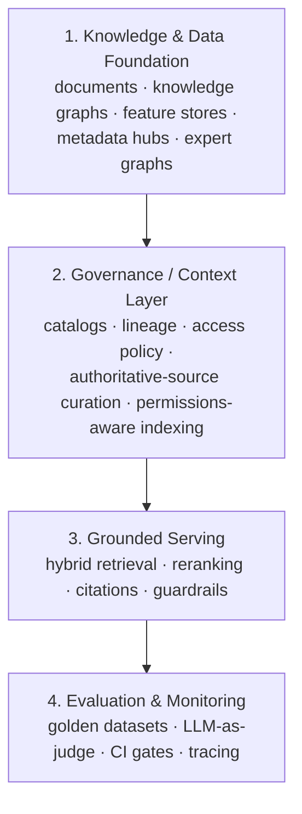

import SectionProgress from '@site/src/components/SectionProgress';

Agent quality is bounded by what an agent can retrieve, not just how it
reasons. This hub covers the data and knowledge layer underneath agentic
systems: architecture and engineering, RAG, knowledge graphs, and the memory
and lineage guarantees a production agent depends on.

<SectionProgress domain="data-knowledge" />

## Scope

- Data architecture and engineering for AI
- Retrieval-Augmented Generation (RAG) hub
- Knowledge graphs and GraphRAG
- Semantic and long-term memory
- Data lineage
- Lakehouse architecture

## Why This Matters Now

The question enterprises asked in 2023–2024 was *"does RAG work?"* The question in 2026 is *"how do we make knowledge systems safe, verifiable, and governable at enterprise scale?"* Three forces drove that shift:

1. **Production failures traced to data, not models.** Every retrieval platform serves what it's given. The consistent finding across enterprise deployments is that the missing layer is *data governance* — deciding which sources are authoritative, who may access them, and whether they're still accurate — and that this layer must sit **upstream** of the retrieval stack.
2. **Regulation with teeth.** The EU AI Act's GPAI obligations took effect August 2025, with Commission enforcement from August 2026, and the June 2026 high-risk technical guidelines explicitly call out retrieval-based generative architectures. ISO/IEC 42001 made AI governance certifiable; NIST's AI RMF and its Generative AI Profile became the de facto risk vocabulary.
3. **Evaluation became an engineering discipline.** Systematic evaluation frameworks (RAGAS, DeepEval, TruLens) moved from research papers into CI/CD pipelines, with groundedness thresholds acting as deployment gates.

### The Convergent Architecture

Tech companies and consultancies arrived at the same shape from opposite directions — Big Tech built governance/metadata platforms first and added LLM serving later; consulting firms built LLM assistants first and discovered they needed the governance layer to make them trustworthy. The result is a common four-layer pattern:

Industry case studies covering how leading tech companies (Uber, LinkedIn, Netflix, Microsoft, Amazon) and consulting firms (McKinsey, BCG, Deloitte, EY) build these layers in practice: [How Tech Companies Serve Knowledge](11-tech-companies.md), [Consulting Firm AI Platforms](07-consulting-firms.md), [Governance & Responsible AI](09-governance-rai.md), [Grounding Architectures](10-grounding.md), [Evaluation & Quality Gates](08-evaluation.md).

## Related

- [Agentic Systems Hub](../agentic-systems/index.md) — the consumer of this RAG and memory layer.
- [Platforms Hub](../platforms/index.md) — the lakehouse and data infrastructure underneath.
