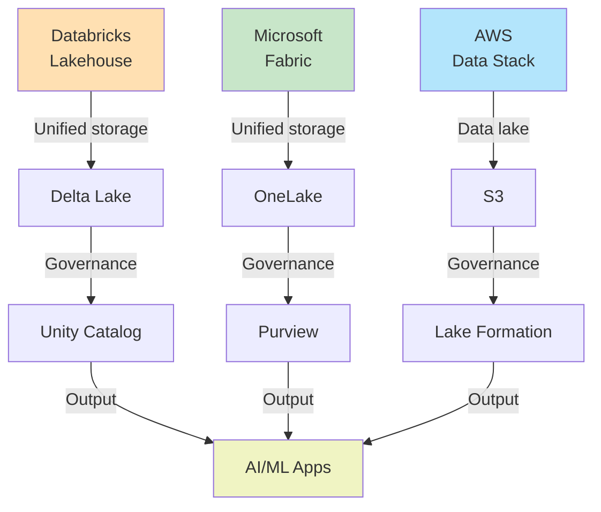
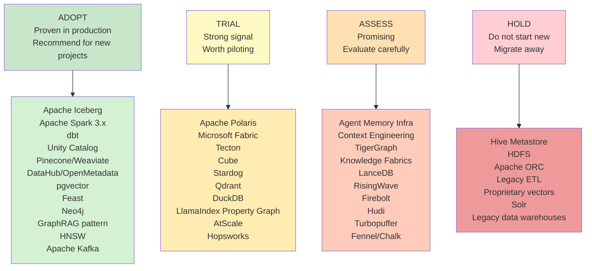

**Part 2 of 2** — Canonical reference architectures, governance frameworks, regulatory compliance, real-world enterprise implementations, emerging technology trends, and strategic guidance for data platform architecture decisions.

**Audience:** Enterprise Architects, Data Platform Leaders, Governance Teams, AI/ML Platform Engineers

**Coverage:** Reference Models · Governance & Compliance · Enterprise Case Studies · Emerging Trends · Technology Radar · Vendor Landscape

**As of:** June 2025

---

## Enterprise AI Data Architecture Reference Models

Cloud provider patterns, AI vendor blueprints, and consulting frameworks

### Databricks AI-Native Lakehouse Reference Architecture

The Databricks reference architecture centers on Delta Lake as the unified storage layer with Unity Catalog providing governance across all data types — structured, unstructured, and AI assets (models, experiments, vectors).

| Layer | Components |
|---|---|
| Ingestion Layer | Kafka (streaming), Autoloader (batch cloud files), Delta Live Tables (streaming ETL) |
| Storage Layer | Delta Lake on S3/ADLS/GCS with Unity Catalog governance |
| Processing Layer | Databricks Runtime (Spark + Photon), MLflow, Feature Store |
| AI/ML Layer | Mosaic AI (fine-tuning), Model Serving (real-time inference), Vector Search (RAG) |
| Governance Layer | Unity Catalog — tables, models, dashboards, files; ABAC policies |
| Consumption Layer | SQL Warehouses, BI tools (Tableau, Power BI), AI applications via REST APIs |

*Table 7: Databricks AI Lakehouse Reference Architecture*

### Microsoft Fabric Reference Architecture

Microsoft Fabric unifies the entire data estate under OneLake (Delta Lake-based) with a single governance model via Microsoft Purview. Copilot AI is embedded across all workloads.

- **Data Factory:** ETL/ELT pipelines with 150+ connectors

- **Synapse Data Engineering:** Spark-based large-scale processing on OneLake

- **Synapse Data Science:** ML model development with MLflow and AutoML

- **Synapse Real-Time Analytics:** Kusto/ADX-based streaming analytics

- **Data Warehouse:** T-SQL compatible DW on OneLake storage

- **Power BI:** Semantic model and reporting layer

- **Microsoft Purview:** Unified governance, lineage, and compliance across all Fabric workloads

- **Copilot:** AI assistant embedded in every workload for natural language interaction

### AWS Generative AI Data Architecture

AWS recommends a layered architecture anchored on S3 as the data lake, with specialized services for each AI workload type:

| Layer | AWS Services |
|---|---|
| Data Foundation | S3 + AWS Glue Catalog + Apache Iceberg (via Athena/EMR) + Lake Formation for access control |
| Processing | EMR Serverless (Spark), AWS Glue (ETL), Kinesis (streaming), Flink on EMR |
| ML Platform | SageMaker Feature Store, SageMaker Pipelines, SageMaker Studio, SageMaker Model Registry |
| GenAI Services | Amazon Bedrock (foundation models), Amazon Q (enterprise AI assistant), Kendra (enterprise search) |
| Vector Retrieval | OpenSearch Serverless (vector search), Amazon Neptune Analytics (graph+vector) |
| Governance | AWS Lake Formation (RBAC/ABAC), Macie (PII detection), CloudTrail (audit) |

*Table 8: AWS Generative AI Reference Architecture*

## Governance, Security &amp; Compliance

Data contracts, ABAC/RBAC, AI governance, and regulatory frameworks

### Data Governance Framework

Effective data governance for AI requires going beyond traditional data management to encompass AI-specific concerns: model lineage, training data provenance, bias detection, and explainability documentation.

#### Data Ownership &amp; Stewardship

Assign clear domain ownership aligned with Data Mesh principles. Each data product has a named data owner (business) and data steward (technical). Ownership is codified in the metadata catalog and enforced through data contracts.

#### Data Contracts

Schema agreements between data producers and consumers with SLA guarantees on schema stability, data quality thresholds, and update frequency. Tooling: Soda, Great Expectations, Monte Carlo. Contracts versioned in Git alongside data pipeline code.

#### Data Quality

Multi-dimensional quality measurement: completeness, accuracy, consistency, timeliness, uniqueness, validity. Quality scores attached to datasets in catalog and used to gate ML training pipelines. Poor-quality training data is the #1 cause of poor model performance.

#### Lineage Tracking

End-to-end lineage from source systems through transformations to BI reports and ML models. Critical for AI: understanding which training data contributed to model predictions. Platforms: DataHub, OpenMetadata, Collibra, dbt lineage, Unity Catalog lineage.

### Security Architecture

| Control | Description | Implementation | AI Relevance |
|---|---|---|---|
| Row-Level Security (RLS) | Restrict rows visible to each user/role | SQL predicates in views or engine-level enforcement | Prevent leakage of sensitive rows into training data |
| Column-Level Security (CLS) | Mask or restrict specific columns | Column masking policies in Unity Catalog, Snowflake, BigQuery | Exclude PII columns from LLM context |
| RBAC (Role-Based Access Control) | Permissions based on user role | IAM roles, catalog roles, database roles | Restrict who can access sensitive ML training data |

| Control | Description | Implementation | AI Relevance |
|---|---|---|---|
| ABAC (Attribute-Based Access Control) | Dynamic permissions based on data attributes | Tag-based policies in Lake Formation, Unity Catalog | Dynamic PII filtering based on data sensitivity tags |
| Zero Trust | No implicit trust; verify every request | Short-lived credentials, mTLS, network segmentation | Prevent lateral movement in AI inference pipelines |

*Table 9: Data Security Controls for AI Architectures*

### Regulatory Compliance Frameworks

#### EU AI Act (2024)

High-risk AI systems require technical documentation, conformity assessments, human oversight, and data governance requirements for training data. Data architects must implement: training data documentation, quality metrics, bias analysis, and ongoing monitoring with audit trails. Enforcement begins 2025–2026 by risk tier.

#### GDPR / CCPA

Data minimization, purpose limitation, and right-to-erasure requirements affect AI training data management. Lakehouse time-travel and row-level deletes enable GDPR compliance on modern data platforms. Data lineage essential for demonstrating data processing lawfulness.

#### NIST AI RMF

Voluntary but widely adopted framework for AI risk management across four functions: Govern, Map, Measure, Manage. Maps well to enterprise data governance structures. Increasingly referenced in government contracts and procurement.

#### ISO 42001 (AI Management System)

First international standard for AI management systems. Parallels ISO 27001 for information security. Requires documented AI policies, risk management processes, and performance monitoring.

#### SOC 2 Type II

Widely required for enterprise AI vendors. Covers security, availability, processing integrity, confidentiality, and privacy. Data platforms must demonstrate controls over AI model access, training data protection, and inference audit logs.

## Enterprise Search &amp; AI Knowledge Platforms

Copilot architectures, permission-aware retrieval, and grounding systems

### Microsoft 365 Copilot

Architecture: Microsoft Graph (permissions + relationships) + Bing Index (web) + SharePoint/Exchange indexes + Azure AI Search (semantic + vector) + OpenAI GPT-4. Grounding: Retrieval from tenant-scoped indexes with permission filtering — users only see content they have access to in Microsoft 365. Knowledge: Organizational graph from Azure AD enables people-centric retrieval ('find emails from my manager about Project X'). Scale: Processing trillions of signals across ~300M commercial seats.

### Google Workspace AI (Duet AI / Gemini)

Architecture: Google's Knowledge Graph + Vertex AI Search + Gmail/Drive/Docs indexes + Gemini models. Grounding: Google's search technology applied to private enterprise content with workspace-level permission enforcement. Distinctive: NotebookLM for document-specific knowledge synthesis; Deep Research for multi-step autonomous research tasks.

### Salesforce Einstein Copilot

Architecture: Data Cloud (customer graph) + Unified Knowledge (documents) + Einstein Trust Layer (security + PII masking) + foundation model gateway. Key innovation: Einstein Trust Layer enforces that no customer data leaves Salesforce infrastructure during LLM calls. BYOM (Bring Your Own Model) support. CRM-native context: full history of customer relationships available as graph context.

### ServiceNow AI / Now Assist

Architecture: Now Platform data (CMDB, incidents, knowledge articles) as structured knowledge graph + RAG over knowledge base articles + LLM for generation. Domain specialization: ITSM, ITOM, HR, and CSM contexts fine-tuned. Key strength: CMDB as enterprise configuration knowledge graph enables IT-context-aware AI responses impossible with general-purpose systems.

### Atlassian Intelligence

Architecture: Confluence + Jira content indexed with Atlassian's search + embedding-based retrieval + external LLM. Rovo product enables cross-product search and AI chat across all Atlassian content. Distinctive: Team Anywhere and organizational graph from Atlassian access patterns.

## Real-World Enterprise Case Studies

Architecture evolution, scaling lessons, and AI enablement at leading companies

### Netflix — Data Platform + ML at Scale

- **Architecture:** Iceberg on S3 as unified table format (migrated from Hive). Spark for batch, Flink for streaming. Maestro workflow orchestrator. Metaflow for ML.

- **Knowledge Graph:** Netflix content knowledge graph for recommendation enrichment — genres, actors, themes, viewing patterns all as graph entities.

- **Feature Store:** Partly (internal system) manages 1,000+ features for recommendation models, search ranking, and ad targeting.

- **Scale:** Petabytes of data; billions of events/day; 250M+ subscriber profiles.

- **AI Enablement:** Recommendation system drives ~80% of content watched. Content performance prediction models guide $17B+ content investment decisions.

- **Lessons:** Migrate to open table formats early. Invest heavily in workflow orchestration. Recommendation quality = retention = revenue.

### Uber — Real-Time ML Infrastructure

- **Architecture:** Apache Hudi pioneered at Uber (2017) for near-real-time data lake updates. Flink for streaming ML features. Presto/Trino for analytics.

- **Feature Store:** Michelangelo ML platform's feature store — one of the earliest at-scale implementations. Serves 10,000+ active features across 100+ models in production.

- **Graph:** Driver-rider-trip graph for fraud, pricing, and matching optimization.

- **Scale:** 15PB+ data lake; 40TB+ new data daily; 50M+ rides per month.

- **Key Innovations:** Hudi (open sourced 2019), Michelangelo ML platform influenced industry-wide feature store adoption.

- **Lessons:** Streaming-first feature computation is essential for pricing and fraud at ride-hail latency requirements (&lt;100ms).

### LinkedIn — Economic Graph &amp; Knowledge Platform

- **Architecture:** Espresso (distributed document store), Venice (feature store), Brooklin (change data capture), Pinot (real-time OLAP), open-sourced DataHub for catalog.

- **Knowledge Graph:** LinkedIn's Economic Graph — 900M+ member nodes, 67M company nodes, 41K skill nodes, and billions of relationship edges. The world's largest professional knowledge graph.

- **Feature Store:** Venice feature store serves 150TB+ of features for recommendation, search, feed ranking, and ad targeting at sub-10ms latency.

- **AI:** Economic Graph powers job recommendations, skills inference, salary insights, and the LinkedIn 'Skills Graph' for workforce planning.

- **Scale:** 15B+ feed impressions/day; $15B+ advertising revenue; 67M companies tracked.

- **Lessons:** Invest in the knowledge graph as a first-class data product. Graph-powered features significantly outperform embedding-only approaches for people+company recommendations.

### Airbnb — Data Mesh + Minerva Semantic Layer

- **Architecture:** Hive (legacy) → Iceberg migration underway. Spark for batch. Midas (internal Airbnb framework for dbt-like transformation). Presto for ad-hoc.

- **Semantic Layer:** Minerva — Airbnb's internal semantic layer predating dbt Semantic Layer by years. Defines all company metrics in a centralized YAML-based system consumed by dashboards, experiments, and ML models.

- **Data Mesh:** Implemented domain-oriented data ownership with data products governed through an internal data marketplace.

- **ML:** Chronos internal ML platform for model training/serving. Experimentation platform for A/B testing with statistical rigor.

- **Scale:** 7M+ active listings; 150M+ users; billions of search queries monthly.

- **Lessons:** Semantic layer is transformative for data democratization. Minerva eliminated entire category of 'which metric definition is correct' debates.

### JPMorgan Chase — Regulated AI Data Platform

- **Architecture:** Palantir Foundry + internal data mesh. Strict data classification (Public, Internal, Confidential, Restricted). All AI training data must pass data quality gates.

- **Knowledge Graph:** Entity resolution graph linking customers, accounts, transactions, and counterparties for AML/fraud. Integrates with regulatory reporting.

- **Governance:** 1,000+ data governance roles. Model Risk Management (MRM) framework requires documented model cards, training data lineage, and fairness assessments for all models.

- **AI Scale:** 400+ AI/ML models in production. IndexGPT (investment research AI). DocLLM for document understanding.

- **Data Volume:** 30PB+ data estate; 1,000+ data domains; 10,000+ data scientists and engineers.

- **Lessons:** In regulated industries, governance must be architecture-native, not compliance-bolted-on. Data lineage to regulatory reports is non-negotiable.

### Spotify — Music Knowledge Graph + ML

- **Architecture:** GCS + BigQuery for analytics lakehouse. Scio (Scala/Beam-based) for stream processing. Backstage (open-sourced) for developer platform.

- **Knowledge Graph:** Spotify's music knowledge graph — artists, tracks, albums, genres, moods, cultural moments — enriched with audio features (tempo, key, energy) and listener behavior.

- **Feature Store:** Internal feature platform serving audio, behavioral, and contextual features for recommendation and personalization.

- **Podcast Graph:** Taxonomy of 5M+ podcast episodes with entity extraction for search and recommendation.

- **Scale:** 600M+ users; 100M+ tracks; 5M+ podcasts; billions of listening events/day.

- **Lessons:** Domain knowledge graph is a competitive moat. Spotify's audio features + listening graph create recommendation quality impossible to replicate without the data.

## Emerging Trends 2025–2030

AI-native platforms, agent memory, context engineering, and semantic knowledge fabrics

### AI-Native Data Platforms

**Early Adopter: 2024–2026**

The traditional separation between 'data platform' and 'AI platform' is collapsing. Databricks, Snowflake, and Microsoft Fabric are converging on unified platforms that treat AI models, embeddings, and agents as first-class data objects alongside tables and pipelines. AI-native platforms provide governance, lineage, and cost attribution across all data and AI assets. Expected to become the default architecture for new enterprise data platform builds by 2027.

### Agent Memory Infrastructure

**Emerging: 2025–2028**

AI agents require persistent, queryable memory across sessions. A new category of 'agent memory infrastructure' is emerging — combining short-term vector stores, long-term knowledge graphs, and episodic event stores. Key startups: Mem0, Zep, Cognee, LangMem. Enterprise graph platforms (Neo4j, Stardog) positioning for this. The agent memory layer will become as important as the feature store for ML — expected 10x growth 2025–2028.

### Context Engineering Platforms

**Early Adopter: 2025–2027**

Optimizing what information is placed into LLM context windows is emerging as a discipline — 'context engineering.' Platforms that intelligently select, compress, rank, and assemble context from multiple retrieval sources (vector, graph, SQL, real-time) will become critical infrastructure. LlamaIndex, Cohere, and startups like Contextual AI are building in this space.

### GraphRAG Platforms

**Early Majority: 2024–2027**

Microsoft's open-source GraphRAG implementation has catalyzed an ecosystem. Dedicated GraphRAG platforms are emerging — combining entity extraction pipelines, graph construction, community summarization, and hybrid retrieval. Expected to become a default pattern for enterprise RAG deployments by 2026, supplementing rather than replacing vector-only approaches.

### Real-Time AI Data Platforms

**Emerging: 2025–2028**

The latency requirements of agentic AI (real-time decision making, live customer interactions) are driving investment in sub-100ms data pipelines connecting operational systems to AI inference. Confluent, Materialize, RisingWave, and Ververica are building real-time data platforms with native AI integration. The feature store of 2027 will be real-time-first.

### Semantic Knowledge Fabrics

**Research/Emerging: 2026–2030**

The next evolution beyond data fabric: a semantic knowledge fabric that provides a unified ontological view of enterprise knowledge, combining structured data, documents, conversations, and external data under a common semantic model. Enables AI systems to reason across the full enterprise knowledge base with governance, provenance, and access control at every layer. Stardog, Ontotext, and enterprise consulting firms (Accenture, Deloitte) are pioneering this approach.

### Multi-Agent Knowledge Systems

**Research**

As AI agents proliferate (specialized agents for finance, legal, operations, etc.), they will need shared knowledge infrastructure — shared knowledge graphs, shared memory stores, and coordination mechanisms. The 'enterprise agent mesh' architecture will require new data infrastructure categories for agent-to-agent knowledge sharing with appropriate access controls and attribution.

### Data Products for Agents

**Early Adopter: 2025–2027**

Data Mesh data products are evolving to be 'agent-ready' — structured to be directly consumable by AI agents through semantic APIs rather than SQL. This includes embedding generation as a first-class output, natural language interfaces to data product APIs, and automated context assembly for common agent task patterns.

## Competitive Landscape

Market leaders, challengers, open source leaders, and emerging startups

| Category | Leaders | Challengers | OSS Leaders | Emerging Startups |
|---|---|---|---|---|
| Lakehouse Platform | Databricks, Snowflake, Google BigQuery | Microsoft Fabric, AWS Redshift/S3 | Apache Iceberg, Delta Lake, Hudi, Trino | StarRocks, Apache Doris, Firebolt |
| Knowledge Graph | Neo4j, Stardog | TigerGraph, Amazon Neptune | JanusGraph, RDF4J, GraphDB Community | Memgraph, TypeDB, RelationalAI |
| Vector Database | Pinecone, Weaviate, Milvus | Qdrant, Elasticsearch, MongoDB Atlas | pgvector, Chroma, FAISS | LanceDB, Turbopuffer, Vearch |
| Feature Store | Tecton, Vertex AI FS, SageMaker FS | Hopsworks, Azure ML FS | Feast | Chalk, Fennel, Featurebyte |
| Semantic Layer | dbt Semantic Layer, Looker, AtScale | Cube, Lightdash | MetricFlow, Superset | Zenlytic, Rill, GoodData |
| Data Catalog | Collibra, Informatica, Alation | Atlan, Microsoft Purview | DataHub, OpenMetadata, Apache Atlas | Secoda, Select Star, Castor |
| GraphRAG | Microsoft (GraphRAG OSS) | Neo4j + LangChain, Stardog | LlamaIndex (property graph), LangGraph | Cognee, Diffbot, Orion |
| Agent Memory | (No clear leader yet) | Zep, Mem0 | LangMem, Cognee OSS | Haystack (Deepset), Motorhead |
| AI Data Governance | Databricks Unity Catalog, Collibra | Microsoft Purview, AWS Lake Formation | Apache Ranger, OpenMetadata | Acceldata, Sifflet, Metaplane |

*Table 10: Competitive Landscape Matrix by Category*

### Investment &amp; Funding Landscape (2023–2025)

Venture capital investment in data infrastructure for AI has been substantial. Key funding rounds highlight where the market sees greatest opportunity:

- **Databricks:** $500M Series I (2023) at $43B valuation; IPO anticipated 2025

- **Weights & Biases:** $200M Series D (2023); ML experiment tracking becoming table stakes

- **Weaviate:** $150M Series C (2024); vector database market consolidating around top 3 players

- **Qdrant:** $28M Series A (2024); open source vector DB gaining enterprise traction

- **Tecton:** $100M+ total funding; feature store proven category with clear enterprise ROI

- **Atlan:** $105M Series C (2022); modern data catalog market growing at 25% CAGR

- **Starburst:** $250M total funding; Trino enterprise distribution proving durable business

- **dbt Labs:** $222M Series D (2022) at $4.2B; semantic layer becoming default for analytics

## Strategic Recommendations

Architecture, platform, and governance guidance by enterprise segment

### Small Enterprises (&lt; 200 employees, &lt; 1TB data)

**Recommended Architecture:** Serverless lakehouse (Snowflake or BigQuery) + dbt for transformation + pgvector or Chroma for vector search + OpenMetadata or Atlan for catalog

**Platform Choices:** Snowflake (if SQL-centric) or BigQuery (if GCP-native). Avoid Databricks — complexity exceeds needs at this scale.

**Governance:** Start with dbt tests for data quality + simple RBAC. Implement data contracts from day one even for small teams.

**AI Path:** RAG with pgvector + LangChain or LlamaIndex. Avoid knowledge graph until data volume and query complexity justify it.

**Cost:** Serverless pricing avoids fixed costs. Target $500–2K/month for full stack until scaling past 500GB+ active data.

**Timeline:** 3–6 months to production-ready lakehouse with basic AI capabilities.

### Mid-Size Organizations (200–2,000 employees, 1TB–100TB data)

**Recommended Architecture:** Databricks or Snowflake as core lakehouse + dbt Semantic Layer + Weaviate or Pinecone for vector search + DataHub or Atlan for catalog + Feast or Tecton for features if ML workloads present

**Platform Choices:** Databricks if heavy ML engineering; Snowflake if SQL/BI-centric. Consider Microsoft Fabric if deep Microsoft ecosystem.

**Governance:** Unity Catalog (Databricks) or Snowflake governance + Alation or Atlan for business glossary. Data contracts enforced via dbt tests + Monte Carlo or Soda.

**AI Path:** GraphRAG pilot on 1–2 key knowledge domains. Evaluate Neo4j or Weaviate graph capabilities. Feature store for 3+ ML models in production.

**Cost:** Target $5K–50K/month for full data platform. Feature store and knowledge graph add $10–30K/month.

**Migration Roadmap:** Q1: Lakehouse foundation. Q2: Semantic layer + vector search. Q3–Q4: Knowledge graph pilot + feature store.

### Large Enterprises (2,000+ employees, 100TB+ data, multiple business units)

**Recommended Architecture:** Multi-cloud lakehouse with Apache Iceberg as interop layer + Unity Catalog or enterprise catalog (Collibra/Informatica) + Knowledge graph (Neo4j or Stardog) + Enterprise vector platform (Pinecone, Weaviate, or OpenSearch) + Tecton for feature store + AtScale for semantic layer

**Platform Choices:** Often multi-vendor: Databricks for ML/data engineering, Snowflake for BI/data sharing, BigQuery for GCP workloads. Apache Iceberg as the interoperability glue.

**Governance:** Collibra or Informatica for enterprise catalog + Purview/Unity Catalog for technical governance. Formal data stewardship program with 50+ named stewards. Data contracts mandated for all new data products.

**AI Path:** Full GraphRAG implementation. Enterprise knowledge graph spanning 5+ business domains. Feature store with 500+ features. AI governance framework aligned with EU AI Act and NIST AI RMF.

**Cost:** Data platform: $500K–5M+/year. Knowledge graph infrastructure: $200K–1M/year. Feature store: $200K–500K/year.

**Organization:** Central AI Platform team of 10–30 engineers supporting distributed domain data product teams.

### AI-First Startups

**Recommended Architecture:** Start with DuckDB + Parquet locally → Iceberg on S3 as you scale. Weaviate or Qdrant for vector (open source self-hosted). Build knowledge graph only when product-market fit proven.

**Platform Choices:** Minimize managed service costs early. Use Neon (serverless Postgres) + pgvector initially. Migrate to purpose-built platforms at Series A+.

**Governance:** OpenMetadata or DataHub. Lightweight data contracts using dbt tests. Focus on security and PII handling from day one.

**AI Path:** Native — this is your product. Invest in evaluation infrastructure (LLM evals, retrieval quality metrics) before scaling infrastructure.

**Cost Optimization:** DuckDB + S3 can handle 100GB+ workloads for under $100/month. Avoid premature optimization — pick the right architecture at each scale.

### Regulated Industries (Financial Services, Healthcare, Government)

**Recommended Architecture:** Single-cloud (compliance requires data residency control) + on-premises hybrid for most sensitive data + enterprise catalog with compliance metadata + Stardog or Neo4j for regulatory knowledge graph + strict ABAC with attribute-based data classification

**Platform Choices:** Databricks or Snowflake on private link/VPC. Microsoft Fabric for Microsoft-centric orgs. Palantir Foundry widely used in government/defense.

**Governance:** Collibra for enterprise governance + formal Model Risk Management framework for all ML models + data lineage to regulatory reports mandated + AI governance aligned with NIST AI RMF and ISO 42001.

**AI Path:** Human-in-the-loop AI for all high-stakes decisions. Knowledge graph for regulatory entity resolution (AML, KYC). Explainability requirements drive feature store adoption (reproducible model inputs).

**Compliance:** GDPR/CCPA: lakehouse row-level deletes for right-to-erasure. EU AI Act: training data documentation, quality metrics, bias analysis. SOC 2 Type II: all AI vendor assessments required.

## Technology Radar

The following Technology Radar classifies data architecture technologies by adoption recommendation for enterprise AI programs as of mid-2025.

### **ADOPT** Proven in enterprise production. Recommend for new projects

- Apache Iceberg (open table format)

- Apache Spark 3.x (batch processing)

- dbt (transformation + semantic layer)

- Databricks Unity Catalog (governance)

- Pinecone / Weaviate (vector search for RAG)

- DataHub / OpenMetadata (OSS catalog)

- pgvector (vector search for Postgres shops)

- Feast (OSS feature store)

- Neo4j (knowledge graph)

- GraphRAG pattern (graph-augmented retrieval)

- HNSW (ANN algorithm)

- Apache Kafka (event streaming backbone)

### **TRIAL** Strong signal, worth piloting in production workloads.

- Apache Polaris (Iceberg catalog standard)

- Microsoft Fabric (unified platform)

- Tecton (enterprise feature store)

- Cube Semantic Layer (headless BI)

- Stardog (semantic knowledge graph)

- Qdrant (vector database)

- DuckDB (analytical engine for single-node)

- Cognee (agent memory OSS)

- LlamaIndex Property Graph (GraphRAG implementation)

- AtScale (enterprise semantic layer)

- Hopsworks (feature store OSS/commercial)

### **ASSESS**

Promising but evaluate carefully for your use case.

- Agent Memory Infrastructure (category forming)

- Context Engineering Platforms

- TigerGraph (for high-scale graph analytics specifically)

- Semantic Knowledge Fabrics (early concept)

- LanceDB (embedded vector + lakehouse)

- RisingWave / Materialize (streaming SQL)

- Firebolt (lakehouse query engine)

- Apache Hudi (vs. Iceberg — assess for upsert-heavy workloads)

- Turbopuffer (ultra-fast vector search)

- Fennel / Chalk (modern feature platforms)

### **HOLD**

Do not start new projects. Migrate away from existing deployments.

- Hive Metastore (replace with modern catalog)

- HDFS/Hadoop-based data lakes

- Apache ORC (replaced by Parquet + Iceberg)

- Traditional ETL (Informatica PowerCenter, etc.)

- Proprietary vector databases without HNSW (legacy)

- Solr (replace with OpenSearch/Elasticsearch)

- Legacy data warehouses for new AI workloads (Teradata, Netezza)

## Appendix: Vendor Quick Reference

| Vendor | Category | Website | Pricing Model | Free Tier |
|---|---|---|---|---|
| Databricks | Lakehouse + AI Platform | databricks.com | DBU (consumption) | Community Edition |
| Snowflake | Cloud Data Platform | snowflake.com | Credits (consumption) | 30-day trial |
| Microsoft Fabric | Unified Data Platform | microsoft.com/fabric | Capacity units | 60-day trial |
| Google BigQuery | Serverless Lakehouse | cloud.google.com/bigquery | Per-query / slots | $300 credit |
| AWS S3 + Athena | Lakehouse Components | aws.amazon.com | Pay-per-use | Free tier |
| Starburst / Trino | Query Federation | starburst.io | DPM (per month) | Galaxy free tier |
| Dremio | SQL Lakehouse | dremio.com | Executor hours | Community Edition |
| Neo4j | Graph Database | neo4j.com | Graph size / AuraDB | AuraDB Free |
| Stardog | Knowledge Graph | stardog.com | Per node | Developer Edition |
| TigerGraph | Graph Analytics | tigergraph.com | Instance-based | TG Cloud free |
| Pinecone | Vector Database | pinecone.io | Pod-based | Starter (free) |
| Weaviate | Vector + Graph DB | weaviate.io | Dimension/month | Sandbox free |
| Qdrant | Vector Database | qdrant.tech | Node hours | Qdrant Cloud free |
| Tecton | Feature Store | tecton.ai | Feature compute | No free tier |
| Feast | Feature Store OSS | feast.dev | Open source | Fully free |
| Hopsworks | Feature Store | hopsworks.ai | Instance-based | Serverless free |
| Collibra | Data Catalog | collibra.com | Module-based | No |
| Alation | Data Catalog | alation.com | Per connector | No |
| Atlan | Data Catalog | atlan.com | Workspace-based | Trial |
| DataHub | Catalog OSS | datahubproject.io | Open source | Fully free |
| OpenMetadata | Catalog OSS | open-metadata.org | Open source | Fully free |
| dbt Labs | Transformation | getdbt.com | Seats + usage | Developer free |

| Vendor | Category | Website | Pricing Model | Free Tier |
|---|---|---|---|---|
| Cube | Semantic Layer | cube.dev | Instance-based | Starter free |
| AtScale | Semantic Layer | atscale.com | User-based | No |
| Chroma | Vector DB OSS | trychroma.com | Open source | Fully free |
| Amazon Neptune | Cloud Graph DB | aws.amazon.com/neptune | Instance + I/O | No |
| Milvus / Zilliz | Vector Database | milvus.io / zilliz.com | CU consumption | Zilliz free tier |

*Table 11: Vendor Quick Reference (as of mid-2025; verify current pricing)*

---

**Disclaimer:** This report represents research compiled as of June 2025. Market positions, pricing, and product capabilities change rapidly in this space. Verify current information directly with vendors before making architectural decisions. This report is intended for strategic planning purposes only.

Copyright 2025 Enterprise Research. All rights reserved.

---

**Return to [Part 1: Foundations & Infrastructure](pathname:///archon/data-knowledge/03-data-architecture-for-ai-report.md)**
