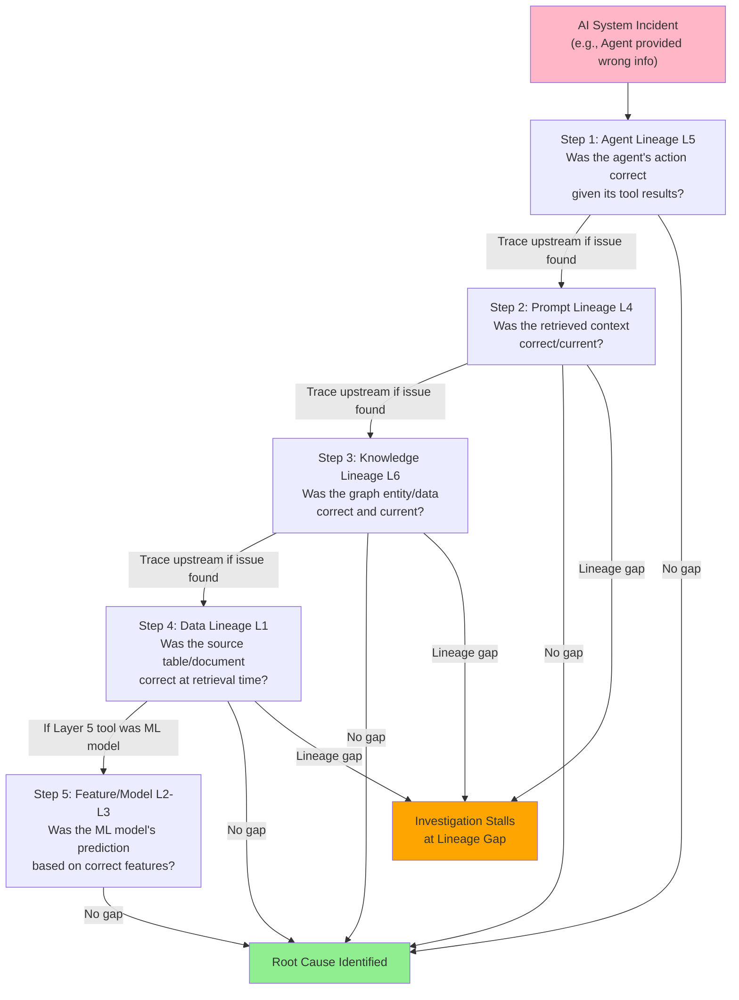

# End-to-End Lineage for AI-Era Data Systems — Part 2

### Knowledge Lineage

Tracing how source documents become graph-structured entities and relationships

##### What This Layer Answers, and Its Relationship to the Other Layers

Knowledge lineage answers: for a given knowledge graph entity or relationship (as discussed in Section 6 of the companion Architecture Evolution report), which source documents, processed through which extraction/entity-resolution pipeline run, produced it. Unlike Layers 2-5, which form a roughly linear dependency chain (data → features → models → prompts → agents), knowledge lineage is somewhat orthogonal: it traces the construction of the knowledge graph itself (an input process, similar in character to Layer 1's table lineage but for graph-structured rather than tabular targets), while the knowledge graph subsequently becomes an input that Layers 4-5 consume (via GraphRAG retrieval/traversal). Knowledge lineage is therefore both a 'Layer 1-like' lineage problem for the graph's construction and a prerequisite for completing Layers 4-5's lineage chains when graph retrieval is involved.

##### What Existing Tooling Covers

- **Extraction pipeline run logging:** custom-built GraphRAG implementations typically log, for each pipeline run, which source documents were processed and which entities/relationships were extracted or updated — providing the raw data for knowledge lineage even when not exposed as a formal 'lineage' feature

- **Entity provenance attributes:** some knowledge graph implementations attach provenance metadata directly to entities/relationships as graph properties (e.g., 'source_document_id', 'extraction_run_id', 'extraction_timestamp') — a lightweight form of knowledge lineage embedded in the graph itself rather than in a separate lineage system

- **Community/summary lineage in GraphRAG patterns:** for GraphRAG implementations using the community-detection-and-summarization pattern (Microsoft GraphRAG-style), the summaries themselves can in principle be traced back to the entities/relationships (and thus source documents) that contributed to each community — though this traceability is rarely surfaced as a queryable lineage feature in current implementations

##### What Remains a Gap

- **No standard knowledge lineage model:** unlike Layers 1-3, which have OpenLineage/MLflow-equivalent standards (however incomplete in cross-platform coverage), knowledge lineage has no widely-adopted standard model at all as of 2026 — every GraphRAG implementation examined in this research handles provenance, if at all, through custom, implementation-specific approaches

- **Entity resolution lineage:** when entity resolution merges or splits entities (e.g., determining that 'Acme Corp' and 'Acme Corporation' are the same entity, as discussed in the companion Architecture Evolution report's Section 6), the lineage of this resolution decision — what evidence supported the merge, and could it be reversed if found incorrect — is rarely tracked, even though entity resolution errors are identified as a primary knowledge graph failure mode

- **Graph update/deletion lineage:** when source documents are updated or deleted and the graph is correspondingly updated (removing or modifying entities/relationships), lineage of these update operations — what changed, when, and why — is typically not tracked with the same rigor as the initial extraction, creating a gap precisely where the 'stale knowledge served as current' failure mode (companion Operational Excellence report's Production Failure Analysis) originates

- **Connecting knowledge lineage to Layer 1:** source documents themselves often live in document repositories, content management systems, or unstructured data lakes that have their own (often weaker) Layer 1 lineage — connecting 'this graph entity came from this document' to 'this document came from this source system with this access control' requires bridging knowledge lineage with document-repository lineage, a connection that's rarely made explicit

- **Multi-hop retrieval lineage:** when an agent's response is informed by a multi-hop graph traversal (not just a single entity lookup), the lineage of the response should ideally trace through every hop of the traversal back to each contributing entity's source documents — current GraphRAG implementations generally log the final traversal result used in the prompt (connecting to Layer 4) but not the full traversal path with per-hop provenance

##### Platform Capability Notes

###### OpenLineage

No knowledge-graph-specific abstractions. In principle, an extraction pipeline run could be represented as an OpenLineage job with source documents as input datasets and extracted entities as output datasets, but graph-structured outputs (entities with relationships, as opposed to rows in a table) don't map naturally onto OpenLineage's dataset-as-table-like abstraction — no widely-adopted convention for this exists.

###### Marquez

Outside scope, as with other AI-era layers.

###### DataHub

DataHub's graph-native architecture is, architecturally, the most natural fit among general-purpose catalogs for representing knowledge graph entities and their provenance as part of the same metadata graph — but as of 2026 this requires custom entity type definitions; no out-of-box 'knowledge graph provenance' feature exists, and no major GraphRAG framework has a standard DataHub integration for provenance export.

###### OpenMetadata

Similar position to DataHub — graph-based architecture provides a plausible foundation, but knowledge lineage specifically is not a developed feature area as of this writing.

###### Collibra

No specific knowledge graph lineage capability identified; Collibra's strength in document/content classification could in principle extend to tracking which classified documents fed which knowledge graph construction processes, but this integration is not a standard capability.

###### Emerging: Custom provenance metadata within graph databases themselves

The most common current approach — embedding provenance as node/relationship properties within Neo4j, Stardog, or other graph databases (companion Architecture Evolution report, Section 6) directly, rather than in a separate lineage system — has the advantage of co-locating lineage with the data it describes, but the disadvantage of being queryable only within that graph database's query language, not through a general-purpose lineage/catalog interface. No emerging standard has yet achieved meaningful adoption for unifying knowledge lineage with the other five layers; this is identified in this report's findings as the least mature of all six lineage layers.

### Platform Comparison

Six lineage layers, five platforms, and the emerging entrants between them

This section consolidates the platform capability notes from Sections 1-6 into a single comparative view, then examines operational characteristics (deployment model, query interface, extensibility) that affect how readily each platform can be extended to cover the AI-era layers where gaps remain.

#### Layer Coverage Matrix

| **Platform** | **L1: Data** | **L2: Feature** | **L3: Model** | **L4: Prompt** | **L5: Agent** | **L6: Knowledge** |
| --- | --- | --- | --- | --- | --- | --- |
| OpenLineage | Strong (spec + integrations) | Via custom facets only | Loose fit via job/dataset model | Not addressed | Not addressed | Not addressed |
| Marquez | Strong (reference impl.) | Via custom facets only | Outside scope | Not addressed | Not addressed | Not addressed |
| DataHub | Strong, graph-native | Native ML entity types | Native MLModel entities + MLflow integration | Extensible, no native entities | Extensible, no native entities | Architecturally suited, not implemented |
| OpenMetadata | Strong, growing connectors | Growing ML entity support | Growing, platform-dependent | Extensible, no native entities | Extensible, no native entities | Architecturally suited, not implemented |
| Collibra | Very strong, enterprise connectors | Via AI Governance module | Via AI Governance module (risk-focused) | Via AI Governance (prompt governance) | Via AI Governance (policy-focused) | Not a developed capability |

*Table 2: Lineage Layer Coverage by Platform*

#### Operational Characteristics

| **Platform** | **Deployment Model** | **Query Interface** | **Extensibility Model** | **Best Fit** |
| --- | --- | --- | --- | --- |
| OpenLineage | Specification — implemented within producing tools (Spark, dbt, Airflow, etc.) | Via consuming backend (Marquez, DataHub, etc.) | Facet-based — new facet types extend event schema | Standardizing how lineage events are emitted across heterogeneous pipeline tools |
| Marquez | Self-hosted service (API + UI + storage backend) | REST API + web UI lineage graph | Limited — primarily an OpenLineage event store/visualizer | Lightweight, OpenLineage-native lineage store without broader catalog overhead |
| DataHub | Self-hosted (OSS) or DataHub Cloud (managed) | GraphQL API + web UI + Python/Java SDKs | High — custom entity/aspect types via metadata model extensions | Engineering-led organizations wanting a unified, extensible metadata graph spanning data through ML entities |
| OpenMetadata | Self-hosted (OSS) or Collate (managed) | REST API + web UI + SDKs | High — custom entity types, growing connector ecosystem | Organizations wanting DataHub-like extensibility with a different connector/ingestion architecture |
| Collibra | SaaS (Collibra Cloud) primarily, with on-prem options | Web UI-centric, REST API for integration | Moderate — configuration-driven via Collibra's metamodel, less code-extensible than DataHub/OpenMetadata | Regulated enterprises prioritizing policy/governance integration over engineering-led custom extension |

*Table 3: Platform Operational Characteristics*

#### Emerging Platforms and Standards

##### OpenInference (Arize)

An open standard (built on OpenTelemetry semantic conventions) for instrumenting LLM applications — defining span attributes for prompts, completions, embeddings, retrievals, and (increasingly) agent/tool-call spans. Functions as the de facto standard for Layer 4-5 trace structure, analogous to OpenLineage's role for Layer 1. Adopted by Arize Phoenix natively and supported by Langfuse and other observability platforms — the most likely foundation for future Layer 4-5 lineage standardization, though it remains focused on trace structure rather than lineage graph semantics (connecting traces to upstream data/knowledge entities).

##### MLflow Tracing

MLflow's tracing capability (extending its established experiment-tracking role into LLM/agent observability) represents an attempt to unify Layer 3 (model lineage, MLflow's original domain) with Layer 4-5 (prompt/agent tracing) within a single platform — relevant because it's one of the few efforts explicitly attempting to bridge these layers rather than treating them as separate tooling domains, though adoption for the Layer 4-5 portion specifically is earlier-stage than MLflow's established Layer 3 usage.

##### Unity Catalog Lineage (Databricks) / Microsoft Purview

Platform-native lineage within major lakehouse platforms (companion Architecture Evolution report, Section 3) increasingly extends across Layers 1-3 within the platform's boundary, with Databricks' Mosaic AI and Microsoft's Copilot/Purview integrations beginning to extend toward Layer 4-5 for AI workloads run on those platforms. The relevance to this report: as discussed in the companion Architecture Evolution report's Future Forecast, platform-native lineage extension may outpace general-purpose catalog extension for organizations consolidated on a single major platform, though this creates platform lock-in for the lineage graph itself.

##### W3C PROV and Linked Data Provenance Standards

Older (pre-AI-era) provenance standards from the semantic web tradition (companion Architecture Evolution report, Section 6) provide a formally-specified, general-purpose model for representing 'what produced this, from what, using what process' — theoretically applicable across all six lineage layers including knowledge lineage (Layer 6), where it originated. Adoption for AI-era lineage remains minimal as of 2026 — the AI/ML lineage ecosystem has largely developed independently of semantic web provenance standards despite conceptual overlap, though some research-oriented implementations reference PROV for knowledge graph provenance specifically.

**Platform Selection Implication:** No single platform in this comparison provides mature coverage across all six layers. Organizations seeking the broadest current coverage with the most extensibility for the immature layers should weight DataHub or OpenMetadata's graph-native, extensible metadata models — but should expect to build custom integration work for Layers 4-6 regardless of platform choice. Organizations in regulated industries where Collibra's policy/governance integration is already central to their compliance posture face a tradeoff: stronger governance-process integration for the layers Collibra covers, against weaker native extensibility for the layers it doesn't yet cover.

## Impact Analysis

Impact analysis answers the forward-direction lineage question: given a proposed or actual change to a data source, feature, model, prompt, or knowledge graph component, what downstream assets, models, agents, or decisions are affected? This is the primary use case for lineage during change management — before modifying a table schema, retiring a feature, updating a model, or changing a knowledge graph ontology, impact analysis identifies the blast radius.

#### Impact Analysis by Layer

##### Layer 1 → Downstream: Schema/Table Changes

The most mature impact analysis use case — given a proposed column rename, type change, or table deprecation, lineage tooling can enumerate every downstream table, dashboard, and (where Layer 2 lineage connects) feature that depends on it. DataHub, OpenMetadata, and Collibra all provide this as a core feature, typically with the ability to filter the impact set by criticality or ownership for prioritized communication to affected teams.

##### Layer 2 → Downstream: Feature Definition Changes

Where feature stores provide feature-to-model lineage (Section 2), impact analysis can answer 'if I change this feature's transformation logic, which models will receive different values and need re-evaluation' — but this analysis is confined to features registered in the feature store; ad-hoc features computed outside feature stores have no corresponding impact analysis, meaning a change to shared upstream logic (e.g., a common SQL transformation reused across ad-hoc feature computations) requires manual identification of affected models.

##### Layer 3 → Downstream: Model Version Changes

Impact analysis for model updates is bounded by deployment lineage (Section 3) — which serving endpoints, applications, and (where Layer 5 connects) agents consume a given model version. For models used as tools within agent systems, the impact of a model update propagates to every agent task that might invoke that tool — a connection that requires Layer 3-5 integration that, per Section 5, is generally not implemented.

##### Layer 4 → Downstream: Prompt Template Changes

Impact analysis for prompt template changes is typically scoped within a single application (which application uses this template) rather than across the broader lineage graph — Langfuse and similar platforms can show 'this template is used by these applications' but generally cannot show 'this template change affects responses that inform these downstream agent decisions or knowledge graph updates', since that would require Layer 4-5-6 integration.

##### Layer 5 → Downstream: Agent Tool/Configuration Changes

Impact analysis for changes to an agent's available tools, permissions, or orchestration logic is largely framework-dependent — LangGraph's graph definition makes the set of possible execution paths explicit (impact analysis can reason about which paths a change affects), while less-structured agent frameworks (where the LLM's reasoning determines tool selection dynamically) make 'which scenarios would this change affect' inherently harder to enumerate statically — impact analysis in these cases often requires empirical evaluation (running test scenarios) rather than lineage-graph traversal.

##### Layer 6 → Downstream: Ontology/Schema Changes

Impact analysis for knowledge graph ontology changes (adding/modifying entity or relationship types) requires identifying which existing entities/relationships would need re-extraction or migration under the new ontology, and which downstream GraphRAG queries (and thus, transitively, which agent behaviors) depend on the affected graph structure — per Section 6, this requires knowledge lineage that's generally not implemented, making ontology changes in practice a high-risk, manually-assessed change category.

**Practical Implication:** Impact analysis completeness mirrors the lineage completeness gradient described in this report's Executive Summary — changes to Layer 1 assets have the most reliable impact analysis, while changes to Layer 4-6 assets (prompt templates, agent configurations, knowledge graph ontologies) frequently must be assessed through testing/evaluation rather than lineage-graph traversal, because the lineage graph itself doesn't extend reliably into these layers. Organizations should treat changes to AI-era assets with correspondingly more conservative change management (staged rollout, evaluation-based validation) precisely because lineage-based impact analysis cannot yet provide the same confidence it does for Layer 1 changes.

## Root Cause Analysis

Root cause analysis is the backward-direction counterpart to impact analysis: given an observed problem (an incorrect dashboard number, a model performance regression, an AI hallucination, an agent taking an inappropriate action), trace backward through the lineage graph to identify the originating cause. Root cause analysis is where lineage gaps are most directly costly — an investigation that hits a gap doesn't just produce an incomplete report, it can leave the actual root cause unaddressed, allowing recurrence.

#### The Root Cause Investigation Chain for AI Incidents

For an AI system incident (e.g., an agent provided incorrect information to a customer), the investigation chain typically proceeds backward through the layers in this order, with each step's success depending on the corresponding layer's lineage maturity:

###### Step 1 — Agent Lineage (Layer 5)

Was the agent's action/response consistent with its tool call results and reasoning trace? If the trace shows the agent correctly synthesized the information it received, the root cause lies upstream (Step 2); if the trace shows the agent misinterpreted correct information, the root cause may be a model/prompt issue (Step 2 or 3) rather than a data issue.

###### Step 2 — Prompt Lineage (Layer 4)

What context was retrieved and included in the prompt that produced the agent's response? If the retrieved context itself was incorrect or outdated, the root cause lies further upstream (Step 3 or 4); if the retrieved context was correct but the model's synthesis of it was wrong, the root cause may be a model limitation (a Layer 3 concern, but one less amenable to lineage-based root cause — more a model evaluation/selection concern).

###### Step 3 — Knowledge Lineage (Layer 6, if GraphRAG involved)

If the retrieved context came from a knowledge graph traversal, was the traversed entity/relationship data correct and current? An entity resolution error or stale graph data (per Section 6's failure modes) would be identified here — but per Section 6, this step is the least likely to be completable due to minimal knowledge lineage tooling.

###### Step 4 — Data/Document Lineage (Layer 1)

If the retrieved context (directly, or via the knowledge graph) traces back to a source document or table, was that source correct and current at the time of retrieval? This is where the investigation connects to the most mature lineage layer — but only if Steps 2-3 successfully connected the prompt/knowledge lineage to this layer, which per Sections 4 and 6 is frequently not the case.

###### Step 5 — Feature/Model Lineage (Layers 2-3, if a traditional ML component is involved)

If the agent's task involved a traditional ML model (e.g., a risk score used as one input to the agent's decision), was that model's prediction based on correct, current feature values? This branch of the investigation follows the more mature Layer 2-3 lineage, but only if Layer 5's tool-call logging correctly identifies which model was called and with what inputs — connecting Layer 5 to Layer 3 (Section 5's gap).

#### Common Root Cause Analysis Failure Patterns

- **Investigation terminates at 'the model said X':** when Steps 2-4 cannot be completed due to missing prompt-to-data lineage connections, the investigation's conclusion is effectively 'the model produced this output given this input' without being able to determine why that input led to that output, or whether the input itself was correct — frequently misattributed to 'model hallucination' when the actual root cause was upstream data/knowledge issues (as discussed in the companion Operational Excellence report's Production Failure Analysis)

- **Multiple plausible root causes, none confirmable:** without complete lineage, an investigation may identify 2-3 plausible explanations (stale retrieved document, model limitation, agent reasoning error) without being able to determine which actually occurred — leading to remediation efforts that address a guessed-at cause, which may or may not be the actual one, with the issue potentially recurring if the guess was wrong

- **Time-to-resolution inflation:** each lineage gap requires manual cross-referencing between systems (e.g., manually checking the data catalog for a source document's update history after the LLM observability platform identified it as a retrieved source) — multiplying investigation time relative to a fully-connected lineage graph where this would be a single traversal query

- **Survivorship bias in incident reporting:** incidents where root cause analysis successfully completes (typically Layer 1-3-dominant issues, where lineage is mature) are over-represented in incident postmortems relative to incidents where investigation stalled at a Layer 4-6 gap and was closed as 'inconclusive' — creating a skewed organizational understanding of where AI incidents actually originate

**Recommendation:** Organizations should explicitly track 'investigation completeness' as a metric for AI-related incidents — what fraction of incidents reach a confirmed root cause vs. terminate at a lineage gap — both as a direct measure of operational risk and as a prioritization input for where to invest in closing lineage gaps (Sections 4-6). An incident category that frequently terminates at 'retrieved context couldn't be traced to its source document's current state' is a strong, evidence-based case for prioritizing the Layer 4-to-Layer 1 lineage connection over other candidate investments.

## Compliance Reporting

Lineage is the structural backbone of compliance evidence for the data and AI regulations discussed in the companion Operational Excellence report's Part 15. This section maps specific compliance requirements to the lineage layers that must support them, highlighting where current lineage maturity (or immaturity) directly determines compliance readiness.

| **Regulation/Framework** | **Lineage Requirement** | **Primary Layers** | **Current Readiness** |
| --- | --- | --- | --- |
| GDPR / CCPA (data subject rights) | Trace all locations/derivatives of an individual's data for erasure/portability requests, including derived features, embeddings, and graph entities | L1, L2, L6 | Moderate for L1-2 (lakehouse delete propagation); weak for L6 (vector/graph derivatives often untracked) |
| GDPR Article 30 (records of processing) | Document end-to-end data flows including AI processing purposes | L1-L4 | Moderate — L1 flows documentable; L3-4 AI processing purposes often documented separately from technical lineage |
| EU AI Act (high-risk systems — training data documentation) | Demonstrate provenance of training data, including data quality and bias characteristics, for the trained model | L1, L2, L3 | Moderate-High where feature stores + ML platforms provide L2-3 lineage; weak where ad-hoc feature computation bypasses this |
| EU AI Act (high-risk systems — post-market monitoring) | Continuous traceability from production AI decisions back to model version and (where applicable) input data/context | L3, L4, L5 | Low — requires L3-5 connection that Section 5 identifies as largely unimplemented |
| ISO 42001 (AI management systems) | Documented AI system inventory with lineage to underlying data and models | L1-L3 | Moderate — achievable with disciplined model registry + feature store practices, though cross-platform fragmentation (Section 3) remains a gap |
| NIST AI RMF (Measure/Manage functions) | Continuous monitoring data connected to risk management decisions, requiring traceability from observed issues to contributing factors | L1-L6 (incident-dependent) | Low-Moderate — depends entirely on root cause analysis completeness (this report's prior section), which varies by incident type |
| SOC 2 / ISO 27001 (access audit trails) | Demonstrate who/what accessed which data, including AI agents | L1, L5 | Moderate for L1 (standard access logging); low for L5 (agent identity in access logs is non-standard, per Section 5) |
| Sector-specific (RBI/MAS — AI explainability for credit/financial decisions) | Trace a specific automated decision back to the input data and model version that produced it, in human-interpretable form | L1-L5 | Low for AI/LLM-based decisions (full L1-5 chain rarely complete); Moderate for traditional ML credit models with mature L1-3 lineage |

*Table 4: Compliance Requirements Mapped to Lineage Layers*

#### The Compliance Evidence Generation Problem

As discussed in the companion Operational Excellence report's Part 15, the recommended strategic approach to multi-framework compliance is a unified evidence-collection architecture rather than framework-by-framework point solutions. Lineage is the connective tissue of this architecture: most compliance evidence requirements (Table 4) are fundamentally lineage queries — 'show me everything derived from this data subject's records', 'show me the training data provenance for this model', 'show me the decision chain for this automated decision'. A unified evidence layer is, in large part, a unified lineage graph with compliance-specific query templates and export formats layered on top.

#### Where Lineage Gaps Create Compliance Exposure

- **Layer 6 gaps and erasure requests:** if an individual's data was used to construct knowledge graph entities/relationships (e.g., a customer entity with linked records), and the knowledge graph has no lineage connecting entities back to source records, an erasure request may successfully delete the source data while leaving derived graph structure intact and queryable — a GDPR compliance gap that's invisible until specifically audited, since the graph 'looks' fine and the deletion 'succeeded' from the source system's perspective

- **Layer 3-5 gaps and EU AI Act post-market monitoring:** the EU AI Act's post-market monitoring requirements for high-risk systems effectively require the Layer 3-5 connection that Section 5 identifies as the primary agent lineage gap — organizations deploying agentic systems in EU AI Act high-risk categories (a determination that itself requires careful assessment) face a compliance requirement that current tooling does not natively satisfy, requiring custom instrumentation

- **Layer 4 gaps and explainability for automated decisions:** sector-specific explainability requirements (RBI/MAS FEAT principles, discussed in the companion Operational Excellence report's Part 15) for AI-assisted financial decisions require connecting a specific decision to the specific information that informed it — for LLM-based decision support, this is a Layer 4 lineage requirement that, per Section 4, is the layer where connecting prompt lineage to upstream data lineage is the primary gap

- **Cross-layer audit trail continuity:** compliance audits often sample specific transactions/decisions and request the complete supporting evidence trail — a single broken link anywhere in the L1-L5 chain for a sampled item can result in an audit finding, even if the organization's lineage is largely complete elsewhere; audit risk is therefore disproportionately driven by the least-complete layer relevant to the sampled population, not the average completeness across all layers

**Compliance Recommendation:** Organizations preparing for EU AI Act enforcement phases (through 2027) or sector-specific AI explainability requirements should conduct a lineage gap assessment specifically scoped to their high-risk/regulated AI use cases — identifying, for each such use case, which of the six layers' lineage is required for that use case's compliance obligations, and which of those layers currently has gaps. This targeted assessment (rather than attempting comprehensive six-layer lineage everywhere) allows prioritized remediation focused on actual compliance exposure rather than theoretical completeness.

## AI Traceability & Explainability

Traceability and explainability are related but distinct: traceability (the focus of Sections 1-6 and the Impact/Root Cause sections) is about reconstructing the technical chain of cause and effect; explainability is about presenting that chain — or a relevant summary of it — in a form that's interpretable by humans who need to understand, trust, or challenge an AI system's output. Complete traceability is a prerequisite for explainability but doesn't automatically produce it — a full lineage graph with hundreds of nodes is traceable but not, in that raw form, explainable to a non-technical stakeholder.

#### Explainability Requirements by Stakeholder

##### Technical / Engineering (Debugging)

Requires the most complete, granular lineage — full trace trees, exact prompt text, retrieved document IDs, model version strings. This audience can interpret raw lineage graphs and trace data directly; the requirement is completeness (Sections 1-6) and queryability, not simplification.

##### Business Users (Understanding 'Why Did the System Do This')

Requires lineage information translated into business terms — not 'retrieved chunk_id=4471 with cosine similarity 0.83' but 'based on the return policy document updated last month'. This translation requires the semantic layer connection (companion Architecture Evolution report, Section 7) — mapping technical lineage entities to business-meaningful names and descriptions, which depends on metadata quality (documentation, naming) that's often inconsistent across the six layers.

##### Auditors / Regulators (Compliance Verification)

Requires lineage presented as formal evidence — often in specific formats (e.g., EU AI Act technical documentation templates) with attestation that the lineage record is complete and accurate for the scope being audited. This is the use case most directly served by the unified evidence-collection architecture discussed in the Compliance Reporting section, and the use case most exposed by lineage gaps (a gap means the attestation of completeness cannot be made).

##### End Users (Understanding/Contesting a Decision That Affects Them)

Requires the most simplified, individual-decision-scoped explanation — 'your request was declined because X', potentially with a path to request human review. This is the explainability requirement most directly tied to sector-specific regulations (RBI/MAS FEAT principles) and is arguably the highest-stakes explainability use case, since it directly affects an individual's outcome and their ability to contest it — yet it depends on the same underlying lineage (Layers 1-5) that's least complete for AI/agent-based decisions.

#### Explainability Techniques and Their Lineage Dependencies

- **RAG citation/source display:** showing users 'this response was based on these documents' is the most widely-deployed explainability technique for generative AI, and depends directly on Layer 4 lineage (which documents were retrieved) — but per Section 4, this typically shows the immediate retrieval result without connecting to whether that source document is current/correct (Layer 1), meaning the citation itself can be explainable while still being misleading if the cited source is stale

- **Chain-of-thought / reasoning trace display:** showing an agent's intermediate reasoning steps provides explainability for Layer 5 (why did the agent take this action), but as noted in Section 5, reasoning traces are not always retained or exposed, and even when available, raw chain-of-thought is often not in a form directly meaningful to business users or end users without further translation

- **Feature importance / SHAP-style explanations:** for traditional ML components within an AI system (Layer 3), feature importance techniques explain a specific prediction in terms of which input features most influenced it — this is a mature explainability technique but applies to Layer 3 (traditional ML models), not directly to Layer 4-5 (LLM/agent outputs), creating an explainability gap for systems where traditional ML components feed into LLM-based agent decisions: feature importance can explain the ML model's contribution, but not how the agent weighted/used that contribution

- **Counterfactual explanations:** 'this decision would have been different if X had been different' — valuable for end-user explainability (especially for adverse decisions, where understanding what would change the outcome is often more actionable than understanding the full causal chain) but requires the ability to re-run the decision process with modified inputs, which for LLM-based decisions runs into the non-reproducibility limitation discussed in Section 4 — a counterfactual re-run may produce a different output not because of the changed input but due to inherent LLM output variability, undermining the counterfactual's validity

#### The Explainability Ceiling Imposed by Lineage Gaps

A central conclusion of this report: explainability for AI systems cannot exceed the completeness of the underlying lineage. No explainability technique — however sophisticated its presentation — can explain a connection that the lineage graph doesn't contain. For Layer 4-6, where lineage connections to upstream layers are frequently absent (Sections 4-6), the practical effect is an 'explainability ceiling': an organization can present RAG citations (Layer 4 lineage that exists) but cannot, without closing the Layer 4-to-Layer 1 gap, explain whether the cited source itself was reliable — the explanation looks complete to the recipient ('here's the source') while omitting a dimension (source currency/reliability) that the lineage graph simply doesn't track. This creates a risk that's distinct from 'no explanation provided': a partial explanation that appears complete can be more problematic for trust and compliance than an explicit 'we cannot fully explain this' — because it doesn't prompt further verification.

**Recommendation:** Explainability interfaces (citation displays, reasoning traces) should explicitly indicate the boundary of what's been verified versus what's been retrieved-but-not-verified — e.g., distinguishing 'this response cites Document X (last verified current as of [date])' from 'this response cites Document X (currency not verified)' where Layer 4-to-Layer 1 lineage doesn't extend to a freshness check. This is a presentation-layer mitigation for an underlying lineage gap — it doesn't close the gap, but it prevents the gap from being silently presented as completeness, which this report identifies as the more acute risk.

## Lineage for Multi-Agent AI Systems

**Framing:** Single-agent lineage (Section 5) is a hard problem that remains substantially unsolved. Multi-agent lineage is not simply 'single-agent lineage, N times' — it introduces structural properties (concurrency, agent-to-agent communication, shared memory, emergent coordination) that change the shape of the lineage problem from a trace (a sequence with branches) to a graph (a network of interacting traces) — closer in structure to the knowledge graphs of Section 6 than to the distributed traces of Section 5, even though the underlying instrumentation (OpenTelemetry-derived tracing) was designed for the latter.

#### How Multi-Agent Architectures Change the Lineage Problem

##### From Sequential Traces to Communication Graphs

A single agent's execution, however complex, can be represented as a trace tree — a single root (the initiating request) with branches for sub-tasks/tool calls, ultimately converging on a response. Multi-agent systems using protocols like A2A (companion Operational Excellence report, Part 17) involve multiple agents, each potentially with their own trace tree, communicating with each other — the overall lineage structure is a graph of interconnected trace trees, where edges represent agent-to-agent messages/task delegations. Current trace-based tooling can capture each agent's individual trace but typically does not natively represent the cross-agent graph structure connecting them — each agent's trace may reference a 'delegated task ID' from another agent, but reconstructing the full multi-agent graph from these references requires custom correlation logic, since no standard exists for representing this graph structure directly.

##### From Sequential Execution to Concurrent Execution

Single-agent traces are largely sequential (even with parallel tool calls, there's a single overarching task with a defined start and end). Multi-agent systems may have multiple agents operating concurrently on related or overlapping tasks — lineage must capture not just 'what happened' but 'what was happening concurrently', since concurrent operations on shared resources (e.g., two agents both updating the same agent memory entity, per the companion Architecture Evolution report's Section 10) can produce results that depend on timing/ordering in ways that a purely sequential lineage record cannot represent.

##### Shared Memory as a New Lineage Surface

When multiple agents read from and write to a shared memory store (companion Architecture Evolution report, Section 10), the memory store itself becomes a lineage surface analogous to a shared database table in traditional data lineage — but with additional complexity: a memory write by Agent A might be read by Agent B and influence Agent B's subsequent actions, creating a lineage edge (A's write → B's read → B's action) that exists entirely within the memory store's read/write history, separate from either agent's individual execution trace. Capturing this requires the memory store itself to maintain lineage-relevant read/write logs — a requirement not addressed by current agent memory platforms (per the companion report's Section 10, these platforms have not yet addressed even basic governance requirements, let alone lineage).

##### Emergent Coordination Without a Single Point of Lineage Capture

In multi-agent systems where coordination emerges from agent-to-agent negotiation (rather than being centrally orchestrated, as in single-controller frameworks like LangGraph), there may be no single component with visibility into the overall coordination pattern — each agent has visibility into its own interactions, but the emergent system-level behavior (e.g., three agents collectively arriving at a decision through several rounds of negotiation) exists only as the union of each agent's partial view. Lineage for emergent multi-agent behavior therefore requires either a centralized observability layer that all agents report to (creating a single point of lineage capture, but also a single point of failure and a potential bottleneck) or a decentralized approach where lineage records themselves carry enough cross-referencing information to be reassembled post-hoc — the latter being closer to how distributed systems tracing solved an analogous problem for microservices, but not yet adapted for agent-to-agent communication specifically.

#### What a Multi-Agent Lineage Model Would Need to Capture

Extrapolating from the six-layer model and the structural changes above, a multi-agent lineage model — which does not yet exist in mature form as of 2026 — would need to represent at minimum:

- **Agent identity and provenance:** for every action, which specific agent (with a stable identity per the companion Operational Excellence report's Part 14) performed it, including agents that are themselves dynamically instantiated (e.g., a coordinator agent spawning worker agents for sub-tasks)

- **Inter-agent message lineage:** for every agent-to-agent communication (A2A or equivalent), what was communicated, by which agent, to which agent(s), and how did the receiving agent's subsequent actions relate to the received message — essentially, Layer 5 agent lineage extended with a 'sender/receiver' dimension

- **Shared-resource read/write lineage:** for every read or write to shared memory, shared knowledge graph segments, or shared tool/data resources, which agent performed the operation, what was the state before/after, and which subsequent operations by other agents depended on this state

- **Temporal/concurrency metadata:** sufficient timing information to reconstruct the actual order of operations across agents, including identifying genuinely concurrent operations (where ordering is not meaningful) versus causally-ordered operations (where ordering matters for understanding cause and effect)

- **Aggregate/emergent outcome attribution:** for a final multi-agent system outcome, the ability to attribute the outcome to the contributing agents' individual actions in a way that's meaningful for accountability — analogous to how Layer 2 feature lineage attributes a model's behavior to specific features, but for agent contributions to a collective outcome

#### Implications for the Six-Layer Model

Multi-agent systems don't add a 'seventh layer' so much as they multiply and interconnect Layer 5 (agent lineage) — and, by extension, every layer that Layer 5 depends on. A single multi-agent task may involve dozens of individual agent executions, each with its own Layer 1-4 dependencies, communicating via Layer 5 extensions, and potentially reading/writing Layer 6 knowledge structures concurrently. The lineage graph for a single multi-agent task could therefore be substantially larger and more interconnected than the lineage graph for an entire traditional data pipeline run — a scale and structural shift that has implications for lineage storage (graph databases, per the companion Architecture Evolution report's Section 6, are likely necessary rather than optional for multi-agent lineage at scale), query patterns (impact/root-cause analysis across a much larger, more interconnected graph), and — most acutely — for the explainability ceiling discussed in the prior section, which becomes substantially lower (more partial) for multi-agent outcomes than for single-agent or traditional ML outcomes, simply because there are more potential gaps in a larger graph.

#### Forward-Looking Assessment

As of 2026, multi-agent lineage should be considered an open research and tooling problem rather than a solved or near-solved one. Organizations deploying multi-agent systems in production — particularly for use cases with compliance exposure (Table 4) — face a lineage maturity gap larger than any single layer discussed elsewhere in this report, because multi-agent lineage depends on Layer 5 maturity (itself the least mature single-agent layer) plus entirely new cross-agent lineage concepts with no current standard. Organizations in this position should: (1) treat multi-agent lineage as a custom-engineering problem requiring dedicated investment, not an off-the-shelf capability; (2) prioritize centralized observability approaches (a shared tracing/lineage backend all agents report to) over fully decentralized approaches, given the absence of standards for the latter; (3) explicitly scope which multi-agent interactions are considered 'in scope' for lineage capture based on compliance and risk exposure (Table 4), rather than attempting comprehensive capture of all agent-to-agent communication, which at scale would itself become an unmanageable volume of lineage data; and (4) monitor the OpenInference/OpenTelemetry ecosystem (Platform Comparison section) for emerging multi-agent semantic conventions, as this is the most likely source of eventual standardization given its trajectory for single-agent (Layer 5) lineage.

**Closing Synthesis:** This report's six-layer model describes a lineage landscape where completeness decreases as data moves from raw tables toward autonomous agent decisions — and multi-agent systems sit at the far end of this gradient, depending on the least mature layer (agent lineage) while introducing structural requirements (communication graphs, concurrency, shared memory, emergent coordination) that exceed even Layer 5's current scope. The practical consequence for enterprises is that the rapid adoption of multi-agent architectures (companion Operational Excellence report, Part 17) is significantly outpacing the lineage and traceability infrastructure needed to govern, debug, and demonstrate compliance for these systems — making lineage investment, specifically targeted at the Layer 4-6 connections and agent-to-agent communication capture described in this report, one of the highest-leverage and most time-sensitive infrastructure investments for any enterprise scaling multi-agent deployments through 2026 and beyond.

---

**Back to [Part 1: Six-Layer Model and Foundations](pathname:///archon/data-knowledge/04-end-to-end-lineage-systems-report)**
