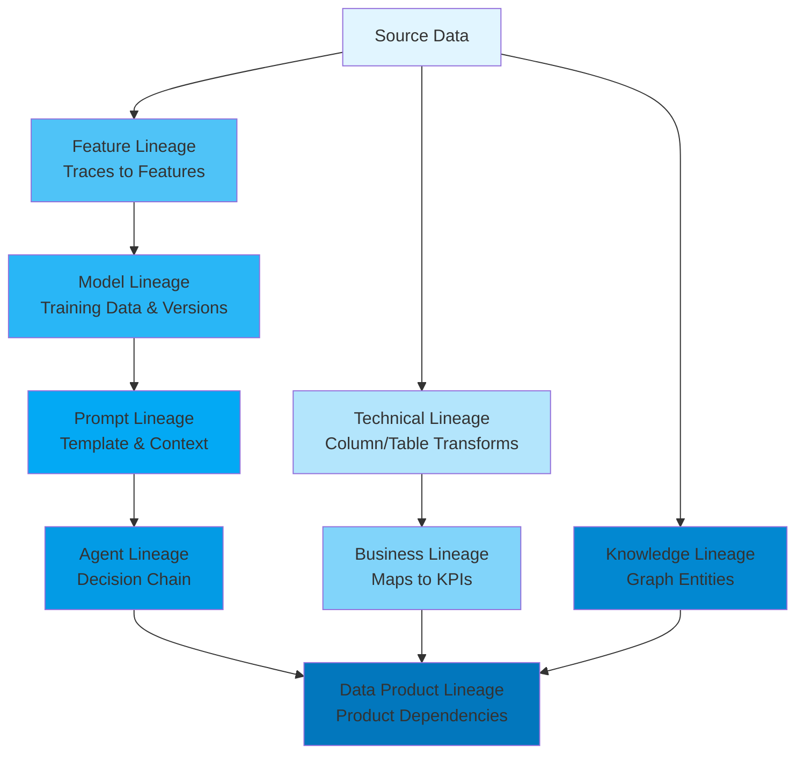

# Enterprise Data Systems & AI Governance Report — Part 2

Part 2 of 3 — linked from [Part 1](pathname:///archon/data-knowledge/05-enterprise-data-systems-ai-governance-report), continuing to [Part 3](pathname:///archon/data-knowledge/parts/04-enterprise-data-systems-ai-governance-report-part3).

This part covers data lineage, observability, platform reliability, security architecture, compliance requirements, and AI governance frameworks—the operational and governance layers that enable trustworthy, auditable data and AI systems at enterprise scale.

---

## Data Lineage

Technical, business, AI, feature, prompt, agent, and knowledge lineage

Lineage has expanded from a single concept (table-to-table technical lineage) into an eight-layer model required for full AI system observability. Most enterprises have mature technical lineage but significant gaps in the AI-specific layers — which is precisely where root-cause analysis of AI failures occurs.

###### Technical Lineage

Column- and table-level transformation lineage — which source columns, through which jobs/queries, produced which target columns. Mature tooling: dbt (transformation lineage), OpenLineage (job-level), Spline (Spark lineage).

###### Business Lineage

Maps technical lineage to business concepts and metrics — answering 'which business KPIs are affected if this source table changes?' Requires semantic layer integration (metric definitions linked to underlying tables) — typically the weakest link even in mature technical lineage setups.

###### AI / Model Lineage

Tracks which datasets, feature versions, and code versions produced a given trained model artifact — essential for reproducibility and for answering 'which models are affected if this training data is found to be flawed?' MLflow, SageMaker Lineage, and Vertex ML Metadata provide this within their respective platforms; cross-platform model lineage remains immature.

###### Feature Lineage

Traces feature values back through transformation logic to source data — distinct from model lineage because features are reused across many models. A feature quality issue potentially affects every model consuming that feature; feature lineage enables blast-radius analysis. Tecton and Hopsworks provide native feature lineage; Feast requires external tooling.

###### Prompt Lineage

An emerging category: tracking which prompt template version, combined with which retrieved context (from which documents/graph nodes), produced a given LLM output. Critical for debugging hallucinations — without prompt lineage, it's impossible to determine whether a bad output stemmed from a prompt change, a retrieval change, or a model version change. Langfuse and Helicone provide prompt versioning and tracing; full lineage integration with upstream data lineage is rare.

###### Agent Lineage

Traces the full decision chain of an autonomous agent — which tools were called, in what order, with what inputs/outputs, leading to a final action. This is essentially distributed tracing applied to agent reasoning steps, but with the addition of linking each step back to the data/knowledge source that informed it. No mature standalone tooling exists yet; most implementations are custom, built on OpenTelemetry traces plus LLM observability platforms.

###### Knowledge Lineage

For knowledge-graph-backed systems, tracks which source documents and extraction pipeline runs produced which graph entities and relationships — enabling 'why does the agent believe X is connected to Y?' investigations. Particularly important for GraphRAG systems where entity extraction errors can silently propagate into incorrect graph relationships that influence many downstream queries.

###### Data Product Lineage

In data mesh architectures, tracks dependencies between data products (which products consume which other products) — enabling impact analysis at the product/contract level rather than the table level, aligned with federated governance.

### Lineage Platform Comparison

| **Platform** | **Technical Lineage** | **Cross-Platform** | **AI/Model Lineage** | **Standard/Protocol** | **Adoption** |
|---|---|---|---|---|---|
| OpenLineage | Job-level, column-level (via facets) | Yes — vendor-neutral spec | Via custom facets | Open standard (LF AI & Data) | Growing — backing for Marquez, integrations with Spark/dbt/Airflow |
| Marquez | Implements OpenLineage spec | Yes (reference implementation) | Limited native | OpenLineage reference | Moderate — often paired with Airflow |
| DataHub | Strong, graph-native lineage model | Yes — broad connector ecosystem | ML entity support (models, experiments) | Proprietary + OpenLineage ingestion | High |
| OpenMetadata | Strong, automated extraction | Yes — growing connector list | ML model entities supported | Proprietary + OpenLineage support | Growing rapidly |
| Collibra | Strong, enterprise-grade | Yes — extensive enterprise connectors | Via AI Governance module | Proprietary | Very High in regulated enterprises |

*Table 11: Data Lineage Platform Comparison*

**Compliance Note:** The EU AI Act's documentation requirements for high-risk AI systems effectively mandate AI/model lineage and (where RAG is used) knowledge/prompt lineage as evidence of training data provenance and decision traceability. Enterprises without these lineage layers face significant remediation effort to retrofit them for compliance evidence rather than building them as a byproduct of normal pipeline development.

## Data Observability

Quality, freshness, volume, schema, drift, feature, and vector monitoring

Data observability platforms apply monitoring and anomaly detection principles (borrowed from infrastructure observability) to data pipelines — detecting issues before they propagate to dashboards, models, or AI applications.

###### Data Quality Monitoring

Validates data against defined rules (not null, uniqueness, referential integrity, value ranges, custom business logic). Tools: Soda (open source + cloud, SodaCL rule language), Great Expectations (Python-native assertions).

###### Freshness Monitoring

Detects when expected data updates don't arrive on schedule — the most common data incident type. Particularly critical for AI feature pipelines where stale features silently degrade model performance without triggering errors.

###### Volume Monitoring

Detects anomalous row counts (sudden drops or spikes) indicating upstream extraction failures, duplicate loads, or filter logic bugs.

###### Schema Monitoring

Detects schema changes (added/removed/renamed columns, type changes) that may break downstream consumers — especially important for AI pipelines where a renamed column can silently produce null features rather than an error.

###### Drift Detection

Statistical monitoring of feature/data distributions over time, detecting when production data diverges from training data distributions — a leading indicator of model performance degradation before accuracy metrics decline (which often lag by days).

###### Feature Monitoring

Extension of drift detection to feature-store-specific concerns: feature freshness SLAs, feature value distributions per feature version, and point-in-time correctness violations.

###### Vector Monitoring

Emerging category: monitoring embedding distribution drift (indicating the embedding model or underlying content has changed), retrieval quality metrics (are retrieved documents relevant?), and vector index health (recall degradation as indexes grow).

###### AI Data Monitoring

Composite category combining the above with LLM-specific signals: monitoring training data composition for fine-tuning jobs, RAG retrieval quality over time, and correlation between data quality incidents and AI output quality incidents.

### Platform Comparison

| **Platform** | **Detection Method** | **Alerting** | **Root Cause Analysis** | **Vector/AI Monitoring** |
|---|---|---|---|---|
| Monte Carlo | ML-based anomaly detection + rules | Slack/PagerDuty/email, severity routing | Lineage-integrated incident IR workflows | Growing — AI observability features added |
| Bigeye | Statistical anomaly detection + custom SLAs | Configurable multi-channel | Lineage graph + impact analysis | Limited — focused on traditional data quality |
| Soda | Rule-based (SodaCL) + anomaly detection (Soda Cloud) | Slack/webhooks | Check-level history and trends | Limited |
| Metaplane | Automated anomaly detection, lightweight setup | Slack/email | Lineage view + anomaly history | Limited |
| Acceldata | ML-based + rule-based, full-stack (data+pipeline+infra) | Enterprise alerting integrations | Cross-layer correlation (data + compute) | Moderate — pipeline + AI workload monitoring |
| Datafold | Data diffing (cross-environment comparison) | CI/CD integration (PR checks) | Column-level diff analysis | Limited — primarily data diffing for migrations/dbt |

*Table 12: Data Observability Platform Comparison*

**Operational Lesson — Alert Fatigue:** The most common data observability failure is not lack of detection but alert fatigue — anomaly-detection-based systems generate high false-positive rates on naturally volatile data (e.g., marketing campaign data with legitimate volume spikes), causing teams to mute alerts entirely. Successful deployments invest significant time tuning detection sensitivity per dataset and establishing clear on-call ownership before declaring observability 'done.'

## Platform Observability

Metrics, logs, traces, and AI/agent pipeline observability

Platform observability — the metrics/logs/traces triad — has been transformed by two forces: OpenTelemetry's emergence as the vendor-neutral instrumentation standard, and the new requirement to observe non-deterministic AI pipelines where 'correctness' isn't a simple pass/fail signal.

### The Three Pillars in AI Contexts

###### Metrics

Numeric time-series measurements (latency, throughput, error rates, token usage, cost-per-request). For AI pipelines, critical metrics extend to: tokens consumed per request, cache hit rates for retrieval, model inference latency percentiles, and cost attribution per agent/feature.

###### Logs

Discrete event records. For AI systems, logs must capture full prompt/response pairs (with PII redaction), retrieval results, and tool-call inputs/outputs — substantially higher volume and sensitivity than traditional application logs, requiring careful retention and access policy design.

###### Traces / Distributed Tracing

Request-scoped causal chains across services. For agentic systems, a single user request may fan out into dozens of LLM calls, tool invocations, and retrieval operations — trace volume and cardinality explode compared to traditional microservices, requiring sampling strategies that don't discard the traces most useful for debugging (i.e., the failed/anomalous ones).

### Platform Comparison

| **Platform** | **Category** | **Trace Propagation** | **AI/Agent Specific** | **Cost Model Note** |
|---|---|---|---|---|
| OpenTelemetry | Open Standard / Instrumentation | W3C Trace Context — vendor-neutral | GenAI semantic conventions emerging (LLM spans) | Free — instrumentation layer, backend cost varies |
| Prometheus | Metrics (OSS) | N/A (metrics, not traces) | Custom exporters for LLM/GPU metrics | Free (self-hosted); storage scales with cardinality |
| Grafana | Visualization (OSS + Cloud) | Integrates Tempo for traces | LLM observability dashboards (community) | Free OSS; Cloud priced per active series/traces |
| Datadog | Full-stack APM/Infra (Commercial) | Native distributed tracing + LLM Observability product | Dedicated LLM Observability (prompt/response tracking) | Per-host + per-span — can scale steeply with trace volume |
| New Relic | Full-stack APM (Commercial) | Native distributed tracing | AI monitoring features added | Usage-based (data ingest GB) |
| Dynatrace | Full-stack APM + AI-driven RCA | Native + OneAgent auto-instrumentation | Davis AI for automated root-cause analysis | Host-unit based — premium pricing |
| Arize Phoenix | LLM/ML Observability (OSS + Cloud) | OpenTelemetry-based (OpenInference) | Purpose-built — embeddings, RAG, LLM eval traces | Free OSS; Arize AX cloud usage-based |
| Langfuse | LLM Observability (OSS + Cloud) | OpenTelemetry-compatible | Purpose-built — prompt/trace management, evals | Free OSS self-host; Cloud usage-based |
| Helicone | LLM Observability/Gateway (OSS + Cloud) | Proxy-based request logging | Purpose-built — caching, cost tracking, prompt logs | Free tier; usage-based for cloud |
| OpenLIT | LLM/GPU Observability (OSS) | OpenTelemetry-native | Purpose-built — LLM + GPU monitoring, cost tracking | Free OSS — self-hosted |

*Table 13: Platform & AI Observability Tool Comparison*

### Trace Propagation Across System Boundaries

A persistent operational challenge: trace context must propagate not just across microservices (solved by OpenTelemetry/W3C Trace Context) but across fundamentally different system types — from an application trace, into a feature store lookup, into a vector database query, into an LLM API call, into a graph traversal, and back. Each hop is a potential break point where trace context is lost, creating observability gaps precisely at integration boundaries — often where the most subtle bugs occur. OpenInference and OpenTelemetry's emerging GenAI semantic conventions aim to standardize span attributes for LLM calls, but vector database and feature store instrumentation remains inconsistent across vendors.

### Cost Management for Observability

AI observability introduces a new cost dynamic: logging full prompts and responses for every request can itself become a significant cost line item at scale (storage + ingestion costs for observability platforms scale with payload size, and LLM payloads are large). Common mitigation strategies:

- Sampling strategies that retain 100% of error/anomalous traces but sample successful traces

- Tiered retention — full payloads for 7-30 days, metadata-only beyond that

- Async/batch export of traces to reduce latency impact on the request path

- Self-hosted OSS observability (Phoenix, Langfuse, OpenLIT) for high-volume logging to avoid per-span commercial pricing

## Reliability Engineering

SLOs, error budgets, DR, chaos engineering — lessons from web-scale operators

Reliability engineering practices developed for application infrastructure (Google's SRE discipline, Netflix's chaos engineering) are increasingly applied to data pipelines and AI systems, where 'availability' now must encompass data freshness and model quality, not just service uptime.

###### SLOs (Service Level Objectives) for Data

Defining measurable targets for data freshness (e.g., '99% of daily tables updated within 2 hours of source data availability'), completeness, and quality — treated with the same rigor as application latency SLOs. Data SLOs feeding AI feature pipelines should map to model performance requirements, not arbitrary schedules.

###### Error Budgets

The allowable rate of SLO violations before corrective action is mandated — borrowed directly from Google SRE practice. For data platforms, an error budget might allow a certain number of late-arriving tables per month before pipeline reliability work takes priority over new feature development.

###### Capacity Planning

For data platforms, capacity planning must account for both storage growth (typically predictable) and compute burst patterns (less predictable — AI workloads create spiky GPU/compute demand for training runs and batch inference jobs). Autoscaling compute (Databricks serverless, Snowflake warehouses) shifts capacity planning from provisioning to cost governance.

###### Disaster Recovery & Backup Strategies

Lakehouse architectures benefit from object storage's inherent durability (11 9's for S3), but DR planning must still address: catalog/metadata recovery (a corrupted Unity Catalog/Glue Catalog can make data inaccessible even if the data itself is intact), cross-region replication for regulatory data residency failover, and — critically for AI — vector index and graph database rebuild time, which can be the longest RTO component in a full AI platform recovery.

###### Multi-Region Architecture

Beyond simple replication, multi-region architectures for AI platforms must consider: where embeddings are generated (model API calls may have regional latency/availability implications), data residency requirements that may prevent certain data from replicating to certain regions, and active-active vs. active-passive tradeoffs for feature serving latency.

###### Chaos Engineering

Deliberately injecting failures (killing nodes, introducing network partitions, simulating slow dependencies) to validate resilience assumptions. For data platforms, chaos engineering increasingly extends to: simulating upstream data quality degradation (does the pipeline fail safely or propagate bad data?), simulating model API outages (does the application degrade gracefully without LLM access?), and simulating feature store staleness (does the model serving layer detect and handle stale features appropriately?).

###### Self-Healing Systems

Automated remediation for common failure patterns: automatic pipeline retries with backoff, automatic failover to cached/stale features when real-time computation fails (with appropriate quality degradation signals), and automated rollback of model deployments when monitored quality metrics breach thresholds.

###### Failure Injection for AI Specifically

Emerging practice: deliberately feeding adversarial, malformed, or out-of-distribution inputs to AI pipelines in staging to validate that data quality monitors and model guardrails catch issues before production — analogous to fuzzing for traditional software.

### Lessons from Web-Scale Operators

###### Netflix

Pioneered chaos engineering (Chaos Monkey) for application infrastructure; has extended similar principles to data pipeline resilience — the Data Mesh-like architecture includes automated data quality circuit breakers that can halt downstream consumption of a dataset that fails quality checks, preventing bad data from reaching recommendation models.

###### Amazon

Operates with a strong 'cell-based architecture' principle — partitioning systems (including data pipelines) into independent cells to limit blast radius of failures. AWS's own services (DynamoDB, S3) are built on these principles and inherited by customers using them as feature stores/storage.

###### Google

Origin of the SRE discipline and error budget concept; BigQuery's serverless architecture exemplifies designing for reliability by eliminating capacity planning as an operational burden — though this shifts risk to cost governance (addressed in the Cost Modeling Framework section).

###### Uber

Michelangelo ML platform's reliability lessons: feature computation pipelines for pricing/ETA models require sub-100ms p99 latency at massive scale — achieved through aggressive caching, pre-computation of likely-needed features, and graceful degradation to less-personalized predictions when real-time features are unavailable.

###### LinkedIn

Venice feature store's reliability model relies on near-line (Kafka-based) feature updates with eventual consistency guarantees explicitly communicated to model consumers — accepting slight staleness in exchange for availability, an explicit CAP-theorem tradeoff documented for each feature's SLA.

**Production Lesson — Graceful Degradation for AI:** The most resilient AI systems define explicit degradation paths: if real-time features are stale, fall back to batch features with a quality flag; if the primary LLM is unavailable, fall back to a smaller/cached model with reduced capability rather than failing the request entirely; if the knowledge graph is unreachable, fall back to vector-only retrieval. Systems without these explicit fallback paths tend to fail completely rather than degrade — turning a dependency hiccup into a full outage.

## Security Architecture

IAM, RBAC/ABAC/PBAC, encryption, secrets, and agent identity

Security architecture for AI data platforms must address a new category of principal — the AI agent — alongside traditional human users and service accounts. This has accelerated adoption of workload identity standards (SPIFFE/SPIRE) previously confined to advanced microservices deployments.

###### IAM (Identity &amp; Access Management)

Foundational identity layer — authentication (who are you) and coarse-grained authorization (what can you access). Cloud-native IAM (AWS IAM, Azure Entra ID, GCP IAM) integrates with data platform access controls but typically requires a separate data-specific authorization layer for fine-grained access.

###### RBAC (Role-Based Access Control)

Permissions assigned via roles (e.g., 'data analyst,' 'ML engineer'). Simple to reason about but suffers from role explosion in large organizations with many fine-grained access requirements — a common precursor to ABAC adoption.

###### ABAC (Attribute-Based Access Control)

Permissions computed dynamically from attributes of the user, resource, and context (e.g., 'allow access if `user.department == data.owning_department AND data.classification != restricted`'). Unity Catalog, Lake Formation, and Snowflake all support ABAC-style tag-based policies — essential for scaling access governance beyond a few hundred datasets.

###### PBAC (Policy-Based Access Control)

Centralizes access decisions in declarative policy engines (e.g., Open Policy Agent / OPA) decoupled from application code — policies as code, version-controlled, and testable. Increasingly used to unify access decisions across heterogeneous data platforms that each have their own native ABAC implementation.

###### Zero Trust

Architectural principle: no implicit trust based on network location; every request is authenticated and authorized regardless of origin. For data platforms, this means even internal service-to-service data access (e.g., a feature computation job reading from a database) requires verified identity (mTLS, short-lived credentials) rather than network-perimeter trust.

###### Data Encryption

Encryption at rest (object storage default encryption, often customer-managed keys for regulated workloads) and in transit (TLS everywhere). For AI specifically: embeddings derived from sensitive data may themselves be sensitive (embedding inversion attacks are an active research area) and may warrant encryption considerations typically applied only to raw data.

###### Key Management

Centralized key management (AWS KMS, Azure Key Vault, HashiCorp Vault, GCP Cloud KMS) for encryption keys, with key rotation policies and audit trails. Critical for regulated industries where key custody requirements (e.g., customer-managed keys, BYOK/HYOK) are explicit compliance requirements.

###### Secrets Management

Managing credentials for data pipeline connections (database passwords, API keys for LLM providers, OAuth tokens). HashiCorp Vault remains the cross-cloud standard; cloud-native alternatives (AWS Secrets Manager, Azure Key Vault) integrate more tightly with their respective IAM but create multi-cloud complexity.

###### Network Segmentation

Isolating data platform components (databases, feature stores, vector databases) into private network segments with controlled ingress/egress — particularly important for vector databases and LLM gateways that may otherwise become unintended data exfiltration paths if misconfigured with public endpoints.

###### Service Identity (SPIFFE/SPIRE)

SPIFFE (Secure Production Identity Framework for Everyone) provides a standard for cryptographic workload identity (SVIDs — SPIFFE Verifiable Identity Documents) independent of network location or cloud provider. SPIRE is the reference implementation. Increasingly adopted for service-to-service authentication in multi-cloud data platforms where cloud-native IAM alone can't span providers.

###### Agent Identity

The newest and least standardized category: as AI agents make autonomous decisions and take actions (calling APIs, querying databases, writing data), they require their own identity distinct from the human who deployed them or the service account running the infrastructure — enabling fine-grained audit ('which agent made this change') and least-privilege scoping ('this agent can read customer data but not modify it'). Early approaches extend SPIFFE/SPIRE concepts to agent workloads, but no widely adopted 'agent identity' standard yet exists — this is an active area of framework development.

### Identity & Security Platform Comparison

| **Platform** | **Category** | **Primary Use Case** | **Agent Identity Support** |
|---|---|---|---|
| Okta | Workforce IAM | Human user SSO/MFA across SaaS and internal apps | Limited — workforce-identity-centric |
| Microsoft Entra ID | Workforce IAM + Conditional Access | Human user identity, integrates with Azure/M365 ecosystem | Emerging — Entra Agent ID concepts in development |
| HashiCorp Vault | Secrets Management + Identity Brokering | Dynamic secrets, encryption-as-a-service, PKI | Usable as a building block — dynamic credentials for agent workloads |
| AWS IAM | Cloud IAM | AWS resource access for users, roles, and services | Roles can be assumed by agent workloads (via IRSA/EKS Pod Identity) |
| SPIFFE / SPIRE | Workload Identity Standard | Cryptographic identity (SVIDs) for services across clouds/clusters | Strong foundation — being explored as agent identity basis |

*Table 14: Identity & Security Platform Comparison*

## Compliance & Regulatory Requirements

Architecture implications across global data and AI regulations

Data architects increasingly face a compliance landscape with significant overlap but no single unifying framework. This section maps each major regulation to concrete architecture implications rather than legal summaries.

###### GDPR (EU)

Data minimization, purpose limitation, right to erasure, right to data portability, and breach notification (72-hour). **Architecture implications:** requires row-level delete capability (Iceberg/Delta/Hudi merge-on-read deletes) propagating to vector indexes and graph databases derived from personal data; data residency may constrain multi-region replication; consent management must be queryable at the record level for AI training data filtering. **Retention:** data kept only as long as necessary for stated purpose — requires automated lifecycle policies. **Audit:** processing records (Article 30) require lineage from collection to use.

###### CCPA / CPRA (California)

Similar to GDPR with California-specific definitions of 'sale' and 'sharing' of personal information, including for AI/advertising purposes. **Architecture implications:** requires ability to identify and exclude California resident data from certain processing (e.g., model training for ad targeting) — necessitating jurisdiction tagging at the record level.

###### HIPAA (US Healthcare)

Protects Protected Health Information (PHI) — requires access controls, audit logs, encryption, and Business Associate Agreements (BAAs) with any vendor processing PHI, including LLM API providers. **Architecture implications:** LLM/embedding providers must sign BAAs or PHI must be de-identified before reaching them; audit logging must capture all PHI access including by AI systems; de-identification pipelines for AI training data must meet Safe Harbor or Expert Determination standards.

###### PCI-DSS (Payment Card Industry)

Requires segmentation of cardholder data environments, encryption of card data, and strict access controls. **Architecture implications:** AI systems must never have raw PAN (Primary Account Number) data in context — tokenization or masking must occur before data enters any AI pipeline, feature store, or vector database; network segmentation must extend to AI infrastructure that might touch payment data.

###### SOC 2 Type II

Trust Services Criteria (security, availability, processing integrity, confidentiality, privacy) evaluated over a period of time (typically 6-12 months) via independent audit. **Architecture implications:** requires continuous evidence collection (not point-in-time) — access logs, change management records, and incident response documentation must be systematically retained; increasingly a baseline requirement for any AI vendor (LLM providers, vector DB SaaS) in enterprise procurement.

###### ISO 27001

International standard for information security management systems (ISMS) — requires risk assessment, security controls (Annex A), and continuous improvement processes. **Architecture implications:** formal risk register covering data platform components; asset inventory must include AI models, embeddings, and prompts as information assets subject to the ISMS.

###### ISO 42001 (AI Management Systems)

First international standard specifically for AI management systems — parallel structure to ISO 27001 but covering AI lifecycle risks (bias, transparency, human oversight). **Architecture implications:** requires documented AI system inventory, risk assessments per AI use case, and demonstrable human oversight mechanisms — architecturally, this means human-in-the-loop checkpoints must be loggable/auditable events in the data pipeline, not just UI features.

###### NIST AI RMF (US)

Voluntary framework organized around four functions (Govern, Map, Measure, Manage) for AI risk management. **Architecture implications:** 'Measure' function requires continuous monitoring infrastructure feeding into 'Manage' function risk response — architecturally connects data observability directly to AI governance reporting, rather than treating them as separate concerns.

###### DORA (EU — Digital Operational Resilience Act)

Financial sector regulation (effective Jan 2025) requiring ICT risk management, incident reporting, resilience testing, and third-party risk management for critical ICT providers (including cloud/AI vendors). **Architecture implications:** requires demonstrable resilience testing (chaos engineering) for systems supporting critical functions; third-party AI providers (LLM APIs) used in critical processes fall under enhanced oversight requiring exit strategies and concentration risk assessment.

###### EU AI Act

Risk-tiered AI regulation (prohibited, high-risk, limited-risk, minimal-risk categories) with phased enforcement through 2027. High-risk systems require conformity assessments, technical documentation, data governance for training data, human oversight, and post-market monitoring. **Architecture implications:** training data documentation requirements map directly to AI/model lineage; post-market monitoring requires production AI observability with defined incident reporting paths; human oversight requirements mean agentic systems in high-risk categories cannot be fully autonomous — architecture must support human approval checkpoints with audit trails.

###### RBI Guidelines (India)

Reserve Bank of India guidelines for financial institutions cover data localization (certain financial data must be stored in India), cybersecurity frameworks, and increasingly AI/ML model governance for credit decisioning. **Architecture implications:** data residency constraints for Indian financial data affect multi-region architecture and LLM provider selection (must have India-region processing or data must not leave India for certain categories).

###### MAS Guidelines (Singapore)

Monetary Authority of Singapore's FEAT principles (Fairness, Ethics, Accountability, Transparency) for AI in financial services, plus Technology Risk Management (TRM) guidelines. **Architecture implications:** FEAT requires explainability infrastructure for credit/insurance AI decisions — architecturally similar to EU AI Act high-risk requirements but with Singapore-specific reporting formats.

###### FedRAMP (US Government)

Authorization framework for cloud services used by US federal agencies, with FedRAMP High required for sensitive workloads. **Architecture implications:** severely constrains AI vendor selection — only FedRAMP-authorized LLM/cloud services can be used for federal AI workloads, often limiting agencies to specific GovCloud regions and a narrower set of model providers than commercial enterprises.

### Unified Evidence Collection Architecture

**Strategic Recommendation:** Rather than building framework-specific compliance solutions, enterprises should architect a unified evidence collection layer: a continuously-populated repository of access logs, lineage records, model documentation, quality metrics, and incident records — from which framework-specific reports (SOC 2, ISO 42001, EU AI Act technical documentation) are generated as views/exports. This treats compliance evidence as a data product in its own right, subject to the same governance and observability practices as any other data product.

## AI Governance

Responsible AI, model/prompt/agent governance, and auditability

AI governance extends data governance to cover the additional risk surface introduced by models, prompts, and autonomous agents — each requiring governance processes that didn't exist in traditional data platform governance.

###### Responsible AI

Organizational framework encompassing fairness, accountability, transparency, and ethics principles — typically codified in an AI policy document and operationalized through review boards for high-risk AI use cases. Architecturally, responsible AI principles translate into requirements: bias testing infrastructure, explainability tooling integration, and documented review gates before production deployment.

###### AI Risk Management

Systematic identification, assessment, and mitigation of AI-specific risks: model risk (poor predictions), data risk (biased/poor-quality training data), operational risk (system failures), and emerging risks (hallucination, prompt injection, agent misalignment). NIST AI RMF provides the dominant structural framework.

###### Model Governance

Lifecycle governance for ML models: registration in a model registry (MLflow, SageMaker Model Registry, Vertex Model Registry), approval workflows before production promotion, versioning, and retirement/deprecation processes. Extends traditional model governance to LLMs and foundation models, including governance of which third-party models are approved for use and under what data-sharing terms.

###### Prompt Governance

An emerging discipline: version-controlling prompts (and prompt templates) as code, with review processes for prompt changes that affect production behavior — analogous to code review but for natural language instructions that can dramatically change system behavior. Includes governance over system prompts that encode business rules or compliance constraints (e.g., 'never provide financial advice').

###### Agent Governance

The newest governance category: defining what actions an agent is permitted to take autonomously vs. requiring human approval, what tools/APIs an agent can access, and how agent behavior is monitored for drift from intended purpose. Includes governance over agent-to-agent interactions in multi-agent systems — preventing emergent behaviors from uncoordinated agent policies.

###### Human Oversight

Architecturally implemented as checkpoints where AI-generated outputs/decisions require human review before taking effect — particularly for high-risk categories under EU AI Act and similar frameworks. The oversight mechanism itself must be auditable (was the human shown sufficient information to make an informed decision, and did they actually review it or rubber-stamp it?).

###### Model Auditability

Ability to reconstruct why a model produced a specific output for a specific input — requires model lineage, versioned model artifacts, and often 'shadow' infrastructure to re-run historical inputs against historical model versions for investigation purposes.

###### Explainability

Techniques (SHAP, LIME, attention visualization for LLMs, counterfactual explanations) that provide human-interpretable rationale for model outputs. For LLM-based systems, explainability increasingly means showing retrieved sources (RAG citations) and reasoning traces (chain-of-thought) rather than traditional feature-importance explanations.

###### Traceability

End-to-end ability to trace from an AI decision back through the model, the prompt, the retrieved context, the underlying data, and (for agents) the sequence of tool calls that led to an action — the synthesis of all lineage types discussed earlier in this part.

###### AI Policy Enforcement

Technical enforcement of governance policies at runtime — e.g., blocking agent actions that violate policy, redacting PII from prompts before they reach an LLM, or refusing to generate outputs that violate content policies. Policy-as-code frameworks (OPA) are increasingly applied to AI request/response pipelines, not just data access.

### AI Governance Platform Comparison

| **Platform** | **Primary Focus** | **Model Monitoring** | **Bias/Fairness Testing** | **Agent Governance** |
|---|---|---|---|---|
| Credo AI | AI governance & policy management | Integration-based (connects to monitoring tools) | Yes — policy-driven assessments | Emerging — policy framework extensible to agents |
| Holistic AI | AI risk & compliance management | Integration-based | Yes — comprehensive fairness metrics | Limited — primarily model-focused |
| Arthur | ML model monitoring & observability | Native — drift, performance, bias monitoring | Yes — built-in fairness metrics | Limited — model-centric |
| Fiddler | ML/LLM monitoring & explainability | Native — including LLM-specific monitoring | Yes — explainability + fairness | Emerging — LLM monitoring extends toward agents |
| Arize | ML/LLM observability (AX platform) | Native — embeddings, drift, LLM evals | Yes — fairness + performance monitoring | Emerging — agent tracing via Phoenix/OpenInference |

*Table 15: AI Governance Platform Comparison*
