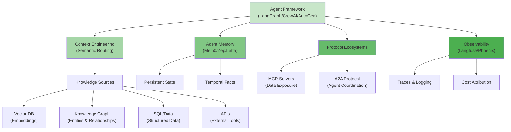

# Enterprise Data Systems & AI Governance Report — Part 3

Part 3 of 3 — linked from [Part 2](pathname:///archon/data-knowledge/parts/03-enterprise-data-systems-ai-governance-report-part2).

This final part covers agentic AI data platforms, enterprise search systems, platform evaluation frameworks, production failure analysis, technology radar, build-versus-buy guidance, cost modeling, and production readiness—the strategic and operational considerations for deploying trustworthy AI systems at scale through 2031.

---

## Agentic AI Data Platforms

MCP/A2A ecosystems, agent memory, context engineering, and knowledge sync

Agentic AI data platforms represent the newest and fastest-evolving category in this report. Standards and platforms here should be considered TRIAL or ASSESS in the Technology Radar — production deployments exist but best practices are still forming.

### Protocol Ecosystems

###### MCP (Model Context Protocol)

An open protocol (introduced by Anthropic) standardizing how AI applications connect to external data sources and tools — effectively a universal adapter pattern so that any MCP-compatible client (Claude, IDEs, agent frameworks) can use any MCP-compatible server (databases, SaaS tools, internal systems) without custom integration code. **Architecture implication:** data platforms exposing MCP servers for their catalogs, semantic layers, and feature stores become directly consumable by AI agents — positioning the semantic layer as the natural MCP exposure point for governed data access. Rapidly growing ecosystem of community and vendor-built MCP servers for databases, observability tools, and SaaS platforms.

###### A2A (Agent-to-Agent Protocol)

An open protocol (introduced by Google) for communication and interoperability between AI agents built on different frameworks/vendors — addressing the multi-agent coordination problem distinctly from MCP's tool-access problem. **Architecture implication:** as enterprises deploy specialized agents (built on different frameworks — LangGraph, CrewAI, AutoGen) that need to collaborate, A2A-style protocols define how agents discover each other's capabilities and exchange task requests/results, requiring a registry/directory of agent capabilities analogous to a service registry in microservices architectures.

### Agent Memory & Orchestration Platforms

#### Mem0

###### TRIAL

Open source (+ managed) memory layer for AI agents providing persistent, queryable memory across sessions with automatic extraction of salient facts from conversations. Positions itself as a 'memory API' that abstracts over underlying vector/graph storage. Best for: teams wanting memory capability without building custom infrastructure on raw vector DBs.

#### Letta (formerly MemGPT)

###### ASSESS

Framework for building 'stateful agents' with explicit memory hierarchy (core memory, archival memory, recall memory) inspired by OS memory management — agents can edit their own context window contents. Research-driven origins (MemGPT paper); growing into a platform with persistence and multi-agent support.

#### Zep

###### TRIAL

Memory platform combining a temporal knowledge graph (tracking how facts change over time, not just current state) with vector search for agent memory. The temporal graph aspect directly addresses a gap in simpler vector-only memory: agents need to know not just facts but when those facts were true/changed.

#### LangGraph

**ADOPT (for orchestration)**

Graph-based agent orchestration framework (from LangChain team) for building stateful, multi-step agent workflows with explicit control flow — addressing reliability concerns with purely autonomous agent loops by allowing developers to define which steps are deterministic vs. LLM-driven. Widely adopted as the orchestration layer beneath custom agent applications.

#### CrewAI

###### TRIAL

Framework for orchestrating multi-agent 'crews' with role-based agent definitions (e.g., researcher, writer, reviewer agents collaborating on a task). Higher-level abstraction than LangGraph, trading flexibility for faster multi-agent prototyping.

#### AutoGen (Microsoft)

###### TRIAL

Microsoft Research framework for multi-agent conversation patterns — agents that converse with each other (and humans) to accomplish tasks. Strong academic/research adoption; growing enterprise use particularly within Microsoft ecosystem (integration paths toward Azure AI Foundry).

#### OpenAI Agents SDK

###### TRIAL

OpenAI's framework for building agents with built-in support for handoffs between specialized agents, guardrails, and tracing. Tightly coupled to OpenAI models but provider-agnostic in architecture; growing adoption among OpenAI-centric enterprises.

#### Strands (AWS)

###### ASSESS

AWS's open source agent framework emphasizing a model-driven approach where the agent loop itself is largely defined by the LLM's reasoning rather than rigid developer-defined graphs — positioned as simpler than graph-based frameworks for many use cases while integrating natively with AWS services (Bedrock, Lambda) for tool execution.

### Context Engineering & Semantic Routing

Context engineering — the discipline of deciding what information enters an LLM's context window, in what order, and in what format — has emerged as a critical skill distinct from prompt engineering. Key architectural patterns:

- **Semantic routing:** directing queries to the appropriate knowledge source (vector DB, graph, SQL database, API) based on query intent classification, rather than always querying all sources

- **Context compression:** summarizing or filtering retrieved context to fit within token budgets while preserving the most decision-relevant information

- **Context ranking:** when multiple retrieval sources return results, ranking and merging them (similar to hybrid search RRF) before context assembly

- **Multi-agent knowledge sharing:** when multiple agents in a system need access to overlapping knowledge, architectures must decide between shared memory stores (risk: agents stepping on each other's context) vs. per-agent memory with explicit synchronization (risk: knowledge drift between agents)

**Operational Reality Check:** Most production 'agentic AI data platforms' in 2026 are composed of multiple best-of-breed components (a feature store or semantic layer for governed data access via MCP, a vector/graph combination for memory, LangGraph or similar for orchestration, and Langfuse/Phoenix for observability) rather than a single unified platform. Enterprises should architect for this composability — favoring components with open protocols (MCP, OpenTelemetry) over vertically-integrated proprietary agent platforms, given how rapidly this space is evolving.

## Enterprise Search & Knowledge Systems

Permission-aware retrieval, semantic search, and grounding at scale

Enterprise search platforms are converging into AI-grounding infrastructure — the retrieval layer that determines what an AI assistant or agent can 'see' across an organization's content, with permission enforcement as the central architectural challenge.

#### Glean

###### ENTERPRISE LEADER

Purpose-built enterprise AI search platform that connects to 100+ enterprise applications (Slack, Confluence, Google Workspace, Jira, Salesforce, etc.) and builds a unified, permission-aware index. Glean's permission model mirrors source-system ACLs in real time — a document's visibility in Glean search results always reflects current source-system permissions, including revocations. Increasingly positioned as the 'knowledge layer' beneath enterprise AI agents, with Glean Assistant and agent-building capabilities. Best for: enterprises with highly fragmented SaaS application landscapes needing unified search/grounding without a single dominant platform (e.g., not pure Microsoft or pure Google shops).

#### Microsoft 365 Copilot

###### ECOSYSTEM LEADER

Grounding architecture built on Microsoft Graph (permissions + relationships) and Azure AI Search (semantic + vector retrieval) over SharePoint, Exchange, Teams, and OneDrive content. Permission enforcement is native to the Graph — Copilot can only retrieve content the requesting user already has access to via standard M365 permissions, evaluated at query time. Best for: organizations with content predominantly in Microsoft 365.

#### Atlassian Intelligence / Rovo

**ECOSYSTEM CHALLENGER**

Search and AI across Confluence, Jira, and connected third-party apps via Rovo's unified search index, with Atlassian's existing space/project-level permission model enforced for retrieval. Rovo Agents allow building custom agents grounded in this index. Best for: organizations with substantial Atlassian-based documentation and project management content.

#### Salesforce Agentforce

###### CRM-NATIVE LEADER

Builds on Data Cloud's unified customer graph plus Salesforce's existing object-level and field-level security model — Agentforce agents inherit the permission context of the user (or run with defined service-account permissions for autonomous use cases) when querying CRM data. Distinctive: the Einstein Trust Layer architecture ensures customer data sent to underlying LLMs is not retained by model providers and is masked for PII before transmission. Best for: CRM-centric customer service and sales AI use cases.

#### ServiceNow AI / Now Assist

###### ITSM-NATIVE LEADER

Grounds AI in the Configuration Management Database (CMDB) — itself a knowledge graph of IT assets, services, and their relationships — plus knowledge base articles and incident/change records, with ServiceNow's existing ACL (Access Control List) model enforced. The CMDB-as-knowledge-graph pattern is notable: it predates the 'knowledge graph for AI' trend by years but is now being explicitly leveraged for IT-context-aware AI responses. Best for: IT service management, HR service delivery, and customer service workflows already on the Now Platform.

### Permission-Aware Retrieval — Core Architecture Pattern

Across all platforms above, the dominant architectural pattern is **late-binding permission enforcement**: the search/retrieval index may contain content the requesting user cannot access, but permission checks are evaluated at query time (not index time) by re-checking against the source system's current ACLs (or a synchronized permission cache). This ensures permission revocations take effect immediately without requiring index rebuilds, but introduces a latency cost (permission check per result) and a synchronization risk (if the permission cache lags the source system, over- or under-sharing can occur briefly).

**Operational Lesson — Permission Sync Lag:** The most serious enterprise search incidents involve permission sync lag — a user's access is revoked in the source system (e.g., they leave a project), but the search index's cached permission state takes minutes to hours to reflect this, during which AI-grounded responses may surface content the user should no longer see. Enterprises deploying AI search should require sub-5-minute permission sync SLAs and monitor sync lag as a first-class observability metric, not an afterthought.

## Operational Excellence Framework

A 19-dimension evaluation rubric for data and AI platforms

This framework provides a consistent rubric for evaluating any platform discussed in this report (or new platforms not yet covered). Each dimension is defined with the specific questions an architect should ask during platform evaluation or periodic review.

###### Scalability

Does the platform scale linearly (or near-linearly) with data volume and query load? Are there known scaling cliffs (e.g., metadata catalog performance degradation beyond N tables, vector index recall degradation beyond N vectors)? What is the largest documented production deployment?

###### Availability

What is the platform's documented/typical uptime SLA? For self-hosted OSS, what does achieving high availability require operationally (clustering, leader election, etc.)?

###### Reliability

Under sustained load or partial failure, does the platform degrade gracefully or fail completely? Are there documented failure modes and their blast radius?

###### Durability

What are the data durability guarantees (replication factor, backup mechanisms)? For derived data (vector indexes, graph databases built from source data), what is the rebuild time if durability is lost?

###### Recoverability

What is the Recovery Time Objective (RTO) and Recovery Point Objective (RPO) achievable with this platform? Does the platform support point-in-time recovery (e.g., lakehouse time travel)?

###### Operability

How much ongoing operational effort (FTE-equivalent) does running this platform at the target scale require? Are there managed/SaaS options that eliminate this burden, and at what cost premium?

###### Maintainability

How easily can the platform be upgraded, reconfigured, or extended without downtime? What is the typical upgrade cadence and breaking-change frequency?

###### Extensibility

Does the platform support custom extensions, plugins, or APIs for integration with other systems? Is there an active ecosystem of community/third-party extensions?

###### Portability

How difficult is migration away from this platform? Does it use open formats/protocols (Iceberg, OpenTelemetry, MCP) or proprietary formats requiring custom export tooling?

###### Vendor Lock-in Risk

Beyond data portability, how locked-in are operational practices, skills, and integrations? Is there a credible multi-vendor strategy, or does adoption imply single-vendor dependency for the foreseeable future?

###### Cost Efficiency

How does cost scale with usage — linearly, sub-linearly (economies of scale), or with step-function jumps at certain thresholds? Are there cost optimization levers (reserved capacity, spot/preemptible compute, tiered storage)?

###### Performance Efficiency

For the resources consumed (compute, memory, storage), what throughput/latency is achieved? Are there documented benchmarks from independent sources (not just vendor marketing)?

###### Sustainability

What is the energy/carbon footprint consideration — particularly relevant for GPU-intensive AI workloads and large-scale vector indexes. Do vendors publish sustainability reporting relevant to ESG requirements?

###### Compliance Readiness

Does the platform have relevant certifications (SOC 2, ISO 27001, FedRAMP) out of the box? Does it provide the audit logging, encryption, and access control features needed to support the compliance frameworks?

###### AI Readiness

Does the platform natively support AI workload patterns — vector storage/search, integration with ML frameworks, feature serving at inference latency? Or does AI integration require significant custom engineering?

###### Agent Readiness

Does the platform expose data/functionality via agent-consumable protocols (MCP servers, semantic APIs)? Does it support the fine-grained, dynamic access control that agent workloads require?

###### Multi-Tenant Support

For platforms serving multiple business units/teams, does the platform provide tenant isolation (data, compute, cost attribution) without requiring separate deployments per tenant?

###### Multi-Cloud Support

Can the platform operate consistently across AWS, Azure, and GCP, or is it tied to a single cloud provider? For single-cloud platforms, what is the migration path if multi-cloud becomes a requirement?

###### Hybrid Cloud Support

Can the platform operate in a mixed on-premises/cloud environment — particularly relevant for regulated industries with data residency constraints that prevent full cloud migration?

### Applying the Framework

Rather than scoring every platform against all 19 dimensions (which would produce an unwieldy and rarely-actionable matrix), the recommended approach is: for each platform under evaluation, identify the 3-5 dimensions most material to the specific use case (e.g., for a vector database supporting a customer-facing RAG application, Performance Efficiency, Availability, and Cost Efficiency likely dominate; for an internal knowledge graph powering occasional analyst queries, Operability and Extensibility may matter more than raw performance). This framework is most valuable as a checklist to prevent blind spots — particularly Sustainability, Agent Readiness, and Vendor Lock-in Risk, which are frequently omitted from traditional platform evaluations but increasingly material.

## Production Failure Analysis

Root causes, detection, mitigation, and lessons from real incident patterns

This section synthesizes common production incident patterns observed across enterprise data and AI platforms. Rather than naming specific incidents (which are often partially documented and time-sensitive), the focus is on recurring root-cause patterns that architects should design against.

###### Kafka Outages — Partition Reassignment Storms

**Pattern:** A broker failure triggers partition reassignment across the cluster; if reassignment throughput isn't throttled, the resulting network/disk I/O can overwhelm remaining brokers, causing cascading failures. **Detection:** Consumer lag spikes across many topics simultaneously; broker disk I/O saturation metrics. **Mitigation:** Throttle reassignment traffic; maintain sufficient replication factor (3+) with rack awareness to limit simultaneous-failure blast radius. **Long-term fix:** Migrate to KRaft mode (removing ZooKeeper dependency) which has improved reassignment handling; consider tiered storage to reduce broker-local disk pressure. **Lesson:** Cluster topology changes (including 'routine' broker replacement) are a leading cause of Kafka incidents — treat them with the same change-management rigor as application deployments.

###### Snowflake / Cloud DW Incidents — Warehouse Sizing & Query Concurrency

**Pattern:** A scheduled job (or AI agent issuing many ad-hoc queries) causes warehouse queue buildup, delaying downstream dependent pipelines and SLA-bound dashboards. **Detection:** Query queue time metrics; pipeline SLA breach alerts. **Mitigation:** Separate warehouses by workload class (ETL vs. BI vs. ad-hoc/AI) to prevent resource contention; implement auto-scaling with appropriate min/max bounds. **Long-term fix:** Resource monitors with hard limits to prevent runaway costs from AI agents issuing unbounded query loops; query result caching to reduce redundant computation. **Lesson:** AI agents that can generate and execute their own SQL queries are a novel source of warehouse contention — without query governors, an agent stuck in a retry loop can consume disproportionate compute budget and degrade service for other workloads.

###### Databricks / Spark Failures — Small File Problem & Compaction Debt

**Pattern:** Streaming ingestion into Delta/Iceberg tables creates many small files; without regular compaction, query performance degrades progressively (more files = more metadata overhead per query) until queries time out or jobs fail with memory errors during planning. **Detection:** Gradually increasing query latency over weeks/months (often missed until severe); file count metrics per table partition. **Mitigation:** Scheduled compaction (OPTIMIZE in Delta, rewrite_data_files in Iceberg); tune streaming write trigger intervals to produce larger files upstream. **Long-term fix:** Automated compaction services (available natively in some managed platforms) with monitoring of file-count-per-partition as a first-class metric. **Lesson:** This failure mode is gradual and easy to miss in dashboards focused on job success/failure rather than performance trends — it requires explicit monitoring of a metric (file count) that isn't intuitively 'a problem' until it suddenly is.

###### CDC Failures — Schema Evolution Breaking Downstream Consumers

**Pattern:** A source database schema change (column added, type changed) propagates via CDC (Debezium) into the lakehouse; if schema evolution isn't handled consistently across the CDC pipeline, target tables, and consuming jobs, downstream jobs fail or — worse — silently produce incorrect results (e.g., a widened integer column causing silent truncation in a downstream typed schema). **Detection:** Schema monitoring catching the source change; downstream job failures or, for silent failures, drift detection catching distributional anomalies. **Mitigation:** Schema registry with compatibility enforcement (backward/forward compatible changes only) at the CDC layer; automated schema evolution in target tables (Iceberg/Delta support this) combined with explicit consumer notification. **Long-term fix:** Data contracts between source system owners and CDC pipeline owners, with CI checks preventing incompatible schema changes from being deployed to production source databases without coordinated downstream updates. **Lesson:** CDC pipelines create an implicit contract between teams who often don't communicate (application database team vs. data platform team) — making this contract explicit prevents the most common CDC incident category.

###### Data Corruption Events — Concurrent Write Conflicts

**Pattern:** Multiple writers (e.g., a batch job and a streaming job) write to the same Iceberg/Delta table without proper isolation, leading to either write conflicts (job failures, generally the 'safe' outcome) or, in misconfigured setups, data corruption/loss if optimistic concurrency control is bypassed. **Detection:** Job failure rates spiking with concurrency-conflict error messages; row count anomalies if corruption occurs. **Mitigation:** Design table ownership such that each table has a single writer (or coordinated writers using the table format's native concurrency control correctly); avoid bypassing catalog-level locking. **Long-term fix:** Architectural review of write patterns per table, documented in the data catalog as part of table metadata — 'who/what writes to this table' should be discoverable, not tribal knowledge. **Lesson:** Open table formats provide the mechanisms for safe concurrent writes, but don't prevent architectural patterns (uncoordinated multi-writer designs) that make conflicts frequent and operationally painful even when not corrupting data.

###### Lineage Failures — Untracked Manual Interventions

**Pattern:** An analyst or engineer makes a manual data correction (a one-off UPDATE statement, a manually-uploaded corrected file) outside the normal pipeline — this change is invisible to lineage tooling, which only tracks pipeline-driven transformations. When investigating a downstream anomaly, lineage tools show a 'clean' path that doesn't explain the actual data state. **Detection:** Often only detected during incident investigation when lineage-based root-cause analysis fails to explain observed data. **Mitigation:** Restrict direct write access to production tables (enforce all changes through pipelines); where manual intervention is unavoidable, require it to be logged as a lineage event (even if synthetic). **Long-term fix:** Audit logging at the storage/catalog layer that captures all write operations regardless of origin, cross-referenced with pipeline-based lineage to surface 'unexplained' writes. **Lesson:** Lineage tooling is only as complete as the instrumented paths — any out-of-band data modification path (and there are usually more than architects assume) creates a lineage blind spot.

###### Governance Failures — Stale Access Grants Surviving Org Changes

**Pattern:** An employee changes teams/roles; their previous access grants (often role-based) aren't revoked because the access review process is periodic (quarterly/annual) rather than event-driven, leaving excessive access for months. When this access is to AI training data or feature stores, it can mean models are trained on data the training process shouldn't have had access to under current policy. **Detection:** Periodic access reviews (the slow path) or anomaly detection on access patterns (faster but requires baseline). **Mitigation:** Event-driven access revocation tied to HR systems (role change triggers automatic access review); time-bound access grants requiring renewal rather than indefinite grants. **Long-term fix:** ABAC policies that derive access from current attributes (current role, current team) rather than static grants — access automatically changes when the underlying attribute changes, without requiring a separate revocation step. **Lesson:** RBAC's simplicity is also its weakness for this failure mode — static role assignments drift out of sync with organizational reality; ABAC's dynamic evaluation is more resilient but requires the underlying attributes (team membership, role) to be reliably and promptly updated in their source systems.

###### AI Hallucination Incidents Caused by Poor Data Architecture

**Pattern:** An AI assistant/agent provides confidently incorrect information not because the model 'hallucinated' in isolation, but because the retrieval layer surfaced outdated, duplicate, or contradictory documents (e.g., an old policy document that was never archived/deprecated in the search index, contradicting a newer policy document). The model faithfully synthesizes the retrieved (bad) context. **Detection:** User-reported incorrect answers; if prompt/retrieval lineage exists, root cause is traceable to specific retrieved documents; without it, the incident is attributed (often incorrectly) purely to 'model hallucination.' **Mitigation:** Document lifecycle management — deprecated/superseded documents must be removed or clearly flagged in search indexes, not just in the source system; retrieval ranking that considers document recency/version status. **Long-term fix:** Treat the knowledge base feeding AI retrieval as a governed data product with the same quality monitoring as structured data — including freshness monitoring for document corpora and automated detection of contradictory content. **Lesson:** Many incidents attributed to 'AI hallucination' are actually data quality incidents in the retrieval corpus — the distinction matters because the fix (data governance) is entirely different from the fix for true model hallucination (model selection, prompting, confidence calibration). Without prompt/retrieval lineage, organizations frequently misdiagnose the former as the latter and pursue ineffective mitigations.

## Technology Radar

Adopt / Trial / Assess / Hold recommendations

This radar summarizes adoption guidance synthesized across all domains. ADOPT indicates production-proven technologies with broad enterprise validation; TRIAL indicates technologies ready for production pilots with appropriate guardrails; ASSESS indicates technologies worth evaluating but not yet production-critical; HOLD indicates declining or legacy technologies best avoided for new investment.

### ADOPT

| **Technology / Pattern** | **Rationale** |
|---|---|
| Apache Iceberg / Delta Lake / Hudi (open table formats) | Industry-standard interoperability layer; multi-engine support is now mature |
| Apache Kafka (and Confluent/managed equivalents) | De facto standard for enterprise eventing; ecosystem breadth unmatched |
| OpenTelemetry | Vendor-neutral instrumentation standard with broad backend support |
| dbt (for ELT transformation + semantic layer) | Standard for governed, version-controlled transformation logic |
| Feature stores for production ML (Tecton/Hopsworks/cloud-native) | Solves training-serving skew definitively; mature operational patterns |
| LangGraph (for agent orchestration with explicit control flow) | Balances autonomy with reliability; widely adopted as orchestration layer |
| Unity Catalog / Lake Formation / Polaris-style ABAC governance | Scales access governance beyond manual RBAC; integrates lineage natively |

### TRIAL

| **Technology / Pattern** | **Rationale** |
|---|---|
| Streaming databases (Materialize, RisingWave) for live dashboards/agent triggers | Strong fit for continuous-query use cases; operational maturity still developing |
| MCP servers for governed data exposure to agents | Rapidly standardizing; early production deployments validate the pattern |
| Vector + graph hybrid retrieval (GraphRAG patterns) | Meaningful quality improvement over vector-only for relationship-heavy domains |
| Agent memory platforms (Mem0, Zep) | Solves real persistence problems; vendor landscape still consolidating |
| Data observability with AI-specific monitoring (Monte Carlo, Arize) | Mature for traditional data quality; AI-specific features are newer but valuable |
| SPIFFE/SPIRE for workload identity in multi-cloud | Proven for service identity; extending to agent identity is promising |
| Unified evidence-collection architecture for compliance | High-value pattern for multi-framework compliance; requires upfront investment |
| Redpanda as Kafka-API alternative | Compelling ops simplification; smaller ecosystem than Kafka proper |

### ASSESS

| **Technology / Pattern** | **Rationale** |
|---|---|
| A2A protocol for multi-agent interoperability | Promising for multi-framework agent coordination; standard still forming |
| Letta / MemGPT-style self-editing agent memory | Research-driven; production patterns still emerging |
| Knowledge fabric (catalog + graph convergence) | Conceptually compelling; few mature reference implementations |
| ISO 42001 certification for AI management systems | New standard; certification bodies/auditor ecosystem still maturing |
| Vector database-native multi-modal embeddings at enterprise scale | Capability exists but operational patterns for scale/cost not fully proven |
| Agent-native data architecture as a distinct paradigm | Conceptually important but no consensus reference architecture yet |
| Continuous/automated compliance evidence generation via AI | Promising direction; accuracy/audit-acceptance still being validated |

### HOLD

| **Technology / Pattern** | **Rationale** |
|---|---|
| Unmanaged Hadoop/HDFS data lakes for new investment | Superseded by lakehouse; migration should be prioritized, not new builds |
| Apache Atlas for new governance deployments | Largely superseded by modern catalogs with AI-assisted metadata |
| Point-to-point custom integrations bypassing event mesh/data products | Creates unmanageable dependency graphs; data products/contracts preferred |
| Single-region architectures for AI-critical workloads | Insufficient resilience given AI system availability expectations |
| Manual/periodic-only access reviews as primary governance control | Too slow for AI-era data access; ABAC + event-driven revocation preferred |
| Framework-by-framework point compliance solutions | Multiplying frameworks make this unsustainable; unified evidence layer preferred |

## Build vs Buy Decision Matrix

For each major category, this matrix summarizes when building a custom solution is justified versus when buying (commercial SaaS or managed service) is the recommended default.

| **Category** | **Default Recommendation** | **Build Justified When** | **Buy Justified When** |
|---|---|---|---|
| Data Movement / CDC | Buy (Fivetran/Debezium-managed) | Highly custom source systems with no connector support; extreme volume requiring bespoke optimization | Standard sources (databases, SaaS APIs); team lacks dedicated integration engineering capacity |
| Streaming Platform | Buy (managed Kafka/Confluent/Redpanda Cloud) | Extreme scale with cost sensitivity justifying dedicated SRE team; specific latency requirements unmet by managed options | Most enterprises — operational overhead of self-managed Kafka is substantial and well-documented |
| Lakehouse Platform | Buy (Databricks/Snowflake/Fabric/BigQuery) | Very large, mature data engineering org with existing Spark/Trino expertise and multi-cloud cost optimization needs | Standard case — managed platforms provide governance, optimization, and AI integration that's costly to replicate |
| Feature Store | Buy for &lt;20 models; Build/customize for 50+ | Large-scale ML org with specific latency/throughput requirements beyond managed offerings; need for tight integration with proprietary infra | Small-to-mid ML teams — Feast (OSS, self-hosted) or Tecton/cloud-native for managed |
| Data Catalog / Governance | Buy (Atlan/Collibra/DataHub Cloud) | Strong engineering culture preferring OSS (DataHub/OpenMetadata self-hosted) with capacity to extend | Most enterprises — governance workflow tooling (approval flows, stewardship UX) is high-effort to build well |
| Data Observability | Buy (Monte Carlo/Soda/Bigeye) | Very specific monitoring requirements not covered by vendor rule languages; cost sensitivity at extreme table-count scale | Standard case — ML-based anomaly detection and incident workflows are difficult to replicate cost-effectively |
| Platform Observability (Metrics/Logs/Traces) | Buy core (Datadog/Grafana Cloud) + Build OSS for LLM (Phoenix/Langfuse) | Cost at extreme scale justifies self-hosted Prometheus/Grafana/Tempo stack with dedicated ops | Standard case for traditional observability; OSS LLM observability (Phoenix/Langfuse) is increasingly 'buy-equivalent' via self-hosting simplicity |
| Agent Orchestration Framework | Build on OSS framework (LangGraph/CrewAI/AutoGen) | Always — orchestration logic is core business logic and should be owned/version-controlled | N/A — even 'buying' here means adopting an OSS framework as a library, not outsourcing the orchestration logic itself |
| Agent Memory / Context Store | Trial managed (Mem0/Zep) before building custom | Highly specific memory architecture requirements (e.g., regulatory constraints on memory retention) not met by available platforms | Most pilots — managed memory platforms reduce time-to-production significantly for early agent deployments |
| Enterprise Search / AI Grounding | Buy (Glean or ecosystem-native: M365 Copilot/Agentforce/Rovo) | Extremely fragmented, non-standard internal tools with no connector support and strong internal platform engineering capacity | Standard case — permission-aware retrieval across many SaaS sources is a substantial undertaking to build correctly |
| Compliance Evidence Collection | Build unified internal layer; Buy point solutions to populate it | Always build the unifying layer — but populate it using existing tooling (catalog, observability, IAM logs) rather than building each evidence source from scratch | Buy individual evidence sources (e.g., access certification tools) that feed the internal evidence layer |

*Table 16: Build vs Buy Decision Matrix by Platform Category*

## Cost Modeling Framework

Cost modeling for AI-era data platforms must account for cost dimensions that traditional data platform TCO models often omit. The framework below organizes costs into five categories with guidance on the most common estimation errors.

###### 1. Storage Costs

Object storage (typically the cheapest tier) plus derived storage: vector indexes (often 2-4x the size of source embeddings due to index overhead), graph database storage (can be 3-10x source data size depending on relationship density), and observability data retention (logs/traces, especially full LLM payload logging, can become a surprisingly large line item at scale). **Common estimation error:** modeling only primary storage and omitting derived/index storage, which can exceed primary storage cost for vector- and graph-heavy architectures.

###### 2. Compute Costs

Batch/streaming processing compute (Spark/Flink clusters or serverless equivalents), warehouse/lakehouse query compute, embedding generation compute (can be substantial for large corpora — embedding a multi-million-document corpus is a meaningful one-time and ongoing cost), and LLM inference costs (often the largest and most variable cost category, scaling with usage in ways traditional compute doesn't). **Common estimation error:** estimating LLM costs based on expected request volume without accounting for retry loops, agent multi-step reasoning (a single user request can trigger 10-50+ LLM calls in agentic workflows), and context window growth over time as retrieval corpora expand.

###### 3. Data Movement / Egress Costs

Cross-region and cross-cloud data transfer costs, which can be substantial for multi-cloud architectures or when LLM API calls require sending large context payloads repeatedly. **Common estimation error:** underestimating egress costs when architecture spans clouds (e.g., data in AWS, LLM API calls to a provider hosted elsewhere, observability platform in a third location) — each hop potentially incurs egress charges.

###### 4. Observability & Governance Tooling Costs

Licensing for catalog, lineage, observability, and AI governance platforms — often priced per data asset, per user, or per data volume processed, creating cost growth that tracks platform growth in ways that can outpace budget expectations. **Common estimation error:** evaluating tooling cost at current scale without modeling cost trajectory as the data estate grows — per-asset pricing models can become disproportionately expensive as catalogs scale into tens of thousands of assets.

###### 5. Operational / Human Capital Costs

FTE time for platform operations, data stewardship, governance review processes, and incident response — often the largest cost category but the least rigorously modeled. **Common estimation error:** treating 'buy' decisions as eliminating operational cost entirely, when in reality managed platforms still require configuration, monitoring, governance policy maintenance, and vendor relationship management — the operational cost is reduced, not eliminated.

**AI-Specific Cost Governance Recommendation:** Implement per-agent and per-feature cost attribution from day one — tagging LLM API calls, vector queries, and compute jobs with the agent/feature/team responsible. Without this, AI cost growth becomes a shared, unattributed line item that's politically difficult to manage; with it, cost becomes a normal input to engineering decisions (e.g., 'this agent's cost-per-resolution exceeds its business value — redesign or deprecate').

## Production Readiness Checklist

This checklist consolidates the operational requirements discussed throughout the report into a pre-launch verification list for any new data pipeline, AI feature, or agent deployment.

###### Data Quality & Observability

- ☐ Freshness, volume, and schema monitoring configured for all source and derived tables

- ☐ Drift detection configured for any features feeding production ML models

- ☐ Alert routing configured with clear on-call ownership (not just 'sent to a channel')

- ☐ Vector/embedding monitoring configured if RAG/vector search is used

###### Lineage & Traceability

- ☐ Technical lineage captured for all transformation jobs (via OpenLineage or platform-native tooling)

- ☐ For AI features: model/feature lineage links training data to model versions

- ☐ For LLM/agent systems: prompt and retrieval lineage captured for debugging

- ☐ Manual intervention paths (if any) are logged as lineage events

###### Reliability

- ☐ SLOs defined for data freshness/quality relevant to this pipeline's consumers

- ☐ Disaster recovery plan documented, including rebuild time for any derived indexes (vector/graph)

- ☐ Graceful degradation paths defined for dependency failures (stale features, LLM API outages, etc.)

- ☐ Chaos/failure testing performed for critical-path dependencies

###### Security

- ☐ Access control model defined (RBAC/ABAC) and reviewed for least-privilege

- ☐ Encryption at rest and in transit verified for all new data stores

- ☐ Secrets (API keys, credentials) managed via vault/secrets manager, not hardcoded

- ☐ For agent systems: agent identity and scoped permissions defined (not inheriting broad service-account access)

###### Compliance & Governance

- ☐ Data classification applied (PII/PHI/PCI tagging) for all new datasets

- ☐ Retention policy defined and automated where possible

- ☐ If high-risk AI use case (per EU AI Act or sector regulation): technical documentation and human oversight checkpoints implemented

- ☐ New data product registered in catalog with owner/steward assigned

###### AI / Agent-Specific

- ☐ Cost attribution tags applied to LLM calls, vector queries, and compute jobs

- ☐ Evaluation/quality benchmarks established before production traffic, with ongoing eval monitoring

- ☐ For agents: permitted action scope documented; human-approval gates defined for high-stakes actions

- ☐ Hallucination/quality incident response process defined, including escalation path distinguishing data-quality vs. model issues

## Future Trends 2026–2031

###### Convergence of Data and AI Observability Platforms

By 2028, the distinction between 'data observability' and 'AI/LLM observability' platforms will largely disappear — vendors in both categories are already expanding toward each other (Monte Carlo adding AI features, Arize/Fiddler adding traditional data quality monitoring). Expect unified platforms providing a single pane spanning data quality, pipeline health, model performance, and agent behavior.

###### Agent Identity Standards Mature

Expect formal extensions of SPIFFE/SPIRE (or a new complementary standard) specifically addressing agent identity — including delegation chains (agent acting on behalf of a user, with both identities recorded), capability-scoped credentials, and cross-organization agent identity (for A2A scenarios spanning company boundaries) by 2027-2028.

###### Semantic Layers Become the Primary AI-Data Interface

As MCP and similar protocols standardize agent-to-data connectivity, the semantic layer (metric definitions, governed business vocabulary) becomes the natural exposure point — agents query 'revenue by region' through governed semantic definitions rather than raw SQL against physical tables, providing both better AI accuracy and governance enforcement at the interface layer.

###### Compliance Evidence Generation Becomes Largely Automated

Unified evidence-collection architectures combined with AI-assisted report generation will reduce the manual effort of multi-framework compliance reporting significantly by 2028-2029 — though human review of AI-generated compliance documentation will remain a requirement under most frameworks (ironically, an AI governance requirement applied to AI governance tooling itself).

###### Streaming Becomes the Default for AI Feature Pipelines

As streaming databases (Materialize, RisingWave) and stream processing (Flink) tooling matures and lowers operational barriers, expect 'streaming-first' feature pipeline design to become the default for new AI feature development by 2029, with batch reserved explicitly for training data generation and historical analysis rather than as the default processing mode.

###### Knowledge Graphs Become Standard Infrastructure for Agent Memory

The combination of vector search (semantic similarity) and knowledge graphs (relationship/temporal reasoning) for agent memory — currently an emerging pattern (Zep, GraphRAG) — becomes standard infrastructure by 2028, with managed 'agent memory' platforms converging toward this hybrid architecture as the default rather than a differentiator.

###### Multi-Agent Governance Frameworks Emerge as a Distinct Discipline

As multi-agent systems proliferate, expect dedicated governance frameworks addressing emergent multi-agent behaviors (distinct from single-agent governance) — including 'agent fleet' monitoring, policy frameworks for agent-to-agent negotiation/coordination, and incident response processes for multi-agent failure cascades, maturing as a discipline by 2029-2030.

###### Data Mesh and AI-Native Architecture Converge

Data mesh's domain-ownership and data-as-product principles increasingly apply to AI assets (models, embeddings, agents as 'AI products' owned by domains with defined contracts/SLAs) — by 2030, expect 'AI mesh' or similar terminology describing domain-owned AI capabilities exposed via standardized protocols (MCP/A2A) analogous to how data mesh describes domain-owned data exposed via data products.

###### Sustainability Becomes a First-Class Architecture Criterion

As GPU-intensive AI workloads' energy consumption draws increased regulatory and stakeholder scrutiny, expect sustainability metrics (carbon per inference, energy efficiency of vector index designs, model selection considering compute efficiency alongside accuracy) to become standard inputs to architecture decisions by 2029-2030, particularly for EU-operating enterprises under broader ESG reporting requirements that increasingly encompass digital infrastructure.

###### Reference Architectures Standardize Around Open Protocols

The current proliferation of proprietary agent platforms and memory systems will partially consolidate around open protocols (MCP for tool/data access, OpenTelemetry-based standards for observability, open table formats for storage) — by 2030, enterprise reference architectures will likely specify these protocols as requirements in vendor selection, similar to how SQL compatibility became a baseline requirement for databases decades earlier.

**Closing Note:** The architectures, platforms, and frameworks in this report represent a snapshot of a rapidly evolving landscape, particularly in Parts 17-18 (Agentic AI Data Platforms, Enterprise Search). The underlying principles — governance preceding tooling, observability spanning data and AI, lineage as a prerequisite for trust, and reliability engineering applied to data as rigorously as to applications — should remain stable reference points even as specific vendor and protocol landscapes continue to shift through 2031.
