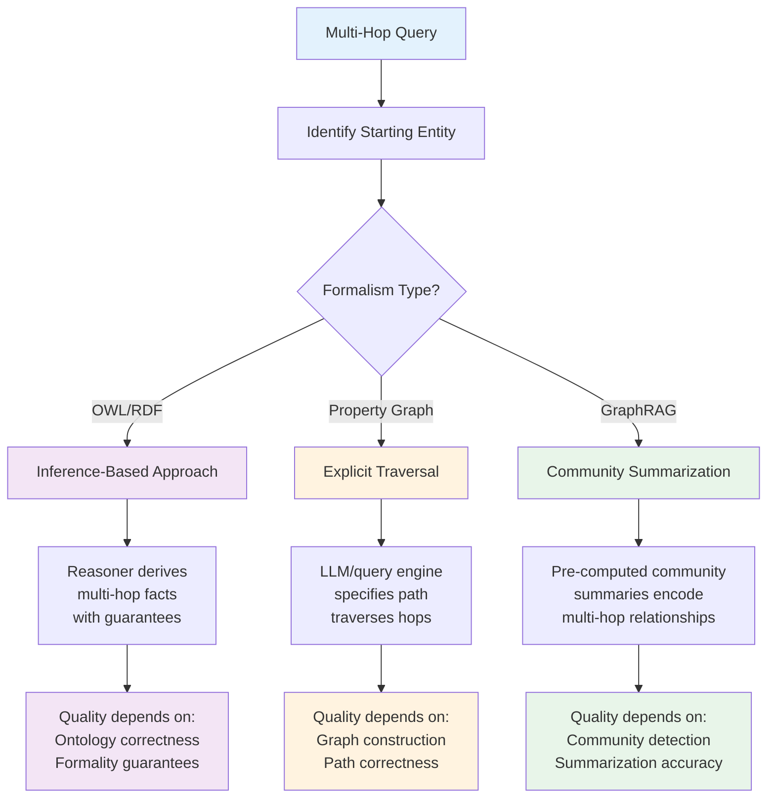

# AI Grounding, Reasoning & Governance (Part 2)

**Part 1 of this report:** See [Enterprise Knowledge Architectures — Foundations & Modeling](pathname:///archon/data-knowledge/14-enterprise-knowledge-architectures-report) for foundational concepts, knowledge graphs, ontologies, property graphs, semantic layers, and enterprise knowledge modeling.

---

Grounding — connecting an AI system's outputs to verifiable, enterprise-specific information rather than relying solely on the model's parametric (training-time) knowledge — is the primary justification for enterprise knowledge architecture investment in the AI era. This section examines how the components from Sections 1-4 contribute to grounding, and where grounding can fail despite a knowledge architecture being technically present.

## The Grounding Spectrum: From Documents to Structured Facts

### Document-Level Grounding (Vector Retrieval)

The baseline RAG pattern (companion Architecture Evolution report, Section 9): retrieve semantically similar document chunks and include them in the prompt. Grounding here is at the granularity of 'this document discusses this topic' — useful for open-ended questions but limited for questions requiring precise facts (a specific number, a specific relationship) that may be present in a retrieved document but not extracted in a structured, verifiable form.

### Entity-Level Grounding (Knowledge Graph Lookup)

Retrieving a specific entity's properties from a knowledge graph (e.g., 'Company A's headquarters location') provides grounding at the granularity of individual facts — if the knowledge graph is accurate, this fact is verifiably correct (or verifiably-traceable-to-source, if knowledge lineage per the companion Lineage Systems report's Section 6 is available), a stronger grounding guarantee than 'this document, which discusses Company A among other things, was retrieved'.

### Relationship-Level Grounding (Multi-Hop Traversal)

For questions requiring relationships between entities ('what products does Company A's main supplier also supply to Company A's competitors'), grounding requires traversing multiple relationships in the knowledge graph — this report's dedicated Multi-Hop Reasoning section examines this in depth, but the grounding implication is that the quality of grounding for relationship-level questions depends on the completeness and correctness of every relationship in the traversal path, compounding the entity-level grounding guarantee's dependency on knowledge graph accuracy across multiple hops.

### Inference-Level Grounding (OWL Reasoning)

The most formally rigorous grounding available (Section 2): a fact that's derived via OWL reasoning from explicit facts plus formal ontology axioms carries a logical guarantee — if the explicit facts are correct and the ontology axioms correctly represent domain rules, the derived fact is correct by construction. As noted in Section 2, this grounding mode is underused in current GraphRAG architectures despite representing the strongest formal guarantee available.

## Grounding Failure Modes Despite Knowledge Architecture Presence

- **Retrieval doesn't reach the relevant grounding source:** a knowledge graph may contain the correct fact, but if the retrieval step (vector search for relevant starting entities, or the traversal query) doesn't surface it — due to embedding mismatch, query formulation issues, or the fact being in a part of the graph the traversal doesn't explore — the LLM generates a response without this grounding, potentially relying on parametric knowledge instead, with no signal to the user that grounding was attempted but unsuccessful

- **Grounding source itself is stale or incorrect:** per the companion Architecture Evolution report's Production Failure Analysis and this report's Section 1 discussion of entity resolution as a continuous process, the knowledge graph itself can contain stale or incorrect information — grounding to an incorrect source produces a confidently-grounded but factually wrong response, which is arguably worse than an ungrounded response since the presence of grounding (e.g., a citation) increases user trust without justification

- **Grounding granularity mismatch:** a question requiring entity-level or relationship-level grounding (precise facts) may only retrieve document-level grounding (relevant-but-imprecise documents) if the knowledge architecture's entity-level layer doesn't cover the relevant entities — the LLM then must extract the precise fact from the retrieved document text itself, reintroducing the extraction-accuracy concerns that motivated structured knowledge representation in the first place

- **Grounding presented without indicating its mode:** as discussed in the companion Lineage Systems report's AI Traceability & Explainability section, a response grounded via document-level retrieval and a response grounded via inference-level OWL reasoning may be presented identically to the user (e.g., both as 'sources' or 'citations'), despite carrying very different correctness guarantees — this is the knowledge-architecture-specific instance of the 'explainability ceiling' concept from that report.

## Grounding Architecture Recommendations by Question Type

Because grounding quality depends on matching the question type to the appropriate grounding mode (the spectrum above), enterprises should consider routing different question types to different grounding strategies rather than relying on a single retrieval pipeline for all questions — this is essentially the semantic routing concept discussed in the companion Operational Excellence report's Part 17 (Agentic AI Data Platforms), applied specifically to grounding strategy selection: factual lookup questions route to entity-level knowledge graph queries (with document-level retrieval as fallback if the entity isn't represented); relationship/reasoning questions route to multi-hop traversal; open-ended exploratory questions route to document-level retrieval; and, where applicable, questions matching patterns covered by formal ontology axioms route to OWL-reasoning-capable query paths to obtain the strongest available grounding guarantee.

**Recommendation:** Grounding should be treated as a multi-tier system with explicit fallback and explicit signaling of which tier produced a given grounding — not a single retrieval call whose results are uniformly presented as 'the grounding'. This directly mitigates the 'grounding presented without indicating its mode' failure pattern above, and aligns with this report's broader theme that knowledge architecture quality depends on deliberate design choices about formality and structure being preserved through to the AI consumption layer, rather than being flattened into a single undifferentiated retrieval interface.

## Multi-Hop Reasoning

Multi-hop reasoning — answering questions that require traversing multiple relationships across entities — is the capability most directly associated with knowledge graphs' value proposition for AI grounding (companion Architecture Evolution report, Section 6). This section examines how multi-hop reasoning actually works across the formality spectrum (Sections 2-3), where it breaks down, and why this report's Executive Summary identifies graph construction quality, not traversal algorithm sophistication, as the dominant factor in reasoning quality.

### What 'Multi-Hop' Actually Means

A one-hop query retrieves information directly connected to a starting entity (e.g., 'what is Company A's headquarters location' — one relationship traversed: Company A → headquartered_in → Location). A multi-hop query requires chaining relationships (e.g., 'what is the headquarters location of Company A's main supplier's parent company' — three relationships: Company A → supplied_by → Company B → parent_company_of ← Company C → headquartered_in → Location). Each additional hop multiplies the opportunities for the traversal to encounter an incomplete, incorrect, or ambiguous relationship — which is why multi-hop reasoning quality degrades faster than linearly with hop count when the underlying graph has any non-trivial error rate per relationship.

### How Multi-Hop Reasoning Differs Across the Formality Spectrum

#### OWL/RDF (Inference-Based Multi-Hop)

Multi-hop reasoning in OWL can occur via explicit traversal (SPARQL property paths, analogous to property graph traversal) or via inference — an OWL axiom stating that a relationship type is transitive means a reasoner can derive a direct 'effectively connected' fact between entities that are multiple explicit hops apart, without the query itself needing to specify the traversal path. This shifts some multi-hop complexity from query time (the consumer must know to traverse N hops) to ontology design time (the ontology author must correctly specify which relationships are transitive/composable) — a tradeoff that favors consistency (every query benefits from the inference, without needing to know the underlying path structure) at the cost of upfront ontology design correctness becoming even more consequential.

#### Property Graphs (Explicit Traversal)

Multi-hop queries in Cypher/GQL explicitly specify the traversal pattern (e.g., '(a)-[:SUPPLIES]->(b)-[:PARENT_OF]-(c)-[:HEADQUARTERED_IN]->(loc)'). This is more transparent (the query directly shows what's being traversed) but places the burden of knowing the correct traversal pattern — including which relationship types and directions are relevant — on whoever writes the query, which for AI agents means the LLM generating the traversal query must correctly infer the relevant pattern from the schema, a non-trivial task especially given Section 3's relationship type proliferation concern (if there are multiple semantically-similar relationship types, which should the traversal use?).

#### GraphRAG Community-Based Multi-Hop (Microsoft GraphRAG Pattern)

Rather than (or in addition to) explicit traversal, some GraphRAG implementations pre-compute 'communities' — clusters of densely-connected entities — and generate summaries of each community that implicitly encode multi-hop relationships within that community. A query can then retrieve relevant community summaries rather than performing live traversal — trading traversal-time flexibility for retrieval-time efficiency, at the cost of the summary's quality depending on the community detection and summarization steps' accuracy, and the summary potentially going stale as the underlying graph changes (connecting to the companion Operational Excellence report's discussion of GraphRAG construction cost and incremental update challenges).

### Why Graph Construction Quality Dominates Traversal Algorithm Choice

This report's Executive Summary identifies graph construction quality as the dominant factor in multi-hop reasoning quality — this section elaborates why, with reference to specific construction-quality dimensions:

- **Entity resolution errors compound across hops:** if 'Company B' in the example above was actually two distinct entities that entity resolution incorrectly merged (Section 1's continuous-process framing), a traversal through the merged entity will produce results that are partially correct (for the hop that was correctly merged) and partially incorrect (for the hop where the merge introduced an erroneous connection) — and this error is invisible at the traversal layer, since the traversal correctly follows the relationships as they exist in the (incorrectly-constructed) graph

- **Missing relationships produce silent incompleteness, not errors:** if the extraction process (Section 3, bottom-up modeling) didn't extract a relationship that exists in reality (e.g., Company B's parent company relationship wasn't mentioned in any processed document), a multi-hop traversal requiring that relationship simply returns no result for that path — which may be indistinguishable, from the querying agent's perspective, from 'this relationship doesn't exist in reality' versus 'this relationship exists but wasn't captured', a distinction that matters enormously for how the agent should communicate the absence of an answer

- **Relationship type ambiguity affects traversal correctness:** if Section 3's relationship type proliferation has produced both 'SUPPLIES' and 'PROVIDES' as semantically-similar but distinct edge types from different extraction batches, a traversal query specifying 'SUPPLIES' will miss relationships extracted as 'PROVIDES' — again producing silent incompleteness rather than an error, and the severity of this issue scales with the number of hops, since each hop is an additional opportunity for the traversal's specified relationship type to not match the actual (fragmented) type used in the graph

- **Directionality and cardinality assumptions:** multi-hop traversals often implicitly assume relationships have a particular directionality or cardinality (e.g., 'parent_company_of' assumed to have at most one target) — if extraction produces relationships with inconsistent directionality (sometimes 'A parent_of B', sometimes 'B subsidiary_of A' for the same real-world relationship, without consistent normalization) or unexpected cardinality (multiple 'parent companies' due to extraction errors or genuinely ambiguous corporate structures), traversal queries written with the assumed directionality/cardinality can produce incomplete or duplicated results

**Implication for Investment Prioritization:** Enterprises investing in GraphRAG/multi-hop reasoning capability should weight investment toward graph construction quality — entity resolution accuracy monitoring, relationship type vocabulary curation (Section 3), and completeness assessment for extraction coverage — over investment in traversal algorithm sophistication (e.g., more elaborate path-ranking or community-detection algorithms). A sophisticated traversal algorithm over a poorly-constructed graph will surface the construction errors more efficiently, but will not produce better answers than a simple traversal over a well-constructed graph would. This is a direct, practical consequence of this report's formality/agility framing: the agility of bottom-up, extraction-first construction (Section 3's preferred mode for most current GraphRAG implementations) defers exactly the quality investments that multi-hop reasoning depends on most.

## Semantic Retrieval

Semantic retrieval — finding relevant information based on meaning rather than exact keyword match — is implemented through multiple complementary mechanisms across the knowledge architecture components in this report: vector similarity (companion Architecture Evolution report, Section 9), graph traversal (Sections 1-3 of this report), and semantic-layer-mediated structured queries (Section 4). This section examines how these mechanisms combine in practice, and where semantic retrieval differs from — and where it should be combined with — traditional keyword/full-text search.

### The Three Retrieval Mechanisms and What Each Is Good At

#### Vector Similarity (Embedding-Based)

Strong for: open-ended questions where the relevant information might be phrased very differently from the query ('semantic' matching across paraphrase); finding documents 'about' a topic without requiring exact terminology match; ranking large candidate sets by relevance. Weak for: precise factual lookups (a vector search for 'Company A's CEO' might return documents discussing Company A's leadership generally, without guaranteeing the specific CEO name is extractable); relationship-dependent questions (vector similarity captures topical relatedness, not relational structure); and questions where the 'correct' answer is rare/specific within a corpus dominated by superficially-similar content (the needle is semantically similar to the haystack).

#### Graph Traversal (Structural)

Strong for: precise factual lookups when the fact is represented as an entity property or direct relationship (Section 1's entity-level grounding); multi-hop relationship questions (this report's dedicated section); and questions where the answer requires combining information from multiple distinct sources connected via shared entities (e.g., 'what do our support tickets and our sales records both say about Customer X', where the 'Customer X' entity is the connection point). Weak for: open-ended exploratory questions without a clear starting entity; questions about content that wasn't captured during graph construction (Section 1's bottom-up modeling incompleteness); and ranking by 'relevance' in the way vector similarity does — graph traversal returns what's connected, not what's most topically relevant among many connected items.

#### Semantic-Layer-Mediated Structured Query

Strong for: questions that map to governed business metrics or entities with established definitions (companion Architecture Evolution report, Section 7); ensuring consistency with business logic and access control (Section 4's bridging role); and questions where the 'correct' answer must come from a specific, authoritative source rather than whatever a vector/graph search happens to surface. Weak for: questions about concepts not yet modeled in the semantic layer (coverage gaps, as discussed in the companion Architecture Evolution report's Section 7); and exploratory/ad-hoc questions where defining a governed term in advance isn't practical.

### Hybrid Retrieval Architectures

Given the complementary strengths above, production semantic retrieval architectures increasingly combine multiple mechanisms rather than relying on one — extending the GraphRAG pattern (vector search to find starting entities, then graph traversal) with a third, semantic-layer-mediated path for questions that map to governed definitions. Combination patterns include:

- **Sequential (vector → graph):** the standard GraphRAG pattern — vector similarity identifies candidate starting entities, then graph traversal expands from those entities to find related information that vector similarity alone wouldn't surface (since the related information might not be textually similar to the original query)

- **Parallel with result fusion (vector + graph + semantic layer, merged):** all three mechanisms are queried for a given question, and results are merged/ranked — providing redundancy (if one mechanism's coverage gap means it returns nothing, the others may still produce a result) at the cost of increased latency and the need for a fusion/ranking step to combine results from fundamentally different result types (text chunks, graph entities, structured metric values)

- **Query-classification routing:** a classification step (potentially LLM-based) determines which mechanism(s) are appropriate for a given question before querying — e.g., a question matching a known semantic layer term routes there first, with vector/graph as fallback if the semantic layer doesn't cover it; a question with clear multi-hop structure routes to graph traversal; an open-ended question routes to vector search. This is the semantic routing pattern referenced in this report's AI Grounding section, applied to retrieval mechanism selection specifically rather than grounding-tier selection generally (the two are closely related but not identical — a single grounding tier might itself use one or more retrieval mechanisms)

### Where Traditional Keyword/Full-Text Search Still Matters

Despite semantic retrieval's prominence in AI architectures, traditional keyword/full-text search (BM25 and similar algorithms, as used in Elasticsearch/OpenSearch and similar platforms) retains specific advantages that semantic retrieval doesn't replace: exact-match precision for identifiers (part numbers, account IDs, error codes) where semantic similarity is irrelevant — a vector search for an error code string doesn't reliably retrieve documents containing that exact string, while keyword search does, by design; and interpretability — keyword search results can be explained simply ('this document contains the words you searched for'), while vector similarity scores are not directly interpretable to end users in the same way. Many production semantic retrieval architectures retain a hybrid search component (combining keyword/BM25 scoring with vector similarity scoring, often via reciprocal rank fusion) specifically to preserve exact-match capability for identifier-like queries — this is not a legacy holdover but an acknowledgment that semantic similarity and exact match serve different, both-necessary purposes.

**Recommendation:** Semantic retrieval architecture decisions should be made per-question-type (via the routing patterns above) rather than as a single enterprise-wide retrieval strategy. The most common architectural mistake observed in this research is treating vector similarity as a general-purpose replacement for all retrieval needs — leading to poor performance on the precise-lookup and multi-hop question types that graph traversal and semantic-layer queries handle better, with the failure mode often misdiagnosed as 'the embedding model isn't good enough' when the actual issue is mechanism mismatch for the question type, not embedding quality.

## Knowledge Governance

**Framing:** This report's Executive Summary identifies knowledge governance as the least mature governance domain across the report series — less mature than data governance (companion Operational Excellence report, Part 9), AI governance (Part 16 of that report), or lineage practices (companion Lineage Systems report). This section examines why, and what knowledge-specific governance requires beyond what these adjacent governance domains already provide.

### What Knowledge Governance Must Cover Beyond Data Governance

#### Ontology / Schema Change Governance

Who can add, modify, or deprecate entity types, relationship types, and (for OWL-based knowledge, Section 2) formal axioms? Unlike a table schema change (which affects queries against that table), a knowledge graph schema change can have cascading effects through multi-hop traversals (this report's dedicated section) and inference (for OWL) that are harder to enumerate via standard impact analysis (companion Lineage Systems report) because, per Section 6's lineage gaps, knowledge lineage connecting schema elements to the queries/traversals/inferences that depend on them is generally absent. Knowledge governance therefore requires either building this knowledge-specific lineage (a substantial undertaking) or adopting more conservative change processes (e.g., deprecation periods, parallel-running old and new schema elements) that don't depend on complete impact analysis.

#### Entity Resolution Governance

Section 1 frames entity resolution as a continuous process, not a one-time setup task — governance must address: what evidence is required to merge two entity references as the same real-world entity (and what's required to split a previously-merged entity if the merge is later found incorrect); who can review/override automated entity resolution decisions; and how entity resolution decisions are recorded for potential reversal (connecting to the companion Lineage Systems report's discussion of entity resolution lineage as a Layer 6 gap). No standard governance framework for entity resolution decisions exists as of 2026 — this is typically handled, if at all, via ad-hoc data quality processes not specifically designed for the graph context.

#### Relationship Type Vocabulary Governance

Section 3 identifies relationship type proliferation as a compounding issue for property-graph-based knowledge architectures. Governance for this requires: a documented (even if not strictly enforced, per Section 3's schema spectrum) vocabulary of relationship types; a process for proposing new types versus mapping a candidate new type to an existing one; and periodic consolidation review (Enterprise Knowledge Modeling section's 'periodic schema consolidation' pattern) with clear ownership for who conducts and approves this review.

#### Classification Propagation to Derived Graph Structures

As discussed in the companion Architecture Evolution report's Section 9 (in the context of vector infrastructure) and Section 6 (knowledge graphs specifically), data classification (PII, confidentiality levels) applied to source documents/records doesn't automatically propagate to derived graph entities and relationships — a knowledge graph entity constructed from a confidential document doesn't inherently carry that document's classification as a graph property unless the extraction/construction pipeline explicitly propagates it. Knowledge governance must define and enforce this propagation, including for entities that synthesize information from multiple source documents with potentially different classification levels (what classification should the resulting entity carry — the most restrictive of its sources, by default?).

#### Access Control for Graph-Structured Data

As noted repeatedly across this report series, access control on graphs is more complex than on tables — restricting access by entity type, by relationship type, or by specific entities/subgraphs (e.g., a user should see general organizational structure but not specific compensation-related relationships) requires graph-aware access control mechanisms. For property graphs, this can be implemented via database-level role-based access (where supported) or via the semantic layer mediation pattern (Section 4); for OWL, named graphs or similar RDF-specific access partitioning mechanisms exist but require corresponding query-time enforcement. In all cases, multi-hop traversal complicates access control further: a traversal that's individually permitted at each hop might, in combination, reveal an inference the user shouldn't have access to (e.g., traversing two individually-non-sensitive relationships might reveal a sensitive connection) — an 'inference control' problem with roots in the semantic web tradition's database security research, but limited practical tooling for property-graph-based GraphRAG implementations.

### Why Knowledge Governance Lags: Structural Reasons

- **Rapid, decentralized adoption pattern:** per the companion Architecture Evolution report's Section 6, knowledge graph adoption accelerated rapidly and, in many organizations, began as departmental or project-specific GraphRAG pilots rather than centrally-planned infrastructure — mirroring the decentralized, ungoverned early adoption pattern of data lakes (that report's Section 2), with similar risk of accumulated governance debt as these pilots scale into enterprise-critical infrastructure

- **Governance tooling hasn't caught up:** data governance platforms (Collibra, Atlan, DataHub, OpenMetadata — companion Operational Excellence report, Part 9) have lineage and classification features that extend reasonably well to tabular and even some graph data, but the specific governance areas above (entity resolution decisions, relationship type vocabularies, inference control) don't have established feature equivalents in these platforms as of 2026 — organizations seeking to govern these aspects must build custom processes, which few have prioritized given competing priorities

- **The formality spectrum complicates standardization:** because knowledge graphs span from highly-formal OWL ontologies to highly-informal LLM-extracted property graphs (this report's central framing), a single governance framework that's appropriate for one end of the spectrum may be inappropriate or unworkable for the other — OWL's formal change-review processes (appropriate given the cascading effects of ontology changes) would be excessive friction for a rapidly-iterating GraphRAG property graph, while the property graph's typical informal approach would be insufficient for an OWL ontology with regulatory dependencies — making a generic 'knowledge governance framework' harder to define than 'data governance framework', which doesn't face an analogous formality spectrum across its subject matter

- **Knowledge graphs are often perceived as 'derived/rebuildable':** echoing the companion Architecture Evolution report's discussion of vector infrastructure disaster recovery, knowledge graphs constructed from source documents are sometimes treated as fully rebuildable from source — which, while true in principle, undersells the governance value embedded in a mature graph (accumulated entity resolution decisions, curated relationship vocabularies, access control configurations) that would need to be re-established, not just re-extracted, after a rebuild — 'rebuildable' is not the same as 'governance-free', but this distinction is often not made explicit in how knowledge graphs are positioned within broader data governance discussions.

### A Practical Knowledge Governance Starting Framework

Given the absence of established tooling and frameworks, enterprises beginning knowledge governance should prioritize based on risk and reversibility rather than attempting comprehensive coverage immediately:

#### 1. Establish Ownership Before Scale

Before a knowledge graph grows beyond an initial pilot, assign explicit ownership — who is accountable for schema decisions, entity resolution quality, and access control configuration. This mirrors the companion Architecture Evolution report's data mesh discussion (Section 4) — ownership assigned after a swamp-like situation has developed is far more costly than ownership assigned before.

#### 2. Document the Schema, Even If Not Enforced

Per Section 3's schema spectrum, even a documented-but-unenforced schema provides a reference point for detecting drift and for guiding extraction prompts toward consistency — this is the lowest-cost governance intervention with meaningful impact on Section 3's relationship type proliferation concern.

#### 3. Implement Classification Propagation for the Highest-Sensitivity Sources First

Rather than solving classification propagation comprehensively (a significant undertaking per the discussion above), prioritize ensuring that entities/relationships derived from the most sensitive source documents (e.g., legal, HR, regulated-data sources) carry appropriate classification — accepting a gap for lower-sensitivity sources in the near term while closing the highest-risk gap first.

#### 4. Establish an Entity Resolution Review Process for High-Impact Merges

Rather than reviewing all entity resolution decisions (impractical at scale), establish criteria for which merges warrant human review before being finalized — e.g., merges involving entities with many existing relationships (where an incorrect merge has larger blast radius per this report's Multi-Hop Reasoning section) or merges with lower-confidence resolution scores.

#### 5. Treat Periodic Schema Consolidation as a Recurring Operational Task, Not a One-Time Cleanup

Schedule recurring (e.g., quarterly) reviews for relationship type and entity type vocabulary consolidation — making this a standing operational responsibility (with assigned ownership per step 1) rather than an occasional 'cleanup project' that competes with other priorities and tends to be deferred indefinitely once initial pilots are deemed 'working'.

**Closing Note on Governance Trajectory:** The governance gaps identified in this section are likely to narrow over the coming years as both governance platform vendors and knowledge graph platform vendors recognize the gap (a trajectory consistent with the companion Operational Excellence report's Future Trends discussion of governance frameworks catching up to vector and memory infrastructure). In the interim, enterprises that establish even lightweight versions of the practices above — particularly ownership and documented schema — will be substantially better positioned to adopt more formal tooling as it emerges, having already established the organizational practices that tooling will need to integrate with, rather than needing to retrofit both organizational practice and tooling simultaneously.

## GraphRAG vs. Traditional Architectures

This closing section synthesizes Sections 1-4 and the five investigation areas into a structured comparison between GraphRAG (the property-graph-based, extraction-first, vector+graph hybrid retrieval pattern that has become the AI-era default) and the traditional knowledge architectures it is most often discussed as replacing or competing with: vector-only RAG, formal OWL-based ontology systems, and traditional enterprise search. The comparison is structured as a decision framework rather than a verdict — consistent with this report's framing, the appropriate choice depends on use case characteristics, not a universal ranking.

### GraphRAG vs. Vector-Only RAG

This is the comparison most directly addressed by GraphRAG's original motivation (companion Architecture Evolution report, Section 6) — GraphRAG emerged specifically to address vector-only RAG's multi-hop reasoning limitations.

|**Dimension**|**Vector-Only RAG**|**GraphRAG**|
|---|---|---|
|Multi-hop questions|Weak — relies on chunks happening to contain multi-hop information, or on the LLM connecting facts across separately-retrieved chunks without explicit relationship structure|Strong — explicit traversal connects entities across multiple relationships (this report's Multi-Hop Reasoning section)|
|Open-ended/exploratory questions|Strong — semantic similarity naturally surfaces topically-relevant content without requiring a starting entity|Weaker without a vector component — pure graph traversal requires a starting point; most GraphRAG implementations retain vector search for this reason (hybrid by design)|
|Construction cost|Lower — embedding generation is the primary cost, scales linearly with corpus size|Higher — entity/relationship extraction (typically LLM-based) is computationally expensive and scales non-linearly with corpus complexity (companion Operational Excellence report, Part 17)|
|Update/freshness|Moderate — re-embedding changed documents is straightforward, though synchronization discipline still required (companion Architecture Evolution report, Section 9)|Harder — graph updates must handle entity resolution against existing entities, potential relationship changes, and (for community-based patterns) community re-summarization (this report's Multi-Hop Reasoning section)|
|Explainability|Moderate — citations show source documents, but not why those documents were relevant beyond similarity score|Stronger in principle (traversal path shows the relationship chain) but subject to this report's AI Grounding section's caveat about presenting grounding mode clearly|
|Governance maturity|Moderate — vector infrastructure governance gaps exist (companion Architecture Evolution report, Section 9) but are narrower in scope than knowledge graph governance|Weaker — this report's Knowledge Governance section identifies additional governance dimensions (entity resolution, relationship vocabularies, inference control) that vector-only RAG doesn't introduce|
|Operational complexity|Medium-High (companion Architecture Evolution report, Section 9)|High — adds entity resolution pipeline operation, ontology/schema management, and graph database operations on top of vector infrastructure's existing complexity|

*Table 2: GraphRAG vs. Vector-Only RAG*

### GraphRAG vs. Formal OWL-Based Ontology Systems

This comparison is less commonly made explicitly (the two are often built by different teams with different histories, as discussed in this report's Executive Summary) but is increasingly relevant as organizations with existing OWL investments evaluate GraphRAG adoption.

|**Dimension**|**Formal OWL-Based Ontology**|**GraphRAG (Property Graph)**|
|---|---|---|
|Time to initial value|Slow — requires ontology design before meaningful population (companion Architecture Evolution report, Section 6)|Fast — extraction can begin immediately (this report's Enterprise Knowledge Modeling section, bottom-up approach)|
|Reasoning capability|Strong — formal inference derives new facts with logical guarantees (this report's Section 2)|None natively — relationships must be explicit or derived via LLM-based traversal interpretation, without formal guarantees|
|Consistency checking|Strong — reasoners can detect logically inconsistent assertions|None natively — inconsistencies (e.g., contradictory relationships) can exist undetected (this report's Section 3)|
|Schema evolution cost|High — changes to class hierarchies/axioms can have cascading inferential effects requiring careful review|Lower — adding new node labels/relationship types is structurally simple, though Section 3's fragmentation risk is the tradeoff|
|Query language accessibility|Lower — SPARQL has a steeper learning curve for engineers without semantic web background (this report's Section 2)|Higher — Cypher/GQL's SQL-like syntax is more broadly familiar|
|Fit for LLM-extracted content|Poor direct fit — LLM extraction output doesn't naturally produce OWL axioms/constraints|Strong direct fit — LLM extraction output maps naturally to nodes/edges (this report's Section 3)|
|Interoperability with external standards|Strong where established upper ontologies exist (e.g., FIBO) — this report's Section 2|Weak — property graph schemas are typically organization-specific without standard external vocabularies|
|Best-fit domains|Domains with established formal rule systems and regulatory taxonomies (life sciences, financial services)|Domains without pre-existing formal models, or where rapid iteration on extraction-derived knowledge is prioritized|

*Table 3: GraphRAG (Property Graph) vs. Formal OWL-Based Ontology*

### GraphRAG vs. Traditional Enterprise Search

Traditional enterprise search (keyword/full-text search over documents, often with some taxonomy-based faceting) predates both vector-only RAG and GraphRAG, and remains in production at most enterprises — this comparison addresses whether/how GraphRAG complements or replaces it.

|**Dimension**|**Traditional Enterprise Search (Keyword/Faceted)**|**GraphRAG**|
|---|---|---|
|Exact-match queries (IDs, codes, names)|Strong — this is keyword search's core strength (this report's Semantic Retrieval section)|Weak directly — would need to traverse to an entity with a matching identifier property, less direct than keyword match|
|Relationship-based queries|Weak — faceted search can filter by categorical attributes but doesn't support arbitrary relationship traversal|Strong — this is GraphRAG's core differentiator (this report's Multi-Hop Reasoning section)|
|Result interpretability|High — users understand 'these documents contain your search terms'|Moderate — traversal paths are interpretable to technical users; translating to end-user-friendly explanations requires additional work (this report's AI Grounding section)|
|Integration with LLM/agent workflows|Requires adaptation — search results (document lists) must be converted to LLM-consumable context, typically via the same chunking/retrieval patterns as vector RAG|Native fit — GraphRAG was designed specifically for LLM context assembly|
|Maintenance model|Mature — indexing pipelines for keyword search are well-established, lower-complexity than entity extraction|Higher maintenance — entity resolution and schema management (this report's Knowledge Governance section) have no equivalent in keyword search maintenance|
|Existing enterprise investment|Very high — most enterprises have substantial existing search infrastructure (companion Operational Excellence report's enterprise search platforms, Part 18)|Additive — GraphRAG is typically deployed alongside, not instead of, existing search infrastructure|

*Table 4: GraphRAG vs. Traditional Enterprise Search*

### Decision Framework: When Each Architecture Is Appropriate

#### Choose Vector-Only RAG When...

The primary use case is open-ended question-answering over a document corpus where relationships between entities are not central to typical questions; the organization is early in its AI grounding journey and wants the lowest-complexity starting point (companion Architecture Evolution report's Technology Radar lists permission-aware vector retrieval as ADOPT); and there's no existing knowledge graph or ontology investment to build on.

#### Add GraphRAG When...

Evaluation of vector-only RAG reveals specific question categories that consistently underperform due to multi-hop relationship requirements (this report's Multi-Hop Reasoning section); the domain has natural entity-relationship structure that's valuable to make explicit (organizational hierarchies, supply chains, customer relationship networks); and the organization can commit to the ongoing entity resolution and schema governance investment (this report's Knowledge Governance section) that distinguishes a maintained knowledge graph from a one-time extraction exercise.

#### Leverage Existing OWL Ontologies When...

The organization already has formal ontology investments in domains with established regulatory/scientific taxonomies (this report's Section 2); questions in scope benefit from formal reasoning guarantees (inference-level grounding, this report's AI Grounding section) — particularly for compliance-sensitive use cases where the strength of the grounding guarantee matters; and the organization can build (or has) the SPARQL/reasoning query translation layer needed to make this accessible to LLM-based agents.

#### Build New OWL Ontologies When...

Rarely, for AI-grounding-driven initiatives specifically — per Section 2, the upfront investment is substantial and best justified by domains with genuinely rich formal rule systems. More appropriate when the primary driver is regulatory/compliance documentation requirements (companion Lineage Systems report's compliance mapping) that specifically benefit from formal, auditable semantics — in which case AI grounding becomes a secondary beneficiary of an investment justified on other grounds.

#### Retain/Extend Traditional Enterprise Search When...

Exact-match and identifier-based queries are common in the use case (this report's Semantic Retrieval section's discussion of hybrid search); existing search infrastructure investment is substantial and provides adequate coverage for current needs; and GraphRAG/vector additions are positioned as complementary retrieval mechanisms within a hybrid architecture (this report's Semantic Retrieval section) rather than as replacements.

#### Use the Semantic Layer Bridge When...

Multiple of the above apply simultaneously — e.g., an organization has existing OWL ontologies, is building GraphRAG property graphs, and wants AI agents to query both through a consistent interface (this report's Section 4). This is increasingly the realistic end-state for enterprises with knowledge architecture history predating the GraphRAG wave, rather than any single architecture being a complete replacement for the others.

### Closing Synthesis

'GraphRAG vs. traditional architectures' is, on close examination, less a competition between alternatives and more a question of which combination of retrieval mechanisms (vector, graph traversal, formal reasoning, keyword search) and which point on the formality/agility spectrum (Sections 2-3) best serves a given organization's mix of question types — most of which coexist within the same organization, and increasingly within the same AI application via the routing patterns discussed in this report's Semantic Retrieval section. The practical risk this report identifies is not choosing the 'wrong' architecture, but under-investing in the governance (Knowledge Governance section) and construction-quality (Multi-Hop Reasoning section) practices that determine whether any of these architectures deliver on their potential — GraphRAG's rapid adoption has outpaced these practices industry-wide, and closing that gap is the highest-leverage investment available to most enterprises regardless of which specific architecture combination they ultimately adopt.

---

**Part 1 of this report:** See [Enterprise Knowledge Architectures — Foundations & Modeling](pathname:///archon/data-knowledge/14-enterprise-knowledge-architectures-report) for foundational concepts, knowledge graphs, ontologies, property graphs, semantic layers, and enterprise knowledge modeling.
