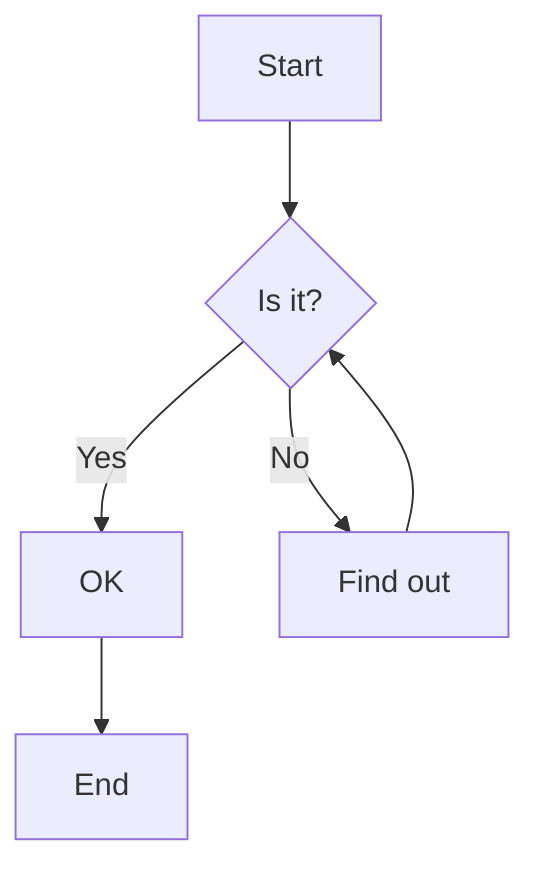

# agent-memory-planning-architecture

[Content from enterprise architecture domain]

```mermaid
graph TD
    A[Start] --> B{Is it?};
    B -- Yes --> C[OK];
    C --> D[End];
    B -- No --> E[Find out];
    E --> B;
```
