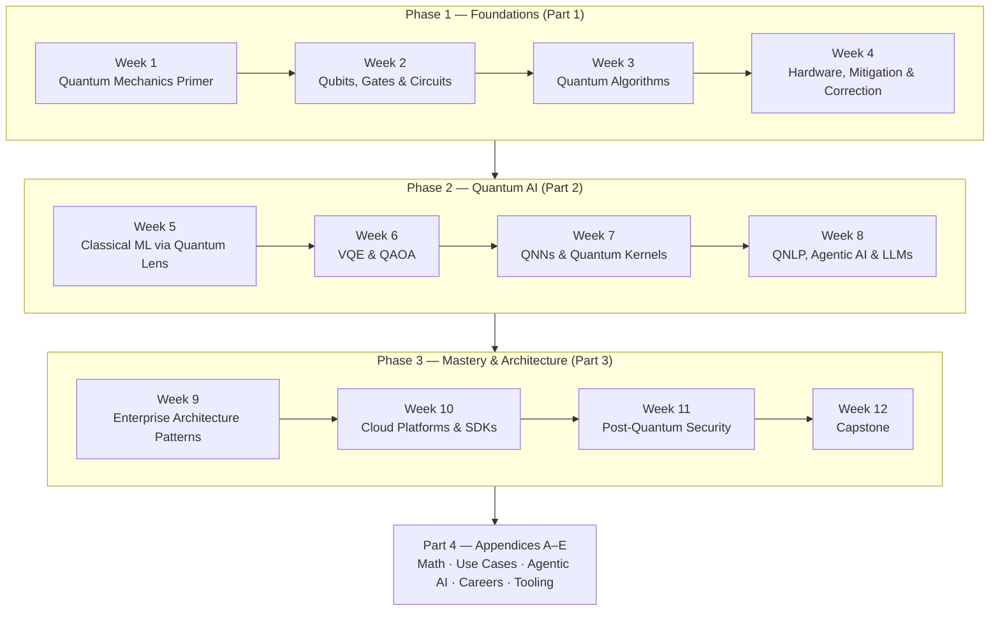

# Quantum AI Foundations

The quantum era is not coming — it is here. By 2030, quantum advantage will disrupt cryptography, drug discovery, logistics optimisation, financial modelling, and machine learning itself. McKinsey's 2026 Quantum Technology Monitor found that a third of large enterprises allocate over $10M annually to quantum initiatives; the quantum computing industry crossed $1B in revenue in 2025, projected to reach $4.4B by 2028.

---

## Why Quantum, Why Now

For a Principal Architect, quantum computing matters on three axes:

| Axis | Classical Limit | Quantum Opportunity |
| ------ | ---------------- | --------------------- |
| **Optimisation** | NP-hard problems scale exponentially | QAOA approximates solutions on NISQ hardware today |
| **ML / AI** | Diminishing returns from model scaling | QNNs &amp; quantum kernels access exponentially larger feature spaces |
| **Security** | RSA-2048 / ECC break under Shor's algorithm (2030–2035) | Post-quantum cryptography is an immediate compliance requirement |

### Programme Map

This guide is Part 1 of a 4-part series. The following diagram shows how it fits within the complete curriculum:



This is one continuous programme published as a 4-part series, not four unrelated documents. Every week builds on the vocabulary and code from the week before it, including across part boundaries. If a term feels unexplained, it was very likely introduced in an earlier part; use your browser's find-in-page to search the series rather than assuming it's missing.

---

## Phase 1 — Foundations

### Week 1: Quantum Mechanics Primer for Engineers

You do not need a physics PhD. You need a working engineer's understanding of the four phenomena that make quantum computing possible, plus enough of the Bloch sphere and entanglement's two headline protocols to stop treating them as buzzwords.

**You'll be able to:** explain superposition/entanglement/interference/measurement in your own words, plot a qubit state on the Bloch sphere, and walk through a teleportation circuit line by line.

<details>
<summary><strong>Superposition — "both at once"</strong></summary>

A classical bit is a coin that has already landed: it is either heads (0) or tails (1). A qubit is a *spinning* coin — while it spins, it is genuinely both at once, not just "we don't know which." When you measure it (stop the spin), it snaps to one value.

Mathematically, a qubit can exist in a linear combination of |0&rangle; and |1&rangle; simultaneously:

```
|ψ⟩ = α|0⟩ + β|1⟩   where  |α|² + |β|² = 1
```

The key insight: α and β are **complex amplitudes**, not probabilities. This distinction is what enables interference (see below) — and ultimately quantum speedup. An n-qubit register can be in a superposition of all 2ⁿ states simultaneously, which is why 300 qubits can represent more states than there are atoms in the observable universe.

</details>

<details>
<summary><strong>Entanglement — "spooky action at a distance"</strong></summary>

Imagine two magic dice that always land on opposite numbers, no matter how far apart they are rolled. That is entanglement: two or more qubits share a joint quantum state that cannot be described independently.

Measuring one qubit instantly determines the state of its entangled partner — not because a signal travels between them, but because they are a single quantum system that happens to be physically separated. Einstein famously called this "spooky action at a distance" and found it unsettling; Bell's 1964 theorem and subsequent experiments proved it is a real feature of nature, not a hidden-variable trick.

This enables quantum teleportation, superdense coding, and (in the future) distributed quantum computing — see the worked circuits below.

</details>

<details>
<summary><strong>Interference — "cancel the wrong answers"</strong></summary>

This is the least intuitive but most important phenomenon for quantum speedup.

Quantum algorithms are wave interference engines. They are designed so that computational paths leading to *wrong answers* cancel out (destructive interference) while paths leading to *correct answers* reinforce (constructive interference) — exactly like the dark and bright bands in a double-slit experiment. Grover's and Shor's algorithms both work this way. Without interference, superposition alone would just give you a random answer.

</details>

<details>
<summary><strong>Measurement — "collapsing the wave"</strong></summary>

Measuring a qubit ends its quantum existence: the superposition collapses irreversibly to a classical bit. The qubit yields |0&rangle; with probability |α|² or |1&rangle; with probability |β|².

This is a constraint, not just a feature. Quantum algorithms must be designed so that the correct answer has high probability **before** measurement — you cannot simply "look at all the superposed states." The art of quantum algorithm design is engineering the interference pattern so the right answer dominates.

</details>

#### The Bloch Sphere: Visualising a Qubit

Every single-qubit pure state can be written with two real parameters, θ and φ, instead of two complex amplitudes:

```
|ψ⟩ = cos(θ/2)|0⟩ + e^{iφ} sin(θ/2)|1⟩
```

θ is the polar angle (0 to π) and φ is the azimuthal angle (0 to 2π) — exactly like latitude and longitude on a globe. This is the Bloch sphere: every valid single-qubit state is a point on its surface (mixed states live inside it).

| State | θ | φ | Bloch position |
| --- | --- | --- | --- |
| \|0&rangle; | 0 | — | North pole |
| \|1&rangle; | π | — | South pole |
| \|+&rangle; = (\|0&rangle;+\|1&rangle;)/√2 | π/2 | 0 | +X equator |
| \|−&rangle; = (\|0&rangle;−\|1&rangle;)/√2 | π/2 | π | −X equator |
| \|+i&rangle; = (\|0&rangle;+i\|1&rangle;)/√2 | π/2 | π/2 | +Y equator |
| \|−i&rangle; = (\|0&rangle;−i\|1&rangle;)/√2 | π/2 | 3π/2 | −Y equator |

Single-qubit gates are rotations of this point about an axis:

- **X gate** — π rotation about the X axis (flips north/south pole: \|0&rangle;↔\|1&rangle;)
- **Z gate** — π rotation about the Z axis (flips the equator's +X/−X points, leaves poles fixed)
- **H (Hadamard)** — π rotation about the diagonal axis (X+Z)/√2 — this is exactly why H maps \|0&rangle; (north pole) to \|+&rangle; (equator)
- **Rx(θ), Ry(θ), Rz(θ)** — parameterised rotations by angle θ about each axis; these are the building blocks of every variational circuit in Part 2 onward

```python
from qiskit import QuantumCircuit
from qiskit.quantum_info import Statevector
from qiskit.visualization import plot_bloch_multivector

qc = QuantumCircuit(1)
qc.h(0)  # rotates |0⟩ (north pole) to |+⟩ (+X equator)

state = Statevector.from_instruction(qc)
plot_bloch_multivector(state)  # renders the point described in the table above
```

#### Quantum Teleportation: Entanglement's Payoff

**Teleportation** transfers an unknown qubit state from Alice to Bob using one shared entangled pair and two classical bits. No physical particle travels; the no-cloning theorem guarantees Alice's original is destroyed, preventing relativity violation.

```python
from qiskit import QuantumCircuit

qc = QuantumCircuit(3, 2)
qc.h(0)  # data qubit
qc.h(1); qc.cx(1, 2)  # Bell pair
qc.cx(0, 1); qc.h(0)  # entangle and measure
qc.measure([0, 1], [0, 1])
qc.x(2).c_if(qc.clbits[1], 1)  # Bob's corrections
qc.z(2).c_if(qc.clbits[0], 1)
```

**Week 1 Schedule:** Read Nielsen &amp; Chuang Chapters 1–3. Implement Bloch sphere visualizations and the teleportation circuit above on IBM Quantum's free tier.

---

### Week 2: Qubits, Gates & Quantum Circuits

Quantum gates are reversible and correspond to rotations on the Bloch sphere (see Week 1).

| Gate | Symbol | Action | Matrix |
| ------ | -------- | -------- | -------- |
| Pauli-X (NOT) | X | Flips \|0&rangle;↔\|1&rangle; | `[[0,1],[1,0]]` |
| Hadamard | H | Creates superposition | `[[1,1],[1,-1]]/√2` |
| CNOT | CX | Entangles two qubits | Flips target if control=\|1&rangle; |
| Toffoli | CCX | 3-qubit universal | Flips target if both controls=\|1&rangle; |
| Phase S, T | S/T | Rotates phase of \|1&rangle; | Diagonal `[[1,0],[0,i]]` |
| Rotation | Rx/Ry/Rz | Parameterised rotations | Foundation of variational circuits |

```python
from qiskit import QuantumCircuit

# Bell state — 2-qubit entanglement
qc = QuantumCircuit(2)
qc.h(0)        # superposition
qc.cx(0, 1)   # entangle
qc.measure_all()
print(qc.draw())
```

#### The Quantum Fourier Transform (QFT)

The QFT is the subroutine that both this week's phase estimation section and Shor's algorithm are built on — it's introduced here, not there, because it's a circuit-construction technique, not an algorithm in its own right. It maps computational basis states to a Fourier-transformed superposition:

```
QFT|x⟩ = (1/√N) Σ_y e^{2πixy/N} |y⟩ ,  N = 2ⁿ for n qubits
```

Structurally it's a layer of Hadamards interleaved with controlled phase rotations, followed by a qubit-order swap — built from gates you already know from the table above:

```python
from qiskit import QuantumCircuit
from qiskit.circuit.library import QFT

qc = QuantumCircuit(3)
qc.h(0)
qc.x(1)  # prepare an example input state |011>... (superposed on qubit 0)

qc.append(QFT(num_qubits=3, do_swaps=True), [0, 1, 2])
print(qc.decompose().draw())
```

Classically, computing a Fourier transform of N points costs O(N log N) (FFT); the QFT does the analogous transform on amplitudes encoded across n = log₂N qubits in O(n²) gates — exponentially fewer operations, though reading out all N amplitudes still costs a measurement per shot. This asymmetry — cheap to prepare, expensive to fully read out — is the recurring theme behind every "quantum speedup, with caveats" result in this series.

**Week 2:** Implement Pauli gates, H, CNOT. Build Bell states and the 3-qubit QFT. Test transpilation on real IBM hardware.

---

### Week 3: Quantum Algorithms — Grover, Shor, Deutsch-Jozsa

| Algorithm | Problem | Speedup | Architect's Note |
| ----------- | --------- | --------- | ----------------- |
| **Deutsch-Jozsa** | Is a function constant or balanced? | Exponential (1 query vs N/2) | First proof of quantum advantage. Understand the oracle pattern. |
| **Grover's** | Unstructured search in N elements | Quadratic (√N vs N) | Oracle pattern is the ancestor of QNN loss encoding. |
| **Shor's** | Integer factorisation | Exponential | Why RSA will break. Requires QFT + phase estimation, both below. |
| **QAOA** | Combinatorial optimisation | Approximate near-term | Production-relevant today. Builds on Grover's oracle concept. |

#### Deutsch-Jozsa: Circuit &amp; Code

Given a black-box function f that's either constant (same output for every input) or balanced (output is 0 for exactly half the inputs), Deutsch-Jozsa determines which in **one** query — classically this needs up to 2ⁿ⁻¹+1 queries in the worst case.

```python
from qiskit import QuantumCircuit

def balanced_oracle(n):
    """f(x) = x0 — flips the ancilla based on the first input bit."""
    qc = QuantumCircuit(n + 1)
    qc.cx(0, n)
    return qc

n = 3
qc = QuantumCircuit(n + 1, n)
qc.x(n)
qc.h(n)                 # ancilla prepared in |-> via X then H
qc.h(range(n))          # input register in equal superposition
qc.compose(balanced_oracle(n), inplace=True)
qc.h(range(n))
qc.measure(range(n), range(n))
# Measuring all-zeros → f is constant. Any other result → f is balanced.
```

```python
from qiskit import QuantumCircuit
from qiskit.circuit.library import GroverOperator, PhaseOracle

# Grover's search — 2-qubit example targeting |11⟩
oracle = PhaseOracle('x0 & x1')
grover_op = GroverOperator(oracle)

qc = QuantumCircuit(2)
qc.h([0, 1])
qc.compose(grover_op, inplace=True)
qc.measure_all()
```

:::tip Architect's Note
Grover's oracle pattern is the direct ancestor of quantum neural network loss function encoding. Master it — you will use this mental model throughout Part 2.
:::

#### Phase Estimation: The Engine Behind Shor's Algorithm

Phase estimation answers a narrower question than Shor's or Grover's: given a unitary U with eigenstate |u&rangle; and eigenvalue e^&#123;2πiθ&#125;, find θ. It does this by applying controlled powers of U (U, U², U⁴, ... U^(2^(k-1))) onto an ancilla register prepared in superposition, then running the **inverse QFT** on that register — the same QFT built above — to read θ out as a binary fraction in the classical register.

```python
from qiskit.circuit.library import PhaseEstimation
from qiskit.circuit.library import PhaseGate
from qiskit import QuantumCircuit
import numpy as np

# Estimate the phase of a simple PhaseGate(theta) unitary, theta = 2*pi*0.375
unitary = QuantumCircuit(1)
unitary.append(PhaseGate(2 * np.pi * 0.375), [0])

pe = PhaseEstimation(num_evaluation_qubits=3, unitary=unitary)
# pe's evaluation register measures out a 3-bit estimate of 0.375 = 0.011 in binary
```

This is precisely the subroutine Shor's algorithm calls to extract the period of a modular exponentiation function, and the same subroutine VQE's excited-state variant (QEOM, used in Part 4's drug-discovery pipeline) calls to read out energy levels beyond the ground state.

---

### Week 4: Quantum Hardware, Error Mitigation & Error Correction

#### Hardware Modalities

Think of quantum hardware platforms as different ways to physically build a qubit. Each exploits different quantum-mechanical phenomena, and each has fundamentally different speed-vs-fidelity-vs-scalability trade-offs.

| Platform | Provider | Gate Time | Coherence | Connectivity | Best For |
| ---------- | ---------- | ----------- | ----------- | -------------- | ---------- |
| **Superconducting** | IBM, Google | ~50 ns | ~100 µs | Nearest-neighbour | Large qubit count, fast iteration |
| **Trapped Ion** | IonQ, Quantinuum | ~1 ms | Seconds | All-to-all | High fidelity, near-term algorithms |
| **Photonic** | Xanadu | Room temp | Short | Gaussian boson sampling | QML, continuous-variable QC |
| **Neutral Atom** | QuEra, Pasqal | ~µs | ~seconds | Reconfigurable | Optimisation, simulation |
| **Topological** | Microsoft | TBD | Very long (theoretical) | TBD | Fault-tolerant future |
| **Silicon Spin** | Intel, academic | ~µs | ms–seconds | Nearest-neighbour (2D) | CMOS-compatible, long-term scale |

**2025–2026 Hardware Milestones** (current as of July 2026):

| Company | Chip | Key Claim |
|---|---|---|
| **IBM** | Nighthawk (120Q) | 218 couplers; supports 5,000 two-qubit gates at low error; targets quantum advantage by end-2026 |
| **IBM** | Loon (experimental) | First chip integrating all fault-tolerant components; 6-way connectivity; real-time error decoding in &lt;480 ns |
| **Google** | Willow (105Q) | Below-threshold error correction; 13,000× speedup over Frontier supercomputer on physics simulation benchmark |
| **Microsoft** | Majorana 1 (8Q topological) | World's first topological QPU; encodes qubits in Majorana zero modes for hardware-level error resistance; roadmap to 1M qubits on a single chip |
| **Quantinuum** | H-series trapped-ion | Error-protected logical qubits demonstrated beyond break-even (March 2026) |

Noise on all of these platforms is characterised by two numbers an architect should always ask a vendor for: **decoherence time** (how long a qubit holds its state before environmental noise scrambles it — the coherence column above) and **gate fidelity** (the probability a single gate executes correctly, typically 99.0–99.9% today). Calibration is the recurring process of re-measuring both and re-tuning control pulses, usually daily on cloud-hosted hardware — ask any vendor how often, and how they expose that data, before committing a production workload to a specific device.

&gt; **What is a topological qubit (for the curious non-specialist)?** Ordinary qubits store information in a single fragile particle. Topological qubits store information in the *relationship* between two special quasiparticles (Majorana zero modes) — so even if noise disturbs one particle, the information encoded in their joint state survives. Microsoft's Majorana 1 is the first chip to demonstrate this in hardware. It currently has only 8 qubits but the architectural approach could, in principle, scale to vastly more qubits per chip than today's superconducting designs.

Error mitigation and error correction are frequently conflated. They are not the same discipline, they don't run on the same hardware timeline, and an architect who pitches one when the stakeholder means the other will lose credibility fast:

| | Error Mitigation | Error Correction |
| --- | --- | --- |
| **Approach** | Statistical extrapolation applied to noisy raw results | Redundant physical qubits encode one logical qubit; syndrome measurements detect and fix errors |
| **Hardware overhead** | None — runs on today's NISQ devices as-is | High — current surface-code demonstrations use ~100s of physical qubits per logical qubit |
| **Availability** | Production-usable today | Emerging — Google's Willow chip (2024) demonstrated below-threshold exponential error suppression as code distance increases |
| **What it fixes** | Approximates the noise-free expectation value after the fact | Actively detects and corrects bit-flip/phase-flip errors during computation |
| **Architect's takeaway** | Use for near-term production pilots on 2026-era hardware | Budget for as a 2029–2032 capability, once fault-tolerant logical qubits are commercially available |

#### Error Mitigation & Correction

**Error mitigation** (available today) extrapolates noisy results to zero-noise via ZNE, PEC, or twirling. **Error correction** encodes one logical qubit across many physical qubits using stabilizer codes like the surface code. Correction requires ~100–1000 physical qubits per logical qubit and is a 2029–2032 capability; mitigation is your near-term production strategy.

When a vendor claims "N qubits," ask if they're physical or logical — this ratio is the single biggest differentiator between NISQ pilots and fault-tolerant systems.

**Phase 1 Capstone:** Design a 2-page quantum system architecture for a simple search problem — specify hardware choice, error mitigation strategy, and classical-quantum interface. State explicitly whether your design assumes NISQ-era mitigation or a future fault-tolerant logical-qubit budget, and why.

---

## Continue the Series

This guide is Part 1 of a 4-part series on Quantum AI. Each part is self-contained — start with Part 1 and work through in order, or jump straight to the part covering the phase you need.

| Part | Covers | Read Next |
| --- | --- | --- |
| Part 1 (this page) | Weeks 1–4: Foundations | [Part 2 — Quantum AI Applications →](./02-quantum-ai-applications.md) |
| [Part 2 — Quantum AI Applications](./02-quantum-ai-applications.md) | Weeks 5–8: Quantum AI &amp; ML | [Part 3 — Architecture →](./03-quantum-ai-architecture.md) |
| [Part 3 — Quantum AI Architecture](./03-quantum-ai-architecture.md) | Weeks 9–12: Enterprise Patterns | [Part 4 — Appendices →](./04-quantum-ai-appendices.md) |
| [Part 4 — Quantum AI Appendices](./04-quantum-ai-appendices.md) | Reference, Use Cases, Careers, Tooling | — |

---

## Resources

- Nielsen &amp; Chuang, *Quantum Computation and Quantum Information* (Chapters 1–5)
- IBM Quantum Learning: https://learning.quantum.ibm.com
- Qiskit Docs: https://docs.quantum.ibm.com
