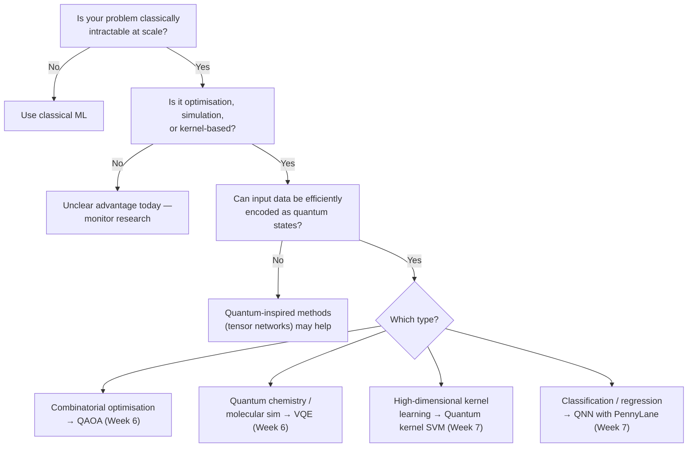

# Quantum AI Applications

**Weeks 5–8 · Principal Architect Track**

Continues from [Part 1: Foundations](./01-quantum-ai-foundations.md).

---

## Phase 2 — Quantum AI &amp; Machine Learning

### Week 5: Classical ML Through a Quantum Lens

Before building quantum ML models, understand which classical ML operations have quantum analogues.

| Classical Operation | Quantum Analogue | Potential Advantage |
| -------------------- | ----------------- | --------------------- |
| Matrix-vector multiply | Quantum matrix inversion (HHL) | Exponential (with strict caveats) |
| Kernel function | Quantum kernel (Hilbert space inner product) | Exponential feature space |
| Gradient descent | Parameter shift rule | Exact gradients without backprop |
| PCA / SVD | Quantum PCA (qPCA) | Potential speedup for sparse, low-rank matrices |
| Neural network layer | Variational quantum layer (VQL) | Exponential parameter space |
| Random sampling | Quantum sampling via amplitude estimation | Quadratic speedup over classical Monte Carlo |

:::warning Critical Caveat
The HHL algorithm offers exponential speedup **only under strict conditions**: sparse matrices, efficient state preparation, and quantum-readable output. Tang (2019) showed many claimed speedups were achievable classically. Real advantage exists but requires careful problem selection.
:::

**Quantum Advantage Decision Flowchart**



---

### Week 6: Variational Quantum Eigensolvers &amp; QAOA

#### VQE Architecture

The Variational Quantum Eigensolver finds the minimum eigenvalue of a Hamiltonian — the template for all variational quantum ML:

```python
from qiskit_nature.second_q.drivers import PySCFDriver
from qiskit_nature.second_q.mappers import JordanWignerMapper
from qiskit.algorithms.minimum_eigensolvers import VQE
from qiskit.algorithms.optimizers import COBYLA
from qiskit.circuit.library import EfficientSU2

# 1. Encode molecule as Hamiltonian
driver = PySCFDriver(atom="H .0 .0 .0; H .0 .0 0.735")
problem = driver.run()
mapper = JordanWignerMapper()
hamiltonian = mapper.map(problem.second_q_ops()[0])

# 2. Choose ansatz
ansatz = EfficientSU2(hamiltonian.num_qubits, reps=2)

# 3. Run VQE
vqe = VQE(ansatz=ansatz, optimizer=COBYLA(), estimator=estimator)
result = vqe.compute_minimum_eigenvalue(hamiltonian)
print(f"Ground state energy: {result.eigenvalue:.4f} Hartree")
```

#### QAOA for Combinatorial Optimisation

```python
from qiskit_optimization.algorithms import MinimumEigenOptimizer
from qiskit.algorithms import QAOA

# MaxCut on a 6-node graph
qaoa = QAOA(sampler=sampler, optimizer=COBYLA(), reps=3)
optimizer = MinimumEigenOptimizer(qaoa)
result = optimizer.solve(max_cut_problem)
```

**VQE vs QAOA:** VQE targets quantum chemistry, materials, drug discovery (continuous eigenvalue problem). QAOA targets scheduling, routing, portfolio optimisation, MaxCut (discrete combinatorial).

---

### Week 7: Quantum Neural Networks &amp; Kernel Methods

#### QNN Architecture

A QNN is a parameterised quantum circuit (PQC) used as a trainable model. Feature encoding matters as much as trainable layers. Standard schemes: **basis encoding** (one qubit per bit — simple), **angle encoding** (map features to rotation angles — linear in qubits), and **amplitude encoding** (pack 2ⁿ values into n qubits — exponentially efficient but state preparation often erases the advantage).

```python
import pennylane as qml
import torch

n_qubits = 4
dev = qml.device("default.qubit", wires=n_qubits)

@qml.qnode(dev, interface="torch")
def qnn_circuit(inputs, weights):
    # Feature encoding (angle encoding)
    qml.AngleEmbedding(inputs, wires=range(n_qubits))
    # Trainable layers
    qml.StronglyEntanglingLayers(weights, wires=range(n_qubits))
    # Measurement
    return [qml.expval(qml.PauliZ(i)) for i in range(n_qubits)]

# Wrap as PyTorch layer
weight_shapes = {"weights": (3, n_qubits, 3)}
qlayer = qml.qnn.TorchLayer(qnn_circuit, weight_shapes)
model = torch.nn.Sequential(qlayer, torch.nn.Linear(n_qubits, 1))
```

#### Quantum Kernel SVM

```python
from qiskit.circuit.library import ZZFeatureMap
from qiskit_machine_learning.kernels import FidelityQuantumKernel
from sklearn.svm import SVC

# Quantum kernel: K(x,x') = |⟨ψ(x)|ψ(x')⟩|²
feature_map = ZZFeatureMap(feature_dimension=2, reps=2)
quantum_kernel = FidelityQuantumKernel(feature_map=feature_map)

svc = SVC(kernel=quantum_kernel.evaluate)
svc.fit(X_train, y_train)
```

**2025–2026 Reality:** A December 2025 peer-reviewed study compared classical models against quantum SVMs on five datasets. Logistic regression won on three, random forest on one, quantum SVM on one. IonQ and Ansys reported a hybrid quantum-classical algorithm delivering up to 12% faster processing on blood pump dynamics simulation (early 2025). Lockheed Martin and Xanadu launched a quantum generative model research initiative (February 2026). QML is real, but quantum advantage on unstructured data remains open research in 2026.

---

### Week 8: QNLP, Agentic AI &amp; LLM Integration

#### Quantum Natural Language Processing

```python
import lambeq
from lambeq import BobcatParser, IQPAnsatz, AtomicType

parser = BobcatParser()
ansatz = IQPAnsatz({AtomicType.NOUN: 1, AtomicType.SENTENCE: 1}, n_layers=1)

sentences = ["John likes Mary", "Alice loves Bob"]
diagrams = parser.sentences2diagrams(sentences)
circuits = [ansatz(d) for d in diagrams]
```

#### LLM × Quantum Integration Patterns

| Pattern | Description | Timeline |
| --------- | ------------- | ---------- |
| **LLM as Circuit Designer** | Use Claude/GPT to generate Qiskit from natural language | Available now |
| **Quantum-Enhanced Embeddings** | Replace classical embeddings with quantum feature maps | NISQ-era |
| **Quantum RAG** | Quantum approximate nearest-neighbour search for retrieval | 2–3 years |
| **Hybrid Inference** | Quantum attention heads + classical feed-forward on GPU | 3–5 years |
| **Quantum Agent Memory** | Quantum associative memory (Hopfield networks) for agent state | Research stage |

```python
# LLM-as-Circuit-Designer pattern
import anthropic

client = anthropic.Anthropic()
response = client.messages.create(
    model="claude-sonnet-4-6",
    max_tokens=1024,
    messages=[{
        "role": "user",
        "content": "Write a Qiskit circuit implementing Grover's algorithm for a 3-qubit search space targeting |101⟩. Include measurements."
    }]
)
# Always validate and test LLM-generated circuits in a simulator first
```

:::warning Never exec() untrusted model output in production
Treat any LLM-generated circuit like any LLM-generated shell command: review it, run it in a sandboxed simulator first, and never execute raw model output against real QPU credentials.
:::

---

## Continue the Series

| Part | Covers |
| --- | --- |
| [Part 1 — Foundations](./01-quantum-ai-foundations.md) | Weeks 1–4: Quantum mechanics, gates, algorithms, hardware |
| Part 2 (this page) | Weeks 5–8: Classical ML via quantum lens, VQE, QAOA, QNNs, QNLP |
| [Part 3 — Architecture](./03-quantum-ai-architecture.md) | Weeks 9–12: Enterprise patterns, cloud platforms, post-quantum security |
| [Part 4 — Appendices](./04-quantum-ai-appendices.md) | Reference, use cases, careers, tooling, industry landscape |

**Next:** continue to [Part 3 — Quantum AI Architecture](./03-quantum-ai-architecture.md).
