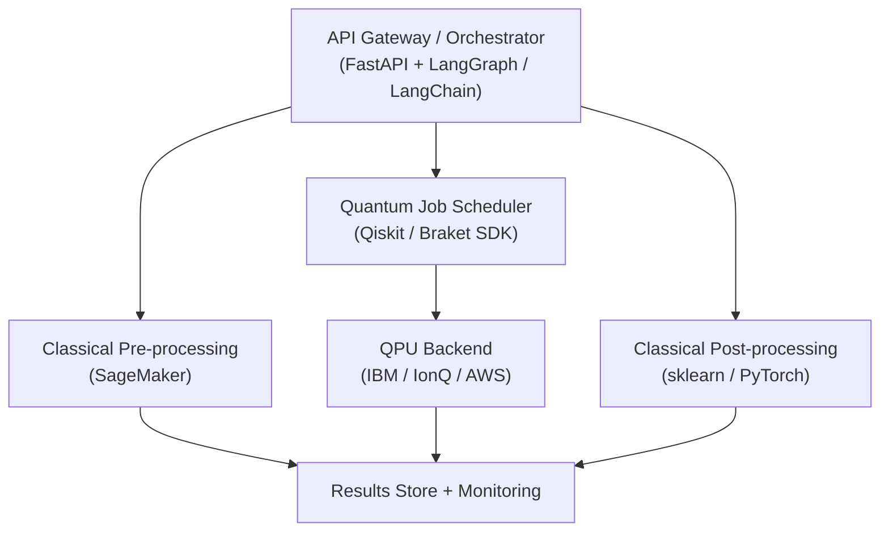
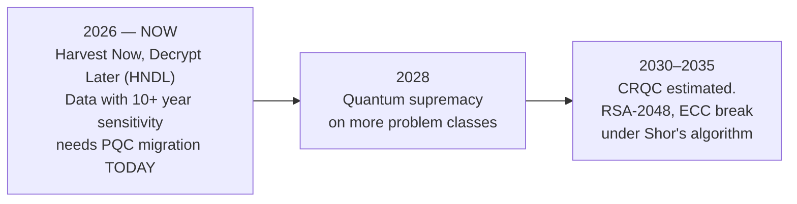

# Quantum AI Architecture

**Weeks 9–12 · Principal Architect Track**

Continues from [Part 2: Quantum AI Applications](./02-quantum-ai-applications.md).

---

## Phase 3 — Mastery &amp; Quantum Architecture

### Week 9: Enterprise Quantum Architecture Patterns

#### The Hybrid Quantum-Classical Stack

| Layer | Components | Architect's Responsibility |
| ------- | ------------ | --------------------------- |
| **Application** | Business logic, API, UI | Problem formulation, quantum ROI |
| **Orchestration** | Job scheduler, workflow engine | Circuit queuing, hybrid execution |
| **Quantum Runtime** | Transpiler, error mitigation, sampler | Backend selection, shot budgets |
| **Classical Compute** | GPU cluster, CPU optimiser | Classical-quantum data handoff |
| **Quantum Hardware** | QPU (IBM/Google/IonQ/QuEra) | Hardware benchmarking, topology matching |

#### Reference Architecture: Hybrid Quantum-Classical ML Pipeline



#### Key Architectural Decisions

**Problem Suitability Checklist**

- Is the problem classically intractable at target scale?
- Does it map to optimisation, quantum chemistry, or kernel learning?
- Can input data be efficiently encoded as quantum states?
- Is the quantum output classically interpretable?
- Does the circuit depth fit within hardware coherence time?

**Hardware Selection Matrix**

| Requirement | Best Choice | Why |
| ------------- | ------------ | ----- |
| High gate fidelity | IonQ / Quantinuum | Trapped-ion all-to-all connectivity |
| Large qubit count | IBM (433Q Eagle) | Superconducting scalability |
| QML research | PennyLane + any backend | Hardware-agnostic autodiff |
| Multi-provider comparison | AWS Braket | IonQ + Rigetti + QuEra + OQC |
| Microsoft ecosystem | Azure Quantum | Q# + Qiskit + credits programme |
| Quantum networking | QuEra | Neutral-atom reconfigurable topology |

---

### Week 10: Quantum Cloud Platforms &amp; SDK Deep Dive

| Platform | Qubits | SDK | Pricing | Best For |
| ---------- | -------- | ----- | -------------- | ---------- |
| **IBM Quantum** | 127–433Q | Qiskit v1.x | Free + Premium | Ecosystem maturity, Qiskit Runtime |
| **Google Quantum AI** | 105Q Willow | Cirq | Partnership only | Error correction research |
| **AWS Braket** | Multi-provider | braket-sdk | Pay-per-shot | Multi-provider, SageMaker integration |
| **Azure Quantum** | Multi-provider | Q# / Qiskit | Credits + PAYG | Microsoft stack, hybrid HPC |
| **NVIDIA CUDA-Q** | GPU-simulated + QPU | CUDA-Q | Open source | GPU-accelerated simulation |
| **Quantinuum** | Trapped-ion | TKET + Qiskit | Managed cloud | Circuit compilation &amp; optimisation |
| **PennyLane** | Framework-agnostic | PennyLane | Open source | QML, autodiff, hardware-agnostic |

**Circuit Portability:** Most deployments write circuits in **OpenQASM** (vendor-neutral circuit format) and compile with **TKET**, which retargets a single circuit's gate set and qubit layout across IBM, IonQ, Quantinuum, and Rigetti backends without a rewrite.

```python
# SDK-agnostic design with PennyLane — switch backend in one line
import pennylane as qml

# Local sim
dev = qml.device("default.qubit", wires=4)

# Switch to IBM
# dev = qml.device("qiskit.ibmq", wires=4, backend="ibm_nairobi")

# Switch to AWS Braket
# dev = qml.device("braket.aws.qubit", device_arn="...", wires=4)

@qml.qnode(dev)
def circuit(x):
    qml.AngleEmbedding(x, wires=range(4))
    qml.StronglyEntanglingLayers(weights, wires=range(4))
    return qml.expval(qml.PauliZ(0))
```

---

### Week 11: Post-Quantum Security &amp; Compliance

#### The Quantum Threat Timeline



#### Post-Quantum Cryptography vs. Quantum Key Distribution

These solve the same threat with fundamentally different mechanisms:

| | Post-Quantum Cryptography (PQC) | Quantum Key Distribution (QKD) |
| --- | --- | --- |
| **Mechanism** | Classical math believed hard for quantum computers (lattices, hashes) | Physics: measuring a quantum state disturbs it, so eavesdropping is detectable |
| **Infrastructure** | Software upgrade — new algorithms on existing networks | New hardware — dedicated fibre, distance-limited |
| **Standardisation** | NIST FIPS 203–206 (final 2024-2026) | No equivalent global standard; niche deployments |
| **Migration path** | The checklist below | Specialised, high-assurance point-to-point control |

**Cryptographic agility** — swapping a cryptographic algorithm without re-architecting — is the governance discipline that makes PQC migration tractable at enterprise scale.

#### NIST Post-Quantum Standards — 2025/2026 Status

| Standard | Algorithm | Use Case | Status |
| ---------- | ----------- | ---------- | ------- |
| **FIPS 203** | ML-KEM (Kyber) | Key encapsulation | **Final (2024)** |
| **FIPS 204** | ML-DSA (Dilithium) | Digital signatures | **Final (2024)** |
| **FIPS 205** | SLH-DSA (SPHINCS+) | Digital signatures | **Final (2024)** |
| **FIPS 206** | FN-DSA (Falcon) | Digital signatures | Finalising 2026 |

**Deployment reality (July 2026):**
- **Microsoft** shipped GA ML-DSA support in Active Directory (May 2026).
- **Browsers &amp; CDN vendors** offer experimental hybrid TLS in 2025.
- **US Executive Order EO-14412** mandates government PQC migration with binding deadlines for high-value assets.
- **Enterprise adoption**: Only 5% deployed PQC as of May 2025; ~40% actively transitioning.

```python
# PQC implementation using liboqs (Open Quantum Safe)
import oqs

# ML-KEM key encapsulation
with oqs.KeyEncapsulation("ML-KEM-768") as kem:
    public_key = kem.generate_keypair()
    ciphertext, shared_secret_server = kem.encap_secret(public_key)
    shared_secret_client = kem.decap_secret(ciphertext)

assert shared_secret_server == shared_secret_client
```

**PQC Migration Checklist**

- Crypto inventory: classify all algorithms (vulnerable: RSA, ECC, DH vs safe: AES-256, SHA-3)
- Identify data with &gt;10 year sensitivity — prioritise for immediate migration
- Implement hybrid TLS 1.3 (classical + PQC in parallel)
- Update certificate infrastructure to Dilithium/Falcon signatures
- Build a cryptographic agility layer for future algorithm swaps
- Map compliance: NIST SP 800-208, NSA CNSA 2.0, EU Quantum Flagship

---

### Week 12: Capstone — Full Quantum AI System Design

Choose one of four tracks for your portfolio capstone:

**Option A: Drug Discovery** — VQE-Based Molecular Energy Estimation Pipeline. Molecule encoding, VQE with UCCSD ansatz, error mitigation, classical ML wrapper. Target: energy estimate within 5% of classical FCI on H₂, LiH.

**Option B: Portfolio Optimisation** — QAOA Quantum Portfolio Optimiser. 10-asset Markowitz optimisation, quantum covariance estimation, classical solver comparison, REST API deployment with AWS Braket. Target: QAOA within 10% of classical optimal.

**Option C: Quantum NLP** — QNLP Text Classification System. DisCoCat parsing with lambeq, quantum circuit generation, 4-class news classification, quantum vs classical accuracy comparison. Target: &gt;75% accuracy.

**Option D: Custom Domain** — Architect's choice in your industry. Must include problem formulation with quantum advantage justification, algorithm selection with alternatives, hybrid architecture diagram, error mitigation strategy, and hardware platform selection with cost model.

---

## Continue the Series

| Part | Covers |
| --- | --- |
| [Part 1 — Foundations](./01-quantum-ai-foundations.md) | Weeks 1–4 |
| [Part 2 — Applications](./02-quantum-ai-applications.md) | Weeks 5–8 |
| Part 3 (this page) | Weeks 9–12: Enterprise architecture, cloud platforms, post-quantum security |
| [Part 4 — Appendices](./04-quantum-ai-appendices.md) | Mathematics reference, use cases, agentic AI, careers, tooling, industry landscape |

**Next:** continue to [Part 4 — Quantum AI Appendices](./04-quantum-ai-appendices.md) for reference material, real-world solution designs, career roadmap, and industry landscape.
