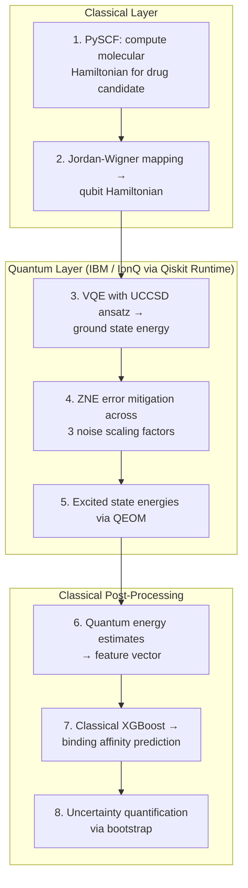
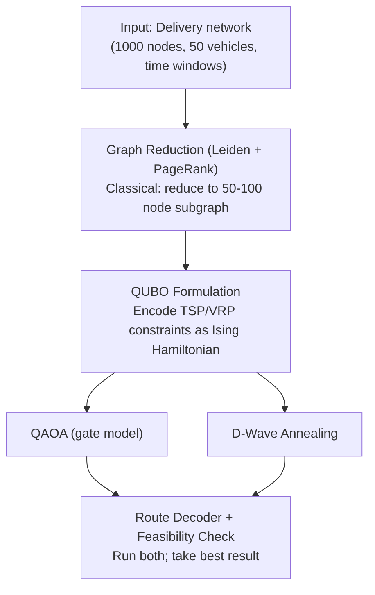
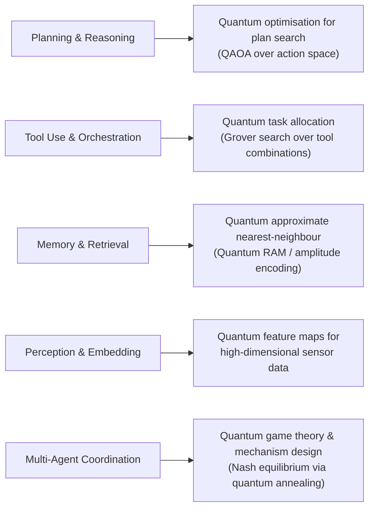

# Quantum AI Appendices: Mathematics, Use Cases & Agentic Integration

**Reference &amp; Industry Landscape · Principal Architect Track**

Continues from [Part 3: Quantum AI Architecture](./03-quantum-ai-architecture.md).

---

## Appendix A — Mathematics Reference

<details>
<summary><strong>Complex Numbers</strong></summary>

Quantum amplitudes are complex. Key identities:
- `|z|² = probability`
- `z = a + bi`
- `e^{iθ} = cosθ + i·sinθ` (Euler's formula)
- Phase `e^{iθ}` does not affect measurement probability but is critical for interference

</details>

<details>
<summary><strong>Linear Algebra &amp; Hilbert Spaces</strong></summary>

- A **Hilbert space** is a complete complex vector space equipped with an inner product ⟨·|·⟩. Every valid quantum state is a unit vector in one: a single qubit lives in the 2-dimensional Hilbert space ℂ²; n qubits live in the 2ⁿ-dimensional tensor-product Hilbert space (ℂ²)^⊗ⁿ.
- Quantum operations are **unitary matrices** (U†U = I — always reversible).
- Eigenvalues and eigenvectors are the language of measurement.
- Inner product `⟨φ|ψ⟩` is a probability *amplitude*; its squared modulus is a probability.

**Worked example:** what is the probability of preparing `|+⟩ = (|0⟩+|1⟩)/√2` and measuring the outcome associated with `|0⟩`?

```
⟨0|+⟩ = ⟨0| · (|0⟩+|1⟩)/√2 = (⟨0|0⟩ + ⟨0|1⟩)/√2 = (1 + 0)/√2 = 1/√2
P(0) = |⟨0|+⟩|² = |1/√2|² = 1/2
```

This calculation underlies every measurement statistic in this series, from the Bell state in Part 1, Week 2 to the QAOA output in Part 2, Week 6.

</details>

<details>
<summary><strong>Tensor Products</strong></summary>

Multi-qubit states live in tensor product spaces:
- `|ψ⟩ ⊗ |φ⟩ = |ψφ⟩`
- An n-qubit system has a **2ⁿ-dimensional state space**
- Entangled states **cannot** be written as a single tensor product — formal definition of entanglement

**Worked example:** the Bell state `(|00⟩+|11⟩)/√2` cannot be factored as `|a⟩⊗|b⟩` for any single-qubit states. This impossibility is entanglement's signature.

</details>

<details>
<summary><strong>Bloch Sphere Geometry</strong></summary>

`|ψ⟩ = cos(θ/2)|0⟩ + e^{iφ}sin(θ/2)|1⟩`. This parametrisation explains why single-qubit gates are "rotations" — every unitary in SU(2) corresponds to a literal rotation of the (θ,φ) point on the sphere's surface, and gate sequences compose exactly the way rotations do (order matters; rotations about different axes don't commute).

</details>

<details>
<summary><strong>Fourier &amp; Optimisation</strong></summary>

- QFT: O(n²) vs classical FFT O(n·2ⁿ) — underlies Shor's and phase estimation
- Gradient-based optimisers: ADAM / SGD via **parameter shift rule**
- Gradient-free: COBYLA, Nelder-Mead, SPSA (better under hardware noise)

</details>

---

## Appendix B — Real-World Use Cases &amp; Solution Designs

### Use Case 1: Pharmaceutical — Drug-Target Binding Prediction

**Problem:** Simulating molecular interactions for drug discovery is classically intractable beyond ~50 atoms.

**Quantum Solution Design:**



**Organisations using this today:** Roche + IBM Quantum, Quantinuum + Mimetica (protein folding), Biogen + Accenture Quantum.

**Expected quantum advantage:** 2027–2030 for molecules &gt;100 atoms requiring &gt;50 logical qubits.

---

### Use Case 2: Financial Services — Portfolio Optimisation at Scale

**Problem:** Markowitz optimisation for 1000+ assets has O(N²) to O(N³) classical complexity. Daily rebalancing is computationally bottlenecked.

**Quantum Solution Design:**

```python
# Quantum Portfolio Optimiser — QAOA approach
from qiskit_finance.applications.optimization import PortfolioOptimization
from qiskit_optimization.algorithms import MinimumEigenOptimizer
from qiskit.algorithms import QAOA

# 1. Formulate as QUBO (Quadratic Unconstrained Binary Optimisation)
portfolio = PortfolioOptimization(
    expected_returns=mu,
    covariances=sigma,
    risk_factor=0.5,
    budget=10  # select 10 of N assets
)
qp = portfolio.to_quadratic_program()

# 2. QAOA solve
qaoa = QAOA(sampler=sampler, optimizer=COBYLA(), reps=3)
optimizer = MinimumEigenOptimizer(qaoa)
result = optimizer.solve(qp)

# 3. Classical post-processing
optimal_weights = portfolio.interpret(result)
```

**Production reference:** D-Wave powers portfolio optimisation for 135+ enterprise clients. IonQ Q1 2026 revenue grew 755% YoY to $64.7M — financial services is the leading sector.

---

### Use Case 3: Logistics — Supply Chain Route Optimisation

**Problem:** Combinatorial explosion in vehicle routing: N cities = N! routes. Classical heuristics miss optimal by 5–20% at enterprise scale.

**Quantum Solution Design:**



**Reference implementation:** Multiverse Computing's CompactifAI delivers quantum-inspired tensor network solutions for logistics, achieving ~100M EUR ARR by Jan 2026 entirely on classical hardware — proving the market exists before fault-tolerant QPUs arrive.

---

## Appendix C — Quantum × Agentic AI

The intersection of quantum computing and agentic AI is the most forward-looking part of this field. Here is a structured map of where these two domains converge.

### Integration Architecture



### Quantum-Enhanced Memory for Agents

The Hopfield network (classical associative memory) has a quantum generalisation that stores exponentially more patterns:

- **Classical Hopfield:** stores ~0.14N patterns for N neurons
- **Quantum Hopfield:** stores ~2^(N/2) patterns — exponential improvement

This matters for agents with large episodic memory stores needing fast pattern recall.

### MCP + Quantum: Exposing QPU as a Tool

Quantum computers can be exposed as tools within the Model Context Protocol, making QPU execution available to any MCP-compatible agent:

```python
# Quantum MCP Tool — expose VQE solver as agent-callable tool
from mcp import Server, Tool

@server.tool("quantum_vqe_solve")
async def vqe_solve(molecule_smiles: str, basis_set: str = "sto-3g") -> dict:
    """Compute ground state energy of a molecule using VQE on IBM Quantum."""
    # ... Qiskit Runtime VQE execution
    return {"energy_hartree": result.eigenvalue, "shots_used": shots}
```

---

## Next Steps

Continue to [Part 4b — Quantum AI Appendices: Career Paths, Tooling & Industry Landscape](./parts/04-quantum-ai-appendices-part2.md) for career guidance, tooling recommendations, and the industry landscape overview.
