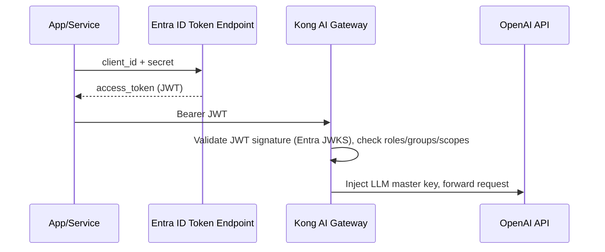
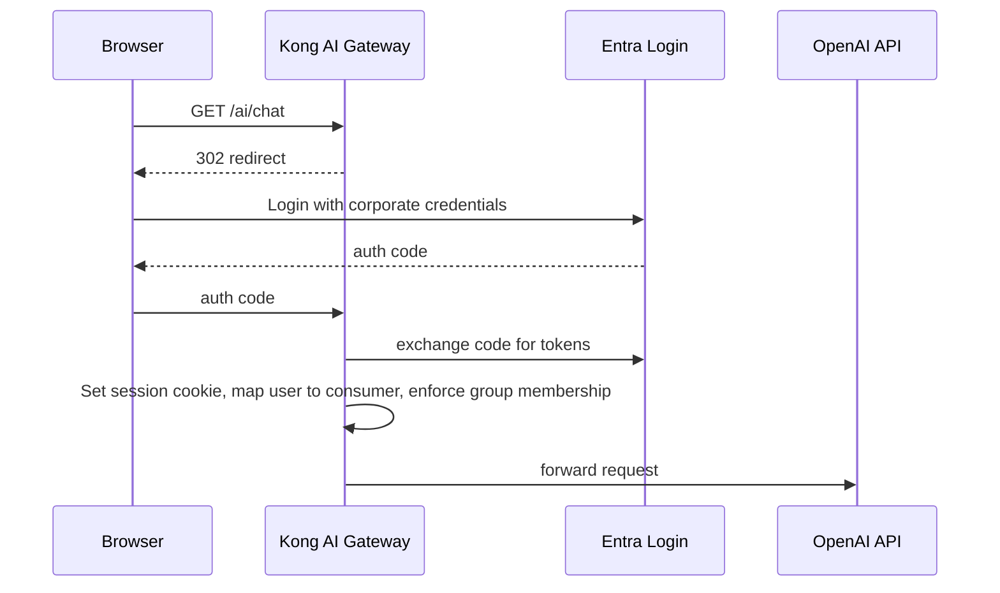
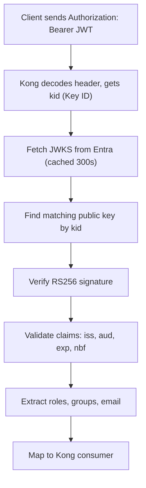

# Kong AI Gateway — Microsoft Entra ID Integration

## Complete End-to-End Guide

---

## Table of Contents

1. [Overview & Architecture](#1-overview--architecture)
2. [Entra ID App Registration](#2-entra-id-app-registration)
3. [OAuth 2.0 Client Credentials Flow (M2M)](#3-oauth-20-client-credentials-flow-m2m)
4. [Authorization Code Flow (User Login / SSO)](#4-authorization-code-flow-user-login--sso)
5. [JWT / Bearer Token Validation](#5-jwt--bearer-token-validation)
6. [OIDC Plugin Full Configuration](#6-oidc-plugin-full-configuration)
7. [Group & Role Mapping to Kong ACL](#7-group--role-mapping-to-kong-acl)
8. [Per-Consumer Auto-Provisioning from Entra ID](#8-per-consumer-auto-provisioning-from-entra-id)
9. [Conditional Access & MFA Enforcement](#9-conditional-access--mfa-enforcement)
10. [Multi-Tenant Entra ID Setup](#10-multi-tenant-entra-id-setup)
11. [Token Introspection & Revocation](#11-token-introspection--revocation)
12. [Managed Identity for Kong on Azure](#12-managed-identity-for-kong-on-azure)
13. [Troubleshooting Entra ID Auth Issues](#13-troubleshooting-entra-id-auth-issues)
14. [Complete Working Reference Config](#14-complete-working-reference-config)

---

## 1. Overview & Architecture

Microsoft Entra ID (formerly Azure Active Directory) becomes the **single source of truth** for identity. Kong AI Gateway enforces authentication and authorization using tokens issued by Entra, then injects the LLM master credential upstream — clients never touch the raw OpenAI/Anthropic key.

```



```

### Key Entra ID Concepts Used

| Concept | Role in Kong Integration |
| --- | --- |
| **App Registration** | Represents Kong in Entra ID; defines scopes and roles |
| **Client Credentials** | M2M auth — services authenticate as the app itself |
| **Authorization Code** | User SSO — humans log in with corporate accounts |
| **App Roles** | Map to Kong ACL groups (e.g., `AI.Premium`, `AI.Free`) |
| **Groups** | Entra security groups -> Kong consumer groups |
| **JWKS URI** | Kong validates token signatures without calling Entra on every request |
| **Managed Identity** | Azure-hosted Kong authenticates to Entra without any stored secret |

---

## 2. Entra ID App Registration

Every integration starts with registering Kong AI Gateway as an application in Entra ID.

### Step 1: Create the App Registration

Via Azure Portal:

```
Azure Portal -> Microsoft Entra ID -> App registrations -> New registration

Name:           Kong AI Gateway
Supported types: Accounts in this organizational directory only (Single tenant)
Redirect URI:   Web -> https://your-kong-domain.com/ai/callback
```

Via Azure CLI:

```bash
# Login to Azure
az login

# Create the app registration
az ad app create \
  --display-name "Kong AI Gateway" \
  --sign-in-audience "AzureADMyOrg" \
  --web-redirect-uris "https://kong.company.com/ai/callback" \
  --identifier-uris "api://kong-ai-gateway"

# Capture the IDs
APP_ID=$(az ad app list --display-name "Kong AI Gateway" --query "[0].appId" -o tsv)
TENANT_ID=$(az account show --query tenantId -o tsv)

echo "App (Client) ID: $APP_ID"
echo "Tenant ID:       $TENANT_ID"
```

### Step 2: Create a Client Secret

```bash
# Create a client secret (valid for 2 years)
CLIENT_SECRET=$(az ad app credential reset \
  --id $APP_ID \
  --years 2 \
  --query password -o tsv)

echo "Client Secret: $CLIENT_SECRET"
# Store this in your vault — it won't be shown again
```

### Step 3: Define App Roles (Maps to Kong ACL Groups)

```bash
# Add App Roles via Azure CLI
az ad app update --id $APP_ID --app-roles '
[
  {
    "allowedMemberTypes": ["Application", "User"],
    "description": "Access to all AI models including GPT-4o and Claude",
    "displayName": "AI Premium",
    "id": "11111111-1111-1111-1111-111111111111",
    "isEnabled": true,
    "value": "AI.Premium"
  },
  {
    "allowedMemberTypes": ["Application", "User"],
    "description": "Access to standard AI models (GPT-4o-mini)",
    "displayName": "AI Standard",
    "id": "22222222-2222-2222-2222-222222222222",
    "isEnabled": true,
    "value": "AI.Standard"
  },
  {
    "allowedMemberTypes": ["Application", "User"],
    "description": "Read-only access to AI chat",
    "displayName": "AI Free",
    "id": "33333333-3333-3333-3333-333333333333",
    "isEnabled": true,
    "value": "AI.Free"
  },
  {
    "allowedMemberTypes": ["Application", "User"],
    "description": "Full administrative access to Kong AI Gateway",
    "displayName": "AI Admin",
    "id": "44444444-4444-4444-4444-444444444444",
    "isEnabled": true,
    "value": "AI.Admin"
  }
]'
```

### Step 4: Define API Scopes (OAuth 2.0 Delegated Permissions)

```
Azure Portal ->
  App Registration (Kong AI Gateway) ->
  Expose an API ->
  Add a scope

Scope name:       ai.chat
Admin consent:    Required
Display name:     Access AI Chat
Description:      Allows calling AI chat completions through Kong gateway

Scope name:       ai.embeddings
Admin consent:    Required
Display name:     Access AI Embeddings
Description:      Allows calling AI embedding models through Kong gateway
```

### Step 5: Grant Admin Consent

```bash
# Grant admin consent for the app's own permissions
az ad app permission admin-consent --id $APP_ID
```

### Key Endpoints (Save These)

```bash
TENANT_ID="your-tenant-id"

# OpenID Connect discovery document (Kong reads this automatically)
DISCOVERY_URL="https://login.microsoftonline.com/${TENANT_ID}/v2.0/.well-known/openid-configuration"

# Token endpoint (for client credentials flow)
TOKEN_ENDPOINT="https://login.microsoftonline.com/${TENANT_ID}/oauth2/v2.0/token"

# Authorization endpoint (for user login flow)
AUTH_ENDPOINT="https://login.microsoftonline.com/${TENANT_ID}/oauth2/v2.0/authorize"

# JWKS URI (Kong uses this to validate token signatures)
JWKS_URI="https://login.microsoftonline.com/${TENANT_ID}/discovery/v2.0/keys"

# Issuer (must match iss claim in tokens)
ISSUER="https://login.microsoftonline.com/${TENANT_ID}/v2.0"
```

---

## 3. OAuth 2.0 Client Credentials Flow (M2M)

Used when **services** (not humans) call the Kong AI Gateway. No user interaction required.

### How a Client Service Gets a Token

```bash
# A backend service requests an access token from Entra ID
TOKEN_RESPONSE=$(curl -s -X POST \
  "https://login.microsoftonline.com/${TENANT_ID}/oauth2/v2.0/token" \
  -H "Content-Type: application/x-www-form-urlencoded" \
  -d "grant_type=client_credentials" \
  -d "client_id=${APP_ID}" \
  -d "client_secret=${CLIENT_SECRET}" \
  -d "scope=api://kong-ai-gateway/.default")

ACCESS_TOKEN=$(echo $TOKEN_RESPONSE | jq -r .access_token)

echo "Token: $ACCESS_TOKEN"
echo "Expires in: $(echo $TOKEN_RESPONSE | jq -r .expires_in) seconds"

# Decode and inspect the token claims
echo $ACCESS_TOKEN | cut -d. -f2 | base64 -d 2>/dev/null | jq .
```

**Decoded JWT payload looks like:**

```json
{
  "aud": "api://kong-ai-gateway",
  "iss": "https://login.microsoftonline.com/{tenant-id}/v2.0",
  "iat": 1737000000,
  "exp": 1737003600,
  "aio": "...",
  "appid": "{client-app-id}",
  "appidacr": "1",
  "idp": "https://sts.windows.net/{tenant-id}/",
  "oid": "{object-id}",
  "roles": ["AI.Premium"],
  "sub": "{subject}",
  "tid": "{tenant-id}",
  "ver": "2.0"
}
```

### Call Kong with the Entra Token

```bash
# Service calls Kong AI Gateway with the Entra access token
curl -X POST https://kong.company.com/ai/v1/chat/completions \
  -H "Authorization: Bearer ${ACCESS_TOKEN}" \
  -H "Content-Type: application/json" \
  --json '{
    "messages": [
      {"role": "system", "content": "You are a helpful assistant."},
      {"role": "user",   "content": "Summarize today'\''s sales report."}
    ]
  }'
```

### Configure Kong to Validate Client Credentials Tokens

```bash
curl -X POST http://localhost:8001/services/openai-service/plugins \
  --json "{
    \"name\": \"openid-connect\",
    \"config\": {
      \"issuer\": \"https://login.microsoftonline.com/${TENANT_ID}/v2.0/.well-known/openid-configuration\",

      \"client_id\": [\"${APP_ID}\"],
      \"client_secret\": [\"${CLIENT_SECRET}\"],

      \"auth_methods\": [\"bearer\"],

      \"bearer_token_param_type\": [\"header\"],

      \"audience_required\": [\"api://kong-ai-gateway\"],

      \"verify_claims\": true,
      \"verify_signature\": true,
      \"verify_expiry\": true,

      \"hide_credentials\": true,

      \"consumer_claim\": \"appid\",
      \"consumer_by\": [\"custom_id\"],

      \"scopes_required\": [],

      \"cache_jwks\": true,
      \"cache_jwks_ttl\": 300
    }
  }"
```

---

## 4. Authorization Code Flow (User Login / SSO)

Used when **humans** authenticate with their corporate Entra ID credentials through a browser.

### Configure Kong OIDC for User SSO

```bash
curl -X POST http://localhost:8001/services/openai-service/plugins \
  --json "{
    \"name\": \"openid-connect\",
    \"config\": {
      \"issuer\": \"https://login.microsoftonline.com/${TENANT_ID}/v2.0/.well-known/openid-configuration\",

      \"client_id\": [\"${APP_ID}\"],
      \"client_secret\": [\"${CLIENT_SECRET}\"],

      \"auth_methods\": [\"authorization_code\"],

      \"redirect_uri\": \"https://kong.company.com/ai/callback\",

      \"scopes\": [
        \"openid\",
        \"profile\",
        \"email\",
        \"api://kong-ai-gateway/ai.chat\"
      ],

      \"response_type\": \"code\",
      \"response_mode\": \"form_post\",

      \"consumer_claim\": \"email\",
      \"consumer_by\": [\"username\"],

      \"groups_claim\": \"groups\",

      \"hide_credentials\": true,

      \"session_secret\": \"CHANGE-THIS-TO-32-RANDOM-CHARS:::\",
      \"session_cookie_name\": \"kong_entra_session\",
      \"session_cookie_secure\": true,
      \"session_cookie_http_only\": true,
      \"session_cookie_same_site\": \"Lax\",
      \"session_rolling_timeout\": 3600,
      \"session_absolute_timeout\": 28800,

      \"login_action\": \"redirect\",
      \"login_redirect_uri\": [\"https://kong.company.com/ai/chat\"],
      \"logout_uri\": \"/logout\",
      \"logout_redirect_uri\": [\"https://kong.company.com/\"],
      \"logout_methods\": [\"GET\", \"POST\"],
      \"logout_revoke\": true,

      \"forbidden_redirect_uri\": [\"https://kong.company.com/access-denied\"],
      \"unauthorized_redirect_uri\": [\"https://kong.company.com/login\"]
    }
  }"
```

### Handle the Callback Route

Create a dedicated route for Entra's redirect callback:

```bash
# Kong handles the /ai/callback path automatically when using the OIDC plugin
# But you need a route that matches it
curl -X POST http://localhost:8001/routes \
  --json '{
    "name": "entra-callback",
    "paths": ["/ai/callback"],
    "methods": ["GET", "POST"],
    "service": {"name": "openai-service"}
  }'
```

### Supporting Both SSO and M2M on the Same Route

```bash
curl -X POST http://localhost:8001/services/openai-service/plugins \
  --json "{
    \"name\": \"openid-connect\",
    \"config\": {
      \"issuer\": \"https://login.microsoftonline.com/${TENANT_ID}/v2.0/.well-known/openid-configuration\",
      \"client_id\": [\"${APP_ID}\"],
      \"client_secret\": [\"${CLIENT_SECRET}\"],

      \"auth_methods\": [
        \"bearer\",
        \"authorization_code\",
        \"session\"
      ],

      \"scopes\": [\"openid\", \"profile\", \"email\"],
      \"audience_required\": [\"api://kong-ai-gateway\"],

      \"consumer_claim\": \"email\",
      \"consumer_by\": [\"username\", \"custom_id\"],

      \"hide_credentials\": true,
      \"session_cookie_name\": \"kong_entra_session\",
      \"session_secret\": \"32-char-random-secret-here::::::\"
    }
  }"
```

Kong automatically tries each `auth_method` in order:

1. Checks for a session cookie -> if valid, use it
2. Checks for a `Bearer` token in the `Authorization` header -> validate JWT
3. Falls back to authorization code redirect -> browser SSO

---

## 5. JWT / Bearer Token Validation

Kong validates Entra-issued JWTs **locally** using the JWKS endpoint — no round-trip to Entra on every request.

### How JWT Validation Works



### Using the JWT Plugin (Alternative — Manual JWKS)

If you prefer the lightweight `jwt` plugin over the full OIDC plugin:

```bash
# Step 1: Fetch Entra's public signing keys
curl -s "https://login.microsoftonline.com/${TENANT_ID}/discovery/v2.0/keys" | jq .

# Step 2: For each key in the JWKS response, create a JWT credential in Kong
# (You'd automate this — keys rotate periodically)

# Create a consumer for Entra-authenticated services
curl -X POST http://localhost:8001/consumers \
  --json '{"username": "entra-validated", "custom_id": "entra-validated"}'

# Register the Entra public key (RS256)
curl -X POST http://localhost:8001/consumers/entra-validated/jwt \
  --json "{
    \"algorithm\": \"RS256\",
    \"key\": \"https://login.microsoftonline.com/${TENANT_ID}/v2.0\",
    \"rsa_public_key\": \"-----BEGIN PUBLIC KEY-----\n...\n-----END PUBLIC KEY-----\"
  }"

# Enable JWT plugin — validate iss claim matches Entra
curl -X POST http://localhost:8001/services/openai-service/plugins \
  --json '{
    "name": "jwt",
    "config": {
      "header_names": ["Authorization"],
      "claims_to_verify": ["exp", "nbf"],
      "key_claim_name": "iss",
      "hide_credentials": true
    }
  }'
```

> **Recommendation:** Use the `openid-connect` plugin rather than the bare `jwt` plugin. The OIDC plugin handles JWKS auto-refresh, key rotation, token revocation checking, and session management automatically.

### Validating Token Claims with Pre-Function

Add custom claim validation beyond what the OIDC plugin supports out of the box:

```bash
curl -X POST http://localhost:8001/services/openai-service/plugins \
  --json '{
    "name": "pre-function",
    "config": {
      "access": [
        "-- Get the validated Entra token claims from OIDC plugin context",
        "local claims = kong.ctx.shared.authenticated_credential",
        "",
        "if not claims then",
        "  return kong.response.exit(401, {error = \"No authenticated credential\"})",
        "end",
        "",
        "-- Enforce that the token is from our specific tenant",
        "local expected_tenant = os.getenv(\"ENTRA_TENANT_ID\")",
        "if claims.tid ~= expected_tenant then",
        "  return kong.response.exit(403, {error = \"Token from unauthorized tenant\"})",
        "end",
        "",
        "-- Enforce token version is v2.0",
        "if claims.ver ~= \"2.0\" then",
        "  return kong.response.exit(403, {error = \"Token version not supported\"})",
        "end"
      ]
    }
  }'
```

---

## 6. OIDC Plugin Full Configuration

Complete reference for the `openid-connect` plugin configured for Entra ID.

```bash
curl -X POST http://localhost:8001/services/openai-service/plugins \
  --json "{
    \"name\": \"openid-connect\",
    \"config\": {

      /* -- Identity Provider ----------------------------------- */
      \"issuer\": \"https://login.microsoftonline.com/${TENANT_ID}/v2.0/.well-known/openid-configuration\",

      /* -- App Registration ------------------------------------ */
      \"client_id\": [\"${APP_ID}\"],
      \"client_secret\": [\"{vault://aws/kong/entra/client-secret}\"],
      \"client_auth\": [\"client_secret_post\"],

      /* -- Auth Methods (order = priority) --------------------- */
      \"auth_methods\": [
        \"session\",
        \"bearer\",
        \"client_credentials\",
        \"authorization_code\"
      ],

      /* -- Scopes & Audience ----------------------------------- */
      \"scopes\": [\"openid\", \"profile\", \"email\", \"api://kong-ai-gateway/ai.chat\"],
      \"audience_required\": [\"api://kong-ai-gateway\"],
      \"scopes_required\": [\"api://kong-ai-gateway/ai.chat\"],

      /* -- Token Validation ------------------------------------ */
      \"verify_claims\": true,
      \"verify_signature\": true,
      \"verify_expiry\": true,
      \"verify_nonce\": true,
      \"verify_parameters\": true,
      \"leeway\": 60,

      /* -- Consumer Mapping ------------------------------------ */
      \"consumer_claim\": \"email\",
      \"consumer_by\": [\"username\", \"custom_id\"],
      \"consumer_optional\": false,

      /* -- Groups & Roles Extraction --------------------------- */
      \"groups_claim\": \"roles\",

      /* -- JWKS Caching ---------------------------------------- */
      \"cache_jwks\": true,
      \"cache_jwks_ttl\": 300,
      \"cache_tokens\": true,
      \"cache_tokens_salt\": \"random-salt-string-here\",

      /* -- Token Introspection --------------------------------- */
      \"introspect_jwt_tokens\": false,

      /* -- Hide Credentials from Upstream --------------------- */
      \"hide_credentials\": true,

      /* -- Upstream Headers (injected after auth) -------------- */
      \"upstream_headers_claims\": [\"email\", \"oid\", \"roles\", \"tid\", \"name\"],
      \"upstream_headers_names\": [
        \"X-User-Email\",
        \"X-User-OID\",
        \"X-User-Roles\",
        \"X-Tenant-ID\",
        \"X-User-Name\"
      ],

      /* -- Session (for browser SSO) --------------------------- */
      \"session_secret\": \"{vault://aws/kong/entra/session-secret}\",
      \"session_cookie_name\": \"kong_entra_session\",
      \"session_cookie_secure\": true,
      \"session_cookie_http_only\": true,
      \"session_cookie_same_site\": \"Lax\",
      \"session_rolling_timeout\": 3600,
      \"session_absolute_timeout\": 28800,
      \"session_memcache_prefix\": \"oidc_sessions\",

      /* -- Login / Logout -------------------------------------- */
      \"redirect_uri\": \"https://kong.company.com/ai/callback\",
      \"login_action\": \"redirect\",
      \"login_redirect_uri\": [\"https://kong.company.com/ai/chat\"],
      \"logout_uri\": \"/logout\",
      \"logout_redirect_uri\": [\"https://kong.company.com/\"],
      \"logout_methods\": [\"GET\", \"POST\"],
      \"logout_revoke\": true,
      \"logout_revoke_access_token\": true,
      \"logout_revoke_refresh_token\": true,

      /* -- Error Handling -------------------------------------- */
      \"forbidden_redirect_uri\": [\"https://kong.company.com/access-denied\"],
      \"unauthorized_redirect_uri\": [\"https://kong.company.com/login\"],
      \"forbidden_error_message\": \"You do not have permission to access AI Gateway\",

      /* -- TLS ------------------------------------------------- */
      \"ssl_verify\": true,
      \"timeout\": 10000,
      \"keepalive\": true
    }
  }"
```

---

## 7. Group & Role Mapping to Kong ACL

Entra ID App Roles and Security Groups map directly to Kong ACL groups to control which AI models each user/service can access.

### Option A: Map App Roles -> Kong ACL (Recommended)

App Roles appear in the `roles` claim of the token. Configure Entra to include them:

```
Azure Portal ->
  App Registration (Kong AI Gateway) ->
  Token configuration ->
  Add optional claim ->
  Token type: Access ->
  Claim: roles ✓
```

Kong OIDC plugin extracts roles and creates the consumer in the correct group:

```bash
curl -X POST http://localhost:8001/services/openai-service/plugins \
  --json '{
    "name": "openid-connect",
    "config": {
      "groups_claim": "roles",
      "groups_required": ["AI.Free", "AI.Standard", "AI.Premium", "AI.Admin"]
    }
  }'
```

Then use Kong ACL plugin alongside to enforce per-route access:

```bash
# Premium route — only AI.Premium and AI.Admin roles
curl -X POST http://localhost:8001/routes/premium-ai/plugins \
  --json '{
    "name": "acl",
    "config": {
      "allow": ["AI.Premium", "AI.Admin"],
      "hide_groups_header": true
    }
  }'

# Standard route — AI.Standard and above
curl -X POST http://localhost:8001/routes/standard-ai/plugins \
  --json '{
    "name": "acl",
    "config": {
      "allow": ["AI.Standard", "AI.Premium", "AI.Admin"],
      "hide_groups_header": true
    }
  }'
```

### Option B: Map Entra Security Groups -> Kong ACL

Include group object IDs in the token:

```
Azure Portal ->
  App Registration ->
  Token configuration ->
  Add groups claim ->
  Select: Security groups
  Customize token properties by type:
    Access token: Group ID ✓
```

This adds the group object IDs to the `groups` claim:

```json
{
  "groups": [
    "a1b2c3d4-0000-0000-0000-111111111111",
    "e5f6g7h8-0000-0000-0000-222222222222"
  ]
}
```

Map group GUIDs to Kong ACL groups using a pre-function plugin:

```bash
curl -X POST http://localhost:8001/services/openai-service/plugins \
  --json '{
    "name": "pre-function",
    "config": {
      "access": [
        "-- Entra Group ID -> Kong ACL Group mapping",
        "local GROUP_MAP = {",
        "  [\"a1b2c3d4-0000-0000-0000-111111111111\"] = \"AI.Premium\",",
        "  [\"e5f6g7h8-0000-0000-0000-222222222222\"] = \"AI.Standard\",",
        "  [\"i9j0k1l2-0000-0000-0000-333333333333\"] = \"AI.Free\",",
        "}",
        "",
        "local groups_header = kong.request.get_header(\"X-User-Groups\") or \"\"",
        "local mapped_groups = {}",
        "",
        "for group_id in groups_header:gmatch(\"[^,]+\") do",
        "  local mapped = GROUP_MAP[group_id:match(\"^%s*(.-)%s*$\")]",
        "  if mapped then",
        "    table.insert(mapped_groups, mapped)",
        "  end",
        "end",
        "",
        "if #mapped_groups == 0 then",
        "  return kong.response.exit(403, {error = \"No AI access role assigned in Entra ID\"})",
        "end",
        "",
        "kong.request.set_header(\"X-Kong-Groups\", table.concat(mapped_groups, \",\"))"
      ]
    }
  }'
```

### Assign App Roles to Users and Service Principals

```bash
# Get the service principal ID for the app
SP_ID=$(az ad sp show --id $APP_ID --query id -o tsv)

# Assign AI.Premium role to a user
USER_OID=$(az ad user show --id alice@company.com --query id -o tsv)

az rest --method POST \
  --uri "https://graph.microsoft.com/v1.0/servicePrincipals/${SP_ID}/appRoleAssignments" \
  --body "{
    \"principalId\": \"${USER_OID}\",
    \"resourceId\": \"${SP_ID}\",
    \"appRoleId\": \"11111111-1111-1111-1111-111111111111\"
  }"

# Assign AI.Standard role to a service principal (M2M client app)
CLIENT_SP_ID=$(az ad sp show --id $CLIENT_APP_ID --query id -o tsv)

az rest --method POST \
  --uri "https://graph.microsoft.com/v1.0/servicePrincipals/${SP_ID}/appRoleAssignments" \
  --body "{
    \"principalId\": \"${CLIENT_SP_ID}\",
    \"resourceId\": \"${SP_ID}\",
    \"appRoleId\": \"22222222-2222-2222-2222-222222222222\"
  }"
```

---

*Part 1 of 2. Continued in [Part 2](parts/09-kong-entra-id-integration-part2.md).*
