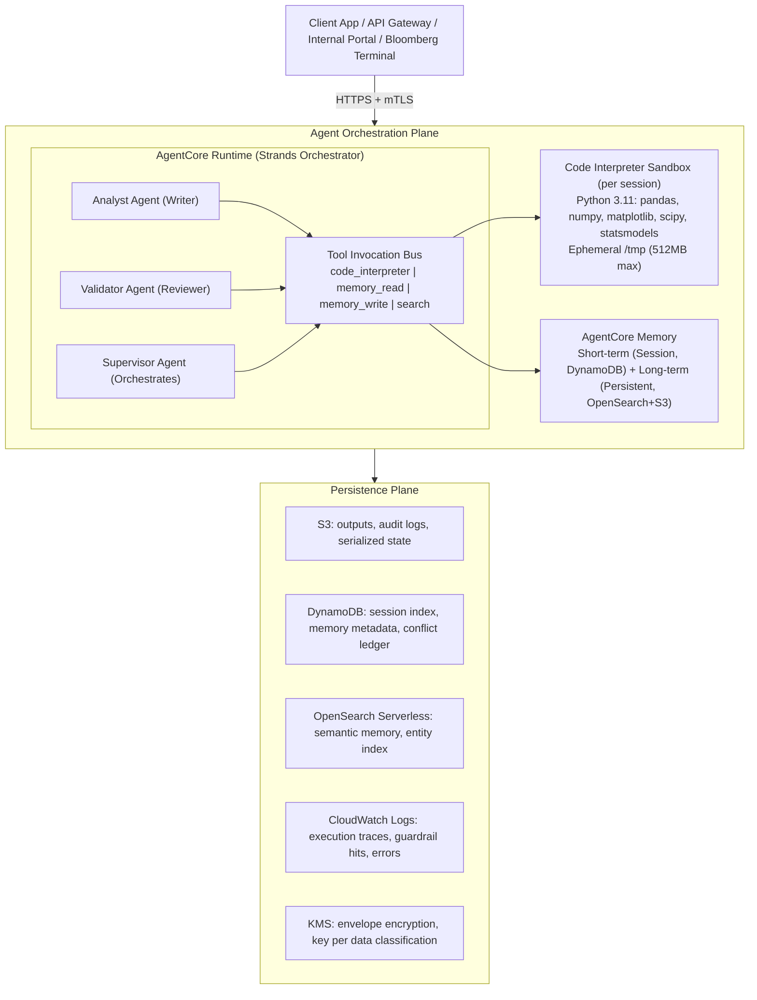
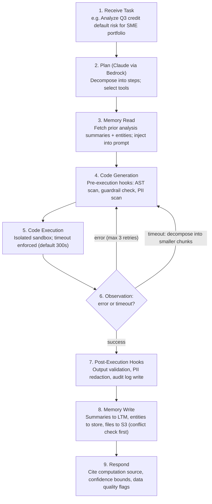

Enterprise-grade architecture for EU banking: production-ready design for Amazon Bedrock AgentCore Runtime with Code Interpreter.

## Executive Summary

### Problem Statement

EU banking institutions require AI agents capable of executing complex, multi-step quantitative analyses — portfolio risk calculations, regulatory capital computations (Basel III/IV), fraud pattern analysis, stress testing — while maintaining strict GDPR compliance, full auditability, and zero data exfiltration risk. Pre-built APIs cannot cover the combinatorial breadth of analytical tasks; traditional code execution is too rigid; and LLM-only reasoning is insufficiently precise for numerical computation.

### Strategic Decision: Code Interpreter as the Compute Primitive

Amazon Bedrock AgentCore Runtime's Code Interpreter provides a sandboxed Python execution environment embedded in the agent lifecycle. Rather than treating code execution as a bolt-on feature, this architecture treats Code Interpreter as the primary compute primitive for all quantitative reasoning, with memory as the persistence layer that gives agents continuity across sessions.

### What This Architecture Delivers

| Capability | Mechanism |
|---|---|
| Complex quantitative analysis | Code Interpreter (pandas, numpy, scipy, statsmodels) |
| Cross-session analytical continuity | AgentCore Memory + checkpointing |
| Verifiable, auditable computation | Execution trace logging → S3 + CloudWatch |
| EU data residency | eu-west-1 / eu-central-1 region pinning |
| GDPR-compliant PII handling | Pre-execution redaction + post-execution scanning |
| Multi-agent review | Writer agent → Validator agent pipeline |
| Human-in-the-loop | Step Functions approval gates on critical paths |

### Technology Stack

```
Orchestration:   Amazon Bedrock AgentCore Runtime (Strands framework)
LLM Backbone:    Claude claude-sonnet-4-20250514 (Anthropic via Bedrock)
Code Execution:  AgentCore Code Interpreter (managed sandbox, Python 3.11)
Memory Layer:    AgentCore Memory (short-term session + long-term vector/KV)
Storage:         S3 (outputs), DynamoDB (state), OpenSearch Serverless (semantic)
Observability:   CloudWatch + X-Ray + Bedrock model invocation logs
Security:        IAM least-privilege, Guardrails for Bedrock, AWS Macie, KMS
IaC:             Terraform 1.7+ with AWS provider 5.x
```

### Risk-Adjusted Architecture Posture

This architecture operates at **Risk Level: CONTROLLED-HIGH**. Code generation and execution introduce inherent risks that are mitigated through layered controls — not eliminated. The design encodes the following non-negotiable principles:

1. No generated code executes without pre-execution static analysis.
2. No output persists to memory without post-execution PII scanning.
3. No cross-agent memory write occurs without a conflict resolution check.
4. All sessions, executions, and memory operations are fully auditable.
5. Human approval gates are hardcoded for computations affecting regulatory capital, trade execution, or customer PII.

## Architecture Deep Dive

### Logical Architecture



### Runtime Architecture: Tool Invocation Lifecycle

The agent operates in a ReAct-style loop (Reason → Act → Observe) extended with a Code Interpreter refinement cycle:



### Session-Based Execution Model

AgentCore Code Interpreter operates on a session-per-conversation model:

| Property | Value | Implication |
|---|---|---|
| Session scope | One per AgentCore session | Variables persist within a conversation turn sequence |
| Isolation | Container-level (gVisor-based) | No cross-session state leakage |
| File system | Ephemeral `/tmp`, 512MB | Files must be explicitly persisted to S3 |
| Network access | DISABLED | Zero exfiltration risk via code path |
| CPU limit | 2 vCPU | Prevents runaway computation |
| Memory limit | 2GB RAM | Prevents OOM-based DoS |
| Session timeout | Configurable (default 30min idle) | Requires state checkpoint strategy |
| Library whitelist | Managed by AgentCore | No arbitrary pip install in production |

**Session reuse vs. new session trade-off:**

```python
# Session reuse: efficient but stateful risk
# When to reuse: same conversation, same user, continuous analytical workflow
# When to create new: new user, new sensitive dataset, post-error state

class SessionManager:
    """
    Opinionated session lifecycle for banking-grade code execution.
    New sessions are created for: new conversation, data classification upgrade,
    post-security-event, explicit user request.
    """

    REUSE_CONDITIONS = [
        "same_session_id",
        "same_data_classification",
        "no_security_events_in_session",
        "idle_time_under_threshold",
    ]

    NEW_SESSION_TRIGGERS = [
        "new_conversation",
        "pii_detected_in_prior_execution",
        "guardrail_triggered",
        "execution_timeout_occurred",
        "data_classification_escalated",
    ]
```

### Strands Framework Integration

The Strands framework provides the agent definition layer. Each agent is defined as a composition of tools, skills, memory accessors, and lifecycle hooks:

```python
from strands import Agent, tool, skill, hook
from strands.memory import MemoryReader, MemoryWriter
from bedrock_agentcore import CodeInterpreterClient

# Strands agent definition pattern for banking analyst agent
analyst_agent = Agent(
    name="sme_credit_analyst",
    model="us.anthropic.claude-sonnet-4-20250514-v1:0",
    system_prompt=ANALYST_SYSTEM_PROMPT,
    tools=[
        code_interpreter_tool,
        memory_read_tool,
        memory_write_tool,
        data_fetch_tool,
    ],
    hooks=[
        pre_code_execution_hook,    # AST scan + guardrail
        post_code_execution_hook,   # PII scan + audit log
        pre_memory_write_hook,      # Conflict check + classification
        post_memory_write_hook,     # Index update + notification
    ],
    memory=MemoryConfig(
        session_store="dynamodb",
        long_term_store="opensearch",
        write_policy=MemoryWritePolicy.VALIDATED_ONLY,
    ),
)
```

## Related

- [Bedrock AgentCore Code Interpreter Architecture (Part 2)](parts/19-bedrock-agentcore-code-interpreter-architecture-part2.md) — code interpreter + memory design (memory architecture layers, session state sync, data lineage, write policy, PII pipeline, summarization)
- [Bedrock AgentCore Code Interpreter Architecture (Part 3)](parts/19-bedrock-agentcore-code-interpreter-architecture-part3.md) — security & compliance, multi-agent patterns
- [Bedrock AgentCore Code Interpreter Architecture (Part 4)](parts/19-bedrock-agentcore-code-interpreter-architecture-part4.md) — cost & performance optimization, full implementation code + Terraform
- [Bedrock AgentCore Code Interpreter Architecture (Part 5)](parts/19-bedrock-agentcore-code-interpreter-architecture-part5.md) — best practices, risks & trade-offs, project roadmap, evaluation framework, ADRs
