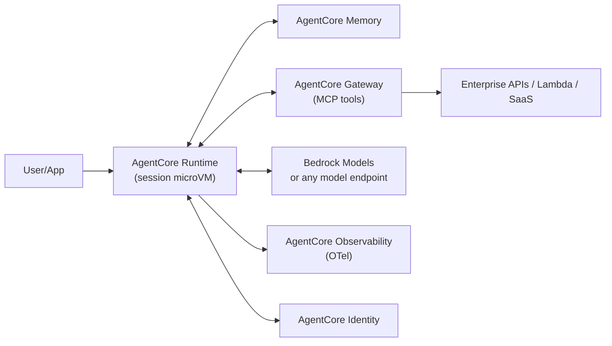

# Hyperscaler Deep Dive: AWS (2026)

> **Analyst framing:** This page synthesises AWS's strategic posture, platform architecture, inferred runtime mechanics, security model, cost levers, and competitive outlook for enterprise agentic AI.

## 3.1 Strategic Posture

AWS runs a **"neutral arms dealer + primitives"** strategy: rather than betting the platform on one frontier model, it sells (a) model choice via Bedrock (Anthropic Claude as the flagship third-party family, plus Amazon Nova, Meta, Mistral, Cohere, AI21, and others), (b) the picks-and-shovels of agent operations via Bedrock AgentCore, and (c) custom silicon (Trainium/Inferentia) to attack the NVIDIA cost curve. The multi-billion-dollar Anthropic investment plus Project Rainier-class training clusters make AWS simultaneously Anthropic's primary training partner and a distribution channel — a hedge against not owning a frontier lab outright.

**Revealed strategy signals:**

- **AgentCore's design** (protocol-agnostic, framework-agnostic, bring-any-model) shows AWS optimising for workload capture rather than model lock-in.
- **Kiro and Strands** show AWS moving up-stack into developer experience it historically ceded to third-party tooling.
- The Anthropic relationship functions as a **double hedge**: AWS gets preferred access to frontier-model training runs and a branded showcase model while simultaneously supporting all rival model families on Bedrock.

## 3.2 Platform Components

| Component | Role | Analyst Read |
| --- | --- | --- |
| **Bedrock** | Managed multi-model inference: serverless invocation, provisioned throughput, fine-tuning, Guardrails, Knowledge Bases (managed RAG), model evaluation | The control point: unified API + IAM + PrivateLink is the enterprise moat, not the catalogue |
| **Bedrock AgentCore** | Agent operations suite: Runtime (serverless, session-isolated execution), Memory (short/long-term), Gateway (tools→MCP), Identity, Code Interpreter, Browser, Observability | AWS's application-server play for agents; deliberately framework/model agnostic |
| **Strands Agents** | Open-source, model-driven agent SDK (code-first, MCP-native, A2A support, multi-agent primitives) | The "on-ramp" OSS; pairs with AgentCore the way SDK pairs with runtime |
| **Kiro** | Agentic IDE built around spec-driven development (requirements → design → tasks) and hooks | AWS's answer to Cursor/Claude Code-era DevEx; specs-as-artifact is a governance-friendly differentiator |
| **Firecracker** | MicroVM monitor (KVM-based) powering Lambda/Fargate-class isolation | The isolation substrate that makes per-session agent sandboxing economically viable |
| **SageMaker (AI)** | Training, tuning, hosting, MLOps; repositioned around HyperPod for large-scale training | Now the "builder/trainer" tier below Bedrock's "consumer" tier |
| **ECS / EKS / Lambda** | General compute substrates for self-managed agent stacks | EKS increasingly hosts DIY agent runtimes; Lambda for event-driven tool execution |
| **Step Functions / EventBridge** | Durable orchestration and eventing | The pre-LLM orchestration spine; now used for human-approval loops and agent workflow durability |
| **IAM / Verified Permissions (Cedar)** | AuthN/Z; Cedar policy language for fine-grained authorisation | Cedar is quietly strategic: policy-as-code for agent authorisation |

## 3.3 Reverse-Engineering AgentCore Runtime

### Execution Model (Inferred)

**Session-scoped microVM isolation.** Each user session gets a dedicated, isolated execution environment (Firecracker-class microVM), with session affinity: subsequent invocations with the same session ID route to the same environment, preserving in-memory state.

**Long-running, asynchronous execution.** Support for multi-hour agent tasks (documented up to ~8-hour class runtimes) breaks the Lambda 15-minute paradigm — a deliberate architectural admission that agents are stateful, long-horizon processes, not request/response functions.

**Lifecycle:**
1. Cold-start microVM provision
2. Agent container/image boot
3. Session state hydrate (Memory)
4. Event loop: model calls ↔ tool calls via Gateway
5. Checkpoint/persist
6. Idle timeout → teardown with session snapshot semantics

**Consumption-based pricing** on CPU/memory-seconds rather than provisioned capacity signals high-density multi-tenant packing of microVMs (the Firecracker economic playbook from Lambda, applied to agents).

**Protocol posture:** MCP for tools (Gateway converts existing APIs/Lambdas to MCP servers), A2A support for inter-agent communication; model- and framework-agnostic (LangGraph, CrewAI, Strands, custom).

### Memory Architecture

Split **short-term** (conversation/session) vs. **long-term** (extracted facts/preferences, cross-session) memory with managed extraction — AWS productised the memory-pipeline pattern (event → summarisation/extraction → vector+structured store → retrieval) that teams previously hand-built.

### Identity

AgentCore Identity introduces **agent-scoped identities** and delegated access to tools with token vaulting — an early answer to the "agents need their own principals, not borrowed user tokens" problem. Integration trajectory: IAM Identity Center + Cedar.

## 3.4 Security Architecture

| Layer | Mechanism |
| --- | --- |
| **Isolation** | MicroVM-per-session as the primary tenancy boundary; VPC integration and PrivateLink for private model/tool paths |
| **Policy** | IAM for coarse-grain; Cedar (Verified Permissions) emerging for fine-grained, auditable agent authorisation; Bedrock Guardrails for content/PII/grounding checks at the model boundary |
| **Data posture** | Regional processing commitments, no customer-data training defaults on Bedrock, CMK encryption; strong story for regulated industries |

**Key differentiator:** Firecracker microVM isolation gives AWS the strongest per-session compute boundary among the three hyperscalers — each agent session is hardware-isolated, not container-isolated.

## 3.5 Cost Optimisation Levers

| Lever | Mechanism |
| --- | --- |
| **Model routing** | Nova/Haiku-class for high-volume steps; frontier models for planning/critical reasoning — via Bedrock intelligent routing or gateway-level policy |
| **Prompt caching** | Reduces repeated-prefix token costs for long-context agent loops |
| **Batch inference** | Asynchronous workloads on Bedrock Batch at discounted rates |
| **Trainium/Inferentia** | For owned-model serving; provisioned throughput arbitrage for steady-state |
| **AgentCore vs. self-managed** | Crossover analysis: AgentCore consumption pricing is efficient at bursty/variable load; EKS self-managed wins at sustained high utilisation — see [Enterprise AI Commercial Analysis](../strategy/09-enterprise-ai-commercial-analysis-2026.md) |

## 3.6 SWOT

| | |
| --- | --- |
| **Strengths** | Enterprise install base + IAM/network integration; Firecracker isolation economics; Anthropic partnership; broadest primitives portfolio |
| **Weaknesses** | Fragmented DevEx (many overlapping services); no in-house frontier model at the very top; late to polished agent UX |
| **Opportunities** | AgentCore as the default enterprise agent runtime; Cedar as agent-policy standard; agentic migration/modernisation services (Transform) |
| **Threats** | Azure's Microsoft-365 gravity; Google's price/performance integration; OpenAI multi-cloud diversification reducing Azure exclusivity and AWS's Anthropic hedge value |

## 3.7 Roadmap Outlook (Analyst Projection)

Expect:

- **Deeper A2A/MCP governance** — tool allow-listing, egress policy, agent-to-agent trust chains
- **Agent identity GA and IAM convergence** — AgentCore Identity merging with IAM Identity Center
- **Marketplace distribution** of third-party agents/tools with revenue share
- **Tighter Kiro↔AgentCore loop** — spec → deployed agent workflow in a single IDE surface
- **Trainium-based price offensives** on inference, targeting NVIDIA TCO-sensitive workloads
- **Multi-region agent durability** — cross-region session failover for enterprise SLA requirements

## Related

- [AWS Strands & Bedrock AgentCore — Advanced Patterns v3.0](12-aws-strands-agentcore-advancedpatterns.md) — hooks, HITL, checkpointing, and expert multi-agent patterns built on this runtime.
- [AWS-Native, Standards-First Agentic Platform Architecture](11-aws-native-standards-first-agentic-architecture.md) — MCP/A2A integration patterns on the same platform.
- [Agent Identity: Entra vs AWS AgentCore](../protocols/06-agent-identity-entra-vs-awsagentcore.md) — cross-cloud identity comparison.
- [Enterprise AI Commercial Analysis 2026](../strategy/09-enterprise-ai-commercial-analysis-2026.md) — cost/FinOps framework referenced in the cost-levers section above.
