# Azure AI Agent Architecture — Production Grade

A phased, Azure-native reference architecture for a production agent system: orchestration, gateway/identity, guardrails, multi-agent execution, memory/RAG, model routing, RAI traceability, MLOps feedback, and enterprise resilience — delivered across three phases with cross-cutting platform services applied throughout.

## Design Review Notes

The original design review on this architecture flagged ten open gaps before it could be considered production-ready. Each is resolved by a specific element of the phased build-out below:

| Gap identified | Resolved by |
| --- | --- |
| Model Router & Knowledge Base undecided | Phase 2 — Model Routing (§Phase 2) and Knowledge Base (RAG) (§Phase 2) |
| Auth scattered across layers, no unified identity plane | Phase 1 — Unified Auth on Microsoft Entra ID (§Phase 1) |
| No Azure service bindings — components abstract, not deployable | Every layer below is bound to a named Azure service |
| HIL placement ambiguous, not wired to approval workflow | Phase 1 — HIL on Azure Logic Apps, with escalation RTO in the SLA table |
| No circuit breaker / retry policy per layer | APIM circuit breaker (Phase 1) + Plan State retry policy (Phase 2) |
| Worker Registry YAML format undefined | Phase 2 — Worker Capability Registry contract schema v1 |
| Feedback loop not operationalized into MLOps | Phase 3 — Feedback Learning pipeline (Event Hub → Azure ML) |
| No VNet / private endpoint topology | Phase 3 — Network Isolation (Private Endpoints + Azure Firewall) |
| Eval Agent Plan disconnected from CI/CD | Phase 3 — Eval Agent Framework gated in the CI pipeline |
| No SLA budget per hop | §SLA Budget Per Hop, below |

## Delivery Phases

| Phase | Focus | Duration | Goal |
| --- | --- | --- | --- |
| **Phase 1 — Foundation** | Orchestrate & secure | Weeks 1–8 (MVP) | Single-agent loop running in prod: auth, basic memory, guardrails, observability baseline |
| **Phase 2 — Intelligence & Scale** | Multi-agent + RAG | Weeks 9–16 | Worker registry live, model routing decided, long-term memory + RAG, multi-agent execution |
| **Phase 3 — Enterprise & Governance** | RAI, MLOps, resilience | Weeks 17–24 | Full RAI traceability, feedback-driven retraining, chaos tested, multi-tenant, compliance-ready |

**Cross-cutting, all phases:** Microsoft Entra ID · Azure Monitor + App Insights · Azure Key Vault · Azure Policy · Private Endpoints + VNet · AI Content Safety · GitHub Actions CI/CD · Defender for Cloud.

## Phase 1: Foundation — Orchestrate & Secure

### Orchestration Layer

| Component | Azure Service | Description | Properties |
| --- | --- | --- | --- |
| **Prompt + Hosted Agent** | Azure Container Apps | Stateless orchestration host (Semantic Kernel or LangChain). Auto-scales 0→N. Revision-based deployments for zero-downtime rollout. | stateless, KEDA-scaled, managed identity |
| **Short-Term Memory** | Azure Cache for Redis | Single-session context window. TTL = session lifetime (default 30 min). JSON serialized. | per-session key isolation, TTL-evicted |
| **HIL — Human in the Loop** | Azure Logic Apps | Approval gates for high-risk actions. Logic Apps Standard with approval email + Teams card. Timeout = 4h → auto-escalate or reject. | async-gate, timeout-policy |

### Gateway & Identity

| Component | Azure Service | Description | Properties |
| --- | --- | --- | --- |
| **AI Gateway** | Azure APIM | Single ingress for all LLM calls. Rate limiting, token quota, retry policies, semantic caching. Backends: Azure OpenAI (primary) + fallback. | rate-limit, token-quota, semantic-cache |
| **Unified Auth** | Microsoft Entra ID | Managed Identity for all service-to-service calls. OAuth2/OIDC for user-facing APIs. Service Principals for workers. No secrets in code — all via Key Vault references. | managed-identity, RBAC |
| **LLM Endpoint** | Azure OpenAI Service | GPT-4o as primary model. PTU (Provisioned Throughput) for latency SLA. APIM handles retry + circuit breaker on 429/503. | PTU, circuit-breaker |

### Guardrails (Baseline)

| Component | Azure Service | Description | Properties |
| --- | --- | --- | --- |
| **Content Safety** | Azure AI Content Safety | Input + output screening across hate, violence, self-harm, sexual categories. Severity thresholds configured per deployment env. Block or warn modes. | input-screen, output-screen |
| **Observability Baseline** | App Insights + Log Analytics | Distributed tracing (W3C TraceContext). Token usage per request, latency per hop, error rates. Alert rules on P95 > 5s, error rate > 2%. | W3C-trace, alerts |

## Phase 2: Intelligence & Scale — Multi-Agent + RAG

### Multi-Agent Execution

| Component | Azure Service | Description | Properties |
| --- | --- | --- | --- |
| **Worker Capability Registry** | Azure Service Bus + ACR | YAML contract schema v1 (name, version, inputs, outputs, SLA, auth-scope). Published to ACR as OCI artifacts. Discovery via Service Bus topic. Semantic versioning enforced. | YAML-contract, semver, OCI-artifact |
| **Externally Hosted Workers** | Azure Container Apps Jobs | Command-driven, not chat. Each worker: stateless, independently versioned, KEDA scaled. Receives a structured command payload, returns a typed result. | command-driven, stateless, typed-I/O |
| **MCP Tool Layer** | Azure Functions (Isolated) | MCP-compliant tool wrappers. Each tool is one Function App. Input/output schema validated via JSON Schema. 30s exec timeout; long-running tasks route to Durable Functions. | MCP-spec, schema-validated, durable |

### Memory & Knowledge

| Component | Azure Service | Description | Properties |
| --- | --- | --- | --- |
| **Long-Term Memory** | Azure Cosmos DB (NoSQL) | Multi-session persistent store. Per-user + per-agent namespacing. TTL = 90 days default. Cosmos change feed triggers indexing to AI Search. | multi-session, change-feed |
| **Knowledge Base (RAG)** | Azure AI Search + OpenAI Embeddings | Hybrid search (vector + BM25 keyword). `text-embedding-3-large` at 3072 dims. Semantic reranking enabled. Index refresh via ADF pipeline on doc change. | hybrid-search, semantic-rank, ADF-refresh |

### Model Routing (Resolved)

| Component | Azure Service | Description | Properties |
| --- | --- | --- | --- |
| **Model Router** | APIM Policy + Named Values | Routes by task_type (reasoning→o1, chat→gpt-4o, summarize→gpt-4o-mini), token budget, latency SLA, PTU availability. Fallback chain: PTU → pay-as-you-go → secondary region. | task-routing, PTU-first, region-failover |
| **Plan State & Replanning** | Azure Cosmos DB + Redis | Orchestrator persists the plan DAG to Cosmos (durable); active execution state lives in Redis (fast). Retry policy: 3 attempts with exponential backoff. Fallback = HIL escalation. | DAG-plan, retry-policy, HIL-fallback |

## Phase 3: Enterprise & Governance — RAI, MLOps, Resilience

### RAI & Traceability

| Component | Azure Service | Description | Properties |
| --- | --- | --- | --- |
| **AI Traceability — Decision** | Azure AI Foundry Tracing | Full lineage: prompt → plan → tool calls → model → output. OpenTelemetry spans with semantic conventions. Immutable audit log to Log Analytics, linked to compliance reports. | OTel-spans, immutable-log, lineage |
| **AI Traceability — Action** | Azure AI Foundry + Prompt Shields | Per-worker action logging with explainability scores. Prompt injection detection (Prompt Shields). Groundedness check on RAG outputs. Confidence thresholds trigger a review queue. | prompt-shields, groundedness, confidence-gate |
| **Explainability (RAI)** | Azure Responsible AI Dashboard | Fairness, reliability, privacy metrics dashboards. Error analysis on agent decisions. Automated red-teaming via PyRIT. Monthly RAI scorecard to stakeholders. | fairness, red-team, scorecard |

### MLOps & Feedback Loop

| Component | Azure Service | Description | Properties |
| --- | --- | --- | --- |
| **Feedback Learning** | Azure ML + Azure AI Foundry | User signals (thumbs, corrections, escalations) flow via Event Hub into an Azure ML dataset. Fine-tuning pipeline on a weekly cadence. A/B evaluation via Prompt Flow eval runs before promotion. | Event-Hub, fine-tune, A/B-eval |
| **Eval Agent Framework** | Azure ML Prompt Flow | Automated golden-set evaluation in the CI pipeline. LLM-as-judge plus deterministic metrics (F1, BLEU, groundedness). Gate: no promotion if eval score drops > 5%. Results published to an ADO dashboard. | CI-gate, LLM-judge, ADO-dashboard |

### Enterprise Resilience

| Component | Azure Service | Description | Properties |
| --- | --- | --- | --- |
| **Multi-Region Active-Active** | Azure Traffic Manager + ACA | Primary: East US 2; secondary: West Europe. Traffic Manager with health probes. Cosmos DB multi-write regions. Azure OpenAI deployments mirrored. RTO < 5 min, RPO = 0. | active-active, RTO&lt;5min, RPO=0 |
| **Network Isolation** | Private Endpoints + Azure Firewall | All PaaS services reached via Private Endpoints. Egress via Azure Firewall with FQDN allow-lists. No public internet access from agent workloads. NSG + UDR applied. | private-endpoint, zero-trust, NSG+UDR |
| **Chaos Engineering** | Azure Chaos Studio | Monthly fault injection: Azure OpenAI throttling, Redis outage, ACA pod eviction. Validates circuit breakers and fallback paths. Chaos hypotheses tracked in ADO; results feed SLA reviews. | fault-inject, circuit-breaker, monthly-run |

## Production Request Flow

```mermaid
flowchart LR
    U["User / System"] -->|API call + JWT| APIM["APIM (AI Gateway)<br/>Auth · Rate limit · Cache"]
    APIM --> CS1["Content Safety<br/>Input screening"]
    CS1 --> ORCH["Orchestrator (ACA)<br/>Intent · Plan · State"]
    ORCH -->|dispatches to workers| WR["Worker Registry<br/>Capability lookup"]
    WR --> MR["Model Router<br/>Route by task type"]
    MR --> W["Worker (ACA Jobs)<br/>Execute command"]
    W --> AOAI["Azure OpenAI / Tool<br/>Inference / API call"]
    AOAI -->|results aggregated, logged, returned| RAI["RAI Traceability<br/>Lineage + audit"]
    RAI --> CS2["Content Safety<br/>Output screening"]
    CS2 --> FB["Feedback Capture<br/>Event Hub → ML"]
    FB -->|typed response| U
```

## Guardrails — Applied at Every Boundary

- Input Content Safety
- Prompt Shields (injection)
- Schema Validation (I/O)
- Token Budget Enforcement
- Groundedness Check
- Output Content Safety
- RAI Confidence Threshold
- HIL Escalation Gate

## Worker Contract Properties

Every worker in the registry must satisfy all of the following:

- **Stateless** — no local state between invocations
- **Horizontally scalable** — KEDA or ACA autoscale
- **Independently deployable** — separate ACA revision
- **Semantically versioned** — registry contract enforced
- **Auth via Managed Identity** — no credentials in the image
- **Typed I/O schema** — JSON Schema declared in the registry YAML
- **SLA declared** — timeout + latency budget in the contract
- **OTel instrumented** — spans emitted per invocation

## SLA Budget Per Hop

| Hop | P95 Target | Notes |
| --- | --- | --- |
| APIM Gateway | < 50ms | Auth + routing overhead |
| Content Safety | < 200ms | Input + output screen |
| Orchestrator | < 500ms | Plan + dispatch (excl. LLM) |
| LLM Inference | < 8s | PTU deployment, streaming |
| Worker Execution | < 30s | Durable Functions for longer tasks |
| **E2E Agent Turn** | **< 15s** | Single-hop, streaming UX |
| Availability target | 99.9% | Multi-region active-active |
| HIL escalation RTO | < 4h | Timeout → auto-reject |

## Related

- [Hyperscaler Deep Dive: AWS (2026)](20-hyperscaler-deep-dive-aws.md) — comparable phased reference architecture for the AWS stack.
- [Agent Identity: Entra vs AWS AgentCore](../protocols/06-agent-identity-entra-vs-awsagentcore.md) — cross-cloud identity comparison relevant to the Unified Auth layer above.
- [Enterprise AI Gateway](07-enterprise-ai-gateway.md) — vendor-neutral gateway design patterns applicable to the APIM layer.
