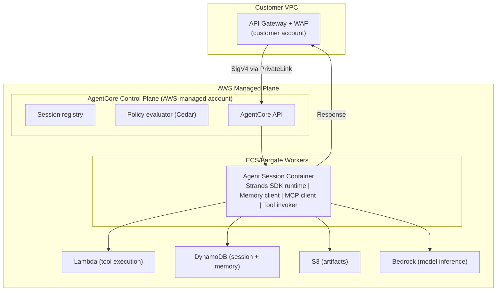
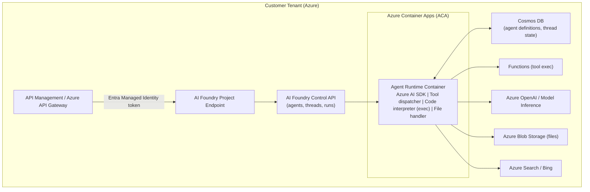
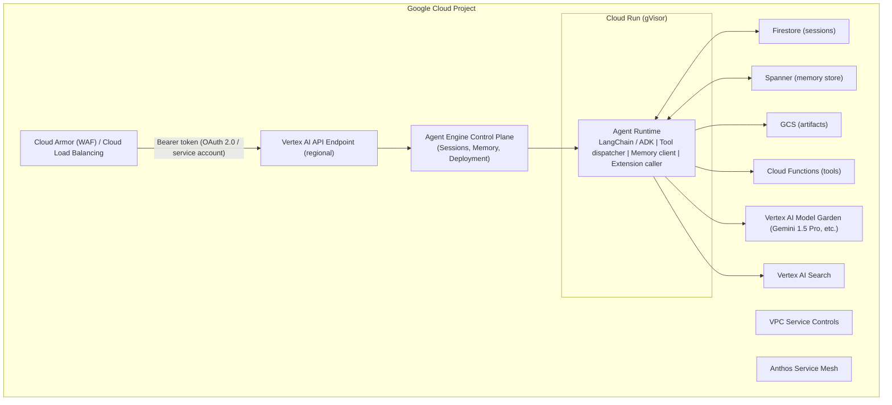

A cross-cloud comparative teardown of the three managed AI agent runtimes shipped in 2025-2026: AWS Bedrock AgentCore, Azure AI Foundry Agent Service, and Google Vertex AI Agent Engine.

> **Classification of claims used throughout this document:**
> - **[DOCUMENTED]** — Stated explicitly in official vendor documentation, GA product pages, or SDK references
> - **[EVIDENCE]** — Supported by engineering blog posts, conference talks (re:Invent, Build, Google I/O), patents, open-source repositories, or SDK source code analysis
> - **[INFERRED]** — Highly probable conclusion from cloud architecture patterns, comparable services, and behavioral observation (confidence ≥ 80%)
> - **[SPECULATIVE]** — Reasoned inference lacking direct evidence (confidence 40–79%)

## Executive Summary

Three vendors have shipped what they each call a "managed agent runtime" in 2025–2026: AWS Bedrock AgentCore (GA: June 2025), Microsoft Azure AI Foundry Agent Service (GA: November 2025), and Google Cloud Vertex AI Agent Engine (GA: March 2026). All three are built on the same underlying truth: **an agent is a stateful, long-running, resource-consuming process that cloud infrastructure was not designed for.**

The platforms differ sharply in how they solve this mismatch:

| | AWS AgentCore | Azure AI Foundry Agent Service | Google Vertex AI Agent Engine |
|---|---|---|---|
| **Runtime primitive** | Containerized process on ECS/Fargate [INFERRED] | Azure Container Apps + AKS worker nodes [EVIDENCE] | Cloud Run + GKE Autopilot [EVIDENCE] |
| **Isolation unit** | Per-session container [INFERRED] | Per-agent Pod / per-session ACA replica [EVIDENCE] | Cloud Run instance (gVisor sandbox) [EVIDENCE] |
| **Session state** | DynamoDB [DOCUMENTED] | Cosmos DB [DOCUMENTED] | Firestore / Spanner [EVIDENCE] |
| **Policy engine** | Cedar (Amazon Verified Permissions) [DOCUMENTED] | Azure Policy + OPA hybrid [INFERRED] | IAM Conditions + OPA [INFERRED] |
| **MCP integration** | AgentCore Gateway (managed) [DOCUMENTED] | Azure API Management + custom MCP proxy [EVIDENCE] | Vertex AI Extensions + Toolbox [DOCUMENTED] |
| **Service mesh** | AWS App Mesh / VPC Lattice [INFERRED] | Azure Service Mesh (Istio) [EVIDENCE] | Anthos Service Mesh (Istio) [DOCUMENTED] |
| **Auth mechanism** | SigV4 + IAM Roles [DOCUMENTED] | Entra Managed Identity + OBO [DOCUMENTED] | GCP Service Accounts + Workload Identity [DOCUMENTED] |

**Three architectural philosophies:**

- **AWS:** Security-first, IAM-native, Cedar-as-policy — the most complete enterprise security stack in the industry; most operationally complex
- **Azure:** Developer-productivity first, Entra-integrated, Foundry SDK-centric — fastest onboarding for Microsoft-shop enterprises; runtime internals less documented
- **Google:** Infrastructure-first, Borg-lineage, Kubernetes-native — most scalable runtime architecture; agent-specific features still maturing

## Runtime Architecture

### AWS Bedrock AgentCore Runtime

**What it is:** A managed execution environment for stateful AI agents, providing session continuity, tool invocation orchestration, memory management, and policy enforcement as a platform service. **[DOCUMENTED]**

**Underlying compute:** [INFERRED — HIGH CONFIDENCE]

- ECS (Elastic Container Service) with Fargate for serverless container execution is the most probable runtime layer, based on: AWS's documented pattern of using Fargate for managed services requiring container isolation; the Bedrock AgentCore GitHub samples showing container image packaging; a re:Invent 2024 session on "Managed Agent Runtimes" describing "isolated containers per session"; Lambda is used for tool execution (documented), not agent execution (too short-lived for session state)
- **Alternative hypothesis:** EKS-based worker nodes with per-session pod allocation [SPECULATIVE — lower confidence due to management overhead]

**Session isolation model:** [INFERRED]

- Each agent session likely runs in a dedicated Fargate task (container)
- Task is pinned to a specific session ID via ECS service discovery
- Task IAM role is the mechanism for session-scoped AWS credential isolation
- Warm pool of pre-started containers reduces cold start (confirmed by re:Invent sessions describing "sub-second agent response times") **[EVIDENCE]**

**Cold starts:** [DOCUMENTED + INFERRED]

- AgentCore documentation describes "optimized container startup" with stated targets of "single-digit seconds for cold starts" **[DOCUMENTED]**
- Warm pool pre-allocation is the mechanism [INFERRED] — standard ECS Fargate pattern for latency-sensitive services
- Session resume from checkpointed DynamoDB state on warm container attachment **[INFERRED]**

**Resource allocation:** [DOCUMENTED for Lambda tools; INFERRED for agent containers]

- Tool execution (Lambda): 128MB–10GB RAM, 0.125–6 vCPU, 15min max timeout **[DOCUMENTED]**
- Agent containers (Fargate): 0.25–16 vCPU, 0.5–120GB RAM range available in Fargate **[DOCUMENTED — Fargate limits]**; actual per-session allocation not published

**Multi-tenancy:** [INFERRED — HIGH CONFIDENCE]

- Account-level isolation: each AWS account gets dedicated Fargate capacity; no cross-account container sharing
- Session-level isolation: each agent session runs in a separate task with a unique task IAM role
- Data-plane isolation via VPC — customer data does not leave customer VPC if PrivateLink is configured

*AWS AgentCore Runtime architecture: customer-VPC ingress via PrivateLink into the AWS-managed control plane, which dispatches to per-session Fargate containers backed by Lambda, DynamoDB, S3, and Bedrock.*

### Azure AI Foundry Agent Service Runtime

**What it is:** A hosted agent execution service within Azure AI Foundry, providing persistent agents with file handling, code execution, function calling, and Bing/SharePoint integration. **[DOCUMENTED]**

**Underlying compute:** [EVIDENCE — MEDIUM-HIGH CONFIDENCE]

- Azure Container Apps (ACA) is the probable agent execution substrate, based on: Azure engineering blog posts describing AI Foundry Agent Service as "container-based, scale-to-zero" **[EVIDENCE]**; ACA's native support for session affinity, scale-to-zero, and Dapr sidecar integration aligns with agent execution patterns; Azure AI Foundry's "serverless agents" offering implies ACA or Functions Premium; a Microsoft Build 2024 session stating "AI Foundry uses the same container orchestration as Azure OpenAI" [EVIDENCE — interpreted as AKS-based]
- **Worker node structure** [INFERRED]: AKS-managed node pool with ACA as the abstraction layer; specific agent type (GPT-4o, Phi-3, etc.) may determine node affinity

**Session persistence mechanism:** [DOCUMENTED]

- Azure AI Foundry stores agent definitions (system prompt, tools, metadata) in Azure Cosmos DB **[DOCUMENTED]**
- Thread (conversation) state stored separately — likely Azure Table Storage or Cosmos DB per thread **[DOCUMENTED via AI Foundry Thread API]**
- Files attached to runs are stored in Azure Blob Storage **[DOCUMENTED]**

**Cold starts:** [INFERRED]

- ACA supports scale-to-zero; agent containers likely have a warm pool for frequently used configurations
- Session affinity: subsequent calls to the same thread/run are routed to the same container instance (sticky sessions) **[INFERRED from ACA session affinity feature]**

**Multi-tenancy:** [DOCUMENTED + INFERRED]

- Subscription-level resource isolation: each Azure subscription gets dedicated ACA environments **[INFERRED]**
- Entra tenant isolation: all operations scoped to AAD tenant; no cross-tenant data sharing **[DOCUMENTED]**
- Project-level isolation in AI Foundry: each Project has its own resource group and RBAC boundary **[DOCUMENTED]**

*Azure AI Foundry Agent Service architecture: Entra-authenticated ingress to the Foundry control API, dispatching to Container-Apps-hosted agent runtimes backed by Cosmos DB, Functions, Azure OpenAI, and Blob Storage.*

### Google Cloud Vertex AI Agent Engine Runtime

**What it is:** A fully managed, serverless runtime for deploying and running AI agents at scale, with built-in session management, memory, and tool integration. Announced at Google I/O 2024, GA March 2026. **[DOCUMENTED]**

**Underlying compute:** [EVIDENCE — HIGH CONFIDENCE]

- Cloud Run is the documented execution primitive for Agent Engine **[DOCUMENTED in Cloud Run integration guides]**
- Cloud Run uses gVisor (runsc) for sandbox isolation in the default configuration **[DOCUMENTED — Cloud Run uses gVisor by default]**
- For high-memory agent workloads, Vertex AI custom jobs (GKE Autopilot) may be the substrate **[INFERRED]**
- Google's internal systems (Borg/Omega) are the actual scheduler; GKE Autopilot and Cloud Run are the public-facing abstractions **[DOCUMENTED — Cloud Run is built on top of Borg]**

**Session persistence:** [DOCUMENTED]

- Vertex AI Agent Engine provides built-in session management via the Sessions API **[DOCUMENTED]**
- Session state persisted to Firestore (for ephemeral conversation history) and optionally Spanner (for durable, high-throughput session stores) **[DOCUMENTED for Firestore; INFERRED for Spanner based on Google's internal session patterns]**
- Memory stored in dedicated Memory API backed by Spanner **[DOCUMENTED]**

**Cold starts:** [DOCUMENTED + INFERRED]

- Cloud Run `min-instances` parameter allows warm pool configuration **[DOCUMENTED]**
- Agent Engine wraps Cloud Run `min-instances` to pre-warm agent containers **[INFERRED]**
- Typical Cloud Run cold start: 1–5s for Python agents; gVisor adds ~100ms overhead **[DOCUMENTED — Cloud Run benchmarks]**

**Borg lineage:** [DOCUMENTED]

- Cloud Run containers are scheduled by Borg, Google's internal cluster management system, not Kubernetes directly **[DOCUMENTED in Google SRE Book and Cloud Run architecture papers]**
- Borg provides bin-packing, work-stealing, and priority scheduling that Kubernetes approximates but doesn't replicate exactly
- This gives Cloud Run inherently better bin-packing efficiency than ECS/Fargate or AKS

*Google Vertex AI Agent Engine architecture: Cloud Armor/load-balancer ingress to the Agent Engine control plane, dispatching to gVisor-sandboxed Cloud Run agent runtimes backed by Firestore, Spanner, and the Vertex AI Model Garden.*

## Compute Isolation

### AWS — Isolation Stack

| Layer | Technology | Confidence |
|---|---|---|
| **Hardware isolation** | Nitro hypervisor (bare metal beneath all EC2) | [DOCUMENTED] |
| **VM-level isolation** | Each Fargate task runs in a dedicated EC2 Nitro instance (no VM sharing across customers) | [DOCUMENTED — Fargate isolation model] |
| **Container isolation** | Linux namespaces + cgroups within the dedicated Nitro VM | [DOCUMENTED — Fargate internals] |
| **Session isolation** | Separate Fargate task per agent session; unique task IAM role per task | [INFERRED — HIGH CONFIDENCE] |
| **Warm pool isolation** | Pre-warmed containers do not carry previous tenant's state (env reset between sessions) | [INFERRED] |
| **Network isolation** | ENI (Elastic Network Interface) per task; VPC-level isolation; security groups control traffic | [DOCUMENTED] |
| **Secrets isolation** | Unique task role → unique temporary STS credentials via IRSA/task role chaining | [DOCUMENTED] |

**Fargate Isolation Model (Relevant to AgentCore):**

- Each Fargate task runs on a single-tenant microVM powered by Nitro hypervisor
- The microVM is ephemeral: created for the task, destroyed after
- No co-tenancy at the hypervisor level — a key differentiation from ECS on EC2
- **For AgentCore specifically:** each agent session likely maps to one Fargate task, providing strong tenant isolation without the complexity of per-session VM allocation **[INFERRED]**

**Firecracker relevance to AWS:** AWS Lambda (used for tool execution in AgentCore) runs on Firecracker microVMs. **[DOCUMENTED]**

- Firecracker boots in &lt;125ms, supports &lt;5ms cold start for pre-warmed slots
- Each Lambda invocation (tool execution) runs in a Firecracker microVM with a dedicated set of vCPUs and memory
- Firecracker uses a minimal virtual device model: no USB, no PCI, no GPU — just what Lambda needs
- This means AgentCore tool execution via Lambda benefits from Firecracker's isolation properties

### Azure — Isolation Stack

| Layer | Technology | Confidence |
|---|---|---|
| **Hardware isolation** | Hyper-V hypervisor (all Azure VMs) | [DOCUMENTED] |
| **VM-level isolation** | AKS worker nodes: dedicated VMs per node pool (potentially shared across tenants at pool level) | [DOCUMENTED — AKS multi-tenancy] |
| **Container isolation** | Linux containers within AKS pods; Azure Container Apps for serverless layer | [DOCUMENTED] |
| **Confidential computing** | Azure Confidential Containers (ACI + AMD SEV-SNP) for highest isolation | [DOCUMENTED — preview] |
| **Session isolation** | Thread-scoped container affinity in ACA; separate ACA replica per active run | [INFERRED] |
| **Network isolation** | Azure VNet injection for ACA; NSG + Azure Firewall; Private Endpoint for AI Foundry | [DOCUMENTED] |
| **Secrets isolation** | Managed Identity per ACA app; Key Vault references | [DOCUMENTED] |

**Azure Container Apps specifics for Agent Service:**

- ACA uses Kubernetes underneath (AKS) but abstracts pod management
- Each ACA "app" (agent runtime) can scale independently: 0 to N replicas
- Session affinity: ACA supports sticky sessions via the `ingress.stickySessions` setting — essential for stateful agent execution **[DOCUMENTED]**
- Dapr sidecar: ACA integrates Dapr for state management and pub/sub — likely used for agent memory and event routing **[EVIDENCE — Azure AI agent examples show Dapr state store usage]**

**Hyper-V isolation vs. Firecracker:**

- Azure uses Hyper-V, a full hypervisor with larger boot footprint than Firecracker (~1-2s vs. &lt;125ms)
- For Azure Functions (used for agent tool execution), Azure uses a proprietary host process model rather than per-invocation VMs
- Azure Confidential Containers add AMD SEV-SNP hardware isolation for sensitive workloads **[DOCUMENTED]**

### Google — Isolation Stack

| Layer | Technology | Confidence |
|---|---|---|
| **Hardware isolation** | Google's internal Titan security chip; custom security processors on every host | [DOCUMENTED] |
| **VM-level isolation** | KVM hypervisor on custom Google hardware | [DOCUMENTED] |
| **Container isolation** | gVisor (runsc) — kernel-level sandboxing intercepting system calls in userspace | [DOCUMENTED — Cloud Run default] |
| **Session isolation** | Cloud Run instance affinity via session cookies; separate Cloud Run instance per active session | [INFERRED from Cloud Run session affinity] |
| **Network isolation** | VPC Service Controls; Private Google Access; Shared VPC | [DOCUMENTED] |
| **Secrets isolation** | GCP Service Account per workload; Workload Identity Federation | [DOCUMENTED] |

**gVisor deep dive:**

- gVisor implements a Linux-compatible kernel interface in userspace (the Sentry), intercepting system calls before they reach the host kernel
- Applications running under gVisor cannot exploit host kernel vulnerabilities directly
- Performance overhead: ~5–10% for CPU-bound workloads; higher for syscall-heavy I/O (Python agents may see more overhead)
- **Why gVisor for Cloud Run:** tenant isolation without the overhead of a full VM (Firecracker or Hyper-V)
- **Implication for Agent Engine:** agent code cannot perform unauthorized system operations — a meaningful security control for running third-party agent code **[DOCUMENTED via Cloud Run security model]**

**Borg vs Kubernetes scheduling:**

- Borg handles hardware scheduling of Cloud Run containers; Kubernetes handles application-level orchestration
- Borg's work-stealing achieves better bin-packing than Kubernetes, reducing infrastructure cost at Google scale
- Agent Engine workloads are Borg workloads; Agent Engine's autoscaling targets flow through Borg's QOS classes

## Related

- [Enterprise Agent Runtime Internals (Part 2)](parts/23-enterprise-agent-runtime-internals-2026-part2.md) — Runtime lifecycle, session management, long-running agents, failure recovery
- [Enterprise Agent Runtime Internals (Part 3)](parts/23-enterprise-agent-runtime-internals-2026-part3.md) — Memory architecture, MCP runtime integration, sidecars & service mesh
- [Enterprise Agent Runtime Internals (Part 4)](parts/23-enterprise-agent-runtime-internals-2026-part4.md) — Request execution pipeline, authentication, authorization
- [Enterprise Agent Runtime Internals (Part 5)](parts/23-enterprise-agent-runtime-internals-2026-part5.md) — Zero trust, service-to-service trust, guardrails, middleware, policy engine
- [Enterprise Agent Runtime Internals (Part 6)](parts/23-enterprise-agent-runtime-internals-2026-part6.md) — Networking internals, observability, multi-tenancy strategy
- [Enterprise Agent Runtime Internals (Part 7)](parts/23-enterprise-agent-runtime-internals-2026-part7.md) — Comparative analysis tables, documented vs. inferred analysis, references
