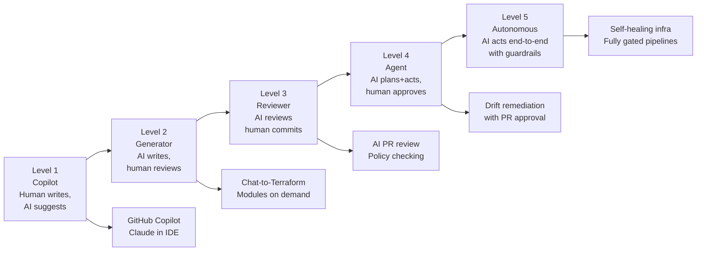
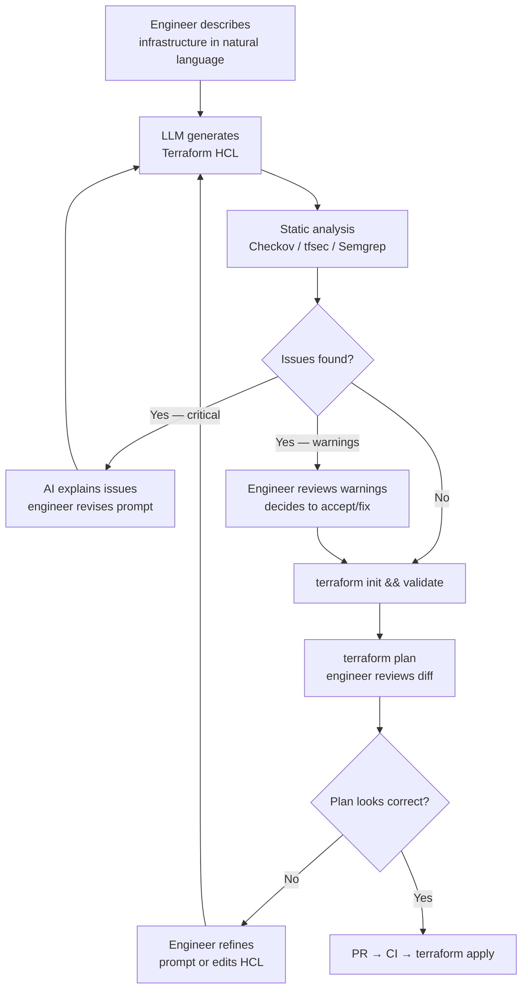
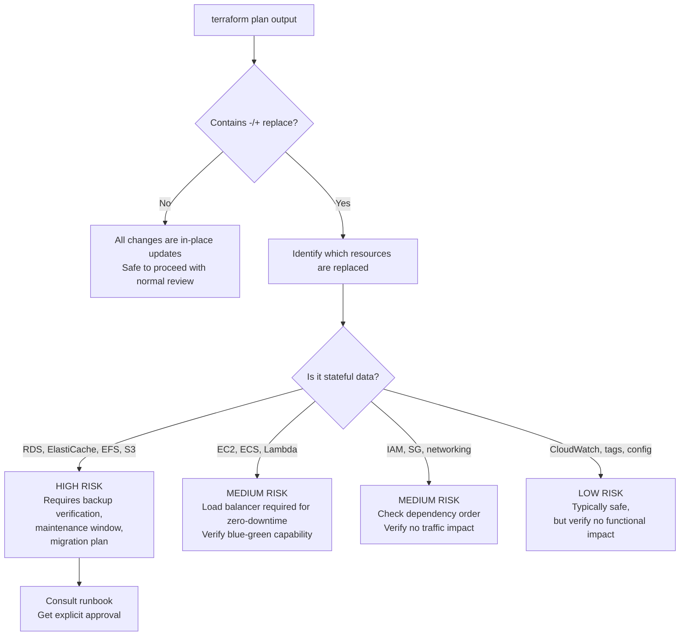
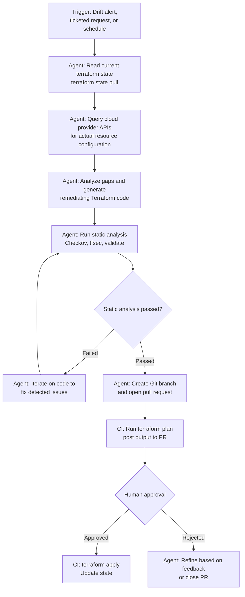
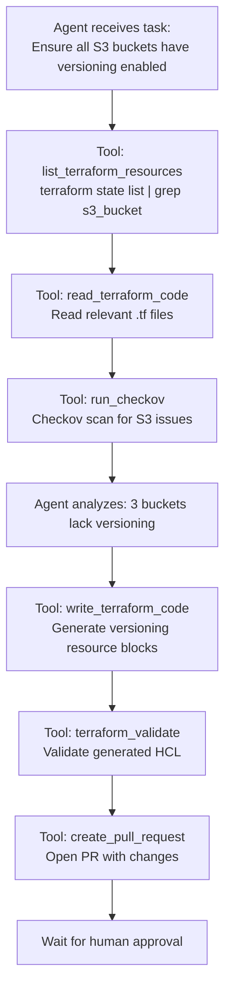
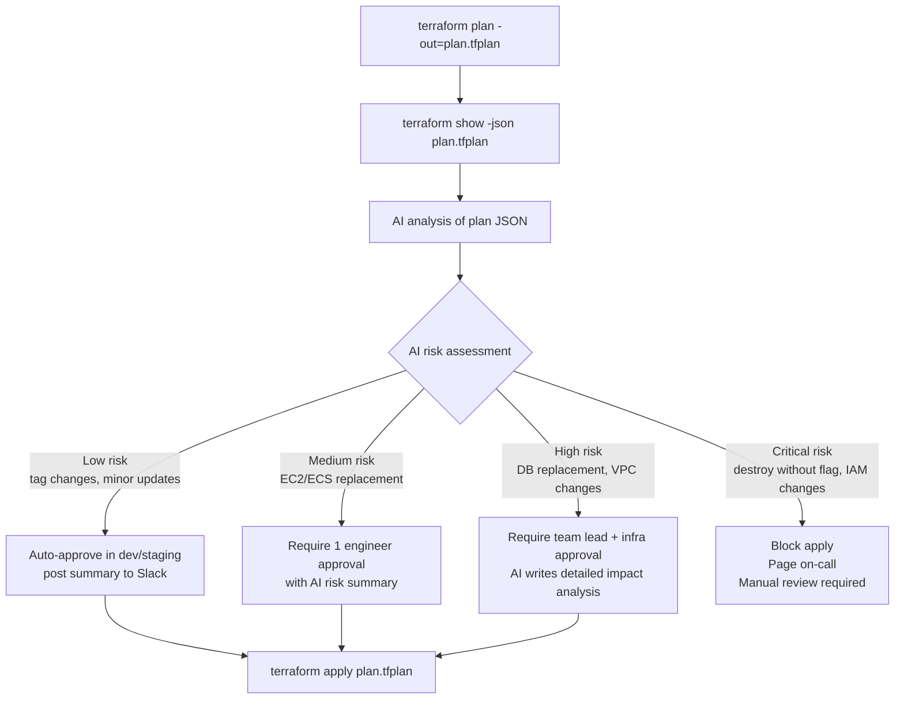

# AI-Assisted Infrastructure as Code Mastery

*Part 1 of 3.* A guide to AI-assisted Infrastructure as Code: the autonomy spectrum, chat-driven generation, agentic IaC workflows, security guardrails, governance, cost optimization, and the future of self-healing infrastructure — plus appendices covering tool selection, prompt engineering, and production readiness.

## Part 1: The AI-IaC Paradigm

### 1.1 Why AI + Infrastructure as Code?

The marriage of Large Language Models (LLMs) with Infrastructure as Code represents one of the most significant shifts in platform engineering since the introduction of Terraform itself. AI assistants can accelerate Terraform development, reduce cognitive load, and democratize infrastructure work — but they also introduce new failure modes that platform engineers must understand and guard against.

**What AI does well in IaC contexts:**

| Capability | Example | Confidence Level |
| --- | --- | --- |
| Boilerplate generation | "Generate an S3 bucket with versioning and encryption" | High |
| Pattern recognition | "This HCL looks like the VPC module pattern — suggest improvements" | High |
| Plan explanation | "Explain why this plan shows a resource replacement" | High |
| Error diagnosis | "What does this error message mean and how do I fix it?" | High |
| Policy translation | "Convert this compliance requirement to a Sentinel rule" | Medium |
| Novel architecture | "Design optimal networking for this multi-region workload" | Medium |
| Cost estimation | "Will this change increase or decrease our AWS bill?" | Low |
| Provider version conflicts | "Why is this provider version combination invalid?" | Low |

**Critical limitations — these require human verification always:**

- AI can hallucinate provider attributes that don't exist
- AI may generate valid-looking HCL with subtle security misconfigurations
- AI cannot access your actual cloud state or cost data without tools
- AI models have training data cutoffs — new provider versions may be unknown
- AI-generated `terraform plan` interpretations can miss nuanced implications

> **The cardinal rule of AI-assisted IaC:** Always run `terraform plan` and review the output before applying AI-generated code. The plan is ground truth. The AI's explanation is a starting point.

### 1.2 LLM Selection for IaC Tasks

| Model Family | IaC Code Gen | Plan Analysis | Security Review | Best Use Case |
| --- | --- | --- | --- | --- |
| Claude Sonnet 4.6 | Excellent | Excellent | Excellent | Primary assistant, complex reasoning |
| Claude Opus 4.8 | Best-in-class | Best-in-class | Best-in-class | Architect-level design, complex governance |
| Claude Haiku 4.5 | Good | Good | Good | High-volume, low-latency generation |
| GPT-4o | Excellent | Good | Good | General-purpose, broad ecosystem |
| GPT-4 mini | Good | Adequate | Adequate | Cost-sensitive pipelines |
| Gemini 1.5 Pro | Good | Good | Good | Google Cloud-native contexts |
| Code-specialized | Good | Limited | Limited | Pure code generation, no reasoning tasks |

> Use the most capable model available (Claude Opus 4.8 or Sonnet 4.6) for security-sensitive IaC generation. The cost difference is negligible compared to the cost of a misconfigured production resource.

## Part 2: IaC Autonomy Spectrum

### 2.1 Five Levels of AI Autonomy



| Level | Human Role | AI Role | When to Use | Risk Level |
| --- | --- | --- | --- | --- |
| 1: Copilot | Primary author | Autocomplete, suggestions | Always safe for daily development | Very Low |
| 2: Generator | Reviewer and approver | Generates full resource blocks | Greenfield code, boilerplate heavy tasks | Low |
| 3: Reviewer | Decision maker | Flags issues, suggests improvements | Code reviews, security scanning | Low |
| 4: Agent | Approver | Plans and proposes changes | Scheduled drift remediation, incident response | Medium |
| 5: Autonomous | Auditor | Acts within policy boundaries | Well-defined, low-risk, reversible operations only | High |

### 2.2 Choosing the Right Level

**Start with Level 1–2** for new AI-IaC initiatives. Build trust in the AI's output quality for your specific environment before progressing to higher autonomy levels. The ROI at Level 2 (developer productivity) is already significant without the operational risk of autonomous agents.

**Criteria to advance to Level 4+:**

- [ ] AI-generated code quality validated over 6+ months at lower levels
- [ ] Comprehensive guardrail pipeline in place (see Part 2, §7)
- [ ] Human approval gates defined for all destructive operations
- [ ] Rollback procedure tested and documented
- [ ] Security team has reviewed the agentic workflow design
- [ ] Blast radius analysis completed

## Part 3: Chat-Based Terraform Generation

### 3.1 The Chat-to-Terraform Workflow



### 3.2 Effective Prompts for IaC Generation

**Anatomy of a good IaC generation prompt:**

```
[CONTEXT]        Who you are, what environment this is for
[REQUIREMENTS]   What resource(s) to create with specifics
[CONSTRAINTS]    Security requirements, naming conventions, tagging
[EXCLUSIONS]     What NOT to include or configure
[FORMAT]         Output format expectations
```

**Example — well-structured prompt:**

```
Context: I'm a platform engineer at a healthcare company. This is for our production AWS environment.
Our account ID is 123456789012, region is us-east-1.

Create a Terraform resource block for an RDS PostgreSQL instance with these requirements:
- Instance class: db.r6g.xlarge
- 200GB storage, GP3, encrypted with our KMS key: alias/prod-rds
- Multi-AZ enabled
- Automated backups: 30 days retention
- Enhanced monitoring: 60-second interval
- Performance Insights: enabled, 7-day retention
- Deletion protection: enabled
- Skip final snapshot: false (final snapshot ID: "prod-postgres-final")
- Username from SSM parameter: /prod/rds/username
- Password from Secrets Manager: prod/rds/master-password

Constraints:
- Tag with: Environment=prod, Team=platform, CostCenter=engineering, HIPAA=true
- Use lifecycle { prevent_destroy = true }
- Ignore changes to password (for rotation support)

Exclude:
- No provisioners
- No null_resource workarounds
- Don't generate the VPC, subnets, or SG — reference by variable

Output: Terraform HCL only, no explanation. Include locals for the SSM/Secrets Manager data sources.
```

**Common mistakes in IaC prompts:**

| Poor Prompt | Problem | Better Approach |
| --- | --- | --- |
| "Make me an S3 bucket" | Too vague — insecure defaults | Specify versioning, encryption, public access block |
| "Create a VPC" | Missing CIDR, subnets, AZs | Specify topology, environment, IP ranges |
| "Generate Terraform for my app" | Impossible — no specifics | Describe exact resources, sizes, connections |
| "Fix this error" (paste error only) | Missing context | Include full Terraform config + state excerpt |

### 3.3 Module Generation with AI

```
Generate a reusable Terraform module for an AWS EKS cluster.

Module inputs (variables.tf):
- cluster_name: string
- kubernetes_version: string (default "1.30")
- vpc_id: string
- subnet_ids: list(string)
- node_groups: map(object with: instance_types, desired_size, min_size, max_size, labels, taints)
- cluster_admins: list(string) — IAM role ARNs for cluster admin access
- tags: map(string)

Module outputs (outputs.tf):
- cluster_name
- cluster_endpoint
- cluster_certificate_authority_data
- oidc_provider_arn (for IRSA)
- node_group_arns

Security requirements:
- Enable secrets envelope encryption with KMS
- Enable control plane logging: api, audit, authenticator, controllerManager, scheduler
- Enable IRSA (IAM Roles for Service Accounts)
- Private API endpoint by default (enable_private_access=true, enable_public_access=false)
- Managed node groups with bottlerocket AMI
- Enable IMDSv2 on all nodes

Structure:
- main.tf: core EKS resources
- node_groups.tf: managed node group resources (use for_each over var.node_groups)
- iam.tf: OIDC provider, IRSA setup
- variables.tf: input variables with validation
- outputs.tf: output values
- versions.tf: required terraform >=1.5, required_providers aws ~>5.0, tls

Output: Complete module code for all 6 files.
```

## Part 4: AI Code Review & Static Analysis

### 4.1 AI-Augmented PR Review Workflow

Combining AI natural language review with deterministic static analysis tools provides defense in depth for IaC code quality.

**Static analysis tools — all deterministic:**

| Tool | What It Checks | Integration | Speed |
| --- | --- | --- | --- |
| Checkov | Security misconfigs (500+ rules) | CLI, GitHub Actions | Fast |
| tfsec | Terraform-specific security | CLI, GitHub Actions | Fast |
| Terrascan | Multi-cloud policy enforcement | CLI, GitHub Actions | Medium |
| Trivy | Infra misconfig + CVE scanning | CLI, GitHub Actions | Medium |
| Semgrep | Custom pattern rules | CLI, GitHub Actions | Fast |
| OPA/Conftest | Policy as Code (Rego) | CLI, GitHub Actions | Fast |
| Infracost | Cost estimation | CLI, GitHub Actions, PR comments | Medium |

**AI review complements these by catching:**

- Architectural concerns that rules cannot express
- Intent mismatch between comment and code
- Module design anti-patterns
- Missing resource relationships
- Business logic errors invisible to linters

```yaml
# .github/workflows/terraform-security.yml
name: Terraform Security Review
on:
  pull_request:
    paths: ["**.tf"]
jobs:
  static-analysis:
    runs-on: ubuntu-latest
    steps:
      - uses: actions/checkout@v4

      - name: Run Checkov
        uses: bridgecrewio/checkov-action@v12
        with:
          directory: .
          quiet: true
          framework: terraform

      - name: Run tfsec
        uses: aquasecurity/tfsec-action@v1
        with:
          github_token: ${{ secrets.GITHUB_TOKEN }}

      - name: Run Infracost
        uses: infracost/actions/setup@v3
        with:
          api-key: ${{ secrets.INFRACOST_API_KEY }}

      - name: Comment cost estimate on PR
        run: |
          infracost diff --path . --format json --out-file /tmp/infracost.json
          infracost comment github --path /tmp/infracost.json \
            --repo ${{ github.repository }} \
            --pull-request ${{ github.event.pull_request.number }} \
            --github-token ${{ secrets.GITHUB_TOKEN }}
```

### 4.2 Systematic AI Review Checklist

When using AI to review Terraform PRs, structure the review request:

```
Review this Terraform change for:

SECURITY:
1. Any resources exposed to 0.0.0.0/0 without justification
2. Missing encryption at rest or in transit
3. IAM policies broader than least privilege
4. Secrets or credentials in code or variables
5. Missing audit logging configuration

RELIABILITY:
6. Resources without deletion protection in prod
7. Single points of failure
8. Missing tags for cost allocation and compliance
9. Resources without backup or snapshot configuration
10. Missing lifecycle { prevent_destroy = true } on stateful resources

TERRAFORM PRACTICES:
11. Anti-patterns (hardcoded values, no version constraints)
12. Missing or incorrect depends_on
13. Force replacements that could cause downtime
14. State management concerns (large state, missing remote backend)

[Paste Terraform diff here]
```

## Part 5: AI-Assisted Plan Interpretation

### 5.1 Understanding `terraform plan` Output with AI

Terraform plan output is information-dense and can be difficult to parse quickly, especially for junior engineers or for large diffs. AI significantly accelerates plan interpretation.

**Example AI prompt for plan analysis:**

```
Analyze this terraform plan output. Explain:
1. What infrastructure changes will happen (in plain English)
2. Any resources that will be REPLACED (destroyed and recreated)
3. Any potential downtime or service impact
4. Any cost implications
5. Any security concerns in the changes
6. Whether the overall change looks safe to apply in production

[Paste terraform plan output here]
```

### 5.2 Force Replacement Detection

The most critical items in a plan are resources marked `must be replaced` or `-/+`. These cause downtime and data risk.



## Part 6: Agentic IaC Workflows

### 6.1 What Is an Agentic IaC Workflow?

In an agentic workflow, an AI agent doesn't just generate code — it takes sequential actions: querying cloud APIs, reading state, generating code, running validation, and proposing changes through a pull request.



### 6.2 Agentic Tool-Use Loop

Modern AI agents use tool-calling to take actions iteratively, refining their approach based on tool output.



### 6.3 Plan-Review-Apply with AI Gate



## Related

- [Part 2: Guardrails, Governance & Cost Optimization](parts/25-ai-assisted-iac-mastery-part2.md) — multi-layer guardrail architecture, security automation, drift detection, cost optimization, and troubleshooting.
- [Part 3: Self-Healing Infrastructure & The Future](parts/25-ai-assisted-iac-mastery-part3.md) — self-healing patterns, multi-agent orchestration, autonomy roadmap, and tool/prompt reference appendices.
- [Terraform from Zero to Mastery](26-terraform-mastery-guide.md) — the core Terraform reference this guide builds on.
