# Terraform from Zero to Mastery

*Part 1 of 4.* A comprehensive guide covering IaC fundamentals, architecture, state management, rollback, decommissioning, and the future with OpenTofu and AI-assisted IaC — plus appendices with a CLI cheat sheet, interview questions, a production readiness checklist, and a Day-0/1/2 operations guide.

## Part 1: Terraform Fundamentals

*Infrastructure as Code, Evolution & IaC Tool Comparison*

### 1.1 What is Infrastructure as Code (IaC)?

Infrastructure as Code (IaC) is the practice of managing and provisioning computing infrastructure through machine-readable definition files rather than through manual processes or interactive configuration tools. IaC treats infrastructure the same way software engineers treat application code — version-controlled, tested, peer-reviewed, and automatically deployed.

**Core benefits:**

- **Repeatability** — The same configuration produces identical infrastructure every time, eliminating snowflake servers and configuration drift.
- **Version Control** — Infrastructure changes are tracked in Git with full audit history, blame tracking, and the ability to revert.
- **Collaboration** — Teams can review infrastructure changes via pull requests using the same workflows as application code.
- **Speed** — Automated provisioning takes minutes instead of days of manual work.
- **Cost Control** — Infrastructure can be destroyed and recreated on demand, enabling ephemeral environments.
- **Disaster Recovery** — Entire environments can be rebuilt from code in minutes.

**The Evolution of Infrastructure Management:**

| Era | Approach | Tools | Problems Solved | New Problems Introduced |
| --- | --- | --- | --- | --- |
| Gen 1 ~2000s | Manual Provisioning | SSH, Web Console, CLI | Direct control | No repeatability, snowflakes, tribal knowledge |
| Gen 2 ~2008-2014 | Config Management | Chef, Puppet, Ansible, SaltStack | Repeatable config, idempotent | Mutable infra, drift, ordering issues |
| Gen 3 ~2014-2019 | Orchestration IaC | Terraform, CloudFormation | Immutable infra, declarative | State management complexity |
| Gen 4 ~2019-now | Platform Engineering | Backstage, Crossplane, Pulumi | Developer self-service | Abstraction overhead, learning curve |
| Gen 5 ~2024+ | AI-Assisted IaC | Terraform + AI, OpenTofu | Natural language to infra | Hallucination risks, validation gaps |

**Mutable vs Immutable Infrastructure:**

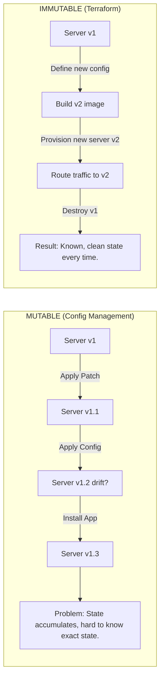

### 1.2 IaC Tool Comparison Matrix

| Tool | Type | Language | State Mgmt | Multi-Cloud | Provider Ecosystem | Best For |
| --- | --- | --- | --- | --- | --- | --- |
| Terraform | Declarative | HCL | tfstate file | Native | 4,000+ providers | Multi-cloud enterprise |
| OpenTofu | Declarative | HCL | tfstate file | Native | Terraform-compatible | Open-source Terraform |
| CloudFormation | Declarative | YAML/JSON | AWS managed | AWS only | AWS services only | AWS-native teams |
| AWS CDK | Imperative | Python/TS/Java | CloudFormation | AWS only | AWS via constructs | Developer-first AWS |
| Pulumi | Imperative | Python/TS/Go/C# | Pulumi Cloud | Native | 100+ providers | Dev-heavy teams |
| Bicep | Declarative | Bicep DSL | Azure managed | Azure only | Azure services | Azure-native teams |
| Crossplane | Declarative | Kubernetes CRDs | Kubernetes | Native | Growing | K8s-native platform |
| Ansible | Imperative | YAML | None (stateless) | Via modules | Thousands | Config management |

**Choose Terraform when:** infrastructure spans multiple cloud providers, you need to manage non-cloud resources (DNS, GitHub, Datadog, Snowflake), or you need the 4,000+ provider ecosystem.

> **Not the right choice when:** 100% AWS-only and wanting deep CloudFormation integration, or team strongly prefers imperative languages (consider Pulumi or CDK).

### 1.3 Declarative vs Imperative

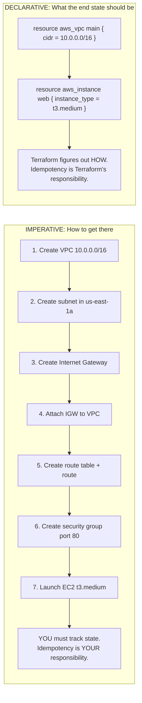

**Terraform Reconciliation Loop** — `terraform apply` performs a three-way diff between Desired State (`.tf` files), Known State (`tfstate`), and Actual State (cloud APIs):

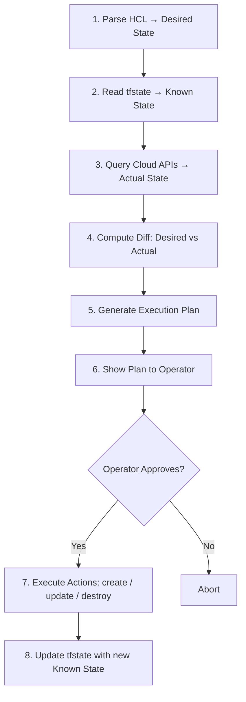

## Part 2: Terraform Architecture Deep Dive

*CLI, Providers, DAG, State Engine*

### 2.1 Terraform CLI Architecture

Terraform is a single Go binary that orchestrates everything. Understanding its internal architecture is critical for diagnosing issues, building CI/CD pipelines, and designing enterprise workflows.

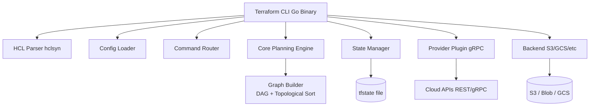

**The Command Lifecycle:**

| Command | Phase | What It Does | Side Effects | Safe? |
| --- | --- | --- | --- | --- |
| `terraform init` | Initialization | Downloads providers, configures backend | Creates `.terraform/` dir | Always safe |
| `terraform validate` | Validation | Checks HCL syntax and basic schema | None | Always safe |
| `terraform fmt` | Formatting | Rewrites `.tf` files to canonical style | Modifies `.tf` files | Always safe |
| `terraform plan` | Planning | Computes diff between desired/actual state | Reads state/APIs, brief lock | Read-only |
| `terraform apply` | Execution | Executes the plan | **MODIFIES REAL INFRASTRUCTURE** | Irreversible |
| `terraform destroy` | Teardown | Destroys ALL resources in state | **DESTROYS REAL INFRASTRUCTURE** | Dangerous |
| `terraform import` | Migration | Associates existing resource with state | Writes to state file | State mutation |
| `terraform refresh` | Sync | Updates state to match actual *(deprecated)* | Writes to state file | Avoid — use `plan` |
| `terraform output` | Read | Reads output values from state | None | Always safe |
| `terraform graph` | Visualization | Outputs DOT graph of resource dependencies | None | Always safe |

### 2.2 Provider Plugin System

Providers are separate Go binaries downloaded during `terraform init` and communicating via gRPC over a local socket.

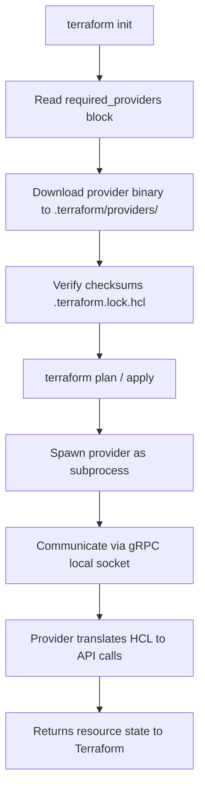

```hcl
terraform {
  required_version = ">= 1.5.0"
  required_providers {
    aws = {
      source  = "hashicorp/aws"
      version = "~> 5.0"
    }
    kubernetes = {
      source  = "hashicorp/kubernetes"
      version = ">= 2.20.0"
    }
    databricks = {
      source  = "databricks/databricks"
      version = "~> 1.40"
    }
  }
}

provider "aws" {
  region  = var.aws_region
  profile = var.aws_profile
  default_tags {
    tags = {
      Environment = var.environment
      ManagedBy   = "terraform"
      Team        = var.team_name
    }
  }
}
```

### 2.3 Resource Dependency Graph (DAG)

Terraform builds a Directed Acyclic Graph (DAG) of all resources before executing any changes, driving parallel execution and dependency ordering.

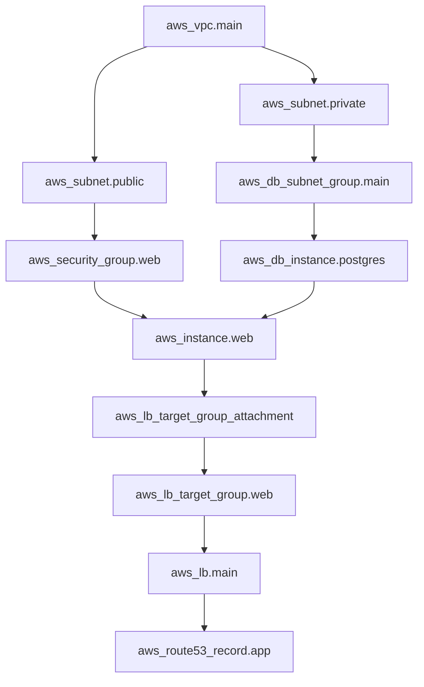

> **PARALLEL EXECUTION:** Resources with no dependency on each other execute simultaneously. Default: up to 10 parallel operations (`-parallelism=N` to change).

```hcl
# Explicit dependency when Terraform cannot infer it automatically
resource "aws_iam_role_policy_attachment" "lambda_vpc" {
  role       = aws_iam_role.lambda.name
  policy_arn = "arn:aws:iam::aws:policy/AWSLambdaVPCAccessExecutionRole"
  depends_on = [aws_iam_role.lambda]
}
```

## Part 3: Resource Matching Internals

*State Reconciliation, Addressing, Drift Detection*

### 3.1 Resource Addressing & Identity

**Address formats:**

```
Root-level:       aws_instance.web
Root + count:     aws_instance.web[0]
Root + for_each:  aws_instance.web["frontend"]
Module:           module.vpc.aws_vpc.main
Nested module:    module.infra.module.vpc.aws_vpc.main
Deep for_each:    module.env["prod"].aws_s3_bucket.data
```

The resource address maps to a state entry containing the real cloud ID:

```json
{
  "resources": [{
    "module": "module.network",
    "mode": "managed",
    "type": "aws_vpc",
    "name": "main",
    "instances": [{
      "attributes": {
        "id": "vpc-0a1b2c3d4e5f67890",
        "cidr_block": "10.0.0.0/16",
        "tags": {"Name": "main", "Environment": "prod"}
      }
    }]
  }]
}
```

### 3.2 What Happens When a Resource is Renamed

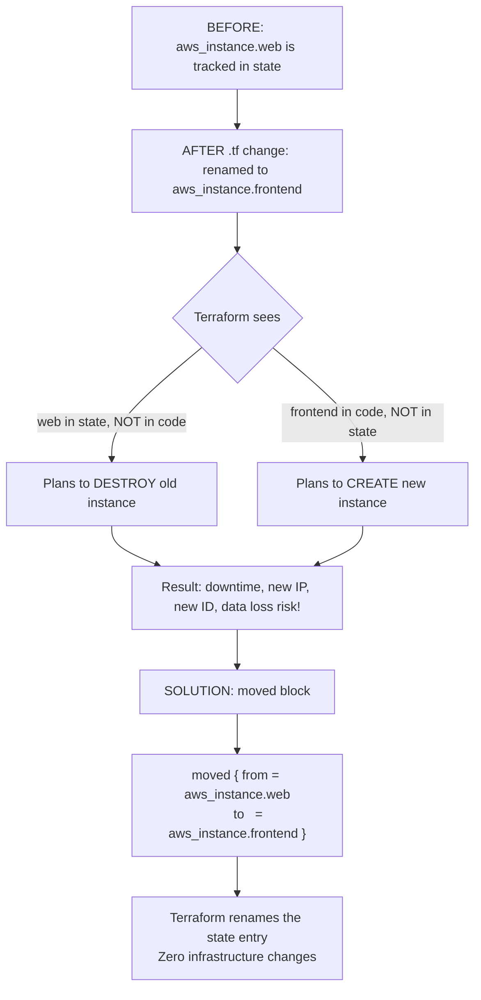

**`moved` Blocks — Complete Guide** (Terraform 1.1+):

```hcl
# Example 1: Simple resource rename
moved {
  from = aws_instance.web
  to   = aws_instance.frontend
}

# Example 2: Moving into a module
moved {
  from = aws_vpc.main
  to   = module.networking.aws_vpc.main
}

# Example 3: Moving when adopting for_each
moved {
  from = aws_s3_bucket.logs
  to   = aws_s3_bucket.logs["access"]
}

# Example 4: Moving between module instances
moved {
  from = module.servers[0]
  to   = module.servers["web"]
}
```

> `moved` blocks are permanent declarations. Keep them in your codebase so anyone who hasn't applied yet gets the safe rename.

### 3.3 State Drift Detection

State drift occurs when actual cloud infrastructure diverges from Terraform's state file.

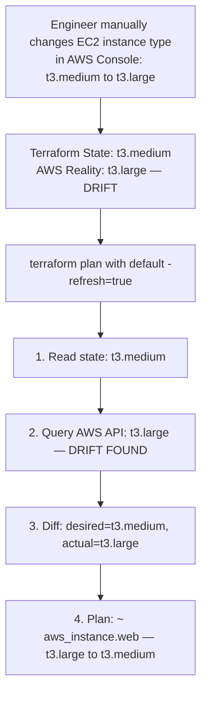

**Three strategies for handling drift:**

| Strategy | When to Use | Command | Risk |
| --- | --- | --- | --- |
| Reconcile to code | Code is the source of truth | `terraform apply` | Changes live infra back to code |
| Accept drift into state | Manual change was intentional | `terraform apply -refresh-only` | Code and state diverge |
| Ignore attribute | External system controls the value | `ignore_changes = [attr]` | Ongoing drift accumulation |
| Import & codify | Manual resource should be Terraform-managed | `terraform import` + update code | Initial complexity |

## Part 4: Terraform State Deep Dive

*Local State, Remote Backends, Locking, Corruption Recovery*

### 4.1 Understanding the State File

The Terraform state file (`terraform.tfstate`) is the single most important artifact in a Terraform deployment — a JSON file mapping resource addresses to real cloud IDs and last-known attribute values.

> **Warning:** Losing the state file without a backup means Terraform loses track of all managed resources. They become orphans that continue to run and accrue cost.

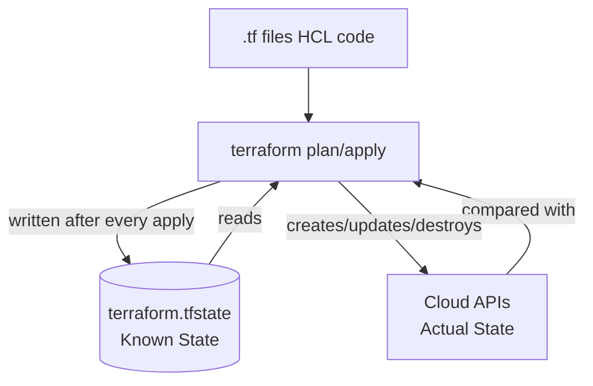

State contains: resource IDs, all attributes, dependencies, provider metadata, terraform version, serial number, lineage UUID.

### 4.2 Remote State Backends

**AWS (S3 + DynamoDB):**

```hcl
terraform {
  backend "s3" {
    bucket         = "my-company-terraform-state"
    key            = "prod/us-east-1/networking/terraform.tfstate"
    region         = "us-east-1"
    encrypt        = true
    kms_key_id     = "arn:aws:kms:us-east-1:..."
    dynamodb_table = "terraform-state-locks"
  }
}
```

**Azure (Blob Storage):**

```hcl
terraform {
  backend "azurerm" {
    resource_group_name  = "terraform-state-rg"
    storage_account_name = "mycompanytfstate"
    container_name       = "tfstate"
    key                  = "prod/eastus/networking.tfstate"
  }
}
```

**GCP (GCS):**

```hcl
terraform {
  backend "gcs" {
    bucket = "my-company-terraform-state"
    prefix = "prod/us-central1/networking"
  }
}
```

### 4.3 State Locking — Deep Dive

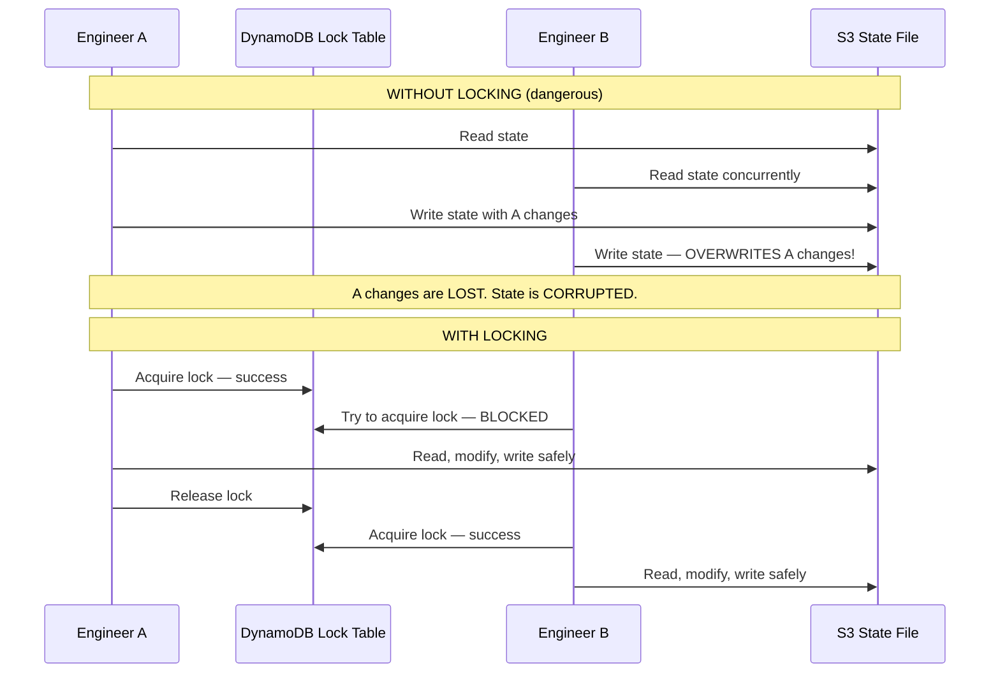

```hcl
# Create DynamoDB lock table (run once)
resource "aws_dynamodb_table" "terraform_locks" {
  name         = "terraform-state-locks"
  billing_mode = "PAY_PER_REQUEST"
  hash_key     = "LockID"
  attribute {
    name = "LockID"
    type = "S"
  }
}
```

### 4.4 State Corruption Recovery

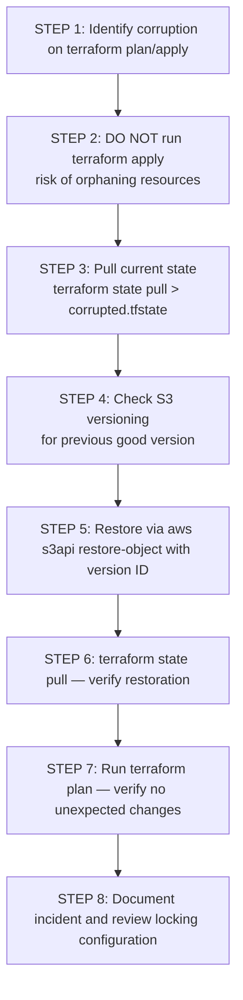

```bash
# List S3 state file versions
aws s3api list-object-versions \
  --bucket my-terraform-state \
  --prefix prod/networking/terraform.tfstate

# Restore a specific version
aws s3api copy-object \
  --copy-source "my-terraform-state/prod/networking/terraform.tfstate?versionId=<VERSION_ID>" \
  --bucket my-terraform-state \
  --key prod/networking/terraform.tfstate

# Force-unlock a stuck state lock (extreme caution!)
terraform force-unlock <LOCK_ID>
```

> **Always enable S3 versioning** on your state bucket and retain at least 90 days of state versions. This is your primary disaster recovery mechanism.

## Related

- [Part 2: CLI Mastery, Rollback & Modules](parts/26-terraform-mastery-guide-part2.md) — full CLI reference, rollback strategy, decommissioning, state manipulation, and modules.
- [Part 3: Enterprise Architecture, Security & OpenTofu](parts/26-terraform-mastery-guide-part3.md) — enterprise directory structure, anti-patterns, troubleshooting, retirement programs, and the OpenTofu fork.
- [Part 4: Interview Questions & Operations Guide](parts/26-terraform-mastery-guide-part4.md) — 125 interview questions, production readiness checklist, Day-0/1/2 operations.
- [AI-Assisted IaC Mastery Guide](25-ai-assisted-iac-mastery.md) — AI-assisted generation, review, and governance built on top of this Terraform foundation.
