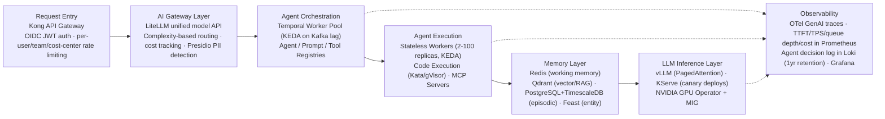

The following reference architecture represents a production-grade enterprise Kubernetes platform meeting security, compliance, observability, and operational requirements for regulated industries. Each layer is independently selectable and all components are CNCF-graduated or widely adopted in production.

## Enterprise Kubernetes Platform — Full Stack Architecture

```mermaid
graph BT
    L1["Layer 1: Infrastructure<br/>Managed cloud (EKS/GKE/AKS) or self-managed (CAPI)<br/>CPU + GPU node pools (A100/H100)<br/>Private VPC, no public node IPs · Cloud IAM + HSM"]
    L2["Layer 2: Kubernetes Control Plane<br/>API Server (private endpoint, audit log to S3 immutable)<br/>etcd (3-node HA, encryption at rest, 30-min backup)<br/>Volcano scheduler (AI) + default scheduler"]
    L3["Layer 3: Storage<br/>AWS EBS gp3 / GCP PD-SSD (block, RWO)<br/>EFS/NFS / Ceph CephFS (shared, RWX)<br/>Velero (backup, DR)"]
    L4["Layer 4: Networking<br/>Cilium eBPF CNI (kube-proxy replacement + WireGuard)<br/>Istio Ambient Mesh (mTLS, L7 policy, zero sidecar)<br/>ingress-nginx (external) + Gateway API (internal) · CoreDNS + NodeLocal DNSCache"]
    L5["Layer 5: Security<br/>OIDC/Dex (human auth) + SPIFFE/SPIRE (workload identity)<br/>Vault HA + External Secrets Operator · cert-manager + Vault PKI<br/>Kyverno + OPA Gatekeeper · Falco + Tetragon · Cosign + Trivy + Harbor"]
    L6["Layer 6: Observability<br/>Prometheus + Thanos (metrics, long-term S3)<br/>Fluent Bit -> Loki (logs, S3 backend)<br/>OTel Collector -> Tempo (traces) · OpenCost + DCGM · Grafana"]
    L7["Layer 7: Developer Platform<br/>Backstage (IDP: catalogue, templates, docs)<br/>ArgoCD + ApplicationSets (GitOps, multi-cluster)<br/>Crossplane (self-service infra) · Argo Rollouts (progressive delivery)"]
    L8["Layer 8: AI Platform<br/>GPU Operator + MIG Manager + DCGM Exporter · Volcano + Karpenter<br/>vLLM + KServe + Ray Serve · LiteLLM + MLflow + Kubeflow Pipelines<br/>Feast + Qdrant/Milvus · Temporal + Argo Workflows"]

    L1 --> L2 --> L3 --> L4 --> L5 --> L6 --> L7 --> L8
```

_Each layer builds on the one below it; components within a layer are independently selectable based on cloud provider and organisational maturity._

## Financial Services Reference Architecture

| Requirement | Control | Implementation |
|---|---|---|
| Data sovereignty | No PII leaves jurisdiction | Cluster per region; Kyverno blocks external registries; no cross-region data flow |
| Encryption at rest | All data encrypted with customer keys | etcd AES-GCM + KMS; PVC LUKS; S3 SSE-KMS; Vault CMEK |
| Encryption in transit | All comms encrypted | Cilium WireGuard (L3) + Istio Ambient mTLS (L7) + cert-manager |
| Privileged access | MFA + break-glass audit | OIDC + Okta MFA; Vault lease-based admin; every action audited |
| Vulnerability SLA | CRITICAL: 24h; HIGH: 7d | Trivy CI gate + Harbor daily scan + Kyverno image age policy |
| Change management | All changes via approved GitOps | ArgoCD selfHeal + prune; no kubectl write in prod; PR required |
| Business continuity | RTO < 4h; RPO < 1h | Velero hourly; multi-AZ cluster; etcd 30-min snapshot to S3 |
| AI model audit (EU AI Act) | Article 12: complete audit trail | OTel GenAI traces → Tempo; MLflow lineage; immutable S3 audit log |
| PCI DSS v4 | Cardholder data isolation | Dedicated namespace + cluster; NetworkPolicy + Vault for card data |

## Healthcare Reference Architecture

Healthcare Kubernetes deployments must satisfy HIPAA, HITRUST, and increasingly FDA 21 CFR Part 11 for AI/ML medical devices. Key additions to the base platform:

- **PHI isolation** — a dedicated namespace per patient data category. Kubernetes NetworkPolicy blocks cross-namespace communication for PHI workloads, with encryption at rest using FIPS 140-2 validated modules.
- **De-identification pipeline** — AI-powered PII/PHI detection (Presidio) deployed as an admission webhook, blocking any attempt to log raw PHI to non-compliant systems; all PHI is hashed/tokenised before AI model processing.
- **Audit trail** — every access to PHI data is logged with user identity, timestamp, purpose (clinical/research/admin), and data elements accessed, stored in an immutable audit log in compliance-certified object storage.
- **Medical AI governance** — FDA 21 CFR Part 11 requires electronic records and signatures for AI model validation, versioning, and deployment approval; implemented via MLflow plus a custom approval workflow CRD for pre-market submission artifacts.

## Enterprise Agentic AI Platform Reference Architecture

Full-stack enterprise agentic AI platform (derived from Part 12):

_The request-handling chain runs left to right; observability cuts across orchestration, execution, and inference rather than sitting downstream of them._
