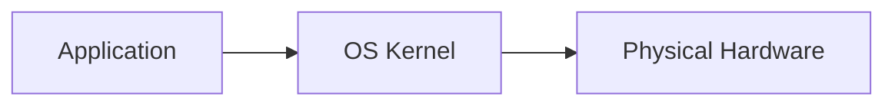
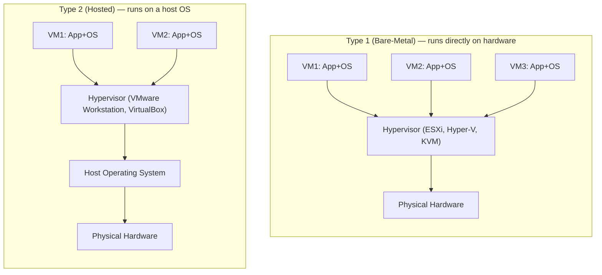

# K8s Handbook Part 1: Infrastructure Evolution

*Part 1 of 3 of the Enterprise Kubernetes Mastery handbook (Volume 1 of a 16-part series).* Traces the complete evolutionary arc from physical servers to cloud computing — the conceptual foundation for understanding why Kubernetes is designed the way it is.

## Chapter 1: The Imperative of Modern Infrastructure

Every technology generation in infrastructure exists to solve a specific class of pain. Understanding what came before Kubernetes — and why each generation fell short — is not historical trivia. It is the conceptual foundation required to make sound architectural decisions. An enterprise architect who understands the lineage from mainframes to Kubernetes does not just know what a Pod is; they understand why it was designed the way it was, what trade-offs were accepted, and where it will inevitably fall short.

This part traces the complete evolutionary arc: from bare metal to virtual machines, from VMs to cloud, from cloud to containers, from containers to Google Borg, and from Borg to Kubernetes. Each step is examined through the lens of the problems it solved, the limitations it introduced, and its direct influence on the design decisions embedded in Kubernetes today.

> **Key Insight:** Kubernetes is not a container orchestrator bolted onto Docker. It is a general-purpose distributed systems substrate, inspired by a decade of Google's internal platform engineering, designed to manage the desired state of arbitrarily complex workloads at planetary scale. Every design decision — from the API server to the reconciliation loop — reflects hard-won lessons from operating millions of containers in production.

### The Core Problem Space

Modern enterprise infrastructure must simultaneously satisfy a set of requirements that are in constant tension:

- **Density**: Maximise compute utilisation to control cost
- **Isolation**: Prevent workloads from interfering with each other
- **Portability**: Run workloads consistently across environments
- **Scalability**: Scale from single instances to thousands dynamically
- **Resilience**: Recover automatically from hardware and software failures
- **Velocity**: Deploy software rapidly and safely
- **Observability**: Understand system behaviour at all times
- **Security**: Enforce least privilege at every layer
- **Cost efficiency**: Match resource allocation to actual demand

No single generation of infrastructure has solved all of these simultaneously. Each era made trade-offs. Kubernetes is the most complete answer the industry has produced to date — but it too has blind spots, which this handbook examines honestly throughout.

## Chapter 2: Era 1 — Physical Servers (1960s–1990s)

### Historical Context

For the first three decades of commercial computing, the dominant model was simple: one application ran on one physical machine. IBM mainframes, Digital Equipment Corporation minicomputers, and later the explosion of x86 commodity servers all operated under this paradigm. The hardware was expensive, the software was monolithic, and the relationship between application and machine was intimate and direct.

The 1990s brought the client-server revolution, the rise of the internet, and an explosion in the number of applications enterprises needed to run. Data centres filled with racks of pizza-box servers, each dedicated to a single purpose: web server, database server, application server, mail server.

### Architecture

Physical server architecture was brutally simple. An application ran directly on the operating system, which ran directly on hardware. The OS owned all CPU cores, all RAM, all NIC bandwidth, and all storage I/O. There was no mediation layer, no abstraction boundary between the application and the silicon.

Ratio: 1 application : 1 OS : 1 physical machine.

### Operational Realities

| Characteristic | Physical Server Reality |
| --- | --- |
| Provisioning time | Weeks to months — purchase, rack, cable, OS install, configure |
| Utilisation | Typically 5–15% average CPU utilisation per server |
| Isolation | Complete physical isolation — no shared resources |
| Cost | High CapEx per server; idle capacity was wasted investment |
| Portability | Zero — binaries compiled for specific hardware/OS |
| Scaling | Vertical only (buy bigger) or horizontal (buy more servers) |
| Failure recovery | Manual — page on-call engineer, physically replace hardware |
| Energy efficiency | Poor — servers ran at low utilisation with full power draw |

### The Utilisation Crisis

By the late 1990s, enterprise data centres faced a crisis hiding in plain sight: enormous capital expenditure on servers that were idle 85–95% of the time. The reason was rational: applications were sized for peak load. If the Christmas trading spike required 10x normal throughput, you provisioned 10x the servers and left them idle the remaining 11.5 months. Peak capacity was the floor, not the ceiling.

IDC research from the early 2000s estimated that average enterprise server utilisation was between 5% and 15%. This meant that for every dollar of compute actually used, five to twenty dollars of silicon sat dormant, consuming power, cooling, and floor space. This inefficiency was the direct economic driver for virtualisation.

**Anti-patterns that Kubernetes eliminates:**

- Server sprawl — hundreds of underutilised machines with no governance
- Snowflake servers — each machine hand-configured, impossible to reproduce
- "Works on my machine" — application behaviour tied to specific OS version/patch level
- Hardware lock-in — applications dependent on specific CPU/NIC/storage vendors
- Manual scaling — human intervention required for every capacity change
- Single points of failure — no redundancy, hardware failure = application outage

**Influence on Kubernetes design:** The physical server era bequeathed Kubernetes with its most fundamental design philosophy: infrastructure must be declarative, not imperative. The pain of manually configuring servers and the fragility of snowflake machines created the industry consensus that desired state, not procedural scripts, is the correct abstraction for infrastructure management. Kubernetes' reconciliation loop — the engine that continuously drives actual state toward desired state — is a direct response to decades of manual, error-prone server management.

## Chapter 3: Era 2 — Virtualisation & Hypervisors (1998–2010)

### The Problem That Drove Virtualisation

Virtualisation did not emerge from academic elegance — it emerged from a business crisis. Enterprise data centres in the late 1990s were consuming enormous capital on server hardware that delivered minimal utilisation. Power and cooling costs were escalating. Floor space was exhausted. And the number of applications demanding their own dedicated server continued to grow. Something had to change.

VMware's founding in 1998 and the release of VMware Workstation followed by ESX Server introduced a concept to the x86 world that IBM had pioneered on mainframes in the 1960s: the hypervisor. A thin software layer that could present multiple virtual machines to applications, each believing it owned the physical hardware exclusively.

### How Hypervisors Work

A hypervisor (also called a Virtual Machine Monitor or VMM) operates by intercepting privileged CPU instructions issued by guest operating systems. When a guest OS attempts to execute an instruction that would normally require direct hardware access (such as writing to a physical memory address or configuring a NIC), the hypervisor intercepts the instruction, emulates the expected behaviour, and returns control to the guest.

**Hypervisor Architecture:**

### Types of Hypervisors

| Type | Examples | Use Case | Overhead |
| --- | --- | --- | --- |
| Type 1 (Bare-Metal) | VMware ESXi, Microsoft Hyper-V, KVM, Xen | Production data centre | Minimal (2–5%) |
| Type 2 (Hosted) | VMware Workstation, VirtualBox, Parallels | Developer workstations | Moderate (5–15%) |
| Paravirtualised | Xen with paravirt drivers, KVM with virtio | High-performance production | Near-zero with virtio |
| Container-optimised | gVisor, Kata Containers, Firecracker | Kubernetes nodes | Low with hardware assist |

### Key Virtualisation Technologies

**CPU Virtualisation — Hardware Assist (Intel VT-x / AMD-V).** Early software-based virtualisation required binary translation — the hypervisor rewrote guest instructions at runtime to avoid privileged instruction traps. This introduced significant overhead. Intel's VT-x and AMD's AMD-V extensions, introduced in 2005–2006, added a new CPU ring (VMX root/non-root mode) specifically for hypervisors, enabling near-native performance with hardware-assisted virtualisation. Modern Kubernetes nodes rely entirely on hardware-assisted virtualisation for any VM-based isolation layer (Kata Containers, Firecracker).

**Memory Virtualisation — Extended Page Tables (EPT).** Guest VMs maintain their own page tables mapping guest virtual addresses to guest physical addresses. The hypervisor must then map guest physical addresses to host physical addresses. Without hardware assist, this required shadow page tables — expensive to maintain and a source of significant overhead. Intel's EPT and AMD's Nested Page Tables (NPT) offloaded this two-level translation to hardware, dramatically reducing memory virtualisation overhead. This is relevant to Kubernetes because nodes running on cloud VMs (the dominant deployment model) depend on these hardware features for acceptable performance.

**Storage Virtualisation.** Hypervisors presented virtual disks (VMDK, VHD, qcow2) to guest VMs, backed by physical storage. Storage Area Networks (SANs) and Network Attached Storage (NAS) enabled shared storage across hypervisor hosts, enabling live VM migration (vMotion). This concept of storage abstraction is a direct ancestor of Kubernetes PersistentVolumes: storage exists independently of the compute that consumes it, and workloads can move between hosts without losing their data.

**Network Virtualisation.** Virtual switches (vSwitch) within hypervisor hosts allowed VMs to communicate without physical network traversal. VLAN tagging provided network isolation between tenant workloads. VMware NSX and similar products later extended virtualisation to the entire network layer. These concepts directly influenced Kubernetes network design: each Pod gets its own IP (analogous to VM IP), and CNI plugins implement overlay networks that virtualise the physical network.

### What Virtualisation Solved vs. What It Left Unsolved

| Dimension | Physical Servers | Virtual Machines | Remaining Gap |
| --- | --- | --- | --- |
| Utilisation | 5–15% | 40–70% | VM overhead, OS footprint |
| Provisioning | Weeks | Minutes–Hours | Still manual, OS licensing |
| Isolation | Physical | Strong (hypervisor boundary) | Shared kernel in containers |
| Density | 1 app / server | 10–30 VMs / server | VM image size, boot time |
| Portability | None | Good (VM images) | Image size, hypervisor lock-in |
| Boot time | Minutes | Minutes (30–120s) | Too slow for auto-scaling |
| Resource overhead | None | 5–15% per VM | Each VM has full OS |
| Application density | 1 / server | 10–30 / server | Not 1000s |

**The boot time problem:** Virtual machines improved utilisation dramatically but introduced a fundamental scaling friction: boot time. A VM starting from cold required loading the BIOS, the bootloader, the OS kernel, system services, and finally the application. Even optimised, this was a 30–120 second process. When auto-scaling groups tried to respond to a traffic spike, they were adding capacity in minutes, not seconds. This latency made reactive scaling impractical for bursty workloads. Containers solved this by eliminating the OS boot — a container starts in milliseconds because it shares the host kernel.

**The VM image size problem:** A minimal VM image for a Linux server was typically 1–5 GB. A Windows Server VM was 20–40 GB. Shipping these images between environments was slow, and storing many versions consumed significant storage. Container images, using layered filesystems and shared base layers, reduced this to tens or hundreds of megabytes, with layer sharing meaning that 100 containers based on the same base image store that base only once.

**Virtualisation's influence on Kubernetes:**

- Resource abstraction — Kubernetes resources (CPU, memory) are virtual quantities, not physical cores, directly inheriting the VM model of virtualised resources.
- Live migration concept — Kubernetes Pod scheduling enables workload mobility across nodes, conceptually analogous to vMotion for VMs.
- Storage independence — PersistentVolumes follow the VM paradigm of storage that exists outside the compute lifecycle.
- Network virtualisation — CNI plugins implement overlay networks following principles established by hypervisor virtual switches and VMware NSX.
- Multi-tenancy — Kubernetes Namespace isolation follows patterns established by hypervisor-based tenant separation.

## Related

- [Part 2: Cloud Computing, Containers & the Kubernetes Precursors](parts/34-k8s-handbook-part1-infrastructure-evolution-part2.md)
- [Part 3: The Kubernetes Era, Cloud-Native Architecture & Platform Engineering](parts/34-k8s-handbook-part1-infrastructure-evolution-part3.md)
- [Part 4: Decision Matrix, Anti-Patterns & Migration Strategy](parts/34-k8s-handbook-part1-infrastructure-evolution-part4.md)
