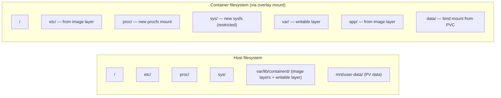
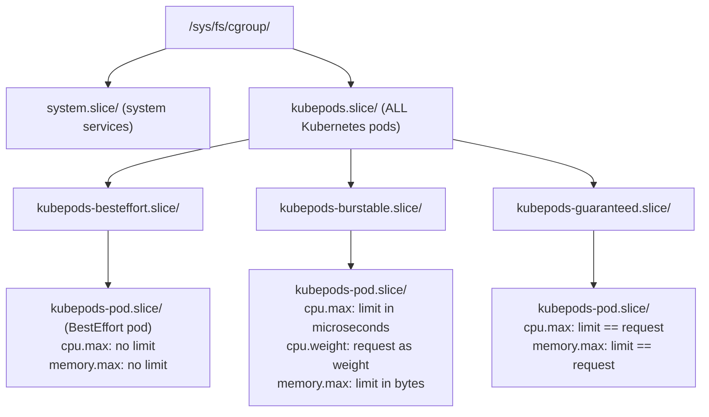

# K8s Handbook Part 2: Linux Foundations

*Part 1 of 3.* Prerequisites: [K8s Handbook Part 1: Infrastructure Evolution](34-k8s-handbook-part1-infrastructure-evolution.md). Maps each critical Linux concept — namespaces, cgroups, eBPF, OverlayFS, networking — to its Kubernetes usage, providing the systems programming foundation that separates platform engineers from platform users.

## Chapter 1: Why Linux Fundamentals Matter for Kubernetes

Kubernetes is not a black box. Every concept in Kubernetes — from Pod isolation to network policy enforcement to resource limits — has a direct, verifiable implementation in the Linux kernel. An architect who understands these foundations can debug production incidents that are invisible to those who treat Kubernetes as magic. They can evaluate security claims, understand performance trade-offs, and make informed decisions about CNI plugins, runtime security tools, and node configuration.

This part maps each critical Linux concept to its Kubernetes usage, providing the systems programming foundation that separates platform engineers from platform users.

> **Key Insight:** When a Kubernetes Pod is scheduled to a node, the kubelet calls the container runtime (containerd), which calls runc, which makes a sequence of Linux system calls to create namespaces, configure cgroups, set up OverlayFS mounts, and launch the container process. Every Kubernetes abstraction ultimately decomposes into Linux kernel calls. Understanding that decomposition is mastery.

### Linux Kernel Concepts — Kubernetes Mapping

| Linux Concept | Kubernetes Usage | Key Files/Commands |
| --- | --- | --- |
| PID namespace | Pod process isolation | `/proc/[pid]/ns/pid` |
| Network namespace | Pod IP isolation | `/proc/[pid]/ns/net`, `ip netns` |
| Mount namespace | Container filesystem view | `/proc/[pid]/ns/mnt` |
| UTS namespace | Pod hostname | `/proc/[pid]/ns/uts` |
| IPC namespace | Shared memory isolation | `/proc/[pid]/ns/ipc` |
| User namespace | Rootless containers | `/proc/[pid]/ns/user` |
| cgroups v2 | CPU/Memory limits, QoS | `/sys/fs/cgroup/` |
| OverlayFS | Container image layers | `mount -t overlay` |
| iptables/nftables | Service networking, NetworkPolicy | `iptables-save`, `nft list` |
| eBPF | Cilium networking, Falco security, Pixie observability | `bpftool`, `bpftrace` |
| seccomp | System call filtering (Pod Security) | `/proc/[pid]/status` |
| AppArmor/SELinux | Mandatory access control | `aa-status`, `sestatus` |
| TLS/socket | kubelet API, etcd communication | `openssl`, `ss`, `netstat` |

## Chapter 2: Processes, Threads, and the Linux Scheduler

### The Linux Process Model

In Linux, everything that executes is a process (or thread, which Linux implements as a lightweight process with shared address space). Each process has a unique PID, owns file descriptors, has a virtual address space, and is associated with a set of credentials (UID, GID). The process is the fundamental unit of execution that Kubernetes manipulates through container isolation.

Key process attributes relevant to Kubernetes:

- **`pid`**: Process ID — unique within a PID namespace (container processes have PIDs starting at 1 within their namespace, but different PIDs on the host)
- **`ppid`**: Parent PID — the init process (PID 1 in container) must handle `SIGCHLD` to reap zombie processes; a key reason Kubernetes recommends `tini` or `dumb-init`
- **`uid`/`gid`**: User and group identity — Kubernetes SecurityContext sets `runAsUser`; user namespaces map container UID 0 to an unprivileged host UID
- **`cwd`**: Current working directory — Kubernetes sets `WORKDIR` from the Dockerfile
- **`fd` table**: File descriptor table — stdin/stdout/stderr are FDs 0/1/2; Kubernetes captures stdout/stderr for `kubectl logs`
- **`mm_struct`**: Memory map — virtual address space; foundation for memory limits enforced by the cgroups memory controller
- **`task_struct`**: Kernel's process descriptor — contains scheduler state, cgroup membership, namespace references, signal handlers

### The Completely Fair Scheduler (CFS)

Linux's default CPU scheduler is the Completely Fair Scheduler (CFS), introduced in kernel 2.6.23. CFS models CPU time as a resource to be shared proportionally among runnable tasks based on their weight (nice value / cgroup `cpu.shares`). Understanding CFS is essential for understanding Kubernetes CPU requests and limits.

**How Kubernetes CPU resources map to kernel scheduling:**

CFS tracks a *virtual runtime* (`vruntime`) for each task — how much CPU time it has consumed. The task with the lowest `vruntime` is scheduled next (the most "unfairly treated" task gets priority). By convention, 1 CPU = 1024 shares:

```
CPU request  → cpu.shares
  Pod with 500m CPU request → 512 shares
  CFS proportionally schedules based on the share ratio

CPU limit  → CFS bandwidth throttling
  cpu.cfs_period_us = 100,000  (100ms default)
  cpu.cfs_quota_us  = period * limit_in_cores

  Example: 500m limit → quota = 100ms * 0.5 = 50ms per period
  Container is throttled to 50ms of CPU per 100ms window
```

> **CRITICAL:** CPU throttling is a common hidden performance problem. A container appears healthy but responses are slow due to CFS throttling. Monitor `container_cpu_cfs_throttled_seconds_total` in Prometheus.

> **Warning — The CPU Throttling Trap:** CPU limits cause CFS bandwidth throttling, which can introduce latency spikes even when average CPU usage is well below the limit. A container using 30% CPU on average can be throttled at 100ms intervals if it has short bursts above the limit. Many teams set CPU limits equal to requests, causing unnecessary throttling. Best practice: set CPU requests (for scheduling) but carefully evaluate whether CPU limits are needed for your workload. For latency-sensitive services, consider setting no CPU limit or a very generous limit.

### Threads vs. Processes in Containers

Linux threads (created with `clone(CLONE_THREAD)`) share the same address space, file descriptors, and most resources as their parent process. The cgroups `pids` controller limits the total number of processes AND threads in a cgroup. This is relevant to Kubernetes because thread-heavy applications (Java with large thread pools, Go goroutines with OS threads) can hit pid limits. Kubernetes exposes this via the PodSpec (`spec.containers[].resources`) and node-level pid limits (`--system-reserved`, `--kube-reserved`).

## Chapter 3: Linux Namespaces — The Isolation Primitive

Linux namespaces are the kernel mechanism that gives each container its isolated view of system resources. When the container runtime creates a container, it calls `clone()` or `unshare()` with namespace flags, creating a new isolated context. The container process sees only the resources within its namespaces.

### PID Namespace

**Created with:** `clone(CLONE_NEWPID)`

The PID namespace gives a process a fresh PID numbering space starting at 1. The first process in the namespace becomes PID 1 — the init process for that namespace. This is why your application container's main process should be PID 1 (or use an init helper like `tini`):

```bash
# On the Kubernetes node, list all processes:
ps aux | grep nginx
# Output shows host PID: nginx 12847 ...

# Inside the nginx container, the same process has PID 1:
kubectl exec -it nginx-pod -- ps aux
# Output: nginx 1 ...

# The container cannot see host PIDs unless shareProcessNamespace: true
# PID 1 must handle signals correctly:
#   SIGTERM (preStop hook) -> SIGTERM -> grace period -> SIGKILL
# If PID 1 doesn't handle SIGTERM, Kubernetes waits the full terminationGracePeriodSeconds
```

**Kubernetes relevance — `shareProcessNamespace`:** When set to `true` in the PodSpec, all containers in the Pod share a single PID namespace. This enables sidecar containers to inspect the processes of the main container — used by debugging sidecars (`kubectl debug` ephemeral containers) and security monitoring agents.

### Network Namespace

**Created with:** `clone(CLONE_NEWNET)`

The network namespace is the most complex and important namespace for Kubernetes. Each Pod gets its own network namespace containing: a loopback interface (`lo`), a virtual ethernet (veth) pair connecting it to the node's network, its own routing table, iptables/nftables rules, and a unique IP address.

**Pod network namespace setup sequence:**

1. kubelet requests pod sandbox creation from the container runtime
2. containerd creates the "pause" container (infra container)
3. The pause container creates the network namespace — all other containers in the Pod *join* this namespace (they do not create new ones)
4. The CNI plugin is called (Calico / Cilium / Flannel)
5. CNI creates a veth pair: `veth0` (Pod namespace) ↔ `veth1` (host namespace)
6. CNI assigns the Pod IP to `veth0` in the Pod namespace
7. CNI configures routing: Pod IP → `veth1` → host routing → node network
8. All containers in the Pod share the same network namespace — they communicate via localhost and share the same IP and ports

**The pause container:** The pause container (`k8s.gcr.io/pause`) is the invisible infrastructure container that holds the Pod's network and IPC namespaces. It runs a minimal C program that simply sleeps, but it's the anchor for all namespace sharing within a Pod. If a container crashes and is restarted, it re-joins the pause container's namespaces, preserving the Pod's IP address.

**Network namespace inspection:**

```bash
# List network namespaces on a Kubernetes node:
ip netns list
# Each pod appears as: cni-XXXXXXXX-XXXX-XXXX-XXXX-XXXXXXXXXXXX

# Enter a pod's network namespace and inspect:
POD_PID=$(crictl inspect $(crictl pods --name nginx -q) | jq -r '.status.pid')
nsenter -t $POD_PID -n ip addr show
nsenter -t $POD_PID -n ip route show
nsenter -t $POD_PID -n ss -tlnp

# Observe iptables rules generated by kube-proxy for Services:
iptables-save | grep KUBE-SVC
```

### Mount Namespace

**Created with:** `clone(CLONE_NEWNS)`

The mount namespace isolates the filesystem view of the container. When a container starts, the container runtime sets up an OverlayFS mount combining the container image layers with a writable layer, then pivots the container's root to this mount. The container sees only its own filesystem, not the host filesystem.

**Mount namespace filesystem layout:**



Kubernetes volume types and their mount-namespace implementation:

| Volume Type | Implementation |
| --- | --- |
| ConfigMap | tmpfs mount + projected files |
| Secret | tmpfs mount (in-memory, not on disk) |
| PVC | bind mount from CSI driver mount point |
| HostPath | bind mount from host path (use with extreme caution) |
| emptyDir | tmpfs or node-local directory bind mount |

### User Namespace (Rootless Containers)

**Created with:** `clone(CLONE_NEWUSER)`

User namespaces map user and group IDs between the container and the host. This enables a critical security feature: running containers as "root" inside the container while mapping that root to an unprivileged user ID on the host. A container process that escapes its namespace cannot access host resources because it is actually a non-privileged host user.

**UID/GID mapping example:**

```bash
# Container sees UIDs 0-65535 mapped to host UIDs 100000-165535:
cat /proc/[container-pid]/uid_map
# Output: 0 100000 65536
# Meaning: container UID 0 (root) = host UID 100000 (unprivileged)

# Kubernetes 1.25+ supports user namespaces in alpha:
# spec:
#   hostUsers: false   # Enable user namespace for this Pod

# Without user namespaces (current default):
#   Container running as UID 0 = HOST root (dangerous if container escapes!)
#   This is why securityContext.runAsNonRoot: true is critical
```

## Chapter 4: Control Groups (cgroups) — Resource Governance

Control Groups (cgroups) are the Linux kernel mechanism for limiting, accounting for, and isolating resource usage of process groups. Kubernetes uses cgroups as the enforcement mechanism for every resource request and limit defined in a Pod spec. Without cgroups, Kubernetes resource management would be advisory only.

### cgroups v1 vs. cgroups v2

cgroups v1 (legacy) used separate subsystem hierarchies for each resource type, leading to inconsistencies and management complexity. cgroups v2 (unified hierarchy, kernel 4.5+, default in major distros since 2020) provides a single, coherent hierarchy with improved resource accounting and support for delegation to unprivileged users.

| Feature | cgroups v1 | cgroups v2 |
| --- | --- | --- |
| Hierarchy | Per-subsystem (cpu, memory, blkio separate) | Single unified hierarchy |
| CPU accounting | `cpu.shares` (proportional) | `cpu.weight` + `cpu.max` (bandwidth) |
| Memory accounting | `memory.limit_in_bytes` | `memory.max`, `memory.high` |
| I/O control | blkio controller (limited) | io controller (complete) |
| Delegation | Difficult, security issues | Safe delegation to unprivileged users |
| Kubernetes default | Pre-2022 clusters | 1.25+ with systemd, modern kernels |
| Rootless containers | Problematic | Fully supported |

### Kubernetes QoS Classes and cgroup Hierarchy

Kubernetes assigns a Quality of Service (QoS) class to every Pod based on its resource specification. This class determines the cgroup priority and eviction behaviour:

| QoS Class | Condition | cgroup Priority | Eviction Priority | OOM Score |
| --- | --- | --- | --- | --- |
| Guaranteed | `requests == limits` for all resources | Highest | Last evicted | -997 (protected) |
| Burstable | `requests < limits` or partial specs | Medium | Middle | Based on usage/request ratio |
| BestEffort | No requests or limits set | Lowest | First evicted | 1000 (first killed) |

**cgroups filesystem layout for a Kubernetes Pod** (cgroups v2 hierarchy, systemd cgroup driver):



```bash
# Inspect a specific pod's memory limit:
POD_UID='xxxxxxxx-xxxx-xxxx-xxxx-xxxxxxxxxxxx'
cat /sys/fs/cgroup/kubepods.slice/kubepods-burstable.slice/kubepods-pod${POD_UID}.slice/memory.max
```

### Memory Management and OOM Killing

When a container exceeds its memory limit, the Linux Out-of-Memory (OOM) killer selects a process to kill. Kubernetes interacts with the OOM killer through OOM score adjustments:

```bash
# OOM score adjustment values (higher = killed first):
#   kubelet sets oom_score_adj for Guaranteed pods: -997
#   kubelet sets oom_score_adj for BestEffort pods: 1000
#   Burstable pods: proportional to usage/request ratio

# Observe current OOM scores:
cat /proc/$(pgrep -n nginx)/oom_score_adj

# memory.high (cgroups v2 only) — soft limit before hard kill:
#   Container gets SIGXFSZ when usage exceeds memory.high
#   This is the "memory throttle" — application can respond before OOM kill
#   Kubernetes exposes this via: resources.requests.memory -> memory.high
```

## Related

- [Part 2: OverlayFS, Networking, iptables & eBPF](parts/35-k8s-handbook-part2-linux-foundations-part2.md)
- [Part 3: Runtime Internals, Kubernetes-Linux Mapping & Troubleshooting](parts/35-k8s-handbook-part2-linux-foundations-part3.md)
