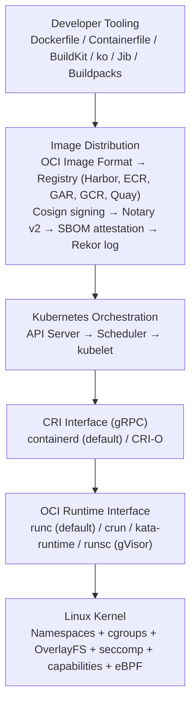
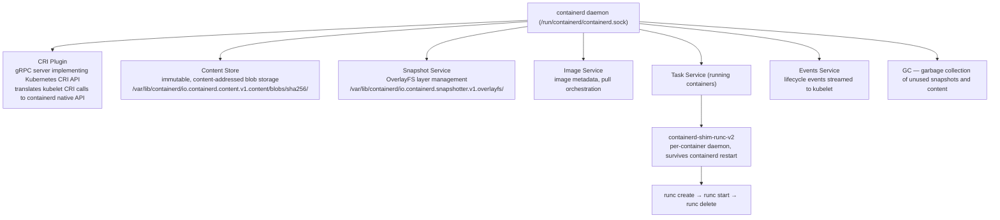
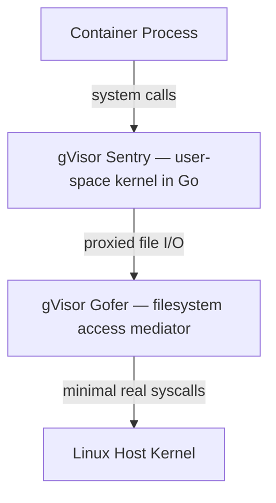
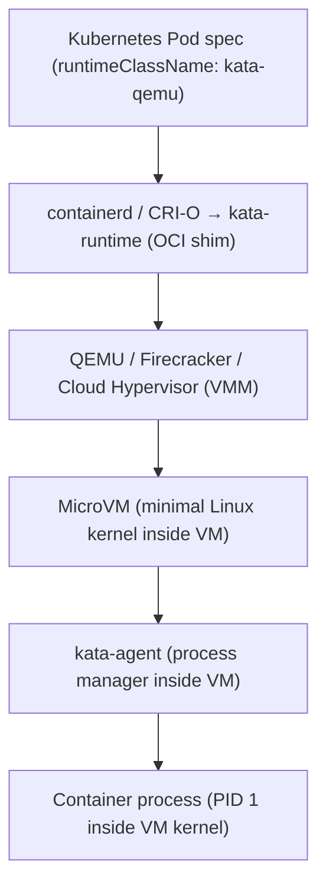

# K8s Handbook Part 3: Containers

*Part 1 of 3.* Prerequisites: [Part 1](34-k8s-handbook-part1-infrastructure-evolution.md) and [Part 2](35-k8s-handbook-part2-linux-foundations.md). A comprehensive technical treatment of container technologies as deployed in production Kubernetes environments: Docker, OCI, runtimes, image security, and the supply chain.

## Chapter 1: Container Technology Overview

This part provides a comprehensive technical treatment of container technologies as deployed in production Kubernetes environments. The focus is depth: not just what containers are, but how every layer of the container stack works internally and how it interacts with Kubernetes.

Modern Kubernetes clusters use containerd or CRI-O as their runtime, interact with OCI-compliant registries, enforce supply chain security through image signing and SBOM, and apply multiple layers of runtime security through seccomp, AppArmor, and eBPF. The naive assumption that Kubernetes uses Docker is false and outdated.

### Container Stack Architecture



> **Key Insight:** Each layer of this stack is independently swappable via open standards. An enterprise can use BuildKit for builds, Harbor for registry, containerd as CRI, and Kata Containers as OCI runtime — all standards-compliant, all interoperable, no vendor lock-in at any layer. Understanding each layer enables informed architectural decisions and precise troubleshooting.

## Chapter 2: Docker Architecture Deep Dive

Docker is both a company and a set of tools. Over time, the original monolithic Docker daemon has been decomposed through standardisation. Understanding this decomposition explains why Kubernetes no longer depends on Docker as a runtime and clarifies how each component of the modern container stack relates to Docker's original architecture.

### Docker Component Architecture (Before and After Decomposition)

```mermaid
flowchart TD
    subgraph ORIG["Original (pre-2016 monolith)"]
        O1["docker CLI"] --> O2["dockerd (monolithic daemon)<br/>handles: images, containers, volumes, networks, build"]
    end
    subgraph CUR["Current (decomposed)"]
        C1["docker CLI"] -->|REST API / Unix socket| C2["dockerd (thin orchestration layer)"]
        C2 -->|gRPC| C3["containerd — donated to CNCF 2017; manages container lifecycle"]
        C3 -->|exec shim| C4["containerd-shim-runc-v2 — per-container daemonized shim"]
        C4 -->|OCI bundle| C5["runc — donated to OCI 2015; reference runtime implementation"]
        C5 -->|Linux syscalls| C6["Linux Kernel (namespaces, cgroups, OverlayFS)"]
    end
    subgraph K8S["Kubernetes path (no Docker at all)"]
        K1["kubelet"] -->|CRI gRPC| K2["containerd (or CRI-O)"]
        K2 -->|exec shim| K3["runc / kata / runsc"]
        K3 --> K4["Linux Kernel"]
    end
```



### The Dockershim Removal — Kubernetes 1.24 (May 2022)

Kubernetes originally included a Docker-specific shim (dockershim) that translated CRI calls to Docker API calls. This was deprecated in 1.20 (December 2020) and removed in 1.24. Impact assessment:

- **Zero impact on most workloads**: OCI-compliant images built with Docker run identically under containerd or CRI-O. No image format changes required.
- **Node tooling migration**: Tooling accessing `/var/run/docker.sock` on nodes (Docker-in-Docker CI, some monitoring agents) required migration to `/run/containerd/containerd.sock` or `crictl` commands.
- **Managed cluster transparency**: GKE, EKS, AKS migrated their node images to containerd automatically; most managed cluster users saw no impact.
- **Self-managed cluster action required**: Clusters running dockershim needed to update node images or reconfigure the runtime before upgrading to 1.24.

### BuildKit — The Modern Docker Build Engine

BuildKit (default in Docker 23+, Docker Desktop 4.0+) is a massively improved build engine providing parallel stage execution, efficient cache management, and secure secret handling during builds:

| Feature | Description | Kubernetes Impact |
| --- | --- | --- |
| Parallel stages | Independent FROM stages build simultaneously | Faster CI pipelines, lower build time |
| Registry cache backend | Cache layers in an OCI registry, not local disk | Consistent cache across CI runners |
| Secret mounts | `RUN --mount=type=secret`; secret not in the layer | API keys never persist in image layers |
| SSH agent mounts | `RUN --mount=type=ssh`; private repos without keys in the image | Secure private dependency access |
| Rootless builds | Build without root; runs as an unprivileged user | Secure CI runners, Tekton pipelines |
| Multi-platform | `--platform linux/amd64,linux/arm64` in a single build | Single CI step for arm64 K8s nodes |
| Inline cache | Embed cache metadata in the image manifest | Registry-based cache sharing |
| Reproducible builds | Deterministic layer hashes with `--no-cache-filter` | SLSA provenance verification |

**Production Dockerfile with BuildKit features:**

```dockerfile
# syntax=docker/dockerfile:1.6

# Stage 1: Dependency resolution (cached separately)
FROM golang:1.22-alpine AS deps
WORKDIR /build
COPY go.mod go.sum ./
# Cache Go module download across builds
RUN --mount=type=cache,target=/root/go/pkg/mod \
    go mod download

# Stage 2: Build (parallel with deps if independent)
FROM deps AS builder
COPY . .
# Cache Go build cache; use SSH for private modules
RUN --mount=type=cache,target=/root/go/pkg/mod \
    --mount=type=cache,target=/root/.cache/go-build \
    --mount=type=ssh \
    CGO_ENABLED=0 GOOS=linux go build \
    -trimpath -ldflags='-s -w' \
    -o /app ./cmd/server

# Stage 3: Minimal production image
FROM gcr.io/distroless/static-debian12:nonroot
COPY --from=builder /app /app
USER nonroot:nonroot
EXPOSE 8080
ENTRYPOINT ["/app"]
```

## Chapter 3: OCI Image and Runtime Specifications

### OCI Image Specification — Internal Structure

The OCI Image Specification defines how container images are stored and distributed. An image consists of three content-addressed components stored in a registry:

**1. Image Index** (optional, for multi-architecture images): a manifest list pointing to per-architecture manifests. `mediaType: application/vnd.oci.image.index.v1+json`

**2. Image Manifest** (per-architecture): `mediaType: application/vnd.oci.image.manifest.v1+json`

```json
{
  "schemaVersion": 2,
  "config": { "digest": "sha256:CONFIG_HASH", "mediaType": "...config.v1+json" },
  "layers": [
    { "digest": "sha256:L1", "mediaType": "...layer.v1.tar+gzip", "size": 12345 },
    { "digest": "sha256:L2", "mediaType": "...layer.v1.tar+gzip", "size": 45678 }
  ]
}
```

**3. Image Configuration**: `mediaType: application/vnd.oci.image.config.v1+json`

```json
{
  "architecture": "amd64",
  "os": "linux",
  "config": {
    "Cmd": ["/app"],
    "Env": ["PATH=/usr/local/bin"],
    "User": "1000:1000",
    "WorkingDir": "/app",
    "ExposedPorts": {"8080/tcp": {}}
  },
  "rootfs": {
    "type": "layers",
    "diff_ids": ["sha256:L1_UNCOMPRESSED", "sha256:L2_UNCOMPRESSED"]
  },
  "history": [
    { "created_by": "RUN apt-get install nginx -y" }
  ]
}
```

### Content Addressing — Why Every Digest Matters

Every blob in an OCI registry is identified by the SHA-256 digest of its content. This content addressing provides fundamental security properties:

- **Immutability**: A blob with a given sha256 digest always contains identical bytes. Content cannot change without the digest changing — detectable tampering.
- **Global deduplication**: The `nginx:alpine` base layer shared by 1000 images is stored once per registry and once per node. Storage scales with unique layers, not with image count.
- **Verifiable pulls**: Pulling by digest (`image@sha256:...`) guarantees the exact content you expect. Pulling by tag does not — tags are mutable pointers.
- **Build cache precision**: Build systems use layer digests to determine cache validity. If the digest matches a cached layer, the build step is skipped exactly.

> **Critical: Always pull by digest in production.** In production Kubernetes deployments, always reference images by digest rather than tag. Tags like `:latest` or `:v1.2.3` are mutable — the underlying image can change without the tag changing, enabling supply chain attacks. Use `image: myregistry.io/myapp@sha256:abc123...` in production PodSpecs. Kyverno can enforce this policy cluster-wide.

### OCI Distribution Specification — Registry API

The OCI Distribution Spec defines the HTTP API for pushing/pulling images:

```
# PULL WORKFLOW:
GET /v2/                                    # Registry discovery
GET /v2/myapp/manifests/v1.0                # Resolve tag to manifest
GET /v2/myapp/manifests/sha256:HASH         # Fetch manifest by digest
GET /v2/myapp/blobs/sha256:L1               # Download layer blob
GET /v2/myapp/blobs/sha256:CONFIG           # Download image config

# PUSH WORKFLOW:
POST /v2/myapp/blobs/uploads/                          # Initiate layer upload
PUT  /v2/myapp/blobs/uploads/UUID?digest=sha256:L1      # Complete upload
PUT  /v2/myapp/manifests/v1.0                           # Create/update tag

# REFERRERS (signatures, SBOMs, attestations):
GET /v2/myapp/referrers/sha256:MANIFEST     # List artifacts referencing image
```

**Tag immutability** (Harbor, ECR, GAR support): registries can be configured to reject overwrites of existing tags, forcing the use of new tags for new content — a basic supply-chain hygiene control.

## Chapter 4: Container Runtimes: containerd, CRI-O, gVisor, Kata

### containerd — The Production Default

containerd (CNCF graduated) is the container runtime used by default in GKE, EKS, AKS, and most modern Kubernetes distributions. It manages the complete container lifecycle: image pulling, storage (snapshots via OverlayFS), container execution, networking handoff to CNI, and metrics.



**Key containerd production configuration:**

```toml
# /etc/containerd/config.toml -- critical production settings
version = 2

[plugins.'io.containerd.grpc.v1.cri']
  sandbox_image = 'registry.k8s.io/pause:3.9'
  max_container_log_line_size = 16384

[plugins.'io.containerd.grpc.v1.cri'.containerd]
  snapshotter = 'overlayfs'
  default_runtime_name = 'runc'

[plugins.'io.containerd.grpc.v1.cri'.containerd.runtimes.runc]
  runtime_type = 'io.containerd.runc.v2'

[plugins.'io.containerd.grpc.v1.cri'.containerd.runtimes.runc.options]
  SystemdCgroup = true   # MUST match kubelet --cgroup-driver=systemd

[plugins.'io.containerd.grpc.v1.cri'.containerd.runtimes.kata]
  runtime_type = 'io.containerd.kata.v2'

[plugins.'io.containerd.grpc.v1.cri'.registry.mirrors]
  [plugins.'io.containerd.grpc.v1.cri'.registry.mirrors.'docker.io']
    endpoint = ['https://harbor.internal.corp/v2/dockerhub-proxy']

[plugins.'io.containerd.gc.v1.scheduler']
  deletion_threshold = 256
  pause_threshold = 0.02
  startup_delay = '100ms'
```

### CRI-O — Kubernetes-Native Runtime

CRI-O (Red Hat, Kubernetes-native) is a lightweight alternative to containerd that implements CRI but nothing else. Unlike containerd (which also serves Docker-compatible workloads), CRI-O is designed purely for Kubernetes. It is the default runtime in Red Hat OpenShift.

| Dimension | containerd | CRI-O |
| --- | --- | --- |
| Primary use | General-purpose (Docker + K8s) | Kubernetes-only |
| Image pull | Built-in | Uses containers/image library |
| Storage | Built-in snapshotter | Uses containers/storage |
| Networking | CNI plugin handoff | CNI plugin handoff (identical) |
| OCI runtime | Pluggable (runc, kata, runsc) | Pluggable (identical) |
| Docker compat | Yes (dockerd can use it) | No Docker support |
| Default in | GKE, EKS, AKS, k3s, RKE2 | OpenShift 4.x |
| Config | `/etc/containerd/config.toml` | `/etc/crio/crio.conf` |
| Debug CLI | `crictl`, `ctr`, `nerdctl` | `crictl`, `podman` |

### gVisor — Application Kernel Sandboxing

gVisor (open-sourced by Google in 2018) implements a user-space kernel that intercepts system calls made by container processes, providing strong isolation without full VM overhead. GKE Autopilot uses gVisor for all workloads.



Two execution modes:
- **ptrace**: intercepts syscalls via ptrace (compatible, ~20% perf overhead)
- **KVM**: hardware assist via `/dev/kvm` (faster, requires nested virt support)

Security properties: separate kernel per container (blast radius containment); ~95% Linux syscall coverage (some apps incompatible); no shared kernel state between containers.

Performance characteristics: CPU-bound workloads ~5% overhead; syscall-heavy (file I/O, network) ~30% overhead; memory allocation moderate overhead; not suitable for GPU workloads (no CUDA support).

### Kata Containers — VM-Level Isolation in Kubernetes

Kata Containers runs each Pod inside a lightweight virtual machine, providing hypervisor-level isolation while maintaining full OCI/CRI compatibility. The standard approach for multi-tenant Kubernetes where different tenants' workloads must not share a Linux kernel.



```yaml
# RuntimeClass configuration:
apiVersion: node.k8s.io/v1
kind: RuntimeClass
metadata:
  name: kata-qemu
handler: kata-qemu
overhead:
  podFixed:
    memory: 120Mi
    cpu: 250m       # VM overhead
scheduling:
  nodeClassification:
  tolerations:
    - key: kata
      operator: Exists
```

### Runtime Selection Decision Matrix

| Runtime | Isolation Boundary | Perf Overhead | Startup | GPU | Best Use Case |
| --- | --- | --- | --- | --- | --- |
| runc | Linux namespaces | &lt;1% | 50ms | Yes (CDI) | Trusted workloads, standard production |
| crun (C impl) | Linux namespaces | &lt;0.5% | 30ms | Yes (CDI) | High-density, perf-critical |
| gVisor (runsc) | User-space kernel | 5–30% | 200ms | No | Untrusted/SaaS, multi-tenant |
| Kata + QEMU | Full VM (QEMU) | 5–10% | 500ms | GPU passthrough | Regulated, high-security multi-tenant |
| Kata + Firecracker | MicroVM | 3–7% | 125ms | Emerging | Serverless-style, fast cold start |
| Kata + Cloud-HV | Lightweight VM | 4–8% | 200ms | Yes (vfio-pci) | Performance + security balance |

## Related

- [Part 2: Image Building, Registry, Optimisation & Supply Chain](parts/36-k8s-handbook-part3-containers-part2.md)
- [Part 3: SBOM, SLSA, Vulnerability Scanning & Runtime Security](parts/36-k8s-handbook-part3-containers-part3.md)
