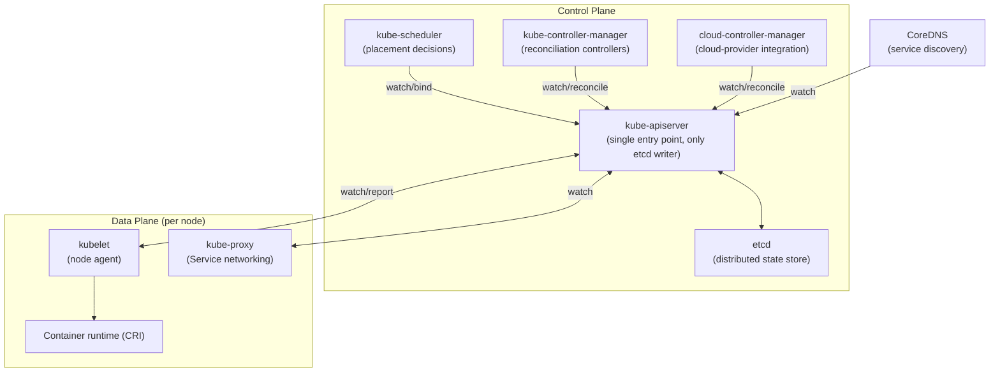

# K8s Handbook Part 4: Kubernetes Internals

*Part 1 of 4.* Prerequisites: [Parts 1](34-k8s-handbook-part1-infrastructure-evolution.md), [2](35-k8s-handbook-part2-linux-foundations.md), and [3](36-k8s-handbook-part3-containers.md). The definitive deep-dive into Kubernetes architecture internals: API Server, etcd, Scheduler, Controller Manager, Cloud Controller Manager, kubelet, kube-proxy, CoreDNS, Admission Controllers, CRDs, Operators, reconciliation loops, scheduling lifecycle, leader election, and HA design.

## Chapter 1: Kubernetes Architecture Overview

Kubernetes is a distributed system with a clear separation between the control plane (which manages cluster state) and the data plane (which runs workloads). Every architectural decision reflects two foundational principles: declarative desired-state management and level-triggered reconciliation. Understanding these principles is more valuable than memorising component names.

### High-Level Architecture



### Key Architectural Principles

- **Declarative desired state**: Users declare WHAT they want (spec), not HOW to achieve it. The system continuously drives actual state toward desired state.
- **Level-triggered reconciliation**: Controllers observe the current state of the world at all times, not just events. A controller that restarts can always recover by re-reading the current state. This is more robust than edge-triggered (event-based) systems.
- **Optimistic concurrency**: All API updates include a `resourceVersion`. Concurrent modifications are detected by version mismatch and the caller must retry. No distributed locks required.
- **Everything is an API object**: Every resource — pods, nodes, namespaces, secrets — is a typed API object stored in etcd and accessible via the API server. This uniformity enables a rich ecosystem of controllers, tools, and GitOps workflows.
- **Extension without forking**: CRDs, Admission Webhooks, and the Operator pattern enable extending Kubernetes capabilities without modifying core code. The ecosystem's depth is built on these extension points.

## Chapter 2: The API Server — Heart of the Control Plane

The API Server (`kube-apiserver`) is the single entry point for all cluster operations. Every component — scheduler, controllers, kubelet, kubectl — interacts exclusively through the API server. It is the only component that reads from and writes to etcd. This centralisation is deliberate: it provides a single point for authentication, authorisation, admission control, and audit logging.

### API Server Responsibilities

- **REST API serving**: Serves the Kubernetes API (REST + gRPC + WebSockets) for all resource types: core (v1), apps, networking, storage, RBAC, and extension APIs.
- **Authentication**: Validates the identity of every request using certificate-based auth, bearer tokens, OIDC, service account tokens, or webhook authentication.
- **Authorisation**: Evaluates RBAC, ABAC, Node authoriser, or webhook authoriser policies to determine if the authenticated identity is permitted to perform the requested action.
- **Admission control**: Mutating admission webhooks modify requests; validating admission webhooks approve or reject them. Built-in admission controllers enforce policy.
- **Object validation**: Validates API objects against their schema before storage.
- **etcd interface**: The only component permitted to read/write etcd. All others use the watch API to receive change notifications.
- **Watch mechanism**: Clients subscribe to change streams. Controllers watch for changes to resources they manage without polling.
- **Audit logging**: Records all API requests and responses for compliance and forensics.

### API Request Processing Pipeline

Every API request traverses this pipeline in order:

1. **Transport security**: TLS termination; certificate validation
2. **Authentication** — who is making this request? Tried in order: X.509 cert, bearer token, OIDC JWT, service account token, webhook, anonymous. Result: username, UID, groups, extra attributes.
3. **Authorisation** — is this identity allowed to perform this action on this resource?
   - RBAC: check Role/ClusterRole bindings
   - Node authoriser: restrict kubelet to its own node's resources
   - Webhook: external policy engine (OPA, custom)
   - Result: ALLOW or DENY (deny by default)
4. **Admission control**:
   - Mutating Webhooks (run first, can modify the object)
   - Object Schema Validation
   - Validating Webhooks (run after mutation, read-only)
   - Built-in controllers: NamespaceLifecycle, LimitRanger, ResourceQuota, ServiceAccount, PodSecurity, etc.
   - Result: object accepted (possibly modified) or rejected
5. **Storage**: object serialised, written to etcd; `resourceVersion` updated (monotonically increasing)
6. **Watch notification**: subscribers (controllers, scheduler, kubelet) notified of the change via their watch streams

### API Groups and Versioning

Kubernetes APIs are organised into groups and versions:

| Group | Path | Example Resources |
| --- | --- | --- |
| Core group (legacy) | `/api/v1` | Pod, Service, ConfigMap, Secret, PersistentVolume, Namespace, Node |
| apps/v1 | `/apis/apps/v1` | Deployment, StatefulSet, DaemonSet, ReplicaSet |
| batch/v1 | `/apis/batch/v1` | Job, CronJob |
| networking.k8s.io/v1 | `/apis/networking.k8s.io/v1` | Ingress, NetworkPolicy, IngressClass |
| storage.k8s.io/v1 | `/apis/storage.k8s.io/v1` | StorageClass, PersistentVolumeClaim |
| rbac.authorization.k8s.io/v1 | `/apis/rbac.authorization.k8s.io/v1` | Role, RoleBinding, ClusterRole |
| autoscaling/v2 | `/apis/autoscaling/v2` | HorizontalPodAutoscaler |
| gateway.networking.k8s.io/v1 | `/apis/gateway.networking.k8s.io/v1` | Gateway, HTTPRoute |

API stability levels: `v1` = Stable GA (no breaking changes without a major version bump); `v1beta1` = Beta (mostly stable, may change); `v1alpha1` = Alpha (may be removed without notice).

```bash
# Discover all API resources:
kubectl api-resources
kubectl api-versions

# Get OpenAPI schema for a resource:
kubectl explain pod.spec.containers.resources
```

### Watch Mechanism — How Controllers Stay in Sync

The watch mechanism is fundamental to Kubernetes' efficiency. Instead of polling the API server, every controller opens a long-lived HTTP connection (chunked transfer encoding) and receives a stream of events (`ADDED`, `MODIFIED`, `DELETED`) for resources it manages:

```
# Watch API:
GET /api/v1/pods?watch=true&resourceVersion=12345

# Server sends events as they occur:
HTTP/1.1 200 OK
Transfer-Encoding: chunked

{"type": "ADDED", "object": {"kind":"Pod", "name":"web-abc", ...}}
{"type": "MODIFIED", "object": {"kind":"Pod", "name":"web-abc", "status":{"phase":"Running"}, ...}}
{"type": "DELETED", "object": {"kind":"Pod", "name":"web-abc", ...}}

# Watch with label selector (controller watches only its resources):
GET /api/v1/pods?watch=true&labelSelector=app%3Dmyapp
```

**Informer pattern** (used by all controllers):
1. LIST (get all current objects + latest `resourceVersion`)
2. WATCH from that `resourceVersion` (get changes since the list)
3. If the watch breaks: re-LIST and re-WATCH from a new `resourceVersion`
4. A local cache (Lister) serves reads without hitting the API server — only watch events go to the API server, a massive scale improvement

### API Server Scalability and HA

The API server is stateless — all state is in etcd. Multiple API server instances can run simultaneously behind a load balancer. Horizontal scaling is straightforward for read-heavy clusters. Write throughput is limited by etcd commit latency.

```
# API server performance tuning:
--max-requests-inflight=400          # max concurrent non-mutating requests
--max-mutating-requests-inflight=200 # max concurrent mutating requests
--request-timeout=60s                # per-request timeout
--watch-cache-sizes=pods#1000        # per-resource watch cache size
--etcd-compaction-interval=5m        # how often etcd compacts history

# Priority and Fairness (APF) -- Kubernetes 1.20+
# Replaces --max-requests-inflight with flow-based rate limiting
# Prevents a single noisy client from starving others
kubectl get flowschemas
kubectl get prioritylevelconfigurations
```

## Chapter 3: etcd — The Distributed State Store

etcd is the only persistent state store in Kubernetes. Every cluster object — every Pod, Deployment, Secret, ConfigMap, Service — exists as a key-value pair in etcd. etcd's correctness guarantees underpin Kubernetes' consistency. Understanding etcd is essential for disaster recovery planning, performance tuning, and understanding why certain cluster operations behave the way they do.

### etcd Architecture and Raft Consensus

etcd uses the Raft distributed consensus algorithm to provide strong consistency guarantees across a cluster of nodes. Raft ensures that all writes are agreed upon by a majority (quorum) of nodes before being committed.

**Raft roles:**
- **Leader**: receives all writes; replicates to followers; sends heartbeats
- **Follower**: replicates the log from the leader; votes in elections
- **Candidate**: intermediate state during leader election

**Write path:**
1. Client sends a write to the leader
2. Leader appends to its log (uncommitted)
3. Leader sends `AppendEntries` RPC to all followers
4. A majority (N/2 + 1) of nodes acknowledge
5. Leader commits the entry; applies it to the state machine
6. Leader notifies followers to commit
7. Response sent to the client

**Quorum requirements:**

| Cluster Size | Quorum Needed | Tolerates |
| --- | --- | --- |
| 3-node | 2 nodes | 1 failure |
| 5-node | 3 nodes | 2 failures |
| 7-node | 4 nodes | 3 failures |

> **Recommendation:** Always run 3 or 5 etcd nodes in production. Never run an even number (split-brain risk without a quorum benefit).

### etcd Key-Value Structure for Kubernetes

Kubernetes stores all objects in etcd under a structured key hierarchy:

```
/registry/pods/default/my-pod
/registry/pods/production/backend-xyz
/registry/deployments/apps/default/nginx-deployment
/registry/services/specs/default/kubernetes
/registry/secrets/default/my-secret
/registry/configmaps/kube-system/kube-proxy
/registry/namespaces/production
/registry/nodes/node-01
```

```bash
# Inspect etcd directly (use with extreme caution in production):
ETCDCTL_API=3 etcdctl \
  --endpoints=https://127.0.0.1:2379 \
  --cacert=/etc/kubernetes/pki/etcd/ca.crt \
  --cert=/etc/kubernetes/pki/etcd/server.crt \
  --key=/etc/kubernetes/pki/etcd/server.key \
  get /registry/pods/default/my-pod -w json | jq .
# Objects are stored as protobuf (binary) -- not human-readable JSON
# Use `kubectl get -o yaml` for human inspection

# List all keys:
etcdctl get / --prefix --keys-only | head -50
```

### etcd Performance and Sizing

| Metric | Target | Impact if Exceeded |
| --- | --- | --- |
| fsync latency (p99) | &lt; 10ms | Leader election instability, watch delays |
| Disk I/O bandwidth | 200+ MB/s SSD | Write bottleneck, compaction lag |
| Database size | &lt; 8GB (default quota) | etcd stops accepting writes |
| Number of objects | &lt; 150,000 total | API server watch cache pressure |
| Network RTT (inter-node) | &lt; 2ms | Raft heartbeat timeouts, elections |
| CPU | Dedicated cores preferred | Scheduler interference causes latency spikes |

### etcd Backup and Disaster Recovery

etcd is the single source of truth for all cluster state. Its loss means complete cluster loss. Backup is non-negotiable:

```bash
# Create an etcd snapshot:
ETCDCTL_API=3 etcdctl snapshot save /backup/etcd-$(date +%Y%m%d-%H%M%S).db \
  --endpoints=https://127.0.0.1:2379 \
  --cacert=/etc/kubernetes/pki/etcd/ca.crt \
  --cert=/etc/kubernetes/pki/etcd/healthcheck-client.crt \
  --key=/etc/kubernetes/pki/etcd/healthcheck-client.key

# Verify snapshot integrity:
ETCDCTL_API=3 etcdctl snapshot status /backup/etcd-20250601-120000.db -w table

# Restore from snapshot (all etcd nodes must be stopped first):
ETCDCTL_API=3 etcdctl snapshot restore /backup/etcd-20250601-120000.db \
  --data-dir=/var/lib/etcd-restored \
  --name=etcd-0 \
  --initial-cluster=etcd-0=https://192.168.1.10:2380 \
  --initial-cluster-token=etcd-cluster-restore \
  --initial-advertise-peer-urls=https://192.168.1.10:2380

# Backup frequency recommendation:
#   Every 30 minutes for production clusters
#   Before every cluster upgrade
#   Store in a separate failure domain from the cluster (S3, GCS, Azure Blob)
```

### etcd Compaction and Defragmentation

etcd retains a history of all revisions (MVCC — Multi-Version Concurrency Control). Without compaction, the etcd database grows unboundedly. Compaction removes old revisions, keeping only a configurable history window:

```bash
# etcd auto-compaction (configured in kube-apiserver):
--etcd-compaction-interval=5m   # compact every 5 minutes

# Manual compaction:
REVISION=$(etcdctl endpoint status --write-out=json | jq -r '.[0].raftIndex')
etcdctl compact $REVISION

# Defragmentation (reclaims disk space after compaction):
# Schedule during a maintenance window -- blocks etcd briefly
etcdctl defrag --endpoints=https://127.0.0.1:2379

# Monitor etcd database size:
etcdctl endpoint status -w table
# Alert when db size > 6GB (approaching the 8GB quota)
# etcd metric: etcd_mvcc_db_total_size_in_bytes
```

## Chapter 4: The Scheduler — Placement Intelligence

The Kubernetes scheduler (`kube-scheduler`) is responsible for selecting the optimal node for each unscheduled Pod. It is a watch-based controller that observes Pods with no `spec.nodeName` set and assigns them to nodes based on a sophisticated multi-factor scoring algorithm. Critically, the scheduler does not place Pods — it only makes placement decisions. The kubelet on the selected node is responsible for actually running the Pod.

### Scheduling Lifecycle

Complete scheduling lifecycle for a single Pod:

1. **Pod created** (`kubectl apply` / controller creates Pod). `spec.nodeName` is empty; Pod enters `Pending` phase.
2. **Scheduler watch** detects the new unscheduled Pod; added to the scheduling queue (sorted by priority).
3. **Filtering phase** (feasibility): for each node, run all Filter plugins — `NodeResourcesFit` (enough CPU/memory), `NodeAffinity` (labels match selector/affinity), `TaintToleration` (Pod tolerates node taints), `PodTopologySpread` (spread constraints satisfied), `VolumeBinding` (required volumes available), `NodeUnschedulable` (node not cordoned), `PodAntiAffinity` (anti-affinity rules not violated). Result: a list of feasible nodes (may be empty → Pod stays Pending).
4. **Scoring phase** (optimisation): for each feasible node, run all Score plugins — `LeastAllocated` (prefer more free resources), `BalancedAllocation` (prefer balanced CPU/memory), `NodeAffinity` (higher score for preferred affinity), `InterPodAffinity` (prefer nodes with affinity Pods), `ImageLocality` (prefer nodes with the image already pulled). Result: a ranked list of nodes with scores.
5. **Node selection**: highest-scoring node selected; ties broken randomly (or by plugin).
6. **Binding**: scheduler writes `Pod.spec.nodeName = selected-node` to the API server; the API server stores the binding in etcd.
7. **kubelet** picks up the bound Pod and starts container creation.

### Scheduling Framework — Extension Points

The scheduling framework (introduced in Kubernetes 1.15) provides structured extension points for customising scheduling behaviour without forking the scheduler:

| Extension Point | Phase | Use Case |
| --- | --- | --- |
| QueueSort | Queue management | Custom Pod priority ordering |
| PreFilter | Before filtering | Pre-compute state used in filtering |
| Filter | Feasibility | Node eligibility (selectors, taints, resources) |
| PostFilter | After filtering | Handle unschedulable pods (preemption logic) |
| PreScore | Before scoring | Pre-compute state used in scoring |
| Score | Optimisation | Rank feasible nodes (affinity preference, balance) |
| NormalizeScore | After scoring | Normalise plugin scores to a 0–100 range |
| Reserve | After selection | Reserve resources (volume binding, IP allocation) |
| Permit | Hold/approve | Delay binding until conditions are met (gang scheduling) |
| PreBind | Before binding | Pre-processing before the API bind call |
| Bind | Binding | Write `nodeName` to the API server (default: `DefaultBinder`) |
| PostBind | After binding | Cleanup, metrics, notifications |

**Scheduler profiles and multiple schedulers.** Kubernetes supports multiple scheduler profiles and custom schedulers. For AI workloads requiring GPU-aware scheduling, the NVIDIA GPU Feature Discovery plugin and custom schedulers (Volcano, YuniKorn) provide gang scheduling and GPU topology awareness:

```yaml
# Use a custom scheduler for AI training jobs:
apiVersion: v1
kind: Pod
metadata:
  name: gpu-training-job
spec:
  schedulerName: volcano   # Use Volcano scheduler for gang scheduling
  containers:
    - name: trainer
      image: nvcr.io/nvidia/pytorch:24.05-py3
      resources:
        limits:
          nvidia.com/gpu: 8   # Request 8 GPUs
# Volcano gang scheduling -- all pods of a job must be schedulable together:
#   Prevents partial allocation where 7/8 workers start but 1 is pending
#   Critical for distributed training (all ranks must start simultaneously)
```

### Node Affinity, Taints, and Tolerations

Three mechanisms control Pod-to-node placement. Understanding their interaction is critical for AI workload scheduling:

| Mechanism | Direction | Hard/Soft | Primary Use Case |
| --- | --- | --- | --- |
| `nodeSelector` | Pod → Node | Hard (required) | Simple label-based placement |
| Node Affinity (required) | Pod → Node | Hard (required) | Complex label expressions |
| Node Affinity (preferred) | Pod → Node | Soft (preferred) | Weighted placement hints |
| Pod Affinity | Pod → Pod | Hard or Soft | Co-locate with specific pods |
| Pod Anti-Affinity | Pod → Pod | Hard or Soft | Spread pods across nodes |
| Taints (`NoSchedule`) | Node → Pod | Hard | Prevent scheduling (no toleration) |
| Taints (`PreferNoSchedule`) | Node → Pod | Soft | Prefer not to schedule |
| Taints (`NoExecute`) | Node → Pod | Hard + Eviction | Evict existing non-tolerating pods |
| Tolerations | Pod → Taint | Enables | Allow scheduling on tainted nodes |
| TopologySpread | Pod → Topology | Hard or Soft | Even distribution across zones/nodes |

```yaml
# Taint GPU nodes to prevent non-GPU workloads from consuming them:
# kubectl taint nodes gpu-node-01 nvidia.com/gpu=true:NoSchedule

# GPU workload Pod spec with toleration:
spec:
  tolerations:
    - key: nvidia.com/gpu
      operator: Exists
      effect: NoSchedule
  nodeSelector:
    accelerator: nvidia-a100   # Only A100 nodes
  containers:
    - resources:
        limits:
          nvidia.com/gpu: 1
```

## Related

- [Part 2: Controller Manager, Cloud Controller Manager & kubelet](parts/37-k8s-handbook-part4-kubernetes-internals-part2.md)
- [Part 3: kube-proxy, CoreDNS, Admission Controllers, CRDs & Operators](parts/37-k8s-handbook-part4-kubernetes-internals-part3.md)
- [Part 4: Leader Election, API Request Lifecycle & Troubleshooting](parts/37-k8s-handbook-part4-kubernetes-internals-part4.md)
