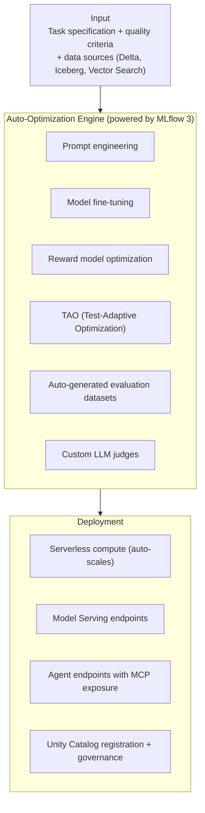
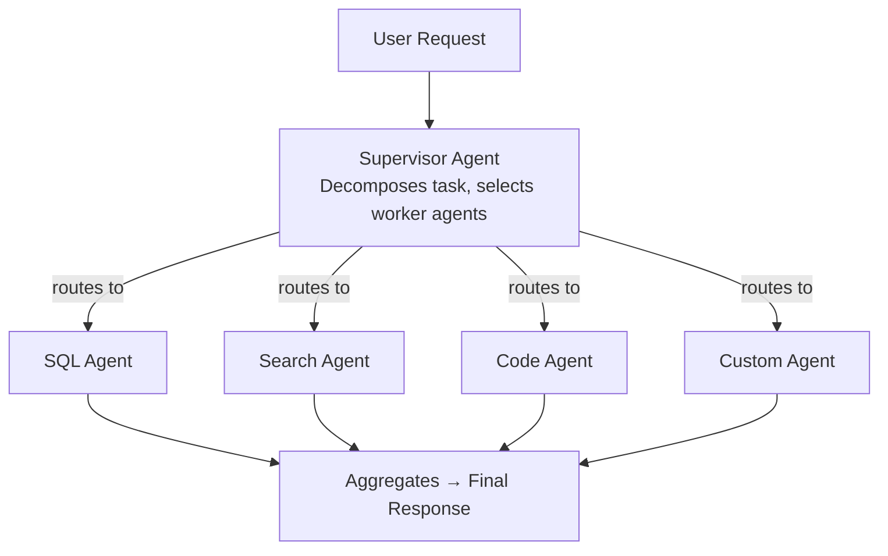
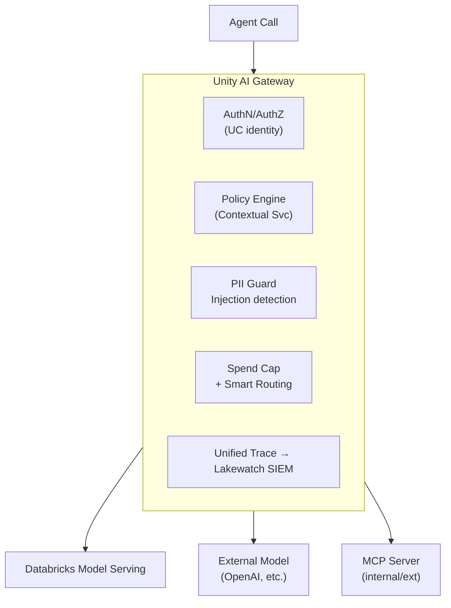
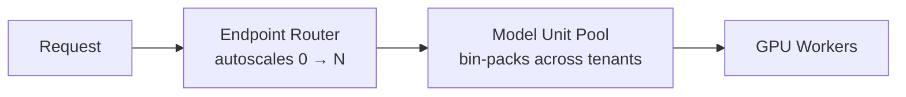
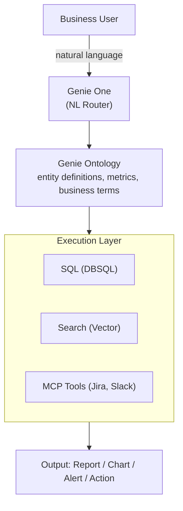
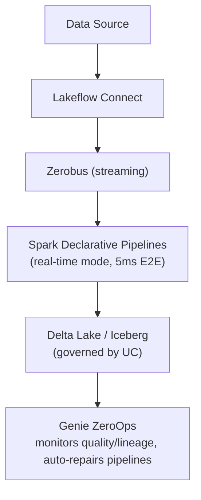
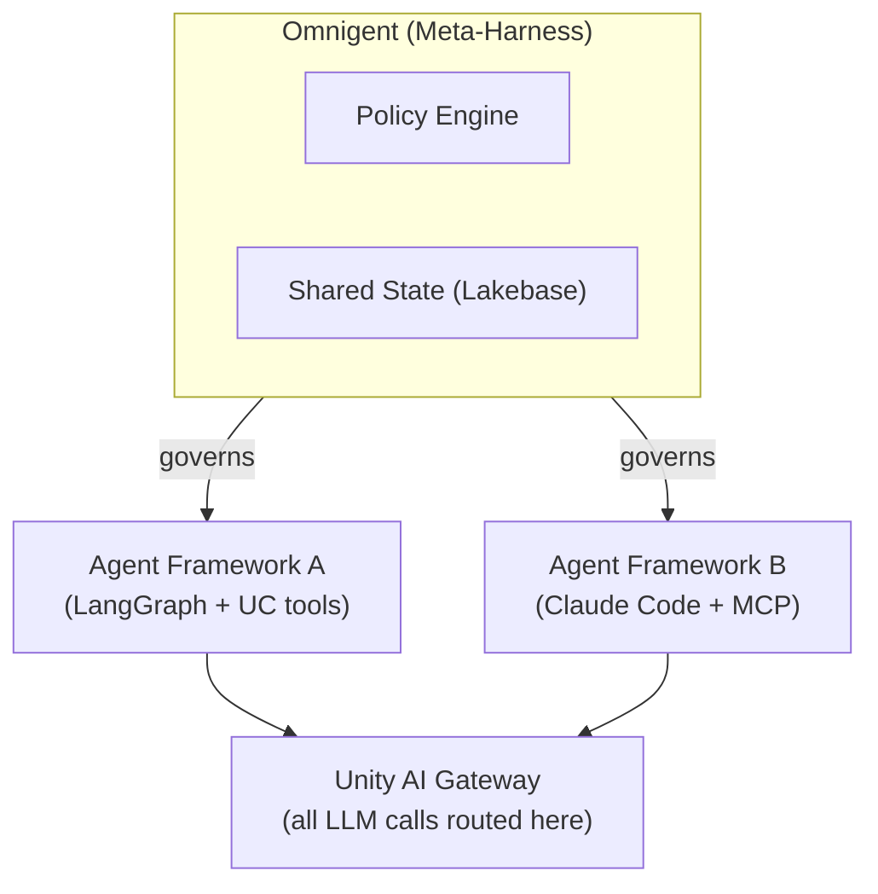

# Databricks Agentic AI, Part 1 — Platform Vision & Agentic Services

*Part 1 of a Databricks agentic-AI platform series.* Covers the platform's strategic pivot to agentic AI and the complete catalog of agentic services announced at Data + AI Summit 2026.

## 1. Why Databricks Is Pivoting to Agentic AI

Databricks' evolution follows a logical architectural arc:

| Era | Focus |
| --- | --- |
| 2012–2016 | Apache Spark — distributed data processing |
| 2017–2020 | Databricks Cloud — managed Spark + collaborative notebooks |
| 2020–2022 | Lakehouse Architecture — unified analytics on open storage |
| 2022–2024 | Lakehouse AI — ML, Feature Store, Model Serving, RAG |
| 2024–2026 | Agentic Enterprise — agents as business process operators |

The strategic thesis is straightforward: **data without action has limited ROI**. Databricks observed that every enterprise AI project eventually becomes a question of "who decides what?" and "how do we govern what the AI does?" The answer is to extend the governance framework enterprises already trust (Unity Catalog for data) upward to cover **agent identities, runtime behavior, model calls, and tool invocations**.

### The Agentic Enterprise Control Plane

At Data + AI Summit 2026 (June 15–18, Moscone, San Francisco, ~30,000 attendees), Databricks articulated the Lakehouse as the **agentic enterprise control plane** — the layer where:

- Agents **read and write governed data** (Delta Lake, Iceberg, Lakebase)
- Agents **execute governed tools** (Unity Catalog Functions, MCP servers)
- Agents **are themselves governed** (Unity AI Gateway, Omnigent)
- Agent behavior is **fully observable** (MLflow 3 Tracing, Lakewatch)
- Business context is **always current** (Genie Ontology)

### Data Intelligence Platform

The overarching brand is **Data Intelligence Platform** — the idea that the platform doesn't just store data but understands it semantically (via Genie Ontology, Unity Catalog Metrics, business glossary) and acts on it (via agents). This distinguishes Databricks from pure-play data warehouses (Snowflake) and pure-play AI platforms (Vertex AI, Bedrock).

## 2. Databricks Agentic Services — Complete Catalog

### 2.1 Agent Bricks (GA)

**Purpose:** The primary developer platform for building, optimizing, evaluating, and deploying AI agents.

**Key Architecture:**



**Components:**
- **Agent Bricks Custom Agents** — build agents using any model (Databricks DBRX, Llama, GPT-4o, Claude, Gemini) and any harness (LangChain, LangGraph, OpenAI Agents SDK, CrewAI, Semantic Kernel)
- **Knowledge Assistant** — managed RAG agent with no-code configuration, backed by Vector Search
- **Supervisor Agent** — managed multi-agent orchestrator; routes subtasks to specialist agents
- **Agent Evaluation** — automated evaluation via MLflow 3; integrated since May 2026

**Scale:** 100,000+ agents built; 1+ quadrillion tokens/year as of DAIS 2026.

**Deployment Options:**

| Mode | Use Case | Latency | Cost |
| --- | --- | --- | --- |
| Serverless Compute | Stateless agents | Variable | Pay-per-use |
| Dedicated Compute | High-throughput agents | Consistent | Reserved capacity |
| Batch Inference | Offline evaluation/enrichment | Throughput-optimized | Lowest |

**Limitations:**
- Agent state persistence requires external store (Lakebase) or managed memory (in preview)
- Very long-running agents (hours) not yet first-class; use Lakeflow Jobs for orchestration
- Multi-modal tool invocations (video, audio) limited to select model endpoints

**Pricing:** Consumed as DBUs on serverless compute; Model Serving priced separately per Model Units (see Section 2.9).

### 2.2 Mosaic AI Agent Framework (GA)

**Purpose:** The lower-level SDK and API surface for building production agents with full control over tool selection, memory, and orchestration logic.

**Core APIs:**

```python
from databricks.agents import AgentBuilder, Tool, MLflowTracer

# Define tools from Unity Catalog functions
tools = [
    Tool.from_uc_function("catalog.schema.my_tool"),
    Tool.from_mcp_server("databricks-managed://genie"),
    Tool.from_vector_search("catalog.schema.my_index"),
]

# Build agent with MLflow 3 tracing
agent = AgentBuilder(model="databricks-meta-llama-3-70b-instruct") \
    .with_tools(tools) \
    .with_system_prompt(prompt_registry.get("my_system_prompt", version=3)) \
    .with_tracer(MLflowTracer()) \
    .build()
```

**Components:**
- Tool registry backed by Unity Catalog Functions
- Managed MCP servers (Genie, Vector Search, DBSQL, Unity Catalog Functions)
- Native LangChain/LangGraph adapters via `databricks-langchain` package
- `UCFunctionToolkit` for wrapping UC functions as agent tools

### 2.3 Supervisor Agent (GA)

**Purpose:** Managed multi-agent orchestrator that decomposes tasks and routes to specialist agents.

**Architecture:**



**State Management:** Supervisor maintains execution state across sub-agent calls using Lakebase for durability; supports checkpoint and resume.

### 2.4 Unity AI Gateway (Beta — announced June 2026)

**Purpose:** Runtime governance layer sitting between agents and every model/tool/MCP service they call.

**What it Governs:**
- Authentication and authorization per-call
- Hard spend caps and soft budget alerts
- Smart routing (cost vs quality routing)
- PII detection and masking on I/O
- Prompt injection detection
- Contextual Service Policies (allow/deny/require-approval per action context)
- Unified trace capture for all agent activity

**Contextual Service Policies (Beta):**
- Unlike static RBAC, policies evaluate **interaction context**: who the user is, what the agent is trying to do, and in what application context
- Example: Agent may write to `/reports/` but not `/prod/` — enforced at runtime, not prompt-layer
- Policy violations trigger audit events captured in Lakewatch (Databricks' lakehouse-native SIEM)

**Architecture:**



### 2.5 Agent Evaluation (GA — MLflow 3 integrated, May 2026)

**Purpose:** Automated and human-in-the-loop quality assessment for agents.

**Evaluation Types:**

| Type | Mechanism | When Used |
| --- | --- | --- |
| **LLM-as-judge** | Built-in scorers (relevance, groundedness, safety) | Dev-time eval |
| **Custom judges** | User-defined LLM prompts evaluating domain criteria | Domain-specific quality |
| **Human feedback** | Labeling UI in MLflow 3 | Gold standard annotation |
| **Production traces** | Continuous eval from live traffic | Drift detection |

**Key Metrics Available:**
- Groundedness (is the answer supported by retrieved context?)
- Relevance (does the response answer the question?)
- Safety (PII, toxicity, injection)
- Tool correctness (did the agent call the right tool with correct parameters?)
- Latency, token cost per interaction

**Integration Point:** `mlflow.genai.evaluate()` replaces the old `databricks.agents.evaluate()` API as of MLflow 3.1.

### 2.6 Model Serving / AI Inference (GA)

**Purpose:** Production inference infrastructure for LLMs, embedding models, and custom models.

**Endpoint Types:**

| Type | Description | Pricing |
| --- | --- | --- |
| **Foundation Model APIs** | Pay-per-token access to Llama, DBRX, Mixtral | Per token |
| **External Model** | Proxy to OpenAI, Anthropic, Azure OpenAI, Google Gemini | Pass-through |
| **Custom Model** | Deploy fine-tuned or custom models | Per Model Unit |
| **Feature & Function** | Serve feature lookups as real-time endpoints | Per request |

**Model Units (2026):** New abstraction for multi-tenant LLM inference on shared GPU infrastructure. Enables 80% GPU cost reduction vs dedicated endpoints by bin-packing requests. Dynamically allocates GPU compute based on request load; no cold-start penalty for steady traffic.



**Performance:** Model Serving endpoints can serve up to 1,000+ QPS with P99 &lt; 500ms for 7B parameter models on dedicated compute.

### 2.7 Genie One (GA — June 2026)

**Purpose:** Agentic AI coworker for business users; democratizes AI-powered work without code.

**Capabilities:**
- Natural-language analytics against governed data (SQL generation via Genie Ontology)
- Document and report generation
- Interactive charts and dashboards
- Scheduled tasks and monitoring alerts
- Action execution via MCP tools
- Cross-app integration: Google Drive, Jira, Slack, Salesforce, and 50+ apps

**Technical Architecture:**



**Genie Products Family:**

| Product | Status | Purpose |
| --- | --- | --- |
| Genie One | GA | Agentic coworker (web, iOS, Android) |
| Genie Agents | GA | Custom agentic workflows |
| Genie Code | GA | AI-powered data engineering |
| Genie Ontology | GA | Self-improving context/knowledge layer |
| Genie ZeroOps | Private Preview | Autonomous pipeline operations |
| Genie App Builder | Private Preview | No-code agentic app construction |

### 2.8 Lakeflow — Agentic Data Engineering (GA)

**Purpose:** Unified platform for ingestion, transformation, and orchestration of data pipelines with AI-assisted authoring and autonomous operations.

**Components:**

| Component | Function | Status |
| --- | --- | --- |
| **Lakeflow Connect** | 100+ connector ingestion | GA |
| **Zerobus Ingest** | High-volume event streaming (5ms latency) | GA |
| **Spark Declarative Pipelines** | SQL/Python streaming + batch with real-time mode | GA |
| **Lakeflow Designer** | Visual drag-and-drop pipeline builder with NL prompts | GA |
| **Lakeflow Jobs** | Workflow orchestration engine | GA |
| **Genie Code** | AI-accelerated pipeline authoring in IDEs | GA |
| **Genie ZeroOps** | Autonomous monitoring, root-cause analysis | Private Preview |

**Agentic Engineering Pattern:**



### 2.9 Omnigent — Multi-Agent Meta-Harness (GA Open Source, June 2026)

**Purpose:** Apache 2.0 open-source meta-harness that sits above individual agent frameworks, providing composition, control, and collaboration governance outside the LLM prompt.

**The Problem it Solves:** When governance rules live inside the model prompt, agents can reason around them. Omnigent enforces governance in the infrastructure layer, making policies inviolable regardless of which model or harness is in use.

**Three Pillars:**

| Pillar | What it Does |
| --- | --- |
| **Composition** | Combine agents from Claude Code, Codex, GitHub Copilot, custom agents into coordinated multi-agent systems |
| **Control** | Enforce filesystem, network, cost, and HITL constraints outside the prompt |
| **Collaboration** | Share agents, skills, and state across teams with versioning |

**Integration with Databricks Stack:**



**Governance without Prompts:**
- Policies are expressed as configuration (YAML/JSON), not prompt text
- Filesystem controls: deny writes to `/prod/`, allow only `/sandbox/`
- Network controls: whitelist only approved API endpoints
- Cost controls: per-agent token budget, per-session spend cap
- Human-in-the-loop: require approval before specific tool invocations

### 2.10 Summary: Complete Agentic Services Capability Map

| Build | Optimize | Deploy | Govern | Observe |
| --- | --- | --- | --- | --- |
| Agent Bricks | Auto-Prompt | Model Serving | Unity AI Gateway | MLflow 3 Tracing |
| Mosaic AI Framework | Fine-tuning | Serverless | Omnigent | Lakewatch |
| Supervisor Agent | TAO | Agent Endpoints | UC Agent Registry | Evaluation |
| Genie Code | Reward Models | Lakeflow Jobs | RBAC/ABAC | Quality Judges |
| Custom Agents | MLflow Eval | Batch Inference | PII Guards | Cost Tracking |
| | Prompt Registry | Edge Deploy | | |

## Related

- [Part 2: Agent Lake, Agent Architecture & Multi-Agent Orchestration](44-part-02-agent-lake-architecture.md)
- [Part 3: Mosaic AI & MLflow 3](45-part-03-mosaic-ai-mlflow.md)
