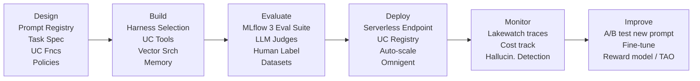
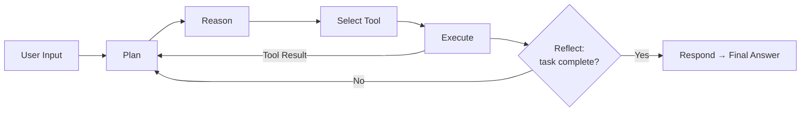
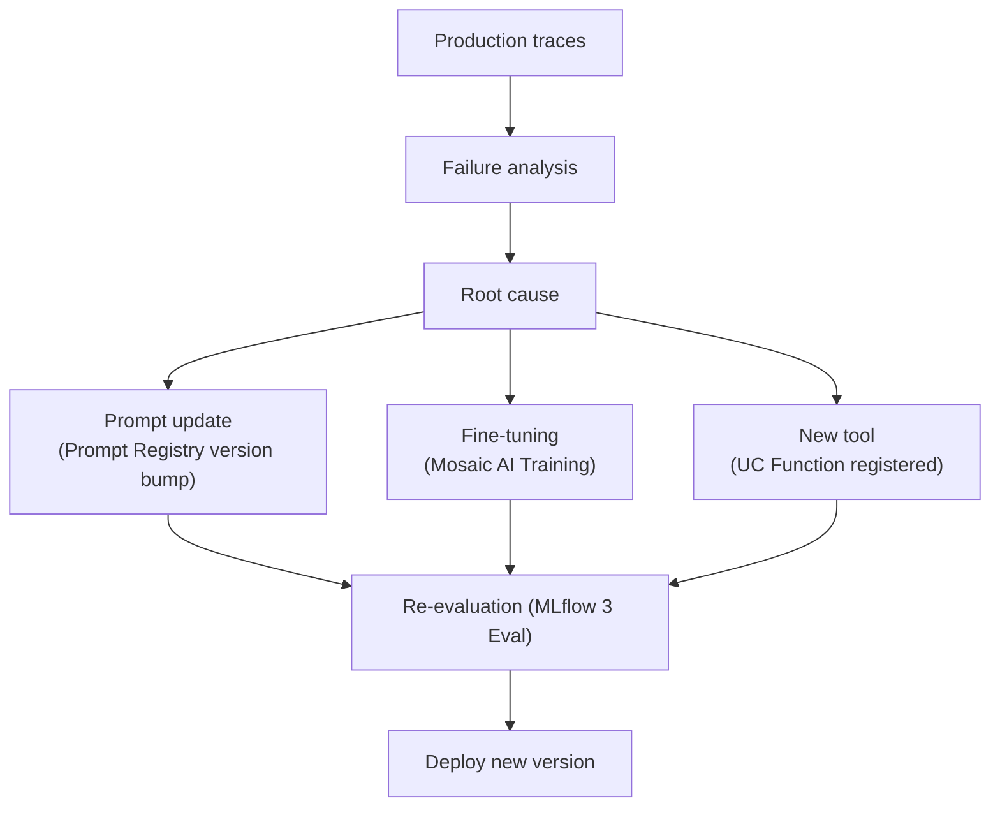
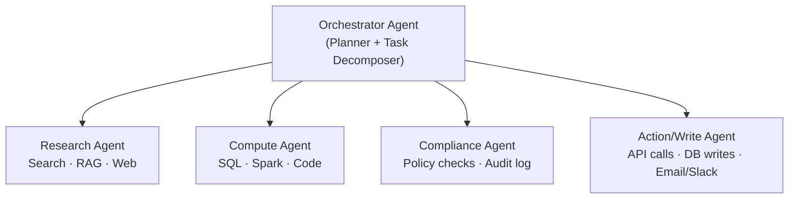
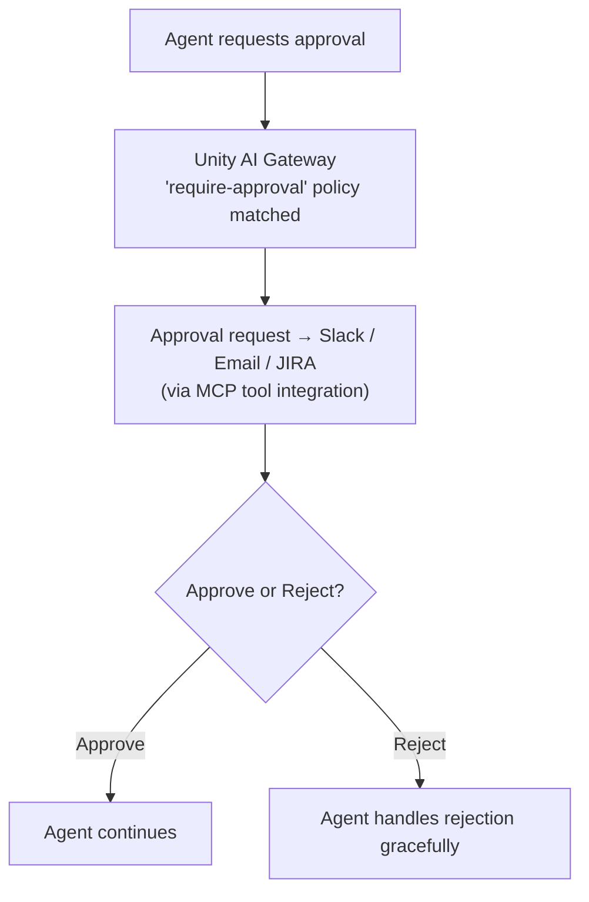

*Part 2 of the [Databricks Agentic AI series](43-part-01-platform-vision-agentic-services.md).* Covers the Agent Lake concept, the agent lifecycle, memory architecture, and multi-agent orchestration patterns.

## 1. Agent Lake — Concept Clarification

"Agent Lake" is **not a formally released Databricks product** as of July 2026 — it does not appear in official documentation, press releases, or keynotes under that exact name. However, the **architectural concept it describes is real and implemented** through a combination of existing Databricks services.

### What Agent Lake Would Mean

The term describes the **lakehouse as a persistence substrate for all agent artifacts**:

| Agent Lake Object | Where It Lives in Databricks Today |
| --- | --- |
| Agent definitions (code, config) | MLflow Model Registry (UC-backed) |
| Prompt versions | MLflow Prompt Registry |
| Tool/skill definitions | Unity Catalog Functions |
| Agent evaluation history | MLflow Experiments + Traces |
| Agent execution logs | MLflow Tracing → Delta Lake |
| Short-term memory (session) | Lakebase (Postgres), or in-context |
| Long-term memory (semantic) | Mosaic AI Vector Search (Delta-backed) |
| Knowledge artifacts | Delta Lake tables + Vector Search indexes |
| Planning checkpoints | Lakebase + MLflow Tracking |
| Agent versions | MLflow Model Registry versions |
| Agent lineage | Unity Catalog Lineage graph |
| Policy definitions | Unity AI Gateway (contextual service policies) |

### Closest Marketing Analogy

The concept closest to "Agent Lake" is what Databricks calls the **Genie Ontology** as a knowledge layer + **Unity Catalog** as the governance and registry layer + **Lakebase** as the operational state store + **MLflow 3** as the lifecycle and tracing substrate. Together these four create the agent persistence architecture.

### How It Differs from Adjacent Concepts

| Concept | Focus | Agent Lake Relationship |
| --- | --- | --- |
| **Knowledge Lake** | Enterprise knowledge graphs, ontologies, semantic layers | Agent Lake includes knowledge assets but adds agent-specific metadata |
| **Feature Store** | ML training feature pipelines | Agent Lake supersedes; agents use Vector Search and UC Functions, not a separate Feature Store |
| **Model Registry** | ML model versioning and lineage | Agent Lake extends Model Registry to include prompts, tools, policies, and evaluation history |
| **Unity Catalog** | Data and AI asset governance | Agent Lake uses Unity Catalog as its governance and discovery layer |
| **MLflow** | Experiment tracking and deployment | Agent Lake uses MLflow for lifecycle management but adds operational state (Lakebase) |
| **Lakehouse** | Open-format data storage + analytics | Agent Lake is the agent-native extension of the Lakehouse |

## 2. Agent Lifecycle



### Phase 1: Design

**Artifacts produced:**
- System prompt (stored in MLflow Prompt Registry with version)
- Tool selection (Unity Catalog Functions chosen; MCP servers selected)
- Evaluation criteria (LLM judge definitions)
- Contextual service policy (what actions the agent is allowed to take)
- Knowledge sources (Vector Search index, UC tables, Lakebase projections)

### Phase 2: Build

**Execution Pattern (ReAct/Tool-Use Loop):**



**Key Design Decisions at Build Time:**

1. **Planning approach:** ReAct (Reasoning + Acting), CoT (Chain-of-Thought), or structured planning (LLM generates JSON plan, executor runs steps)
2. **Memory strategy:** What persists across turns, what stays in-context
3. **Tool invocation pattern:** Single-tool sequential vs parallel tool calling
4. **Harness selection:** LangGraph (fine-grained control), CrewAI (role-based), OpenAI SDK (lightweight), Semantic Kernel (.NET-first)

### Phase 3: Evaluate

**MLflow 3 Evaluation Pipeline:**

```python
import mlflow

with mlflow.start_run():
    results = mlflow.genai.evaluate(
        model=my_agent,
        data=eval_dataset,         # auto-generated by Agent Bricks or human-curated
        scorers=[
            mlflow.genai.scorers.groundedness(),
            mlflow.genai.scorers.relevance_to_query(),
            mlflow.genai.scorers.safety(),
            mlflow.genai.scorers.tool_call_quality(),
            my_custom_domain_judge,
        ]
    )
```

**Evaluation Dataset Sources:**
- Auto-generated by Agent Bricks from task specification (synthetic)
- Human-annotated via MLflow 3 labeling UI
- Production traces replayed in evaluation (canary evaluation)
- Golden dataset in Delta Lake table

### Phase 4: Deploy

**Deployment Checklist:**
- [ ] Agent registered in Unity Catalog (`catalog.schema.agent_name`)
- [ ] System prompt version pinned (MLflow Prompt Registry)
- [ ] Tools registered and permission-scoped (UC Functions)
- [ ] Contextual Service Policy defined (Unity AI Gateway)
- [ ] Endpoint configured (serverless vs dedicated compute)
- [ ] Monitoring thresholds set (quality, cost, latency)
- [ ] Lakewatch trace collection enabled

### Phase 5: Monitor

**What Gets Traced (MLflow 3 + Unity AI Gateway):**
- Every LLM call: model, prompt, response, tokens, latency, cost
- Every tool invocation: tool name, input, output, duration
- Every retrieval: query, retrieved docs, relevance scores
- Every policy check: allow/deny/approval-required decisions
- Human feedback events

**Continuous Quality Assessment:**
- Online LLM judges run against sampled production traces
- Groundedness scores monitored for drift
- Cost per successful outcome tracked (unit economics)
- Failure modes classified (hallucination, wrong tool, timeout, policy block)

### Phase 6: Improve

**Improvement Loop:**



## 3. Memory Architecture

### Memory Taxonomy

| Memory Type | Duration | Implementation | Use Case |
| --- | --- | --- | --- |
| **Working / In-Context** | Single request | LLM context window | Immediate reasoning |
| **Session / Short-Term** | Single conversation | Lakebase (Postgres) or in-memory store | Multi-turn dialogue |
| **Long-Term Semantic** | Persistent | Mosaic AI Vector Search (Delta-backed) | Episodic recall, user preferences |
| **Procedural** | Persistent | MLflow Prompt Registry + UC Functions | Learned skills, reusable procedures |
| **Organizational** | Enterprise-wide | Genie Ontology | Shared business context |

### Session Memory Pattern (Lakebase)

```python
# Session memory backed by Lakebase (Postgres on Delta)
import psycopg2

conn = psycopg2.connect(LAKEBASE_CONN_STRING)

def save_turn(session_id, role, content, metadata):
    with conn.cursor() as cur:
        cur.execute("""
            INSERT INTO agent_memory.conversation_turns
            (session_id, role, content, metadata, ts)
            VALUES (%s, %s, %s, %s, NOW())
        """, (session_id, role, content, metadata))
    conn.commit()

def load_session_context(session_id, max_turns=20):
    with conn.cursor() as cur:
        cur.execute("""
            SELECT role, content FROM agent_memory.conversation_turns
            WHERE session_id = %s ORDER BY ts DESC LIMIT %s
        """, (session_id, max_turns))
        return cur.fetchall()[::-1]  # reverse to chronological
```

### Long-Term Memory Pattern (Vector Search)

```python
from databricks.vector_search.client import VectorSearchClient

client = VectorSearchClient()
index = client.get_index(
    endpoint_name="agent-memory-endpoint",
    index_name="catalog.agent_schema.user_memory_index"
)

def store_memory(content, user_id, metadata):
    index.upsert(
        columns=["id", "content", "user_id", "metadata"],
        data=[[generate_id(), content, user_id, json.dumps(metadata)]]
    )

def retrieve_relevant_memories(query, user_id, top_k=5):
    return index.similarity_search(
        query_text=query,
        columns=["content", "metadata"],
        filters={"user_id": user_id},
        num_results=top_k
    )
```

### Memory Governance

- All memory stored in Delta/Iceberg tables inherits **Unity Catalog** access control
- Row-level security ensures users only access their own memories
- Column masking protects PII in stored context
- Retention policies implemented via Delta Lake time travel + VACUUM schedules
- Memory encryption at rest via cloud KMS (BYOK supported)

## 4. Multi-Agent Orchestration Patterns

### 4.1 Hierarchical Agent Topology



**Implementation with Supervisor Agent:**
- Supervisor Agent (GA) handles task decomposition and worker routing
- State shared via Lakebase (persistent) + Unity AI Gateway traces
- Each worker agent independently governed — policies enforced per-agent by Unity AI Gateway

### 4.2 Graph Execution Pattern (LangGraph on Databricks)

```python
from langgraph.graph import StateGraph, END
from databricks_langchain import ChatDatabricks

# Define agent state
class AgentState(TypedDict):
    messages: List[BaseMessage]
    next_action: str
    plan: List[str]
    results: Dict[str, Any]

graph = StateGraph(AgentState)

# Add nodes
graph.add_node("planner", plan_task)
graph.add_node("researcher", research_task)
graph.add_node("coder", code_generation)
graph.add_node("reviewer", review_output)

# Add edges with conditional routing
graph.add_conditional_edges(
    "planner",
    route_to_worker,
    {"research": "researcher", "code": "coder", "done": END}
)

# All LLM calls route through Unity AI Gateway automatically
# when using ChatDatabricks with serving endpoint
llm = ChatDatabricks(endpoint="databricks-meta-llama-3-70b-instruct")
```

### 4.3 Failure Recovery and Checkpointing

**Checkpoint Strategy with Lakebase:**

```sql
-- Lakebase table for agent checkpoints
CREATE TABLE agent_orchestration.checkpoints (
    run_id      UUID PRIMARY KEY,
    agent_id    TEXT,
    step_index  INTEGER,
    state       JSONB,
    status      TEXT,  -- running, completed, failed, paused
    created_at  TIMESTAMPTZ DEFAULT NOW(),
    updated_at  TIMESTAMPTZ DEFAULT NOW()
);

-- Branch support (Lakebase git-style branching)
-- Allows "what-if" replay without affecting production
SELECT lakebase.create_branch('checkpoints', 'replay-branch-2026-07-16');
```

**Recovery Pattern:**
1. On failure, agent state is persisted to Lakebase checkpoint
2. Failed step is logged with exception details to MLflow Traces
3. Human review optionally triggered (HITL via Unity AI Gateway policy)
4. On resume: load checkpoint, skip completed steps, replay from failure point
5. Rollback available: revert to any prior checkpoint (Lakebase branching)

### 4.4 Human-in-the-Loop (HITL) Integration

**Trigger Points:**

| Trigger | Mechanism | Databricks Implementation |
| --- | --- | --- |
| High-risk action | Contextual Service Policy → require-approval | Unity AI Gateway |
| Low confidence | Agent self-assessment score below threshold | Custom scorer → pause |
| Policy flag | PII detection, anomalous tool use | Unity AI Gateway → alert |
| Escalation | Agent cannot resolve within N iterations | Timeout → human queue |
| Manual override | Business rule requiring human sign-off | Workflow gate in Lakeflow Jobs |

**HITL Workflow:**



### 4.5 Concurrency and Deadlock Prevention

**Patterns supported:**
- **Parallel tool invocation:** Multiple tools called simultaneously within single agent turn (native in LangGraph)
- **Concurrent agent runs:** Lakeflow Jobs manages parallel agent execution with dependency graphs
- **Resource locking:** Lakebase advisory locks prevent concurrent writes to same state
- **Queue-based coordination:** Zerobus event streams as inter-agent message buses

## 5. Planning and Reasoning Patterns

### ReAct Pattern (Most Common)

The **ReAct** (Reason + Act) pattern is Databricks' default for conversational agents:

```
Thought: I need to find Q3 revenue figures
Action: sql_query(SELECT SUM(revenue) FROM sales WHERE quarter='Q3-2026')
Observation: Result = $47.3M
Thought: Now I need to compare to Q2
Action: sql_query(SELECT SUM(revenue) FROM sales WHERE quarter='Q2-2026')
Observation: Result = $41.8M
Thought: I can now calculate growth
Action: calculate(growth_rate(47.3, 41.8))
Observation: Growth rate = 13.2%
Response: Q3 revenue of $47.3M represents 13.2% growth over Q2 ($41.8M)
```

### Plan-Execute Pattern (Complex Tasks)

For multi-step tasks where upfront planning reduces token waste:

```
PLAN PHASE (once):
  1. Retrieve current quarter financials
  2. Compare to prior quarters (3 periods)
  3. Identify top 3 contributing factors
  4. Draft executive summary

EXECUTE PHASE (sequentially or in parallel where safe):
  Step 1 → sql_agent(step_1_query)
  Step 2 → sql_agent(step_2_query)  [parallel with step 1 possible]
  Step 3 → analysis_agent(step_3_analysis, results=[step_1, step_2])
  Step 4 → writing_agent(step_4_draft, context=step_3_result)
```

### Reflection Pattern

Used in Agent Bricks' self-improvement loop:

```
Generate response → Self-evaluate against criteria →
  Score < threshold? → Reflect on failure → Regenerate
  Score >= threshold? → Return response
```

## Related

- [Part 1: Platform Vision & Agentic Services](43-part-01-platform-vision-agentic-services.md)
- [Part 3: Mosaic AI & MLflow 3](45-part-03-mosaic-ai-mlflow.md)
