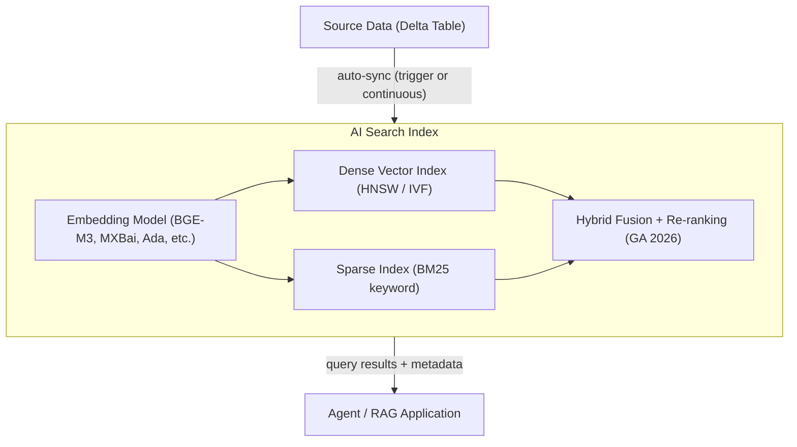
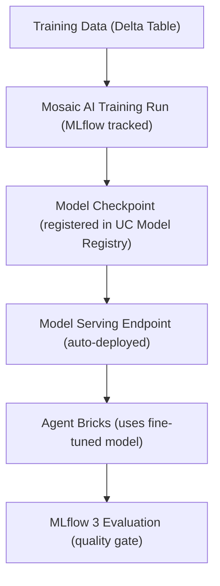
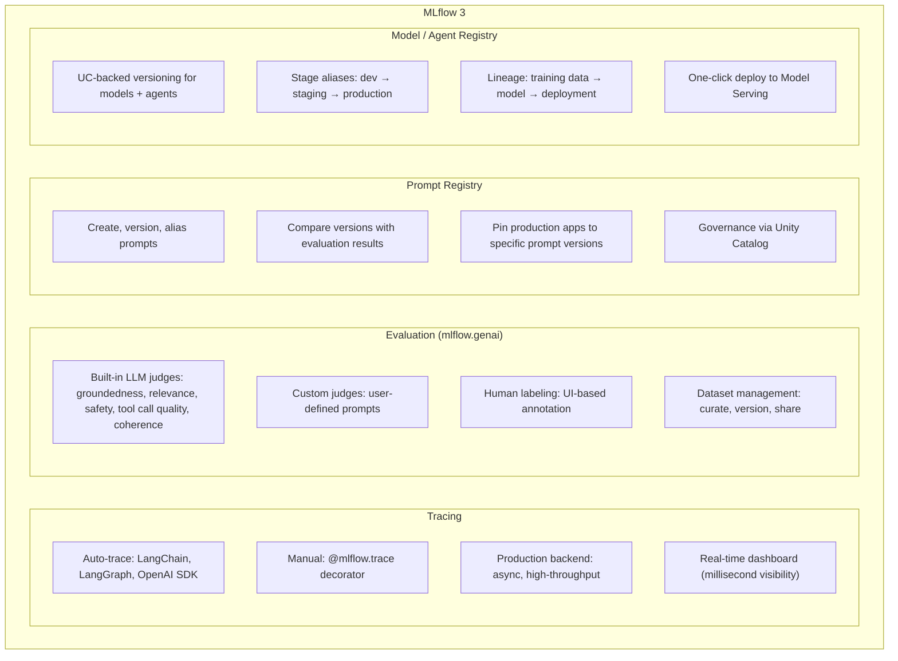
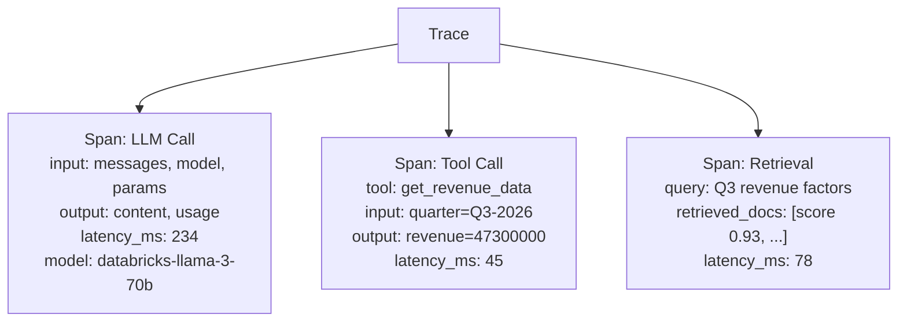

*Part 3 of the [Databricks Agentic AI series](43-part-01-platform-vision-agentic-services.md).* Covers the complete Mosaic AI stack and the MLflow 3 GenAI lifecycle platform.

## 1. Mosaic AI — Complete Stack Overview

Mosaic AI is Databricks' governed stack for building, deploying, and operating generative AI and machine learning applications. It spans the full lifecycle: data preparation → feature engineering → training → fine-tuning → serving → evaluation → monitoring.

| Layer | Data & Features | Training | Serving & Inference |
| --- | --- | --- | --- |
| Components | Feature Store, Vector Search, Embedding APIs, UC Functions | Model Training, Fine-tuning, RLHF, TAO | Foundation Model APIs, External Model Proxy, Custom Model Serving, Model Units |

| Layer | Agents | Evaluation | Governance |
| --- | --- | --- | --- |
| Components | Agent Framework, Agent Bricks, Supervisor Agent, Knowledge Assistant | MLflow 3 Eval, LLM Judges, Human Labeling, Trace Analysis | Unity Catalog, Unity AI Gateway, Prompt Registry, Model Registry |

## 2. Mosaic AI Vector Search (GA)

Now rebranded as **Databricks AI Search**, Mosaic AI Vector Search is the native vector database that stores embeddings alongside metadata in Delta Lake tables and auto-syncs when source data changes.

### Architecture



### Index Types

| Index Type | Description | When to Use |
| --- | --- | --- |
| **Delta Sync** | Auto-syncs from a Delta table (trigger or continuous) | Primary source is in Delta Lake |
| **Direct Vector Access** | Upsert vectors programmatically via API | Custom embedding pipelines |
| **Self-Managed** | Bring your own embeddings | Pre-computed embeddings |

### Hybrid Search (GA 2026)

Hybrid search combines dense vector retrieval with BM25 keyword retrieval, then applies re-ranking:

```python
from databricks.vector_search.client import VectorSearchClient

client = VectorSearchClient()
index = client.get_index("catalog.schema.knowledge_index")

# Hybrid search (default in 2026)
results = index.similarity_search(
    query_text="quarterly revenue decline root cause",
    columns=["content", "source", "date"],
    filters={"department": "finance", "doc_type": "report"},
    num_results=10,
    query_type="HYBRID",  # combines dense + BM25
    enable_reranking=True  # cross-encoder reranker
)
```

**When to use Hybrid vs Pure Vector:**
- **Pure Vector:** Conceptual/semantic queries ("find documents about risk management")
- **Hybrid (default):** Mixed queries with specific terms ("find documents about Basel III capital requirements")
- **Keyword-weighted:** Technical documentation, code search, product identifiers

### Scale and Performance

| Metric | Value |
| --- | --- |
| Max embeddings per endpoint | 1 billion |
| QPS range | 30–200 per endpoint |
| Dimension range | Up to 4096 |
| Auto-sync latency | Seconds (trigger) to sub-second (continuous) |
| Security | Inherits Unity Catalog RBAC; row-level filters applied |

### Lakebase Search (Beta 2026)

New in 2026: **Lakebase Search** extends the serverless Postgres with native hybrid vector + full-text retrieval, enabling co-located operational AI (store data + query vectors in same database):

```sql
-- Lakebase Search: hybrid vector + FTS in SQL
SELECT id, content, similarity
FROM search_index('products_catalog',
    'wireless noise-canceling headphones',
    mode => 'hybrid',
    limit => 10,
    filters => 'category = ''electronics'''
);
```

## 3. Foundation Model APIs & External Models

### Built-in Models (pay-per-token, no infrastructure)

| Model Family | Models Available | Use Case |
| --- | --- | --- |
| **Llama** | Llama 3.1/3.3 8B/70B/405B | General purpose, code, reasoning |
| **DBRX** | DBRX Instruct | Databricks-trained, data tasks |
| **Mixtral** | Mixtral 8x7B, 8x22B | Cost-efficient MoE |
| **Embedding** | BGE-M3, MXBai-large, GTE | Embeddings for RAG/search |
| **GTE Reranker** | GTE Cross-Encoder | Reranking for hybrid search |

### External Model Proxy

Routes to third-party providers through AI Gateway governance:

```python
import openai

# Configure OpenAI client to route through Databricks AI Gateway
client = openai.OpenAI(
    api_key=databricks_token,
    base_url=f"{DATABRICKS_HOST}/serving-endpoints/my-gateway/v1"
)

# All calls are now governed: rate limits, cost caps, PII guards
response = client.chat.completions.create(
    model="openai.gpt-4o",  # routes to OpenAI via gateway
    messages=[{"role": "user", "content": "Summarize Q3 results"}]
)
```

**Supported External Providers:** OpenAI, Anthropic (Claude), Azure OpenAI, Google Gemini, Cohere, Amazon Bedrock, and any OpenAI-compatible endpoint.

## 4. Model Training & Fine-Tuning

### Fine-Tuning Workflows

| Method | Infrastructure | Use Case |
| --- | --- | --- |
| **Instruction Fine-Tuning (SFT)** | GPU clusters via Mosaic AI Training | Adapting general models to domain tasks |
| **RLHF** | GPU clusters + human feedback pipeline | Alignment, preference learning |
| **LoRA / QLoRA** | Single/multi-GPU | Parameter-efficient fine-tuning |
| **TAO (Test-Adaptive Optimization)** | Agent Bricks managed | Auto-optimize without training data |

**TAO** is unique to Databricks: it adapts the model's behavior at test time using a learned optimizer, achieving fine-tuning-equivalent quality without requiring a labeled training dataset.

### Fine-Tuning → Serving Pipeline



## 5. AI Functions (SQL-Native AI)

**AI Functions** bring LLM capabilities directly into SQL queries on Delta/Iceberg tables — no Python code required:

```sql
-- Classify customer sentiment at scale
SELECT
    review_id,
    review_text,
    ai_classify(review_text, ARRAY['positive', 'neutral', 'negative']) AS sentiment,
    ai_extract(review_text, ARRAY['product_name', 'complaint_type']) AS extracted
FROM customer_reviews
WHERE date >= '2026-01-01';

-- Summarize documents in bulk
SELECT
    doc_id,
    ai_summarize(content, 'Summarize in 2 sentences for executive review') AS summary
FROM quarterly_reports;

-- Generate embeddings for similarity
SELECT
    id,
    ai_embed(content, 'databricks-gte-large-en') AS embedding
FROM knowledge_base;
```

**Supported AI Functions (2026):**
- `ai_query()` — general model call
- `ai_classify()` — multi-class classification
- `ai_extract()` — structured extraction
- `ai_summarize()` — text summarization
- `ai_translate()` — translation
- `ai_embed()` — embedding generation
- `ai_generate_text()` — text generation
- `ai_mask()` — PII masking
- `ai_fix_grammar()` — text correction
- `ai_sentiment()` — sentiment scoring

## 6. MLflow 3 — GenAI Lifecycle Platform

MLflow 3, released in 2026, is a significant rearchitecture of MLflow specifically for GenAI applications and agents. It is open-source and has native integration with Databricks.

### What Changed in MLflow 3

| Area | MLflow 2.x | MLflow 3 |
| --- | --- | --- |
| **Primary focus** | ML experiment tracking | GenAI observability + evaluation |
| **Tracing** | Basic spans | Production-scale trace ingestion backend |
| **Evaluation** | Limited `mlflow.evaluate()` | `mlflow.genai.evaluate()` with LLM judges |
| **Prompt management** | Not native | First-class Prompt Registry |
| **Human feedback** | Not native | Built-in labeling UI |
| **Agent support** | Model-centric | Agent-native (traces, eval, deployment) |
| **UC integration** | Model Registry only | Prompts, traces, agents all in UC |

### MLflow 3 Architecture



### MLflow Tracing — Auto-Instrumentation

```python
import mlflow

# Automatic tracing for supported frameworks
mlflow.langchain.autolog()    # LangChain + LangGraph
mlflow.openai.autolog()       # OpenAI SDK
mlflow.anthropic.autolog()    # Anthropic SDK
mlflow.llama_index.autolog()  # LlamaIndex

# Manual tracing for custom agents
@mlflow.trace
def my_agent_step(input_data):
    with mlflow.start_span("tool_call", span_type="TOOL"):
        result = call_external_api(input_data)
    return result
```

**Trace Data Model:**



### Prompt Registry — Deep Dive

```python
import mlflow

# Create and version a system prompt
client = mlflow.MlflowClient()

prompt = client.create_prompt(
    name="finance-analyst-system-prompt",
    template="""You are a financial analyst at {company_name}.
    Always cite data sources and provide confidence levels.
    Today's date is {{today}}.
    Restriction: Never share projections beyond {horizon_months} months.""",
    commit_message="Add confidence level requirement per compliance review",
    tags={"team": "finance", "compliance": "approved", "version_type": "minor"}
)

# Pin an agent deployment to a specific prompt version
deployed_agent = AgentDeployment(
    model_uri="models:/finance-agent/production",
    prompt_version=f"prompts:/finance-analyst-system-prompt/3",  # pinned version
)

# Evaluate prompt versions side-by-side
eval_results = mlflow.genai.evaluate(
    model=my_agent_with_prompt_v3,
    data=eval_dataset,
    scorers=[mlflow.genai.scorers.groundedness()]
)
```

### Evaluation Deep Dive

**Built-in Scorers (mlflow.genai.scorers):**

| Scorer | What it Measures | How it Works |
| --- | --- | --- |
| `groundedness()` | Is the answer supported by retrieved context? | LLM judge checks claim→source alignment |
| `relevance_to_query()` | Does the answer address the question? | LLM judge assesses topic alignment |
| `safety()` | Toxicity, PII, harmful content | Rule-based + LLM classification |
| `tool_call_quality()` | Did agent call correct tools with correct params? | Structured output validation |
| `chunk_relevance()` | Are retrieved chunks relevant to the query? | Retrieval quality assessment |
| `document_recall()` | Did retrieval surface all required documents? | Recall against gold answer |

**Custom Judge Pattern:**

```python
from mlflow.genai.scorers import scorer

@scorer
def domain_accuracy_judge(inputs, outputs, expectations):
    """Custom judge using GPT-4o to check financial accuracy."""
    prompt = f"""
    Question: {inputs['query']}
    Agent Answer: {outputs['response']}
    Expected Key Facts: {expectations['key_facts']}

    Rate the factual accuracy of the answer 1-5 and explain.
    Return JSON: {{"score": int, "reasoning": str}}
    """
    result = llm.invoke(prompt)
    parsed = json.loads(result.content)
    return Score(
        value=parsed["score"] / 5.0,  # normalize to 0-1
        reason=parsed["reasoning"]
    )
```

## 7. MLflow 3 + Databricks Integration Points

| MLflow Feature | Databricks Integration |
| --- | --- |
| Experiments | Synced with Databricks Workspace |
| Model Registry | Unity Catalog (UC Model Registry) |
| Prompt Registry | Unity Catalog (UC Prompt Registry) |
| Tracing | Persisted to Delta Lake via production trace backend |
| Evaluation datasets | Delta Tables with UC governance |
| Serving | One-click from registry to Model Serving endpoint |
| Human feedback | Labeling UI → Delta Lake → feeds evaluation |
| Monitoring | Lakewatch SIEM + Lakehouse Monitoring |

## Related

- [Part 2: Agent Lake, Agent Architecture & Multi-Agent Orchestration](44-part-02-agent-lake-architecture.md)
- [Part 4: Unity Catalog AI Governance](46-part-04-unity-catalog-governance.md)
