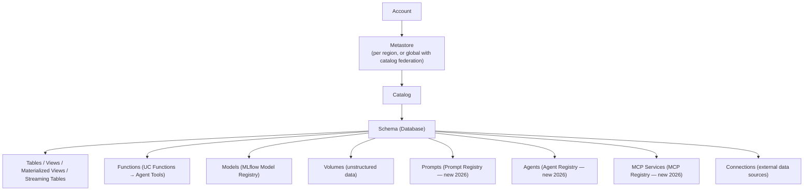
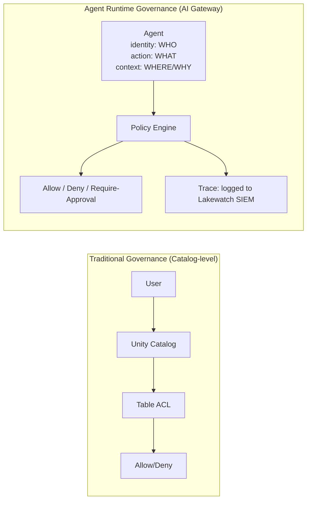
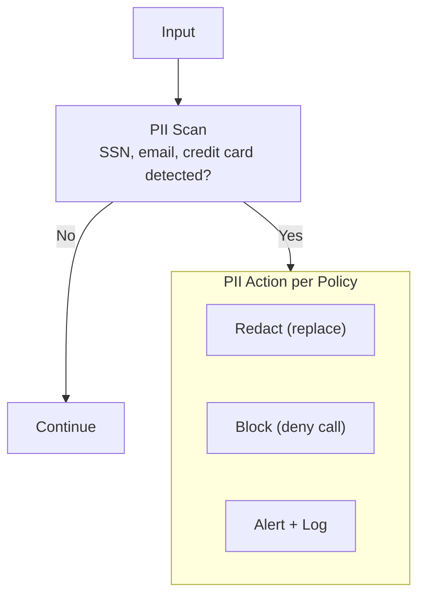
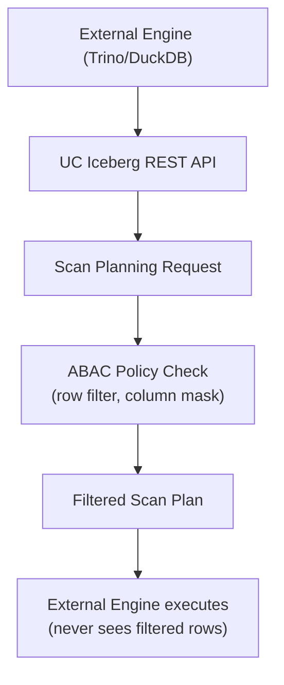
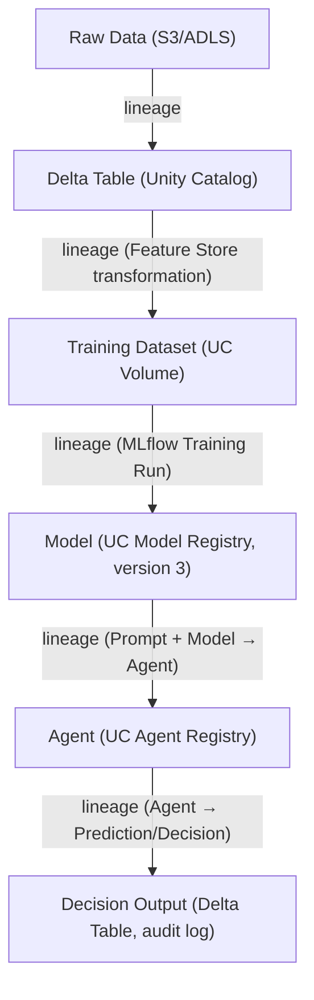
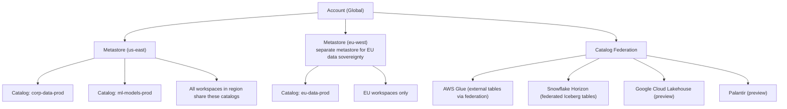
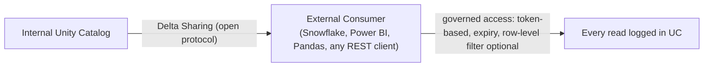

*Part 4 of the [Databricks Agentic AI series](43-part-01-platform-vision-agentic-services.md).* Covers Unity Catalog for AI, Unity AI Gateway, Responsible AI, and EU AI Act alignment.

## 1. Unity Catalog — The Universal Governance Plane

Unity Catalog (UC) is Databricks' unified governance layer for **all data and AI assets** across clouds, workspaces, regions, and compute engines. In 2026 it was extended from data governance to **full AI asset governance** — covering models, prompts, agents, MCP services, and runtime behavior.

### Object Hierarchy



### What Unity Catalog Governs (2026)

| Asset Type | Governance Capabilities |
| --- | --- |
| **Tables / Views** | RBAC, ABAC (row filter, column mask), lineage, tagging, classification |
| **Models** | Version control, stage aliases, lineage (training data → model), audit |
| **Prompts** | Versioning, aliases, evaluation results, lineage, access control |
| **Agents** | Registration, discovery, policy attachment, audit trail |
| **MCP Services** | Registration, access control, rate limits, audit |
| **Volumes** | Unstructured data (PDFs, images) with ACLs |
| **Connections** | Federated data source credentials and access |
| **Functions** | UC Functions as governed agent tools |

## 2. Unity AI Gateway — Runtime Agent Governance

Announced at Data + AI Summit June 2026 (Beta), Unity AI Gateway is the **runtime control plane** that governs what agents DO, not just what they CAN ACCESS.

### The Governance Gap it Fills

Traditional catalog governance answers: "Can user X read table Y?"
Unity AI Gateway answers: "Can agent A, acting on behalf of user X, call model B to generate content C in context D?"



### Unified AI Gateway — Capability Breakdown

#### 2.1 Model and Tool Registration

Register in Unity Catalog:
- Databricks Foundation Model endpoints
- External model providers (OpenAI, Anthropic, Azure OpenAI, Gemini)
- Internal fine-tuned models
- MCP servers (managed + external)
- Agent endpoints
- Custom skills

```python
# Register an external model in Unity Catalog
from databricks.sdk.service.serving import ExternalModelConfig

client.serving_endpoints.create(
    name="my-claude-gateway",
    config=EndpointCoreConfigInput(
        served_entities=[
            ServedEntityInput(
                external_model=ExternalModelConfig(
                    name="claude-sonnet-4-6",
                    provider=ExternalModelProvider.ANTHROPIC,
                    anthropic_config=AmazonBedrockConfig(
                        aws_region="us-east-1",
                    )
                )
            )
        ]
    )
)
# Now governed by UC: access control, rate limits, cost caps, PII guards
```

#### 2.2 Contextual Service Policies (Beta)

Unlike static RBAC (who can call what model), Contextual Service Policies define **what an agent can DO in a specific interaction context**:

```yaml
# Example: Contextual Service Policy
policy_name: "finance-agent-production-policy"
applies_to:
  agent: "catalog.finance.quarterly_analyst_agent"
  user_groups: ["finance-team", "exec-team"]
rules:
  - condition:
      action: "write_to_storage"
      path_prefix: "/prod/financials/"
    effect: "require_approval"
    approvers: ["finance-lead@company.com"]

  - condition:
      action: "external_api_call"
      domain: "*.external-vendor.com"
    effect: "deny"

  - condition:
      model: "openai-gpt-4o"
      user_group: "exec-team"
    effect: "allow"

  - condition:
      detected_pii: true
    effect: "mask"
    mask_strategy: "redact"

spend_cap:
  daily_tokens: 5000000
  alert_threshold: 0.8
  hard_cap: true

routing:
  cost_weight: 0.4
  quality_weight: 0.6
  fallback_model: "databricks-llama-3-70b-instruct"
```

#### 2.3 Spend Caps and Smart Routing

| Control | Description |
| --- | --- |
| **Hard spend caps** | Block all calls after N tokens/day/month per agent or user |
| **Soft alerts** | Notify at threshold (e.g., 80% of budget) |
| **Smart routing** | Route based on cost/quality tradeoff; automatically select cheaper model for simple tasks |
| **Model fallback** | When primary model unavailable, route to fallback |
| **Budget attribution** | Track spend by agent, user, team, application for chargeback |

#### 2.4 PII and Safety Guardrails



**Prompt Injection Detection:** AI Gateway analyzes inputs for injection patterns (attempts to override system prompt, exfiltrate data, escalate privileges). Detected injections are blocked and logged.

## 3. ABAC — Attribute-Based Access Control (GA 2026)

ABAC is now GA in Unity Catalog, enabling dynamic, tag-driven access control at massive scale.

### How ABAC Works

Governed Tag (account-level vocabulary): `pii_class = confidential`

ABAC Policy (attached at catalog or schema level):
```
IF table.tag.pii_class == "confidential"
AND user.department != "compliance"
THEN apply_row_filter: "region = user.region"
AND apply_column_mask: "ssn → XXXX-XX-####"
```

Result: every table tagged `pii_class=confidential` in this schema automatically enforces the row filter and column mask without per-table configuration.

### ABAC vs Table-Level Row Filters: When to Use Which

| Approach | Scale | Management | Use Case |
| --- | --- | --- | --- |
| **ABAC Policy** | Enterprise (100s of tables) | Set once at schema/catalog | Standard org-wide data classification |
| **Row Filter** | Per-table | Set per table | One-off exceptions, complex per-table logic |
| **Column Mask** | Per-column | Set per column | Targeted field-level protection |

### Cross-Engine ABAC via Iceberg REST (Beta)

For Iceberg tables queried by external engines (Spark, DuckDB, Trino):

- UC enforces ABAC during **server-side scan planning** via Iceberg REST scan APIs
- External engines receive already-filtered plans — no data leakage
- Requires Iceberg client 1.11+ (implements scan planning client protocol)



## 4. AI Lineage in Unity Catalog

Unity Catalog tracks **end-to-end lineage** from raw data through AI artifacts to decisions:



**Lineage APIs:**

```python
# Query lineage for a model
from databricks.sdk import WorkspaceClient

w = WorkspaceClient()
lineage = w.lineage_tracking.table_lineage(
    table_name="catalog.schema.my_model",
    include_entity_lineage=True
)
# Returns upstream sources (training data) and downstream consumers (agent deployments)
```

**Lineage Coverage:**
- Table → Table (SQL transformations)
- Table → Model (training)
- Model → Agent (composition)
- Agent → Output Table (decisions written)
- Prompt → Agent (which prompt version an agent uses)
- MCP tool → Agent (tool dependency)

## 5. Audit Logging

Every Unity Catalog and Unity AI Gateway interaction generates immutable audit events:

**Audit Event Schema:**

```json
{
  "timestamp": "2026-07-16T10:23:45.123Z",
  "event_type": "AGENT_TOOL_INVOCATION",
  "user_identity": {
    "user": "analyst@company.com",
    "groups": ["finance-team"],
    "ip": "10.0.1.45"
  },
  "agent": {
    "name": "catalog.finance.quarterly_analyst",
    "version": 3,
    "endpoint": "finance-agent-prod"
  },
  "action": {
    "type": "tool_call",
    "tool": "catalog.finance.get_revenue_data",
    "parameters": {"quarter": "Q3-2026"},
    "result_rows": 1
  },
  "policy_decision": "ALLOW",
  "model_calls": [{
    "model": "databricks-llama-3-70b-instruct",
    "input_tokens": 1247,
    "output_tokens": 312,
    "cost_usd": 0.00043
  }],
  "workspace_id": "1234567890123456",
  "cloud": "AWS",
  "region": "us-east-1"
}
```

Audit events flow to:
- **Lakewatch** (Databricks' lakehouse-native SIEM) for security analysis
- **Lakehouse Monitoring** for operational dashboards
- External SIEM (Splunk, Azure Sentinel) via Delta Sharing or log export

## 6. AI Governance Regulatory Alignment

### EU AI Act Compliance

| EU AI Act Requirement | Databricks Implementation |
| --- | --- |
| **Transparency** | MLflow Tracing: full input/output/reasoning audit trail |
| **Human oversight** | HITL via Unity AI Gateway Contextual Policies (require-approval) |
| **Risk documentation** | Model Cards (UC metadata), Agent Cards (UC tags) |
| **Data governance** | Unity Catalog lineage + ABAC for training data governance |
| **Incident reporting** | Lakewatch SIEM alerts + audit log export |
| **Conformity assessment** | MLflow Evaluation + Quality Gates before production |
| **Prohibited use detection** | Unity AI Gateway safety guardrails |

### NIST AI RMF Alignment

| NIST AI RMF Function | Databricks Mapping |
| --- | --- |
| **GOVERN** | Unity Catalog policies, Unity AI Gateway, Omnigent |
| **MAP** | UC lineage, model cards, risk tagging |
| **MEASURE** | MLflow 3 evaluation, Lakehouse Monitoring, quality judges |
| **MANAGE** | HITL workflows, kill switch (policy "DENY_ALL"), rollback via model aliases |

### Model Cards and Agent Cards

Stored as Unity Catalog metadata:

```python
# Register a model with a model card
w.registered_models.create(
    name="catalog.finance.revenue_forecaster",
    comment="Q3 revenue forecasting model",
    tags={
        "model_type": "regression",
        "training_data": "catalog.finance.historical_revenue",
        "performance_metric": "MAE=1.2%",
        "risk_level": "medium",
        "eu_ai_act_category": "limited_risk",
        "data_bias_assessment": "completed_2026-06-30",
        "approved_by": "finance-ml-lead@company.com",
        "approved_date": "2026-07-01"
    }
)
```

## 7. Cross-Workspace and Cross-Cloud Governance

### Multi-Workspace Architecture



### Delta Sharing — Governed External Data Access

Delta Sharing allows sharing Delta/Iceberg data with external consumers **without copying**, governed by Unity Catalog:



## 8. Business Glossary and Semantic Layer

**Unity Catalog Metrics** (released DAIS 2026) adds a semantic layer to Unity Catalog:

- Define business metrics with SQL expressions ("Revenue = SUM(order_amount) WHERE status='completed'")
- Govern who can access metric definitions
- Genie One consults metrics layer to answer business questions accurately (retrieves from curated SQL, not LLM reasoning)
- Consistent definitions used by Genie, Power BI, dbt, and agents

```sql
-- Define a governed metric in Unity Catalog
CREATE METRIC catalog.finance.q3_revenue
USING SELECT SUM(order_amount)
       FROM catalog.sales.orders
       WHERE DATE_TRUNC('quarter', order_date) = '2026-07-01'
       AND status = 'completed'
COMMENT 'Q3 2026 Recognized Revenue — Finance definition'
TAGS ('domain'='finance', 'certified'='true');
```

## Related

- [Part 3: Mosaic AI & MLflow 3](45-part-03-mosaic-ai-mlflow.md)
- [Part 7: Security Architecture](47-part-07-security-architecture.md)
