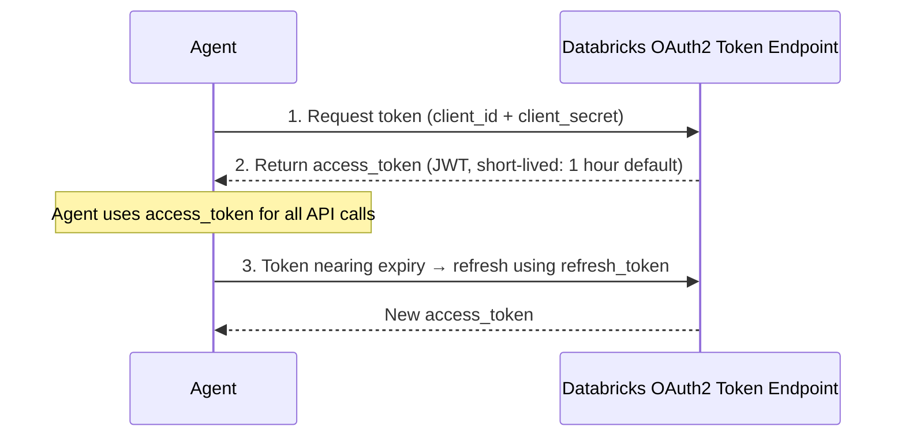
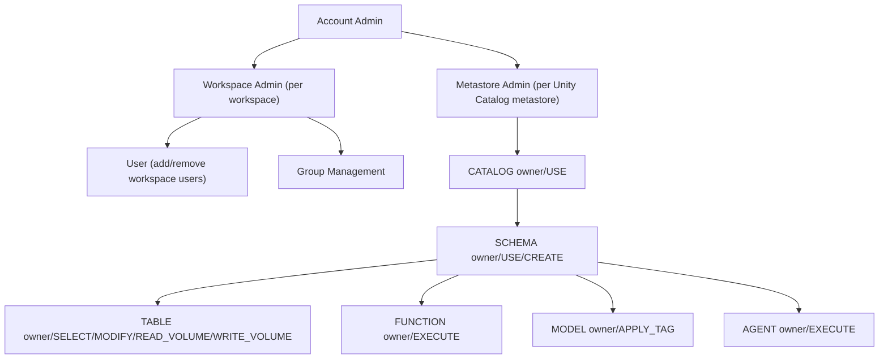
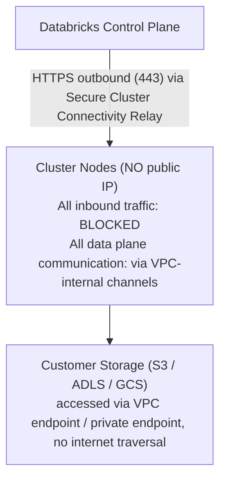
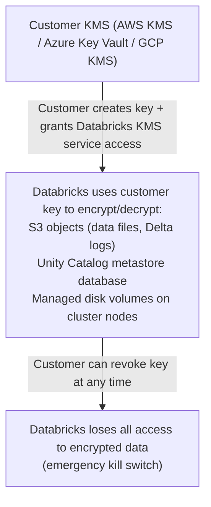
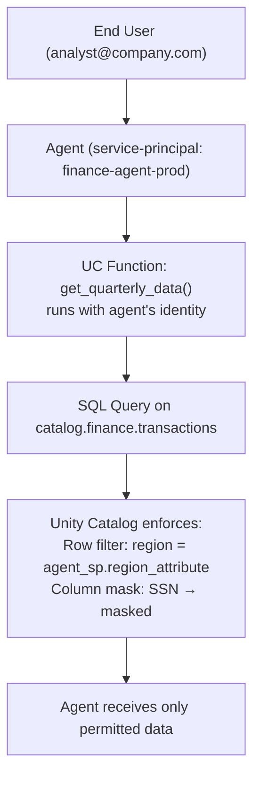
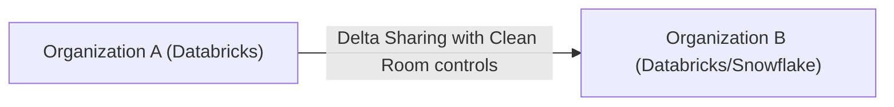

*Part 7 of the [Databricks Agentic AI series](43-part-01-platform-vision-agentic-services.md).* Covers identity, RBAC, ABAC, Zero Trust, encryption, agent identity, and network isolation.

## 1. Security Architecture Overview

Databricks implements a **Zero Trust, Defense-in-Depth** security model that extends from the network perimeter through the data layer to the AI agent runtime.

| Layer | Controls |
| --- | --- |
| **Layer 7: Agent Runtime Security** | Unity AI Gateway, Contextual Policies, Omnigent Policy Engine |
| **Layer 6: AI Governance** | Model Cards, Agent Cards, Policy Lineage, HITL Approval |
| **Layer 5: Data Access Control** | Unity Catalog RBAC, ABAC, Row Filters, Column Masks |
| **Layer 4: Identity & Authentication** | Service Principals, OAuth, OIDC, Credential Passthrough |
| **Layer 3: Encryption** | TLS 1.3 in transit, AES-256 at rest, BYOK / CMK via KMS |
| **Layer 2: Network Isolation** | VPC/VNet, Private Link, IP Allowlists, No Public Endpoints |
| **Layer 1: Infrastructure** | Customer-managed cloud accounts, BYOC storage, Confidential Compute |

## 2. Identity and Authentication

### Authentication Models

| Principal Type | Authentication Method | Typical Use |
| --- | --- | --- |
| **Human user** | Username + password + MFA, SSO (SAML/OIDC) | Interactive notebooks, UI |
| **Service principal** | Client ID + Secret, OAuth M2M | CI/CD, automated pipelines |
| **Agent identity** | Service principal with scoped permissions | AI agents acting autonomously |
| **External tool** | OAuth 2.0 / API token (via AI Gateway) | MCP clients, agent tools |

### Agent Identity Pattern

Agents require **non-human identities** (service principals) with the principle of least privilege:

```python
# Create a scoped service principal for an agent
from databricks.sdk import WorkspaceClient

w = WorkspaceClient()

# Create service principal
sp = w.service_principals.create(
    display_name="finance-agent-prod",
    roles=[{"value": "account_user"}]
)

# Grant minimum required permissions
w.grants.update(
    securable_type="table",
    full_name="catalog.finance.quarterly_data",
    changes=[
        PermissionChange(
            principal=f"servicePrincipals/{sp.id}",
            add=[Privilege.SELECT]  # read-only
        )
    ]
)

# Grant agent permission to call specific UC Functions (tools)
w.grants.update(
    securable_type="function",
    full_name="catalog.finance.get_revenue_data",
    changes=[
        PermissionChange(
            principal=f"servicePrincipals/{sp.id}",
            add=[Privilege.EXECUTE]
        )
    ]
)
```

### OAuth Machine-to-Machine (M2M) Flow



### Identity Federation

Databricks integrates with enterprise identity providers:
- **Azure Active Directory / Microsoft Entra** — SAML/OIDC federation
- **Okta** — SCIM provisioning + SAML SSO
- **AWS IAM** — credential passthrough for S3 access
- **Google Workspace** — OIDC SSO

**Credential Passthrough:** Allows Databricks users to access cloud storage (S3, ADLS, GCS) using their own cloud identity, so storage access logs show individual user identities rather than a shared Databricks service account.

## 3. Authorization — RBAC + ABAC

### RBAC Hierarchy



### RBAC Privilege Reference (AI-relevant)

| Privilege | Object Types | Grants Ability To |
| --- | --- | --- |
| `SELECT` | Table, View, Materialized View | Read rows |
| `MODIFY` | Table | Insert, update, delete |
| `EXECUTE` | Function, Model, Agent | Call the function/model/agent |
| `APPLY_TAG` | All securable objects | Add/modify tags |
| `USE_CATALOG` | Catalog | Access objects in catalog |
| `USE_SCHEMA` | Schema | Access objects in schema |
| `CREATE_TABLE` | Schema | Create new tables |
| `CREATE_FUNCTION` | Schema | Create new UC Functions (agent tools) |
| `CREATE_MODEL` | Schema | Register new models |

### ABAC Deep Dive

ABAC enables policy-driven access control at scale without per-object grants:

```sql
-- Step 1: Create governed tag (account-level vocabulary)
CREATE TAG IF NOT EXISTS sensitivity_tag ALLOWED VALUES ('public', 'internal', 'confidential', 'restricted');

-- Step 2: Apply tag to tables
ALTER TABLE catalog.hr.employee_data SET TAGS (sensitivity_tag = 'restricted');
ALTER TABLE catalog.finance.public_metrics SET TAGS (sensitivity_tag = 'public');

-- Step 3: Create ABAC policy at schema level
CREATE ROW FILTER POLICY restricted_row_filter
AS (sensitivity_tag, user_department) ->
    CASE
        WHEN sensitivity_tag = 'restricted' AND current_user_group('compliance') THEN TRUE
        WHEN sensitivity_tag = 'restricted' AND current_user_group('hr-admins') THEN TRUE
        WHEN sensitivity_tag IN ('public', 'internal') THEN TRUE
        ELSE FALSE
    END;

-- Step 4: Create column mask for PII
CREATE COLUMN MASK POLICY ssn_mask
AS (sensitivity_tag, value) ->
    CASE
        WHEN sensitivity_tag = 'restricted' AND current_user_group('compliance') THEN value
        ELSE regexp_replace(CAST(value AS STRING), '\\d{3}-\\d{2}-(\\d{4})', 'XXX-XX-$1')
    END;

-- Step 5: Apply ABAC policy at catalog/schema level (auto-applies to all tagged tables)
ALTER SCHEMA catalog.hr SET ABAC POLICY (
    ROW FILTER POLICY restricted_row_filter,
    COLUMN MASK POLICY ssn_mask FOR COLUMNS (ssn, tax_id)
);
```

## 4. Network Security

### Private Connectivity Options

| Option | Description | Use Case |
| --- | --- | --- |
| **Private Link (AWS)** | VPC endpoint to Databricks control plane | Eliminate internet exposure |
| **Private Endpoints (Azure)** | VNet integration to Databricks | Azure enterprise deployments |
| **Private Service Connect (GCP)** | VPC-native connectivity | GCP enterprise deployments |
| **IP Allowlists** | Restrict access to specific IP ranges | Additional perimeter control |
| **VPC Injection** | Databricks compute in customer VPC | Full customer network control |

### Secure Cluster Connectivity (No Public IPs)

**Secure Cluster Connectivity** (also called No Public IP or NPIP):
- All Databricks cluster nodes have **no public IP addresses**
- Clusters connect to Databricks control plane via **relay (tunnel)**
- Customer VPC keeps all cluster traffic internal
- Network Security Groups (NSGs / Security Groups) restrict inbound completely



## 5. Encryption

### At-Rest Encryption

| Layer | Default | Enhanced Option |
| --- | --- | --- |
| **Object Storage** | Cloud provider AES-256 (SSE-S3, SSE-ADLS) | Customer-managed keys (CMK/BYOK) |
| **Unity Catalog Metadata** | Databricks-managed AES-256 | BYOK for metastore |
| **Lakebase (Postgres)** | AES-256 | CMK via AWS KMS / Azure Key Vault |
| **MLflow artifacts** | Cloud provider default | CMK |
| **Notebook code** | Encrypted in Databricks storage | Available |

### Customer-Managed Keys (BYOK)



### In-Transit Encryption

- All API calls: TLS 1.3 (minimum TLS 1.2)
- Cluster internal traffic: TLS 1.3 between Spark executors
- Storage access: HTTPS (pre-signed URLs, SAS tokens)
- JDBC/ODBC: TLS enforced

## 6. Row-Level Security and Column Masking for Agents

### Agents Respect Data Access Controls

When an agent calls a UC Function that runs a SQL query, the **agent's service principal identity** determines what data is returned — not the end user's identity (unless credential passthrough is configured):



**Best Practice:** Design agent service principals with region/department attributes that match row-level filter policies, so the same ABAC policy that governs human access automatically governs agent access.

### Agent-on-Behalf-of-User (OBO) Pattern

For agents that should see the **calling user's data** (not the agent's):

```python
# Pass user identity to agent for OBO access
def run_agent_with_user_context(user_token: str, query: str):
    # Exchange user token for delegated token scoped to agent
    delegated_token = exchange_token_for_agent_obo(
        user_token=user_token,
        agent_id="finance-agent-prod",
        scope="read:finance"
    )

    # Agent uses delegated token; UC enforces user's permissions
    return agent.run(query, auth_token=delegated_token)
```

## 7. Secrets Management

Unity Catalog integrates with **Databricks Secret Scope** and **cloud-native secret stores**:

```python
# Store API keys in Databricks Secret Scope (encrypted at rest)
databricks secrets put-secret \
    --scope "finance-agent-secrets" \
    --key "openai-api-key"

# Reference in agent code (never hardcoded)
import databricks.sdk.runtime as dbr

openai_key = dbr.dbutils.secrets.get(
    scope="finance-agent-secrets",
    key="openai-api-key"
)

# Secrets from cloud-native vaults (Azure Key Vault, AWS Secrets Manager)
# via Secret Scope backed by cloud KMS
```

**Secret Scope Types:**

| Type | Backend | Rotation Support |
| --- | --- | --- |
| **Databricks-backed** | Internal encrypted store | Manual via API |
| **Azure Key Vault-backed** | Azure Key Vault | Automatic (KV rotation) |
| **AWS Secrets Manager-backed** | AWS SM | Automatic (SM rotation) |

## 8. Data Clean Rooms

**Delta Sharing Clean Rooms** enable privacy-preserving multi-party data collaboration:



Clean Room controls include:
- Aggregation-only (no row-level access)
- Differential privacy (optional)
- Approved query patterns only
- Full audit trail

**AI Agent Clean Room Pattern:** Agents can query joined datasets from multiple organizations without either party revealing raw data — results only available as aggregates or differentially private outputs.

## 9. Security Checklist for Agent Deployments

| Category | Control | Implementation |
| --- | --- | --- |
| **Identity** | Non-human identity for agent | Service principal per agent deployment |
| **Least Privilege** | Minimum permissions | Grant only SELECT/EXECUTE on needed assets |
| **Network** | No public IP | NPIP + Private Link for control plane |
| **Encryption** | BYOK for sensitive workloads | Customer-managed keys in KMS |
| **Secrets** | No hardcoded credentials | Databricks Secret Scope or cloud vault |
| **Runtime** | Policy enforcement | Unity AI Gateway Contextual Policies |
| **Audit** | All actions logged | UC audit logs → Lakewatch SIEM |
| **PII** | Detect and protect | Unity AI Gateway PII guardrail |
| **Injection** | Block prompt injection | Unity AI Gateway injection detection |
| **Spend** | Cost control | Hard spend caps in Unity AI Gateway |
| **Rollback** | Emergency stop | CMK revocation, "DENY_ALL" policy, alias rollback |

## Related

- [Part 4: Unity Catalog AI Governance](46-part-04-unity-catalog-governance.md)
- [Part 8: Observability, FinOps & Integration Ecosystem](48-part-08-observability-finops-integration.md)
