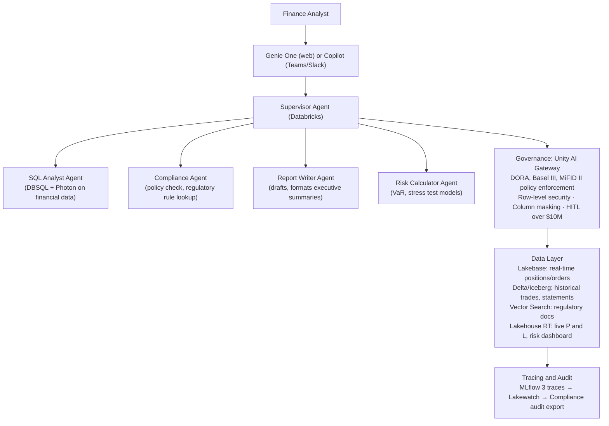
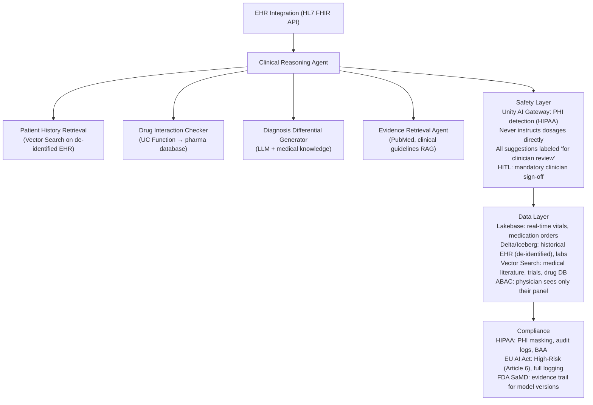
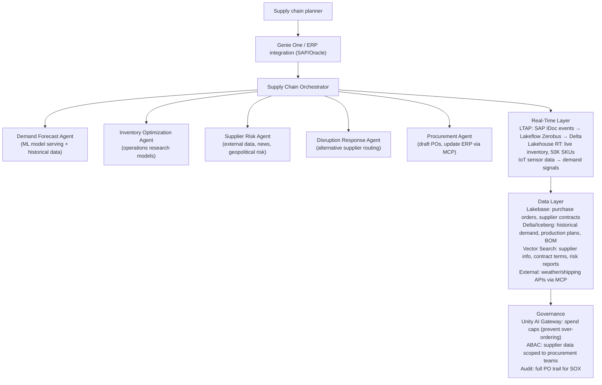
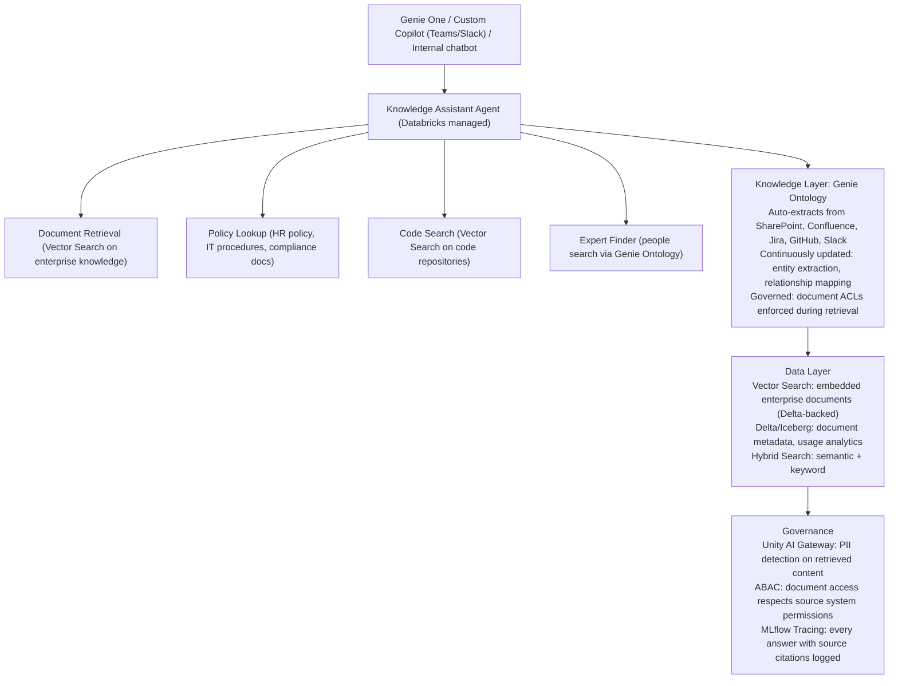

*Part 9 of the [Databricks Agentic AI series](43-part-01-platform-vision-agentic-services.md).* Covers the platform comparison matrix against major competitors and four industry reference architectures.

## 1. Platform Comparison: Databricks vs. Major Competitors (2026)

### Strategic Positioning Summary

| Platform | Primary Identity | AI Agent Bet | Governance Model |
| --- | --- | --- | --- |
| **Databricks** | Lakehouse + AI operating layer | Agent Bricks + Omnigent + Unity AI Gateway | Data + AI + runtime (fullest) |
| **Snowflake** | Data cloud + AI for consumers | Cortex AI (CoWork + CoCo) | Catalog-level (Horizon) |
| **AWS Bedrock** | Managed model API + agent infrastructure | Bedrock Agent Core + Strands | AWS IAM + managed isolation |
| **Azure AI Foundry** | Enterprise AI platform (Microsoft stack) | Copilot Stack + Semantic Kernel | Entra ID + Purview |
| **Google Vertex AI** | ML + GenAI platform on GCP | Agent Builder + Vertex AI Studio | IAM + CMEK |
| **IBM watsonx** | Governed enterprise AI | watsonx Assistant + Orchestrate | OpenScale governance |
| **Palantir AIP** | Ontology-driven agentic ops | AIP agents + ontology | Gotham governance |

### Detailed Comparison Matrix

#### Architecture & Data Platform

| Dimension | Databricks | Snowflake | AWS Bedrock | Azure AI Foundry |
| --- | --- | --- | --- | --- |
| **Table Format** | Delta + Iceberg native | Iceberg native + Delta via Polaris | S3 Tables (Iceberg) | SQL + Fabric OneLake (Delta Parquet) |
| **Catalog** | Unity Catalog (strongest) | Horizon Catalog | AWS Glue + Lake Formation | Microsoft Fabric + Purview |
| **Real-time analytics** | Lakehouse RT (&lt;100ms, Reyden) | No native RT; Snowpipe Streaming | Redshift/Kinesis separate | Fabric Eventstream |
| **Operational DB** | Lakebase (Postgres on Delta) | Snowflake Postgres (Feb 2026) | RDS / Aurora (separate) | Azure SQL (separate) |
| **OLTP+OLAP unified** | LTAP (native) | Unistore (partial) | No | No |
| **Open source commitment** | High (Delta OSS, Spark, MLflow, Omnigent) | Medium (Polaris OSS catalog) | Medium (open weights via SageMaker) | Low (proprietary stack) |

#### AI Agent Capabilities

| Dimension | Databricks | Snowflake | AWS Bedrock | Azure AI Foundry |
| --- | --- | --- | --- | --- |
| **Agent Framework** | Agent Bricks + Mosaic AI Fwk (strong) | Cortex AI (consumer-first) | Bedrock Agents + Strands SDK | Copilot Studio + Azure AI Agent Service |
| **Multi-agent** | Omnigent + Supervisor Agent | Limited | Multi-agent via Strands/Bedrock | Semantic Kernel multi-agent |
| **Memory** | Lakebase + Vector Search (strong) | Cortex Search | Bedrock Agent Core Memory | Azure AI Memory (preview) |
| **Tool/MCP** | Managed MCP + UC Functions (best-in-class) | Cortex Tools | MCP support (Lambda-backed) | MCP support via Azure Functions |
| **Model access** | All major models via AI Gateway | All major via Cortex | All via Bedrock | All via Azure OpenAI + others |
| **Fine-tuning** | Mosaic AI Training (strong, Spark-native) | Cortex Fine-Tuning | SageMaker (separate service) | Azure Fine-Tuning (preview) |
| **Open-source harness** | Any (LangChain, LangGraph, OpenAI SDK, etc.) | Limited | Limited | Semantic Kernel first |

#### Governance & Security

| Dimension | Databricks | Snowflake | AWS Bedrock | Azure AI Foundry |
| --- | --- | --- | --- | --- |
| **Runtime agent governance** | Unity AI Gateway (Best) | Limited | Guardrails for Bedrock | Azure AI Content Safety |
| **Data ABAC** | GA (row filter, column mask, governed tags) | Dynamic Data Masking | Lake Formation TBAC | Purview data policies |
| **Audit trail** | Unity Catalog + Lakewatch SIEM | Account Usage views | CloudTrail | Azure Monitor |
| **Cross-cloud** | AWS + Azure + GCP native | AWS + Azure + GCP native | AWS only | Azure primarily |
| **BYOK encryption** | GA (S3, ADLS, GCS + metastore) | GA | GA (AWS KMS) | GA (Azure Key Vault) |
| **EU data sovereignty** | EU regions on all clouds | EU regions | EU regions (AWS) | Azure EU regions (strong) |
| **Regulatory frameworks** | SOC2, ISO27001, HIPAA, FedRAMP | SOC2, ISO27001, HIPAA | SOC2, ISO, HIPAA, FedRAMP | SOC2, ISO, HIPAA, FedRAMP, G-Cloud |

#### Iceberg & Interoperability

| Dimension | Databricks | Snowflake | AWS | Google |
| --- | --- | --- | --- | --- |
| **Iceberg read** | Native + UniForm | Native | S3 Tables + Athena | BigLake Iceberg |
| **Iceberg write** | Native | Native | S3 Tables | BigLake |
| **Iceberg catalog** | Unity Catalog (REST API) | Polaris Catalog (REST API) | Glue Catalog (REST API) | BigLake Metastore (REST API) |
| **Catalog federation** | GA (Glue, Snowflake, Hive, Salesforce, Google Preview, Palantir Preview) | Limited | AWS Glue only | Limited |
| **Delta Sharing** | Native provider | Consumer (reads) | Consumer (reads) | Consumer (reads) |

#### FinOps

| Dimension | Databricks | Snowflake | AWS Bedrock | Azure AI Foundry |
| --- | --- | --- | --- | --- |
| **Inference pricing** | Model Units (80% savings claim) | Cortex credits (per-token) | Per-token (Bedrock pricing) | Azure consumption (per-token) |
| **Cost visibility** | UC audit + AI Gateway attribution | Snowflake Cost Management | Cost Explorer + tags | Azure Cost Management |
| **Spend caps** | Hard caps (Unity AI Gateway) | Resource monitors | AWS Budgets | Azure Cost Alerts |
| **Smart routing** | Yes (AI Gateway) | Limited | No native | Limited |

### Databricks vs Snowflake: The Head-to-Head (2026)

The 2026 battle is no longer about lakehouse vs warehouse — both have converged:

| Area | Databricks Advantage | Snowflake Advantage |
| --- | --- | --- |
| **Builder-first agents** | Agent Bricks, LangGraph, any framework | — |
| **Data engineering** | Lakeflow, Spark (deeper) | Snowpipe, Streams |
| **SQL analytics** | Photon, Databricks SQL | Snowflake Query Engine (faster SQL for simpler queries) |
| **Consumer-first AI** | — | CoWork, CoCo (simpler, no-code agents) |
| **ML/Training** | Mosaic AI Training (dominant) | — |
| **Cost for analytics-only** | — | Snowflake often cheaper for pure SQL |
| **Open formats** | Strong (Delta OSS + Iceberg native) | Strong (Polaris OSS + Iceberg native) |
| **Multi-cloud governance** | Unity Catalog (stronger) | Horizon Catalog |
| **Time to first agent** | Moderate (more control required) | Fast (CoWork out-of-box) |

**Bottom Line:** Builders and data-intensive AI workloads lean Databricks. Analytics-consumer organizations lean Snowflake. Large enterprises often use both.

## 2. Industry Reference Architectures

### 2.1 Financial Services — AI Analyst Agent

**Use Case:** Quarterly earnings analysis, risk report generation, regulatory compliance checking.

**Key Design Decisions:**
- Use **ABAC** to ensure analyst agents only access portfolios matching the analyst's `region` and `desk` attributes
- All agent decisions logged with **data snapshot timestamp** for regulatory audit (Iceberg time travel enables replay)
- **HITL** mandatory for all trade recommendations (EU AI Act compliance for high-risk AI)
- Agent evaluation must include **domain accuracy judge** scoring against known financial facts

### 2.2 Healthcare — Clinical Decision Support Agent

### 2.3 Manufacturing — Supply Chain Intelligence Agent

### 2.4 Enterprise Search & Knowledge Management

## Related

- [Part 2: Anti-Patterns, Decision Framework & Roadmap](parts/49-part-09-competitive-reference-architectures-part2.md)
- [Part 8: Observability, FinOps & Integration Ecosystem](48-part-08-observability-finops-integration.md)
