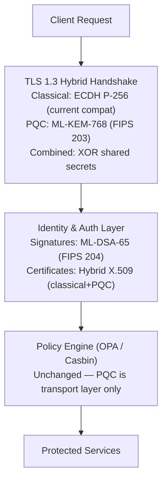

# Quantum AI Appendices: Career Paths, Tooling & Industry Landscape

**Reference & Industry Landscape — Part 2 of 4-Part Series**

Continues from [Part 4a — Mathematics, Use Cases & Agentic Integration](../04-quantum-ai-appendices.md).

---

## Appendix C (continued) — Quantum × Agentic AI Use Cases

### Use Case 4: Cybersecurity — Post-Quantum Zero Trust Architecture

**Problem:** "Harvest Now, Decrypt Later" (HNDL) attacks require immediate PQC migration for any data with &gt;10 year sensitivity.

**Solution Design: Hybrid PQC Zero Trust Gateway**



---

### Use Case 5: Energy — Quantum Grid Optimisation

**Problem:** Power grid load balancing with renewable intermittency is a real-time combinatorial problem with safety constraints.

**Quantum Solution Design:**

| Stage | Technology | Output |
| ------- | ----------- | -------- |
| Grid state ingestion | SCADA → Kafka | Real-time sensor stream |
| QUBO formulation | Qiskit Optimisation | Load-balancing Hamiltonian |
| Quantum solve | D-Wave Advantage (annealing) | Optimal switching schedule |
| Constraint validation | Classical (OR-Tools) | Feasibility guarantee |
| Dispatch | SCADA write-back | Grid switching commands |

**Latency budget:** D-Wave anneal time ~20ms. Total pipeline &lt;500ms — viable for near-real-time grid control.

---

### Use Case 6: Agentic AI — Quantum-Enhanced Agent Orchestration

**Problem:** Multi-agent task assignment is NP-hard at scale. Classical orchestrators use greedy heuristics.

**Quantum Solution Design:**

```python
# Quantum agent task allocation via QUBO
# N agents, M tasks → binary assignment matrix x[i,j]

from docplex.mp.model import Model
from qiskit_optimization.translators import from_docplex_mp
from qiskit_optimization.algorithms import GroverOptimizer

# 1. Classical MILP formulation
mdl = Model("agent_task_allocation")
x = mdl.binary_var_matrix(n_agents, n_tasks, name="x")

# Objective: minimise total cost
mdl.minimize(mdl.sum(cost[i][j] * x[i, j]
             for i in range(n_agents)
             for j in range(n_tasks)))

# Constraint: each task assigned to exactly one agent
for j in range(n_tasks):
    mdl.add_constraint(mdl.sum(x[i, j] for i in range(n_agents)) == 1)

# 2. Convert to QUBO → solve with Grover or QAOA
qp = from_docplex_mp(mdl)
optimizer = GroverOptimizer(num_value_qubits=3, sampler=sampler)
result = optimizer.solve(qp)
```

---

## Appendix D — Career Roadmap & Certifications

### 90-Day Milestone Map

| Milestone | Deliverable | Success Metric |
| ----------- | ------------- | --------------- |
| End of Week 2 | Quantum circuits on real IBM hardware | &gt;95% correct measurement on ibmq backend |
| End of Week 4 | Error mitigation *and* correction strategy designed | Phase 1 architecture brief peer-reviewed |
| End of Week 6 | VQE or QAOA on a real problem | Energy estimate within 5% of classical |
| End of Week 8 | QNN trained for binary classification | QNN accuracy within 5% of classical NN |
| End of Week 10 | 3-platform comparison on same workload | Platform recommendation doc approved |
| End of Week 11 | PQC migration plan for realistic system | All vulnerable crypto assets catalogued |
| End of Week 12 | Full Quantum AI system capstone | GitHub repo + architecture doc + deck |

### Certifications

| Certification | Provider | Level | Why It Matters |
| -------------- | ---------- | ------- | --------------- |
| IBM Certified Associate Developer — Quantum | IBM | Entry | Best entry-level cert; validates Qiskit proficiency |
| IBM Certified Developer — Quantum | IBM | Professional | Algorithm implementation, Runtime v2, VQE, QAOA, QML |
| MIT 8.370x Quantum Information Science | edX / MIT | Academic | Rigorous physics-based foundations |
| QOSF Mentorship Programme | Quantum Open Source | Structured | 3-month project with researcher mentor |

### Target Roles

| Role | Employers | Requires |
| ------ | ----------- | --------- |
| **Quantum Solutions Architect** | IBM, AWS, Azure Quantum, Quantinuum | Phases 1–3 + business communication |
| **Quantum AI Research Engineer** | Google DeepMind, Quantinuum, national labs | Deep Phase 2 + research publication |
| **Principal Quantum Architect** | Banks, pharma, aerospace | All phases + enterprise delivery track record |
| **Quantum Security Architect** | Gov, defence, finance | Week 11 deep dive + PQC implementation experience |

---

## Appendix E — Tooling Cheat Sheet

| Tool | Category | Install | Primary Use |
| ------ | ---------- | --------- | ------------- |
| **Qiskit** | SDK | `pip install qiskit` | IBM hardware, circuits, simulation |
| **PennyLane** | SDK/ML | `pip install pennylane` | QML, autodiff, hardware-agnostic |
| **Cirq** | SDK | `pip install cirq` | Google hardware, research circuits |
| **CUDA-Q** | SDK | see nvidia.com/cuda-q | GPU-accelerated simulation, hybrid CPU/GPU/QPU |
| **TKET** (`pytket`) | Compiler | `pip install pytket` | Hardware-agnostic circuit optimisation |
| **OpenQASM** | Circuit format | built into Qiskit/Braket/Azure | Vendor-neutral circuit interchange |
| **lambeq** | NLP | `pip install lambeq` | Quantum NLP, DisCoCat |
| **Qiskit Nature** | Chemistry | `pip install qiskit-nature` | VQE for molecular simulation |
| **Amazon Braket SDK** | Cloud | `pip install amazon-braket-sdk` | AWS multi-provider access |
| **Q#** | Language | `dotnet tool install -g Microsoft.Quantum.IQSharp` | Azure Quantum, algorithm design |
| **Mitiq** | Error Mitigation | `pip install mitiq` | ZNE, PEC, CDR error mitigation |
| **liboqs** | PQC | see openquantumsafe.org | Post-quantum crypto implementation |
| **QuTiP** | Simulation | `pip install qutip` | Quantum system dynamics, open systems |

---

## Industry Landscape Quick Reference

**Tech Giants:** IBM, Google, Microsoft, AWS, and NVIDIA converged on hybrid quantum-classical pipelines via cloud APIs, targeting chemistry simulation, optimisation, and quantum-enhanced ML. Differentiation is in hardware modality, ecosystem maturity, and timeline credibility.

**Key 2025–2026 Milestones:**
- **IBM Nighthawk** (120Q, 218 couplers) — targets quantum advantage by end-2026
- **Google Willow** (105Q) — demonstrated below-threshold error correction
- **Microsoft Majorana 1** (8Q topological) — first topological QPU; roadmap to 1M qubits per chip
- **Quantinuum H-series** — error-protected logical qubits beyond break-even

**Startups:** IonQ ($64.7M Q1 2026, 755% YoY), D-Wave (179% YoY, 135+ enterprise clients), Quantinuum, Multiverse Computing (~€100M ARR from quantum-inspired classical hardware).

**Consultancies:** Accenture, McKinsey QuantumBlack (140+ use-case accelerators), BCG X, Deloitte, IBM Consulting. The $15B+ AI consulting market now includes quantum as a billable practice.

**Cross-giant patterns (architect takeaways):**

1. **Hybrid-first, not quantum-first** — every credible win embeds quantum as one component of an existing classical workflow. Propose hybrid insertion points, not "quantum-first" redesigns.

2. **Readiness spend dominates hardware spend** — enterprise quantum budgets flow overwhelmingly to use-case development, integration, and internal capability building, not QPU access fees.

3. **Verifiable, narrow benchmarks build credibility** — Google's 13,000× claim was credible because it was narrow, verifiable, and immediately referenced by competitors.

4. **Multi-hardware hedging is the dominant strategy** — Microsoft, AWS, and NVIDIA build abstraction layers spanning hardware modalities. Avoid irreversible lock-in to one QPU vendor without documented justification.

---

## Further Reading & Resources

**Official Documentation**
- IBM Quantum Learning: https://learning.quantum.ibm.com
- Qiskit Docs: https://docs.quantum.ibm.com
- PennyLane Docs: https://pennylane.ai
- Cirq Docs: https://quantumai.google/cirq
- Amazon Braket Docs: https://docs.aws.amazon.com/braket/
- Azure Quantum Docs: https://learn.microsoft.com/azure/quantum/
- TKET Docs: https://tket.quantinuum.com/

**Tutorials**
- IBM Quantum Learning's free hands-on modules (real hardware access, no cost)
- PennyLane Demonstrations: https://pennylane.ai/qml — strongest QML tutorials available
- Amazon Braket example notebooks (GitHub)
- Microsoft Learn's Azure Quantum learning paths

**Books**
- *Quantum Computation and Quantum Information* — Nielsen &amp; Chuang (definitive reference; read Chapters 1–5 and 10 first)
- *Programming Quantum Computers* — Johnston, Harrigan, Gimeno-Segovia (beginner-to-intermediate, code-first)
- *Quantum Computing: An Applied Approach* — Hidary (intermediate, strong SDK coverage)

**Research Papers**
- Deutsch &amp; Jozsa (1992), Grover (1996), Shor (1997) — original algorithm papers
- Peruzzo et al. (2014) — original VQE paper
- Farhi et al. (2014) — original QAOA paper
- Tang (2019) — dequantisation result behind HHL/qPCA caveats
- Google Quantum AI (2024) — *Quantum error correction below the surface code threshold* (Willow result)

**GitHub Repositories**
- Qiskit: https://github.com/Qiskit/qiskit
- PennyLane: https://github.com/PennyLaneAI/pennylane
- Cirq: https://github.com/quantumlib/Cirq
- CUDA-Q: https://github.com/NVIDIA/cuda-quantum
- Amazon Braket Examples: https://github.com/aws/amazon-braket-examples
- Microsoft Quantum Samples: https://github.com/microsoft/Quantum

**Hands-on Labs**
- IBM Quantum Lab (free real-hardware queue)
- Google Colab (run any snippet directly)
- Amazon Braket simulators (pay-per-shot)
- Azure Quantum sandboxes (credits programme)

**Videos**
- IBM Quantum, Google Quantum AI, Microsoft Reactor YouTube channels
- MIT OpenCourseWare 8.370x lectures

**Community**
- Qiskit Community: https://qiskit.org/community
- PennyLane Community: https://discuss.pennylane.ai/
- Quantum Computing Stack Exchange: https://quantumcomputing.stackexchange.com/
- Unitary Fund: https://unitary.fund (open-source quantum software grants + Slack)
- Quantum Open Source Foundation (QOSF)

---

This completes the 4-part Quantum AI series. For enterprise deployment guidance, see [Quantum AI Architecture](../03-quantum-ai-architecture.md). For the complete learning journey, start at [Part 1 — Quantum AI Foundations](../01-quantum-ai-foundations.md).
