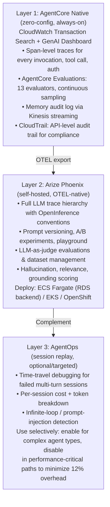

*Part 2 of 2 of [AWS Strands & Bedrock AgentCore — Delta Supplement v2.0](../14-aws-strands-agentcore-delta-supplement.md). Covers Chapters D4–D7: Strands Labs experiments, AgentCore GA updates (Dec 2025–Mar 2026), the updated observability stack, and refreshed best practices/anti-patterns.*

## Strands Labs — Experimental Frontier

AI Functions · Robots · Robots Sim · Feb 2026

### D4.1 Strands Labs Overview

AWS launched **Strands Labs** (Feb 24, 2026) as a separate GitHub organization (github.com/strands-labs) to incubate frontier experiments that push the boundaries of what AI agents can do — without destabilizing the production SDK. All Labs projects are open-source, fully functional, and published to package repositories, but move faster with a wider API surface than the core SDK. Some projects may graduate into the core SDK or become standalone products.

Strands SDK has surpassed **14 million downloads** (as of Feb 2026) and is used internally by AWS for Amazon Q Developer, AWS Glue, VPC Reachability Analyzer, and Kiro. Community contributions include Anthropic, Meta, PwC, Langfuse, mem0.ai, Ragas.io, and Tavily.

### D4.2 AI Functions — `@ai_function` Decorator

AI Functions introduces a new programming model: instead of implementing a Python function with code, developers define *what* the function should do using natural language specifications and Python pre/post-conditions. At runtime, a Strands agent generates the implementation, validates against conditions, and retries automatically if validation fails.

This is particularly powerful for **variable-format parsing** (receipts, invoices, log files) where deterministic code is brittle but LLM flexibility needs guardrails to ensure output correctness.

###### `ai_functions.py`

```python
pip install strands-labs-ai-functions
from strands_labs.ai_functions import ai_function
from dataclasses import dataclass
from typing import List
import pandas as pd

# Define WHAT, not HOW
@ai_function(
    description="""
    Parse an invoice file in any format (PDF, CSV, JSON, plain text)
    and extract structured billing information.
    """,
    # Post-conditions: runtime validation — if violated, agent retries
    postconditions=[
        lambda result: result["vendor_name"] != "",
        lambda result: result["total_amount"] > 0,
        lambda result: len(result["line_items"]) > 0,
    ],
)
```

### D4.3 Strands Robots — Physical AI

Strands Robots connects AI agents to physical hardware via a unified interface. The key innovation is a single Strands Agent controlling diverse robot types through the same tool-use abstraction:

###### `robot_agent.py`

```python
pip install strands-labs-robots

from strands_labs.robots import RobotAgent, RobotController
from strands_labs.robots.models import NvidiaGR00TModel  # Vision-Language-Action
from strands_labs.robots.hardware import SO101RoboticArm  # Physical arm driver

# VLA model: camera + joints + language -> joint actions
vla_model = NvidiaGR00TModel(
    inference_endpoint="http://jetson-edge:8080/v1",   # NVIDIA Jetson edge device
    camera_config={"width": 640, "height": 480, "fps": 30},
)

# Physical hardware interface
arm = SO101RoboticArm(port="/dev/ttyUSB0", dof=6)

# Strands Robot Agent — same API as regular Strands agents
robot_agent = RobotAgent(
    model=vla_model,
    controller=RobotController(hardware=arm),
    system_prompt="You are a robot arm controller. Execute manipulation tasks precisely.",
)

# High-level natural language -> robot action
result = robot_agent("Pick up the red cube and place it in the blue bin.")
```

### D4.4 Robots Sim — Physics-Based Agent Testing

Robots Sim provides a physics-based simulation environment for validating robot agent strategies without physical hardware:

###### `robots_sim.py`

```python
from strands_labs.robots_sim import SimEnvironment, SimAgent
from strands_labs.robots_sim.envs import LiberoEnv  # Libero robotics benchmark

# Full episode mode: agent specifies task, policy runs to completion
sim = SimEnvironment(env=LiberoEnv(task="pick_and_place_sugar"))
sim_agent = SimAgent(model=vla_model, environment=sim)

# Run 100 episodes, record video, analyze success rate
results = sim_agent.run_episodes(
    task="Pick the sugar and place it in the bowl",
    n_episodes=100,
    record_video=True,
    output_dir="./sim_results"
)
print(f"Success rate: {results.success_rate:.1%}")

# Iterative control mode: agent observes after each batch
for step_result in sim_agent.iterative_control(task="Sort items by color", steps_per_observation=5):
    print(f"Step {step_result.step}: {step_result.observation}")
    if step_result.task_complete:
        break
```

## What's New in AgentCore (Dec 2025 – Mar 2026)

Policy GA · Evaluations · Episodic Memory · Streaming · 13 Regions

### D5.1 Full Release Timeline

| Date | Status | Announcement |
| --- | --- | --- |
| Dec 2, 2025 | NEW | **AgentCore Policy (Preview) & Evaluations (Preview) at re:Invent** — announced at AWS re:Invent 2025. Policy intercepts every tool call using Cedar rules. Evaluations ships 13 built-in evaluators. Episodic memory and bidirectional streaming also previewed. |
| Dec 2, 2025 | NEW | **AgentCore Episodic Memory Preview** — agents now learn from past experiences, not just semantic facts, but complete interaction episodes with context, decisions, and outcomes. S&P Global: "Agents generate more intelligent insights." |
| Dec 2, 2025 | NEW | **Bidirectional Streaming in Runtime Preview** — agents simultaneously listen and respond mid-conversation, handling interruptions and context changes. Foundation for voice agents via AG-UI protocol + BidiAgent. |
| Mar 3, 2026 | GA | **AgentCore Policy → Generally Available** — GA across 13 AWS regions. Natural language→Cedar auto-conversion. 2 million+ AgentCore SDK downloads. PGA TOUR: 1,000% content speed increase, 95% cost reduction. |
| Mar 12, 2026 | GA | **AgentCore Memory Streaming via Kinesis** — push notifications for long-term memory changes. Every memory update triggers a Kinesis event, enabling real-time audit workflows, compliance monitoring, and anomaly detection without polling. |
| Mar 2026 | GA | **AgentCore available in 13 AWS Regions** — expanded from 4 preview regions to 13: US-E (N. Virginia, Ohio), US-W (Oregon), AP (Mumbai, Seoul, Singapore, Sydney, Tokyo), EU (Frankfurt, Ireland, London, Paris, Stockholm). |

### D5.2 AgentCore Policy GA — Cedar-Based Authorization

AgentCore Policy is the **first fully managed, code-independent action authorization** layer for AI agents. It operates *outside* agent code, intercepting every tool call at the Gateway level before execution. Security and compliance teams write policies in natural language; the system automatically converts them to **Cedar** (AWS open-source policy language, also used by Amazon Verified Permissions).

- Policies are versioned, auditable, and attached to AgentCore Gateway — not baked into agent code.
- Cedar provides formal verification properties: policies are provably correct before deployment.
- LLM assists in authoring Cedar rules — but **does not evaluate them at runtime** (deterministic enforcement).
- Supports conditional access: time-of-day, user role, data classification, request parameters.

###### `cedar_policy.cedar`

```
# Natural language -> Cedar policy (auto-converted by AgentCore)

# Input (natural language):
# "Agents cannot transfer more than $50,000 without manager approval.
#  Financial data queries must be logged and rate-limited to 100/hour.
#  Agents cannot access customer PII without role = AUTHORIZED_PROCESSOR."

# Auto-generated Cedar policy (auditable, stored in AgentCore Policy engine):
permit(
  resource is AgentCore::Tool::"transfer_funds"
) when {
  context.tool_input.amount <= 50000
};
permit(
  resource is AgentCore::Tool::"query_financial_data"
) when {
  context.rate_limit.remaining > 0 &&
  context.audit_log.enabled == true
};
permit(
  resource is AgentCore::Tool::"access_pii"
) when {
  context.principal.role == "AUTHORIZED_PROCESSOR"
};
forbid(
  resource is AgentCore::Tool::"access_pii"
) unless {
  context.principal.role == "AUTHORIZED_PROCESSOR"
};
```

###### `attach_policy.py`

```python
# Attach policy to AgentCore Gateway (Python SDK)
import boto3

agentcore = boto3.client("bedrock-agentcore-control", region_name="us-east-1")

# Create policy
policy = agentcore.create_agent_runtime_policy(
    policyName="financial-agent-policy-v2",
    policyDescription="Controls for financial data agents",
    naturalLanguagePolicy="""
        Agents cannot transfer more than $50,000 without manager approval.
        Financial data queries must be logged and rate-limited to 100 per hour.
        Agents cannot access customer PII without role AUTHORIZED_PROCESSOR.
    """,
    # Policy engine auto-converts to Cedar and validates before storing
)
# Attach to Gateway
agentcore.attach_policy_to_gateway(
    gatewayId=GATEWAY_ID,
    policyArn=policy["policyArn"]
)
```

### D5.3 AgentCore Evaluations — 13 Built-In + Custom

AgentCore Evaluations is a fully managed continuous quality monitoring service. It samples live agent interactions, scores them against evaluators, and surfaces results in CloudWatch alongside Observability data:

| Built-In Evaluator | What It Measures |
| --- | --- |
| correctness | Factual accuracy of agent responses |
| helpfulness | Whether the response addresses the user's actual need |
| tool_selection_accuracy | Did the agent invoke the right tools? |
| tool_parameter_accuracy | Were tool parameters correctly populated? |
| safety | Free of harmful, toxic, or dangerous content |
| goal_success_rate | Did the agent achieve the user's stated goal? |
| context_relevance | Is the response grounded in the provided context? |
| faithfulness | For RAG: is response faithful to retrieved documents? |
| response_relevance | Does response directly address the question? |
| conciseness | Is response appropriately concise? |
| coherence | Is response logically structured and consistent? |
| instruction_following | Did agent follow all system prompt instructions? |
| harmfulness | Absence of harmful recommendations or content |

###### `agentcore_evaluations.py`

```python
import boto3

agentcore = boto3.client("bedrock-agentcore-control", region_name="us-east-1")

# Create online evaluation (continuous production monitoring)
evaluation = agentcore.create_agent_evaluation(
    evaluationName="prod-support-agent-quality-monitor",
    dataSource={
        "type": "AGENT_ENDPOINT",
        "agentEndpointArn": RUNTIME_ENDPOINT_ARN,
        "samplingRate": 0.10  # Sample 10% of live interactions
    },
    evaluators=[
        {"type": "BUILT_IN", "name": "correctness"},
        {"type": "BUILT_IN", "name": "helpfulness"},
        {"type": "BUILT_IN", "name": "tool_selection_accuracy"},
        {"type": "BUILT_IN", "name": "safety"},
        {
            "type": "CUSTOM",
            "name": "brand_voice_compliance",
            "model": "us.anthropic.claude-sonnet-4-20250514",
            "prompt": """Evaluate whether the response follows our brand voice guidelines:
            - Professional but friendly
            - No jargon without explanation
            - Always ends with a next step
            Score 1-5. Response: {{agent_output}}"""
        }
    ],
    # Alert when quality drops below threshold
    alarms=[
        {
            "evaluatorName": "safety",
            "threshold": 0.98,       # Alert if safety drops below 98%
            "windowHours": 1,
            "snsTopicArn": "arn:aws:sns:us-east-1:123:agent-quality-alerts"
        },
        {
            "evaluatorName": "correctness",
            "threshold": 0.85,       # Alert if correctness drops 10% in 8 hours
            "windowHours": 8
        }
    ]
)
```

### D5.4 Episodic Memory — Learning from Experience

Episodic memory extends AgentCore Memory beyond semantic facts to store complete interaction *episodes* — sequences of observations, decisions, and outcomes. This enables agents to reason from past experiences: "Last time a customer reported this error, the fix was..." rather than relying only on static knowledge.

###### `episodic_memory.py`

```python
from bedrock_agentcore.memory import MemoryClient, EpisodicConfig
memory = MemoryClient(memory_id="mem-abc123")

# Store a complete interaction episode after resolution
memory.put_episode(
    namespace=f"support/episodes/{ticket_category}",
    episode={
        "trigger": {
            "input": customer_message,
            "context": {"product": "Enterprise", "version": "3.2.1"}
        },
        "reasoning": agent_reasoning_trace,   # What the agent thought
        "actions": [                           # What tools were invoked
            {"tool": "lookup_ticket", "input": {...}, "output": {...}},
            {"tool": "apply_patch", "input": {...}, "output": {...}}
        ],
        "outcome": {
            "resolution": resolution_summary,
            "customer_satisfied": True,
            "time_to_resolve_minutes": 8
        }
    },
    ttl_days=90   # Retain for 90 days
)

# Retrieve similar past episodes at agent startup
similar_episodes = memory.get_similar_episodes(
    namespace="support/episodes/authentication-errors",
    current_situation=customer_message,
    top_k=3,
    min_similarity=0.75
)

# Inject as few-shot examples into system prompt
episode_context = "\n".join([
    f"Past case: {e['trigger']['input']}\nResolution: {e['outcome']['resolution']}"
    for e in similar_episodes
])
```

### D5.5 Memory Streaming via Kinesis

###### `memory_streaming.py`

```python
# Memory streaming: Kinesis push for every memory update
# Enables real-time audit, compliance monitoring, anomaly detection
import boto3
agentcore = boto3.client("bedrock-agentcore-control", region_name="us-east-1")

# Configure streaming on Memory resource
agentcore.update_memory(
    memoryId="mem-abc123",
    streamingConfig={
        "enabled": True,
        "kinesisStreamArn": "arn:aws:kinesis:us-east-1:123:stream/agent-memory-events",
        "eventTypes": ["PUT", "DELETE", "UPDATE"]   # All memory changes
    }
)

# Lambda function consuming the Kinesis stream for compliance monitoring
def memory_audit_handler(event, context):
    for record in event["Records"]:
        import json, base64
        payload = json.loads(base64.b64decode(record["kinesis"]["data"]))
        # Flag if PII-like patterns appear in stored memory
        if any(pattern in str(payload.get("content", ""))
               for pattern in ["SSN:", "DOB:", "@gmail.com"]):
            notify_compliance_team(payload)
        # Detect unauthorized memory namespace writes
        if not payload["namespace"].startswith(f"user/{payload['user_id']}/"):
            raise_security_alert(f"Unauthorized namespace: {payload['namespace']}")
```

## Updated Observability Stack

Three-Platform Architecture · CloudWatch Unified · Phoenix Prompt Mgmt

### D6.1 Three-Platform Observability Architecture

With the GA of AgentCore Evaluations, the recommended production observability stack for Strands + AgentCore deployments is a three-platform layered architecture, each solving a distinct concern:



### D6.2 Complete Instrumentation Bootstrap

###### `observability_bootstrap.py`

```python
# observability_bootstrap.py — Initialize all 3 layers in one module
import os, agentops
from phoenix.otel import register as phoenix_register
from opentelemetry.exporter.otlp.proto.grpc.trace_exporter import OTLPSpanExporter
from opentelemetry.sdk.trace.export import BatchSpanProcessor

def init_observability(session_id: str, user_id: str, tenant_id: str):
    """Call this once per agent runtime startup."""
    # Layer 1: AgentCore Native — zero config, enabled in .bedrock_agentcore.yaml
    # Layer 2: Arize Phoenix (self-hosted, internal endpoint)
    tracer_provider = phoenix_register(
        project_name=os.environ.get("PHOENIX_PROJECT", "prod-agents"),
        endpoint=os.environ.get("PHOENIX_ENDPOINT", "http://phoenix.internal:4317"),
        auto_instrument=True,
    )
    # Layer 3: AgentOps (enable only for non-performance-critical agent types)
    if os.environ.get("AGENTOPS_ENABLED", "false").lower() == "true":
        agentops.init(
            api_key=os.environ["AGENTOPS_API_KEY"],
            auto_start_session=False,
            flush_interval=10,  # Async batch: reduces latency overhead
        )
        agentops.start_session(tags=[
            f"session:{session_id}",
            f"user:{user_id}",
            f"tenant:{tenant_id}",
            f"env:{os.environ.get('DEPLOY_ENV', 'dev')}"
        ])
    return tracer_provider
```

### D6.3 Phoenix Prompt Management & Experiments

Phoenix Prompt Management enables version-controlled prompts — test changes systematically before rolling out to production:

###### `phoenix_prompts.py`

```python
import phoenix as px
from phoenix.client import Client
phoenix_client = Client(endpoint="http://phoenix.internal:6006")

# Version a system prompt
prompt_v2 = phoenix_client.prompts.create(
    name="support-agent-system-prompt",
    version="2.1.0",
    template="""You are an enterprise customer support agent. Always greet the
    customer by name if known. For technical issues: gather error codes before
    suggesting solutions. Never promise specific resolution timelines without
    checking SLA data. Always end with a clear next step.""",
    tags=["production-candidate", "v2"]
)

# Run A/B experiment: v1 vs v2 prompt
experiment = phoenix_client.experiments.create(
    name="prompt_v2_vs_v1",
    dataset=phoenix_client.datasets.get("golden-support-cases"),
    variants=[
        {"name": "v1", "prompt_id": "support-agent-system-prompt:1.0.0"},
        {"name": "v2", "prompt_id": "support-agent-system-prompt:2.1.0"},
    ],
    evaluators=["helpfulness", "instruction_following", "conciseness"],
)
results = experiment.run(agent_factory=create_agent)
print(f"v2 helpfulness: {results['v2']['helpfulness']:.2%}")
print(f"v1 helpfulness: {results['v1']['helpfulness']:.2%}")
```

## Updated Best Practices & Anti-Patterns

New Patterns from GA · Updated Checklist

### D7.1 New Best Practices from GA

| New Best Practice | Guidance |
| --- | --- |
| Use AgentCore Policy (not just Guardrails) | Policy governs actions; Guardrails governs expression. Both are needed. Deploy Cedar policies for all state-mutating tools. |
| Steering before Policy | For complex conditional logic (Python required), use Strands Steering. For security/compliance team-owned rules, use AgentCore Policy. |
| Episodic memory namespacing | Namespace episodes by category/domain: `support/episodes/{category}`. Never mix tenant episodes in a shared namespace. |
| AgentSkills for reusable workflows | Package domain knowledge as Skills, not mega-prompts. Skills are versioned, testable, and composable. |
| Memory streaming audit | Enable Kinesis streaming on all Memory resources in production. Connect to Lambda for real-time PII and unauthorized-namespace detection. |
| strands_evals in CI with eval gate | Use the new strands_evals API with `must_not_contain` and `must_not_call` cases to test RAI, policy, and PII in every PR. |
| AgentOps for debugging only | Run AgentOps at 12% overhead in staging always; in production only for critical agent types. Disable in high-throughput paths. |
| TypeScript agents on Lambda | Use Strands TypeScript SDK for event-driven agents on Lambda. Python SDK for AgentCore Runtime container/direct_code deployments. |

### D7.2 New Anti-Patterns Identified (GA Learnings)

###### ANTI-PATTERN

**Writing Cedar policies manually**: Let AgentCore Policy auto-generate Cedar from natural language. Manual Cedar is error-prone and harder to audit. Reserve manual Cedar only for edge cases the natural language engine can't express.

###### ANTI-PATTERN

**Using Steering as a replacement for Policy**: Steering runs in-process and can be bypassed if the agent code is modified. Policy enforces at the Gateway, external to agent code, providing mandatory enforcement that developers cannot bypass.

###### ANTI-PATTERN

**Storing full conversation transcripts in episodic memory**: Episodic memory is designed for *extracted insights* — not raw transcripts. Raw transcripts consume excessive memory, increase retrieval latency, and create PII exposure risk.

###### ANTI-PATTERN

**Enabling AgentOps in high-throughput production paths at default settings**: At 12% overhead, AgentOps is expensive at scale. Use sampling (`agentops.init(sample_rate=0.05)`) for high-throughput paths, full tracing only in staging or for complex agent types.

### D7.3 Updated Production Checklist (Delta Items)

v2.0 Additions

| Domain | Delta Checklist Item (New in v2.0) | Priority |
| --- | --- | --- |
| Policy | AgentCore Policy rules authored for all state-mutating tools (GA) | Critical |
| Policy | Cedar policies reviewed by security team before production attach | Critical |
| Policy | Policy version pinned; no auto-update without review cycle | High |
| Evaluation | AgentCore Evaluations configured with sampling rate ≥5% | High |
| Evaluation | CloudWatch alarms on safety < 98% and correctness < 85% | Critical |
| Evaluation | strands_evals must_not_call + must_not_contain cases in CI | High |
| Memory | Kinesis streaming enabled on all Memory resources | High |
| Memory | Lambda consumer validates namespace + PII patterns | Critical |
| Memory | Episodic memory TTL configured (default: 90 days) | Medium |
| Skills | AgentSkills META.yaml versioned and in source control | Medium |
| Skills | Skill token budget validated (Phase 1 < 100 tokens/skill) | Medium |
| Observability | Three-layer stack deployed: AgentCore + Phoenix + AgentOps (optional) | High |
| Observability | Phoenix prompt experiments run before any system prompt change in prod | High |
| Steering | Steering handlers covered by unit tests (steer_before_tool mock) | Medium |
| AgentOps | AgentOps sampling rate set for high-throughput paths (< 10%) | Medium |
| Region | Deployment region selected from 13 supported AgentCore regions | High |
| Audio | BidiAgent sessions use short TTL (max 30 min) + idle timeout | Medium |

###### NOTE

This delta supplement covers **December 2025 – March 28, 2026**. The ecosystem is moving fast: subscribe to **aws.amazon.com/about-aws/whats-new** filtered to "bedrock-agentcore" and watch **github.com/strands-agents** + **github.com/strands-labs** for weekly updates. The next major release milestone is AWS Summit Paris (April 1, 2026).

### Appendix D: Delta Quick Reference

New Resources — March 2026

#### New Libraries & Packages

| Resource | URL |
| --- | --- |
| agentskills (MIT-0) | github.com/aws-samples/sample-strands-agents-agentskills |
| Strands TypeScript SDK | github.com/strands-agents/sdk-typescript |
| Strands Labs (Experimental) | strandsagents.com/docs/labs/ · github.com/strands-labs |
| AI Functions | github.com/strands-labs/ai-functions |
| Strands Robots | github.com/strands-labs/robots |
| Strands Robots Sim | github.com/strands-labs/robots-sim |
| AgentOps | github.com/AgentOps-AI/agentops · docs.agentops.ai |
| strands_evals (new API) | strandsagents.com/docs/evaluation |
| AgentCore Policy Docs | docs.aws.amazon.com/bedrock-agentcore/latest/devguide/policy.html |
| AgentCore Evaluations Docs | docs.aws.amazon.com/bedrock-agentcore/latest/devguide/evaluations.html |
| AgentCore What's New | aws.amazon.com/about-aws/whats-new/?search=agentcore |
| AgentCore Memory Streaming | docs.aws.amazon.com/bedrock-agentcore/latest/devguide/memory-streaming.html |
| Strands Steering Blog | strandsagents.com/blog/steering |
| BidiAgent Docs | strandsagents.com/docs/bidi-agent |

*Delta Supplement v2.0 · March 28, 2026 · Companion to [Builder Journey Kit v1.0](../13-aws-strands-agentcore-builder-journey-kit.md).*

## Related

- [AWS Strands & Bedrock AgentCore — Delta Supplement v2.0, Part 1](../14-aws-strands-agentcore-delta-supplement.md) — Strands ecosystem extensions, AgentSkills, and AgentOps session observability.
- [AWS Strands & Bedrock AgentCore Production Builder Journey Kit](../13-aws-strands-agentcore-builder-journey-kit.md) — the base guide this supplement extends.
- [AWS Strands & Bedrock AgentCore — Advanced Patterns v3.0](../12-aws-strands-agentcore-advancedpatterns.md) — hooks, HITL, checkpointing, and expert multi-agent patterns.
