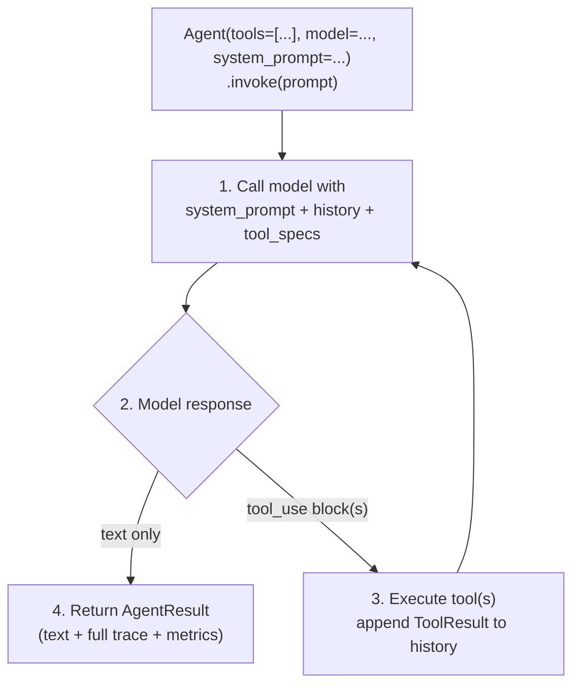

> Continues from [Amazon Bedrock AgentCore & Strands SDK — Deep Technical Research Report](../18-agentcore-strands-deep-research-report.md), covering the Strands Agents SDK deep dive and Observability.

## Part XI — Strands Agents SDK Deep Dive

### Architecture and Philosophy

Strands Agents is AWS's open-source (Apache 2.0), model-driven agent SDK, available for Python and TypeScript, and the framework that internally powers AgentCore harness. Its central design bet is the **agentic loop over an orchestration graph**: rather than requiring a developer to hand-wire a state machine of steps, Strands hands the model the conversation, the system prompt, and descriptions of available tools, and lets the model itself decide — each turn — whether to respond in natural language, plan a sequence of steps, reflect on prior steps, or invoke one or more tools. This is explicitly the **ReAct** (Reasoning and Acting) pattern; Strands' contribution is a clean, minimal implementation of that loop plus production plumbing (streaming, hooks, multi-agent orchestration, MCP, observability) around it.

*The Strands agentic loop: the model decides each turn whether to respond directly or invoke tools, repeating until a final text response.*

## Tools

Any Python function decorated with `@tool` (or, in TypeScript, defined via the `tool()` helper with a Zod input schema) becomes callable by the model — no separate registration step, no adapter class. During local development, Strands supports **hot-reloading**: point it at a directory and newly added or edited tool files are picked up automatically without restarting the agent process. This is explicitly flagged by independent reviewers (Starlog, May 2026) as a **production security liability if left enabled** — hot-reload implies arbitrary code execution on file modification with no sandboxing, versioning, or access control, and the framework does not itself warn against this in-band. The correct operational posture is to treat hot-reload as strictly a local/dev-only feature and ensure it is disabled (or simply absent, by not mounting a watched directory) in any Runtime/Harness container deployed to production.

A community-maintained `strands-agents-tools` package supplies 20+ pre-built tools (calculator, HTTP requests, AWS API wrappers, a semantic-search retrieve tool over Bedrock Knowledge Bases, and more).

## Model Abstraction

Strands normalizes message formats, streaming protocols, and tool-calling conventions behind a single `Model` interface, with first-class providers for **Amazon Bedrock** (default), **Anthropic** (direct API), **OpenAI**, **Google Gemini**, **Ollama**, and **LiteLLM** (which in turn opens dozens of additional providers). Community-contributed providers extend this further (Cohere, xAI, Fireworks AI, NVIDIA NIM, vLLM, MLX, SGLang). Swapping providers is a one-line change (`BedrockModel(...)` → `OpenAIModel(...)`), which is precisely the abstraction Harness exposes at the API level via its four provider-family override.

## MCP and A2A as First-Class Tool Sources

Strands treats an `McpClient` as a `ToolProvider` — it can be passed directly into an `Agent`'s `tools=[...]` list alongside plain Python functions, with the SDK handling connection lifecycle (Python requires a `with` context manager; TypeScript manages this implicitly). Multiple transports are supported (stdio, Streamable HTTP, SSE); for AWS-hosted MCP servers using SigV4 authentication, the community `mcp-proxy-for-aws` package handles AWS credential brokering transparently. Strands also implements the **Agent-to-Agent (A2A)** protocol, letting agents call other agents as tools — this is the SDK-level primitive that AgentCore Gateway's HTTP-target passthrough mode is designed to route at the platform level.

## Multi-Agent Orchestration Patterns

Strands ships three built-in multi-agent topologies:

- **Graph** — nodes are agents, edges define explicit hand-off order; deterministic, developer-defined routing (e.g., researcher → writer).
- **Swarm** — agents decide their own routing at runtime; each agent chooses whether to hand off to a peer or produce the final response, making the execution path model-driven rather than developer-fixed.
- **Workflow** — natural-language-defined multi-step task decomposition for consistency across complex, repeatable processes (via the separate `agent-sop` companion project).

## Hooks, Guardrails, and the Harness-SDK Extension

Strands exposes lifecycle hooks (`BeforeToolCallEvent` and others) that let a developer intercept, log, validate, or veto any step of the loop — for example, canceling a tool call whose arguments fail a business rule before it ever executes, entirely inside the agent process. A separate, newer package, **harness-sdk** (the open-source counterpart to the managed AgentCore harness), extends this pattern with **Steering handlers** that let an agent correct itself mid-course rather than failing silently, and traces every decision by default.

## Observability Built In

Every `Agent.invoke()` call returns an `AgentResult` carrying full trace and metrics data by default — no separate instrumentation step is required to get *basic* visibility into what the agent did. For production-grade distributed tracing, Strands emits standard **OpenTelemetry (OTEL)** spans, which is the exact mechanism that makes it trivially compatible with AgentCore Observability, Arize Phoenix, Datadog, LangSmith, Langfuse, W&B Weave, and Braintrust simultaneously — the SDK does not pick a proprietary telemetry format.

## Deployment Models

Strands agents are "just Python" (or Node) — they can run anywhere: locally, on Lambda, Fargate, EC2, EKS, or wrapped via the `BedrockAgentCoreApp` helper and deployed directly to AgentCore Runtime via the AgentCore CLI or container workflows. AWS's reference architectures document separating concerns between the agentic loop (running in one environment) and tool execution (running in an isolated backend, e.g., Lambda-hosted tools called from a Fargate-hosted loop), as well as a **return-of-control** pattern where the *client* — not the agent's own runtime — is responsible for actually executing a requested tool call, which is the SDK-level analog of Harness's inline-function pattern described in Part VI.

## Documented Production Gaps (Independent Assessment)

An independent, critical review (Starlog, May 2026) — while broadly positive on Strands' developer experience — flags concrete production gaps a platform team should plan around rather than assume are solved by the SDK alone:

- **No built-in session-management abstraction** beyond the conversation buffer — no native vector store for semantic memory, no conversation-summarization utility. (AgentCore Memory is the documented AWS-native answer to this specific gap when running on AgentCore.)
- **Primitive error handling** — a failing tool call's exception bubbles up and terminates the agent by default; there is no automatic retry, no circuit breaker, and no structured mechanism to hand a failure back to the model so it can try an alternative approach. Production deployments need custom error boundaries wrapped around tool invocations.
- **MCP subprocess execution and hot-reloading are both flagged as security concerns for multi-tenant or untrusted-input contexts** — neither ships with sandboxing, resource limits, or access controls by default; this is a framework-level gap that AgentCore's platform-level isolation (microVMs, Code Interpreter sandboxing) is specifically designed to compensate for when Strands runs *on* AgentCore, but the gap is real if Strands is run bare, off-platform.

### Strands ↔ AgentCore Service Mapping

| Strands SDK Concept | AgentCore Service It Maps To |
|---|---|
| Agent loop execution | Runtime (or Harness, which wraps Strands automatically) |
| `@tool` functions, custom Python tools | Executed in-process inside the Runtime microVM, or offloaded to Gateway-fronted Lambda/API targets |
| `McpClient` tool sources | Gateway (aggregated MCP targets) or direct Runtime-hosted MCP servers |
| Model provider abstraction | Harness's multi-provider `InvokeHarness` override, or direct Bedrock/Anthropic/OpenAI/Gemini calls from Strands code |
| Session/conversation state | AgentCore Memory (short-term); externalized state stores for MCP protocol state |
| Hooks (`BeforeToolCallEvent`, etc.) | Complements, but does not replace, Gateway Lambda interceptors and Cedar Policy — hooks run *inside* the trusted agent process; Policy/interceptors run *outside* it, which is the security-relevant distinction |
| OTEL trace emission | AgentCore Observability / CloudWatch GenAI Observability, or any OTEL-compatible backend (Phoenix, Datadog, etc.) |
| A2A protocol | Gateway HTTP-target passthrough for agent-to-agent traffic |
| Local dev / hot-reload | Explicitly **not** a production pattern; disable before deploying to Runtime/Harness |
| `harness-sdk` (open-source) | Conceptual sibling to the managed AgentCore harness — same steering/guardrail philosophy, self-hosted |

## Part XII — Observability

### AWS-Native: AgentCore Observability + CloudWatch GenAI Observability

AgentCore Observability is available uniformly across every AgentCore service (Runtime, Gateway, Policy, Memory, Browser, Code Interpreter, Harness) and is powered end-to-end by **Amazon CloudWatch**, using **OpenTelemetry (OTEL)** as its underlying instrumentation standard via the AWS Distro for OpenTelemetry (ADOT). Because the instrumentation layer is OTEL rather than a proprietary schema, telemetry is natively exportable to any OTEL-compatible backend — AWS explicitly lists Arize Phoenix, Datadog, Dynatrace, Braintrust, Langfuse, and LangSmith as supported integration targets alongside CloudWatch itself.

**What CloudWatch GenAI Observability surfaces natively:** traces (full span hierarchy across model calls, tool invocations, memory reads/writes, gateway/policy decisions), session counts, latency and duration percentiles, token usage, error rates, and — since December 2025 — direct integration with **AgentCore Evaluations**, correlating the 13 built-in quality evaluators' scores (helpfulness, tool-selection accuracy, correctness, safety) with the underlying prompts, tool calls, and logs in the same dashboard, plus Application Signals, Alarms, Sensitive Data Protection, and Logs Insights integration. Custom business metadata can be attached to traces, making observability legible to non-engineering stakeholders reviewing agent decisions.

**What CloudWatch does *not* natively provide, per independent assessment:** a dedicated LLM-evaluation *platform* comparable to Phoenix or Braintrust's evaluation-first tooling — AWS's own Evaluations service covers this to a meaningful degree as of 2026, but independent observability-landscape analysis (exploreagentic.ai, April 2026) still characterizes AWS's strength as the *infrastructure-native, cloud-integrated* pick rather than the evaluation-experimentation-first pick.

### Phoenix (Arize)

Phoenix is Arize's open-source (Elastic License 2.0) AI observability and evaluation platform, vendor- and language-agnostic, with out-of-the-box auto-instrumentation (via the OpenInference project) for a wide range of frameworks and providers including AWS Bedrock directly. It can run entirely locally (zero cloud account, localhost:6006), in a notebook, containerized, or via Arize's own hosted cloud instance (app.phoenix.arize.com). Because AgentCore is OTEL-compliant by construction, the integration pattern documented by both AWS and Arize is: build the agent (any framework, commonly Strands), package as a container, deploy to AgentCore Runtime, and point Runtime's OTEL exporter at Phoenix — no code changes to the agent logic itself are required to add this second observability lane.

Phoenix's differentiated strengths, per Arize's own documentation and independent comparative reviews: **prompt/response lineage tracing** with full reasoning-chain visibility, **built-in evaluation** (LLM-as-judge scoring on dimensions like tool-calling correctness, with per-trace score attribution visible inline), drift detection, and cost analysis — capabilities that sit adjacent to, rather than duplicate, CloudWatch's infrastructure-metrics strength.

### Comparative Recommendation: CloudWatch-Only vs. Phoenix-Only vs. Hybrid

| Dimension | CloudWatch Only | Phoenix Only | Hybrid (Recommended for most enterprise deployments) |
|---|---|---|---|
| Infra health (latency, errors, token cost) | Strong — native, zero extra setup | Weak — not its focus | CloudWatch |
| Reasoning-chain / trace-level debugging | Adequate | Strong — purpose-built UI for this | Phoenix |
| Quality evaluation (LLM-as-judge, drift) | Adequate (13 built-in evaluators via AgentCore Evaluations) | Strong — evaluation-first design | Phoenix for exploratory eval, CloudWatch for continuous production scoring |
| Compliance / audit trail, IAM-integrated access | Strong — native CloudTrail, Sensitive Data Protection | Weak unless self-hosted with matching controls | CloudWatch |
| Vendor neutrality / multi-cloud portability | Weak — CloudWatch is AWS-only | Strong — runs anywhere, OTEL-native | Phoenix as the portable layer if a multi-cloud future is plausible |
| Setup cost | Zero (default-on with AgentCore) | Low if self-hosted; adds an operational component | Marginal — one exporter config, same OTEL stream |

**Recommended enterprise reference architecture:** treat CloudWatch as the **system-of-record for infrastructure health, cost, and compliance audit** (it is already the default, zero-setup path and integrates with existing AWS-native alerting/IAM), and layer Phoenix (or another OTEL-compatible platform such as Braintrust if evaluation-driven deployment gating is the priority) as the **engineering-facing trace-debugging and evaluation workbench**. Because both consume the same OTEL stream Strands/AgentCore already emits, this is additive rather than a fork in instrumentation strategy — a pattern independently validated by multiple June 2026 practitioner write-ups describing exactly this "CloudWatch for infra, Phoenix for traces, LLM-as-judge for quality" three-layer model.

### Distributed Tracing, Span Hierarchy, and Root-Cause Analysis

A single agent turn typically produces a span tree: session span → model-invocation span(s) → tool-call span(s) (each nested under the model turn that requested it) → Gateway request/response-interceptor spans → Policy evaluation span → downstream target span (Lambda/API/MCP). Correlation IDs propagate through the entire chain, including across a multi-agent hand-off (Graph/Swarm), which is what makes it possible to root-cause a failure that originated in a specialist agent three hops downstream from the entry point. AWS's own **Agent Inspector** and **Optimization/failure-insights** capabilities (GA by mid-2026) are built directly on top of this span data: failure insights specifically targets **silent behavioral failures that produce no error signal** — the hardest class of production agent bug — by mining recurring patterns across hundreds of sessions and ranking them by prevalence, with continuous daily/weekly reports or targeted post-deployment investigations completing in minutes rather than requiring manual trace archaeology.

## Related

- [Deep Research Report](../18-agentcore-strands-deep-research-report.md) — executive summary, platform foundations, Runtime, Gateway
- [Deep Research Report (Part 3)](18-agentcore-strands-deep-research-report-part3.md) — Identity, Memory, Browser & Code Interpreter, MCP server hosting
- [Deep Research Report (Part 5)](18-agentcore-strands-deep-research-report-part5.md) — Security threat model, production architecture, release analysis
