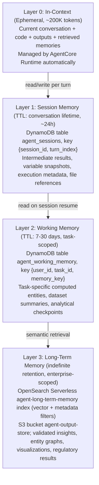

> Continues from [Bedrock AgentCore Code Interpreter Architecture](../19-bedrock-agentcore-code-interpreter-architecture.md), covering Code Interpreter + Memory Design: memory architecture layers, session state synchronization, data lineage tracking, the long-term memory write policy, PII detection/redaction, and memory summarization for large datasets.

## Code Interpreter + Memory Design

### Memory Architecture Layers



### Code Interpreter Session State and Memory Interplay

The fundamental design challenge: Code Interpreter sessions hold Python runtime state (variables, loaded dataframes, in-memory objects) that is NOT automatically persisted. AgentCore Memory holds structured, queryable knowledge. These two stores must be explicitly synchronized.

**State synchronization protocol:**

```python
import json
import pickle
import boto3
import hashlib
from dataclasses import dataclass, asdict
from typing import Any, Dict, Optional
from datetime import datetime

@dataclass
class ExecutionCheckpoint:
    """
    Serializable representation of Code Interpreter session state.
    Stored in S3 + indexed in DynamoDB for fast retrieval.
    """
    session_id: str
    turn_index: int
    timestamp: str
    variables: Dict[str, Any]           # JSON-serializable subset
    file_references: Dict[str, str]     # {local_path: s3_uri}
    dataframe_schemas: Dict[str, dict]  # Column names + dtypes (not data)
    execution_summary: str              # LLM-generated summary of what was computed
    entities_extracted: list            # Named entities from output
    data_lineage: list                  # Chain of transformations applied
    pii_redacted: bool
    classification: str                 # PUBLIC, INTERNAL, CONFIDENTIAL, RESTRICTED

class CodeInterpreterStateManager:
    """
    Manages bidirectional sync between Code Interpreter session state
    and AgentCore Memory layers.
    """

    def __init__(self, s3_bucket: str, dynamodb_table: str, kms_key_id: str):
        self.s3 = boto3.client('s3', region_name='eu-west-1')
        self.dynamodb = boto3.resource('dynamodb', region_name='eu-west-1')
        self.table = self.dynamodb.Table(dynamodb_table)
        self.s3_bucket = s3_bucket
        self.kms_key_id = kms_key_id

    def checkpoint_session(
        self,
        session_id: str,
        turn_index: int,
        local_files: Dict[str, bytes],
        variable_snapshot: Dict[str, Any],
        execution_output: str,
        entities: list,
        lineage: list,
        classification: str = "CONFIDENTIAL"
    ) -> ExecutionCheckpoint:
        """
        After each Code Interpreter execution, checkpoint state to S3 + DynamoDB.
        This enables session resumption and cross-agent memory sharing.
        """
        timestamp = datetime.utcnow().isoformat()
        file_refs = {}

        # Persist output files to S3 with KMS encryption
        for local_path, content in local_files.items():
            s3_key = f"checkpoints/{session_id}/{turn_index}/{local_path}"
            self.s3.put_object(
                Bucket=self.s3_bucket,
                Key=s3_key,
                Body=content,
                ServerSideEncryption='aws:kms',
                SSEKMSKeyId=self.kms_key_id,
                Metadata={
                    'session-id': session_id,
                    'turn-index': str(turn_index),
                    'classification': classification,
                }
            )
            file_refs[local_path] = f"s3://{self.s3_bucket}/{s3_key}"

        # Filter variable snapshot to JSON-serializable types only
        safe_vars = self._safe_serialize_variables(variable_snapshot)

        checkpoint = ExecutionCheckpoint(
            session_id=session_id,
            turn_index=turn_index,
            timestamp=timestamp,
            variables=safe_vars,
            file_references=file_refs,
            dataframe_schemas=self._extract_df_schemas(variable_snapshot),
            execution_summary=self._generate_summary(execution_output),
            entities_extracted=entities,
            data_lineage=lineage,
            pii_redacted=True,  # Assumed: PII scan ran pre-checkpoint
            classification=classification,
        )

        # Index in DynamoDB for fast session resumption
        self.table.put_item(Item={
            'pk': f"SESSION#{session_id}",
            'sk': f"TURN#{turn_index:06d}",
            'checkpoint': asdict(checkpoint),
            'ttl': int((datetime.utcnow().timestamp()) + 86400 * 7),  # 7-day TTL
        })

        return checkpoint

    def rehydrate_session(
        self,
        session_id: str,
        target_turn: Optional[int] = None
    ) -> tuple[str, Dict]:
        """
        Reconstruct the Code Interpreter context for a resumed session.
        Returns: (rehydration_code, variable_context)

        This generates Python code that, when executed in a new Code Interpreter
        session, reconstructs the analytical state from a prior session.
        """
        # Fetch latest or specific checkpoint
        if target_turn:
            response = self.table.get_item(
                Key={'pk': f"SESSION#{session_id}", 'sk': f"TURN#{target_turn:06d}"}
            )
            checkpoint = ExecutionCheckpoint(**response['Item']['checkpoint'])
        else:
            checkpoint = self._get_latest_checkpoint(session_id)

        # Generate rehydration Python code
        rehydration_code = self._generate_rehydration_code(checkpoint)

        return rehydration_code, checkpoint.variables

    def _generate_rehydration_code(self, checkpoint: ExecutionCheckpoint) -> str:
        """
        Generates Python code to reconstruct session state in a new sandbox.
        Downloads S3 files, recreates dataframes from schemas.
        """
        lines = [
            "# === SESSION REHYDRATION CODE (auto-generated) ===",
            "import boto3, pandas as pd, json",
            f"# Reconstructing session: {checkpoint.session_id}",
            f"# From turn: {checkpoint.turn_index} at {checkpoint.timestamp}",
            "",
            "s3 = boto3.client('s3')",
        ]

        for local_path, s3_uri in checkpoint.file_references.items():
            bucket, key = s3_uri.replace("s3://", "").split("/", 1)
            lines.append(
                f"s3.download_file('{bucket}', '{key}', '/tmp/{local_path}')"
            )

        for var_name, value in checkpoint.variables.items():
            safe_val = json.dumps(value)
            lines.append(f"{var_name} = {safe_val}")

        lines.append("# === END REHYDRATION ===")
        return "\n".join(lines)

    def _safe_serialize_variables(self, variables: Dict) -> Dict:
        """Only serialize JSON-safe primitive types. DataFrames → schema only."""
        safe = {}
        for k, v in variables.items():
            if isinstance(v, (str, int, float, bool, list, dict)):
                safe[k] = v
            elif hasattr(v, 'to_dict'):  # DataFrame-like
                safe[k] = f"<DataFrame: {len(v)} rows>"
        return safe

    def _extract_df_schemas(self, variables: Dict) -> Dict:
        schemas = {}
        for k, v in variables.items():
            if hasattr(v, 'dtypes'):
                schemas[k] = {col: str(dtype) for col, dtype in v.dtypes.items()}
        return schemas

    def _generate_summary(self, output: str) -> str:
        """Truncate long output for memory storage (max 2048 chars)."""
        if len(output) > 2048:
            return output[:1000] + "\n...[truncated]...\n" + output[-500:]
        return output

    def _get_latest_checkpoint(self, session_id: str) -> ExecutionCheckpoint:
        response = self.table.query(
            KeyConditionExpression='pk = :pk',
            ExpressionAttributeValues={':pk': f"SESSION#{session_id}"},
            ScanIndexForward=False,
            Limit=1,
        )
        return ExecutionCheckpoint(**response['Items'][0]['checkpoint'])
```

### Data Lineage Tracking

Every Code Interpreter execution generates a lineage record — a directed acyclic graph (DAG) node capturing the provenance chain:

```python
@dataclass
class LineageNode:
    """
    Tracks the complete provenance of a computed artifact.
    Critical for EU banking regulatory audit requirements.
    """
    node_id: str                    # UUID
    session_id: str
    turn_index: int
    timestamp: str

    # Input lineage
    input_sources: list             # S3 URIs, API endpoints, memory keys
    input_checksum: str             # SHA-256 of all inputs

    # Transformation
    code_hash: str                  # SHA-256 of executed Python code
    code_version: str               # Git commit or hash for reproducibility
    library_versions: Dict[str, str]  # {"pandas": "2.1.0", ...}

    # Output
    output_artifacts: list          # S3 URIs of produced files
    output_checksum: str            # SHA-256 of outputs

    # Metadata
    agent_id: str
    user_id: str                    # Pseudonymized for GDPR
    computation_type: str           # "risk_calculation", "visualization", etc.
    deterministic: bool             # Is this computation reproducible?

    # Regulatory
    regulatory_relevant: bool       # Triggers extended retention if True
    retention_days: int             # 7 years for regulatory-relevant artifacts
```

### Long-Term Memory Write Policy

Not all computed outputs should be persisted. The Memory Write Policy enforces quality gates:

```python
from enum import Enum
from dataclasses import dataclass

class MemoryWriteDecision(Enum):
    PERSIST_SUMMARY = "persist_summary"
    PERSIST_FULL = "persist_full"
    PERSIST_ENTITY_ONLY = "persist_entity_only"
    DISCARD = "discard"
    HUMAN_REVIEW_REQUIRED = "human_review_required"

@dataclass
class MemoryWritePolicy:
    """
    Opinionated policy for what gets written to long-term memory.
    Applied AFTER post-execution validation and PII scanning.
    """

    def evaluate(
        self,
        output: str,
        output_type: str,
        classification: str,
        execution_success: bool,
        pii_detected: bool,
        numeric_sanity_passed: bool,
        regulatory_relevant: bool,
    ) -> MemoryWriteDecision:

        # Hard blocks -- never persist these
        if pii_detected and not self._pii_fully_redacted(output):
            return MemoryWriteDecision.DISCARD

        if not execution_success:
            return MemoryWriteDecision.DISCARD

        if not numeric_sanity_passed and output_type == "risk_calculation":
            return MemoryWriteDecision.HUMAN_REVIEW_REQUIRED

        # Regulatory computations: persist full with extended retention
        if regulatory_relevant:
            return MemoryWriteDecision.PERSIST_FULL

        # Large outputs: summarize before persisting
        if len(output) > 10_000:
            return MemoryWriteDecision.PERSIST_SUMMARY

        # Entity-dense outputs (risk metrics, KPIs): extract entities
        if output_type in ("risk_metrics", "portfolio_stats", "kpi_report"):
            return MemoryWriteDecision.PERSIST_ENTITY_ONLY

        # Default: persist summary
        return MemoryWriteDecision.PERSIST_SUMMARY

    def _pii_fully_redacted(self, output: str) -> bool:
        # Invoke AWS Macie or custom PII scanner
        # Returns True only if scan confirms zero PII
        raise NotImplementedError("Implement with Macie API")

class LongTermMemoryWriter:
    """
    Writes validated, PII-clean computational outputs to AgentCore Memory.
    Enforces write policy, conflict detection, and entity extraction.
    """

    def __init__(self, opensearch_client, dynamodb_table, embedding_model):
        self.os_client = opensearch_client
        self.table = dynamodb_table
        self.embedding_model = embedding_model
        self.policy = MemoryWritePolicy()

    def write(
        self,
        session_id: str,
        output: str,
        output_type: str,
        metadata: dict,
        lineage: LineageNode,
    ) -> dict:
        decision = self.policy.evaluate(
            output=output,
            output_type=output_type,
            classification=metadata.get('classification', 'CONFIDENTIAL'),
            execution_success=metadata.get('success', False),
            pii_detected=metadata.get('pii_detected', True),  # Default: assume PII
            numeric_sanity_passed=metadata.get('numeric_sanity_passed', False),
            regulatory_relevant=metadata.get('regulatory_relevant', False),
        )

        if decision == MemoryWriteDecision.DISCARD:
            return {"status": "discarded", "reason": "policy_block"}

        if decision == MemoryWriteDecision.HUMAN_REVIEW_REQUIRED:
            self._trigger_human_review(session_id, output, metadata)
            return {"status": "pending_review", "review_id": session_id}

        # Check for write conflicts before persisting
        conflict = self._check_write_conflict(
            memory_key=metadata.get('memory_key'),
            new_lineage=lineage,
        )
        if conflict:
            return self._resolve_conflict(conflict, output, metadata, lineage)

        # Embed and index
        embedding = self._embed(output if decision != MemoryWriteDecision.PERSIST_SUMMARY
                                 else self._summarize(output))

        doc = {
            "session_id": session_id,
            "content": output[:5000],  # Cap at 5K chars per document
            "embedding": embedding,
            "output_type": output_type,
            "lineage_id": lineage.node_id,
            "timestamp": lineage.timestamp,
            "classification": metadata.get('classification'),
            "entities": self._extract_entities(output),
            "memory_decision": decision.value,
        }

        self.os_client.index(index="agent-long-term-memory", body=doc)
        return {"status": "written", "decision": decision.value}

    def _check_write_conflict(self, memory_key: str, new_lineage: LineageNode) -> Optional[dict]:
        """
        Detects concurrent writes to same memory key.
        Uses DynamoDB conditional writes as a transaction ledger.
        """
        try:
            self.table.put_item(
                Item={
                    'pk': f"MEMKEY#{memory_key}",
                    'sk': "LOCK",
                    'lineage_id': new_lineage.node_id,
                    'timestamp': new_lineage.timestamp,
                },
                ConditionExpression='attribute_not_exists(pk)'
            )
            return None  # No conflict
        except self.table.meta.client.exceptions.ConditionalCheckFailedException:
            # Conflict detected: fetch existing
            response = self.table.get_item(
                Key={'pk': f"MEMKEY#{memory_key}", 'sk': "LOCK"}
            )
            return response.get('Item')

    def _resolve_conflict(self, conflict: dict, output: str, metadata: dict, lineage: LineageNode) -> dict:
        """
        Last-write-wins for non-regulatory data.
        For regulatory data: retain both, flag for reconciliation.
        """
        if metadata.get('regulatory_relevant'):
            # Keep both versions in the transaction ledger
            self.table.put_item(Item={
                'pk': f"MEMKEY#{metadata['memory_key']}",
                'sk': f"CONFLICT#{lineage.node_id}",
                'conflicting_lineage_id': conflict['lineage_id'],
                'status': 'PENDING_RECONCILIATION',
            })
            return {"status": "conflict_queued", "requires_reconciliation": True}

        # Non-regulatory: last-write-wins, overwrite
        return {"status": "overwritten", "prior_lineage": conflict['lineage_id']}

    def _embed(self, text: str) -> list:
        """Invoke Bedrock Titan Embeddings V2 for vector generation."""
        response = boto3.client('bedrock-runtime').invoke_model(
            modelId='amazon.titan-embed-text-v2:0',
            body=json.dumps({"inputText": text[:8000]}),
        )
        return json.loads(response['body'].read())['embedding']

    def _summarize(self, text: str) -> str:
        """Truncate large outputs to a 500-char summary for embedding."""
        # In production: invoke Claude via Bedrock for structured summarization
        return text[:500] + "...[summary truncated]"

    def _extract_entities(self, text: str) -> list:
        """Extract named entities: risk metrics, portfolio identifiers, dates."""
        # In production: use AWS Comprehend or Claude for entity extraction
        return []

    def _trigger_human_review(self, session_id: str, output: str, metadata: dict):
        """Send to Step Functions for human-in-the-loop approval."""
        sfn = boto3.client('stepfunctions', region_name='eu-west-1')
        sfn.start_execution(
            stateMachineArn=os.environ['HUMAN_REVIEW_SFN_ARN'],
            input=json.dumps({
                "session_id": session_id,
                "output_preview": output[:1000],
                "metadata": metadata,
                "review_type": "numeric_sanity_failure",
            })
        )
```

### PII Detection and Redaction Pipeline

```python
import re
import boto3
from typing import Tuple

class PIIDetectionPipeline:
    """
    Multi-layer PII detection for Code Interpreter inputs and outputs.
    Layer 1: Regex patterns (fast, low latency)
    Layer 2: AWS Comprehend PII detection (medium latency, higher precision)
    Layer 3: AWS Macie scan on S3 output files (async, high precision)
    """

    # EU banking-specific PII patterns
    PII_PATTERNS = {
        'iban': r'\b[A-Z]{2}\d{2}[A-Z0-9]{4}\d{7}([A-Z0-9]?){0,16}\b',
        'bic_swift': r'\b[A-Z]{6}[A-Z0-9]{2}([A-Z0-9]{3})?\b',
        'eu_vat': r'\b[A-Z]{2}[0-9A-Z]{8,12}\b',
        'national_id': r'\b\d{8,12}\b',  # Generic -- refine per country
        'email': r'\b[A-Za-z0-9._%+-]+@[A-Za-z0-9.-]+\.[A-Z|a-z]{2,}\b',
        'phone': r'\b(\+?[0-9]{1,3}[-.\s]?)?\(?\d{3}\)?[-.\s]?\d{3}[-.\s]?\d{4}\b',
    }

    REDACTION_PLACEHOLDER = {
        'iban': '[IBAN_REDACTED]',
        'bic_swift': '[BIC_REDACTED]',
        'eu_vat': '[VAT_REDACTED]',
        'national_id': '[ID_REDACTED]',
        'email': '[EMAIL_REDACTED]',
        'phone': '[PHONE_REDACTED]',
    }

    def __init__(self):
        self.comprehend = boto3.client('comprehend', region_name='eu-west-1')

    def scan_and_redact(self, text: str) -> Tuple[str, bool, list]:
        """
        Returns: (redacted_text, pii_detected, findings_list)
        """
        findings = []
        redacted = text
        pii_detected = False

        # Layer 1: Regex scan
        for pii_type, pattern in self.PII_PATTERNS.items():
            matches = re.findall(pattern, redacted)
            if matches:
                pii_detected = True
                findings.append({"type": pii_type, "count": len(matches), "layer": "regex"})
                redacted = re.sub(pattern, self.REDACTION_PLACEHOLDER[pii_type], redacted)

        # Layer 2: Comprehend PII detection (for non-structured PII)
        if len(text) > 0:
            try:
                response = self.comprehend.detect_pii_entities(
                    Text=text[:5000],  # Comprehend 5KB limit per call
                    LanguageCode='en'
                )
                for entity in response.get('Entities', []):
                    if entity['Score'] > 0.85:
                        pii_detected = True
                        findings.append({
                            "type": entity['Type'],
                            "score": entity['Score'],
                            "layer": "comprehend"
                        })
                        # Redact by character offset
                        start, end = entity['BeginOffset'], entity['EndOffset']
                        placeholder = f"[{entity['Type']}_REDACTED]"
                        redacted = redacted[:start] + placeholder + redacted[end:]
            except Exception as e:
                # Log and continue -- don't block on Comprehend failure
                findings.append({"error": str(e), "layer": "comprehend"})

        return redacted, pii_detected, findings

    def scan_code_for_pii_risk(self, code: str) -> Tuple[bool, list]:
        """
        Specialized scan of generated Python code for PII access patterns.
        Flags: hardcoded credentials, customer ID access, PII column names.
        """
        risk_findings = []

        # Check for hardcoded secret-like values
        secret_pattern = r'["\'][A-Za-z0-9+/]{20,}["\']'
        if re.search(secret_pattern, code):
            risk_findings.append({"risk": "potential_hardcoded_credential"})

        # Check for suspicious column access patterns
        pii_column_names = ['ssn', 'nid', 'passport', 'dob', 'birth_date',
                            'account_number', 'iban', 'customer_id']
        for col in pii_column_names:
            if col.lower() in code.lower():
                risk_findings.append({"risk": "pii_column_access", "column": col})

        return len(risk_findings) > 0, risk_findings
```

### Memory Summarization for Large Datasets

```python
class MemorySummarizationStrategy:
    """
    When computed outputs are too large for direct memory storage,
    apply tiered summarization before persisting.

    Thresholds (configurable):
    - < 2KB: store raw
    - 2KB - 50KB: LLM-generated summary
    - 50KB - 500KB: structural summary (schema + statistics + key findings)
    - > 500KB: pointer-only (S3 URI + metadata)
    """

    THRESHOLDS = {
        'raw_max': 2_000,
        'summary_max': 50_000,
        'structural_max': 500_000,
    }

    def summarize(
        self,
        output: str,
        output_type: str,
        bedrock_client,
    ) -> dict:
        size = len(output.encode('utf-8'))

        if size < self.THRESHOLDS['raw_max']:
            return {"strategy": "raw", "content": output, "size": size}

        elif size < self.THRESHOLDS['summary_max']:
            summary = self._llm_summarize(output, output_type, bedrock_client)
            return {"strategy": "llm_summary", "content": summary, "original_size": size}

        elif size < self.THRESHOLDS['structural_max']:
            structural = self._structural_summarize(output, output_type)
            return {"strategy": "structural", "content": structural, "original_size": size}

        else:
            # Too large -- store S3 pointer only
            return {
                "strategy": "pointer_only",
                "content": f"[Large output: {size} bytes. Retrieve from S3.]",
                "original_size": size,
                "retrieve_from": "s3",  # Caller must supply S3 URI
            }

    def _llm_summarize(self, output: str, output_type: str, bedrock_client) -> str:
        prompt = f"""You are a banking data analyst. Summarize the following {output_type}
computation output in 3-5 sentences. Focus on: key findings, significant metrics,
anomalies, and actionable insights. Be precise with numbers.

Output to summarize:
{output[:10000]}

Provide a concise, factual summary suitable for storage in an analytical memory system."""

        response = bedrock_client.invoke_model(
            modelId='us.anthropic.claude-sonnet-4-20250514-v1:0',
            body=json.dumps({
                "anthropic_version": "bedrock-2023-05-31",
                "max_tokens": 500,
                "messages": [{"role": "user", "content": prompt}]
            })
        )
        return json.loads(response['body'].read())['content'][0]['text']

    def _structural_summarize(self, output: str, output_type: str) -> str:
        """
        For DataFrames/tabular data: extract schema, row count,
        descriptive statistics, and top 5 rows.
        """
        lines = output.split('\n')
        return {
            "total_lines": len(lines),
            "first_100_lines": '\n'.join(lines[:100]),
            "last_20_lines": '\n'.join(lines[-20:]),
            "output_type": output_type,
        }
```

## Related

- [Bedrock AgentCore Code Interpreter Architecture](../19-bedrock-agentcore-code-interpreter-architecture.md) — Part 1: executive summary, logical/runtime architecture, session model, Strands integration
- [Bedrock AgentCore Code Interpreter Architecture (Part 3)](19-bedrock-agentcore-code-interpreter-architecture-part3.md) — security & compliance, multi-agent patterns
- [Bedrock AgentCore Code Interpreter Architecture (Part 4)](19-bedrock-agentcore-code-interpreter-architecture-part4.md) — cost & performance optimization, implementation code + Terraform
- [Bedrock AgentCore Code Interpreter Architecture (Part 5)](19-bedrock-agentcore-code-interpreter-architecture-part5.md) — best practices, risks & trade-offs, roadmap, evaluation, ADRs
