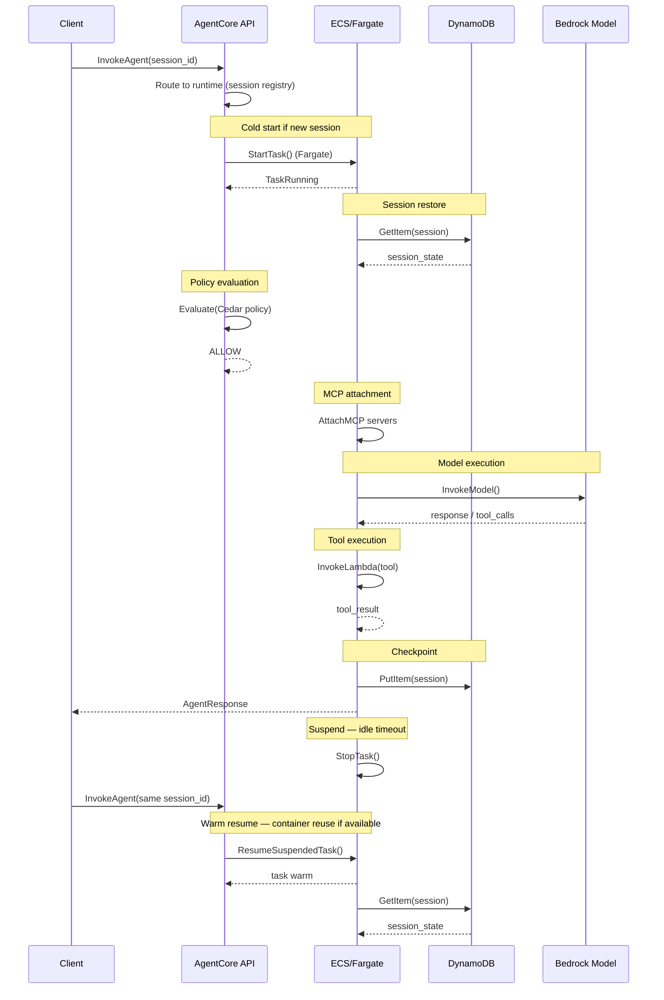
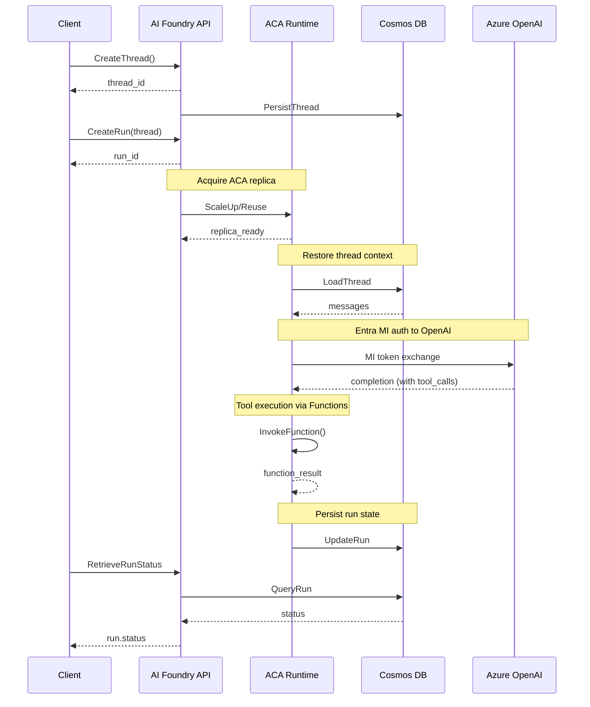
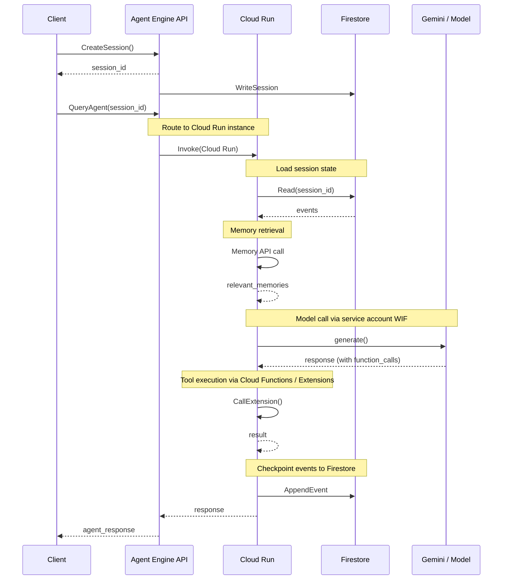
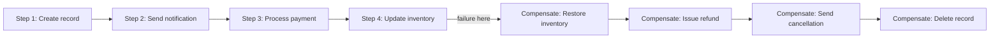

> Continues from [Enterprise AI Agent Runtime Internals: AWS, Azure & GCP (2026)](../23-enterprise-agent-runtime-internals-2026.md), covering runtime lifecycle sequences, session management, long-running agents & durable execution, and failure recovery.

## Runtime Lifecycle

### AWS AgentCore — Session Lifecycle Sequence

*AWS AgentCore session lifecycle: cold start via Fargate task creation, DynamoDB-backed session restore, Cedar policy evaluation, MCP attachment, model/tool invocation, checkpointing, idle suspension, and warm resume on the same session ID.*

### Azure AI Foundry Agent Service — Run Lifecycle

*Azure AI Foundry run lifecycle: thread creation persisted to Cosmos DB, ACA replica acquisition, thread-context restore, Entra Managed Identity token exchange to Azure OpenAI, Functions-based tool execution, and run-state persistence.*

### Google Vertex AI Agent Engine — Session Lifecycle

*Google Vertex AI Agent Engine session lifecycle: session creation written to Firestore, Cloud Run instance routing, event-sourced session load, Memory API retrieval, Workload-Identity-authenticated model call, Extension-based tool execution, and event-append checkpointing.*

## Session Management

### Session Type Taxonomy

| Session Type | AWS Implementation | Azure Implementation | GCP Implementation |
|---|---|---|---|
| **User session** | Cognito User Pool / custom JWT | Entra ID OIDC token | Google Identity / OAuth 2.0 |
| **Agent/runtime session** | Fargate task + DynamoDB session record [INFERRED] | ACA replica + Cosmos DB thread [DOCUMENTED] | Cloud Run instance + Firestore session [DOCUMENTED] |
| **Conversation thread** | AgentCore session_id maps to DynamoDB partition key [INFERRED] | AI Foundry Thread object (REST API) [DOCUMENTED] | Agent Engine session_id (Sessions API) [DOCUMENTED] |
| **MCP session** | Gateway-managed per agent session [DOCUMENTED] | HTTP/SSE connection from ACA to MCP server [INFERRED] | gRPC or HTTP connection from Cloud Run to Extensions [DOCUMENTED] |
| **Tool/execution session** | Lambda invocation (stateless, per-call) [DOCUMENTED] | Azure Functions invocation [DOCUMENTED] | Cloud Functions / Extensions invocation [DOCUMENTED] |
| **Workflow session** | Step Functions state machine (for complex workflows) [DOCUMENTED] | Durable Functions (for complex workflows) [DOCUMENTED] | Cloud Workflows or Temporal (customer choice) [DOCUMENTED] |

### Session Persistence Stores

**AWS DynamoDB for AgentCore:** [DOCUMENTED + INFERRED]

- Session record structure: `{session_id, agent_id, user_id, created_at, last_active, state_blob, memory_refs[], tool_invocations[]}`
- DynamoDB TTL attribute for automatic session expiry (configurable per use case)
- DynamoDB Streams for event-sourcing session state changes
- Multi-AZ replication automatic; cross-region replication via DynamoDB Global Tables if needed

**Azure Cosmos DB for AI Foundry:** [DOCUMENTED]

- Thread container: partition key = thread_id; TTL on message objects
- Agent container: agent metadata, system prompt, tool definitions
- Run container: run status, steps, token usage
- Multi-region writes available via Cosmos DB multi-master configuration

**Google Firestore for Agent Engine:** [DOCUMENTED]

- Session collection: `sessions/{session_id}` with event subcollection
- Event-sourced model: append-only events rather than mutable state
- Firestore's real-time listeners can feed session updates to streaming clients
- Spanner used for Memory API's long-term store (higher consistency guarantees) [INFERRED]

### Sticky Sessions and Session Affinity

| Mechanism | AWS | Azure | GCP |
|---|---|---|---|
| **Session affinity** | ECS service sticky sessions via ALB target group stickiness (duration-based) [INFERRED] | ACA session affinity via `ingress.stickySessions: sticky` setting [DOCUMENTED] | Cloud Run session affinity via cookie-based routing (`--session-affinity` flag) [DOCUMENTED] |
| **Cross-AZ affinity** | ALB maintains affinity within AZ; cross-AZ may break affinity [INFERRED] | ACA handles AZ failover transparently; Cosmos DB serves from any region [DOCUMENTED] | Cloud Run may re-route to different region on AZ failure [DOCUMENTED] |
| **Session migration** | On Fargate task failure: restore from DynamoDB checkpoint on new task [INFERRED] | On ACA replica failure: restore from Cosmos DB thread state [INFERRED] | On Cloud Run failure: new instance loads from Firestore events [INFERRED] |

### Cross-Region Failover

| Capability | AWS | Azure | GCP |
|---|---|---|---|
| **Session replication** | DynamoDB Global Tables for active-active cross-region [DOCUMENTED] | Cosmos DB multi-region write [DOCUMENTED] | Firestore multi-region replication [DOCUMENTED] |
| **Runtime failover** | Route 53 latency/failover routing to secondary region; new Fargate task restores session [INFERRED] | Azure Traffic Manager + secondary AI Foundry endpoint; thread reloads from Cosmos DB [INFERRED] | Cloud Load Balancing with multi-region Cloud Run; session restores from Firestore [DOCUMENTED] |
| **Credential failover** | STS AssumeRole works per-region; IAM roles are global [DOCUMENTED] | Managed Identity tokens issued per region from Entra [DOCUMENTED] | Workload Identity pools are global; tokens issued per region [DOCUMENTED] |

## Long-Running Agents & Durable Execution

### The Long-Running Agent Problem

An agent handling a complex, multi-step workflow (research task, code review pipeline, document processing) may need to run for minutes to hours, restarting mid-workflow after infrastructure events. None of the three platforms expose this as a first-class primitive directly — all delegate to companion orchestration services.

### AWS — Durable Execution

| Mechanism | Detail | Confidence |
|---|---|---|
| **AWS Step Functions** | Workflow state machine managing multi-step agent tasks; can pause for human approval, call Lambda tools, wait for events | [DOCUMENTED — AgentCore integrates with Step Functions] |
| **AgentCore checkpointing** | Session state written to DynamoDB after each LLM turn; task can resume from last checkpoint on restart | [INFERRED — HIGH] |
| **Event-driven resume** | Amazon EventBridge triggers agent resume on external event (webhook, file upload, schedule) | [DOCUMENTED via AgentCore event integration] |
| **Lambda timeout workaround** | Tool execution via Lambda is limited to 15min; for longer tools, Lambda triggers Step Functions or ECS tasks | [DOCUMENTED] |
| **Long-polling model** | Client polls `GetAgentStatus` or subscribes to EventBridge for async completion | [DOCUMENTED] |

### Azure — Durable Execution

| Mechanism | Detail | Confidence |
|---|---|---|
| **Azure Durable Functions** | Stateful workflow orchestration; handles fan-out/fan-in, timers, external events; used for multi-agent coordination | [DOCUMENTED] |
| **AI Foundry Thread API** | Thread persists in Cosmos DB indefinitely; resuming a thread is resuming from stored message history | [DOCUMENTED] |
| **Logic Apps integration** | For long-running business process orchestration with human approval steps | [DOCUMENTED] |
| **Run status polling** | Agents expose `run.status` (queued, in_progress, completed, failed); client polls or uses streaming | [DOCUMENTED] |

### GCP — Durable Execution

| Mechanism | Detail | Confidence |
|---|---|---|
| **Cloud Workflows** | Managed workflow service for multi-step agent orchestration; YAML-based, supports HTTP callbacks, retries, human approvals | [DOCUMENTED] |
| **Eventarc + Pub/Sub** | Event-driven agent resume; agent waits for Pub/Sub message to trigger next step | [DOCUMENTED] |
| **Agent Engine Sessions API** | Sessions persist indefinitely in Firestore; agent can be resumed with any session_id | [DOCUMENTED] |
| **Temporal on GKE** | Enterprise deployments often use Temporal (open-source Cadence fork) for durable workflow orchestration | [EVIDENCE — Google Cloud marketplace listing for Temporal] |
| **Checkpoint model** | Event-sourced Firestore session: each turn is an appended event; replay reconstitutes full state | [DOCUMENTED] |

### Comparison with Dedicated Orchestrators

| Feature | Step Functions | Durable Functions | Cloud Workflows | Temporal |
|---|---|---|---|---|
| State persistence | DynamoDB | Azure Storage | Firestore/Spanner | Cassandra/PostgreSQL |
| Long sleep support | Years (via EventBridge) | Unlimited (Timer) | Hours (built-in) | Unlimited |
| Replay/event sourcing | History table | Replay journal | N/A | Event log |
| Sub-workflow | Nested state machines | Sub-orchestrations | Sub-workflows | Child workflows |
| Human approval | Approval task + callback | External events | Callbacks | Signal handling |
| Best for AWS | Yes | No | No | Optional |
| Best for Azure | No | Yes | No | Optional |
| Best for GCP | No | No | Yes | Optional |

## Failure Recovery

### Failure Classification and Response

| Failure Type | AWS Response | Azure Response | GCP Response |
|---|---|---|---|
| **Runtime crash (container OOM)** | ECS auto-restarts Fargate task; session restored from DynamoDB checkpoint [INFERRED] | ACA restarts replica; thread reloads from Cosmos DB [INFERRED] | Cloud Run starts new instance; session reloads from Firestore [DOCUMENTED] |
| **Node failure** | Fargate abstracts node failure; new task scheduled on healthy Nitro VM [DOCUMENTED] | AKS drain and reschedule pod; ACA handles transparently [DOCUMENTED] | Borg reschedules Cloud Run tasks on healthy machines; transparent to Cloud Run [DOCUMENTED] |
| **AZ failure** | ALB reroutes to healthy AZ; Fargate tasks restarted; DynamoDB Global Tables provide cross-AZ consistency [DOCUMENTED] | ACA multi-AZ replication; Cosmos DB multi-AZ by default [DOCUMENTED] | Cloud Run multi-AZ by default in regional deployments [DOCUMENTED] |
| **Region failure** | Route 53 failover to secondary region; Step Functions Global Resiliency (preview) | Azure Traffic Manager; Cosmos DB multi-region read/write | Cloud Load Balancing multi-region; Firestore replication |
| **MCP server failure** | Gateway circuit breaker; tool call returns error; agent handles via retry logic [DOCUMENTED — Gateway retry policy] | APIM retry policy; Azure Functions error handling [INFERRED] | Vertex AI Toolbox retry policy; Extensions error handling [DOCUMENTED] |
| **Model API failure** | Bedrock model fallback routing (cross-model) [DOCUMENTED] | Azure OpenAI PTU fallback to paygo [DOCUMENTED] | Vertex AI model routing fallback [DOCUMENTED] |
| **Policy engine failure** | Cedar evaluation fails closed (deny by default) [DOCUMENTED] | Azure Policy non-compliance action: audit or deny [DOCUMENTED] | IAM deny by default; OPA sidecar fail-close [INFERRED] |
| **Network partition** | VPC isolation means internal calls use private network; PrivateLink provides resilience [DOCUMENTED] | Private Endpoint + ExpressRoute for hybrid [DOCUMENTED] | VPC Service Controls + Cloud Interconnect [DOCUMENTED] |

### Retry and Circuit Breaker Patterns

**AWS:** [DOCUMENTED + INFERRED]

- AgentCore Gateway implements exponential backoff for MCP server calls
- Step Functions built-in retry/catch semantics for workflow steps
- SDK-level retry (Strands SDK) for transient model API failures
- Dead Letter Queue (SQS DLQ) for failed async agent invocations

**Azure:** [DOCUMENTED]

- Azure SDK built-in retry with exponential backoff
- AI Foundry run retry on transient failures (queued → in_progress → failed flow)
- Durable Functions automatic checkpoint-and-retry for workflow steps
- Azure Service Bus DLQ for async agent message failures

**GCP:** [DOCUMENTED]

- Cloud Run internal retry for 503/429 responses
- Cloud Workflows built-in retry configuration (max attempts, backoff)
- Pub/Sub message redelivery and DLQ for async agents
- Vertex AI SDK client-side retry with exponential backoff

### Saga Pattern for Distributed Compensation

All three platforms support saga-style compensation for multi-step agent workflows that need rollback on failure:

*Saga-style compensation: on a failure at any step, the workflow unwinds by running compensating actions in reverse order back to the start.*

- **AWS:** Step Functions Saga with compensating transactions via catch/finally blocks
- **Azure:** Durable Functions orchestration with compensation sub-orchestrations
- **GCP:** Cloud Workflows with try/except/retry blocks + compensation steps

## Related

- [Enterprise Agent Runtime Internals](../23-enterprise-agent-runtime-internals-2026.md) — executive summary, runtime architecture, compute isolation
- [Enterprise Agent Runtime Internals (Part 3)](23-enterprise-agent-runtime-internals-2026-part3.md) — Memory architecture, MCP runtime integration, sidecars & service mesh
