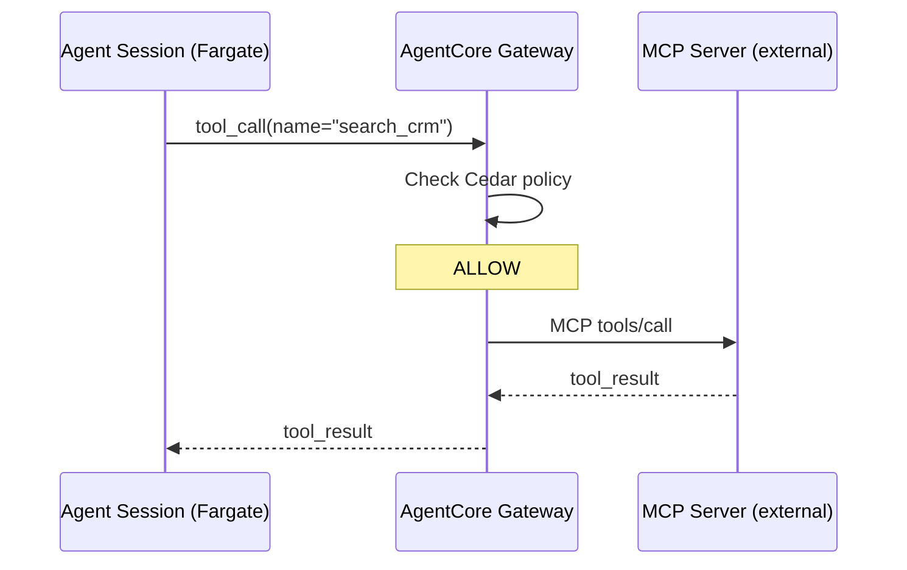
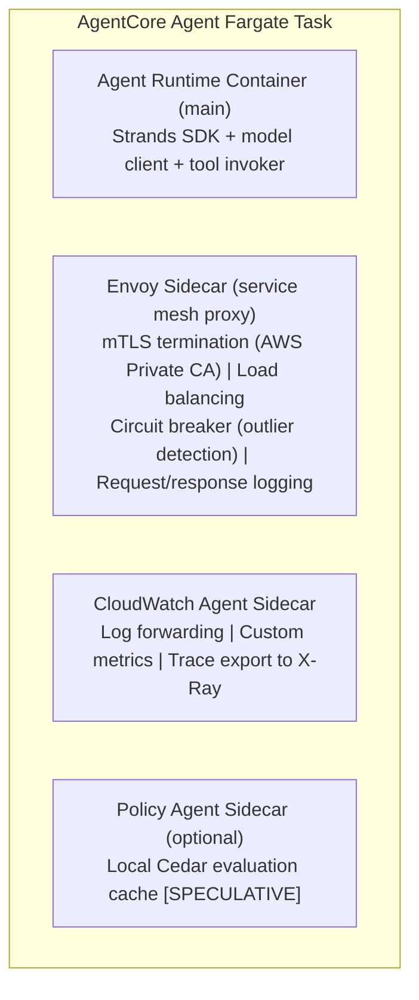
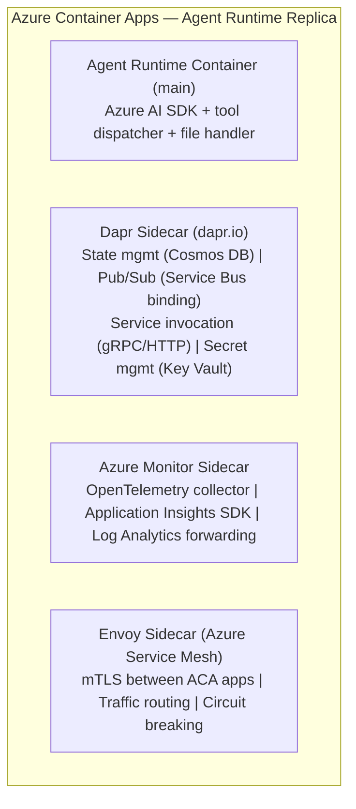
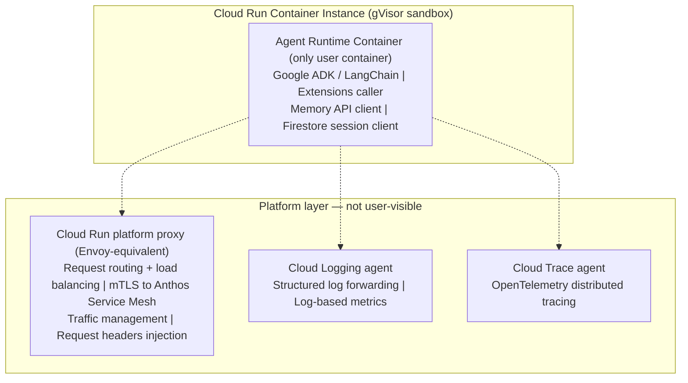

> Continues from [Enterprise AI Agent Runtime Internals: AWS, Azure & GCP (2026)](../23-enterprise-agent-runtime-internals-2026.md), covering memory architecture, MCP runtime integration, and sidecars & service mesh.

## Memory Architecture

### Memory Type Taxonomy

| Memory Type | Definition | AWS Implementation | Azure Implementation | GCP Implementation |
|---|---|---|---|---|
| **Conversation memory** | Within-session message history | DynamoDB (session turns) [INFERRED] | Cosmos DB (thread messages) [DOCUMENTED] | Firestore (session events) [DOCUMENTED] |
| **Working memory** | Active context window, in-flight variables | In-process RAM (Fargate task) [INFERRED] | In-process RAM (ACA replica) [INFERRED] | In-process RAM (Cloud Run instance) [INFERRED] |
| **Semantic memory** | Vector-stored factual knowledge | Bedrock Knowledge Bases (OpenSearch) [DOCUMENTED] | Azure AI Search [DOCUMENTED] | Vertex AI Vector Search [DOCUMENTED] |
| **Episodic memory** | Past session summaries and events | AgentCore Memory (LLM-extracted) [DOCUMENTED] | AI Foundry long-term memory (preview) [DOCUMENTED] | Vertex AI Memory API [DOCUMENTED] |
| **Long-term memory** | Cross-session persistent facts | AgentCore Memory + custom DynamoDB [DOCUMENTED] | Cosmos DB + AI Foundry memory bank [DOCUMENTED] | Vertex AI Memory API (Spanner-backed) [DOCUMENTED] |
| **Scratchpad** | Temporary working notes per turn | In-context (token budget) [INFERRED] | In-context [INFERRED] | In-context [INFERRED] |
| **Shared memory** | Cross-agent shared state | DynamoDB + custom IAM sharing [INFERRED] | Cosmos DB shared container [DOCUMENTED — AI Foundry multi-agent] | Firestore shared collection [INFERRED] |

### AWS AgentCore Memory Deep Dive

**Architecture:** [DOCUMENTED — see AgentCore Memory Architecture Guide]

- Two-tier model: ephemeral in-session memory (DynamoDB, TTL-scoped) + persistent long-term memory (DynamoDB + S3 for large objects)
- Memory extraction pipeline: after each session, LLM-based extraction identifies key facts, preferences, and events → stored as memory records
- Memory retrieval: semantic search (embedding-based) over memory store via Bedrock Embeddings model
- Memory namespace isolation: per-user, per-agent, per-session namespacing at DynamoDB partition key level
- TTL: configurable per memory type (episodic: 90 days default; long-term: indefinite)
- Encryption: KMS customer-managed key for DynamoDB, S3

### Azure AI Foundry Memory

**Architecture:** [DOCUMENTED + INFERRED]

- Short-term: Thread messages in Cosmos DB, automatically included in context
- Long-term: AI Foundry "memory" feature (preview as of mid-2026): Azure AI Search vector index + Cosmos DB metadata
- Memory retrieval: Azure AI Search semantic search with BM25 + vector hybrid
- Memory namespace: Project-scoped; user-specific memories require custom retrieval logic
- Files: Azure Blob Storage with blob URLs referenced in thread messages

### Google Vertex AI Agent Engine Memory

**Architecture:** [DOCUMENTED]

- Sessions API: conversation history stored as ordered events in Firestore
- Memory API: long-term memory stored in Spanner (high-consistency, high-throughput)
- Memory operations: `add_memory()`, `list_memories()`, `delete_memory()` REST API
- Memory retrieval: automatic semantic retrieval during agent execution based on user query
- TTL: configurable via Memory API update operations
- Encryption: CMEK (Customer-Managed Encryption Keys) via Cloud KMS

## MCP Runtime Integration

### AWS AgentCore MCP Integration

**AgentCore Gateway as managed MCP proxy:** [DOCUMENTED]

- AgentCore Gateway is fundamentally an MCP-aware API gateway for enterprise deployments
- It maintains persistent connections to registered MCP servers
- Agents connect to the Gateway (not directly to MCP servers)
- Gateway features: authentication translation, policy enforcement, connection pooling, semantic tool search

**MCP transport:** [DOCUMENTED + INFERRED]

- HTTP+SSE (Streamable HTTP) for remote MCP servers
- STDIO for local MCP servers (via Lambda subprocess — less common in AgentCore)
- Gateway maintains persistent SSE connections to each registered MCP server
- Tool discovery cached at Gateway level, refreshed periodically

**Connection pooling:** [INFERRED — HIGH CONFIDENCE]

- Gateway maintains a pool of connections to each MCP server
- Multiple agent sessions share the same Gateway connection pool to a given MCP server
- Per-session context is carried in request headers (not in the connection itself)

**MCP capability negotiation:** [DOCUMENTED]

- Gateway stores MCP server capabilities in the MCP Registry (control plane)
- Agent requests tools → Gateway resolves from capability cache
- Version negotiation: Gateway handles `2025-11-25` and `2026-07-28` protocol versions

**Sequence:**

*AWS AgentCore MCP tool-call sequence: the agent session never talks to the MCP server directly — every call is policy-checked and proxied through the Gateway.*

### Azure AI Foundry MCP Integration

**Status (mid-2026):** Azure AI Foundry has native support for MCP servers as function tools. **[DOCUMENTED — Azure AI Foundry MCP integration announced Build 2024]**

**Transport:** [DOCUMENTED + INFERRED]

- HTTP+SSE for remote MCP servers
- Azure API Management (APIM) used as MCP proxy for enterprise deployments [EVIDENCE — APIM MCP policy documentation]
- APIM translates authentication (Managed Identity → MCP server OAuth) and enforces rate limiting

**Tool registration:** [DOCUMENTED]

- MCP servers registered as function tools in AI Foundry toolset
- Tool schema auto-discovered from MCP server capabilities at registration time
- Function calling API used to invoke MCP tools from the model

**Session handling:** [INFERRED]

- ACA replica maintains SSE connection to MCP server for session duration
- On replica restart, new SSE connection established; MCP `2026-07-28` stateless protocol simplifies this

### Google Vertex AI Agent Engine MCP / Extensions

**Vertex AI Extensions vs MCP:** [DOCUMENTED]

- Google's native tool integration uses Vertex AI Extensions (OpenAPI spec + deployment)
- MCP support added via Google's MCP client library for Agent Builder
- Vertex AI Toolbox: managed MCP server for database and Google service access

**Transport:** [DOCUMENTED]

- Vertex AI Extensions use gRPC internally (registered endpoint schema)
- MCP via HTTP+SSE for external MCP servers
- Agent Engine connects to Extensions via Vertex AI internal service mesh (Anthos Service Mesh)

**Tool discovery:** [DOCUMENTED]

- Extensions registry in Vertex AI: operators register tools with OpenAPI spec
- Semantic routing (Vertex AI) can route tool calls to best-match extension

**Connection model:** [INFERRED]

- Cloud Run instance for Agent Engine maintains connections to multiple Extensions simultaneously
- Anthos Service Mesh provides mTLS and load balancing between Cloud Run and Extensions

### MCP Runtime Comparison

| Capability | AWS AgentCore | Azure AI Foundry | GCP Agent Engine |
|---|---|---|---|
| Native MCP support | Yes (AgentCore Gateway) [DOCUMENTED] | Yes (via APIM proxy) [DOCUMENTED] | Yes (via Toolbox + ADK) [DOCUMENTED] |
| MCP transport | HTTP+SSE [DOCUMENTED] | HTTP+SSE [INFERRED] | HTTP+SSE / gRPC [DOCUMENTED] |
| Managed MCP proxy | Yes (Gateway) [DOCUMENTED] | Yes (APIM) [EVIDENCE] | Yes (Toolbox) [DOCUMENTED] |
| Multi-MCP server | Yes [DOCUMENTED] | Yes [DOCUMENTED] | Yes [DOCUMENTED] |
| Connection pooling | Gateway-level [INFERRED] | APIM-level [INFERRED] | Anthos Service Mesh [INFERRED] |
| Auth translation | Gateway → SigV4 [DOCUMENTED] | APIM → MI token [DOCUMENTED] | ASM → GCP SA token [INFERRED] |
| Schema caching | Registry cache [DOCUMENTED] | APIM policy cache [INFERRED] | Toolbox registry cache [DOCUMENTED] |
| Version negotiation | Gateway handles [DOCUMENTED] | APIM handles [INFERRED] | ADK client handles [DOCUMENTED] |

## Sidecars and Service Mesh

### AWS — Sidecar and Service Mesh Architecture

**Service mesh:** [INFERRED — HIGH CONFIDENCE]

- AWS App Mesh (Envoy-based) is the documented service mesh for ECS/Fargate
- VPC Lattice (newer, Layer 7 service-to-service) is the likely AgentCore future direction **[EVIDENCE — re:Invent 2024 VPC Lattice for AI services]**
- Internal AgentCore services almost certainly use a service mesh for inter-service communication **[INFERRED]**

**Sidecar pattern in Fargate:** Fargate task definitions support multiple containers (sidecar pattern). The AgentCore agent container likely runs with the following sidecars **[INFERRED]**:

*Speculative Fargate sidecar composition for an AgentCore agent task: the main runtime container alongside an Envoy service-mesh proxy, a CloudWatch observability sidecar, and an optional local policy-cache sidecar.*

**Responsibilities by layer** [INFERRED]:

| Responsibility | Layer |
|---|---|
| mTLS between services | Envoy sidecar (App Mesh) |
| Authentication (SigV4) | AWS SDK within runtime container |
| Authorization (Cedar) | AgentCore Gateway / control plane |
| Secret retrieval (Secrets Manager) | Runtime container via SDK |
| Connection pooling (to DynamoDB, Bedrock) | Runtime container SDK |
| Retry / circuit breaker | Envoy sidecar + SDK |
| Distributed tracing | CloudWatch Agent sidecar (X-Ray) |
| Prompt logging / audit | Runtime container → CloudTrail |
| Cost tracking | AgentCore control plane → Cost Explorer |
| Guardrails | AgentCore Gateway (before runtime) + Bedrock Guardrails |
| MCP communication | Runtime container via AgentCore Gateway |
| Checkpoint sync | Runtime container → DynamoDB directly |

### Azure — Sidecar and Service Mesh Architecture

**Service mesh:** [DOCUMENTED]

- Azure Service Mesh (OSM/Istio-based) integrated into AKS **[DOCUMENTED]**
- AI Foundry Agent Service uses Azure Service Mesh for internal service-to-service communication **[EVIDENCE]**
- Dapr sidecar is explicitly used in AI Foundry Agent SDK for state management and pub/sub **[DOCUMENTED]**

**ACA container architecture** [DOCUMENTED + INFERRED]:

*Azure Container Apps replica sidecar composition: the runtime container alongside a Dapr sidecar for state/pub-sub/secrets, an Azure Monitor observability sidecar, and an Envoy service-mesh sidecar.*

**Responsibilities by layer** [DOCUMENTED + INFERRED]:

| Responsibility | Layer |
|---|---|
| mTLS | Azure Service Mesh (Istio/Envoy) |
| Authentication | Entra Managed Identity (runtime) + MSAL SDK |
| Authorization | Azure RBAC + Azure Policy |
| Secret retrieval | Dapr secret store (Key Vault) |
| State persistence | Dapr state store (Cosmos DB) |
| Pub/Sub messaging | Dapr pub/sub (Service Bus) |
| Retry | Dapr resilience policy / SDK |
| Distributed tracing | OpenTelemetry → Application Insights |
| Guardrails | Azure Content Safety (API call from runtime) |
| MCP communication | Runtime container via APIM proxy |

### GCP — Sidecar and Service Mesh Architecture

**Service mesh:** [DOCUMENTED]

- Anthos Service Mesh (Istio-based) is Google's managed service mesh for GKE
- Cloud Run does not expose traditional sidecar containers publicly — the service mesh is implemented at the Cloud Run platform layer **[DOCUMENTED]**
- Envoy proxies run at the Cloud Run infrastructure level, not as user-defined sidecars

**Cloud Run architecture** [DOCUMENTED + INFERRED]:

*Cloud Run's user-visible container is just the agent runtime; mTLS, observability, and traffic management are all handled by Google's platform layer rather than user-defined sidecars.*

**Key difference from AWS/Azure:** Google Cloud Run does not expose sidecar containers to users. All infrastructure concerns (mTLS, observability, traffic management) are handled at the platform level by Google's internal infrastructure. This provides simpler user experience but less customization flexibility. **[DOCUMENTED]**

### Service Mesh Comparison

| Feature | AWS (App Mesh/VPC Lattice) | Azure (Service Mesh/Dapr) | GCP (Anthos Service Mesh) |
|---|---|---|---|
| mTLS | Envoy sidecar (App Mesh) [DOCUMENTED] | Istio sidecar (ASM) [DOCUMENTED] | Platform-layer proxy [DOCUMENTED] |
| Service discovery | AWS Cloud Map [DOCUMENTED] | Kubernetes DNS + Dapr [DOCUMENTED] | Kubernetes DNS + Istio [DOCUMENTED] |
| Circuit breaker | Envoy outlier detection [DOCUMENTED] | Dapr resilience policy [DOCUMENTED] | Istio circuit breaker [DOCUMENTED] |
| Observability | CloudWatch + X-Ray [DOCUMENTED] | Application Insights + OTel [DOCUMENTED] | Cloud Trace + Logging [DOCUMENTED] |
| User-defined sidecars | Yes (Fargate multi-container) [DOCUMENTED] | Yes (ACA Dapr sidecar) [DOCUMENTED] | No (platform handles) [DOCUMENTED] |
| Policy enforcement | Cedar at gateway [DOCUMENTED] | Azure Policy + OPA [INFERRED] | OPA via Istio Mixer/Wasm [INFERRED] |

## Related

- [Enterprise Agent Runtime Internals](../23-enterprise-agent-runtime-internals-2026.md) — executive summary, runtime architecture, compute isolation
- [Enterprise Agent Runtime Internals (Part 2)](23-enterprise-agent-runtime-internals-2026-part2.md) — Runtime lifecycle, session management, long-running agents, failure recovery
- [Enterprise Agent Runtime Internals (Part 4)](23-enterprise-agent-runtime-internals-2026-part4.md) — Request execution pipeline, authentication, authorization
