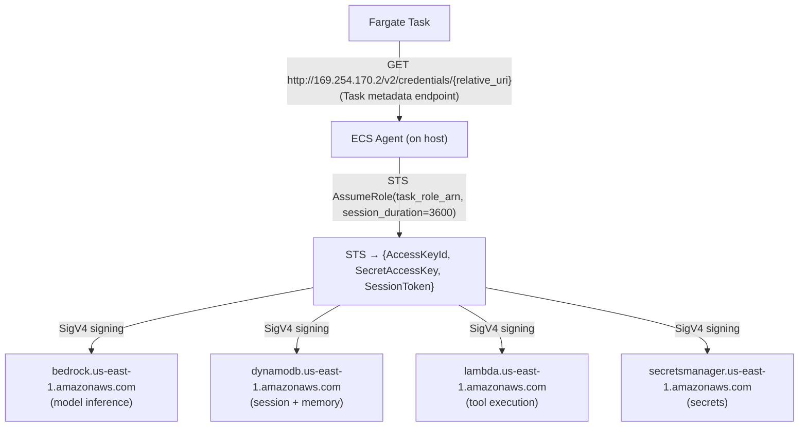
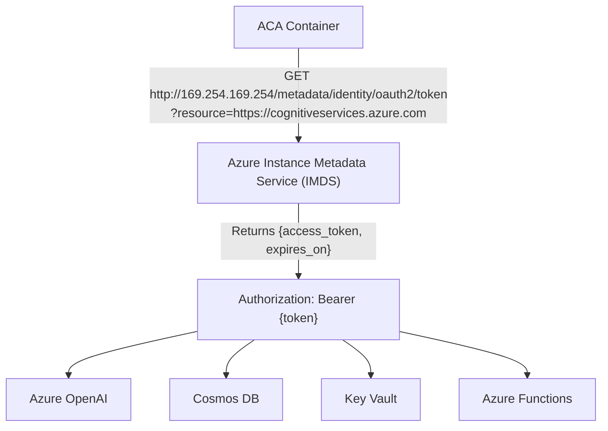
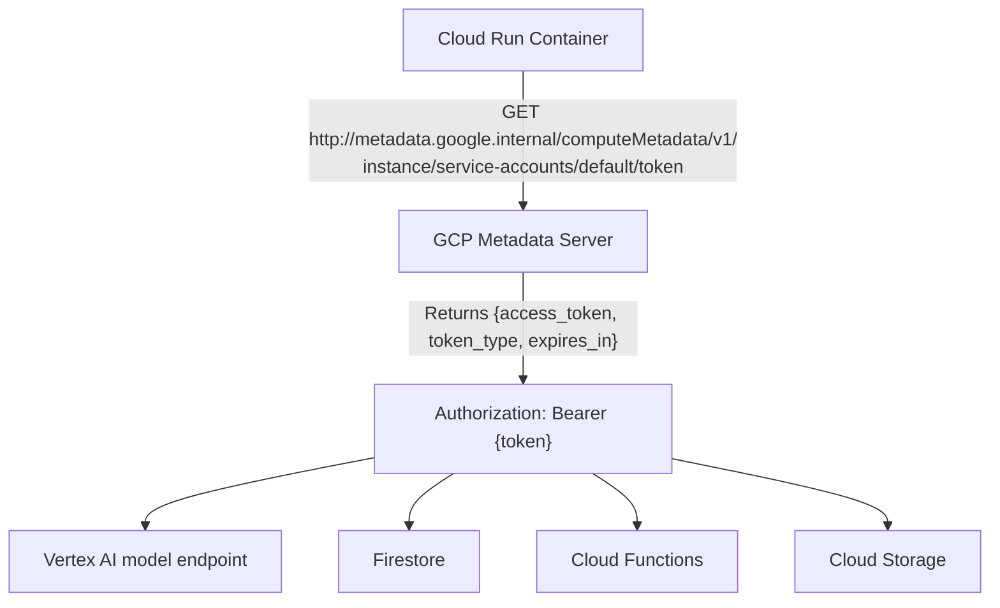
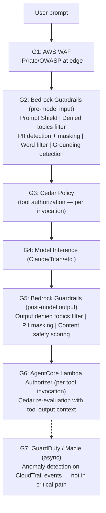
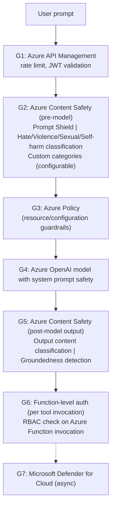
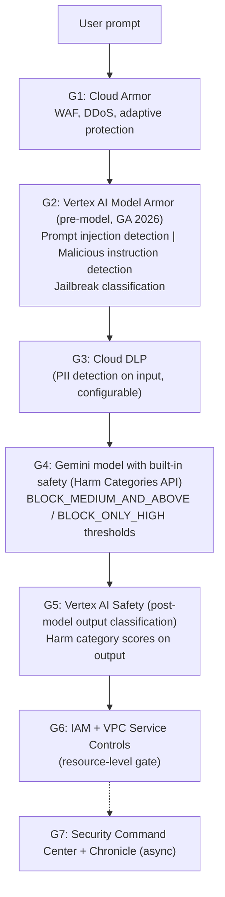

> Continues from [Enterprise AI Agent Runtime Internals: AWS, Azure & GCP (2026)](../23-enterprise-agent-runtime-internals-2026.md), covering zero trust implementation, service-to-service trust, guardrails placement, middleware/interceptors, and the policy engine.

## Zero Trust Implementation

### Zero Trust Architecture Comparison

| ZT Principle | AWS Implementation | Azure Implementation | GCP Implementation |
|---|---|---|---|
| **Verify explicitly** | SigV4 on every request; IAM evaluates every API call | Entra Conditional Access on every request; RBAC per operation | GCP auth token on every request; IAM evaluates every API call |
| **Least privilege** | Task IAM Role with minimal permissions; Cedar narrows further | Managed Identity with minimal RBAC; Conditional Access narrows | Service Account with minimal permissions; IAM Conditions narrow |
| **Assume breach** | GuardDuty anomaly detection; Macie data scanning; CloudTrail forensics | Microsoft Defender for Cloud; Microsoft Sentinel SIEM | Security Command Center; Chronicle SIEM |
| **Short-lived credentials** | STS: 15min–1h; Lambda execution role per invocation | MI token: 1h; refreshed automatically | Access token: 1h; refreshed from metadata server |
| **mTLS** | App Mesh (Envoy) between services | Azure Service Mesh (Istio) between ACA apps | Anthos Service Mesh (Istio) between Cloud Run / GKE |
| **Private networking** | PrivateLink; VPC endpoints; No public IP | Private Endpoint; VNet injection; ExpressRoute | Private Google Access; VPC Service Controls; Cloud Interconnect |
| **No standing privilege** | IRSA: no static keys; Roles Anywhere for hybrid | System Managed Identity: no key stored anywhere | Workload Identity Federation: no service account key |
| **Microsegmentation** | Security Groups + NACLs; VPC Lattice service policies | NSG + Azure Firewall + Private Endpoint | VPC firewall rules + Hierarchical firewall policies |

### SPIFFE/SPIRE in Each Platform

| Platform | SPIFFE/SPIRE Status | Alternative Used |
|---|---|---|
| **AWS** | Not deployed by AWS for AgentCore [INFERRED]; AWS-managed services use AWS PKI | IAM Task Role + mTLS via App Mesh CA |
| **Azure** | Not deployed for AI Foundry [INFERRED]; enterprise customers using SPIRE on AKS | Managed Identity + Azure Service Mesh (Istio CA) |
| **GCP** | Anthos Service Mesh integrates with SPIFFE via its own Istio CA **[DOCUMENTED]** | SPIFFE SVIDs issued by Anthos CA for pod-to-pod mTLS |

GCP is the only major cloud with documented SPIFFE integration in its managed agent platform (via Anthos Service Mesh). AWS and Azure use proprietary equivalents. **[DOCUMENTED for GCP; INFERRED for others]**

## Service-to-Service Trust

### How Agent Runtimes Authenticate to Downstream Services

**AWS — Task Role credential chain:** [DOCUMENTED]



**Azure — Managed Identity credential chain:** [DOCUMENTED]



**GCP — Metadata Server credential chain:** [DOCUMENTED]



*All three platforms fetch short-lived credentials from a local metadata endpoint rather than storing static secrets, then present a signed/bearer credential to every downstream service the agent runtime calls.*

### No-Credential Architecture

All three platforms achieve zero stored credentials for cloud-native deployments:

- **AWS:** IRSA/Task Role → no `AWS_ACCESS_KEY_ID` in environment
- **Azure:** System Managed Identity → no client secret stored anywhere
- **GCP:** Workload Identity → no service account key file

For **hybrid cloud** (on-premises agent calling cloud service):

- **AWS:** IAM Roles Anywhere — issues STS credentials based on an X.509 certificate from enterprise PKI
- **Azure:** Workload Identity Federation (preview) — issues Entra tokens based on an OIDC assertion
- **GCP:** Workload Identity Federation — issues GCP tokens based on an OIDC/SAML assertion from any IdP

## Guardrails Placement

### AWS Bedrock Guardrails Pipeline



**Where each guardrail executes:** [DOCUMENTED]

- G1: AWS Edge (CloudFront WAF) — before API Gateway
- G2/G5: Bedrock Guardrail service — synchronous, before/after model invocation
- G3: Cedar policy evaluator — synchronous, before each tool invocation
- G4: Bedrock model — inference
- G6: Lambda Authorizer — optional, synchronous gate before tool execution
- G7: GuardDuty/Macie — asynchronous, alerting only

### Azure AI Content Safety Pipeline



### GCP Vertex AI Safety Pipeline



*All three guardrail pipelines follow the same shape: edge WAF, pre-model input screening, policy/authorization gate, model inference, post-model output screening, a per-tool authorization gate, and an async anomaly-detection lane outside the critical path.*

### Guardrails Comparison

| Guardrail Type | AWS | Azure | GCP |
|---|---|---|---|
| **Prompt injection** | Bedrock Guardrails Prompt Shield [DOCUMENTED] | Azure Content Safety Prompt Shield [DOCUMENTED] | Vertex AI Model Armor [DOCUMENTED] |
| **Jailbreak** | Bedrock Guardrails [DOCUMENTED] | Azure Content Safety [DOCUMENTED] | Gemini Safety + Model Armor [DOCUMENTED] |
| **PII masking** | Bedrock Guardrails [DOCUMENTED] | Azure Content Safety (preview) + Purview [DOCUMENTED] | Cloud DLP [DOCUMENTED] |
| **Denied topics** | Bedrock Guardrails denied topics [DOCUMENTED] | System prompt + Content Safety categories [DOCUMENTED] | Gemini Safety thresholds [DOCUMENTED] |
| **Groundedness** | Bedrock Guardrails grounding check [DOCUMENTED] | Azure Content Safety Groundedness (preview) [DOCUMENTED] | Vertex AI Grounding [DOCUMENTED] |
| **Custom blocklist** | Bedrock Guardrails word filters [DOCUMENTED] | Azure Content Safety custom categories [DOCUMENTED] | Gemini safety settings [DOCUMENTED] |
| **Output safety** | Bedrock Guardrails post-processing [DOCUMENTED] | Azure Content Safety output filter [DOCUMENTED] | Gemini Harm Category output check [DOCUMENTED] |
| **Anomaly detection** | GuardDuty ML-based [DOCUMENTED] | Microsoft Defender for Cloud [DOCUMENTED] | Security Command Center [DOCUMENTED] |

## Middleware and Interceptors

### AWS — Extension Points

| Extension Point | Mechanism | Use Case |
|---|---|---|
| **Lambda Interceptors** | Lambda function called before/after model or tool execution | Custom auth, context enrichment, cost controls |
| **Bedrock Invocation Logging** | Pre/post model invocation hooks | Audit logging, prompt logging, A/B testing |
| **AgentCore Hooks (SDK)** | Strands SDK `@tool` decorator and pipeline hooks | Custom tool logic, retry, transformation |
| **Step Functions Activities** | External activity workers process specific workflow steps | Human approval, external system integration |
| **EventBridge Rules** | Reactive events on agent completion, failure, or specific output | Notification, downstream processing |
| **Bedrock Evaluation Jobs** | Post-invocation async evaluation for quality/safety | Model evaluation, regression testing |

### Azure — Extension Points

| Extension Point | Mechanism | Use Case |
|---|---|---|
| **APIM Policies** | XML policy blocks: inbound, backend, outbound, error | Auth transformation, rate limit, content rewrite |
| **Dapr Middleware** | Dapr middleware pipeline (pre/post request) | Auth, tracing, circuit breaking |
| **Azure Functions Middleware** | DI-based middleware in Functions | Custom auth, logging, context enrichment |
| **Semantic Kernel Filters** | Pre/post invocation filters in Semantic Kernel | Prompt transformation, output filtering, caching |
| **AI Foundry Hooks (preview)** | Agent lifecycle hooks in AI Foundry SDK | Pre-run, post-run, tool-call events |
| **Logic Apps Connectors** | No-code integration with 400+ connectors | External service integration, approval workflows |

### GCP — Extension Points

| Extension Point | Mechanism | Use Case |
|---|---|---|
| **ADK Callbacks** | LangChain/ADK `before_action`, `after_action` callbacks | Custom logic, logging, state mutation |
| **Cloud Functions Middleware** | Express.js middleware pattern in Gen2 Functions | Auth, rate limiting, transformation |
| **Vertex AI Pipelines** | Kubeflow-based ML pipeline components | Pre/post processing, evaluation |
| **Pub/Sub Event Bridge** | Agent publishes/subscribes to topics | Async integration, fan-out patterns |
| **Cloud Run Sidecar (via YAML)** | Multi-container Cloud Run service (GA 2024) | Sidecar middleware for logging, auth, proxy |
| **Eventarc Triggers** | Cloud event triggers for agent lifecycle events | Monitoring, downstream automation |

## Policy Engine

### AWS — Cedar (Amazon Verified Permissions)

**Language:** Cedar — purpose-built, formally verified policy language **[DOCUMENTED]**
**Evaluation:** Evaluate every agent action against policy before execution **[DOCUMENTED]**
**Integration with AgentCore:** Cedar policies stored in Amazon Verified Permissions policy store; evaluated synchronously per agent action **[DOCUMENTED]**

```cedar
// AgentCore Cedar policy — bank use case
permit(
  principal is AgentUser,
  action in [Action::"InvokeTool", Action::"ReadMemory"],
  resource is AgentResource
) when {
  principal.department == "banking" &&
  resource.data_classification in ["public", "internal"] &&
  context.hour_of_day >= 8 &&
  context.hour_of_day <= 18 &&
  context.session_risk_score < 50
};

forbid(
  principal is AgentUser,
  action == Action::"InvokeTool",
  resource is Tool::"payment_write"
) when {
  context.session_risk_score > 75
};
```

**Neuro-symbolic policy authoring:** [DOCUMENTED]

- AgentCore policy engine supports LLM-assisted policy authoring
- Natural language policy intent → Cedar policy translation (with human review)
- LOG_ONLY mode: policies evaluated but not enforced; violations logged for tuning

**Why Cedar over OPA:** Formal verification (Cedar policies can be mathematically proven correct); deterministic evaluation; purpose-built for AWS ecosystem **[DOCUMENTED]**

### Azure — Azure Policy + OPA Hybrid

**Azure Policy:** [DOCUMENTED]

- Built-in: define compliance requirements for AI Foundry resources
- Initiative assignments: group related policies
- Remediation tasks: auto-remediate non-compliant resources
- Limitation: Azure Policy is resource-configuration focused, not request-path authorization

**OPA + Gatekeeper (for request-path):** [INFERRED]

- Azure Arc-enabled clusters support OPA Gatekeeper admission controller
- AI Foundry enterprise deployments likely use OPA for fine-grained request policies
- Policy bundles stored in Azure Blob Storage; OPA agents pull every 30s

**Semantic Kernel Policy (application level):** [DOCUMENTED]

- Semantic Kernel Filters implement application-level policy enforcement
- Prompt safety filters, function invocation guards, output validation

### GCP — IAM Conditions + OPA

**IAM Conditions:** [DOCUMENTED]

- Attribute-based access control embedded in IAM policy bindings
- Conditions evaluate `request.time`, `resource.name`, `request.auth.claims`
- Limitations: not designed for business logic complexity of agent authorization

**OPA on GKE (enterprise pattern):** [EVIDENCE]

- Vertex AI enterprise deployments commonly use OPA Gatekeeper on GKE
- Policy bundles served from GCS; OPA agents pull periodically
- Styra DAS used for managed OPA in some enterprise GCP deployments

**VPC Service Controls as policy:** [DOCUMENTED]

- Service perimeter acts as an outer policy boundary
- Access levels enforce attribute conditions (device compliance, location, time)
- All Vertex AI API calls checked against service perimeter

## Related

- [Enterprise Agent Runtime Internals](../23-enterprise-agent-runtime-internals-2026.md) — executive summary, runtime architecture, compute isolation
- [Enterprise Agent Runtime Internals (Part 4)](23-enterprise-agent-runtime-internals-2026-part4.md) — Request execution pipeline, authentication, authorization
- [Enterprise Agent Runtime Internals (Part 6)](23-enterprise-agent-runtime-internals-2026-part6.md) — Networking internals, observability, multi-tenancy strategy
