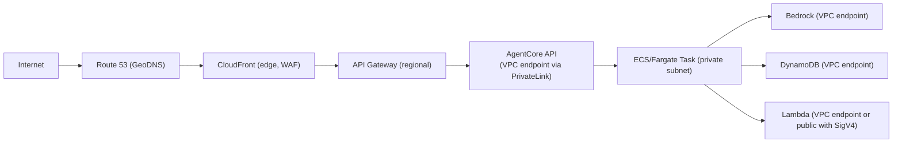
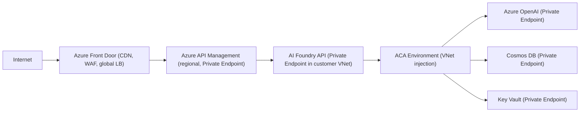
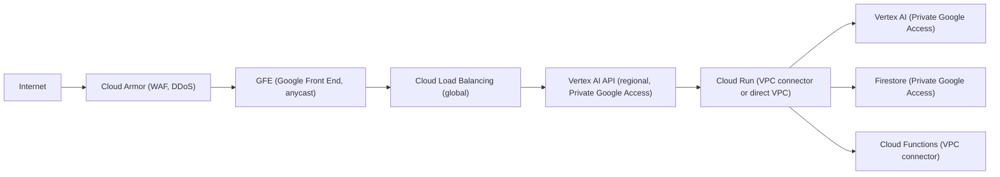

> Continues from [Enterprise AI Agent Runtime Internals: AWS, Azure & GCP (2026)](../23-enterprise-agent-runtime-internals-2026.md), covering networking internals, observability architecture, and multi-tenancy strategy.

## Networking Internals

### Traffic Flow Architecture

**AWS:** [DOCUMENTED + INFERRED]

**Azure:** [DOCUMENTED]

**GCP:** [DOCUMENTED]

*Each platform routes through an edge WAF/CDN, a regional API layer, into a private-subnet/VNet/VPC-scoped runtime, then out to private-endpoint-fronted backing services.*

### Service Discovery

| Mechanism | AWS | Azure | GCP |
|---|---|---|---|
| **Internal DNS** | Route 53 private hosted zones | Azure Private DNS zones | Cloud DNS private zones |
| **Service registry** | AWS Cloud Map | Azure Service Registry (Dapr) | Kubernetes DNS (GKE) |
| **Load balancing** | ALB (L7) + NLB (L4) | Azure Load Balancer + APIM | Cloud Load Balancing (global) |
| **Connection pooling** | Envoy (App Mesh) | Dapr + APIM | Anthos Service Mesh (Istio) |
| **Health probes** | ALB health checks; ECS health checks | ACA health probes; Azure Load Balancer | Cloud Run health checks; GKE readiness |

### Latency Engineering

| Operation | AWS Target | Azure Target | GCP Target |
|---|---|---|---|
| Auth (SigV4/MI/SA token) | &lt;5ms (cached) | &lt;10ms (IMDS) | &lt;5ms (metadata server, cached) |
| Policy evaluation (Cedar/RBAC) | &lt;5ms | &lt;10ms | &lt;5ms |
| Session restore (DB read) | &lt;10ms (DynamoDB DAX) | &lt;15ms (Cosmos DB) | &lt;10ms (Firestore) |
| Model inference (first token) | 500–2000ms | 500–2000ms | 400–1500ms |
| Tool execution (Lambda/Functions) | 100–500ms (warm) | 100–500ms (warm) | 100–400ms (warm) |
| Total request latency (warm) | 1–5s | 1–6s | 0.8–4s |
| Total request latency (cold) | 5–15s | 5–20s | 3–12s |

*All latency estimates are approximate ranges based on public documentation and benchmark reports; actual performance varies significantly by workload.*

## Observability Architecture

### AWS — Observability Stack

**Traces:** [DOCUMENTED]

- AWS X-Ray: distributed tracing across Lambda, ECS, DynamoDB, Bedrock
- Bedrock Invocation Logs: model input/output, token counts, latency per invocation
- X-Ray service map: auto-generated dependency visualization

**Metrics:** [DOCUMENTED]

- CloudWatch Metrics: agent invocation count, latency, error rate, token usage
- Custom metrics: tool invocation counts, memory hit rate, Cedar policy decisions
- CloudWatch Anomaly Detection: ML-based metric anomaly detection

**Logs:** [DOCUMENTED]

- CloudWatch Logs: agent runtime logs, Lambda tool logs, ECS task logs
- CloudTrail: all control-plane API calls (agent creation, policy changes)
- Bedrock Model Invocation Logging: optional logging of prompts and completions

**AI-specific observability:** [DOCUMENTED + INFERRED]

- Arize Phoenix / Langfuse via Lambda integration for LLM observability
- AgentCore built-in trace export to Bedrock Traces API
- Cost tracking via AWS Cost Explorer tagging (`agent_id`, `session_id` tags)

### Azure — Observability Stack

**Traces:** [DOCUMENTED]

- Application Insights: distributed tracing across ACA, Functions, Azure OpenAI
- Azure Monitor: end-to-end distributed trace visualization
- OpenTelemetry SDK: standard trace export from AI Foundry SDK

**Metrics:** [DOCUMENTED]

- Azure Monitor Metrics: token usage, invocation count, latency, error rate
- Log Analytics Workspace: custom queries and dashboards
- Azure Monitor Workbooks: pre-built agent monitoring dashboards

**Logs:** [DOCUMENTED]

- Azure Monitor Diagnostic Logs: all AI Foundry API calls
- Application Insights Custom Events: agent lifecycle events (run start, run complete)
- Azure Audit Log: RBAC changes, key vault access

**AI-specific:** [DOCUMENTED]

- Azure AI Content Safety filtering logs
- Prompt evaluation metrics in Azure AI Studio
- Semantic Kernel telemetry via OTel exporters

### GCP — Observability Stack

**Traces:** [DOCUMENTED]

- Cloud Trace: distributed tracing across Cloud Run, Cloud Functions, Vertex AI
- Vertex AI Traces (GA 2026): agent-specific trace view in the Vertex AI console
- OpenTelemetry Collector sidecar (optional) for multi-destination trace export

**Metrics:** [DOCUMENTED]

- Cloud Monitoring: Vertex AI metrics (prediction count, latency, error rate)
- Agent Engine Metrics: session count, turns per session, memory operations
- Custom metrics via the Cloud Monitoring custom metric API

**Logs:** [DOCUMENTED]

- Cloud Logging: structured JSON logs from Cloud Run (auto-captured)
- Vertex AI Request Logs: model request/response logs (configurable)
- Cloud Audit Logs: data access, admin activity, system events
- BigQuery Export: long-term audit log storage with SQL analytics

**AI-specific:** [DOCUMENTED]

- Vertex AI Model Monitoring: data drift, prediction drift detection
- Agent Engine event logs: tool calls, memory operations, session events
- Langfuse / Phoenix integration via Cloud Run custom observability

### Observability Comparison

| Feature | AWS | Azure | GCP |
|---|---|---|---|
| Distributed tracing | X-Ray [D] | Application Insights [D] | Cloud Trace [D] |
| OTel support | Via OTel Collector Lambda layer [D] | Native OTLP export [D] | Native OTLP [D] |
| Model invocation logs | Bedrock Invocation Logs [D] | Azure Monitor Diagnostics [D] | Vertex AI Request Logs [D] |
| Agent trace visualization | AgentCore Traces API [D] | Azure Monitor (run steps) [D] | Vertex AI console [D] |
| Cost tracking | Cost Explorer + tags [D] | Azure Cost Management + tags [D] | Cloud Billing + labels [D] |
| SIEM integration | CloudTrail → Sentinel/Splunk [D] | Microsoft Sentinel native [D] | Chronicle / BigQuery [D] |
| LLM observability | Arize Phoenix (via Lambda) [E] | Azure AI Studio evaluations [D] | Vertex AI Evaluation [D] |

*[D] = DOCUMENTED, [E] = EVIDENCE*

## Multi-Tenancy Strategy

### Isolation Boundaries

| Boundary | AWS | Azure | GCP |
|---|---|---|---|
| **Organization** | AWS Organization (SCPs) | Entra Tenant | GCP Organization |
| **Account/Subscription/Project** | AWS Account | Azure Subscription | GCP Project |
| **Workspace** | AgentCore namespace [INFERRED] | AI Foundry Hub | Vertex AI Location |
| **Agent** | Agent ID + IAM resource tag | Agent/Assistant resource | Reasoning Engine ID |
| **Session** | Session ID + DynamoDB partition | Thread ID + Cosmos partition | Session ID + Firestore document |
| **Runtime** | Fargate task (dedicated) [INFERRED] | ACA replica [DOCUMENTED] | Cloud Run instance [DOCUMENTED] |
| **Memory** | Namespace + user_id in DynamoDB | Cosmos DB container partition | Firestore document hierarchy |
| **Secrets** | IAM role per agent [DOCUMENTED] | Managed Identity per app [DOCUMENTED] | SA per Cloud Run service [DOCUMENTED] |
| **Networking** | VPC + Security Groups + PrivateLink | VNet + NSG + Private Endpoint | VPC + Firewall + VPC SC |
| **Billing** | Per-account; Cost Allocation Tags | Per-subscription; Cost Management Tags | Per-project; Billing Labels |

### What Is Shared vs Dedicated

**AWS:** [DOCUMENTED + INFERRED]

- **Shared:** Bedrock model inference infrastructure; AgentCore control plane API; DynamoDB service (logical isolation)
- **Dedicated:** Fargate compute (per-account isolation); IAM roles (per-agent); VPC (per-account); S3 buckets (per-account)

**Azure:** [DOCUMENTED]

- **Shared:** Azure OpenAI endpoint (shared cluster, logically isolated); APIM gateway instance (per-tenant logical isolation); Cosmos DB service (logical isolation)
- **Dedicated:** ACA Environment per project; Managed Identity per app; Key Vault (per-project recommended); VNet (per-subscription)

**GCP:** [DOCUMENTED]

- **Shared:** Vertex AI prediction infrastructure; Cloud Run platform (per-project isolation); Firestore (logical isolation)
- **Dedicated:** Cloud Run service per agent (separate container); Service Account per workload; VPC (per-project); GCS bucket (per-project)

### Cross-Tenant Data Leakage Prevention

| Control | AWS | Azure | GCP |
|---|---|---|---|
| **Logical isolation** | DynamoDB partition key per tenant | Cosmos DB partition per tenant | Firestore document namespace |
| **Encryption isolation** | KMS CMK per customer [DOCUMENTED] | BYOK via Key Vault [DOCUMENTED] | CMEK via Cloud KMS [DOCUMENTED] |
| **Network isolation** | VPC per account; Security Groups | VNet per subscription; NSG | VPC per project; Firewall rules |
| **Compliance boundary** | AWS GovCloud for highest isolation | Azure Government / Sovereign Cloud | Google Sovereign Cloud (EU, DE, FR) |

## Related

- [Enterprise Agent Runtime Internals](../23-enterprise-agent-runtime-internals-2026.md) — executive summary, runtime architecture, compute isolation
- [Enterprise Agent Runtime Internals (Part 5)](23-enterprise-agent-runtime-internals-2026-part5.md) — Zero trust, service-to-service trust, guardrails, middleware, policy engine
- [Enterprise Agent Runtime Internals (Part 7)](23-enterprise-agent-runtime-internals-2026-part7.md) — Comparative analysis tables, documented vs. inferred analysis, references
