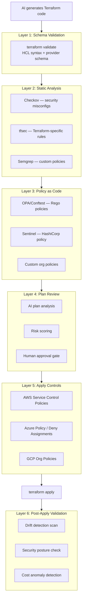
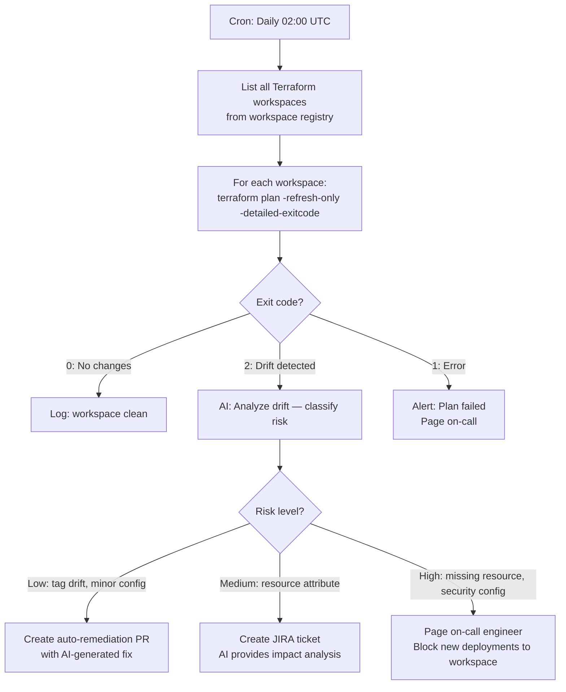
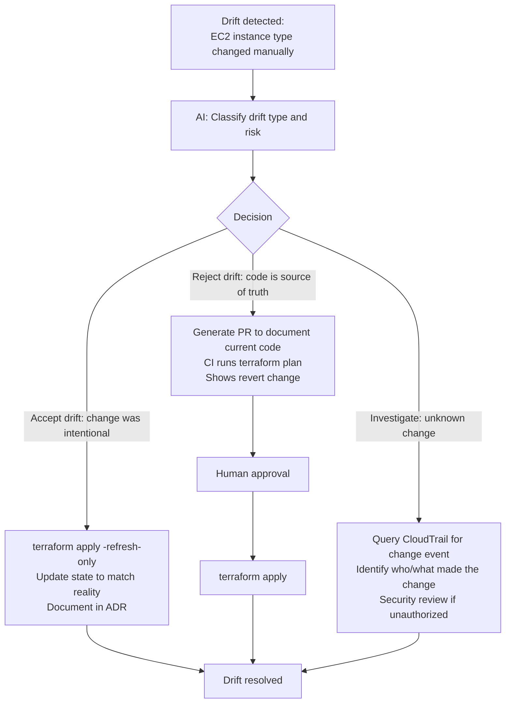
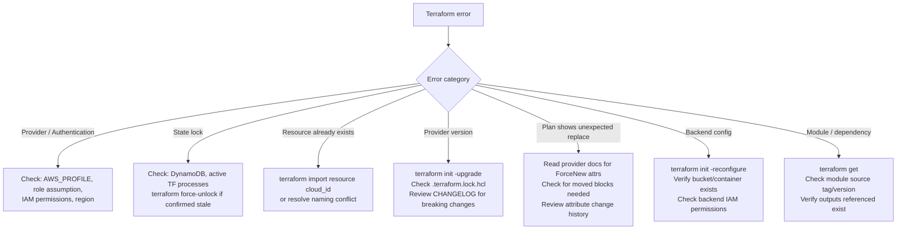
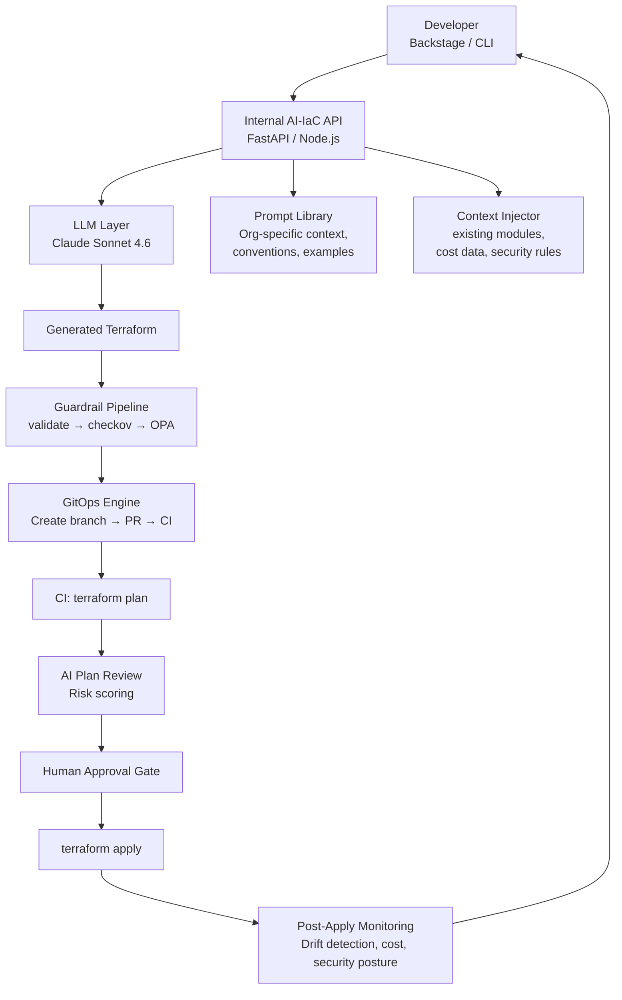

*Part 2 of 3 of [AI-Assisted Infrastructure as Code Mastery](../25-ai-assisted-iac-mastery.md).*

## Part 7: Multi-Layer Guardrail Architecture

### 7.1 Defense in Depth for AI-Generated IaC

No single guardrail is sufficient when AI agents can write and potentially apply Terraform code. Defense in depth applies multiple independent layers.



### 7.2 OPA/Conftest Policy Examples

```rego
# policy/no_public_s3.rego
package main

deny[msg] {
  resource := input.resource_changes[_]
  resource.type == "aws_s3_bucket"
  resource.change.after.acl == "public-read"
  msg := sprintf("S3 bucket %s must not have public-read ACL", [resource.address])
}

deny[msg] {
  resource := input.resource_changes[_]
  resource.type == "aws_s3_bucket_public_access_block"
  resource.change.after.block_public_acls == false
  msg := sprintf("Public access block not enabled on %s", [resource.address])
}
```

```rego
# policy/require_encryption.rego
package main

deny[msg] {
  resource := input.resource_changes[_]
  resource.type == "aws_db_instance"
  not resource.change.after.storage_encrypted
  msg := sprintf("RDS instance %s must have storage_encrypted = true", [resource.address])
}

deny[msg] {
  resource := input.resource_changes[_]
  resource.type == "aws_ebs_volume"
  not resource.change.after.encrypted
  msg := sprintf("EBS volume %s must be encrypted", [resource.address])
}
```

```bash
# Run OPA policies against terraform plan
terraform plan -out=plan.tfplan
terraform show -json plan.tfplan > plan.json
conftest test plan.json --policy policy/
```

### 7.3 Cloud-Level Guardrails (Last Line of Defense)

Cloud provider policy engines provide the final safety net — they operate at the API level and cannot be bypassed by Terraform or AI agents.

**AWS Service Control Policies (SCPs):**

```json
{
  "Version": "2012-10-17",
  "Statement": [
    {
      "Sid": "DenyUnencryptedEBS",
      "Effect": "Deny",
      "Action": ["ec2:CreateVolume"],
      "Resource": "*",
      "Condition": {
        "BoolIfExists": {
          "ec2:Encrypted": "false"
        }
      }
    },
    {
      "Sid": "RequireIMDSv2",
      "Effect": "Deny",
      "Action": ["ec2:RunInstances"],
      "Resource": "arn:aws:ec2:*:*:instance/*",
      "Condition": {
        "StringNotEquals": {
          "ec2:MetadataHttpTokens": "required"
        }
      }
    }
  ]
}
```

> SCPs, Azure Policies, and GCP Org Policies are the most important guardrails. Even if all other layers fail, these prevent the actual cloud API calls from succeeding.

## Part 8: Security & Compliance Automation

### 8.1 AI-Assisted Security Scanning

AI augments deterministic security tools by providing context-aware analysis:

```
You are a cloud security expert reviewing this Terraform plan for a HIPAA-regulated environment.

For each resource being created or modified, evaluate:
1. Encryption at rest: is PHI data encrypted with customer-managed keys?
2. Encryption in transit: is TLS 1.2+ enforced?
3. Access control: is least privilege applied? No public access?
4. Audit logging: is CloudTrail / CloudWatch Logs configured?
5. Network isolation: is the resource in a private subnet?
6. Backup: does the resource have automated backups configured?

Provide findings as:
- CRITICAL: Must fix before apply
- HIGH: Should fix before apply
- MEDIUM: Fix in next sprint
- LOW/INFO: Best practice recommendation

[Paste terraform plan JSON]
```

### 8.2 Compliance-as-Code Framework

```hcl
# compliance/hipaa_s3.tf — Enforce HIPAA requirements on S3 buckets
resource "aws_s3_bucket_server_side_encryption_configuration" "hipaa_buckets" {
  for_each = var.hipaa_bucket_arns

  bucket = each.value
  rule {
    apply_server_side_encryption_by_default {
      sse_algorithm     = "aws:kms"
      kms_master_key_id = aws_kms_key.hipaa_s3.arn
    }
    bucket_key_enabled = true
  }
}

resource "aws_s3_bucket_public_access_block" "hipaa_buckets" {
  for_each = var.hipaa_bucket_arns
  bucket   = each.value

  block_public_acls       = true
  block_public_policy     = true
  ignore_public_acls      = true
  restrict_public_buckets = true
}

resource "aws_s3_bucket_versioning" "hipaa_buckets" {
  for_each = var.hipaa_bucket_arns
  bucket   = each.value
  versioning_configuration {
    status = "Enabled"
  }
}
```

## Part 9: AI-Powered Drift Detection & Remediation

### 9.1 Scheduled Drift Detection Pipeline



### 9.2 Drift Remediation Pipeline



```bash
#!/usr/bin/env bash
# Drift detection script — run on schedule
set -euo pipefail

WORKSPACE_LIST=$(cat workspace-registry.txt)

for workspace in $WORKSPACE_LIST; do
  echo "Checking: $workspace"
  cd "environments/$workspace"

  terraform init -input=false -no-color > /dev/null

  EXIT_CODE=0
  terraform plan -refresh-only -detailed-exitcode -no-color \
    -out="drift-${workspace}.tfplan" 2>&1 | tee drift-output.txt || EXIT_CODE=$?

  case $EXIT_CODE in
    0) echo "CLEAN: $workspace" ;;
    2)
      echo "DRIFT: $workspace"
      cat drift-output.txt | jq -Rs '{"workspace": "'"$workspace"'", "output": .}' \
        | curl -s -X POST "$AI_ANALYSIS_ENDPOINT" -H "Content-Type: application/json" -d @-
      ;;
    1) echo "ERROR: $workspace — plan failed" ;;
  esac

  cd -
done
```

## Part 10: Cost Optimization with AI

### 10.1 AI-Driven Cost Analysis Workflow

```
Analyze this terraform state list and the following AWS Cost Explorer data.
Identify:
1. Resources that appear to be unused (zero traffic, zero connections for 30+ days)
2. Resources that are likely over-provisioned for their workload
3. Resources that could use cheaper pricing models (Reserved, Savings Plans, Spot)
4. Redundant resources that could be consolidated
5. Resources in expensive regions that could be relocated

For each recommendation:
- Resource address from state
- Current estimated monthly cost
- Recommended change
- Estimated monthly savings
- Risk level (HIGH/MEDIUM/LOW)
- Suggested Terraform change

[Paste terraform state list]
[Paste AWS Cost Explorer export]
```

### 10.2 Cost-Aware IaC Generation

```
Generate Terraform for the following, optimized for cost:
Environment: development (non-production, used 9am-6pm weekdays only)
Region: us-east-1

Requirements:
- EKS cluster for development workloads
- PostgreSQL database for app testing
- Redis cache
- S3 for artifact storage

Cost optimization requirements:
- Kubernetes: use Spot instances where possible
- Database: smallest instance that can run basic queries
- All resources: can be stopped/started on schedule
- Use scheduled scaling (scale to 0 outside business hours)
- Estimate monthly cost in the generated code comments

Output Terraform with cost comments and scheduling resources included.
```

### 10.3 Infracost Integration

```yaml
# GitHub Actions: post cost estimate on every infrastructure PR
- name: Infracost diff
  uses: infracost/actions/diff@v3
  with:
    path: .
    format: json
    out_file: /tmp/infracost-diff.json

- name: Post cost comment
  uses: infracost/actions/comment@v3
  with:
    path: /tmp/infracost-diff.json
    behavior: update
    github-token: ${{ secrets.GITHUB_TOKEN }}
```

## Part 11: AI-Assisted Troubleshooting

### 11.1 Error Resolution with AI

Structure your error queries for maximum AI effectiveness:

```
I'm getting this Terraform error. Please diagnose and provide a fix.

TERRAFORM VERSION: 1.9.0
PROVIDER: hashicorp/aws ~> 5.50
OPERATION: terraform apply

ERROR:
Error: creating EKS Node Group (prod-cluster:web-nodes): InvalidParameterException:
The following supplied instance types do not support the requested launch template
version: [m6i.xlarge]. Check that all instance types support the AMI type, capacity
type, and launch template version that you specified.

RELEVANT TERRAFORM CODE:
[paste resource block]

WHAT I'VE TRIED:
- Checked AMI type is AL2_x86_64
- Verified instance type exists in the region

ENVIRONMENT:
- AWS Region: us-east-1
- Terraform workspace: prod
```

### 11.2 Troubleshooting Decision Tree



## Part 12: Internal AI-IaC Platform Architecture

### 12.1 Reference Architecture



### 12.2 Context Injection for Better Generation

The quality of AI-generated IaC is dramatically improved by providing organization-specific context:

```python
def build_iac_context(org_context: dict) -> str:
    return f"""
You are an Infrastructure as Code assistant for {org_context['company']}.

ORGANIZATION CONTEXT:
- Cloud providers: {', '.join(org_context['cloud_providers'])}
- Primary IaC tool: Terraform {org_context['tf_version']}
- State backend: {org_context['backend']}

NAMING CONVENTIONS:
- Resources: {{environment}}-{{team}}-{{resource-type}}-{{name}}
- Example: prod-platform-eks-main, dev-data-rds-postgres

REQUIRED TAGS ON ALL RESOURCES:
- Environment: dev|staging|prod
- Team: {org_context['team']}
- CostCenter: {org_context['cost_center']}
- ManagedBy: terraform

APPROVED MODULE SOURCES:
{chr(10).join(f'- {m}' for m in org_context['approved_modules'])}

SECURITY REQUIREMENTS:
- All storage must be encrypted at rest (KMS CMK for prod)
- No public internet exposure without explicit approval
- IMDSv2 required on all EC2/EKS nodes
- Minimum TLS 1.2 on all load balancers

FORBIDDEN PATTERNS:
- No hardcoded account IDs (use data.aws_caller_identity)
- No version = ">= 1.0" (use pessimistic ~>)
- No access keys in code (use OIDC/instance profiles)
- No force_destroy = true in prod environments

Generate Terraform code following these conventions exactly.
"""
```

## Part 13: Governance & Policy Frameworks

### 13.1 Three-Layer Governance Model

| Layer | Tool | When Enforced | Visibility | Who Owns |
| --- | --- | --- | --- | --- |
| Development | IDE lint, pre-commit | Before commit | Developer | Developer |
| CI/CD | Checkov, OPA/Conftest | PR creation, CI | Engineering | Platform team |
| Cloud | SCP, Azure Policy, GCP Org Policy | API call | Ops/Security | Security/Cloud CoE |

### 13.2 AI-Assisted Policy Generation

```
Translate these compliance requirements into Terraform-compatible OPA/Conftest Rego policies:

REQUIREMENTS:
1. All databases must have automated backups with minimum 7-day retention
2. No S3 bucket may be publicly accessible (no public ACL, no bucket policy allowing *)
3. All EC2 instances must use IMDSv2 (http_tokens = "required")
4. All KMS keys must have key rotation enabled
5. All IAM roles must have a description (not empty)
6. No security group may allow ingress from 0.0.0.0/0 on port 22 or 3389
7. All CloudTrail trails must have log file validation enabled
8. All RDS instances must be encrypted

For each rule:
- Write the Rego policy that tests the terraform plan JSON
- Include a test case (should pass and should fail)
- Write a human-readable description of the violation message
```

### 13.3 Terraform Sentinel Policy (HashiCorp Terraform Cloud)

```python
# sentinel/restrict-instance-types.sentinel
import "tfplan/v2" as tfplan

allowed_types = ["t3.small", "t3.medium", "t3.large", "m6i.large", "m6i.xlarge"]

ec2_instances = filter tfplan.resource_changes as _, resource {
  resource.type == "aws_instance" and
  (resource.change.actions contains "create" or resource.change.actions contains "update")
}

violations = filter ec2_instances as _, instance {
  not (instance.change.after.instance_type in allowed_types)
}

main = rule {
  length(violations) == 0
}
```

## Related

- [Part 1: The AI-IaC Paradigm → Agentic IaC Workflows](../25-ai-assisted-iac-mastery.md)
- [Part 3: Self-Healing Infrastructure & The Future](25-ai-assisted-iac-mastery-part3.md) — self-healing patterns, multi-agent orchestration, autonomy roadmap, and tool/prompt reference appendices.
