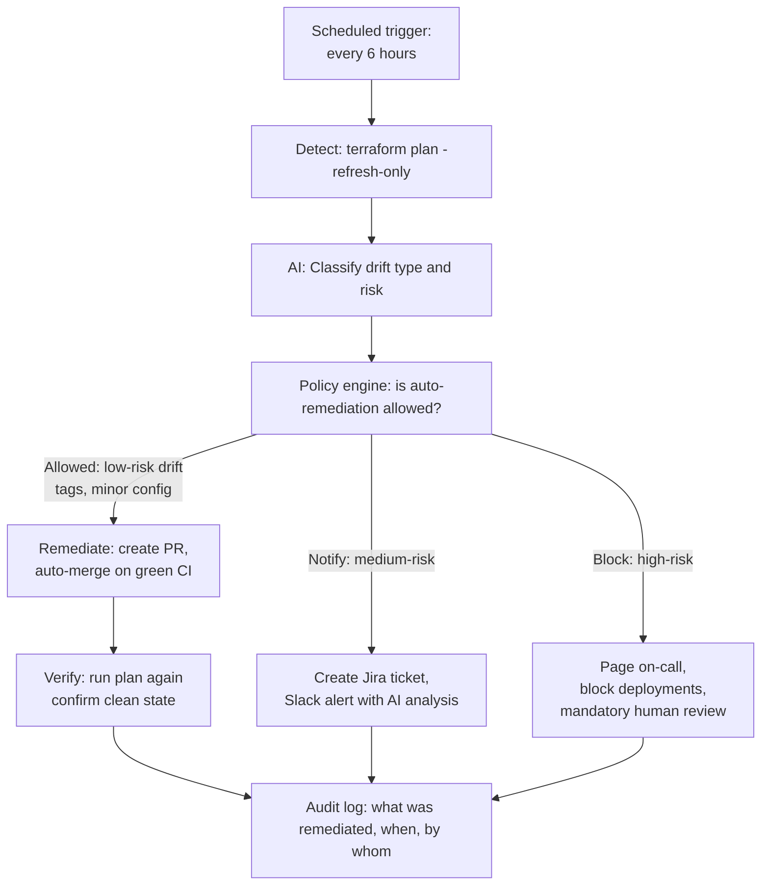
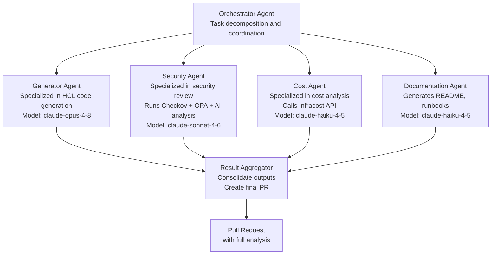

*Part 3 of 3 of [AI-Assisted Infrastructure as Code Mastery](../25-ai-assisted-iac-mastery.md).*

## Part 14: Self-Healing Infrastructure Patterns

### 14.1 What Is Self-Healing Infrastructure?

Self-healing infrastructure automatically detects, diagnoses, and remediates configuration issues and drift without requiring human intervention for low-risk scenarios.



### 14.2 EventBridge-Triggered Drift Response

```hcl
# AWS EventBridge Rule: trigger drift detection on manual change
resource "aws_cloudwatch_event_rule" "manual_resource_change" {
  name        = "detect-manual-infra-change"
  description = "Trigger drift detection when resources change outside Terraform"
  event_pattern = jsonencode({
    source      = ["aws.ec2", "aws.rds", "aws.s3", "aws.iam"]
    detail-type = ["AWS API Call via CloudTrail"]
    detail = {
      userAgent = [{ "anything-but" = ["terraform"] }]
      errorCode = [{ exists = false }]
    }
  })
}

resource "aws_cloudwatch_event_target" "trigger_drift_lambda" {
  rule = aws_cloudwatch_event_rule.manual_resource_change.name
  arn  = aws_lambda_function.drift_detector.arn
}
```

```python
# lambda/drift_detector.py
import boto3, json, os
import anthropic

def handler(event, context):
    detail = event['detail']
    resource_type = detail.get('eventSource', '').replace('.amazonaws.com', '')
    action = detail['eventName']
    user = detail['userIdentity'].get('arn', 'unknown')

    client = anthropic.Anthropic()
    message = client.messages.create(
        model="claude-sonnet-4-6",
        max_tokens=1024,
        messages=[{
            "role": "user",
            "content": f"""
A manual AWS infrastructure change was detected outside of Terraform.

Resource Type: {resource_type}
Action: {action}
Performed by: {user}

Classify the risk level (LOW/MEDIUM/HIGH/CRITICAL) and explain:
1. What likely changed
2. Whether this is a security concern
3. Whether auto-remediation is safe
4. Recommended response

Output as JSON: {{"risk", "explanation", "auto_remediate", "action"}}
"""
        }]
    )

    analysis = json.loads(message.content[0].text)

    sns = boto3.client('sns')
    if analysis['risk'] in ['HIGH', 'CRITICAL']:
        sns.publish(
            TopicArn=os.environ['ONCALL_TOPIC'],
            Subject=f"CRITICAL: Manual infra change - {resource_type}/{action}",
            Message=json.dumps(analysis, indent=2)
        )
    elif analysis['risk'] == 'MEDIUM':
        sns.publish(
            TopicArn=os.environ['ALERT_TOPIC'],
            Subject=f"Drift detected: {resource_type}/{action}",
            Message=json.dumps(analysis, indent=2)
        )

    return analysis
```

## Part 15: Multi-Agent IaC Orchestration

### 15.1 Specialized Agent Architecture

For complex IaC tasks, multiple specialized agents collaborate better than a single general-purpose agent.



### 15.2 Agent Communication Pattern

```python
# Multi-agent orchestration with Claude SDK
import anthropic
import asyncio

client = anthropic.Anthropic()

async def orchestrate_iac_generation(request: str, context: dict):
    """Orchestrate multiple specialized agents for IaC generation."""

    orchestrator_response = client.messages.create(
        model="claude-sonnet-4-6",
        max_tokens=2048,
        system="You are an IaC orchestrator. Decompose infrastructure requests into subtasks.",
        messages=[{"role": "user", "content": f"Request: {request}\nContext: {context}"}]
    )

    task_plan = orchestrator_response.content[0].text

    results = await asyncio.gather(
        run_generator_agent(request, context),
        run_security_agent(task_plan),
        run_cost_agent(task_plan),
    )

    generated_code, security_review, cost_estimate = results

    synthesis = client.messages.create(
        model="claude-sonnet-4-6",
        max_tokens=4096,
        messages=[{
            "role": "user",
            "content": f"""
Synthesize this multi-agent analysis into a final PR description:
Generated Code: {generated_code}
Security Review: {security_review}
Cost Estimate: {cost_estimate}
"""
        }]
    )

    return {
        "terraform_code": generated_code,
        "security_findings": security_review,
        "cost_estimate": cost_estimate,
        "pr_description": synthesis.content[0].text,
    }
```

## Part 16: The Future — Autonomous Infrastructure

### 16.1 Where AI-IaC Is Heading

The trajectory is toward increasingly autonomous infrastructure management, with AI agents handling operational toil while humans focus on architecture, strategy, and compliance.

**5-Year Outlook:**

| Capability | 2024 State | 2026 Projection | 2029 Vision |
| --- | --- | --- | --- |
| Code generation | Chat-based, human-curated | Integrated in IDE, auto-suggests | Natural language to code, no HCL needed |
| Plan interpretation | AI explains in plain English | Risk-scored, auto-routed approvals | Context-aware, cost/risk/compliance in one view |
| Drift remediation | Detected + alerted | Auto-PR for low-risk drift | Auto-apply within policy for known-safe changes |
| Compliance | Static scan + manual review | AI + policy-as-code enforced in CI | Continuous, real-time compliance monitoring |
| Cost optimization | Periodic reports | Continuous suggestions with auto-apply | Autonomous right-sizing within guardrails |
| Incident response | Human investigates | AI diagnoses and proposes fix | AI remediates with human notification |
| Documentation | Generated post-hoc | Generated with code | Living docs auto-updated by agents |
| Architecture design | AI assists | AI designs with human review | AI proposes architecture options, human selects |

### 16.2 Building Toward Autonomy Safely

The key principle: autonomy should expand gradually as trust is established, with each expansion gated by demonstrated reliability and safety.

**Autonomy Roadmap:**

- **Months 1–3:** Level 1–2 — AI generates code, humans review 100% of changes
- **Months 3–6:** Level 2–3 — AI reviews code, flags issues before human review
- **Months 6–12:** Level 3–4 — Auto-remediation PRs for tag/config drift (human merge)
- **Year 1–2:** Level 4 — Auto-merge for pre-approved, low-risk drift patterns
- **Year 2+:** Level 5 — Full autonomy within defined policy guardrails

**The non-negotiables at every level:**

1. Audit trail — every AI action is logged with the AI's reasoning
2. Human override — humans can always pause, roll back, or override AI decisions
3. Blast radius limits — AI cannot exceed defined risk thresholds without escalation
4. Transparency — AI explains every action in human-readable terms
5. Rollback readiness — every AI-applied change must be reversible

### 16.3 Responsible AI-IaC Principles

| Principle | Application in IaC |
| --- | --- |
| **Explainability** | AI must explain WHY it generated specific code, not just WHAT |
| **Auditability** | All AI-generated changes logged in immutable audit trail |
| **Human oversight** | Every destructive or high-risk action requires human approval |
| **Least privilege** | AI agents have narrowest possible IAM permissions |
| **Fail safe** | On AI error or uncertainty, stop and alert — never guess on infra |
| **Data minimization** | AI agents don't have access to production data, only configuration |
| **Reversibility** | AI avoids patterns that are hard to undo (data destruction, IAM changes) |

## Appendix A — Tool Selection Matrix

### AI Models

| Use Case | Recommended Model | Rationale |
| --- | --- | --- |
| Daily IaC generation | claude-sonnet-4-6 | Best balance of speed, accuracy, and cost |
| Architect-level design | claude-opus-4-8 | Maximum reasoning quality for complex decisions |
| High-volume generation | claude-haiku-4-5 | Low latency, cost-effective for templating |
| Security review | claude-sonnet-4-6 | Strong reasoning about security implications |
| Documentation generation | claude-haiku-4-5 | Fast, adequate for doc generation tasks |

### Static Analysis Tools

| Tool | Primary Purpose | Priority | Integration |
| --- | --- | --- | --- |
| Checkov | Security misconfig detection | Must have | CLI, GitHub Actions, pre-commit |
| tfsec | Terraform-specific security | Must have | CLI, GitHub Actions |
| Infracost | Cost estimation | Strongly recommended | CLI, GitHub Actions, PR comments |
| OPA/Conftest | Custom org policies | Recommended | CLI, GitHub Actions |
| Trivy | CVE + config scanning | Recommended | CLI, GitHub Actions |
| Terrascan | Multi-cloud policies | Optional | CLI, GitHub Actions |
| Semgrep | Custom pattern rules | Optional | CLI, GitHub Actions |
| Driftctl | Drift detection | Optional | CLI, scheduled CI |

### GitOps / Platform Tools

| Tool | Type | Self-Hosted | Best For |
| --- | --- | --- | --- |
| Atlantis | Terraform GitOps | Yes | Teams wanting PR workflow |
| Spacelift | SaaS IaC platform | No | Enterprise governance, drift detection |
| Terraform Cloud | HashiCorp SaaS | No | HashiCorp ecosystem |
| env0 | SaaS IaC platform | No | Cost governance, RBAC |
| Scalr | SaaS IaC platform | No | Multi-tenant IaC |
| GitHub Actions | CI/CD | No | GitHub orgs, custom workflows |
| GitLab CI | CI/CD | Both | GitLab orgs |

## Appendix B — Prompt Engineering for IaC

### Prompt Templates

**Resource Generation:**

```
Context: [Cloud provider, region, account purpose, environment]
Task: Generate Terraform HCL for [resource type]
Requirements: [Specific attributes, sizes, configurations]
Security: [Encryption, access control, network requirements]
Tagging: [Required tags and values]
Constraints: [What to exclude, what not to configure]
Output: Terraform HCL only, no explanation
```

**Plan Interpretation:**

```
Analyze this terraform plan output:
1. Summarize all changes in plain English
2. Identify any resource replacements (destroyed + recreated)
3. Assess downtime risk for each replacement
4. Flag any security concerns
5. Estimate cost impact
6. Give an overall recommendation: SAFE/REVIEW/BLOCK

[Plan output]
```

**Error Diagnosis:**

```
Terraform error diagnosis request:
- TF version: [version]
- Provider: [name + version]
- Operation: [plan/apply/init/etc]
- Error: [full error message]
- Code: [relevant resource block]
- Tried: [what you've already tried]
```

**Security Review:**

```
Review for [compliance standard: HIPAA/PCI-DSS/SOC2]:
For each resource, check [specific requirements list].
Output: CRITICAL/HIGH/MEDIUM/LOW findings with remediation code.

[Terraform configuration]
```

### Few-Shot Examples for Better Results

Include 1–2 examples of your organization's coding style in your prompt context:

```
Our coding style:
locals {
  common_tags = {
    Environment = var.environment
    Team        = var.team
    ManagedBy   = "terraform"
  }
}

resource "aws_s3_bucket" "example" {
  bucket = "${var.environment}-${var.team}-${var.name}"
  tags   = local.common_tags
}

Generate all resources following this exact style.
```

## Appendix C — Production Readiness Checklist

### AI System

- [ ] LLM API key stored in secrets manager, not code
- [ ] Model version pinned (not using `latest`)
- [ ] Token limits set appropriately for code generation tasks
- [ ] Fallback for API unavailability (graceful degradation to human-only workflow)
- [ ] Rate limiting implemented for LLM API calls
- [ ] Cost monitoring on LLM API usage
- [ ] Prompt injection defenses in place (user input sanitized before insertion)
- [ ] PII/sensitive data stripped before sending to external LLM APIs

### Guardrail Pipeline

- [ ] `terraform validate` enforced in CI
- [ ] Checkov with minimum severity threshold configured
- [ ] OPA/Conftest policies cover: encryption, public access, IMDSv2, tagging
- [ ] Cloud-level policies (SCPs/Azure Policy) align with Terraform policies
- [ ] Plan review step is not bypassable in CI
- [ ] Destructive operations require additional approval
- [ ] Emergency bypass documented and requires two-engineer approval

### Agentic Operations

- [ ] AI agent IAM permissions documented and reviewed
- [ ] Agent actions logged to immutable audit trail (CloudTrail + S3)
- [ ] Circuit breaker: agent auto-pauses if error rate exceeds threshold
- [ ] Blast radius limit: agent cannot affect more than N resources in one operation
- [ ] Human notification within 5 minutes of any autonomous apply
- [ ] Rollback procedure documented and tested for every agentic workflow
- [ ] Agent behavior tested in dev/staging before production enablement

### Governance & Compliance

- [ ] All AI-generated infrastructure changes traceable to request ticket
- [ ] Compliance policy rules version-controlled and peer-reviewed
- [ ] Policy exceptions documented with owner, expiry, and business justification
- [ ] Regular (quarterly) review of AI-generated code patterns for drift from standards
- [ ] Incident response runbook covers "AI agent made unexpected change" scenario
- [ ] Data residency verified: LLM API calls don't send regulated data to external services

## Related

- [Part 1: The AI-IaC Paradigm → Agentic IaC Workflows](../25-ai-assisted-iac-mastery.md)
- [Part 2: Guardrails, Governance & Cost Optimization](25-ai-assisted-iac-mastery-part2.md)
- [Terraform from Zero to Mastery](../26-terraform-mastery-guide.md) — the core Terraform reference this guide builds on.
