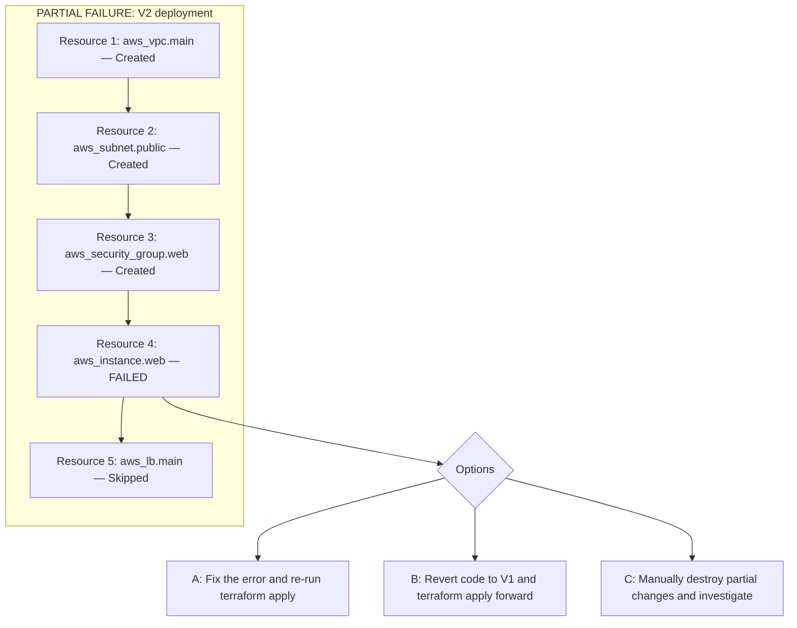
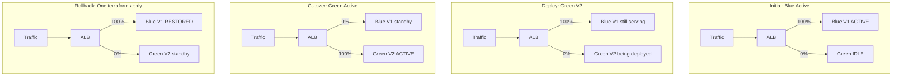
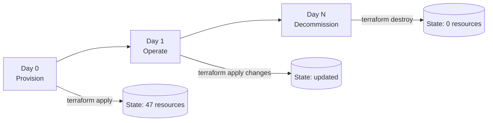

*Part 2 of 4 of [Terraform from Zero to Mastery](../26-terraform-mastery-guide.md).*

## Part 5: Complete CLI Command Mastery

### 5.1 Initialization Commands

```bash
terraform init                              # Standard initialization
terraform init -upgrade                     # Upgrade providers to latest matching
terraform init -reconfigure                 # Force backend reconfiguration
terraform init -migrate-state              # Migrate state to new backend
terraform init -get=false                  # Skip module download (use cached)
terraform init -backend=false             # No backend (offline plan generation)
terraform init -plugin-dir=/opt/tf/plugins # Custom plugin dir (air-gapped)
```

### 5.2 Planning Commands

```bash
terraform plan                              # Standard plan
terraform plan -out=tfplan                  # Save plan to file (CI/CD recommended)
terraform apply tfplan                      # Apply exactly what was planned

terraform plan -refresh-only                # Detect drift without proposing changes
terraform plan -destroy                     # See what destroy would do

terraform plan -target=aws_instance.web    # Limit to specific resource (emergency only)
terraform plan -target=module.networking

terraform plan -var="environment=prod"      # Set variables inline
terraform plan -var-file="prod.tfvars"      # Use variables file
terraform plan -refresh=false              # Skip state refresh (faster)
terraform plan -parallelism=20              # Control parallel operations

terraform show -json tfplan | jq .          # Plan as JSON (for tooling)
```

### 5.3 State Sub-Commands — Complete Reference

```bash
# List resources
terraform state list
terraform state list module.networking      # Filter by module
terraform state list 'aws_instance.*'       # Filter by type

# Inspect resources
terraform state show aws_instance.web
terraform state show module.vpc.aws_vpc.main

# Move resources (rename/reorganize — prefer moved{} blocks in TF 1.1+)
terraform state mv aws_instance.web aws_instance.frontend
terraform state mv aws_vpc.main module.network.aws_vpc.main

# Remove from state WITHOUT deleting in cloud (orphan)
terraform state rm aws_instance.old_server
terraform state rm module.legacy

# Backup and restore
terraform state pull > "backup-$(date +%Y%m%d).tfstate"
terraform state push terraform.tfstate      # EXTREME CAUTION

# Replace provider in state
terraform state replace-provider \
  registry.terraform.io/hashicorp/aws \
  registry.terraform.io/hashicorp/aws
```

### 5.4 Import Commands

```bash
# Legacy CLI import (Terraform < 1.5) — write resource block in .tf first
terraform import aws_instance.web i-0abc123def456789
terraform import aws_s3_bucket.logs my-company-app-logs
terraform import module.networking.aws_vpc.main vpc-0a1b2c3d
```

**Terraform 1.5+ Import Blocks (preferred):**

```hcl
import {
  to = aws_s3_bucket.legacy_data
  id = "my-company-legacy-data-bucket"
}

import {
  to = module.networking.aws_vpc.main
  id = "vpc-0a1b2c3d4e5f67890"
}
```

```bash
# Generate HCL configuration from existing resources
terraform plan -generate-config-out=generated.tf
# Review and clean up generated.tf, then: terraform apply
```

> The `import block + -generate-config-out` workflow is the recommended approach for migrating large existing infrastructures. It generates the HCL code automatically.

## Part 6: Rollback Strategy & Failure Recovery

### 6.1 Why Terraform Has No Native Rollback

Terraform deliberately does not have a built-in rollback command:

- **State is additive:** Terraform applies changes incrementally. A partial failure means some resources are new and some are old.
- **Infra is not a transaction:** Infrastructure changes cannot be atomically committed or rolled back.
- **Rollback is a forward operation:** The correct response to a failure is to deploy a known-good version forward.



### 6.2 Git-Based Rollback (Primary Method)

```bash
# 1. Find last known-good commit
git log --oneline -10
# abc1234 Add ALB and target groups (V2 - FAILED)
# def5678 Initial EC2 and VPC setup  (V1 - GOOD)

# Option A: Create a revert commit
git revert abc1234
git push origin main
# CI/CD pipeline runs terraform apply to restore V1 config

# Option B: Emergency checkout
git checkout def5678 -- *.tf modules/
git commit -m "Emergency rollback to def5678"
terraform plan && terraform apply

# Option C: Apply saved pre-deployment plan
terraform apply saved_v1_plan.tfplan
# NOTE: Saved plans expire if state has changed
```

### 6.3 Blue-Green Infrastructure Rollback



```hcl
resource "aws_lb_listener_rule" "blue_green" {
  listener_arn = aws_lb_listener.https.arn
  action {
    type = "forward"
    forward {
      target_group {
        arn    = aws_lb_target_group.blue.arn
        weight = var.blue_weight
      }
      target_group {
        arn    = aws_lb_target_group.green.arn
        weight = var.green_weight
      }
    }
  }
  condition {
    path_pattern { values = ["/*"] }
  }
}
# Rollback: terraform apply -var="blue_weight=100" -var="green_weight=0"
```

## Part 7: Infrastructure Decommissioning

### 7.1 Why Terraform is Ideal for Decommissioning

> Terraform's state file IS your decommission checklist. Every resource listed in state includes its cloud ID, configuration, and dependencies. No manual inventory required.



### 7.2 Enterprise Decommission Playbook

**Phase 1: Inventory & Dependencies**

```bash
terraform state list > decommission-inventory.txt
terraform graph | dot -Tpng > dependency-graph.png
```

**Phase 2: Data Archival & Compliance**

- Create final snapshots of all databases (RDS, DynamoDB export)
- Archive S3 data to Glacier or secondary storage
- Document data retention requirements (GDPR, HIPAA, SOX)
- Verify backup restoration works before destroying source

**Phase 3: Traffic Cutover**

- Remove DNS records pointing to retiring infrastructure
- Remove from load balancer target groups
- Verify zero traffic for minimum 24–48 hours

**Phase 4: Remove Destroy Protections**

```bash
grep -r "prevent_destroy" . --include="*.tf"
# Remove lifecycle { prevent_destroy = true } from all resources
terraform plan -destroy   # Review the full destruction plan
```

**Phase 5: Controlled Destruction Order**

1. Stateless resources first: EC2, ECS, Lambda
2. Load balancers and security groups
3. Databases (after final snapshot confirmed)
4. Networking (subnets, VPC, IGW, route tables)
5. IAM roles and policies last

**Phase 6: Validation**

```bash
terraform state list   # Should return empty
terraform plan         # Should show "No changes"
```

**Phase 7: Audit Evidence**

- Archive final state file (even the empty one)
- Archive Git history of decommission changes
- Archive cloud provider billing reports pre/post

### 7.3 `prevent_destroy` — Production Safeguard

```hcl
resource "aws_db_instance" "production" {
  identifier        = "prod-postgres"
  engine            = "postgres"
  instance_class    = "db.r6g.xlarge"
  allocated_storage = 500
  lifecycle {
    prevent_destroy = true
    ignore_changes  = [password]
  }
}
# To decommission: remove prevent_destroy = true, commit, review plan, get approval
```

## Part 8: Force Destroy Deep Dive

### 8.1 `force_destroy` for AWS S3

By default, Terraform cannot delete an S3 bucket that contains objects.

> **Warning:** `force_destroy = true` permanently deletes ALL objects and ALL versions. Irreversible.

```hcl
# WITHOUT force_destroy (default, safe)
resource "aws_s3_bucket" "logs" {
  bucket = "my-company-app-logs"
  # ERROR if bucket has objects: BucketNotEmpty
}

# WITH force_destroy (dangerous — deletes all data)
resource "aws_s3_bucket" "ephemeral" {
  bucket        = "my-company-dev-scratch"
  force_destroy = true
}

# Best practice: environment-conditional
resource "aws_s3_bucket" "data" {
  bucket        = "my-company-${var.environment}-data"
  force_destroy = var.environment != "prod"
}
```

### 8.2 `terraform apply -replace`

The `-replace` flag (Terraform 0.15.2+) forces a specific resource to be destroyed and recreated, replacing the deprecated `taint` command.

```bash
terraform apply -replace=aws_instance.web
terraform apply -replace=module.compute.aws_instance.app

# Always plan first to see impact
terraform plan -replace=aws_instance.web

# Use cases: unhealthy EC2, SSH key rotation, AMI upgrade,
#            certificate or secret rotation requiring new resource
```

## Part 9: State Manipulation Mastery

### 9.1 `terraform state mv` — When and How

```bash
# Moving resource into a module
terraform state mv aws_vpc.main module.networking.aws_vpc.main

# Renaming resource
terraform state mv aws_s3_bucket.data aws_s3_bucket.raw_data

# Converting count to for_each
terraform state mv 'aws_instance.servers[0]' 'aws_instance.servers["web"]'
terraform state mv 'aws_instance.servers[1]' 'aws_instance.servers["api"]'

# Verify the move worked
terraform state list
terraform plan  # Should show no changes
```

> **`terraform state mv` is the old way.** For Terraform 1.1+, use `moved {}` blocks — they are version-controlled, reviewable in PRs, and self-documenting.

### 9.2 Import Blocks — Terraform 1.5+

```hcl
# Step 1: Add import block(s) to your .tf files
import {
  to = aws_s3_bucket.legacy_data
  id = "my-company-legacy-data-bucket"
}

import {
  to = aws_db_instance.prod
  id = "prod-postgres-identifier"
}
```

```bash
# Step 2: Generate resource configuration
terraform plan -generate-config-out=imported_resources.tf

# Step 3: Review and clean up generated code
# Remove read-only attributes and refactor for production quality

# Step 4: Apply the import
terraform apply

# Step 5: Remove import blocks (they are one-time operations)
```

## Part 10: Data Sources, Variables & Outputs

### 10.1 Data Sources vs Resources

```hcl
# RESOURCE: Terraform creates, updates, and destroys this
resource "aws_vpc" "main" {
  cidr_block = "10.0.0.0/16"
}

# DATA SOURCE: Terraform reads but does NOT own or modify this
data "aws_vpc" "existing" {
  id = "vpc-0a1b2c3d4e5f67890"
}

# Common data sources:
data "aws_ami" "ubuntu" {
  most_recent = true
  owners      = ["099720109477"]  # Canonical
  filter {
    name   = "name"
    values = ["ubuntu/images/hvm-ssd/ubuntu-*-22.04-amd64-server-*"]
  }
}

# Cross-state reference
data "terraform_remote_state" "networking" {
  backend = "s3"
  config = {
    bucket = "my-terraform-state"
    key    = "prod/networking/terraform.tfstate"
    region = "us-east-1"
  }
}

resource "aws_instance" "app" {
  subnet_id = data.terraform_remote_state.networking.outputs.private_subnet_id
}
```

### 10.2 Variable Types & Validation

```hcl
variable "environment" {
  type        = string
  description = "Deployment environment"
  default     = "dev"
  validation {
    condition     = contains(["dev", "staging", "prod"], var.environment)
    error_message = "Environment must be one of: dev, staging, prod."
  }
}

variable "instance_count" {
  type    = number
  default = 2
  validation {
    condition     = var.instance_count >= 1 && var.instance_count <= 100
    error_message = "Instance count must be between 1 and 100."
  }
}

# Sensitive variable — never shown in plan/apply output
variable "db_password" {
  type      = string
  sensitive = true
}

variable "tags" {
  type = object({
    team        = string
    cost_center = string
    project     = string
  })
  default = {
    team        = "platform"
    cost_center = "engineering"
    project     = "core-infra"
  }
}
```

## Part 11: Advanced Lifecycle Controls

### 11.1 Complete Lifecycle Reference

```hcl
resource "aws_db_instance" "main" {
  identifier        = "prod-db"
  engine            = "postgres"
  instance_class    = "db.r6g.xlarge"
  allocated_storage = 100
  username          = "admin"
  password          = var.db_password

  lifecycle {
    # Zero-downtime replacements: create new first, then destroy old
    create_before_destroy = true

    # Terraform will ERROR on any destroy operation
    prevent_destroy = true

    # Ignore drift in specific attributes managed externally
    ignore_changes = [
      password,             # Managed by Secrets rotation
      snapshot_identifier,  # Set by restore operations
      tags["LastModified"],  # Set by external tagging tool
    ]

    # Force replacement when referenced resource changes
    replace_triggered_by = [
      aws_db_subnet_group.main.id,
    ]
  }
}
```

| Lifecycle Option | Use Case | Risk Level | Example Scenario |
| --- | --- | --- | --- |
| `create_before_destroy` | Zero-downtime resource replacement | Medium — doubles resources briefly | SSL cert rotation, DB instance class change |
| `prevent_destroy` | Production safeguard for critical resources | Low — just prevents accidents | Production RDS, S3 data buckets |
| `ignore_changes` | External system manages specific attributes | Medium — drift accumulates silently | ASG `desired_count` managed by autoscaling |
| `replace_triggered_by` | Force replacement on dependency change | High — destroys the resource | Restarting instances when `user_data` changes |

## Part 12: Modules Mastery

### 12.1 Module Design Principles

```
modules/
├── aws-vpc/
│   ├── main.tf        # Resource definitions
│   ├── variables.tf   # Input variable declarations
│   ├── outputs.tf     # Output value declarations
│   ├── versions.tf    # Provider + Terraform version constraints
│   ├── README.md      # Documentation
│   └── examples/
│       └── basic/
│           └── main.tf
```

```hcl
# Calling a module — ALWAYS pin versions in production!
module "vpc" {
  source  = "terraform-aws-modules/vpc/aws"
  version = "~> 5.0"

  name            = "prod-vpc"
  cidr            = "10.0.0.0/16"
  azs             = ["us-east-1a", "us-east-1b", "us-east-1c"]
  private_subnets = ["10.0.1.0/24", "10.0.2.0/24", "10.0.3.0/24"]
  public_subnets  = ["10.0.101.0/24", "10.0.102.0/24", "10.0.103.0/24"]
  enable_nat_gateway = true
  single_nat_gateway = var.environment != "prod"
  tags               = local.common_tags
}

resource "aws_instance" "app" {
  subnet_id = module.vpc.private_subnets[0]
}
```

### 12.2 Monorepo vs Multi-Repo

| Factor | Monorepo | Multi-Repo |
| --- | --- | --- |
| Atomic changes | Change VPC + app in one PR | Multiple PRs required |
| Blast radius | Anyone can change anything | Isolated per team/service |
| Versioning | Implicit (git SHA) | Explicit semver tags |
| Dependency tracking | Easier (co-located) | Must pin module versions |
| Team autonomy | Shared ownership conflicts | Clear ownership |
| CI/CD complexity | Medium (path-based triggers) | Higher (multiple pipelines) |
| Recommended for | Small-medium teams (&lt;10 engineers) | Large orgs, platform teams |

## Related

- [Part 1: Fundamentals → State Deep Dive](../26-terraform-mastery-guide.md)
- [Part 3: Enterprise Architecture, Security & OpenTofu](26-terraform-mastery-guide-part3.md)
- [Part 4: Interview Questions & Operations Guide](26-terraform-mastery-guide-part4.md)
