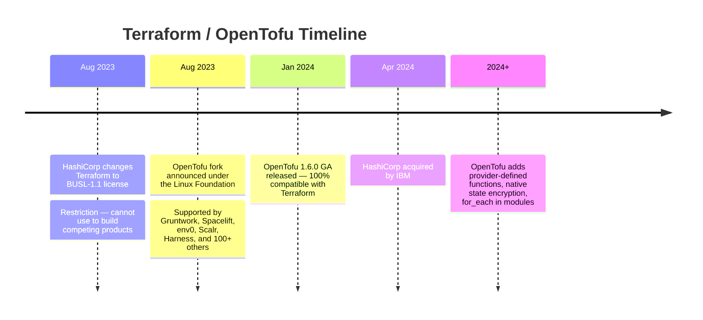

*Part 3 of 4 of [Terraform from Zero to Mastery](../26-terraform-mastery-guide.md).*

## Part 13: Enterprise Terraform Architecture

### 13.1 Recommended Directory Structure

```
infrastructure/
├── modules/
│   ├── aws-eks-cluster/
│   ├── aws-rds-postgres/
│   └── aws-networking/
├── environments/
│   ├── dev/us-east-1/
│   │   ├── networking/
│   │   └── eks/
│   ├── staging/us-east-1/
│   └── prod/
│       ├── us-east-1/
│       └── eu-west-1/         # Multi-region prod
├── .github/workflows/
│   ├── terraform-plan.yml     # PR: plan + post results
│   └── terraform-apply.yml   # Main: auto-apply on merge
└── scripts/
    ├── bootstrap-backend.sh
    └── validate-all.sh
```

### 13.2 GitOps Integration Patterns

| Tool | Type | Key Feature | Best For |
| --- | --- | --- | --- |
| GitHub Actions | CI/CD | Native GitHub integration, free tier | GitHub-based orgs |
| GitLab CI | CI/CD | Built-in, no external tools needed | GitLab-based orgs |
| Atlantis | Terraform-specific | PR-based plan/apply comments | Teams wanting PR workflow |
| Spacelift | SaaS IaC platform | Policy, drift detection, audit | Enterprise governance |
| Terraform Cloud | HashiCorp SaaS | Remote state, Sentinel policy | HashiCorp ecosystem |
| Azure DevOps | CI/CD | Deep Azure integration | Microsoft/Azure shops |
| Jenkins | CI/CD | Highly customizable, self-hosted | Existing Jenkins orgs |

```yaml
# .github/workflows/terraform.yml
name: Terraform
on:
  pull_request:
    paths: ["environments/**", "modules/**"]
  push:
    branches: [main]
    paths: ["environments/**", "modules/**"]
jobs:
  terraform:
    runs-on: ubuntu-latest
    steps:
      - uses: actions/checkout@v4
      - uses: hashicorp/setup-terraform@v3
        with:
          terraform_version: "1.9.0"
      - name: Configure AWS credentials
        uses: aws-actions/configure-aws-credentials@v4
        with:
          role-to-assume: arn:aws:iam::123456789:role/TerraformCI
          aws-region: us-east-1
      - name: Terraform Init
        run: terraform init
      - name: Terraform Plan (PR only)
        if: github.event_name == 'pull_request'
        run: terraform plan -out=tfplan -no-color
      - name: Terraform Apply (main branch only)
        if: github.ref == 'refs/heads/main'
        run: terraform apply -auto-approve
```

## Part 14: Security Best Practices

### 14.1 Secret Management — Never in Code

> **NEVER hardcode secrets** in `.tf` files or `.tfvars` files. They end up in Git history and in the state file.

```hcl
# WRONG — credential in code
resource "aws_db_instance" "main" {
  password = "SuperSecret123!"  # This will be in Git AND state!
}

# CORRECT — use AWS Secrets Manager
data "aws_secretsmanager_secret_version" "db_password" {
  secret_id = "prod/database/master-password"
}
resource "aws_db_instance" "main" {
  password = jsondecode(data.aws_secretsmanager_secret_version.db_password.secret_string)["password"]
  lifecycle {
    ignore_changes = [password]  # Allow external rotation
  }
}

# CORRECT — use HashiCorp Vault
data "vault_generic_secret" "db_creds" {
  path = "secret/prod/database"
}
resource "aws_db_instance" "main" {
  username = data.vault_generic_secret.db_creds.data["username"]
  password = data.vault_generic_secret.db_creds.data["password"]
}
```

### 14.2 IAM Least Privilege for Terraform

```json
{
  "Version": "2012-10-17",
  "Statement": [
    {
      "Sid": "TerraformStateAccess",
      "Effect": "Allow",
      "Action": ["s3:GetObject", "s3:PutObject", "s3:ListBucket"],
      "Resource": [
        "arn:aws:s3:::my-company-terraform-state",
        "arn:aws:s3:::my-company-terraform-state/*"
      ]
    },
    {
      "Sid": "TerraformLocking",
      "Effect": "Allow",
      "Action": ["dynamodb:GetItem", "dynamodb:PutItem", "dynamodb:DeleteItem"],
      "Resource": "arn:aws:dynamodb:us-east-1:123456:table/terraform-locks"
    }
  ]
}
```

> **Use OIDC authentication** with GitHub Actions / GitLab CI to assume IAM roles without storing long-lived AWS credentials as secrets.

## Part 15: Anti-Pattern Catalog

*17 Critical Terraform Anti-Patterns & Remediation*

| # | Anti-Pattern | Problem | Fix |
| --- | --- | --- | --- |
| AP-01 | All environments in one state file | A failed prod apply can corrupt all environments | Split state by environment AND layer (networking/compute/data) |
| AP-02 | Local state on developer's laptop | No locking, no sharing, high risk of overwrites | Always use remote backends (S3+DynamoDB, Terraform Cloud, GCS) |
| AP-03 | Manual console changes bypassing Terraform | State drift accumulates silently | Enforce IaC-only changes via IAM SCPs, Azure Policies, or org policies |
| AP-04 | Hardcoded account IDs in code | Makes module reuse impossible | Use variables, data sources, and `data.aws_caller_identity` |
| AP-05 | Hardcoded passwords in `.tf` files | Shows in plan output AND state file; Git history exposure | Use Secrets Manager, Key Vault, or HashiCorp Vault |
| AP-06 | S3 bucket without versioning for state | One accidental state push can permanently destroy state | Enable S3 versioning + MFA delete |
| AP-07 | Using `-target` routinely | Creates state inconsistencies over time | `-target` is for emergencies only |
| AP-08 | Not committing `.terraform.lock.hcl` | Different engineers use different provider versions | Commit the lock file; run `terraform providers lock` for multi-platform |
| AP-09 | Using `version = ">= 2.0"` | Allows major version upgrades breaking code silently | Use pessimistic constraint: `version = "~> 5.0"` |
| AP-10 | Long-lived IAM access keys in CI | If leaked, attacker has full infra access | Use OIDC role assumption for GitHub Actions / GitLab CI |
| AP-11 | Production databases without `prevent_destroy` | A mistyped `terraform destroy` destroys prod data | Add `lifecycle { prevent_destroy = true }` to all stateful prod resources |
| AP-12 | Using `terraform workspace` for environments | State shares same backend key prefix | Use separate state files per environment in separate directories |
| AP-13 | 500+ line monolithic modules | Impossible to test, reason about, or reuse | Single responsibility: one module per logical component; max ~200 lines |
| AP-14 | No `required_version` constraint | Different engineers run different Terraform versions | Always set `required_version = "~> 1.9"` and enforce with `tfenv` |
| AP-15 | Using `-auto-approve` in production without reviewing plan | Surprises await | Always run plan first; use `-auto-approve` only in CI after plan review |
| AP-16 | Inconsistent formatting | Causes noisy PRs and makes code reviews harder | Add `terraform fmt -check` to CI pipeline |
| AP-17 | Running import without reviewing generated plan | Surprises from what Terraform wants to change | Always run `terraform plan` after import |

## Part 16: Troubleshooting Playbook

### 16.1 Error Resolution Quick Reference

**`Error acquiring the state lock`**

```bash
terraform force-unlock <LOCK_ID>   # Find ID in error message
# Verify no other terraform process is running first!
aws dynamodb delete-item --table-name terraform-locks \
  --key '{"LockID":{"S":"<LOCK_ID>"}}'
```

**`Error: Resource already exists`**

- Resource exists in cloud but not in state
- Option A: `terraform import <resource> <cloud_id>`
- Option B: Rename your resource to not conflict
- Option C: Delete the cloud resource if not needed

**`Error: Provider version conflict`**

```bash
terraform init -upgrade
rm .terraform.lock.hcl && terraform init
terraform providers lock -platform=linux_amd64 -platform=darwin_arm64
```

**`Inconsistent dependency lock file`**

```bash
rm .terraform.lock.hcl && terraform init
# Commit the regenerated lock file
```

**`Plan shows unexpected resource replacements`**

- Check for attribute changes marked `ForceNew` in provider docs
- Review `moved {}` blocks for missing migrations
- Run `terraform state show <resource>` to compare with config

**`terraform destroy fails on S3 bucket`**

- Bucket has objects — empty manually or add `force_destroy = true`
- If versioned: `aws s3 rm s3://bucket --recursive` first

**`Import fails with 'no resource with address found'`**

- Ensure the resource block EXISTS in your `.tf` files before running import
- For modules: `terraform import module.name.resource_type.name`
- Use `import {}` blocks (Terraform 1.5+) for reliability

## Part 17: System Retirement Programs

### 17.1 Retirement Scenarios

| Scenario | Terraform's Role | Key Features Used |
| --- | --- | --- |
| Data Center Exit | Inventory all managed resources, orderly teardown | `state list`, `plan -destroy`, `prevent_destroy` removal |
| End-of-Life Application | Map all resources, controlled sunset | Tags-based filtering, module destroy |
| Cloud Migration Cleanup | Retire old VMs/DBs after workload moved | `import` to get old infra into state, then destroy |
| Post-M&A Integration | Inventory acquired infra, unify under corporate Terraform | Bulk import, `state mv`, module consolidation |
| Cost Optimization | Identify and destroy unused resources | `state list`, cloud cost tagging, targeted destroy |
| Regulatory (GDPR/HIPAA) | Documented, auditable destruction with evidence | `plan -destroy` review, Git history, state backup |
| Kubernetes Cluster Retirement | Drain workloads, delete cluster and node resources | `kubectl drain` then `terraform destroy module.eks` |
| DNS Zone Retirement | Remove DNS records in correct dependency order | `plan -destroy` shows record to zone ordering |

### 17.2 Bulk Resource Retirement Pattern

```bash
# Step 1: Audit everything in state
terraform state list > "full-inventory-$(date +%Y%m%d).txt"
terraform state list | sed "s/\[.*\]//" | cut -d. -f1 | sort | uniq -c | sort -rn

# Step 2: Preview full destruction
terraform plan -destroy -out=destroy-plan.tfplan
terraform show -json destroy-plan.tfplan | jq '.resource_changes[] | {address: .address, action: .change.actions}'

# Step 3: Search for destroy protections to remove
grep -r "prevent_destroy" . --include="*.tf"

# Step 4: Staged destruction
terraform destroy -target=module.compute -auto-approve    # Compute first
terraform destroy -target=module.data -auto-approve       # Data (confirm backups!)
terraform destroy -target=module.networking -auto-approve # Networking last

# Step 5: Validate
terraform state list   # Should be empty
terraform plan         # Should show "No changes"

# Step 6: Archive evidence
terraform state pull > "final-state-$(date +%Y%m%d).tfstate"
git tag "decommission/project-x-complete-$(date +%Y%m%d)"
```

## Part 18: OpenTofu & The Future of Terraform

### 18.1 HashiCorp Licensing Change & OpenTofu

In August 2023, HashiCorp changed Terraform's license from MPL-2.0 (open-source) to BUSL-1.1, which restricts competitive commercial use.



### 18.2 OpenTofu vs Terraform Feature Comparison

| Feature | Terraform | OpenTofu |
| --- | --- | --- |
| License | BUSL-1.1 (restricted commercial) | MPL-2.0 (open source) |
| State format | tfstate JSON | Compatible tfstate JSON |
| HCL syntax | Terraform HCL | 100% compatible HCL |
| Provider registry | registry.terraform.io | registry.opentofu.org (+ TF compatible) |
| State encryption | Backend-level only | Native built-in encryption |
| `for_each` in modules | Not supported | Supported natively |
| Provider functions | Limited | Provider-defined functions |
| Test framework | `terraform test` | Enhanced testing |
| Migration path | Current users | Drop-in replacement (rename binary) |
| Commercial support | HashiCorp/IBM | Multiple vendors (Spacelift, env0) |
| Governance | HashiCorp/IBM | Linux Foundation (community) |

### 18.3 Migration from Terraform to OpenTofu

```bash
# Migration is a binary swap — no code changes required

# macOS
brew install opentofu

# Linux
curl --proto '=https' --tlsv1.2 -fsSL https://get.opentofu.org/install-opentofu.sh | sh

# Replace terraform with tofu in all commands and CI scripts
tofu init && tofu plan && tofu apply

# GitHub Actions: replace hashicorp/setup-terraform with opentofu/setup-opentofu
# State format is IDENTICAL — no state migration needed
```

### 18.4 Future Trends: AI-Assisted IaC

- **Natural Language to Terraform:** Engineers describe desired infrastructure in English; LLMs generate Terraform code. Human review of plan output remains critical.
- **AI Drift Analysis:** LLMs analyze `terraform plan` output and explain in plain English what will change and why it might be risky.
- **Policy as Code Generation:** AI generates OPA/Sentinel policies from natural language compliance requirements.
- **Self-Healing Infrastructure:** AI agents detect drift via scheduled plans and automatically create PRs to reconcile, with human approval gates.
- **Cost Optimization AI:** AI analyzes state files and suggests right-sizing, deletion of unused resources, and architecture improvements.

> **AI-generated Terraform code requires rigorous human review.** LLMs can generate plausible-looking but incorrect or insecure configurations. Always run `terraform plan` and review thoroughly before applying AI-generated infrastructure code.

See the companion [AI-Assisted IaC Mastery Guide](../25-ai-assisted-iac-mastery.md) for the full treatment of these trends: autonomy levels, guardrail architecture, and governance.

## Appendix A — CLI Cheat Sheet

| Category | Command | Notes |
| --- | --- | --- |
| Init | `terraform init` | Initialize working directory |
| Init | `terraform init -upgrade` | Upgrade providers to latest matching |
| Init | `terraform init -reconfigure` | Force backend reconfiguration |
| Validate | `terraform validate` | Syntax check only |
| Format | `terraform fmt -recursive` | Format all `.tf` files recursively |
| Plan | `terraform plan` | Show execution plan |
| Plan | `terraform plan -out=tfplan` | Save plan to file |
| Plan | `terraform plan -destroy` | Preview destroy without applying |
| Plan | `terraform plan -refresh-only` | Show drift only, no changes proposed |
| Plan | `terraform plan -target=X` | Limit plan to resource X (emergency only!) |
| Apply | `terraform apply` | Apply with interactive approval |
| Apply | `terraform apply tfplan` | Apply a saved plan exactly |
| Apply | `terraform apply -auto-approve` | Apply without confirmation (CI only) |
| Apply | `terraform apply -replace=X` | Force destroy+recreate resource X |
| Destroy | `terraform destroy` | Destroy all managed resources |
| Destroy | `terraform plan -destroy -out=d.tfplan` | Plan destroy, save, review, then apply |
| State | `terraform state list` | List all resources in state |
| State | `terraform state show X` | Show resource X attributes |
| State | `terraform state mv A B` | Rename/move resource in state |
| State | `terraform state rm X` | Remove from state (orphan resource) |
| State | `terraform state pull > file` | Backup state to local file |
| State | `terraform force-unlock ID` | Force release stuck lock (**DANGEROUS**) |
| Import | `terraform import X cloud_id` | Import existing resource (legacy) |
| Import | `import {} block + -generate-config-out=f.tf` | Modern import (TF 1.5+) |
| Debug | `TF_LOG=DEBUG terraform plan` | Enable verbose logging |
| Debug | `terraform console` | Interactive expression evaluator |
| Debug | `terraform graph \| dot -Tpng > g.png` | Visualize dependency graph |
| Output | `terraform output` | Show all outputs |
| Output | `terraform output -json` | Outputs as JSON |
| Workspace | `terraform workspace list` | List workspaces |
| Workspace | `terraform workspace new dev` | Create new workspace |
| Workspace | `terraform workspace select prod` | Switch workspace |

## Related

- [Part 1: Fundamentals → State Deep Dive](../26-terraform-mastery-guide.md)
- [Part 2: CLI Mastery, Rollback & Modules](26-terraform-mastery-guide-part2.md)
- [Part 4: Interview Questions & Operations Guide](26-terraform-mastery-guide-part4.md)
