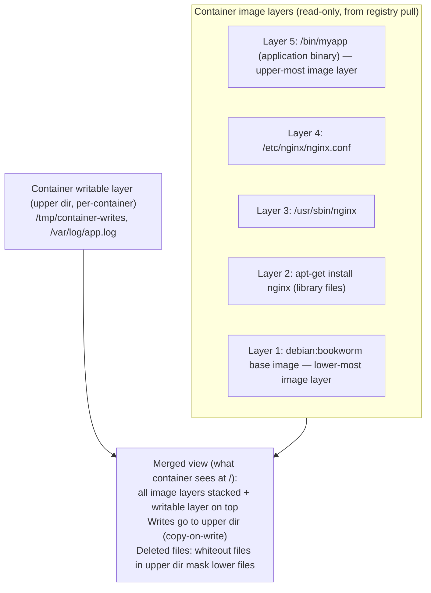
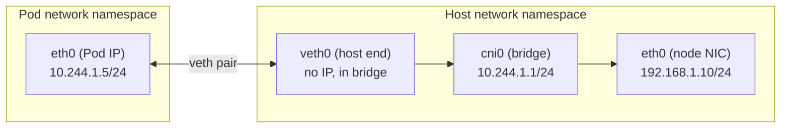
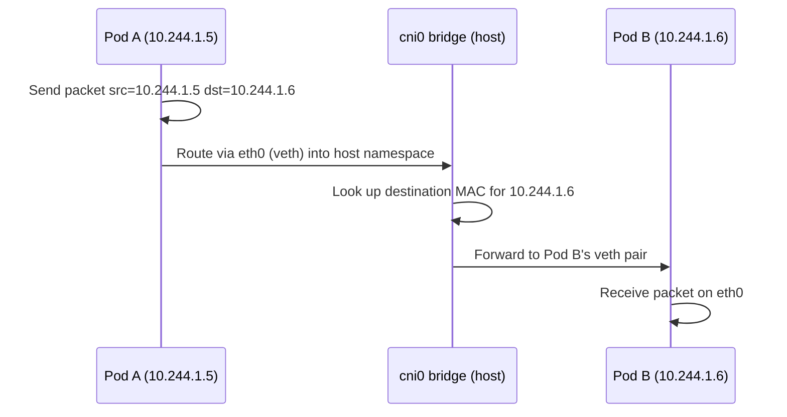
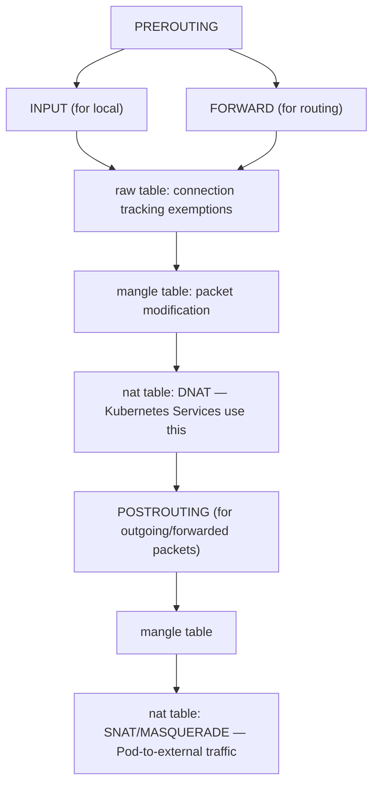
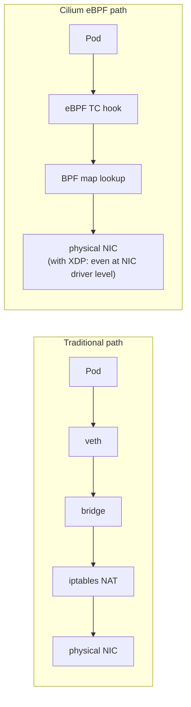

*Part 2 of 3 of [K8s Handbook Part 2: Linux Foundations](../35-k8s-handbook-part2-linux-foundations.md).*

## Chapter 5: OverlayFS and Union Filesystems

Container images are built from layers. When a container runs, these layers are stacked together using a union filesystem to present a single coherent filesystem to the container. OverlayFS is the default union filesystem implementation used by containerd and Docker on modern Linux systems.

### OverlayFS Architecture

OverlayFS presents a merged view of two or more directories (layers): lower dirs (read-only) + upper dir (read-write) + work dir.



```bash
# Inspect overlay mounts on a node:
mount | grep overlay
# Output: overlay on / type overlay (rw,lowerdir=L5:L4:L3:L2:L1,...)

# containerd stores layers at:
ls /var/lib/containerd/io.containerd.snapshotter.v1.overlayfs/snapshots/
```

### Copy-on-Write (CoW) Mechanics

When a container process modifies a file that exists in a read-only lower layer, OverlayFS performs a copy-up operation: the file is copied from the lower layer to the upper (writable) layer before the modification. The container sees the modified version; the original image layer is unchanged.

Copy-on-write implications for Kubernetes:

- **Image layer sharing**: Multiple Pods using the same base image share the read-only layers on disk. A node running 100 `nginx:alpine` Pods stores the nginx image only once, not 100 times.
- **Write performance**: The first write to any file in a lower layer triggers a copy-up. For large files (e.g., modifying a big config file), this can cause latency. Use volumes (`emptyDir`, PVC) for write-heavy paths.
- **Container image size vs. runtime size**: A container's writable layer grows as it writes files. This is not tracked in the image size, only in ephemeral storage (controlled by `resources.limits.ephemeral-storage`).
- **Pod ephemeral storage limit**: Kubernetes enforces ephemeral-storage limits on the writable layer + `emptyDir` volumes. Exceeding this evicts the Pod.

## Chapter 6: Linux Networking Stack

Kubernetes networking is built entirely on Linux networking primitives: virtual ethernet pairs (veth), network namespaces, bridges, routing tables, and packet filtering frameworks. Understanding these primitives explains how CNI plugins work, how Services are implemented, and why certain performance characteristics exist.

### Virtual Ethernet Pairs (veth)

A veth pair is a virtual network cable: two virtual network interfaces connected to each other. Packets entering one end emerge from the other. CNI plugins use veth pairs to connect Pod network namespaces to the host network:



```bash
# Create a veth pair (CNI does this automatically):
ip link add veth0 type veth peer name veth1
ip link set veth1 netns <pod-netns>
ip addr add 10.244.1.1/24 dev cni0
ip link set veth0 master cni0
```

**Linux network bridge:** A network bridge is a virtual Layer 2 switch. On a Kubernetes node with Flannel or simple CNI plugins, a bridge (`cni0` or `cbr0`) connects all Pod veth pairs. The bridge forwards packets between Pods on the same node (L2 forwarding) and routes packets to other nodes via the host routing table.

### Packet Flow: Pod-to-Pod Same Node

Pod A (10.244.1.5) → Pod B (10.244.1.6), same node:



No kernel routing lookup is required for same-node traffic with bridge CNI. Cilium's eBPF path bypasses the bridge entirely for even lower latency.

### Packet Flow: Pod-to-Pod Cross-Node

Pod A (node1: 10.244.1.5) → Pod B (node2: 10.244.2.7):

**Flannel (VXLAN overlay) path:**
1. Pod A sends: `src=10.244.1.5, dst=10.244.2.7`
2. Node1 routing: `10.244.2.0/24 → flannel.1` (VXLAN interface)
3. `flanneld` encapsulates: UDP VXLAN, outer `dst=node2-IP:8472`
4. Physical network delivers the UDP packet to node2
5. Node2's `flannel.1` decapsulates → `10.244.2.7` routed to Pod B's veth
6. Pod B receives the original packet

**Cilium (eBPF, direct routing) path:**
1. Pod A sends: `src=10.244.1.5, dst=10.244.2.7`
2. eBPF XDP hook at veth performs a direct lookup in a BPF map
3. BPF map shows `10.244.2.0/24 → node2-MAC` via the physical NIC
4. Packet is forwarded directly (no VXLAN overhead)
5. Node2's eBPF XDP delivers directly to Pod B
6. Latency is roughly 20–40% lower than the VXLAN path

## Chapter 7: iptables, nftables, and Kubernetes Network Rules

Kubernetes Services implement load balancing and service discovery using iptables (or IPVS) rules on every node. Understanding iptables is essential for troubleshooting Service connectivity, NetworkPolicy enforcement, and understanding why kube-proxy exists.

### iptables Architecture

iptables processes packets through a series of tables and chains. Each packet traverses the chains in sequence; rules are evaluated top-to-bottom until a matching rule's target is applied (ACCEPT, DROP, REDIRECT, DNAT, etc.):



Kubernetes `KUBE-*` chains, inserted by kube-proxy:

```
PREROUTING (nat) → KUBE-SERVICES
KUBE-SERVICES → KUBE-SVC-XXXXXXXXXXXXXXXX  (per Service)
KUBE-SVC-XXX  → KUBE-SEP-YYYYYYYYYYYYYYYY  (per Endpoint, with probability)
KUBE-SEP-YYY  → DNAT to Pod IP:Port
```

```bash
# View Service iptables rules:
iptables-save -t nat | grep KUBE-SVC
iptables -t nat -L KUBE-SERVICES -n --line-numbers | head -30
```

### How Kubernetes Service IP Works

A Kubernetes Service ClusterIP (e.g., `10.96.50.100`) is a virtual IP — it does not exist on any network interface anywhere in the cluster. It is purely an iptables DNAT rule that rewrites the destination IP from the ClusterIP to a Pod IP before the packet leaves the node's networking stack.

**Service ClusterIP → Pod IP translation** (random load balancing across 3 endpoints):

```
Pod sends: src=10.244.1.5, dst=10.96.50.100:80 (ClusterIP)

iptables DNAT (33% probability each):
  → 10.244.1.7:8080 (pod-1)
  → 10.244.2.3:8080 (pod-2)
  → 10.244.3.9:8080 (pod-3)

Packet after DNAT: src=10.244.1.5, dst=10.244.2.3:8080
Forwarded to node2 via CNI overlay/routing

Return packet: src=10.244.2.3:8080, dst=10.244.1.5
conntrack automatically SNATs back to 10.96.50.100:80
Pod sees: src=10.96.50.100:80, dst=10.244.1.5 (consistent with the request)
```

**iptables at scale — the kube-proxy problem.** iptables has a critical scalability limitation: rules are evaluated linearly. With 10,000 Services and 100,000 endpoints, a packet must traverse up to 200,000 iptables rules before finding a match. This causes O(n) latency that grows with cluster size. Two solutions:

- **IPVS mode**: kube-proxy in IPVS mode uses kernel virtual server (IPVS) hash tables for O(1) service lookup, scaling to hundreds of thousands of services with minimal latency.
- **Cilium eBPF**: Replaces kube-proxy entirely with eBPF maps that provide O(1) lookup without iptables traversal — the definitive solution for large clusters.

## Chapter 8: eBPF — The Kubernetes Networking Revolution

Extended Berkeley Packet Filter (eBPF) is a revolutionary Linux kernel technology that allows running sandboxed programs in the kernel without modifying kernel source code or loading kernel modules. eBPF is transforming Kubernetes networking, security, and observability in ways that were impossible with traditional kernel mechanisms.

### What eBPF Is and How It Works

eBPF programs are small, verified programs attached to kernel hook points. When a hook point fires (e.g., a packet arrives at a network interface, a system call is made, a kernel function is called), the eBPF program runs in a restricted virtual machine within the kernel context — with direct access to kernel data structures but without the risk of crashing the kernel.

**eBPF program lifecycle:**

1. Write the eBPF program in C (or Rust) — a restricted subset
2. Compile to eBPF bytecode: `clang -target bpf -O2 prog.c -o prog.o`
3. Load into the kernel via the `bpf()` syscall
4. Kernel verifier checks: no loops, bounded memory access, safe termination
5. JIT-compile to native CPU instructions (x86, ARM64)
6. Attach to a hook point: XDP, tc, kprobe, tracepoint, socket
7. Program runs at the hook point with ~nanosecond overhead
8. eBPF maps enable data sharing between kernel eBPF and userspace

eBPF hook points relevant to Kubernetes:

| Hook Point | What It Intercepts |
| --- | --- |
| XDP (eXpress Data Path) | Packet arrival at NIC, before kernel networking |
| TC (Traffic Control) | Packet after NIC driver, before routing |
| kprobe/kretprobe | Kernel function entry/exit (observability) |
| uprobe | Userspace function entry/exit |
| tracepoint | Kernel static instrumentation points |
| LSM (Linux Security Module) | Security policy enforcement hooks |

### eBPF in Kubernetes — Key Use Cases

| Domain | Tool | eBPF Usage | Benefit over Legacy |
| --- | --- | --- | --- |
| Networking | Cilium | Replace kube-proxy with eBPF maps for O(1) service routing | 10–40% latency reduction, massive scale |
| Networking | Cilium | NetworkPolicy enforcement in kernel without iptables | Lower latency, richer policy (L7) |
| Networking | Cilium | Transparent service mesh with eBPF sockops | No sidecar proxies, 30% less overhead |
| Security | Falco | Kernel syscall monitoring via eBPF (replaces kernel module) | Safer, portable, lower overhead |
| Security | Tetragon | Runtime security policy enforcement at kernel level | Blocks attacks before they land |
| Observability | Pixie | Auto-instrumentation via uprobes — no code changes needed | Zero-code tracing for Go, Java, Python |
| Observability | Cilium Hubble | Network flow visibility via eBPF | Full L3–L7 visibility, no sampling |
| Performance | BCC/bpftrace | Production profiling: CPU flamegraphs, latency heatmaps | Nanosecond precision, no overhead |

### Cilium — eBPF-Native Kubernetes Networking

Cilium is the most widely adopted eBPF-based CNI for Kubernetes. It replaces the traditional networking stack (iptables + veth + bridge) with eBPF programs that implement service routing, load balancing, and network policy entirely within the kernel data plane.



Traditional path: 5–8 kernel operations per packet. Cilium eBPF path: 1–2 operations per packet.

Service routing without kube-proxy:

| Service Type | Cilium Implementation |
| --- | --- |
| ClusterIP | BPF SNAT/DNAT maps (O(1) hash lookup) |
| NodePort | BPF handled at NIC level (XDP) |
| LoadBalancer | BPF DSR (Direct Server Return) — response bypasses LB |

```bash
# Enable Cilium with kube-proxy replacement:
helm install cilium cilium/cilium \
  --set kubeProxyReplacement=strict \
  --set k8sServiceHost=<API_SERVER_HOST> \
  --set k8sServicePort=6443
```

## Chapter 9: System Calls and Container Security

System calls are the interface between user-space processes and the Linux kernel. Every container operation — opening files, network sockets, creating processes, allocating memory — ultimately invokes a system call. Restricting the set of system calls available to a container is a critical security defence layer.

### seccomp — System Call Filtering

seccomp (Secure Computing mode) is a Linux kernel feature that restricts the system calls a process can make. Kubernetes supports seccomp profiles through the `securityContext.seccompProfile` field:

```yaml
# Apply the default container runtime seccomp profile:
securityContext:
  seccompProfile:
    type: RuntimeDefault  # Blocks ~50 dangerous syscalls

# Apply a custom seccomp profile (stored as ConfigMap or node file):
securityContext:
  seccompProfile:
    type: Localhost
    localhostProfile: profiles/nginx-seccomp.json
```

```json
{
  "defaultAction": "SCMP_ACT_ERRNO",
  "architectures": ["SCMP_ARCH_X86_64"],
  "syscalls": [{
    "names": ["read", "write", "open", "close", "stat", "fstat", "lstat", "poll", "mmap", "mprotect", "munmap"],
    "action": "SCMP_ACT_ALLOW"
  }]
}
```

### Linux Capabilities — Privilege Decomposition

Historically, Linux had two privilege levels: root (all privileges) and non-root (minimal privileges). Linux capabilities decompose root privileges into 40+ individual capabilities that can be granted or revoked independently. Kubernetes SecurityContext allows fine-grained capability management:

| Capability | What It Allows | Kubernetes Implication |
| --- | --- | --- |
| `CAP_NET_ADMIN` | Configure network interfaces, routes, iptables | Privileged networking; required for CNI plugins on nodes |
| `CAP_SYS_ADMIN` | Wide range of system admin operations | Nearly root — almost always indicates container escape risk |
| `CAP_NET_RAW` | Raw socket operations, packet sniffing | Required for ping; also enables ARP spoofing attacks |
| `CAP_SYS_PTRACE` | Trace and inspect other processes | Required for some debuggers; security risk |
| `CAP_CHOWN` | Change file ownership | Usually unnecessary for application containers |
| `CAP_SETUID` | Change user ID to any UID | Privilege escalation risk — drop unless required |
| `CAP_NET_BIND_SERVICE` | Bind to ports below 1024 | Better: run on a high port, use a Service for port mapping |

```yaml
# Security-hardened container spec:
securityContext:
  runAsNonRoot: true
  runAsUser: 1000
  runAsGroup: 1000
  readOnlyRootFilesystem: true
  allowPrivilegeEscalation: false
  capabilities:
    drop:
      - ALL              # Drop all capabilities
    add:
      - NET_BIND_SERVICE # Add only what's needed
  seccompProfile:
    type: RuntimeDefault
```

## Related

- [Part 1: Processes, Namespaces & cgroups](../35-k8s-handbook-part2-linux-foundations.md)
- [Part 3: Runtime Internals, Kubernetes-Linux Mapping & Troubleshooting](35-k8s-handbook-part2-linux-foundations-part3.md)
