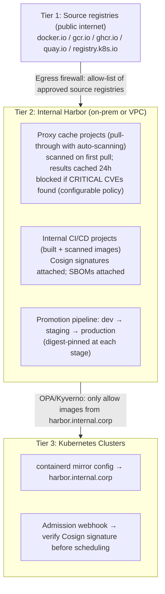

*Part 2 of 3 of [K8s Handbook Part 3: Containers](../36-k8s-handbook-part3-containers.md).*

## Chapter 5: Image Building: Multi-Stage, Distroless, Scratch

### Multi-Stage Builds — Production Pattern

Multi-stage builds are the single most important Dockerfile pattern for production images. They separate build environments (compilers, build tools, test frameworks) from runtime environments (minimal, hardened). The result: smaller attack surface, faster pulls, lower CVE count.

**Go application — scratch image:**

```dockerfile
# syntax=docker/dockerfile:1.6
FROM golang:1.22-alpine AS builder
WORKDIR /build
COPY go.mod go.sum ./
RUN --mount=type=cache,target=/root/go/pkg/mod go mod download
COPY . .
RUN --mount=type=cache,target=/root/go/pkg/mod \
    --mount=type=cache,target=/root/.cache/go-build \
    CGO_ENABLED=0 GOOS=linux GOARCH=amd64 go build \
    -trimpath -ldflags='-s -w' -o /app ./cmd/server

FROM scratch
COPY --from=builder /etc/ssl/certs/ca-certificates.crt /etc/ssl/certs/
COPY --from=builder /usr/share/zoneinfo /usr/share/zoneinfo
COPY --from=builder /app /app
USER 65534:65534   # nobody
ENTRYPOINT ["/app"]
# Result: ~8MB image, zero shell, zero OS tools, minimal CVE surface
```

**Java application — distroless with custom JRE:**

```dockerfile
# syntax=docker/dockerfile:1.6
FROM eclipse-temurin:21-jdk AS build
WORKDIR /app
COPY pom.xml .
RUN --mount=type=cache,target=/root/.m2 mvn dependency:resolve -q
COPY src ./src
RUN --mount=type=cache,target=/root/.m2 mvn package -DskipTests -q

# Build minimal JRE with only required modules
FROM eclipse-temurin:21-jdk AS jre-builder
COPY --from=build /app/target/app.jar /tmp/app.jar
RUN jdeps --ignore-missing-deps -q --recursive \
    --multi-release 21 --print-module-deps \
    /tmp/app.jar > /tmp/modules.txt
RUN jlink --add-modules $(cat /tmp/modules.txt) \
    --strip-debug --compress 2 \
    --no-header-files --no-man-pages \
    --output /custom-jre

FROM gcr.io/distroless/base-debian12:nonroot
COPY --from=jre-builder /custom-jre /opt/java
COPY --from=build /app/target/app.jar /app.jar
USER nonroot:nonroot
ENTRYPOINT ["/opt/java/bin/java", "-jar", "/app.jar"]
# Result: ~95MB vs ~800MB JDK image; no shell, no apt, no curl
```

### Distroless Images Reference

| Image | Contents | Approx Size | Use For |
| --- | --- | --- | --- |
| `gcr.io/distroless/static-debian12` | CA certs, timezone data only | 2 MB | Go (static), Rust |
| `gcr.io/distroless/base-debian12` | glibc, libssl, openssl, ca-certs | 20 MB | Go (CGO), C/C++ |
| `gcr.io/distroless/cc-debian12` | C++ runtime + base | 20 MB | C++ applications |
| `gcr.io/distroless/java21-debian12` | JRE 21 + base | 195 MB | Java 21 |
| `gcr.io/distroless/python3-debian12` | Python 3 + base | 55 MB | Python 3.x |
| `gcr.io/distroless/nodejs20-debian12` | Node.js 20 + base | 120 MB | Node.js 20 |
| `:nonroot` variants | Same + runs as UID 65532 by default | Same | Security-first |
| `:debug` variants | Same + busybox shell (DO NOT USE IN PROD) | Varies | Debugging only |

### Alternative Build Tools for Kubernetes

- **ko (Google)**: Builds Go binaries directly into OCI images without a Dockerfile. Zero-config, produces distroless images by default, integrates with Cosign for signing.
- **Jib (Google)**: Builds Java images without a Docker daemon. Produces layered images separating dependencies, resources, and classes for optimal caching. Maven/Gradle plugins.
- **Cloud Native Buildpacks**: Detects language, applies runtime best practices, patches OS-level CVEs without Dockerfile changes. Heroku buildpacks, Paketo, Google Buildpacks.
- **Bazel**: Hermetic, reproducible builds at Google scale. Produces identical binary artifacts regardless of build environment — essential for SLSA L3+ supply chain.
- **Nix / nixpkgs**: Purely functional, reproducible package management. Enables 100% reproducible container images with cryptographic build provenance.

## Chapter 6: Container Registry Architecture

### Enterprise Registry Architecture

A container registry stores and serves OCI images and artifacts (Helm charts, SBOMs, signature attestations). Enterprise architectures require careful registry design for security, performance, compliance, and business continuity.

| Registry | Type | Key Enterprise Features | Best For |
| --- | --- | --- | --- |
| Harbor | Self-hosted OSS (CNCF) | Trivy scanning, RBAC, proxy cache, replication, webhooks, OIDC | On-prem / air-gap / full control |
| AWS ECR | Managed cloud | IAM auth, lifecycle policies, cross-region, VPC endpoints, Inspector scanning | AWS-native K8s |
| GCP Artifact Registry | Managed cloud | Workload Identity, VPC-SC, CMEK, multi-format (Docker/Helm/npm/Maven) | GKE workloads |
| Azure Container Registry | Managed cloud | Geo-replication, Private Link, Tasks CI, Defender scanning, RBAC | AKS workloads |
| Quay.io / Project Quay | Cloud + self-hosted | Clair scanning, robot accounts, org teams, build triggers, mirrors | OpenShift / hybrid |
| GitHub Container Registry | Cloud (ghcr.io) | GitHub Actions OIDC, fine-grained PAT, public+private, packages | OSS / GitHub-native |
| Zot | Self-hosted OSS | OCI-native only, ultra-lightweight, S3 backend, pluggable | Edge / air-gap / minimal |

### Enterprise Registry Reference Architecture

Recommended multi-tier architecture for regulated enterprises:



**Image lifecycle policies.** Unmanaged registries accumulate stale images rapidly — implement retention policies:

- **Tag retention**: keep last N tags per repository (e.g., last 10 production tags, last 3 per branch in dev)
- **Untagged image cleanup**: delete untagged images after 7 days — they are build intermediates with no legitimate use
- **Age-based deletion**: delete images older than 90 days in dev/staging repositories automatically
- **Usage-based retention**: Harbor and ECR can track which images were actually pulled; retain pulled images longer than unpulled ones
- **Immutable production tags**: configure registries to reject tag overwrites for production tags (`v1.2.3` must always point to the same digest)

## Chapter 7: Image Optimisation Strategies

### Layer Cache Optimisation

Dockerfile layer ordering is one of the highest-impact optimisation decisions. Layers that change frequently must be placed after layers that change rarely to maximise cache hit rates in CI systems.

```dockerfile
# ANTI-PATTERN (cache invalidated on every commit):
COPY . .                              # changes every commit
RUN pip install -r requirements.txt   # rebuilds every commit!

# OPTIMAL (dependencies cached separately):
COPY requirements.txt .               # changes only with dep updates
RUN pip install -r requirements.txt   # cached until deps change
COPY . .                              # only this layer rebuilds per commit
```

Layer ordering by change frequency (least → most frequent):

```dockerfile
FROM base                # changes: major upgrades (quarterly)
RUN install-os-packages  # changes: security patches (monthly)
COPY dep-manifests .      # changes: dep updates (weekly)
RUN install-deps          # changes: dep updates (weekly)
COPY source-code .         # changes: every commit
RUN build-app              # changes: every commit
```

### Image Size Reduction Techniques

| Technique | Impact | Implementation |
| --- | --- | --- |
| Multi-stage builds | 60–95% size reduction | Separate build/runtime stages; copy only artifacts |
| Distroless base images | 50–80% vs. full OS | Use `gcr.io/distroless/*` instead of ubuntu/debian |
| Scratch base | Maximum reduction | `CGO_ENABLED=0` Go binary + minimal files only |
| Combine RUN commands | Avoid intermediate layers | `RUN apt update && apt install -y X && rm -rf /var/lib/apt/lists/*` |
| Strip debug symbols | 20–50% binary size | Go: `-ldflags='-s -w'`; C/C++: `strip` binary |
| `--no-install-recommends` | 10–30% package size | `apt-get install --no-install-recommends` |
| `.dockerignore` | Faster builds | Exclude `.git`, tests, docs, `node_modules` from context |
| dive inspection | Find hidden large layers | `dive myimage:tag` shows layer contents and waste |

### Kubernetes-Specific Image Considerations

- **Startup speed**: Kubernetes probes (`startupProbe`, `readinessProbe`) fire before the application is ready. Smaller images pull faster on cold starts (new node scale-out), reducing time to ready. Use image pull policies correctly: `IfNotPresent` for production (avoids re-pull on restart), `Always` for latest.
- **Multi-arch images**: build for both `linux/amd64` and `linux/arm64` to support mixed node pools. AWS Graviton, Azure Ampere, and GKE Tau nodes use arm64 and cost 20–40% less than x86 equivalents.
- **Non-root requirement**: Pod Security Standards Restricted profile requires `runAsNonRoot: true`. Build images with a non-root user (`USER 1000:1000`) and ensure the application can bind to ports above 1024.
- **Read-only filesystem**: enable `readOnlyRootFilesystem: true` and use `emptyDir` or PVCs for write paths. Image layers are read-only by design; the writable layer is an ephemeral overlay.
- **Ephemeral storage limits**: container writable layer + `emptyDir` counts against the ephemeral storage limit. Avoid writing large files to the container filesystem; use PVCs for persistent data.

## Chapter 8: Secure Software Supply Chain

### The Supply Chain Threat Model

SolarWinds (2020), Codecov (2021), XZ Utils (2024), and repeated npm/PyPI package compromises demonstrated that the software supply chain is now the primary enterprise attack vector. Container images are especially vulnerable because they bundle hundreds of dependencies — any one of which could be compromised without obvious indication.

| Attack Vector | Example | Container Impact | Defence |
| --- | --- | --- | --- |
| Compromised base image | Malicious `nginx:alpine` pushed to Docker Hub | All images `FROM` that base inherit malware | Pin by digest; use internal mirrors only |
| Dependency confusion | Attacker publishes malicious `mycompany-utils` on PyPI | Build installs attacker package over internal one | Private registries; exact version pins; hash verification |
| Build system compromise | CI runner compromised; backdoor injected during build | Malicious binary in legitimate-looking image | Ephemeral builders; signed provenance; SLSA L3 |
| Registry hijack | Leaked registry credentials; attacker overwrites production tag | Pods run attacker image on next restart | Immutable tags; Cosign signatures; RBAC on registry |
| Typosquatting | `nginx` (no namespace) vs. `library/nginx` on Docker Hub | Developer accidentally pulls compromised image | Internal mirror as only allowed source; OPA policy |
| Transit attack | MITM on HTTP registry pull | Different image delivered than expected | TLS everywhere; pull by digest; signature verification |

### Supply Chain Security — Defence in Depth

| Layer | Controls | Primary Tools |
| --- | --- | --- |
| Source | Signed commits, branch protection, 2-person review | Git GPG signing, GitHub/GitLab branch rules |
| Dependencies | Lock files, hash pinning, private mirrors, scanning | pip-tools, poetry.lock, npm shrinkwrap, Renovate |
| Build | Ephemeral runners, hermetic builds, signed provenance | SLSA builder, Tekton Chains, BuildKit |
| Image | Vuln scan, Cosign sign, SBOM generate, tag immutability | Trivy, Grype, Cosign, Syft, Harbor |
| Registry | RBAC, audit log, replication, proxy cache with scanning | Harbor, ECR, GAR with scanning policies |
| Deployment | Signature verification, policy-as-code, digest pinning | Kyverno, OPA Gatekeeper, Sigstore |
| Runtime | Syscall filter, behaviour monitoring, anomaly detection | Falco, Tetragon, seccomp, AppArmor |

## Chapter 9: Image Signing: Cosign and Notary v2

### Sigstore — The Signing Ecosystem

Sigstore is an OpenSSF project providing free, open infrastructure for signing software artifacts. It consists of three services that together enable keyless, identity-based signing tied to OIDC identity providers (GitHub, Google, Microsoft):

- **Cosign**: CLI and Go library for signing and verifying OCI images and artifacts. Signs image manifests; stores signatures as OCI referrers (co-located in the registry).
- **Fulcio**: Certificate Authority that issues short-lived code signing certificates tied to OIDC identities. A GitHub Actions job gets a cert for its GitHub Actions identity — no long-lived key management required.
- **Rekor**: Append-only, tamper-evident transparency log. Every signing event is recorded, enabling anyone to audit who signed what and when — analogous to Certificate Transparency for TLS certificates.

**Keyless signing workflow in CI/CD (GitHub Actions):**

1. A GitHub Actions job starts; GitHub provides an OIDC token (identity: `https://github.com/myorg/myrepo/.github/workflows/build.yml`)
2. `cosign sign` command:
   - Generates an ephemeral key pair (in memory; never persisted)
   - Requests a certificate from Fulcio CA
   - Fulcio verifies the OIDC token; issues a cert binding the identity to the ephemeral pubkey
   - cosign signs the image manifest digest with the ephemeral private key
   - Uploads (signature + Fulcio cert) to the registry as an OCI artifact
   - Records an entry in the Rekor transparency log
   - The ephemeral private key is discarded
3. Verification at admission time (Kyverno/policy controller):
   - Fetch the image manifest digest
   - Retrieve the signature from the registry (OCI referrer)
   - Verify the signature against the Fulcio cert
   - Check the cert identity matches the expected GitHub org/repo
   - Verify the Rekor log entry exists (non-repudiable audit trail)
   - Accept or reject the Pod based on the verification result

**Cosign integration — GitHub Actions:**

```yaml
# .github/workflows/release.yml
name: Build and Sign
on: [push]
jobs:
  build-sign:
    runs-on: ubuntu-latest
    permissions:
      contents: read
      id-token: write   # Required for OIDC/keyless signing
      packages: write
    steps:
      - uses: sigstore/cosign-installer@v3
      - name: Build and push image
        id: build
        uses: docker/build-push-action@v5
        with:
          push: true
          tags: ghcr.io/myorg/myapp:latest
      # Always capture digest for signing by digest (not tag)
      - name: Sign image by digest
        run: |
          cosign sign --yes \
            ghcr.io/myorg/myapp@${{ steps.build.outputs.digest }}
```

**Enforcing signatures with Kyverno:**

```yaml
apiVersion: kyverno.io/v1
kind: ClusterPolicy
metadata:
  name: require-signed-images
spec:
  validationFailureAction: Enforce
  background: false
  rules:
    - name: verify-cosign-signature
      match:
        any:
          - resources:
              kinds: [Pod]
              namespaces: [production, staging]
      verifyImages:
        - imageReferences:
            - ghcr.io/myorg/*
            - harbor.internal.corp/*
          attestors:
            - entries:
                - keyless:
                    subject: https://github.com/myorg/*
                    issuer: https://token.actions.githubusercontent.com
                    rekor:
                      url: https://rekor.sigstore.dev
          # Also pin to digest automatically:
          mutateDigest: true
          verifyDigest: true
```

## Related

- [Part 1: Container Stack, Docker Architecture & OCI Runtimes](../36-k8s-handbook-part3-containers.md)
- [Part 3: SBOM, SLSA, Vulnerability Scanning & Runtime Security](36-k8s-handbook-part3-containers-part3.md)
