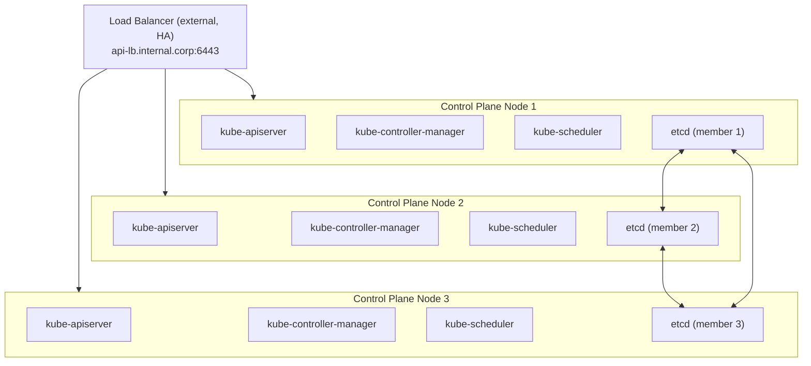

*Part 4 of 4 of [K8s Handbook Part 4: Kubernetes Internals](../37-k8s-handbook-part4-kubernetes-internals.md).*

## Chapter 13: Leader Election and High Availability

Kubernetes control plane components use leader election to ensure that only one instance of each controller is active at any time, preventing conflicting reconciliations. This enables running multiple replicas of the controller manager and scheduler for availability without causing split-brain.

### Leader Election Mechanism

Kubernetes leader election uses the API server as a coordination primitive:

1. Each replica tries to create/update a `Lease` object in `kube-system` (e.g., `kube-controller-manager` or `kube-scheduler`), with fields `holderIdentity`, `leaseDurationSeconds: 15`, `renewTime`.
2. The replica that successfully holds the Lease is the leader.
3. The leader renews the Lease every `leaseDuration/2` (~7.5s).
4. Non-leaders watch the Lease object: if it's not renewed within `leaseDurationSeconds`, a non-leader acquires the Lease and becomes leader.
5. The old leader loses leadership and stops acting.

```bash
# View the current controller manager leader:
kubectl get lease kube-controller-manager -n kube-system -o yaml

# Leader election parameters:
--leader-elect=true
--leader-elect-lease-duration=15s
--leader-elect-renew-deadline=10s
--leader-elect-retry-period=2s
```

### Kubernetes HA Reference Architecture



Notes:
- 3 API servers: all active, behind the LB (any can serve any request)
- 3 Controller Managers: only the LEADER is active; others standby
- 3 Schedulers: only the LEADER is active; others standby
- 3 etcd nodes: Raft quorum = 2; tolerates 1 node failure
- etcd MUST be co-located or within 2ms RTT of the API server
- For a 5-node etcd cluster: tolerates 2 failures; recommended for critical production

## Chapter 14: API Request Lifecycle

Tracing an API request from `kubectl` to a running container reveals every component interaction. This complete lifecycle is essential knowledge for troubleshooting and understanding performance characteristics.

### Complete Lifecycle: `kubectl apply` → Pod Running

`kubectl apply -f deployment.yaml`

**Phase 1: Client-side (kubectl)**
1. kubectl reads `deployment.yaml`
2. kubectl discovers the server API (`GET /api`, `/apis` → API groups)
3. kubectl performs a server-side apply: `PATCH /apis/apps/v1/namespaces/default/deployments/myapp` with `Content-Type: application/apply-patch+yaml`
4. kubectl loads kubeconfig → extracts credentials

**Phase 2: API server**
5. TLS handshake (mutual TLS or bearer token)
6. Authentication: verify client certificate / OIDC token
7. Authorisation: RBAC check for PATCH deployments in `default`
8. Admission webhooks (mutating): inject sidecar, set defaults
9. Schema validation: verify the Deployment spec is valid
10. Admission webhooks (validating): OPA/Kyverno policy check
11. Write the Deployment to etcd
12. Return `200 OK` to kubectl

**Phase 3: Controller manager**
13. Deployment controller watch fires (`ADDED`/`MODIFIED` event)
14. Deployment controller reconciles: desired = `replicas=3, image=myapp:v2`; actual = RS-v1 exists (`replicas=3, image=myapp:v1`); action = create RS-v2 (`replicas=0`)
15. ReplicaSet controller watches RS-v2: desired = 1 Pod (`maxSurge=1`); actual = 0 Pods; action = create Pod (`spec.nodeName` empty)

**Phase 4: Scheduler**
16. Scheduler watch fires: new unscheduled Pod
17. Filter: find feasible nodes
18. Score: rank feasible nodes
19. Bind: `PATCH Pod.spec.nodeName = worker-node-2`

**Phase 5: kubelet**
20. kubelet on `worker-node-2` watch fires: new Pod bound to its node
21. kubelet calls CRI: `RunPodSandbox` (create pause container + network namespace)
22. CNI plugin called: configure veth pair, assign Pod IP
23. kubelet calls CRI: `PullImage` (if not cached)
24. kubelet calls CRI: `CreateContainer`
25. kubelet calls CRI: `StartContainer`
26. Init containers run in order (if any)
27. App containers start
28. kubelet starts probes (startup → readiness → liveness)

**Phase 6: Endpoints**
29. EndpointSlice controller: Pod becomes Ready; adds the Pod IP to the EndpointSlice for matching Services
30. kube-proxy: watches the EndpointSlice update; updates iptables/IPVS rules to include the new Pod IP
31. Pod now receives traffic via the Service

Total time: typically 5–30 seconds from `kubectl apply` to a traffic-receiving Pod.

## Chapter 15: Troubleshooting the Control Plane

**Pod stuck in Pending.** Diagnosis: `kubectl describe pod` — look at the Events section. Common causes: insufficient resources (`0/3 nodes available; Insufficient cpu`), no matching nodes (node affinity/taint mismatch), volume binding (unbound PVC; no matching StorageClass), image pull failure (check `imagePullSecrets`, registry connectivity).

```bash
kubectl describe pod <pod>
kubectl get events --sort-by=.lastTimestamp
kubectl describe node <node>   # check Conditions, Capacity
```

**Pod stuck in CrashLoopBackOff.** Diagnosis: the container starts then crashes repeatedly; Kubernetes uses exponential backoff.

```bash
kubectl logs <pod> --previous   # logs from the last crash
kubectl describe pod <pod>      # exit code, OOM kill
# Exit code 137 = OOM killed (increase memory limit)
# Exit code 1   = application error (check app logs)
# Exit code 126/127 = entrypoint not found/executable
```

**Service not routing traffic.** Diagnosis: Pod is Running but the Service is not reachable.

```bash
kubectl get endpoints <service>              # check Pods are in endpoints
kubectl describe service <service>           # check selector matches Pod labels
kubectl exec -it <pod> -- curl <clusterip>
iptables-save | grep KUBE-SVC                # verify iptables rules present
kubectl get pods -l app=<label>              # verify selector
```

**API server unreachable.** Diagnosis: kubectl commands fail with connection refused or timeout.

```bash
# Check load balancer health
systemctl status kube-apiserver   # or: crictl ps | grep apiserver
journalctl -u kube-apiserver -n 100
etcdctl endpoint health
# Check certificates:
kubeadm certs check-expiration
```

**etcd alarm: database space exceeded.** Diagnosis: all writes to the cluster fail; etcd quota exceeded (default 8GB).

```bash
etcdctl alarm list
etcdctl compact $(etcdctl endpoint status -w json | jq '.[0].raftIndex')
etcdctl defrag
etcdctl alarm disarm
# Long-term: audit large objects (Events, large Secrets)
```

## Chapter 16: Hands-On Exercises

### Exercise 4.1 — Watch the Reconciliation Loop

Observe the Deployment controller's reconciliation loop in real time:

```bash
# Terminal 1: Watch ReplicaSets and Pods
kubectl get rs,pods -w

# Terminal 2: Create and update a Deployment
kubectl create deployment demo --image=nginx:1.24 --replicas=3
# Watch Terminal 1: RS created, 3 Pods created

# Now update the image:
kubectl set image deployment/demo nginx=nginx:1.25
# Watch Terminal 1: new RS created, Pods scaled up/down alternately

# Observe rollout:
kubectl rollout status deployment/demo

# Check rollout history (ReplicaSets retained):
kubectl get rs
kubectl rollout history deployment/demo

# Roll back:
kubectl rollout undo deployment/demo
# Old RS scales back up, new RS scales down
```

### Exercise 4.2 — Observe the Scheduling Decision

Create a Pod and observe the complete scheduling process:

```bash
# Watch scheduler events:
kubectl get events --field-selector reason=Scheduled -w &

# Create an unschedulable Pod (request too much memory):
kubectl run unmeet --image=nginx \
  --overrides='{"spec":{"containers":[{"name":"nginx","image":"nginx","resources":{"requests":{"memory":"9999Gi"}}}]}}'

# Observe: FailedScheduling event
kubectl describe pod unmeet | grep -A5 Events

# Clean up and create a schedulable Pod:
kubectl delete pod unmeet
kubectl run meeting --image=nginx --requests='cpu=100m,memory=128Mi'

# Observe: Scheduled event with node name
kubectl get pod meeting -o jsonpath='{.spec.nodeName}'
```

### Exercise 4.3 — Inspect etcd State

Read raw Kubernetes state from etcd (read-only, safe to explore):

```bash
# Connect to a control plane node and inspect etcd
# (assumes a kubeadm-bootstrapped cluster)
ETCDCTL_API=3
ETCD_ARGS="--endpoints=https://127.0.0.1:2379 \
  --cacert=/etc/kubernetes/pki/etcd/ca.crt \
  --cert=/etc/kubernetes/pki/etcd/peer.crt \
  --key=/etc/kubernetes/pki/etcd/peer.key"

# List all Kubernetes keys:
etcdctl $ETCD_ARGS get / --prefix --keys-only | grep '/registry/' | head -30

# Count objects by type:
etcdctl $ETCD_ARGS get /registry/pods --prefix --keys-only | wc -l

# Check etcd health and database size:
etcdctl $ETCD_ARGS endpoint status -w table

# Watch etcd for changes (observe Kubernetes in real time):
etcdctl $ETCD_ARGS watch /registry/pods --prefix
```

## Related

- [Part 1: Architecture Overview, API Server, etcd & Scheduler](../37-k8s-handbook-part4-kubernetes-internals.md)
- [Part 2: Controller Manager, Cloud Controller Manager & kubelet](37-k8s-handbook-part4-kubernetes-internals-part2.md)
- [Part 3: kube-proxy, CoreDNS, Admission Controllers, CRDs & Operators](37-k8s-handbook-part4-kubernetes-internals-part3.md)
