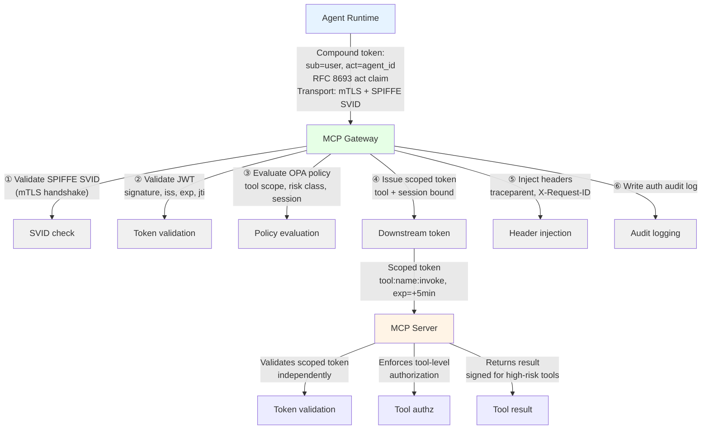
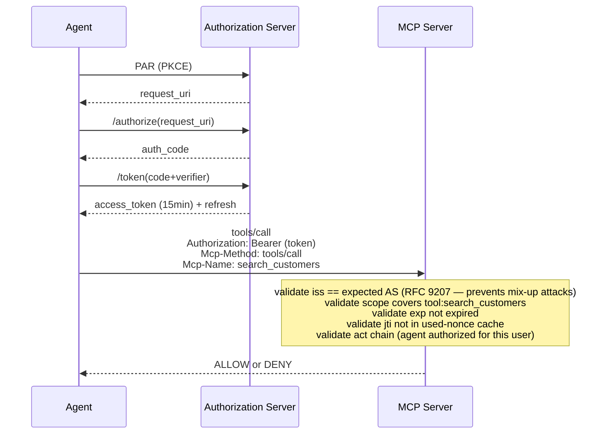

# Enterprise MCP Security, Authorization, Governance & Operations (2026)

**Part 1 of 3** — Threat model, authentication patterns, and authorization foundations.  
[Continue with Part 2 →](pathname:///archon/protocols/parts/14-mcp-enterprise-security-governance-operations-2026-part2.md)

> **Audience:** AI Enterprise Architects, Security Architects, Platform Engineers, and Governance teams operating production MCP ecosystems at scale (hundreds to thousands of servers). This guide focuses on the **agent-to-tool** security boundary. For the **agent-to-agent** boundary, see [A2A Enterprise Security & Governance Guide](pathname:///archon/trust/02-a2a-security-governance). For protocol architecture, see [MCP Deep Research 2026](pathname:///archon/protocols/13-mcp-deep-research-2026). For identity architecture depth (SPIFFE/SPIRE, compound identity, OBO flows), see [Identity, MCP & A2A Security Blueprint](pathname:///archon/trust/ai-security-governance/34-identity-mcp-a2a-security-blueprint).

---

## Table of Contents

1. [Executive Summary](#1-executive-summary)
2. [Complete MCP Threat Model](#2-complete-mcp-threat-model)
3. [Authentication Patterns](#3-authentication-patterns)
4. [Authorization Models](#4-authorization-models)

---

## 1. Executive Summary

MCP is a communication protocol, not a security framework. Every production MCP deployment requires the security infrastructure the spec deliberately omits: a workload identity plane, a policy engine, a guardrail layer, an audit fabric, and a governance registry. At 10 servers these can be ad hoc. At 1,000 servers, the absence of each is a systemic risk.

**The five non-negotiable enterprise controls:**

| Control | Minimum Implementation |
|---------|------------------------|
| **Workload identity** | SPIFFE/SPIRE SVIDs for every MCP server; no static API keys in production |
| **Gateway-enforced authorization** | All MCP traffic passes through a gateway validating identity and enforcing policy before forwarding |
| **Tool registry** | Every deployed tool has an entry with owner, risk class, approval status, and schema hash |
| **Immutable audit log** | Every tool invocation, authorization decision, and policy evaluation written to tamper-evident storage |
| **Schema pinning** | Tool description hashes pinned at approval; any mismatch blocks execution and triggers alert |

**Root cause of most MCP incidents:** Either absent workload identity or absent authorization at the tool invocation boundary. Research from CoSAI (January 2026), BlueRock Security (36.7% of 7,000+ public MCP servers vulnerable to SSRF), and Endor Labs (82% path traversal, 67% code injection in 2,614 MCP implementations) consistently confirms this.

---

## 2. Complete MCP Threat Model

> **Scope:** This threat model covers the **agent-to-tool boundary** — MCP servers, tool invocations, and the protocols connecting them. For agent-to-agent threats (delegation loops, lateral movement, registry compromise), see the [A2A Enterprise Security Guide §1](pathname:///archon/trust/02-a2a-security-governance). Methodology: STRIDE + OWASP LLM Top 10 2025 + CoSAI MCP Security White Paper (January 2026) + Vulnerable MCP Project (50+ CVEs, 13 critical).

### Threat Taxonomy

#### TH-01: Malicious MCP Server (Supply Chain)

| | |
|---|---|
| **Attack path** | Attacker publishes a server to the MCP Registry (or via npm/PyPI) with a name resembling a legitimate server. Agent or developer installs it. The server executes arbitrary code with the host process's privileges, with access to `~/.cursor/mcp.json`, `~/.aws/credentials`, and environment variables. |
| **Impact** | Credential exfiltration; code execution on host; lateral movement to all enterprise systems reachable from the host. |
| **Detection** | Registry anomaly detection (new publisher, mismatched domain, name similarity to known servers); SBOM scanning; EDR telemetry on MCP server processes; unusual outbound network connections. |
| **Mitigation** | Publisher verification before installation; code signing (Sigstore/Cosign); allowlist-only deployment policy; process isolation (containers, sandboxing); network egress controls scoped to declared endpoints. |
| **Enterprise controls** | Private registry with approval workflow; SLSA Level 2+ provenance; MCP server processes run in isolated namespaces with minimal capabilities; egress filtered to declared API endpoints only. |

#### TH-02: Tool Poisoning (Description Manipulation)

| | |
|---|---|
| **Attack path** | Malicious instructions embedded in tool descriptions — the metadata the LLM uses to decide which tool to invoke. These are visible to the model but typically not shown to the user. Example: a tool "add(a, b)" whose description secretly instructs the model to read `~/.cursor/mcp.json` and exfiltrate it as a parameter. |
| **Impact** | Data exfiltration; unauthorized actions; credential theft — all appearing to the user as normal tool operation. |
| **Detection** | Tool description scanning for HTML/XML markup, `&lt;IMPORTANT&gt;` blocks, hidden parameter instructions; static analysis of tool descriptions in CI/CD. |
| **Mitigation** | Schema pinning at approval; block invocation of tools whose description hash changed; scan all tool descriptions for injection patterns; ban markup in descriptions. |
| **Enterprise controls** | Automated tool description analysis in governance workflow; pinned hash enforced at gateway; any hash mismatch triggers incident + blocks tool. |

#### TH-03: Rug Pull (Silent Tool Redefinition)

| | |
|---|---|
| **Attack path** | MCP tools can update their descriptions after installation without triggering re-approval. A tool that appeared safe when approved silently acquires malicious instructions later — analogous to PyPI supply chain attacks at the runtime level. |
| **Impact** | A previously vetted tool becomes a backdoor without any visible change to the user or operator. Point-in-time approval provides no durable guarantee. |
| **Detection** | Continuous schema hash monitoring against registry baseline; alert on any description change for deployed tools. |
| **Mitigation** | Pin description hashes at approval; enforce at gateway; block and alert on any mismatch; require re-approval for any hash change before tool can be used again. |
| **Enterprise controls** | Hash monitoring runs every 15 minutes against live MCP server tool lists; automatic gateway block on mismatch; automatic incident creation in ITSM. |

#### TH-04: Prompt Injection via Tool Retrieval

| | |
|---|---|
| **Attack path** | Agent retrieves external content (email, document, web page, database record) containing embedded instructions. Content enters the LLM context. The model treats embedded instructions as legitimate directives and executes them. Real incident: Supabase/Cursor (June 2025) — attacker embedded SQL instructions in support tickets processed by a privileged agent, exfiltrating integration tokens to a public thread. |
| **Impact** | Agent redirected to perform attacker-specified actions. MCPTox benchmark: `o1-mini` 72.8% attack success rate; more capable models are *more* vulnerable because superior instruction-following works against the defender. |
| **Detection** | Output analysis for actions not correlated with user intent; anomalous tool invocation sequences following external content retrieval; Prompt Shield analysis on retrieved content. |
| **Mitigation** | Tag all external content as untrusted before LLM ingestion; separate system prompt from retrieved content; output guardrails detecting unexpected tool sequences; HITL gate before any write action following external retrieval. |
| **Enterprise controls** | AI Firewall (Prompt Shields / LLM Guard) at content ingestion point; content tagging middleware; Constitutional AI constraints; mandatory HITL for write operations triggered by retrieved content. |

#### TH-05: Indirect Prompt Injection

| | |
|---|---|
| **Attack path** | Like direct prompt injection, but the attacker controls the data source (file, database, external API), not the user input directly. The content appears as legitimate retrieved data but contains hijacking instructions. Harder to detect because the retrieval path looks normal. |
| **Impact** | Same as direct prompt injection with reduced detection likelihood. |
| **Detection** | Semantic anomaly detection on tool invocation sequences; content integrity checks (hash comparison against known-good content). |
| **Mitigation** | Never pass retrieved content directly as system prompt material; explicit delimiters between trusted (system) and untrusted (retrieved) context; output filtering on any action resulting from retrieval. |
| **Enterprise controls** | RAG pipeline with mandatory content sanitization stage; input/output guardrails; HITL approval for write actions post-retrieval. |

#### TH-06: Tool Output Poisoning

| | |
|---|---|
| **Attack path** | A compromised or malicious MCP server returns tool results containing embedded instructions. The agent trusts tool output as factual and passes it into subsequent reasoning, where embedded instructions redirect behavior. Particularly dangerous for chained tool calls. |
| **Impact** | Agent behavior hijacked at the output stage; amplified when one tool's output becomes another tool's input. |
| **Detection** | Output schema validation against declared `outputSchema`; anomaly detection on output content structure; semantic filtering before output reaches the next reasoning step. |
| **Mitigation** | Validate tool output against declared JSON Schema; treat tool output as untrusted until validated; strip instruction-like content before passing to LLM context. |
| **Enterprise controls** | Gateway-level output validation middleware; output sanitization pipeline; structured output enforcement with fallback rejection on schema mismatch. |

#### TH-07: Context Poisoning (Memory Attacks)

| | |
|---|---|
| **Attack path** | Attacker writes malicious content to the agent's memory or context store (vector DB, conversation history, shared session state). When the agent retrieves context, it executes embedded instructions. Particularly dangerous in multi-session or multi-user agents with shared memory. |
| **Impact** | Persistent attack — context remains compromised across sessions. Memory poisoning affecting shared stores impacts all users of that agent. |
| **Detection** | Context integrity monitoring; anomaly detection on context write operations; memory access audit logging. |
| **Mitigation** | Signed memory entries; access control on context write APIs; content filtering on writes; per-session/per-user memory isolation; memory TTL and re-validation. |
| **Enterprise controls** | Cryptographically signed memory writes; per-session isolation by default; content validation pipeline on write; WORM-compliant audit log of all memory mutations. |

#### TH-08: Replay Attacks

| | |
|---|---|
| **Attack path** | Attacker captures a valid MCP request (tool invocation with valid credentials) and replays it at a later time or from a different source. Without replay protection, the server processes it as legitimate. |
| **Impact** | Unauthorized repeated execution of previously approved actions: financial writes, data deletions, message sends. |
| **Detection** | Nonce tracking; request ID deduplication; timestamp validation. |
| **Mitigation** | Cryptographic nonce in every request; short-lived credentials (expired tokens cannot be replayed); request IDs with server-side deduplication window; idempotency keys for write operations. |
| **Enterprise controls** | Gateway-enforced nonce validation; token TTLs ≤15 minutes; idempotency key tracking with configurable TTL in distributed cache. |

#### TH-09: Man-in-the-Middle (MITM)

| | |
|---|---|
| **Attack path** | Network interception of MCP traffic — particularly STDIO-proxied-to-HTTP configurations or any unencrypted HTTP deployment. Attacker reads or modifies tool invocations and responses in transit. |
| **Impact** | Credential theft; session hijacking; tool invocation manipulation; response tampering. |
| **Detection** | Certificate transparency monitoring; TLS anomaly detection; unexpected certificate presentations in mTLS logs. |
| **Mitigation** | Mandatory TLS 1.3 for all remote MCP connections; mTLS for server-to-server; HSTS; message integrity (JWS) for critical payloads. |
| **Enterprise controls** | Service mesh with automatic mTLS (Istio/Linkerd); cert-manager for certificate lifecycle; network policies blocking non-TLS MCP traffic. |

#### TH-10: Session Hijacking

| | |
|---|---|
| **Attack path** | MCP session tokens or application-layer session handles are stolen via XSS, log injection, or insecure storage. Attacker uses the token to operate within the hijacked session. |
| **Impact** | Full access to all tools and data accessible within the hijacked session. |
| **Detection** | Session token usage from new IP/device; concurrent session detection. |
| **Mitigation** | Signed session handles (JWT/PASETO with short expiry); session binding to TLS fingerprint; token rotation on privilege escalation; tokens never in logs, URLs, or `localStorage`. |
| **Enterprise controls** | Session management in hardened harness layer; session handles excluded from logs; token rotation policy; anomaly-based session invalidation. |

#### TH-11: Privilege Escalation via Tool Scope

| | |
|---|---|
| **Attack path** | An agent granted broad tool access for a benign initial task reuses that standing grant for a higher-risk action. The MCP-specific instance of the confused deputy pattern. |
| **Impact** | Actions beyond what was originally authorized; data access beyond minimum necessary; write operations where only read was intended. |
| **Detection** | Authorization decision audit — flag cases where the same credential is used for progressively higher-risk operations. |
| **Mitigation** | JIT privilege issuance per task, not standing broad permissions; task-scoped tokens; deny-by-default authorization; risk classification per tool invocation. |
| **Enterprise controls** | OPA/Cedar policy with risk-based escalation gates; Vault dynamic secrets per task; HITL approval above defined risk threshold. |

#### TH-12: Confused Deputy via Gateway

| | |
|---|---|
| **Attack path** | An MCP gateway with broad permissions is manipulated into making privileged requests on behalf of a low-privilege caller. The gateway has the authority; the attacker supplies the intent. Cisco's 2026 research documented this: a compromised data agent used cross-agent communication to invoke a privileged financial approval agent because the A2A interface lacked independent authentication. |
| **Impact** | Privilege escalation through a trusted intermediary. |
| **Detection** | Caller identity validation at every hop, not just at entry; audit logs recording both calling and acting principal. |
| **Mitigation** | Never use shared privileged service accounts for all agents; enforce caller identity propagation (OBO/token exchange) so the gateway acts *on behalf of* the specific calling principal, not its own broad identity; validate caller permissions at the resource. |
| **Enterprise controls** | RFC 8693 token exchange for all inter-agent calls; gateway forwards caller identity in `act` claim; resource servers validate compound (agent + user) identity. |

#### TH-13: Token Theft (Static Credentials)

| | |
|---|---|
| **Attack path** | Long-lived API keys, service account credentials, or JWT tokens stored in agent configuration, environment variables, or `mcp.json` files are exfiltrated. |
| **Impact** | Persistent unauthorized access until rotation; unlimited blast radius if the credential has broad scope. |
| **Detection** | Secret scanning in repositories and runtime (GitGuardian, TruffleHog); unusual access patterns with known credentials. |
| **Mitigation** | Eliminate long-lived credentials: SPIFFE SVIDs (minute-level TTL), Vault dynamic secrets (per-task TTL), cloud workload identity (no stored credential). |
| **Enterprise controls** | Zero-standing-privilege architecture; HashiCorp Vault dynamic secrets; SPIFFE/SPIRE workload identity; secret scanning in CI/CD and runtime; immediate rotation on any suspected compromise. |

#### TH-14: Excessive Permissions (Blast Radius Amplification)

| | |
|---|---|
| **Attack path** | MCP servers deployed with broad database access, admin API keys, or unrestricted filesystem access. Any server compromise produces maximum blast radius. |
| **Impact** | Complete data exfiltration; regulatory violation (PCI DSS, HIPAA, GDPR). |
| **Detection** | Permissions audit against declared minimum necessary; IAM analyzer alerts on overly permissive policies. |
| **Mitigation** | Least privilege: every MCP server gets only permissions required for its declared tools. Separate service accounts per server. Read-only where writes are not needed. |
| **Enterprise controls** | IAM policy review gate in approval workflow; automated least-privilege enforcement (AWS IAM Access Analyzer, Azure Permissions Management); regular permissions audit against actual usage data. |

#### TH-15: Data Exfiltration via Tool Output

| | |
|---|---|
| **Attack path** | Attacker uses an MCP tool with data access to read sensitive records and transmit them via an outbound channel — a secondary tool call, a crafted error message, a hidden parameter, or a logging endpoint. |
| **Impact** | PII, PHI, PCI data, trade secrets exfiltrated. Regulatory exposure. |
| **Detection** | DLP on tool output; anomaly detection on data volume per session; egress monitoring for unexpected destinations. |
| **Mitigation** | DLP scanning on tool output before it reaches agent context; network egress controls on MCP server processes; PII masking in tool responses; output guardrails detecting sensitive data patterns. |
| **Enterprise controls** | Gateway-level DLP; Presidio/Microsoft Purview for PII detection; network policies; output sanitization middleware. |

#### TH-16: Jailbreak Propagation Across Tools

| | |
|---|---|
| **Attack path** | A jailbreak bypassing an agent's safety constraints is propagated via MCP tool descriptions or tool responses to other agents connected to the same tool server. |
| **Impact** | Systematic safety constraint bypass across the agent fleet connected to that tool server. |
| **Detection** | Constitutional AI constraint monitoring across agent outputs; cross-agent behavioral anomaly detection. |
| **Mitigation** | Each agent enforces its own safety constraints independently; Constitutional AI applied at inference, not only at orchestration; content filtering on all tool responses. |
| **Enterprise controls** | Independent safety evaluation per agent; content filtering on tool responses; red-team testing for cross-agent jailbreak propagation. |

#### TH-17: Memory Poisoning (Context Store)

| | |
|---|---|
| **Attack path** | Attacker writes malicious content to a shared agent memory store. Future agents reading from that store execute embedded instructions. Persistent across restarts. |
| **Impact** | Persistent compromise affecting all users of shared agent memory. |
| **Detection** | Memory write audit logging; anomaly detection on write patterns; memory integrity checks. |
| **Mitigation** | Signed memory writes; RBAC on memory write API; content filtering on write; per-user/per-session isolation; TTL-based expiry. |
| **Enterprise controls** | Cryptographic integrity on memory stores; session-isolated memory by default; content scanning on writes. |

#### TH-18: MCP Registry Compromise

| | |
|---|---|
| **Attack path** | The MCP Registry (public or enterprise-internal) is compromised. Attackers inject malicious servers or modify metadata. All agents discovering tools from the registry are exposed simultaneously. |
| **Impact** | Supply chain compromise at enterprise scale — one registry compromise can expose all agents simultaneously. |
| **Detection** | Registry integrity monitoring; metadata hash validation; anomaly detection on modification patterns. |
| **Mitigation** | Signed registry entries (publisher signatures); immutable audit log of all modifications; private enterprise registry with strict access controls; no auto-install from public registry without internal approval. |
| **Enterprise controls** | Internal registry with approval workflow; entries signed with publisher key (Sigstore); WORM-compliant audit log; approval-gated promotion from public to internal registry. |

#### TH-19: Package Dependency Attack

| | |
|---|---|
| **Attack path** | Malicious package injected into an MCP server's dependency tree (npm, PyPI, Go modules). The malicious dependency exfiltrates data, installs backdoors, or modifies server behavior. Analogous to XZ Utils. |
| **Impact** | Compromise of all enterprise systems accessible through the affected MCP server. |
| **Detection** | SBOM generation and scanning; dependency vulnerability scanning (Snyk, Dependabot, OSV); runtime behavioral monitoring. |
| **Mitigation** | SBOM per MCP server; automated dependency scanning in CI/CD; pin dependency versions with hash verification; private package mirror with approved package list; SLSA provenance verification. |
| **Enterprise controls** | SBOM in tool approval workflow; Sigstore/Cosign for artifact signing; Artifactory/Nexus private mirror; automated CVE scanning with build-break on critical findings. |

#### TH-20: Insider Threat

| | |
|---|---|
| **Attack path** | Privileged insider abuses legitimate access — installing unauthorized servers, modifying tool configurations, exfiltrating data through agent-mediated access, or disabling security controls. |
| **Impact** | All actions within the insider's privilege scope, with reduced detection due to legitimate credential use. |
| **Detection** | Behavioral anomaly on privileged accounts; separation of duties enforcement; immutable audit logs inaccessible to the insider. |
| **Mitigation** | Separation of duties in approval workflow; four-eyes principle for high-risk changes; immutable audit logs in separate controlled system; PAWs for MCP infrastructure management. |
| **Enterprise controls** | PAM (CyberArk, BeyondTrust) for privileged MCP infrastructure access; mandatory two-person approval for production changes; SIEM with insider threat behavioral analytics. |

---

## 3. Authentication Patterns

> For deep workload identity architecture (SPIFFE/SPIRE, compound identity, OBO token flows), see [Identity, MCP & A2A Security Blueprint §2](pathname:///archon/trust/ai-security-governance/34-identity-mcp-a2a-security-blueprint) and [A2A Enterprise Security Guide §2–3](pathname:///archon/trust/02-a2a-security-governance). This section focuses on MCP-specific application of these patterns.

### 3.1 Authentication Pattern Selection

| Pattern | MCP Use Case | TTL | Enterprise Recommendation |
|---------|-------------|-----|--------------------------|
| **OAuth 2.1 + PKCE** | Human-delegated access to MCP servers; third-party server auth | Access token ≤15 min; refresh ≤24h | Required for any human-initiated tool invocation; enforce `iss` validation (RFC 9207) |
| **OIDC** | Propagating user identity claims alongside OAuth access | Same as access token | Layer on OAuth 2.1 when user identity must reach the tool |
| **mTLS + SPIFFE SVID** | Internal MCP server-to-server; gateway authentication | SVID: configurable (15min–1h recommended) | Required for internal workload-to-workload; combine with OAuth for user context |
| **SPIFFE/SPIRE** | Workload identity for every MCP server and agent process | 15min–1h auto-rotating | Base identity layer for all MCP workloads in Kubernetes/cloud |
| **JWT (RS256/ES256)** | Stateless claims propagation; inter-service tokens | ≤15 min with `jti` | Never HS256 (shared secret); always include `jti` for replay protection |
| **PASETO v4** | High-security custom token issuance; avoiding JWT algorithm confusion | ≤15 min | Use where JWT `alg:none` confusion attacks are a concern; not a replacement for OAuth flows |
| **API Keys** | Dev tooling; low-risk non-production | Max 90 days | Avoid in production; if used: dedicated per-server, rotated on schedule, monitored for anomaly |
| **Cloud Workload Identity** | Cloud-hosted MCP servers; no stored credential | Platform-managed (≤1h) | Preferred for cloud-native MCP — AWS IAM Roles, Azure Managed Identity, GCP Workload Identity |
| **Client Certificates** | Legacy PKI integration; regulated environments requiring hardware binding | 90 days (cert-manager auto-rotate) | Use with enterprise PKI for legacy; prefer SPIFFE for new deployments |

### 3.2 MCP Gateway Authentication Flow



### 3.3 OAuth 2.1 Sequence with RFC 9207 Issuer Validation



---

## 4. Authorization Models

### 4.1 Model Comparison for Tool Authorization

| Model | Strengths for MCP | Weaknesses | Best For |
|-------|------------------|------------|----------|
| **RBAC** | Simple; easy audit; low overhead | Cannot express dynamic context | Team-based tool access; low cardinality roles |
| **ABAC** | Dynamic context (time, risk, location) | Complex attribute management | Time/geography/risk-sensitive tools |
| **PBAC** | Expressive business rules; regulatory compliance | High policy authoring overhead | Finance/healthcare compliance rules |
| **ReBAC (OpenFGA)** | Hierarchical permissions; delegation chains | Higher latency (graph traversal) | Multi-tenant; user→team→agent→tool hierarchies |
| **OPA (Rego)** | General-purpose; K8s-native; rich ecosystem | Rego learning curve | Gateway enforcement across all MCP traffic |
| **Cedar** | Formally verifiable; strongly typed | AWS-centric tooling | High-assurance environments; provable policy correctness |
| **AWS Verified Permissions** | Managed Cedar; IAM integration | AWS lock-in | AWS-native MCP deployments |

### 4.2 Three-Level Tool Authorization

Every MCP deployment must enforce authorization at all three levels:

```
Level 1 — Server (coarse-grained):
  Can this agent identity reach this MCP server at all?
  Enforced by: gateway mTLS + identity validation

Level 2 — Tool (medium-grained):
  Can this agent invoke this specific tool?
  Enforced by: OPA policy on Mcp-Name header (no body parse required)

Level 3 — Resource (fine-grained):
  Can this agent invoke this tool on this specific resource/data?
  Enforced by: tool-level authorization within the MCP server
```

### 4.3 OPA Policy Example (Tool Authorization)

```rego
package mcp.authz

default allow = false

allow {
    # Workload identity verified (SPIFFE SVID in mTLS)
    input.agent.spiffe_id != ""

    # Tool is within agent's declared scope
    input.tool.name in data.agent_registry[input.agent.id].allowed_tools

    # Tool risk class within session's approved risk ceiling
    data.tool_registry[input.tool.name].risk_class <= input.session.max_risk_class

    # Originating user session is active (compound identity check)
    input.user.session_expires_ns > time.now_ns()

    # Tool not blocked for this tenant
    not data.tenant_blocklist[input.tenant][input.tool.name]

    # Schema hash matches approved version (rug pull prevention)
    input.tool.schema_hash == data.tool_registry[input.tool.name].approved_hash
}

# Deny escalation: write tools require HITL flag in session
deny_write_without_hitl {
    data.tool_registry[input.tool.name].write_access == true
    not input.session.hitl_approved
}
```

### 4.4 Contextual Authorization Attributes

| Attribute | Example Policy |
|-----------|---------------|
| Time of day | Block financial write tools outside 08:00–18:00 business hours |
| Risk score | High-risk tool requires user re-authentication in last 5 minutes |
| Data classification | PII-accessing tools trigger mandatory DLP audit log |
| Geographic context | Regulatory tools blocked when data subject is EU but processing is outside EU |
| Behavioral anomaly score | Score > threshold → demote to read-only + alert |
| Prior session actions | Repeated authorization failures → rate limit + incident creation |

### 4.5 Delegated Authorization in Agent Chains

When Agent A → Agent B → MCP Tool, the tool must validate the full delegation chain:

```
Policy: "a downstream tool may only be invoked if every principal in
         the act chain has the required permission for that tool"

Token structure (RFC 8693 nested actors):
{
  "sub": "user:alice",          // originating user
  "act": {
    "sub": "agent:orchestrator",  // Agent A
    "act": {
      "sub": "agent:crm"          // Agent B (immediate caller)
    }
  },
  "scope": "tool:search_customers:invoke",
  "exp": 1720691400
}

Validation at MCP server:
  alice: session active? scope granted? tenant authorized?
  agent:orchestrator: registered? risk class acceptable?
  agent:crm: registered? tool in allowed_tools? schema hash current?
```

## Related

- [MCP Deep Research 2026](13-mcp-deep-research-2026.md) — the architecture and capability foundations this security/governance layer sits on top of.
- [MCP Harness Engineering](15-mcp-harness-aidlc.md) — continuous testing and red-teaming practices for the controls described here.
- [Trust Hub](../trust/index.md) — the broader governance and compliance frameworks this MCP-specific guidance maps into.

---

[Continue with Part 2 →](pathname:///archon/protocols/parts/14-mcp-enterprise-security-governance-operations-2026-part2.md)
