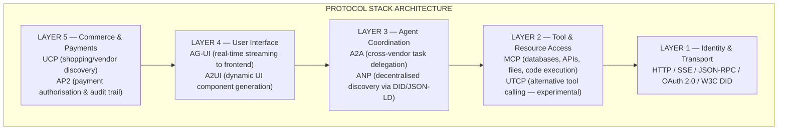

# AI Protocols, Frameworks & Standards 2026

**The Complete Guide for Service Industries** — Every New Protocol, Standard & Framework Explained, and What Your Organisation Must Do Right Now to Lead the AI Journey

*Enterprise AI Research Division · March 2026 · Part 3 of the Enterprise Agentic AI Series*

| Stat | Value |
|---|---|
| New protocols in 2026 | **11** |
| MCP SDK downloads (2026) | **97 million** |
| Binding standards enforced | **6** (EU AI Act now live) |
| Service sectors mapped | **10** |

---

## Table of Contents

**Part A — The New Protocol Stack**
- [A1 — Complete Protocol Landscape](#a1--the-complete-protocol-landscape-2026)
- [A2 — MCP: The Tool-Layer Winner](#a2--mcp-the-tool-layer-winner)
- [A3 — A2A: The Coordination Standard](#a3--a2a-the-coordination-standard)
- [A4 — ANP: Decentralised Peer-to-Peer Layer](#a4--anp-the-decentralised-peer-to-peer-layer)
- [A5 — UCP + AP2: Commerce & Payment Protocols](#a5--ucp--ap2-commerce--payment-protocols)
- [A6 — AG-UI & A2UI: Frontend Interface Protocols](#a6--ag-ui--a2ui-the-frontend-interface-protocols)
- [A7 — NLIP, LMOS, UTCP: Niche & Emerging](#a7--nlip-lmos-utcp-niche--emerging-protocols)
- [A8 — The AAIF: One Governance Home](#a8--the-aaif-one-governance-home-for-all-protocols)

**Part B — Frameworks & Standards**
- [B1 — ISO/IEC 42001](#b1--isoiec-42001-the-ai-management-system-standard)
- [B2 — NIST AI RMF](#b2--nist-ai-rmf-the-practical-risk-management-framework)
- [B3 — EU AI Act](#b3--eu-ai-act-the-global-compliance-ceiling)
- [B4 — IEEE 2857-2024, HITRUST AI & OWASP LLM Top 10](#b4--ieee-2857-2024-hitrust-ai--owasp-llm-top-10)
- [B5 — MITRE ATLAS, SOC 2 for AI & GDPR/CCPA](#b5--mitre-atlas-soc-2-for-ai--gdprccpa-ai-extensions)
- [B6 — Integrated Compliance Architecture](#b6--the-integrated-compliance-architecture)

**Part C — Service Industry Adoption Playbooks** (in [Part 2](pathname:///archon/protocols/parts/16-ai-protocols-standards-service-industry-guide-2026-part2))
- [C1 — Financial Services & Banking](pathname:///archon/protocols/parts/16-ai-protocols-standards-service-industry-guide-2026-part2#c1--financial-services--banking)
- [C2 — Healthcare & Life Sciences](pathname:///archon/protocols/parts/16-ai-protocols-standards-service-industry-guide-2026-part2#c2--healthcare--life-sciences-services)
- [C3 — Legal & Professional Services](pathname:///archon/protocols/parts/16-ai-protocols-standards-service-industry-guide-2026-part2#c3--legal--professional-services)
- [C4 — Retail & E-Commerce](pathname:///archon/protocols/parts/16-ai-protocols-standards-service-industry-guide-2026-part2#c4--retail--e-commerce)
- [C5 — Hospitality & Travel](pathname:///archon/protocols/parts/16-ai-protocols-standards-service-industry-guide-2026-part2#c5--hospitality--travel)
- [C6 — Telecommunications](pathname:///archon/protocols/parts/16-ai-protocols-standards-service-industry-guide-2026-part2#c6--telecommunications)
- [C7 — Insurance](pathname:///archon/protocols/parts/16-ai-protocols-standards-service-industry-guide-2026-part2#c7--insurance)
- [C8 — Consulting & Business Services](pathname:///archon/protocols/parts/16-ai-protocols-standards-service-industry-guide-2026-part2#c8--consulting--business-services)
- [C9 — Education Services](pathname:///archon/protocols/parts/16-ai-protocols-standards-service-industry-guide-2026-part2#c9--education-services)
- [C10 — Government & Public Sector](pathname:///archon/protocols/parts/16-ai-protocols-standards-service-industry-guide-2026-part2#c10--government--public-sector)

**Part D — Executive Action Plan** (in [Part 2](pathname:///archon/protocols/parts/16-ai-protocols-standards-service-industry-guide-2026-part2))
- [D1 — 90-Day Sprint](pathname:///archon/protocols/parts/16-ai-protocols-standards-service-industry-guide-2026-part2#d1--the-90-day-sprint)
- [D2 — AI Maturity Scorecard](pathname:///archon/protocols/parts/16-ai-protocols-standards-service-industry-guide-2026-part2#d2--the-ai-maturity-scorecard)
- [D3 — Common Failure Patterns](pathname:///archon/protocols/parts/16-ai-protocols-standards-service-industry-guide-2026-part2#d3--common-failure-patterns--how-to-avoid-them)
- [D4 — Building Your AI Adoption Team](pathname:///archon/protocols/parts/16-ai-protocols-standards-service-industry-guide-2026-part2#d4--building-your-ai-adoption-team)

---

## Part A: The New Protocol Stack

*Every protocol powering the Agentic Web — what they are, how they relate, and why they matter*

---

### A1 — The Complete Protocol Landscape (2026)

The agentic web has spawned a family of 11 distinct protocols in under 18 months. Unlike traditional software standards that take decades to mature, AI agent protocols are emerging, competing, merging, and gaining enterprise adoption at unprecedented speed. Understanding the full stack — and which protocols belong at each layer — is now a fundamental requirement for any organisation deploying AI agents at scale.

| Protocol | Full Name | Creator | Layer | Status | Key Use Case |
|---|---|---|---|---|---|
| MCP | Model Context Protocol | Anthropic (Nov 2024) | Tool Access | **DOMINANT** — 97M downloads | Connecting agents to APIs, DBs, files |
| A2A | Agent-to-Agent Protocol | Google (Apr 2025) | Agent Coordination | **DOMINANT** — 50+ partners | Cross-vendor agent collaboration |
| ACP | Agent Communication Protocol | IBM BeeAI → Linux Foundation | Agent Messaging | **MERGED** into A2A (Aug 2025) | REST-native agent messaging |
| ACP (commerce) | Agentic Commerce Protocol | OpenAI + Stripe (Sep 2025) | Commerce | **GROWING** — beta; live in ChatGPT Instant Checkout (Etsy, Walmart, Shopify) | Buyer ↔ agent ↔ merchant purchases; competes with UCP |
| ANP | Agent Network Protocol | Open Source (Jul 2025) | Network Discovery | **EMERGING** — peer-to-peer | Decentralised agent discovery via DID |
| AG-UI | Agent-User Interaction Protocol | CopilotKit (2025) | Frontend Stream | **GROWING** — streaming focus | Real-time agent-to-frontend streaming |
| A2UI | Agent-to-User Interface Protocol | Google ADK Team (2025) | UI Rendering | **EARLY** — Google ecosystem | Dynamic UI generation from agent output |
| UCP | Universal Commerce Protocol | Google / NRF (Jan 2026) | Commerce | **NEW** — major coalition | AI agent shopping & vendor discovery |
| AP2 | Agent Payments Protocol | Google (2025) | Payments | **EARLY** v0.1 — audit trail | Authorised, guarded agent transactions |
| NLIP | Natural Language Interop Protocol | Ecma TC56 — ECMA-430–434 published Dec 2025 | Natural Language | **NICHE** — published standard | NL-based agent communication |
| LMOS | LM Operating System Protocol | Eclipse Foundation (2025) | Internet of Agents | **NICHE** — IoA vision | Full Internet of Agents ecosystem |
| UTCP | Universal Tool Calling Protocol | Community (2025) | Tool Calling | **COMPETING** with MCP | Alternative tool invocation standard |

#### The Protocol Stack Architecture

These protocols do not compete — they compose. Think of them as layers of a network stack, each solving a distinct problem. A mature enterprise AI deployment will use protocols from multiple layers simultaneously.

&gt; *"If you're writing custom HTTP endpoints for agent communication in 2026, you're creating technical debt. Both MCP and A2A have mature SDKs, growing ecosystems, and industry adoption. Use them. The stack is settled enough. The execution gap between early adopters and laggards is already measurable."*
&gt; — Digital Applied, March 2026

---

### A2 — MCP: The Tool-Layer Winner

Anthropic's Model Context Protocol, launched November 2024, has achieved near-universal adoption in 15 months — the fastest standard to reach this status in AI history. With 97 million monthly SDK downloads and support from every major AI provider (Anthropic, OpenAI, Google, Microsoft, Amazon), MCP has effectively won the agent-to-tool communication layer. It was donated to the Linux Foundation's Agentic AI Foundation (AAIF) in December 2025.

| Dimension | Detail |
|---|---|
| **What It Does** | Standardises how an AI agent connects to external tools, APIs, data sources, and services. Think USB-C for AI. |
| **Architecture** | JSON-RPC client-server. Host application manages connections to MCP Servers. Servers expose tools, resources, and prompts. |
| **4 Core Primitives** | Resources (data sources), Tools (callable functions), Prompts (templates), Sampling (LLM completions) |
| **Implementation Cost** | ~50 lines of code for a simple MCP server using the official Python or TypeScript SDK |
| **Bidirectional Sampling** | Since late 2025: MCP servers can request LLM completions from the host — the server asks Claude to interpret a DB result |
| **10,000+ Public Servers** | Postgres, Slack, GitHub, Jira, Salesforce, Google Drive, Shopify, HubSpot, AWS, and hundreds more |
| **Security Warnings** | Prompt injection and tool poisoning vulnerabilities reported in early 2026 — requires careful server validation |
| **Governance** | Linux Foundation AAIF (Dec 2025) — co-governed by OpenAI, Anthropic, Google, Microsoft, AWS, Block |
| **Enterprise Adoption** | AWS, Google Cloud, Azure all natively support MCP; every major AI development platform now includes MCP tooling |
| **When to Use** | Any agent needing to access external tools, databases, files, or APIs — start here before any other protocol |

:::tip Deep Dive Available
For a full technical reference on MCP including the 2026-07-28 stateless spec release candidate, see [MCP Deep Research 2026](pathname:///archon/protocols/13-mcp-deep-research-2026) and [MCP & A2A Protocol Deep Dive](pathname:///archon/architecture/58-mcp-a2a-protocol-deep-dive).
:::

---

### A3 — A2A: The Coordination Standard

Google's Agent-to-Agent Protocol (April 2025) solves the problem MCP deliberately leaves out of scope: how do agents from different vendors, built on different frameworks, discover each other's capabilities and delegate tasks? A2A is the HTTP of the multi-agent era. Donated to Linux Foundation (June 2025); IBM's ACP merged into it (August 2025). Now governed under AAIF.

| Dimension | Detail |
|---|---|
| **What It Does** | Standardises peer-to-peer agent communication — how one agent delegates tasks to another across vendor/platform boundaries |
| **Core Concept — Agent Card** | Every A2A agent publishes a JSON manifest at `/.well-known/agent-card.json` describing its capabilities, modalities, auth, and pricing |
| **Task Lifecycle** | Formal state machine: `submitted → working → input-required → completed / failed / cancelled` — supports long-running async tasks |
| **50+ Launch Partners** | Salesforce, SAP, ServiceNow, Workday, Atlassian, MongoDB, PayPal, UKG + consulting firms: Accenture, Deloitte, McKinsey, PwC, KPMG |
| **Transport** | Built on HTTP, Server-Sent Events (SSE), JSON-RPC — integrates with existing IT stacks without new infrastructure |
| **Modality Agnostic** | Supports text, audio, video streaming — not limited to text-only agent interactions |
| **Enterprise Auth** | Enterprise-grade authentication/authorization parity with OpenAPI authentication schemes |
| **Long-running Tasks** | Designed for tasks spanning hours or days with human-in-the-loop checkpoints and real-time status updates |
| **When to Use** | When you have multiple AI systems that need to work together across teams, vendors, or organisational boundaries |
| **What A2A Does NOT Do** | Does NOT replace MCP for tool access. Does NOT handle commerce/payments — those are UCP/AP2's job. |

---

### A4 — ANP: The Decentralised Peer-to-Peer Layer

The Agent Network Protocol, open-sourced in mid-2025, takes a fundamentally different architectural approach from A2A. Instead of client-server with Agent Cards, ANP enables true peer-to-peer agent discovery and communication using W3C Decentralised Identifiers (DIDs) and JSON-LD.

Its vision is to be "the HTTP of the agentic web era" — enabling billions of AI agents to interconnect across organisational and national boundaries without central brokers. ANP uses a **three-layer architecture**:

1. **Identity &amp; Encrypted Communication** — DID-based identity, end-to-end encryption
2. **Meta-Protocol Negotiation** — agents agree on communication protocols at runtime
3. **Application Protocol** — capability registration and discovery

While less mature than A2A for enterprise use today, ANP is the architecture most aligned with a future where AI agents form spontaneous coalitions across the global internet.

---

### A5 — UCP + AP2: Commerce & Payment Protocols

#### UCP — Universal Commerce Protocol

**Creator:** Google, co-developed with Shopify, Target, Walmart, Etsy, Wayfair — launched at NRF January 2026.

UCP standardises the AI agent shopping lifecycle: catalogue discovery, checkout flows, and vendor negotiation. It uses typed request/response schemas consistent across any transport (REST, MCP, A2A, or embedded), enabling AI agents to autonomously discover suppliers, build carts, compare offers, and place orders without custom per-vendor integrations.

This is the foundation of the **B2A (Business-to-Algorithm) commerce model** — where AI agents are the buyers.

#### AP2 — Agent Payments Protocol

**Creator:** Google ADK Team, v0.1 (2025). Layered on top of UCP.

AP2 provides:
- **PaymentMandate** — cryptographic proof of intent with configurable spending guardrails
- **IntentMandate** — spending limit governance before any transaction executes
- **PaymentReceipt** — immutable audit trail for every agent-initiated payment

**Role separation** prevents rogue agent spending — no single entity has too much power:

| Role | Responsibility |
|---|---|
| Shopping Agent | Task coordinator — orchestrates the purchase workflow |
| Merchant Endpoint | Negotiates price and availability |
| Credentials Provider | Secure wallet — never directly controlled by the agent |
| Payment Processor | Executes the transaction after all mandates are satisfied |

AP2 works across traditional banks, digital wallets, and blockchain currencies.

---

### A6 — AG-UI & A2UI: The Frontend Interface Protocols

Two protocols are now standardising how AI agents communicate with human-facing frontends in real time.

**AG-UI (Agent-User Interaction Protocol)** provides a standardised streaming layer between backend AI agents and frontend applications — enabling real-time tool call visibility, state updates, and human-in-the-loop interactions for chat interfaces, dashboards, and automation UIs.

**A2UI (Agent-to-User Interface Protocol)**, from Google's ADK team, goes further: it lets agents dynamically compose novel frontend layouts using a declarative JSON format of 18 safe component primitives (rows, columns, text fields, buttons) — meaning the agent decides what UI to show based on context, without pre-built screens.

Together:
- **AG-UI** handles streaming delivery
- **A2UI** handles dynamic rendering

This combination completely eliminates the need to pre-build frontend components for every possible agent output scenario.

:::tip Deep Dive Available
See [AGUI Standards & Ecosystem Landscape](pathname:///archon/agentic-systems/agentic-ui/02-agui-standards-landscape) for the full technical reference including the 15-framework comparison matrix, production code examples, and selection decision tree.
:::

---

### A7 — NLIP, LMOS, UTCP: Niche & Emerging Protocols

| Protocol | Creator | Vision | Current Status |
|---|---|---|---|
| **NLIP** | Ecma International (TC56) | Natural language as the primary interface for agent communication — agents negotiate using human language rather than structured schemas | Published standard — ECMA-430–434 + TR/113 (Dec 2025); adoption still early |
| **LMOS** | Eclipse Foundation | "Internet of Agents" (IoA) — a full operating system for AI agents at internet scale; three layers: identity+security, transport, application | Niche — Eclipse ecosystem; IoA vision is ahead of current reality |
| **UTCP** | Community (2025) | Alternative to MCP for tool-calling — claims simpler implementation; has not gained comparable adoption | Competing with MCP — unlikely to displace it given 97M MCP downloads |

---

### A8 — The AAIF: One Governance Home for All Protocols

The Linux Foundation's **Agentic AI Foundation (AAIF)**, launched December 2025, is the most significant governance development in AI infrastructure standards.

Co-founded by **OpenAI, Anthropic, Google, Microsoft, AWS, and Block** — the six largest players in enterprise AI — AAIF provides a neutral home for MCP, A2A, Goose, Agents.md, and other agentic tools. Platinum members include Bloomberg, Cloudflare, and all major hyperscalers.

This means:
- No single vendor controls the specs
- Enterprise legal teams have clear IP ownership clarity
- Standards will evolve through consortium governance rather than proprietary roadmaps

For service organisations, this is the signal that these protocols are **production-safe foundations** to build upon — not beta experiments.

---

## Part B: Frameworks & Standards

*The compliance and governance architecture every service organisation must understand and implement*

---

### B1 — ISO/IEC 42001: The AI Management System Standard

Published December 2023 by ISO/IEC JTC 1/SC 42, ISO/IEC 42001 is the world's first certifiable AI Management System (AIMS) standard. Over 2,847 organisations globally were certified as of 2025. It follows the same Plan-Do-Check-Act (PDCA) methodology as ISO 27001 and ISO 9001, making it familiar to compliance teams.

**Certification cost:** $75,000–$350,000 including consulting · **Timeline:** 6–12 months · **Cycle:** Annual surveillance audits within a 3-year certification

| Clause | Requirement | What It Means for Your Organisation |
|---|---|---|
| 4.1–4.4 | Organisational Context & AIMS Scope | Define which AI systems are in scope; map stakeholder expectations; document the AIMS boundary |
| 5 — Leadership | AI Policy & Roles | Board-level AI policy; appoint AI governance lead; cross-functional AI oversight committee |
| 6 — Planning | Risk & Opportunity Assessment | Document AI risk register; set measurable AI objectives; plan for regulatory changes |
| 7 — Support | Resources, Competence, Awareness | AI literacy training for all staff; technical AI competence for developers; documented procedures |
| 8.2 — Operations | AI Risk Assessment | Per-system risk assessment; bias testing; adversarial robustness evaluation; data quality checks |
| 8.3 | AI Risk Treatment | Implement controls per risk level; guardrails; human oversight for high-risk decisions |
| 8.4 | AI System Impact Assessment | Pre-deployment impact assessment for systems affecting individuals or groups |
| 9 — Evaluation | Performance Monitoring | KPIs for AI accuracy, fairness, compliance; audit schedules; management reviews |
| 10 — Improvement | Continual Improvement | Post-market surveillance; incident response; update AIMS as technology and regulation evolve |
| Annex A | Control Guidance | 72 detailed controls covering data governance, model transparency, third-party AI oversight |

---

### B2 — NIST AI RMF: The Practical Risk Management Framework

The National Institute of Standards and Technology's AI Risk Management Framework (AI RMF 1.0, January 2023) is the most widely implemented AI governance standard in North America — adopted by over 5,200 organisations. It is voluntary (not legally required in the US) but referenced by federal regulators and increasingly required by government contractors.

**Implementation cost:** $25,000–$150,000 · **Timeline:** 3–6 months

| Function | What It Does | Key Activities |
|---|---|---|
| **GOVERN** | Establish AI risk culture, policies, and accountability structures | AI policy, roles/responsibilities, risk tolerance statements, training programmes |
| **MAP** | Categorise and contextualise AI risks for specific systems and use cases | Risk context identification, stakeholder mapping, impact assessment, risk categorisation |
| **MEASURE** | Analyse and monitor AI risks throughout the lifecycle | Testing, evaluation, metrics definition, bias measurement, hallucination detection, drift monitoring |
| **MANAGE** | Prioritise, respond to, and mitigate AI risks | Risk treatment plans, incident response, model governance, third-party AI risk, decommissioning |

---

### B3 — EU AI Act: The Global Compliance Ceiling

The EU AI Act (Regulation (EU) 2024/1689) is the world's first comprehensive AI law. Its extraterritorial scope means any organisation whose AI outputs reach EU residents must comply — regardless of where the organisation is based.

**Critical deadlines (updated per the Digital Omnibus, final June 2026):** Article 50 transparency — **August 2, 2026** (unchanged); Annex III high-risk requirements — **December 2, 2027** (deferred from Aug 2026); Annex I embedded systems — **August 2, 2028**. Fines up to **€35M or 7% of global annual revenue**.

| Risk Tier | Examples | Obligations | Deadline |
|---|---|---|---|
| **UNACCEPTABLE** (Prohibited) | Social scoring, subliminal manipulation, real-time remote biometric ID in public spaces | **BANNED outright** — no compliance path | Feb 2025 (enforced) |
| **HIGH-RISK** | AI in employment, credit decisions, education access, law enforcement, healthcare devices, critical infrastructure | Risk management system, data governance, technical documentation, CE marking, human oversight, EU DB registration | **December 2, 2027** (Annex III, deferred) / Aug 2, 2028 (Annex I) |
| **GPAI Model Providers** | Foundation models (GPT-5, Gemini, Claude) + any fine-tuned versions placed on EU market | Training data documentation, copyright compliance, safety evaluation, systemic risk assessment if >10²⁵ FLOPs | August 2025 (enforced) |
| **LIMITED RISK** | Chatbots, deepfakes, AI-generated content | Transparency: disclose AI interaction/generation to users | August 2, 2026 (Art. 50 — unchanged) |
| **MINIMAL RISK** | Spam filters, recommendation systems, AI games | Voluntary codes of conduct | No mandatory deadline |

---

### B4 — IEEE 2857-2024, HITRUST AI & OWASP LLM Top 10

#### IEEE 2857-2024 — AI Performance & Scalability Benchmarking

Published 2024. Defines methodologies for measuring AI system performance, efficiency, and scalability under production conditions. Became mandatory for US federal AI procurement in 2025. Provides standardised benchmarking for response latency, throughput, accuracy under load, and degradation patterns — essential for enterprise SLA agreements with AI vendors.

**Implementation timeline:** 2–4 months · **Cost:** $15,000–$50,000

#### HITRUST AI Framework

Designed for healthcare organisations and any sector handling Protected Health Information (PHI). Extends the HITRUST CSF (Common Security Framework) with AI-specific controls covering:
- Model accuracy in clinical contexts
- AI-generated PHI risks
- Audit trails for AI clinical decisions
- HIPAA alignment for AI agents

#### OWASP LLM Top 10 (2025 Edition)

The 10 most critical security risks for LLM applications, in order:

1. Prompt Injection
2. Insecure Output Handling
3. Training Data Poisoning
4. Model Denial of Service
5. Supply Chain Vulnerabilities
6. Sensitive Information Disclosure
7. Insecure Plugin Design
8. Excessive Agency
9. Overreliance
10. Model Theft

Every service organisation deploying LLM-powered agents must conduct an OWASP LLM Top 10 assessment before production deployment. **Free to use.**

---

### B5 — MITRE ATLAS, SOC 2 for AI & GDPR/CCPA AI Extensions

#### MITRE ATLAS

A knowledge base of adversarial attacks on AI/ML systems — the AI equivalent of MITRE ATT&CK for cybersecurity. Covers attack techniques including evasion, poisoning, model theft, and inference attacks. Essential for threat modelling AI deployments. Free, maintained by MITRE in partnership with the AI security community. Pairs with NIST AI RMF and ISO 42001 for comprehensive risk coverage.

#### SOC 2 for AI

The AICPA is extending SOC 2 trust service criteria (security, availability, processing integrity, confidentiality, privacy) with AI-specific criteria addressing:
- Model accuracy and training data lineage
- Bias testing and AI output reliability

Service organisations already SOC 2 certified should work with their auditors to include AI-specific criteria in their next audit cycle.

#### GDPR/CCPA AI Extensions

Both GDPR (EU) and CCPA (California) apply to AI decision-making:
- Automated decisions with significant impact require **human review rights**
- AI training on personal data requires a **legal basis**
- AI-generated profiling must be **disclosed**
- **DPIAs** (Data Protection Impact Assessments) are required for high-risk AI processing involving personal data

---

### B6 — The Integrated Compliance Architecture

The most effective enterprise AI compliance strategy in 2026 uses a **three-layer architecture**:

1. **NIST AI RMF** as the governance foundation (4 functions: Govern, Map, Measure, Manage)
2. **ISO/IEC 42001** as the certifiable management system (aligned with NIST RMF via official crosswalk)
3. **EU AI Act** as the regulatory ceiling, with local regulations as the adaptation layer

OWASP LLM Top 10 and MITRE ATLAS provide the security threat modelling layer. IEEE 2857-2024 and HITRUST AI handle sector-specific performance and healthcare requirements.

| Framework / Standard | Type | Mandatory? | Timeline | Cost Range | Priority |
|---|---|---|---|---|---|
| EU AI Act (High-Risk) | Regulation | YES — if EU market reach | Dec 2027 deadline (Annex III; Art. 50 from Aug 2026) | €100K–€1M+ | **CRITICAL** |
| ISO/IEC 42001 | Certifiable Standard | No — but client-expected | 6–12 months | $75K–$350K | **HIGH** |
| NIST AI RMF | Voluntary Framework | YES — US federal contractors | 3–6 months | $25K–$150K | **HIGH** |
| OWASP LLM Top 10 | Security Checklist | No — but negligence risk if skipped | 1–2 months | Minimal | **HIGH** |
| MITRE ATLAS | Threat Knowledge Base | No — threat modelling tool | Ongoing | Free | MEDIUM |
| IEEE 2857-2024 | Performance Standard | YES — US federal procurement | 2–4 months | $15K–$50K | MEDIUM |
| HITRUST AI | Healthcare Framework | HIGH — healthcare sector | 4–8 months | $50K–$200K | SECTOR |
| SOC 2 for AI | Audit Standard | Often required by B2B clients | Next audit cycle | Audit fees | MEDIUM |
| GDPR/CCPA AI Extensions | Privacy Regulation | YES — any personal data use | Immediate | Legal review | **CRITICAL** |

---

**Next:** [Part C — Service Industry Adoption Playbooks](pathname:///archon/protocols/parts/16-ai-protocols-standards-service-industry-guide-2026-part2.md)
