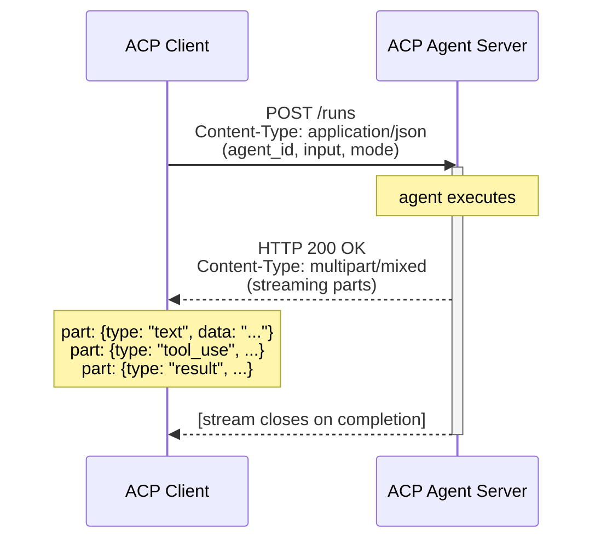
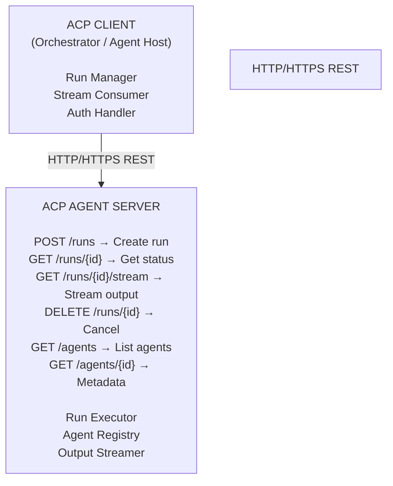
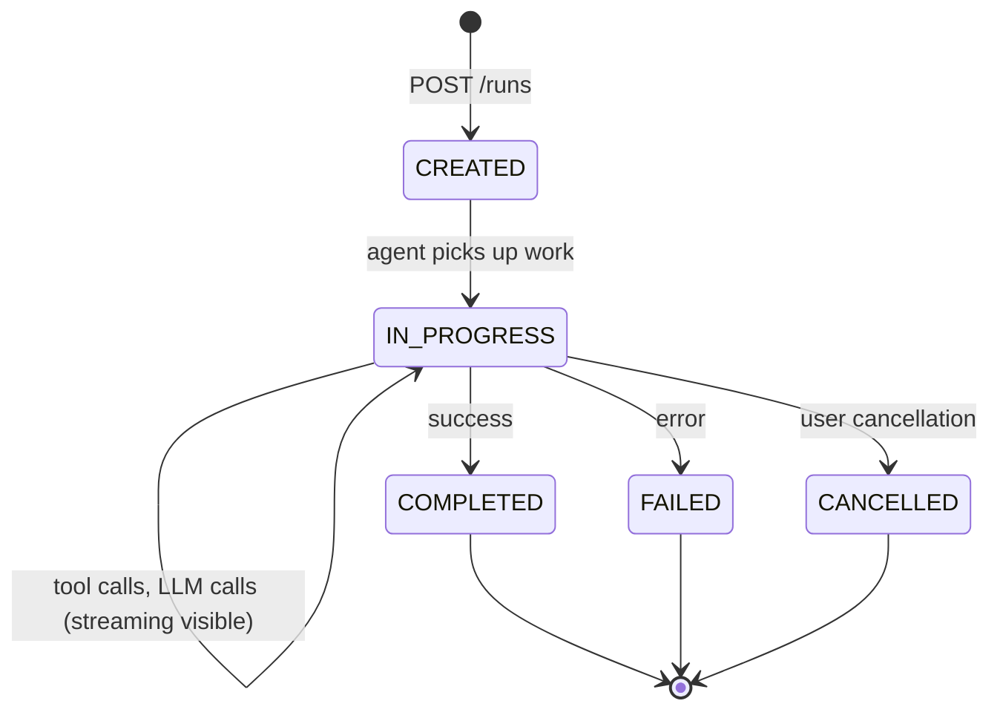
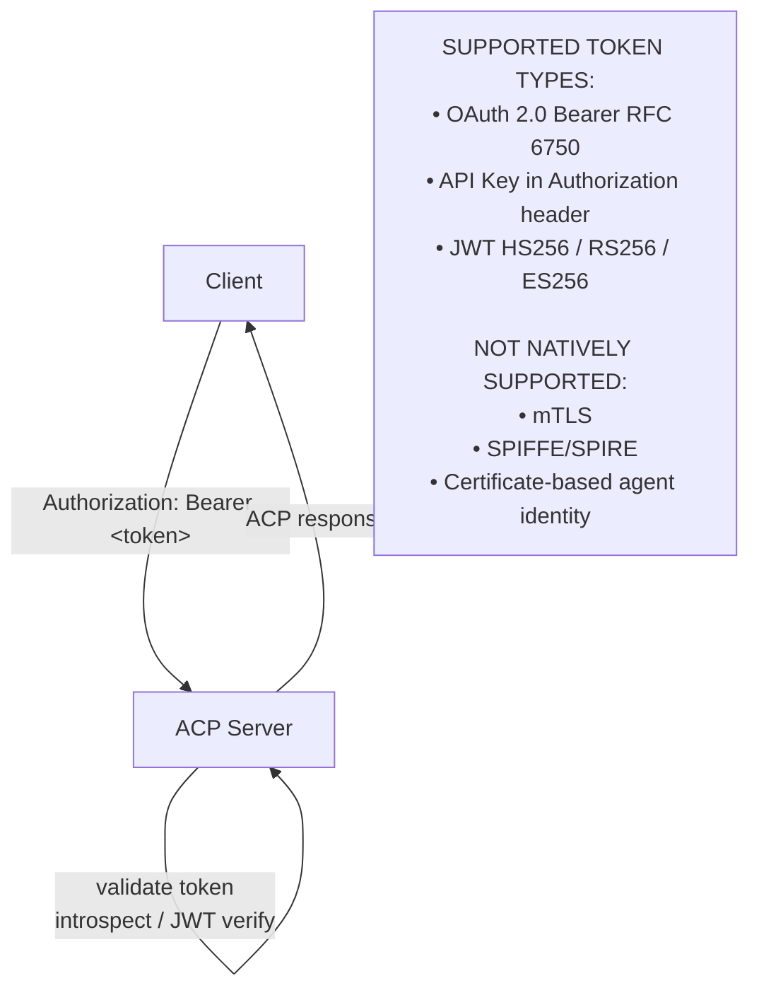
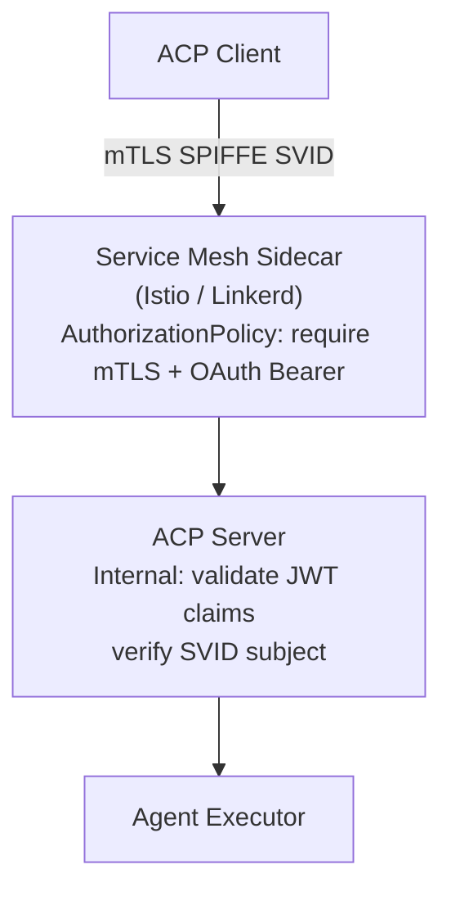
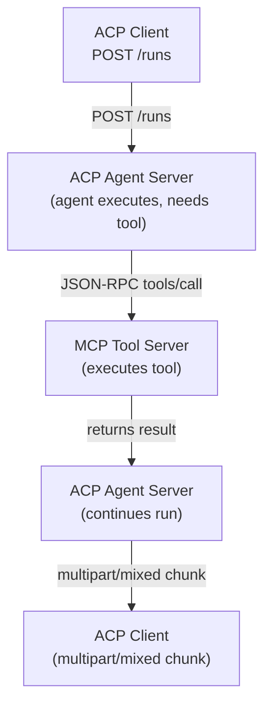

# ACP & ANP — Federated and Decentralised Agent Protocols

**Emerging AI Agent Protocols Beyond MCP & A2A — Enterprise Architecture, Standards, Security, and Adoption (2026)**

&gt; July 2026 Edition &middot; Enterprise AI Research Division

## Preface to This Section

This section provides deep-dive treatment of two protocols that occupy distinct but complementary positions in the evolving agent communication landscape:

- **ACP (Agent Communication Protocol)** &mdash; IBM BeeAI's REST-native agent messaging layer, which was subsequently donated to the Linux Foundation and formally merged into A2A in August 2025. Understanding ACP is essential because: (a) many enterprise codebases adopted ACP between its launch and the merger, and (b) the architectural patterns ACP pioneered &mdash; particularly its REST-first approach, run-state semantics, and multipart streaming &mdash; were carried forward into A2A v1.0 and remain in production.

- **ANP (Agent Network Protocol)** &mdash; An open-source peer-to-peer agent discovery and communication protocol launched July 2025, grounded in W3C Decentralised Identifiers (DIDs) and JSON-LD, with a three-layer architecture designed to enable autonomous agent coalitions at internet scale without central brokers.

Both protocols represent serious architectural alternatives to the dominant MCP/A2A pairing &mdash; one as a now-integrated predecessor, the other as an emerging decentralised complement. Neither replaces MCP (tool access) or A2A (enterprise agent coordination). Instead, they address the question that neither of those protocols fully answers: how do agents in federated, cross-organisational, or trust-constrained environments discover, authenticate, and communicate with each other at scale?

## PROTOCOL 1: ACP &mdash; Agent Communication Protocol

&gt; **⚠️ Naming collision.** This section covers IBM BeeAI's **Agent Communication Protocol**, which merged into A2A in August 2025 and is now retired. It is *not* the **Agentic Commerce Protocol** &mdash; the OpenAI + Stripe open standard (announced September 2025, in beta) behind ChatGPT Instant Checkout. In 2026 vendor material, "ACP" usually refers to the commerce protocol; see the UCP deep dive (Section 2C) for its coverage.

## 1. Origin &amp; Evolution

### 1.1 Founding History

ACP originated at **IBM Research** as the communication backbone of **BeeAI**, IBM's enterprise agentic AI platform. The initial specification was authored in early 2025 by engineers building production multi-agent systems inside IBM's consulting and cloud divisions. The fundamental driver was practical rather than academic: IBM's teams had deployed A2A-adjacent patterns internally and found Google's Agent-to-Agent Protocol &mdash; while conceptually sound &mdash; made assumptions about centralised agent registries and synchronous orchestration that did not map well to IBM's distributed enterprise deployments.

The original problem statement, as stated in the BeeAI project documentation, was:

&gt; *"We need a protocol that any HTTP server can implement in a weekend, that supports long-running async agent tasks without polling hell, and that does not require agents to pre-declare their full capability graph before they can accept a task."*

This framing deliberately positioned ACP as complementary to, rather than competitive with, A2A. Where A2A required Agent Cards (upfront capability manifests), ACP took a discovery-at-runtime approach. Where A2A's task state machine was formalized and opinionated, ACP's run model was minimal and extensible.

### 1.2 Open Source and Linux Foundation Donation

IBM open-sourced ACP in spring 2025 under the Apache 2.0 licence. The specification was hosted at `github.com/i-am-bee/acp` (later archived after the merger). The BeeAI framework (`github.com/i-am-bee/bee-agent-framework`) provided the reference implementation.

In **June 2025**, IBM donated ACP to the **Linux Foundation's Agentic AI Foundation (AAIF)** &mdash; the same governance body that received MCP (December 2025) and A2A (June 2025). This created the conditions for the merger: both A2A and ACP now shared a governance home and a community of enterprise adopters with significant overlap.

### 1.3 The ACP-A2A Merger (August 2025)

Following six weeks of working group sessions under the AAIF's Technical Steering Committee, the ACP specification was **formally merged into A2A in August 2025**. The merger was not a hostile acquisition &mdash; it was a structured convergence. The key outcomes were:

| ACP Contribution | A2A Integration Point |
|---|---|
| REST-native task invocation (no JSON-RPC required) | A2A's HTTP transport profile was expanded to support direct REST semantics |
| Multipart streaming response model | A2A adopted multipart/mixed content streaming as a first-class transport option alongside SSE |
| Run state machine (`created → in-progress → completed / failed`) | Merged into A2A's extended task state machine |
| Synchronous short-task mode | A2A added synchronous response mode for sub-second tasks |
| `runs` resource abstraction | Carried forward into A2A's Task resource model |
| Minimal capability negotiation header | Informed A2A's capability advertisement model in Agent Cards |

Post-merger, the ACP GitHub repository was archived and contributors migrated to the A2A AAIF working group. The BeeAI framework continued under IBM stewardship as an ACP-compatible (now A2A-compatible) agent framework.

### 1.4 Legacy and Continued Relevance

Despite the merger, ACP retains material relevance as of July 2026 for three reasons:

1. **Production deployments**: A significant body of enterprise code &mdash; particularly within IBM Cloud, Red Hat OpenShift AI, and early BeeAI adopters &mdash; implemented ACP-native APIs.
2. **Architectural patterns**: ACP's REST-first, run-model-centric design influenced how many architects think about agent task lifecycle, independent of which protocol label they use.
3. **A2A lineage**: Understanding ACP's design decisions illuminates why A2A v1.0 made the choices it did &mdash; particularly around transport flexibility and synchronous task support.

## 2. Problem Space

### 2.1 The Exact Problem ACP Was Designed to Solve

ACP addressed a specific gap in the 2024–2025 protocol landscape: **how do you invoke an AI agent over HTTP in a way that is simultaneously simple enough for any team to implement, yet expressive enough to handle both instant and long-running responses?**

This sounds trivial but was not. The options available before ACP were:

| Option | Problem |
|---|---|
| Custom REST endpoints per agent | Every team invents its own schema, state model, error codes |
| A2A | Requires Agent Card infrastructure; JSON-RPC dependency; opinionated orchestration |
| MCP | Agent-to-tool, not agent-to-agent; does not model task lifecycle |
| gRPC | Requires Protobuf schemas; not universally accessible from browsers or simple HTTP clients |
| Webhooks / polling | Race conditions, missed events, operational complexity |

ACP's answer was a **minimal HTTP + multipart streaming contract** that any HTTP server could satisfy, with a task lifecycle (called a "run") that mapped cleanly to how AI agents actually operate: accept input, do work (possibly for a long time), produce output (possibly streamed).

### 2.2 Target Users and Systems

ACP was designed for:

- **Enterprise agent platforms** needing a standard HTTP invocation contract across heterogeneous agent implementations
- **Internal platform teams** building agent orchestrators that must invoke agents built by different teams in different languages
- **IBM BeeAI users** specifically, but also any team using Python, TypeScript, or Java agent frameworks
- **Legacy enterprise environments** where JSON-RPC-based protocols (A2A) faced pushback from API teams accustomed to pure REST semantics

### 2.3 Primary Communication Model

ACP used a **client-server model** with an HTTP-native surface:



The `mode` field selected between:
- `sync` — single HTTP response body (short tasks, under ~30s)
- `stream` — multipart/mixed streaming (long tasks, tool use traces visible)
- `async` — immediate `202 Accepted` with a run ID, poll or webhook for results

### 2.4 Enterprise Use Cases

| Use Case | ACP Fit |
|---|---|
| Internal chatbot API gateway normalising calls to multiple agent backends | High — common REST surface regardless of backend |
| Document processing pipeline with long-running analysis agents | High — stream mode provided progress visibility |
| Agent orchestrator invoking specialist sub-agents | High — run model made lifecycle tracking explicit |
| Cross-vendor agent-to-agent task delegation | Medium — ACP lacked A2A's capability discovery model |
| Real-time streaming AI to browser frontends | Low — AG-UI was better suited |

### 2.5 Why Existing Protocols Were Insufficient

The ACP design brief explicitly called out three A2A limitations for IBM's use cases:

1. **JSON-RPC friction**: Enterprise API teams in IBM's client organisations had strong REST discipline. JSON-RPC was viewed as an unusual transport choice that would require custom gateway work to integrate into existing API management platforms (APIM, Kong, MuleSoft).

2. **Upfront capability declaration**: A2A's Agent Card model required agents to pre-declare their full capability graph. IBM's enterprise agents &mdash; particularly those wrapping proprietary or third-party models &mdash; could not always expose their full capability topology in a public manifest.

3. **Orchestration weight**: A2A v0.x carried significant orchestration semantics (push tasks, pull tasks, explicit negotiation) that added implementation complexity IBM's teams found disproportionate for common internal agent-invocation patterns.

## 3. Protocol Architecture

### 3.1 Core Architecture

ACP's architecture was built on five primitives:



### 3.2 The Run — ACP's Central Abstraction

A **Run** was ACP's unit of work &mdash; equivalent to A2A's Task. Every interaction with an ACP agent created a Run:

```json
// POST /runs — Request body
{
  "agent_id": "financial-analyst-v2",
  "input": [
    {
      "type": "user",
      "content": [
        { "type": "text", "text": "Summarise Q3 2025 earnings for AAPL" }
      ]
    }
  ],
  "config": {
    "max_iterations": 10,
    "timeout_seconds": 120
  },
  "metadata": {
    "session_id": "sess-abc123",
    "user_id": "u-9f8d"
  }
}

// Response (stream mode) — HTTP 200 + multipart/mixed
// Part 1: intermediate tool call
{
  "type": "tool_use",
  "tool": "web_search",
  "input": { "query": "AAPL Q3 2025 earnings" }
}
// Part 2: tool result
{
  "type": "tool_result",
  "content": "Apple reported revenue of $94.9B..."
}
// Part 3: final result
{
  "type": "text",
  "content": "Apple's Q3 2025 earnings showed..."
}
```

### 3.3 Run State Machine



Unlike A2A's richer state machine, ACP's run states were intentionally minimal. The `in-progress` → `completed` transition carried the full output payload.

### 3.4 Message Lifecycle

1. **Client** sends `POST /runs` with input messages and agent ID
2. **Server** validates input, creates Run record with ID, returns 200 (sync/stream) or 202 (async)
3. **Agent executor** processes the run — calling tools, invoking LLMs, iterating
4. **Output streamer** emits multipart chunks as they become available (stream mode)
5. **Run state** transitions from `in-progress` to terminal state
6. **Client** reads final chunk or polls `GET /runs/{id}` for result

### 3.5 Streaming Model

ACP used **multipart/mixed** streaming — HTTP multipart with `Content-Type: multipart/mixed; boundary=&lt;uuid&gt;`:

```
Content-Type: multipart/mixed; boundary=acp-stream-f4a9

--acp-stream-f4a9
Content-Type: application/json

{"type": "thought", "content": "I need to search for current price data"}

--acp-stream-f4a9
Content-Type: application/json

{"type": "tool_use", "tool": "stock_ticker", "input": {"symbol": "AAPL"}}

--acp-stream-f4a9
Content-Type: application/json

{"type": "tool_result", "content": "$211.43"}

--acp-stream-f4a9
Content-Type: application/json

{"type": "text", "content": "The current AAPL price is $211.43..."}

--acp-stream-f4a9--
```

This approach was more universally compatible than SSE (Server-Sent Events) — particularly useful for clients behind enterprise proxies that buffer SSE streams, and for languages/frameworks where SSE client libraries were immature.

### 3.6 Discovery Mechanism

ACP provided a minimal agent discovery endpoint:

```
GET /agents
→ [
    { "id": "financial-analyst-v2", "name": "...", "description": "...",
      "input_schema": {...}, "metadata": {...} },
    ...
  ]

GET /agents/{id}
→ { full agent descriptor }
```

This was intentionally lighter than A2A's Agent Card model — no capability graph, no auth declaration, no pricing. The trade-off was simplicity at the cost of machine-discoverable capability negotiation.

### 3.7 Transport and Serialisation

| Dimension | Specification |
|---|---|
| Transport | HTTP/1.1, HTTP/2 |
| Encoding | UTF-8 JSON |
| Streaming | multipart/mixed |
| Auth | Bearer token (OAuth 2.0 / API key) in `Authorization` header |
| Content-Type | `application/json` (request), `multipart/mixed` (stream response), `application/json` (sync response) |
| Version negotiation | `ACP-Version` request header; server returns `ACP-Version` in response |
| Error format | RFC 7807 Problem Details for HTTP APIs |

### 3.8 Version Negotiation

```
// Client indicates supported versions
ACP-Version: 0.1, 0.2

// Server responds with negotiated version
ACP-Version: 0.2
```

## 4. Security Architecture

### 4.1 Authentication Model

ACP's authentication model was deliberately minimal — a policy choice to remain accessible:



### 4.2 Authorization

ACP had no native authorization model. Authorization decisions were entirely delegated to the implementing server. The recommended patterns were:

1. **OAuth 2.0 scopes** on the bearer token (e.g., `acp:runs:write`, `acp:agents:financial-analyst`)
2. **Agent-level API keys** issued per client identity
3. **Service mesh policies** (Istio AuthorizationPolicy) enforced at the sidecar level

### 4.3 Message Integrity

ACP provided **no native message signing**. Message integrity depended on transport-layer security (TLS). For high-assurance environments, the recommended pattern was:

```
// Request integrity via JWS (JSON Web Signature) body signing
// Custom header approach used in IBM's production deployments:
ACP-Body-Digest: SHA-256=&lt;base64-digest&gt;
ACP-Signature: &lt;JWS-compact-serialization&gt;
```

This was not standardised in the ACP specification itself and was therefore an implementation-specific extension.

### 4.4 Replay Protection

No native replay protection. Mitigations used in practice:

- `X-Request-ID` / `ACP-Request-ID` header for idempotency keys
- Server-side request ID deduplication window (typically 5 minutes)
- Short-lived bearer tokens (&lt; 5 minute expiry) to limit replay window

### 4.5 Threat Model

| Threat | ACP Exposure | Mitigation |
|---|---|---|
| Prompt injection via crafted input | High — ACP passes input directly to agent | Input validation layer; output sanitisation |
| Token theft (bearer token interception) | Medium — mitigated by TLS | Short-lived tokens; token binding |
| Replay of `POST /runs` requests | Medium | Idempotency keys; TTL on request IDs |
| Enumeration of agent IDs via `/agents` | Low-Medium | Auth-gate the `/agents` endpoint |
| Denial of service via long-running runs | Medium | Timeout config; rate limiting |
| SSRF via agent tool calls | High — applies to any agent framework | Tool allowlisting; network egress controls |
| Man-in-the-middle | Low — mitigated by TLS | Certificate pinning for internal deployments |
| Insecure deserialization | Low — JSON only | Standard JSON parsing libraries |
| Agent impersonation | Medium | No native server identity; requires mTLS overlay |

:::warning Security Anti-Patterns with ACP
The most common ACP security failures observed in enterprise deployments were:

1. **Unauthenticated `/agents` endpoint** — exposing the full agent registry to any caller, revealing internal capability topology
2. **Long-lived API keys** — ACP's simplicity encouraged static API keys rather than short-lived OAuth tokens
3. **No input sanitisation** — treating ACP as a trusted internal protocol and passing raw user input directly to agents without validation
4. **Missing TLS on internal ACP calls** — assuming internal network trust, which violated Zero Trust principles
5. **No rate limiting on `/runs`** — allowing orchestrators to flood agent servers under load or attack conditions
:::

### 4.6 Zero Trust Compatibility

ACP was compatible with Zero Trust architectures when deployed with the following overlay:



### 4.7 Supply Chain Security

ACP servers serving agents that called external tools or models introduced supply chain risk. Mitigations:

- Pin LLM provider endpoints (no dynamic model resolution)
- Verify agent container image SBOMs (Software Bill of Materials)
- Use OCI image signing (Sigstore/Cosign) for agent deployments
- Audit tool allowlist changes through change management processes

## 5. Governance

### 5.1 Protocol Governance (Pre-Merger)

Before the August 2025 merger, ACP was governed under:

- **Specification**: IBM BeeAI team, with community PR process on GitHub
- **Licence**: Apache 2.0
- **Decision process**: Maintainer consensus (IBM-led), with open GitHub issues and PRs
- **Versioning**: Semantic versioning (0.x during the BeeAI period — never reached 1.0)
- **Deprecation**: No formal deprecation policy published; merger constituted de facto end-of-life for standalone ACP

### 5.2 Post-Merger Governance (AAIF)

Following the AAIF donation and A2A merger, ACP as a distinct specification is governed as:

- **Status**: Archived — no new versions will be published under the ACP identifier
- **Forward governance**: Through the A2A specification under the Linux Foundation Agent2Agent Project
- **Migration path**: AAIF published a migration guide mapping ACP endpoints to equivalent A2A operations
- **Existing deployments**: No mandated migration timeline; AAIF committed to documenting the ACP → A2A bridge patterns

### 5.3 Enterprise Operating Model for ACP Migrations

Organisations running ACP-native code as of July 2026 should apply the following governance model:

| Dimension | Recommendation |
|---|---|
| Registry | Maintain an ACP service inventory; mark each service's migration status |
| Ownership | Assign a named migration owner per ACP service |
| Timeline | Target A2A migration by Q4 2026 for new capability additions; existing services: by end of 2027 |
| Compatibility shim | Use the AAIF ACP-to-A2A bridge adapter during transition |
| Compliance | Verify that ACP services in regulated contexts have equivalent A2A compliance controls documented |

### 5.4 Metadata Governance

ACP did not define a metadata governance model. The `metadata` object on runs was a free-form JSON object. Enterprise practice was to enforce metadata schemas at the API gateway layer:

```json
// Recommended enterprise metadata schema (enforced at gateway)
{
  "session_id": "string (required)",
  "user_id": "string (required)",
  "correlation_id": "string (required, UUID)",
  "tenant_id": "string (required)",
  "classification": "string (one of: internal, restricted, confidential)",
  "cost_centre": "string (optional)",
  "environment": "string (one of: dev, staging, prod)"
}
```

## 6. Enterprise Readiness

### 6.1 Production Readiness Assessment (as of August 2025 merger)

| Dimension | Rating | Notes |
|---|---|---|
| Protocol stability | Medium | Never reached 1.0; merged before stable release |
| SDK maturity | Medium | Python and TypeScript SDKs in BeeAI; community adapters |
| Tooling | Low-Medium | No dedicated monitoring/observability tooling |
| Vendor support | Medium | IBM, BeeAI ecosystem; no hyperscaler-native support |
| Documentation | Medium | Good for basic use; gaps in security and ops |
| Community | Small | Active during BeeAI phase; migrated to A2A post-merger |

### 6.2 Scalability

ACP servers scaled horizontally without coordination state — runs were tracked per-server or in a shared store (Redis, PostgreSQL). The multipart streaming model required HTTP connection affinity per run (or a streaming proxy). Common patterns:

- **Stateless servers**: No per-run state on server; delegate to external run store
- **Sticky sessions**: Load balancer affinity for streaming runs (less preferred)
- **Streaming proxy**: Single ingress proxy buffers stream; delivers to multiple consumers

### 6.3 Hybrid and Air-Gapped Deployment

ACP's pure HTTP surface made it highly portable:

- **Air-gapped**: Ran on any HTTP server; no cloud dependencies; easily deployed in isolated networks
- **Hybrid**: ACP gateway at the boundary; internal ACP calls on-prem; external A2A calls via gateway
- **Kubernetes**: Standard Deployment + Service; no custom CRDs required

### 6.4 Regulated Industry Suitability

| Industry | Consideration |
|---|---|
| Financial services | ACP's minimal auth model required significant augmentation; mTLS + short-lived JWTs recommended |
| Healthcare | PHI in run payloads required encryption at rest + in transit; logging of run metadata for audit |
| Government | ACP lacked FedRAMP-relevant controls natively; required STIG-compliant overlays |
| Legal | Chain-of-custody for run inputs/outputs required external audit logging |

:::tip ACP Migration to A2A
For teams migrating from ACP to A2A: the conceptual mapping is direct. ACP's `Run` becomes A2A's `Task`. ACP's `POST /runs` maps to A2A's task submission. ACP's stream parts map to A2A's streaming message events. The AAIF migration guide (available at `lf-agent2agent.github.io/migration/acp-to-a2a`) provides field-level mappings and a compatibility shim for existing ACP clients.
:::

## 7. Interoperability

### 7.1 ACP ↔ A2A

The AAIF published an official bridge specification. An ACP-to-A2A adapter translated:

| ACP | A2A Equivalent |
|---|---|
| `POST /runs` | Task submission via `tasks/send` or `tasks/sendSubscribe` |
| `GET /runs/{id}` | `tasks/get` |
| `GET /runs/{id}/stream` | `tasks/sendSubscribe` (SSE stream) |
| `DELETE /runs/{id}` | `tasks/cancel` |
| `GET /agents` | Agent Card at `/.well-known/agent.json` |
| Run state `in-progress` | A2A Task status `working` |
| Run state `completed` | A2A Task status `completed` |
| Multipart stream parts | A2A streaming events |

### 7.2 ACP ↔ MCP

ACP and MCP operated at different layers. An ACP agent server could invoke MCP tool servers for its tool calls:



### 7.3 ACP ↔ REST / OpenAPI

ACP was itself REST-native, making integration with existing OpenAPI-documented APIs straightforward. ACP servers could be documented via OpenAPI 3.x:

```yaml
openapi: 3.1.0
paths:
  /runs:
    post:
      summary: Create an agent run
      requestBody:
        content:
          application/json:
            schema:
              $ref: '#/components/schemas/RunRequest'
      responses:
        '200':
          description: Synchronous or streaming run response
```

### 7.4 ACP ↔ Service Mesh

ACP integrated cleanly with Istio and Linkerd:

- **mTLS**: Service mesh sidecars handled mTLS termination, elevating ACP's auth posture
- **Traffic policies**: Run timeouts enforced at sidecar level (DestinationRule)
- **Observability**: Distributed tracing (OpenTelemetry) auto-instrumented via sidecar
- **Rate limiting**: Envoy rate limiting filters applied at ACP server ingress

### 7.5 ACP ↔ API Gateways

ACP's REST surface integrated with all major API gateways (Kong, AWS API Gateway, Azure APIM, Apigee) without custom plugins — a significant operational advantage over JSON-RPC-based protocols.

---

**Navigation:** [View Part 2 — ANP Deep Dive &amp; Protocol Comparison](pathname:///archon/protocols/parts/18-emerging-protocols-acp-anp-part2.md)

---

&gt; **Document metadata**: Part 1 of "Emerging AI Agent Protocols Beyond MCP &amp; A2A — Enterprise Architecture, Standards, Security, and Adoption" (July 2026 edition). Section 2A: ACP &amp; ANP Deep Dives. Research current as of 2026-07-11. Protocol status subject to rapid change; verify against primary sources before implementation decisions.
