# Section 3 — Cross-Cutting Architecture

## Security, Governance, Compliance, Networking, Messaging, and Observability Across All 9 Emerging Protocols

&gt; **Publication:** Emerging AI Agent Protocols Beyond MCP &amp; A2A — Enterprise Architecture, Standards, Security, and Adoption (2026)
&gt; **Edition:** July 2026 | Audience: Enterprise Architects, AI Platform Architects, CTOs, Principal Engineers
&gt; **Protocols covered:** ACP (merged → A2A), ANP, AG-UI, A2UI, UCP, AP2, NLIP, LMOS, UTCP

---

## Protocol Reference Map

Before diving into cross-cutting concerns, a quick reference of the 9 protocols evaluated throughout this section:

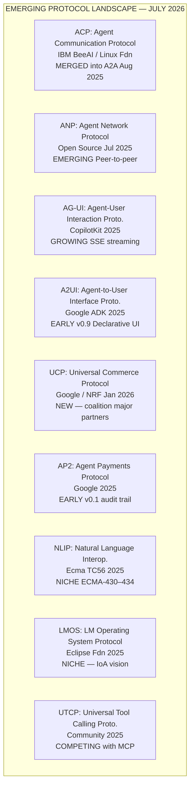

&gt; **Note on ACP:** IBM's Agent Communication Protocol merged into A2A in August 2025 under Linux Foundation governance. Where ACP design choices survive as A2A features, they are noted. ACP's REST-native message envelope and BeeAI's Python SDK influenced A2A's task state machine and artifact model.

---

## 3.1 Security Architecture Comparison

### 3.1.1 Threat Model Overview

All 9 protocols operate within the same broad threat surface: an untrusted network, AI agents that may be manipulated through prompt injection, tool servers that may be compromised, and downstream actions (financial transactions, UI rendering, data exfiltration) that carry real-world consequences.

The threat categories that apply across the stack:

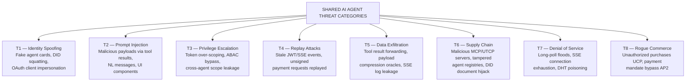

### 3.1.2 Security Architecture Comparison Matrix

| Dimension | ACP (→A2A legacy) | ANP | AG-UI | A2UI | UCP | AP2 | NLIP | LMOS | UTCP |
|---|---|---|---|---|---|---|---|---|---|
| **Auth Model** | OAuth 2.1 (declared in Agent Card) | DID-based + DIDComm encrypted channel | Bearer token (delegated from host) | OAuth 2.0 / API Key (Google ADK) | OAuth 2.1 + merchant API keys | OAuth 2.1 + PaymentMandate signing | Bearer / session token (undefined) | OAuth 2.1 + SPIFFE (proposed) | API Key / Bearer (spec draft) |
| **Mutual Auth** | Server-side only (A2A RC); mTLS optional | DID-to-DID: both sides cryptographically verified | None specified; relies on TLS | One-way TLS to Google ADK endpoint | Merchant mTLS optional; buyer OAuth | Mandate: cryptographic sender + receiver verification | Not specified | mTLS + SPIFFE SVID (proposed) | Not specified |
| **Encryption** | TLS 1.3 (transport) | DIDComm: end-to-end encryption at message level | TLS 1.3 | TLS 1.3 | TLS 1.3 | TLS 1.3 + message-level signing | TLS 1.3 (assumed) | TLS 1.3 + mTLS | TLS 1.3 (assumed) |
| **Message Signing** | Not mandated | Ed25519 / secp256k1 via DID key | Not specified | Not specified | Optional per merchant | Mandatory: PaymentMandate cryptographically signed | Not specified | Proposed via W3C VC | Not specified |
| **Replay Protection** | JWT `jti` + `exp` (OAuth tokens) | DIDComm `created_time` + `expires_time` | SSE stream IDs (best-effort) | State nonce per session | Order idempotency key | Mandate `nonce` + timestamp + TTL | Not specified | Proposed token binding | Not specified |
| **Identity Model** | OAuth 2.1 client + subject claim | W3C DID (did:web, did:key, did:peer) | Inherited from host app session | Google identity / ADK service account | Merchant ID + buyer OAuth principal | Principal hierarchy: Shopping Agent + Merchant + Credentials Provider | Session principal (NL-based) | DID + SPIFFE + X.509 | API Key principal |
| **Zero Trust Compat.** | Partial (OAuth scopes, no continuous verification) | Strong (cryptographic identity per message) | Weak (trusts host app session) | Partial (Google IAM boundary) | Partial (merchant boundary enforcement) | Strong (cryptographic mandate per transaction) | Weak (no formal model) | Strong (proposed continuous verification) | Weak |
| **Supply Chain Security** | Agent Card signing (proposed in A2A RC) | DID document integrity (W3C spec) | npm/pip package trust (community) | Google ADK provenance | NRF registry + merchant certification | Google-signed mandate schema | Ecma spec only | Eclipse artifact signing | npm package trust |
| **Primary Threat** | T1: Agent card spoofing | T6: DID document hijack | T2: Injected SSE events to frontend | T2: Malicious UI component injection | T8: Unauthorized cart/order | T8: Mandate bypass / replayed transactions | T2: NL injection through messages | T1: Identity spoofing in IoA mesh | T6: Malicious tool server |

### 3.1.3 Narrative Assessment

**Strongest security posture (July 2026):** ANP and AP2 lead the field. ANP's DID-based architecture provides cryptographic identity at the message level — every message is signed by a verifiable DID key, enabling true peer-to-peer trust without a central broker. AP2's PaymentMandate model enforces cryptographic proof of intent before any financial transaction, with configurable guardrails and an immutable audit trail — the strongest design for high-stakes autonomous actions.

**Adequate for enterprise with hardening:** ACP/A2A (via A2A v1.0), UCP, and LMOS (when fully implemented) are enterprise-deployable with appropriate gateway hardening, token scope reduction, and audit logging. They rely on OAuth 2.1, which is a well-understood enterprise standard.

**Requires significant hardening before production:** AG-UI, A2UI, NLIP, and UTCP lack formal security models in their current specifications. AG-UI's SSE stream is trusted by the frontend application without message-level authentication — a significant risk when AI agents stream tool calls and state updates to browser clients. UTCP inherits MCP's security surface (prompt injection via tool results) without MCP's 2026 security hardening work.

:::warning Security Gap
Neither AG-UI nor UTCP define mandatory authentication or message integrity controls in their current specifications. Enterprises deploying these protocols must implement transport-level controls (mTLS gateway, WAF rules) and message validation at the application layer. Do not deploy AG-UI endpoints directly to browsers without a backend-for-frontend (BFF) proxy that validates origin and sanitizes SSE events.
:::

---

## 3.2 Identity and Trust

### 3.2.1 Identity Model Taxonomy

The 9 protocols span four distinct identity paradigms:

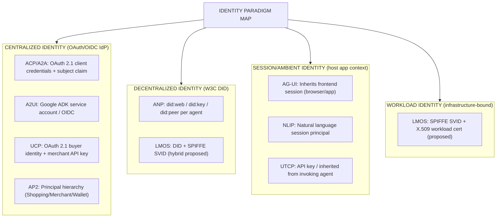

### 3.2.2 Trust Establishment Comparison

| Protocol | Trust Model | Trust Establishment Mechanism | Trust Federation | Reputation/Scoring |
|---|---|---|---|---|
| **ACP→A2A** | OAuth 2.1 delegated trust | Agent Card at `/.well-known/agent-card.json`; OAuth client registration | Via shared IdP (Entra ID, Okta, etc.) | None specified |
| **ANP** | Cryptographic peer trust | DID document resolution + key verification; meta-protocol handshake | Via DID method (did:web → DNS; did:ion → Bitcoin) | Emerging: verifiable claims on DID doc |
| **AG-UI** | Ambient session trust | Host app session (cookie / bearer token propagation) | Via host app's IdP | None |
| **A2UI** | Google IAM trust | ADK service account + project-level IAM binding | Google Workspace federation | None |
| **UCP** | Merchant certification trust | NRF registry membership + OAuth 2.1 client credential | Via NRF coalition governance | Merchant rating (proposed) |
| **AP2** | Cryptographic mandate trust | PaymentMandate signed by all principals; IntentMandate scope binding | Via AP2 mandate chain | Transaction history (immutable ledger) |
| **NLIP** | Standards body implied trust | Ecma International membership / spec compliance | Undefined | None |
| **LMOS** | IoA mesh trust | DID + SPIFFE + certificate authority chain | Eclipse IoA registry (proposed) | Agent reputation registry (proposed) |
| **UTCP** | API key trust | Shared secret / bearer token | Via gateway proxy | None |

### 3.2.3 Decentralized Identifiers (DIDs) — ANP and LMOS

ANP's use of W3C DIDs (spec: https://www.w3.org/TR/did-core/) is the most architecturally significant identity innovation among the 9 protocols. A DID is a URI that resolves to a DID Document containing public keys, service endpoints, and verification methods — without requiring any central registry.

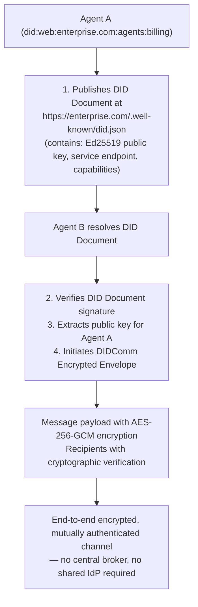

**Enterprise implication:** ANP's DID model is the only protocol among the 9 that enables true cross-organizational agent trust without a shared IdP. For multi-cloud, multi-partner deployments, this is architecturally superior. The barrier is operational: DID document management, key rotation, and revocation require new operational tooling that most enterprise identity teams do not currently have.

### 3.2.4 SPIFFE Workload Identity — LMOS

LMOS's proposed SPIFFE (Secure Production Identity Framework for Everyone — https://spiffe.io) integration represents the most cloud-native identity model:

- Each LMOS agent receives a SPIFFE Verifiable Identity Document (SVID) — an X.509 certificate with a SPIFFE URI in the SAN field (e.g., `spiffe://enterprise.com/agent/procurement`)
- SVIDs are rotated automatically (short-lived: 1–24 hours) by a SPIFFE-compatible workload identity platform (SPIRE, Istio, HashiCorp Vault, AWS ROSA)
- No long-lived API keys or static credentials
- mTLS between agents is automatic when both sides present SVIDs

:::tip SPIFFE for Enterprise
For enterprises already running Istio or Linkerd service mesh, LMOS's SPIFFE model maps directly onto existing workload identity infrastructure. SPIFFE SVIDs eliminate the credential rotation problem that plagues API key-based protocols (UTCP, AG-UI). If your organisation is evaluating LMOS, prioritize SPIRE integration in your proof-of-concept.
:::

### 3.2.5 Verifiable Credentials (VCs)

W3C Verifiable Credentials (https://www.w3.org/TR/vc-data-model-2.0/) — cryptographically signed attestations about an entity — are referenced in ANP and LMOS specifications but not yet mandated. Their most natural enterprise use cases across the protocol stack:

| Use Case | Protocol(s) | VC Type |
|---|---|---|
| Agent capability attestation | ANP, LMOS | CapabilityCredential (custom type) |
| Merchant compliance certification | UCP | ComplianceCredential (NRF schema) |
| Payment mandate authorization | AP2 | PaymentAuthorizationCredential |
| Human identity delegation to agent | A2A, ACP | DelegationCredential (RFC 8693 analog) |
| Regulatory compliance evidence | LMOS | ComplianceEvidenceCredential |

---

## 3.3 Authentication Patterns

### 3.3.1 Authentication Method Matrix

| Auth Method | ACP/A2A | ANP | AG-UI | A2UI | UCP | AP2 | NLIP | LMOS | UTCP |
|---|---|---|---|---|---|---|---|---|---|
| **OAuth 2.1 Auth Code + PKCE** | ✓ Primary | — | Optional | Optional | ✓ (buyer) | ✓ (buyer) | — | Proposed | — |
| **OAuth 2.1 Client Credentials** | ✓ Primary | — | — | ✓ ADK SA | ✓ (merchant) | ✓ (merchant) | — | ✓ Proposed | — |
| **OIDC (ID Token)** | ✓ Agent Card declared | — | Optional | ✓ Google OIDC | Optional | Optional | — | Proposed | — |
| **mTLS (client cert)** | Optional (RC) | Optional (DID) | — | — | Optional | Proposed | — | ✓ Proposed | — |
| **DID Authentication** | — | ✓ Primary | — | — | — | — | — | ✓ Proposed | — |
| **DIDComm (encrypted msg)** | — | ✓ Primary | — | — | — | — | — | Proposed | — |
| **JWT Bearer (RFC 7523)** | ✓ (service-to-svc) | — | ✓ (delegated) | ✓ | ✓ | ✓ | — | ✓ | Optional |
| **PASETO** | — | — | — | — | — | — | — | — | — |
| **API Key** | Fallback | — | Fallback | Fallback | ✓ (merchant) | — | Fallback | — | ✓ Primary |
| **Hardware-backed Identity** | — | ✓ (HSM key in DID) | — | — | — | Proposed (HSM mandate signing) | — | ✓ (TPM SVID) | — |
| **Workload Identity (SPIFFE)** | — | — | — | — | — | — | — | ✓ Proposed | — |
| **Managed Identity (cloud)** | ✓ (via Entra/AWS) | — | ✓ (via host) | ✓ (GCP) | ✓ (GCP/AWS) | ✓ (GCP) | — | ✓ | — |

**Legend:** ✓ = supported/specified, Proposed = in spec roadmap, Optional = not mandated, — = not applicable

### 3.3.2 OAuth 2.1 Flow Patterns by Protocol

**ACP/A2A — Agent Card Declared Auth:**

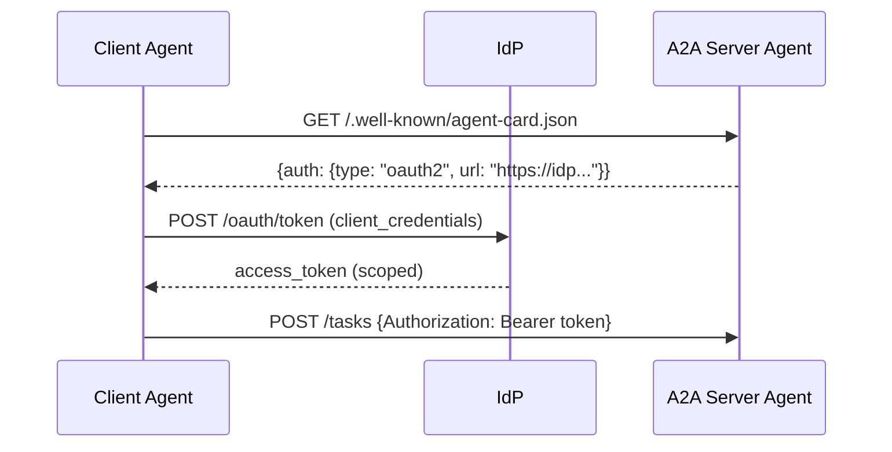

**AP2 — Mandate-Chained Auth:**

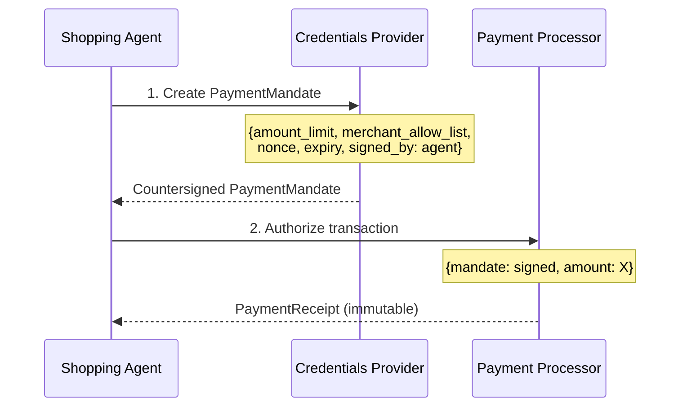

### 3.3.3 Protocol-Specific Authentication Weaknesses

| Protocol | Weakness | Mitigation |
|---|---|---|
| **AG-UI** | No defined auth for SSE stream events — frontend trusts all events from the connected stream | Enforce origin pinning + CORS; implement BFF proxy with token validation |
| **A2UI** | ADK service account may have broad GCP project permissions | Principle of least privilege: create dedicated SA per UI agent; restrict to specific ADK APIs |
| **NLIP** | No authentication model specified; relies on transport-level session | Implement mandatory API gateway authentication before NLIP endpoints |
| **UTCP** | API keys in plaintext headers without rotation policy | Use short-lived tokens via OAuth 2.0 client credentials instead; enforce key rotation via secrets manager |
| **LMOS** | SPIFFE integration is proposed, not implemented — current deployments fall back to API keys | Do not deploy LMOS in production without explicit workload identity enforcement |

---

## 3.4 Authorization Models

### 3.4.1 Authorization Framework Matrix

| Protocol | Primary AuthZ Model | Policy Language | Enforcement Point | Policy Distribution |
|---|---|---|---|---|
| **ACP→A2A** | RBAC + scope-based (OAuth) | OAuth scopes + custom role claims | Token validation at A2A server | IdP + Agent Card declared scopes |
| **ANP** | Capability-based (DID) | DID Document capability section | DID key verification at message receipt | DID Document (on-chain or DNS-hosted) |
| **AG-UI** | Ambient (inherits host session) | Host application RBAC | Host application middleware | Centralized IdP |
| **A2UI** | Google IAM (ABAC) | IAM policy (resource + principal + condition) | Google IAM at ADK layer | GCP IAM console / Terraform |
| **UCP** | RBAC + merchant certification | NRF protocol schema + merchant tier | UCP gateway / NRF registry | NRF coalition governance |
| **AP2** | PBAC (mandate-scoped) | PaymentMandate + IntentMandate JSON schema | Mandate validator in Payment Processor | Mandate chain (per-transaction) |
| **NLIP** | Session-based (undefined) | Natural language intent (no formal policy) | Application layer | Not specified |
| **LMOS** | ABAC + ReBAC (proposed) | OPA (Open Policy Agent) Rego (proposed) | LMOS sidecar proxy | OPA bundle distribution |
| **UTCP** | API key scope (rudimentary) | Tool definition schema (allowed tool list) | Tool server validation | Static configuration |

### 3.4.2 Policy Model Deep Dives

**OPA (Open Policy Agent) — LMOS Proposed:**

LMOS's proposed use of OPA (https://www.openpolicyagent.org/) is the most sophisticated authorization model among the 9 protocols. Rego policies can encode complex ABAC and ReBAC rules:

```rego
# LMOS agent authorization policy example
package lmos.agent.authz

import future.keywords.if
import future.keywords.in

# Allow agent-to-agent tool call if:
# 1. Caller has a valid SPIFFE SVID
# 2. Caller's service name is in the allow-list for the target tool
# 3. Data classification of tool output <= caller's clearance level

default allow := false

allow if {
    input.identity.type == "spiffe"
    input.identity.spiffe_uri in data.tool_access_rules[input.tool.name].allowed_callers
    data.classification_level[input.tool.data_class] <= data.clearance[input.identity.spiffe_uri]
}
```

**AP2 PaymentMandate — PBAC in Practice:**

AP2 implements Policy-Based Access Control at the transaction layer — not through a traditional policy engine, but through cryptographically enforced mandate documents:

```json
{
  "type": "PaymentMandate",
  "version": "0.1",
  "nonce": "uuid-v4",
  "issued_at": "2026-07-11T10:00:00Z",
  "expires_at": "2026-07-11T10:05:00Z",
  "principal": {
    "shopping_agent": "did:web:enterprise.com:agents:procurement",
    "on_behalf_of": "user:alice@enterprise.com"
  },
  "spending_controls": {
    "max_amount": {"value": 5000, "currency": "USD"},
    "merchant_allow_list": ["amazon.com", "staples.com"],
    "category_block_list": ["gambling", "adult"],
    "require_human_approval_above": 1000
  },
  "signatures": {
    "agent": "&lt;ed25519-sig&gt;",
    "credentials_provider": "&lt;ed25519-sig&gt;"
  }
}
```

**Cedar (AWS) and OpenFGA — Cross-Protocol Applicability:**

Cedar (https://cedarpolicy.com) and OpenFGA (https://openfga.dev) are not referenced in any of the 9 protocol specifications, but both are strong candidates for enterprise authorization overlays:

| Framework | Best Fit Protocols | Rationale |
|---|---|---|
| **Cedar** | UCP, AP2, A2A | Cedar's attribute-based model maps well to commerce/payment agent permissions; formally verified policy language; AWS native |
| **OpenFGA** | LMOS, ANP, A2A | ReBAC model (who has relation X to object Y) maps well to multi-agent delegation chains and IoA mesh |
| **OPA** | LMOS, UTCP, AG-UI | Flexible Rego policies work for any protocol; already in wide enterprise use; strong CNCF ecosystem integration |

### 3.4.3 Policy Lifecycle Across Protocols

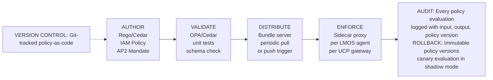

---

## 3.5 Networking Architecture

### 3.5.1 Network Topology by Protocol

| Protocol | Topology | Discovery Mechanism | Routing | NAT/Firewall Compatibility |
|---|---|---|---|---|
| **ACP→A2A** | Client-server (HTTP) | DNS + `/.well-known/agent-card.json` | Direct HTTP to declared endpoint | Excellent: standard HTTPS port 443 |
| **ANP** | Peer-to-peer | DID resolution (DNS for did:web; DHT for did:ion) | Direct peer connection after DID resolution | Moderate: DHT requires UDP; did:web works over HTTPS |
| **AG-UI** | Client-server (SSE) | Configured frontend endpoint | HTTP SSE from backend to frontend | Excellent: SSE over HTTPS port 443 |
| **A2UI** | Client-server (ADK) | Google ADK service registry | ADK → GCP routing | Excellent: GCP endpoints on 443 |
| **UCP** | Client-server + federation | NRF merchant registry + DNS | Protocol gateway → merchant REST | Excellent: REST over HTTPS |
| **AP2** | Client-server (mandate chain) | Principal lookup via credential provider | Mandate chain: agent → provider → processor | Excellent: HTTPS throughout |
| **NLIP** | Client-server | Application-level registration | Application layer | Excellent: standard HTTPS |
| **LMOS** | Federated mesh | IoA agent registry + DNS-SD | LMOS routing fabric | Moderate: requires sidecar proxy ports |
| **UTCP** | Client-server | Tool catalog (static or dynamic) | Direct HTTP to tool server | Excellent: HTTPS port 443 |

### 3.5.2 ANP Peer-to-Peer Architecture Deep Dive

ANP's peer-to-peer model is architecturally distinct from all other protocols in this survey:

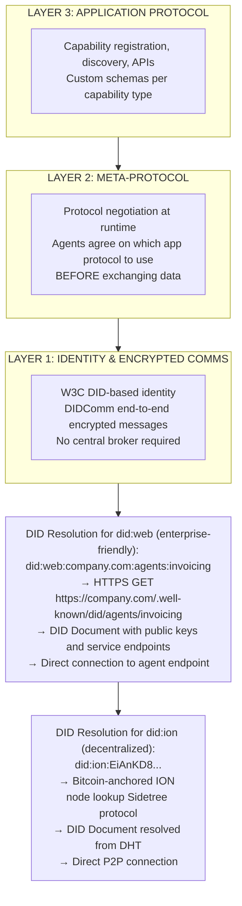

**Enterprise NAT/Firewall Considerations for ANP:**

- `did:web` DIDs resolve over standard HTTPS (port 443) — enterprise-friendly
- `did:ion` / `did:peer` DIDs may require UDP port access for DHT lookups — firewall exception required
- DIDComm messaging can be relayed over HTTPS mediator servers to handle NAT traversal
- Air-gapped environments: `did:web` can be configured against an internal DNS namespace

### 3.5.3 LMOS Internet of Agents Networking

LMOS envisions a three-layer networking stack for the "Internet of Agents":

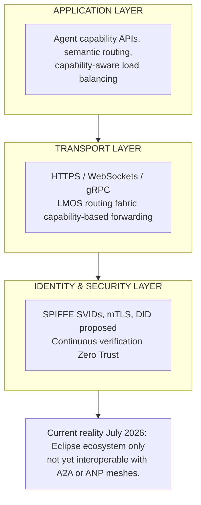

### 3.5.4 Enterprise Networking Decision Framework

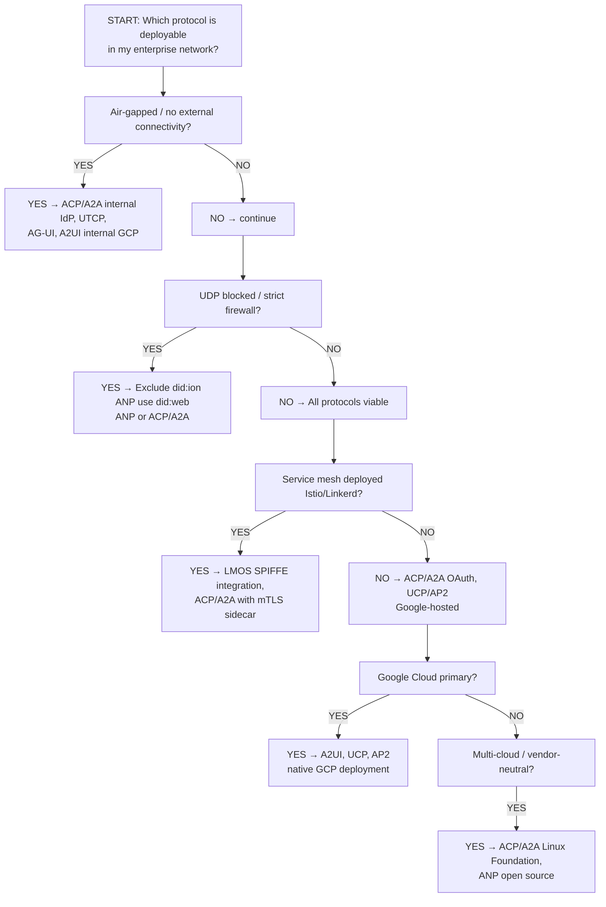

---

## 3.6 Messaging Patterns

### 3.6.1 Messaging Pattern Matrix

| Protocol | Primary Pattern | Transport | Streaming | Bidirectional | Durability | Message Ordering |
|---|---|---|---|---|---|---|
| **ACP→A2A** | Request-Response + async Task | HTTP/1.1 + HTTP/2 | SSE (task status) | No (client initiates) | Task state machine (persistent) | Guaranteed within task |
| **ANP** | Encrypted P2P message | DIDComm over HTTPS | Optional | DIDComm bidirectional | Optional relay storage | Per-message sequence numbers |
| **AG-UI** | Streaming (server push) | SSE (primary) + WebSocket (optional) | Core feature | SSE: server→client only; WS: both | Not specified | SSE event ID ordering |
| **A2UI** | Request-Response | HTTP/REST | Polling or webhook | No | ADK session persistence | Request-response correlation |
| **UCP** | Request-Response | REST/HTTP | No | No | Order idempotency | Per-order sequence |
| **AP2** | Request-Response + mandate chain | HTTP/REST | No | No (mandate is atomic) | Immutable receipt | Mandate chain ordering |
| **NLIP** | Request-Response (NL) | HTTP/REST (assumed) | Optional NL stream | No | Session state | Session-scoped |
| **LMOS** | Request-Response + pub/sub | HTTP/gRPC/WebSocket | gRPC streaming | gRPC bidirectional | Proposed: message queue integration | gRPC sequence |
| **UTCP** | Request-Response | HTTP/REST | No | No | Not specified | Not specified |

### 3.6.2 AG-UI Streaming Architecture

AG-UI is the only protocol in this survey purpose-built for real-time streaming from backend agent to frontend application. Its SSE-based architecture deserves detailed treatment:

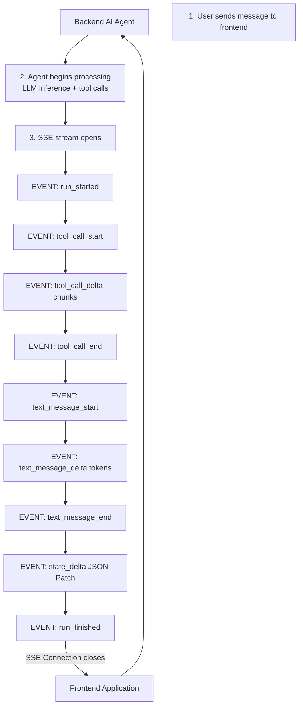

**AG-UI Event Catalog (core events):**

| Event Type | Direction | Purpose |
|---|---|---|
| `run_started` | Agent → Frontend | Signals start of agent run |
| `run_finished` | Agent → Frontend | Signals completion |
| `run_error` | Agent → Frontend | Error with details |
| `text_message_start/delta/end` | Agent → Frontend | Streaming LLM text output |
| `tool_call_start/delta/end` | Agent → Frontend | Tool invocation visibility |
| `state_delta` | Agent → Frontend | JSON Patch to shared agent state |
| `messages_snapshot` | Agent → Frontend | Full message history sync |
| `custom` | Agent → Frontend | Protocol extension point |
| `human_turn_started` | Frontend → Agent | Human interrupt / clarification |

### 3.6.3 A2A Task Lifecycle — Messaging State Machine

ACP's REST-native message envelope design (before merger) influenced A2A's task state machine, which is now the most complete async messaging model among the 9 protocols:

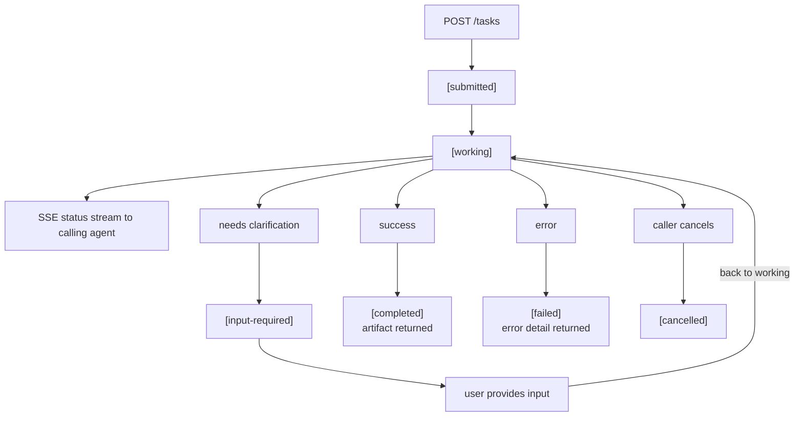

### 3.6.4 Retry Semantics and Durability

| Protocol | Retry Semantics | Timeout Behavior | Durability Model |
|---|---|---|---|
| **A2A** | Client retries task submission; idempotency via task ID | Task TTL declared in Agent Card | Persistent: task state survives agent restart |
| **ANP** | DIDComm retry via mediator; message expiry in envelope | `expires_time` in DIDComm header | Optional: mediator relay stores until delivery |
| **AG-UI** | SSE auto-reconnect (EventSource spec); `Last-Event-ID` header for resume | Connection timeout: SSE keepalive | Not durable: reconnect replays from last event ID |
| **UCP** | Idempotency key per order operation | HTTP timeout per merchant SLA | Order state persisted at UCP gateway |
| **AP2** | Mandate is atomic; retry with same nonce is rejected | Mandate expiry (short TTL: 5 min recommended) | Immutable: PaymentReceipt permanently stored |
| **UTCP** | HTTP retry with exponential backoff | Caller-defined timeout | Not specified |
| **LMOS** | Proposed: at-least-once with deduplication | Per-agent configurable | Proposed: message queue (Kafka/NATS) |

---

## 3.7 Payload Design

### 3.7.1 Serialization and Schema Matrix

| Protocol | Primary Serialization | Schema Format | Binary Support | Compression | Max Payload | Schema Evolution |
|---|---|---|---|---|---|---|
| **ACP→A2A** | JSON (JSON-RPC 2.0) | JSON Schema (declared in Agent Card) | Base64 in JSON artifacts | gzip (HTTP) | Practical: ~10MB (HTTP body) | Additive; version in spec |
| **ANP** | JSON-LD + DIDComm | JSON-LD context + DID Document schema | DIDComm attachments | gzip | Not specified | JSON-LD context versioning |
| **AG-UI** | JSON (SSE events) | TypeScript types (reference impl) | Base64 in event payload | HTTP gzip | Per-event: ~1MB practical | Additive event types; `custom` extension |
| **A2UI** | JSON (declarative component tree) | 18 component primitive schema | Image URLs (not inline) | HTTP gzip | Component tree: ~500KB practical | Versioned component spec (v0.9) |
| **UCP** | JSON (REST) | OpenAPI 3.x (NRF defined) | Not applicable | HTTP gzip | Order payload: ~1MB | Semantic versioning; additive fields |
| **AP2** | JSON | JSON Schema (mandate + receipt) | Not applicable | HTTP gzip | Mandate: ~10KB | Mandate version field |
| **NLIP** | JSON / natural language text | Ecma-defined (ECMA-430–434, published Dec 2025) | Not specified | Not specified | Not specified | Ecma standards process |
| **LMOS** | JSON + gRPC/Protobuf (proposed) | Protobuf IDL + JSON Schema | Protobuf bytes | gzip + Brotli | Per-capability | Protobuf field numbering |
| **UTCP** | JSON | Tool definition schema | Base64 | HTTP gzip | Tool-defined | Schema version in tool descriptor |

### 3.7.2 A2UI Declarative Component Model

A2UI's payload design is unique: rather than streaming text, the agent returns a declarative JSON component tree that the frontend renders:

```json
{
  "version": "0.9",
  "layout": {
    "type": "column",
    "children": [
      {
        "type": "text",
        "content": "Purchase Order Summary",
        "style": "heading"
      },
      {
        "type": "row",
        "children": [
          {"type": "label", "text": "Vendor"},
          {"type": "text", "content": "Acme Corp", "style": "body"}
        ]
      },
      {
        "type": "button",
        "label": "Approve",
        "action": {
          "type": "submit",
          "payload": {"decision": "approved", "po_id": "PO-2026-001"}
        }
      }
    ]
  }
}
```

The 18 safe primitives are: `text`, `label`, `button`, `row`, `column`, `card`, `list`, `list_item`, `divider`, `image`, `link`, `input`, `select`, `checkbox`, `radio`, `date_picker`, `progress`, `badge`.

:::warning A2UI Security
A2UI's component model deliberately excludes `script`, `iframe`, `style`, and arbitrary HTML to prevent XSS attacks. Any A2UI implementation that allows arbitrary HTML rendering in the component tree violates the protocol's safety model. Validate all component types against the allowlist before rendering — do not trust agent-generated JSON blindly.
:::

### 3.7.3 Chunking and Streaming Payload Patterns

**AG-UI Text Streaming (token-by-token):**

```
data: {"type": "text_message_start", "message_id": "msg-001", "role": "assistant"}

data: {"type": "text_message_delta", "message_id": "msg-001", "delta": {"content": "The"}}
data: {"type": "text_message_delta", "message_id": "msg-001", "delta": {"content": " vendor"}}
data: {"type": "text_message_delta", "message_id": "msg-001", "delta": {"content": " invoice"}}
...
data: {"type": "text_message_end", "message_id": "msg-001"}
```

**LMOS gRPC Streaming (proposed):**

```protobuf
service AgentService {
  rpc ExecuteCapability(CapabilityRequest)
    returns (stream CapabilityResponse);

  rpc StreamingCapability(stream CapabilityRequest)
    returns (stream CapabilityResponse);
}

message CapabilityResponse {
  string agent_id = 1;
  bytes payload = 2;
  ResponseMetadata metadata = 3;
  bool is_final = 4;
}
```

---

## Navigation

**Next part:** [Cross-Cutting Architecture (Part 2) — Versioning, Compatibility, Failure Handling, Observability & Compliance](pathname:///archon/protocols/parts/20-emerging-protocols-crosscutting-part2.md)
